# 平台特定配置

<cite>
**本文档引用的文件**
- [config.example.yaml](file://backend/config.example.yaml)
- [config.go](file://backend/internal/config/config.go)
- [config.web.ts](file://mobile/src/utils/config.web.ts)
- [vite.config.ts (移动端)](file://mobile/vite.config.ts)
- [vite.config.ts (管理端)](file://admin/vite.config.ts)
- [阿里云短信配置说明.md](file://backend/docs/阿里云短信配置说明.md)
- [.xcode.env](file://mobile/ios/.xcode.env)
- [.xcode.env.local](file://mobile/ios/.xcode.env.local)
- [local.properties](file://mobile/android/local.properties)
- [docker-compose.yml](file://docker/docker-compose.yml)
</cite>

## 目录
1. [简介](#简介)
2. [项目结构](#项目结构)
3. [核心配置组件](#核心配置组件)
4. [架构概览](#架构概览)
5. [详细组件分析](#详细组件分析)
6. [依赖关系分析](#依赖关系分析)
7. [性能考虑](#性能考虑)
8. [故障排除指南](#故障排除指南)
9. [结论](#结论)

## 简介

本文档详细介绍了无人机租赁平台的平台特定配置系统。该平台采用多环境、多组件的配置管理模式，涵盖了后端Go服务、移动端React Native应用、管理端React应用以及基础设施容器化部署。

平台配置系统的核心特点包括：
- **分层配置管理**：支持开发、测试、生产多环境配置
- **组件化配置**：针对不同组件提供专门的配置选项
- **环境变量覆盖**：支持运行时环境变量动态覆盖
- **配置验证机制**：内置配置完整性验证和安全性检查
- **容器化部署**：通过Docker Compose实现基础设施配置

## 项目结构

平台配置涉及多个层面的配置文件和环境设置：

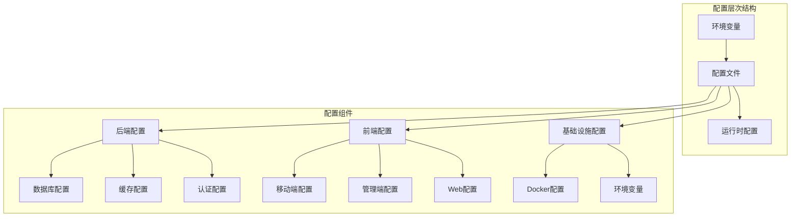

**图表来源**
- [config.example.yaml:1-338](file://backend/config.example.yaml#L1-L338)
- [config.go:16-521](file://backend/internal/config/config.go#L16-L521)

**章节来源**
- [config.example.yaml:1-338](file://backend/config.example.yaml#L1-L338)
- [config.go:1-521](file://backend/internal/config/config.go#L1-L521)

## 核心配置组件

### 后端配置系统

后端采用Go语言的Viper库实现配置管理，支持YAML格式配置文件和环境变量覆盖。

#### 配置数据结构

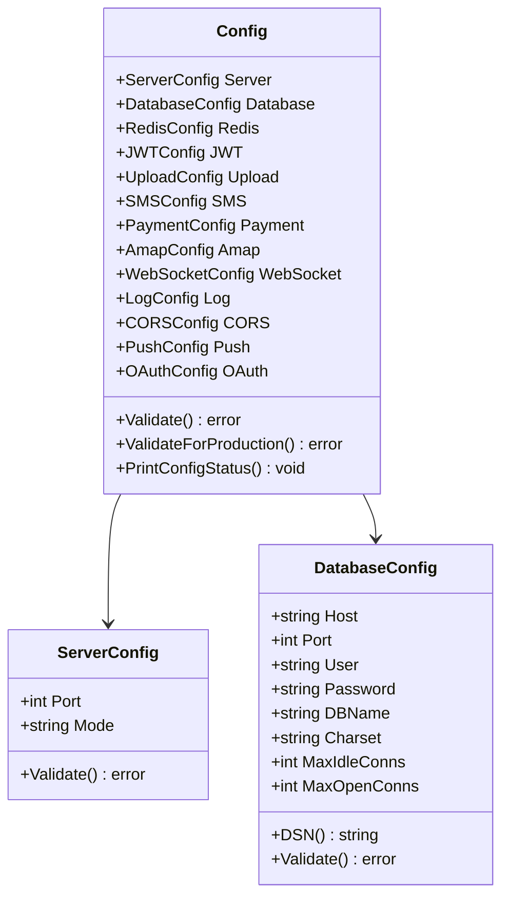

**图表来源**
- [config.go:16-126](file://backend/internal/config/config.go#L16-L126)

#### 配置加载流程

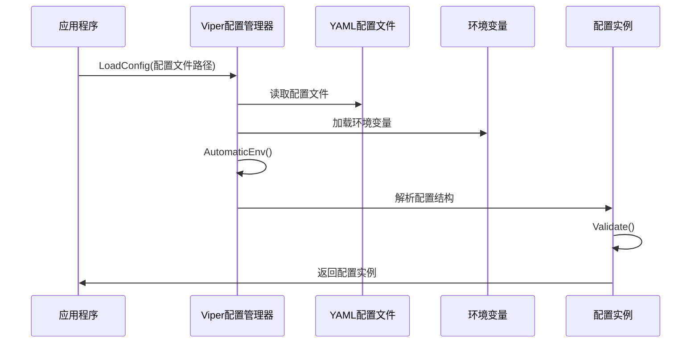

**图表来源**
- [config.go:415-435](file://backend/internal/config/config.go#L415-L435)

**章节来源**
- [config.go:16-521](file://backend/internal/config/config.go#L16-L521)

### 前端配置系统

前端采用React Native + Vite的混合配置方案，支持Web端和原生端的不同配置需求。

#### 移动端配置

移动端配置通过Vite的别名机制实现跨平台兼容：

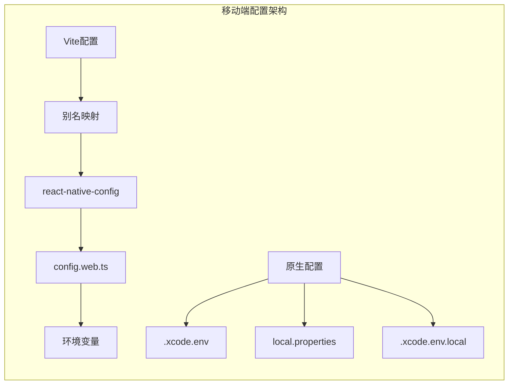

**图表来源**
- [vite.config.ts (移动端):1-37](file://mobile/vite.config.ts#L1-L37)
- [config.web.ts:1-26](file://mobile/src/utils/config.web.ts#L1-L26)

#### 管理端配置

管理端配置专注于开发服务器代理和构建优化：

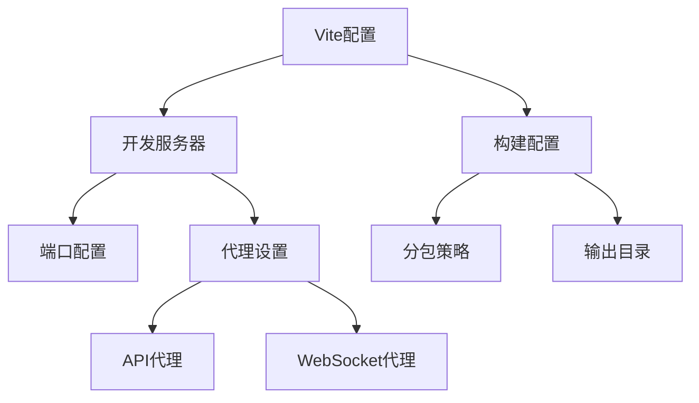

**图表来源**
- [vite.config.ts (管理端):1-64](file://admin/vite.config.ts#L1-L64)

**章节来源**
- [config.web.ts:1-26](file://mobile/src/utils/config.web.ts#L1-L26)
- [vite.config.ts (移动端):1-37](file://mobile/vite.config.ts#L1-L37)
- [vite.config.ts (管理端):1-64](file://admin/vite.config.ts#L1-L64)

### 基础设施配置

基础设施配置通过Docker Compose实现，提供标准化的服务部署方案。

#### Docker配置结构

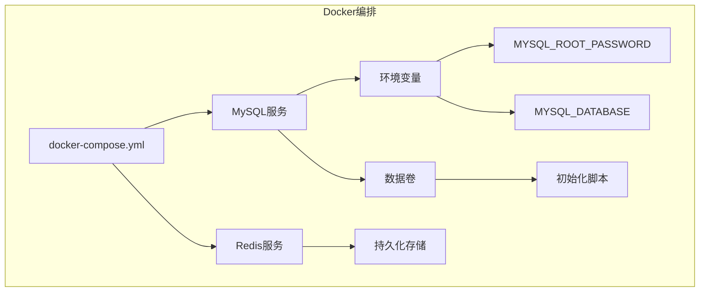

**图表来源**
- [docker-compose.yml:1-27](file://docker/docker-compose.yml#L1-L27)

**章节来源**
- [docker-compose.yml:1-27](file://docker/docker-compose.yml#L1-L27)

## 架构概览

平台配置架构采用分层设计，确保各组件间的配置一致性与独立性。

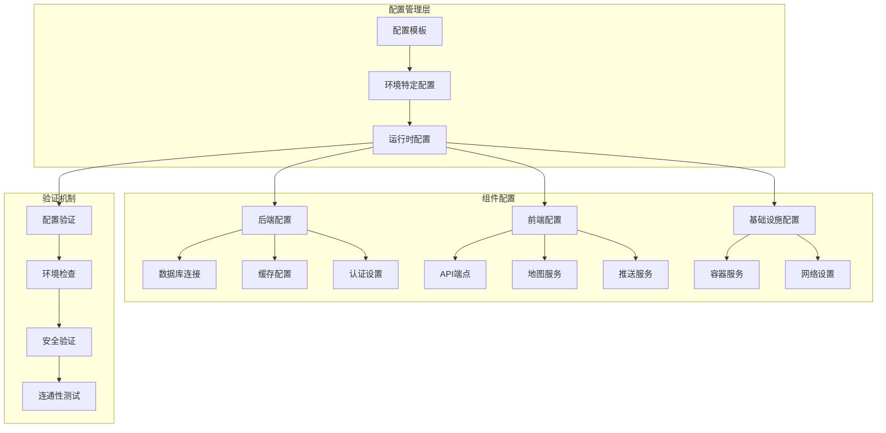

**图表来源**
- [config.example.yaml:1-338](file://backend/config.example.yaml#L1-L338)
- [config.go:437-489](file://backend/internal/config/config.go#L437-L489)

## 详细组件分析

### 后端配置组件

#### 数据库配置

数据库配置支持完整的连接参数设置，包括连接池管理和字符集配置：

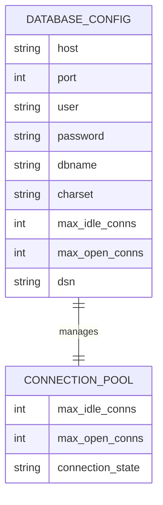

**图表来源**
- [config.go:61-95](file://backend/internal/config/config.go#L61-L95)

#### 安全配置

JWT配置提供完整的认证令牌管理机制：

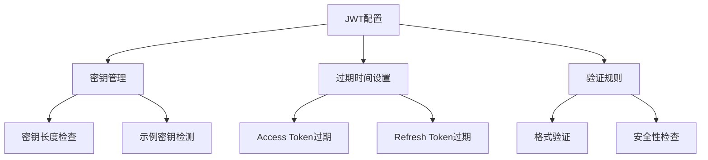

**图表来源**
- [config.go:132-162](file://backend/internal/config/config.go#L132-L162)

**章节来源**
- [config.go:61-162](file://backend/internal/config/config.go#L61-L162)

### 前端配置组件

#### 移动端配置管理

移动端配置通过Vite的别名机制实现跨平台兼容性：

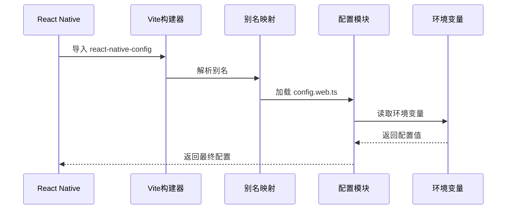

**图表来源**
- [vite.config.ts (移动端):10-18](file://mobile/vite.config.ts#L10-L18)
- [config.web.ts:8-23](file://mobile/src/utils/config.web.ts#L8-L23)

#### 原生开发环境配置

原生iOS和Android开发环境通过专用配置文件管理：

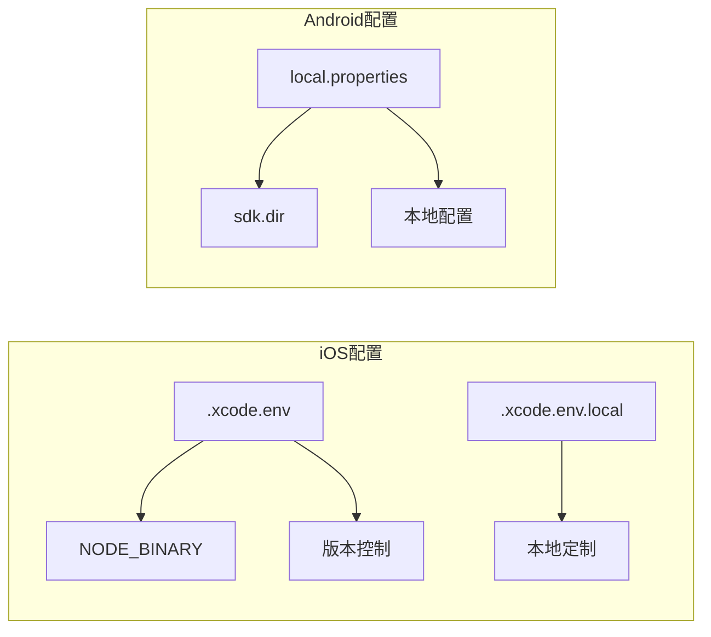

**图表来源**
- [.xcode.env:1-13](file://mobile/ios/.xcode.env#L1-L13)
- [.xcode.env.local:1-2](file://mobile/ios/.xcode.env.local#L1-L2)
- [local.properties:1-8](file://mobile/android/local.properties#L1-L8)

**章节来源**
- [config.web.ts:1-26](file://mobile/src/utils/config.web.ts#L1-L26)
- [vite.config.ts (移动端):1-37](file://mobile/vite.config.ts#L1-L37)
- [.xcode.env:1-13](file://mobile/ios/.xcode.env#L1-L13)
- [.xcode.env.local:1-2](file://mobile/ios/.xcode.env.local#L1-L2)
- [local.properties:1-8](file://mobile/android/local.properties#L1-L8)

### 支付配置组件

支付配置支持多种支付方式，提供灵活的支付解决方案：

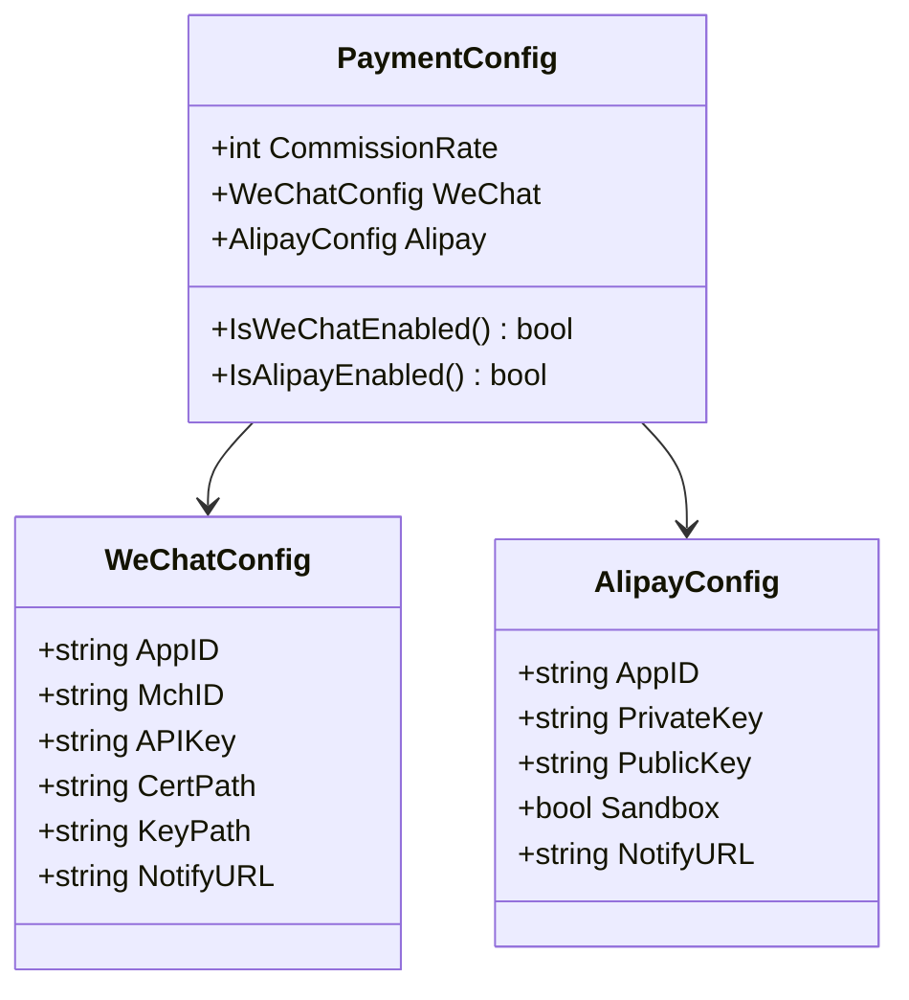

**图表来源**
- [config.go:248-290](file://backend/internal/config/config.go#L248-L290)

**章节来源**
- [config.go:248-290](file://backend/internal/config/config.go#L248-L290)

## 依赖关系分析

平台配置系统的依赖关系体现了清晰的分层架构：

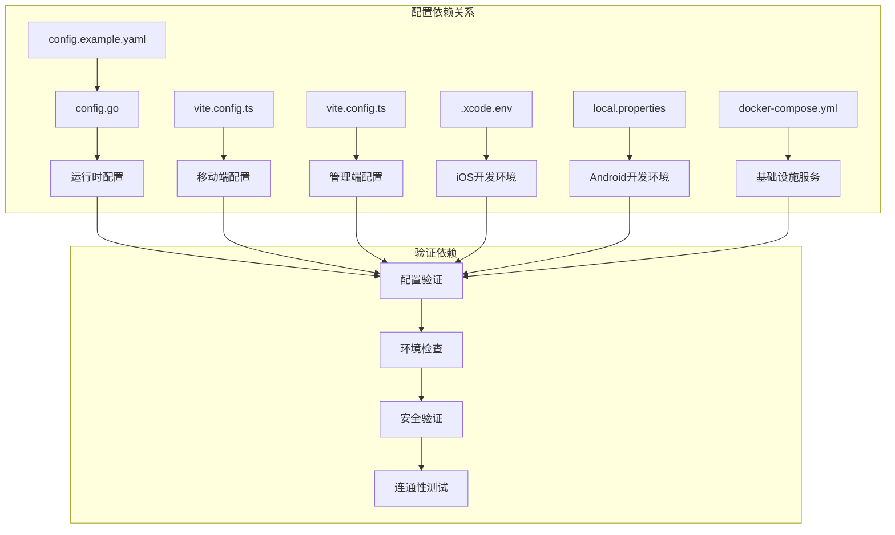

**图表来源**
- [config.example.yaml:1-338](file://backend/config.example.yaml#L1-L338)
- [config.go:437-489](file://backend/internal/config/config.go#L437-L489)
- [vite.config.ts (移动端):1-37](file://mobile/vite.config.ts#L1-L37)
- [vite.config.ts (管理端):1-64](file://admin/vite.config.ts#L1-L64)

**章节来源**
- [config.go:437-489](file://backend/internal/config/config.go#L437-L489)
- [vite.config.ts (移动端):1-37](file://mobile/vite.config.ts#L1-L37)
- [vite.config.ts (管理端):1-64](file://admin/vite.config.ts#L1-L64)

## 性能考虑

平台配置系统在性能方面采用了多项优化措施：

### 配置加载优化
- **延迟加载**：配置文件按需加载，减少启动时间
- **缓存机制**：配置实例缓存，避免重复解析
- **增量验证**：分模块验证配置，提高错误定位效率

### 连接池优化
- **智能连接管理**：根据负载动态调整连接数
- **连接复用**：最大化连接复用率，减少连接开销
- **超时控制**：合理的超时设置，防止资源泄漏

### 缓存策略
- **多级缓存**：内存缓存 + 持久化缓存
- **失效策略**：基于TTL的智能失效机制
- **预热机制**：启动时预热常用配置

## 故障排除指南

### 常见配置问题

#### 数据库连接问题
1. **连接超时**：检查网络连通性和防火墙设置
2. **认证失败**：验证用户名密码和权限配置
3. **连接池耗尽**：调整最大连接数配置

#### 环境变量问题
1. **变量未生效**：确认环境变量命名规范（使用下划线替换点号）
2. **优先级问题**：环境变量优先级高于配置文件
3. **类型转换错误**：确保环境变量类型匹配

#### 证书和密钥问题
1. **SSL证书错误**：检查证书链完整性和有效期
2. **密钥权限问题**：验证密钥文件权限设置
3. **密钥格式错误**：确认密钥格式符合要求

**章节来源**
- [config.go:466-489](file://backend/internal/config/config.go#L466-L489)
- [阿里云短信配置说明.md:1-126](file://backend/docs/阿里云短信配置说明.md#L1-L126)

## 结论

平台特定配置系统通过多层次、组件化的配置管理，为无人机租赁平台提供了灵活、安全、可维护的配置解决方案。系统的主要优势包括：

1. **多环境支持**：完善的开发、测试、生产环境配置管理
2. **组件化设计**：针对不同组件提供专门的配置选项
3. **安全性保障**：内置配置验证和安全检查机制
4. **可扩展性**：支持新的配置组件和第三方服务集成
5. **运维友好**：提供详细的配置文档和故障排除指南

该配置系统为平台的稳定运行和持续发展奠定了坚实的基础，能够满足不同规模和复杂度的业务需求。