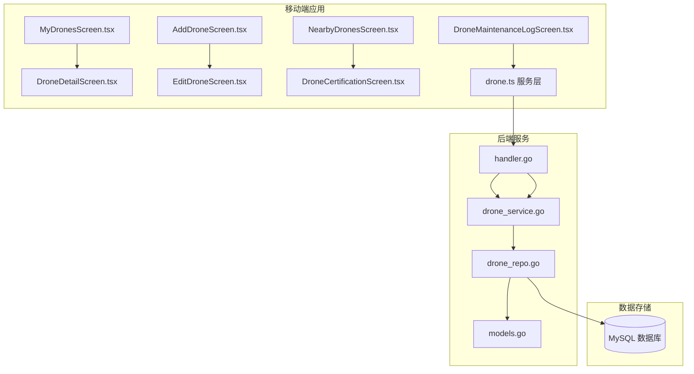
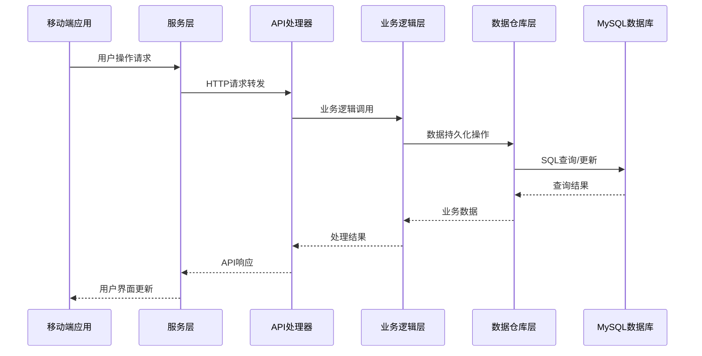
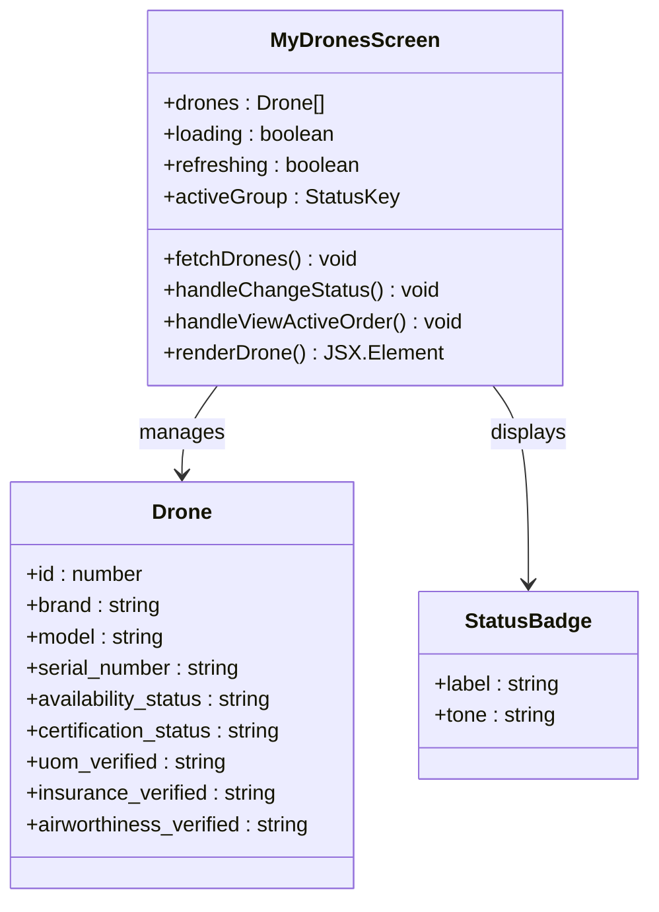
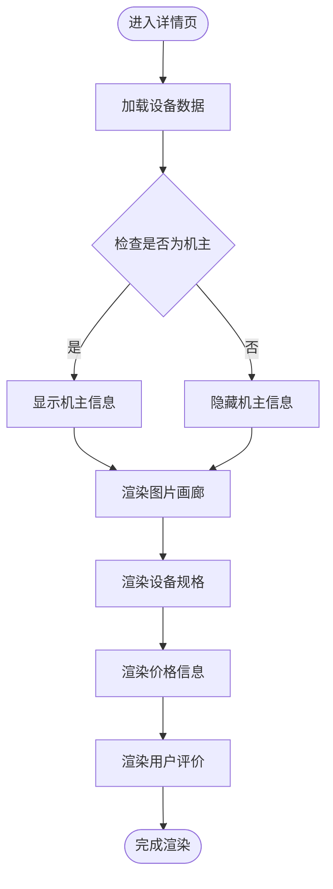
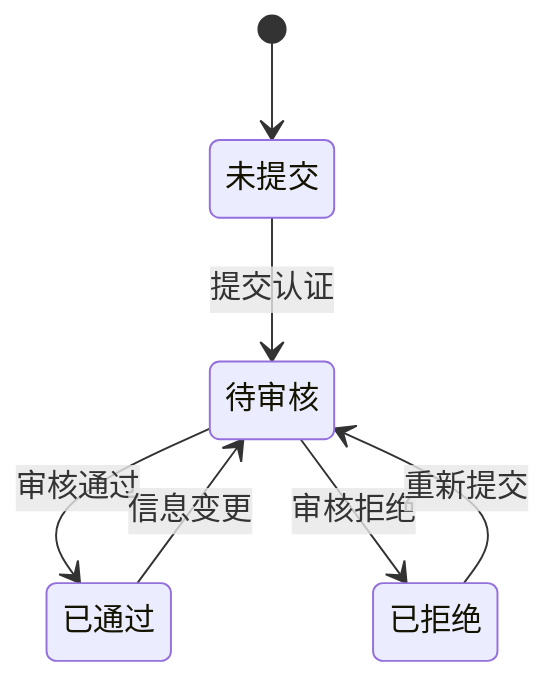
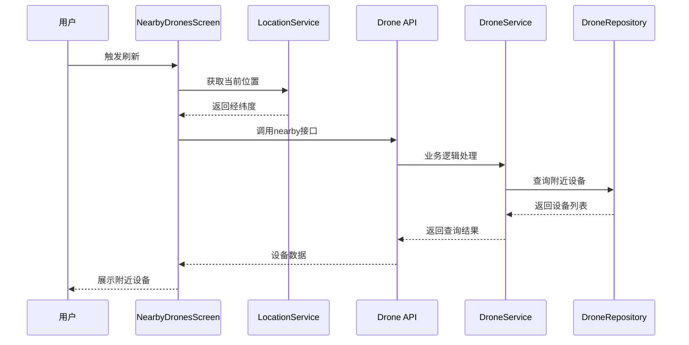
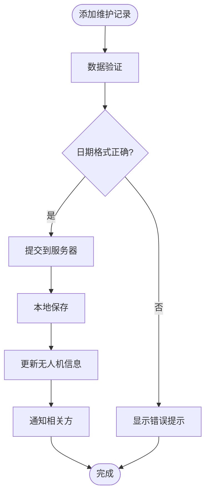
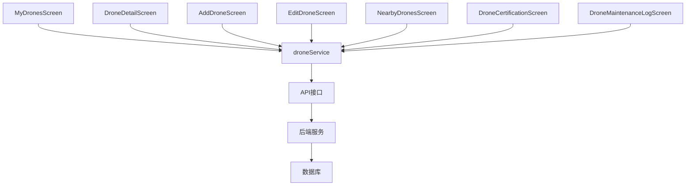

# 无人机管理模块

<cite>
**本文档引用的文件**
- [MyDronesScreen.tsx](file://mobile/src/screens/drone/MyDronesScreen.tsx)
- [DroneDetailScreen.tsx](file://mobile/src/screens/drone/DroneDetailScreen.tsx)
- [AddDroneScreen.tsx](file://mobile/src/screens/drone/AddDroneScreen.tsx)
- [EditDroneScreen.tsx](file://mobile/src/screens/drone/EditDroneScreen.tsx)
- [NearbyDronesScreen.tsx](file://mobile/src/screens/drone/NearbyDronesScreen.tsx)
- [DroneCertificationScreen.tsx](file://mobile/src/screens/drone/DroneCertificationScreen.tsx)
- [DroneMaintenanceLogScreen.tsx](file://mobile/src/screens/drone/DroneMaintenanceLogScreen.tsx)
- [drone.ts](file://mobile/src/services/drone.ts)
- [index.ts](file://mobile/src/types/index.ts)
- [handler.go](file://backend/internal/api/v1/drone/handler.go)
- [drone_service.go](file://backend/internal/service/drone_service.go)
- [drone_repo.go](file://backend/internal/repository/drone_repo.go)
- [models.go](file://backend/internal/model/models.go)
</cite>

## 目录
1. [简介](#简介)
2. [项目结构](#项目结构)
3. [核心组件](#核心组件)
4. [架构概览](#架构概览)
5. [详细组件分析](#详细组件分析)
6. [依赖关系分析](#依赖关系分析)
7. [性能考虑](#性能考虑)
8. [故障排除指南](#故障排除指南)
9. [结论](#结论)

## 简介

无人机管理模块是移动应用中的核心功能模块，为用户提供完整的无人机资产管理解决方案。该模块涵盖了从无人机基础信息管理到高级认证、维护管理和状态监控的全方位功能。

本模块主要面向无人机所有者和运营商，提供以下核心能力：
- 无人机资产全生命周期管理
- 多层次认证体系（基础资质、UOM登记、保险、适航）
- 周边无人机查找和展示
- 维护记录跟踪和管理
- 实时状态监控和统计分析
- 设备绑定解绑和批量操作支持

## 项目结构

无人机管理模块采用前后端分离的架构设计，前端使用React Native构建移动应用界面，后端基于Go语言开发RESTful API服务。

**图表来源**
- [MyDronesScreen.tsx:1-353](file://mobile/src/screens/drone/MyDronesScreen.tsx#L1-L353)
- [drone.ts:1-31](file://mobile/src/services/drone.ts#L1-L31)
- [handler.go:1-281](file://backend/internal/api/v1/drone/handler.go#L1-L281)

**章节来源**
- [MyDronesScreen.tsx:1-353](file://mobile/src/screens/drone/MyDronesScreen.tsx#L1-L353)
- [drone.ts:1-31](file://mobile/src/services/drone.ts#L1-L31)

## 核心组件

### 移动端核心组件

移动端采用屏幕组件化设计，每个功能模块对应独立的页面组件：

1. **资产列表管理** - MyDronesScreen.tsx
   - 支持设备分组筛选（全部、可用、忙碌、维护中、不可用）
   - 实时状态更新和批量操作
   - 快速查看详情和编辑功能

2. **设备详情展示** - DroneDetailScreen.tsx
   - 详细的设备规格和配置信息
   - 图片画廊和轮播展示
   - 机主信息和联系方式
   - 用户评价和评分系统

3. **设备添加编辑** - AddDroneScreen.tsx & EditDroneScreen.tsx
   - 直观的表单界面和输入验证
   - 图片上传和预览功能
   - 关键字段变更的审核重置机制

4. **周边查找** - NearbyDronesScreen.tsx
   - GPS定位集成和位置权限处理
   - 实时距离计算和排序
   - 开发模式下的模拟定位支持

5. **认证管理** - DroneCertificationScreen.tsx
   - 多层次认证流程（UOM、保险、适航）
   - 文件上传和审核状态跟踪
   - 综合认证状态检查

6. **维护记录** - DroneMaintenanceLogScreen.tsx
   - 结构化的维护记录管理
   - 类型分类和成本跟踪
   - 下次维护提醒功能

**章节来源**
- [MyDronesScreen.tsx:78-300](file://mobile/src/screens/drone/MyDronesScreen.tsx#L78-L300)
- [DroneDetailScreen.tsx:24-432](file://mobile/src/screens/drone/DroneDetailScreen.tsx#L24-L432)
- [AddDroneScreen.tsx:16-229](file://mobile/src/screens/drone/AddDroneScreen.tsx#L16-L229)
- [EditDroneScreen.tsx:10-168](file://mobile/src/screens/drone/EditDroneScreen.tsx#L10-L168)
- [NearbyDronesScreen.tsx:21-194](file://mobile/src/screens/drone/NearbyDronesScreen.tsx#L21-L194)
- [DroneCertificationScreen.tsx:34-800](file://mobile/src/screens/drone/DroneCertificationScreen.tsx#L34-L800)
- [DroneMaintenanceLogScreen.tsx:41-502](file://mobile/src/screens/drone/DroneMaintenanceLogScreen.tsx#L41-L502)

## 架构概览

无人机管理模块采用分层架构设计，确保前后端职责清晰分离：

**图表来源**
- [drone.ts:4-30](file://mobile/src/services/drone.ts#L4-L30)
- [handler.go:24-171](file://backend/internal/api/v1/drone/handler.go#L24-L171)
- [drone_service.go:36-114](file://backend/internal/service/drone_service.go#L36-L114)

### 数据流分析

系统采用标准的MVC架构模式，数据流向清晰明确：

1. **用户交互层** - React Native组件负责用户界面和事件处理
2. **服务抽象层** - 统一的API服务接口，隐藏HTTP通信细节
3. **业务逻辑层** - 处理复杂的业务规则和数据验证
4. **数据访问层** - 封装数据库操作和事务管理
5. **数据存储层** - MySQL关系型数据库存储

**章节来源**
- [drone.ts:1-31](file://mobile/src/services/drone.ts#L1-L31)
- [handler.go:1-281](file://backend/internal/api/v1/drone/handler.go#L1-L281)

## 详细组件分析

### 无人机资产管理

#### 资产列表管理组件

**图表来源**
- [MyDronesScreen.tsx:78-300](file://mobile/src/screens/drone/MyDronesScreen.tsx#L78-L300)
- [index.ts:92-121](file://mobile/src/types/index.ts#L92-L121)

该组件实现了完整的无人机资产管理功能：

1. **状态分组管理** - 支持按设备状态自动分组显示
2. **实时状态更新** - 一键更改设备可用状态
3. **执行中订单追踪** - 忙碌状态下的订单快速导航
4. **认证状态可视化** - 多层次认证状态的直观展示

#### 设备详情展示组件

**图表来源**
- [DroneDetailScreen.tsx:39-330](file://mobile/src/screens/drone/DroneDetailScreen.tsx#L39-L330)

**章节来源**
- [MyDronesScreen.tsx:164-230](file://mobile/src/screens/drone/MyDronesScreen.tsx#L164-L230)
- [DroneDetailScreen.tsx:24-432](file://mobile/src/screens/drone/DroneDetailScreen.tsx#L24-L432)

### 无人机认证流程

#### 多层次认证体系

**图表来源**
- [DroneCertificationScreen.tsx:26-30](file://mobile/src/screens/drone/DroneCertificationScreen.tsx#L26-L30)
- [drone_service.go:182-192](file://backend/internal/service/drone_service.go#L182-L192)

认证流程包含三个核心环节：

1. **基础资质认证** - 无人机基本技术参数和所有权验证
2. **UOM平台登记** - 中国民航局无人机登记平台的合规性验证
3. **保险和适航认证** - 第三者责任险和适航证书的有效性检查

#### 认证状态管理

系统实现了智能的认证状态跟踪机制：

- **自动重置机制** - 关键字段变更时自动重置认证状态
- **综合状态检查** - 实时计算整体认证完成度
- **有效期监控** - 自动检查保险和适航证书的有效期

**章节来源**
- [DroneCertificationScreen.tsx:131-241](file://mobile/src/screens/drone/DroneCertificationScreen.tsx#L131-L241)
- [drone_service.go:438-471](file://backend/internal/service/drone_service.go#L438-L471)

### 附近无人机查找功能

#### GPS定位和距离筛选

**图表来源**
- [NearbyDronesScreen.tsx:57-83](file://mobile/src/screens/drone/NearbyDronesScreen.tsx#L57-L83)
- [drone.ts:23-26](file://mobile/src/services/drone.ts#L23-L26)

查找功能具备以下特性：

1. **智能定位** - 自动获取用户GPS坐标
2. **距离计算** - 基于Haversine公式精确计算距离
3. **状态过滤** - 自动过滤不可用设备
4. **开发模式** - 支持模拟定位便于测试

**章节来源**
- [NearbyDronesScreen.tsx:21-194](file://mobile/src/screens/drone/NearbyDronesScreen.tsx#L21-L194)
- [drone_repo.go:88-115](file://backend/internal/repository/drone_repo.go#L88-L115)

### 维护记录管理

#### 维护记录生命周期

**图表来源**
- [DroneMaintenanceLogScreen.tsx:104-133](file://mobile/src/screens/drone/DroneMaintenanceLogScreen.tsx#L104-L133)

维护管理功能包括：

1. **多种维护类型** - 定期保养、故障维修、部件更换等
2. **成本跟踪** - 维护费用的精确记录和统计
3. **执行人员管理** - 维护技师信息和证书管理
4. **下次维护提醒** - 基于时间的智能提醒功能

**章节来源**
- [DroneMaintenanceLogScreen.tsx:41-502](file://mobile/src/screens/drone/DroneMaintenanceLogScreen.tsx#L41-L502)
- [drone_service.go:394-429](file://backend/internal/service/drone_service.go#L394-L429)

### 状态监控和统计

#### 设备状态监控

系统提供了全面的设备状态监控能力：

1. **实时状态更新** - 设备可用状态的即时变更
2. **认证状态跟踪** - 多层次认证的实时进度显示
3. **使用统计分析** - 设备使用频率和收入统计
4. **健康状况评估** - 基于维护记录的设备健康评分

#### 电量和设备健康

虽然移动端主要展示静态信息，但后端服务提供了完整的监控数据：

- **飞行统计数据** - 基于飞行记录的性能分析
- **维护历史追踪** - 完整的维护记录和成本分析
- **故障预警系统** - 基于维护周期的智能提醒

**章节来源**
- [MyDronesScreen.tsx:169-173](file://mobile/src/screens/drone/MyDronesScreen.tsx#L169-L173)
- [drone_service.go:438-471](file://backend/internal/service/drone_service.go#L438-L471)

## 依赖关系分析

### 前端依赖关系

**图表来源**
- [drone.ts:4-30](file://mobile/src/services/drone.ts#L4-L30)

### 后端服务依赖

后端采用清晰的分层架构，各层职责明确：

1. **API层** - 处理HTTP请求和响应
2. **服务层** - 实现核心业务逻辑
3. **仓库层** - 封装数据访问操作
4. **模型层** - 定义数据结构和业务规则

**章节来源**
- [handler.go:15-22](file://backend/internal/api/v1/drone/handler.go#L15-L22)
- [drone_service.go:13-30](file://backend/internal/service/drone_service.go#L13-L30)

## 性能考虑

### 前端性能优化

1. **虚拟列表** - 使用FlatList优化大数据集渲染
2. **图片懒加载** - 按需加载和缓存图片资源
3. **状态管理** - 使用React hooks减少不必要的重渲染
4. **网络请求优化** - 批量请求和请求合并策略

### 后端性能优化

1. **数据库索引** - 为常用查询字段建立索引
2. **查询优化** - 使用Haversine公式进行高效距离计算
3. **缓存策略** - 对热点数据实施缓存机制
4. **事务管理** - 合理使用数据库事务保证数据一致性

## 故障排除指南

### 常见问题和解决方案

#### 认证相关问题

1. **认证状态不更新**
   - 检查关键字段是否发生变更
   - 确认文件上传是否成功
   - 验证审核流程是否完成

2. **GPS定位失败**
   - 检查位置权限是否开启
   - 确认网络连接状态
   - 在开发模式下使用模拟定位

#### 数据同步问题

1. **设备状态不同步**
   - 检查网络连接状态
   - 重新触发数据刷新
   - 清除应用缓存后重试

2. **维护记录丢失**
   - 检查数据库连接状态
   - 验证数据格式是否正确
   - 联系技术支持团队

**章节来源**
- [NearbyDronesScreen.tsx:33-55](file://mobile/src/screens/drone/NearbyDronesScreen.tsx#L33-L55)
- [DroneCertificationScreen.tsx:86-120](file://mobile/src/screens/drone/DroneCertificationScreen.tsx#L86-L120)

## 结论

无人机管理模块是一个功能完整、架构清晰的移动应用解决方案。通过前后端分离的设计，模块实现了良好的可维护性和扩展性。

### 主要优势

1. **功能完整性** - 覆盖了无人机管理的所有关键环节
2. **用户体验优秀** - 直观的界面设计和流畅的操作体验
3. **技术架构先进** - 采用现代化的开发技术和最佳实践
4. **可扩展性强** - 清晰的分层架构便于功能扩展

### 技术亮点

1. **多层次认证体系** - 确保无人机使用的合规性和安全性
2. **智能状态管理** - 自动化的状态跟踪和提醒机制
3. **完善的维护记录** - 全面的维护历史追踪和成本分析
4. **高效的查找功能** - 基于GPS的精准设备定位和推荐

该模块为无人机租赁和运营提供了坚实的技术基础，能够满足不同规模用户的需求，并为未来的功能扩展预留了充足的空间。