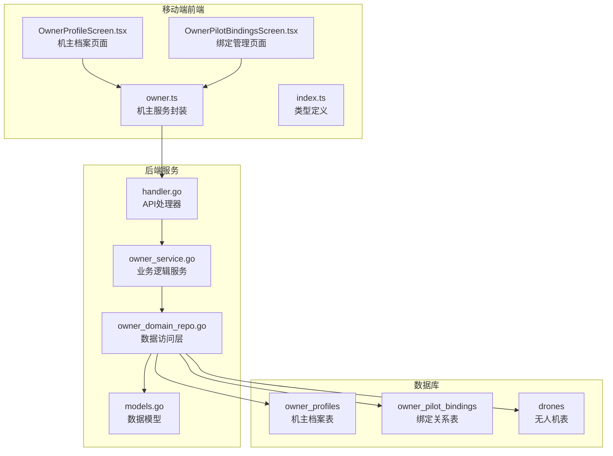
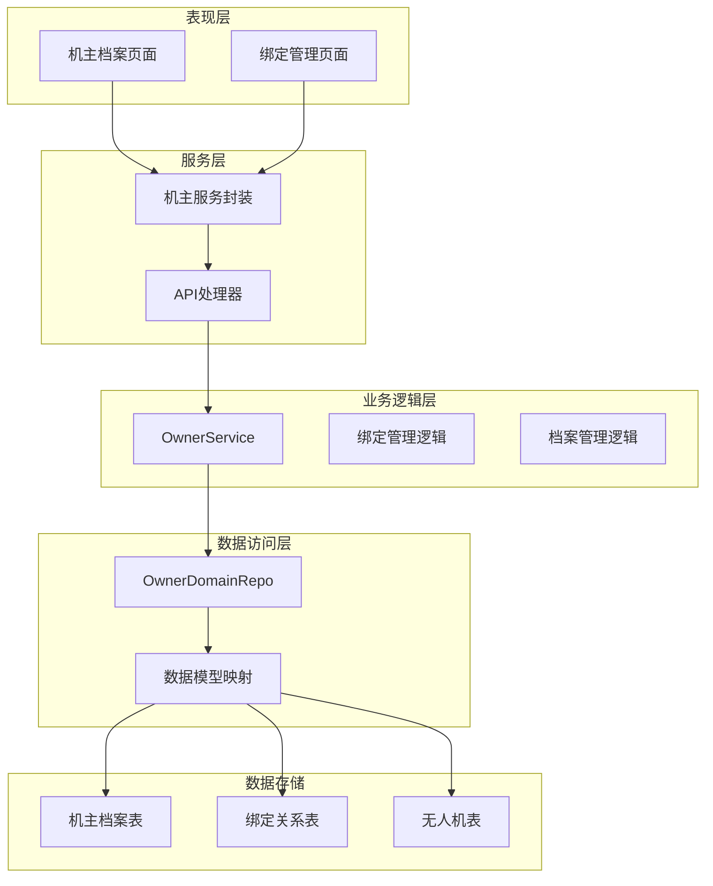
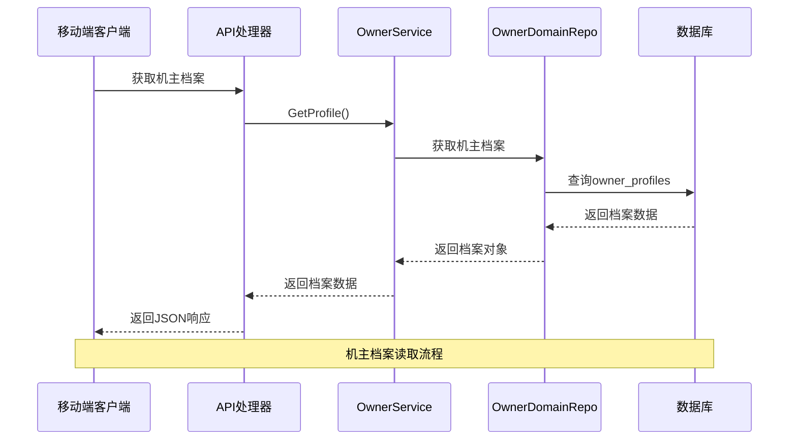
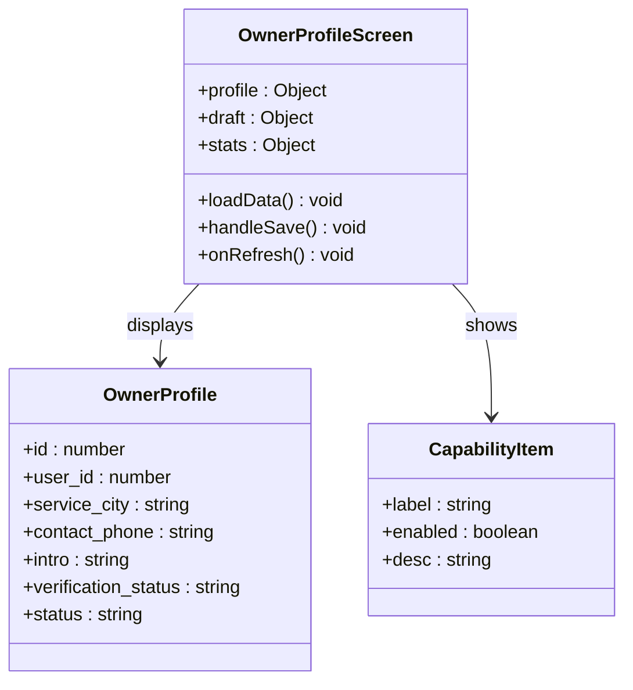
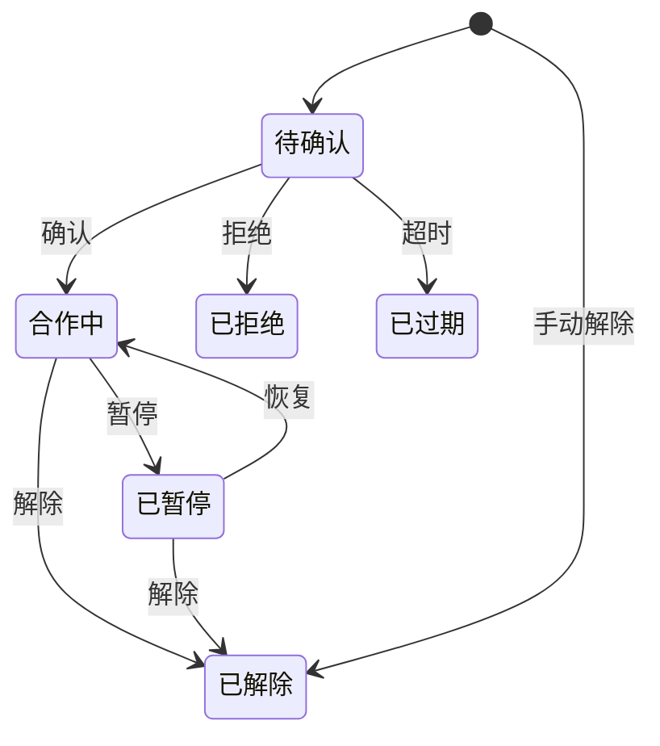
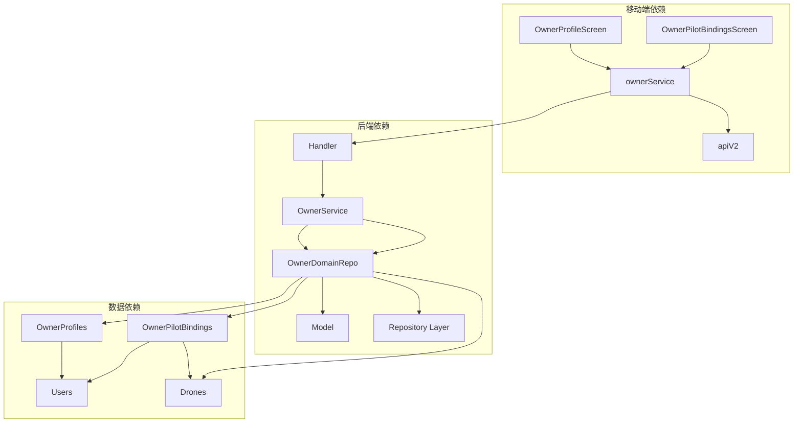
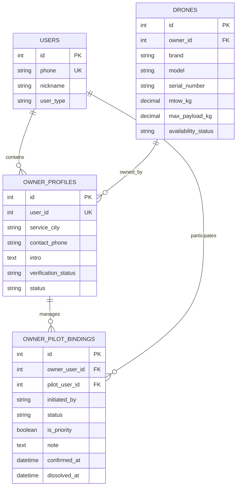

# 机主管理模块

<cite>
**本文档引用的文件**
- [OwnerProfileScreen.tsx](file://mobile/src/screens/owner/OwnerProfileScreen.tsx)
- [OwnerPilotBindingsScreen.tsx](file://mobile/src/screens/owner/OwnerPilotBindingsScreen.tsx)
- [owner.ts](file://mobile/src/services/owner.ts)
- [handler.go](file://backend/internal/api/v1/owner/handler.go)
- [owner_service.go](file://backend/internal/service/owner_service.go)
- [owner_domain_repo.go](file://backend/internal/repository/owner_domain_repo.go)
- [models.go](file://backend/internal/model/models.go)
- [index.ts](file://mobile/src/types/index.ts)
</cite>

## 目录
1. [引言](#引言)
2. [项目结构](#项目结构)
3. [核心组件](#核心组件)
4. [架构概览](#架构概览)
5. [详细组件分析](#详细组件分析)
6. [依赖关系分析](#依赖关系分析)
7. [性能考虑](#性能考虑)
8. [故障排除指南](#故障排除指南)
9. [结论](#结论)

## 引言

机主管理模块是无人机租赁平台的核心功能模块之一，负责管理机主（无人机所有者）的档案信息、服务能力展示以及与飞手的绑定关系管理。该模块实现了完整的机主生命周期管理，包括档案建立、信息维护、服务能力展示、绑定关系管理等功能。

本模块采用前后端分离架构，前端使用React Native构建移动端界面，后端使用Go语言实现RESTful API服务。系统支持机主与飞手之间的双向绑定管理，包括邀请绑定、申请绑定、关系确认、状态管理等完整流程。

## 项目结构

机主管理模块在项目中的组织结构如下：

**图表来源**
- [OwnerProfileScreen.tsx:1-304](file://mobile/src/screens/owner/OwnerProfileScreen.tsx#L1-L304)
- [OwnerPilotBindingsScreen.tsx:1-265](file://mobile/src/screens/owner/OwnerPilotBindingsScreen.tsx#L1-L265)
- [owner.ts:1-71](file://mobile/src/services/owner.ts#L1-L71)
- [handler.go:1-255](file://backend/internal/api/v1/owner/handler.go#L1-L255)

**章节来源**
- [OwnerProfileScreen.tsx:1-304](file://mobile/src/screens/owner/OwnerProfileScreen.tsx#L1-L304)
- [OwnerPilotBindingsScreen.tsx:1-265](file://mobile/src/screens/owner/OwnerPilotBindingsScreen.tsx#L1-L265)
- [owner.ts:1-71](file://mobile/src/services/owner.ts#L1-L71)

## 核心组件

机主管理模块由以下核心组件构成：

### 移动端组件

1. **机主档案页面** (`OwnerProfileScreen.tsx`)
   - 展示机主档案信息和统计数据
   - 提供档案编辑功能
   - 显示机主服务能力状态

2. **绑定管理页面** (`OwnerPilotBindingsScreen.tsx`)
   - 管理机主与飞手的绑定关系
   - 支持邀请飞手和管理现有绑定
   - 提供绑定状态筛选和操作

3. **服务封装** (`owner.ts`)
   - 封装机主相关的API调用
   - 提供统一的服务接口

### 后端组件

1. **API处理器** (`handler.go`)
   - 处理机主相关的HTTP请求
   - 实现业务逻辑路由

2. **业务服务** (`owner_service.go`)
   - 核心业务逻辑实现
   - 数据验证和处理

3. **数据访问层** (`owner_domain_repo.go`)
   - 数据库操作封装
   - 业务数据持久化

**章节来源**
- [OwnerProfileScreen.tsx:25-241](file://mobile/src/screens/owner/OwnerProfileScreen.tsx#L25-L241)
- [OwnerPilotBindingsScreen.tsx:42-228](file://mobile/src/screens/owner/OwnerPilotBindingsScreen.tsx#L42-L228)
- [owner.ts:34-70](file://mobile/src/services/owner.ts#L34-L70)

## 架构概览

机主管理模块采用分层架构设计，确保关注点分离和代码可维护性：

**图表来源**
- [OwnerProfileScreen.tsx:16-23](file://mobile/src/screens/owner/OwnerProfileScreen.tsx#L16-L23)
- [OwnerPilotBindingsScreen.tsx:18-21](file://mobile/src/screens/owner/OwnerPilotBindingsScreen.tsx#L18-L21)
- [owner.ts:34-70](file://mobile/src/services/owner.ts#L34-L70)
- [handler.go:14-21](file://backend/internal/api/v1/owner/handler.go#L14-L21)

### 数据流图

**图表来源**
- [handler.go:23-31](file://backend/internal/api/v1/owner/handler.go#L23-L31)
- [owner_service.go:82-103](file://backend/internal/service/owner_service.go#L82-L103)
- [owner_domain_repo.go:134-144](file://backend/internal/repository/owner_domain_repo.go#L134-L144)

## 详细组件分析

### 机主档案管理

机主档案管理功能提供了完整的档案信息维护能力：

#### 档案信息展示

**图表来源**
- [OwnerProfileScreen.tsx:35-68](file://mobile/src/screens/owner/OwnerProfileScreen.tsx#L35-L68)
- [OwnerProfileScreen.tsx:98-112](file://mobile/src/screens/owner/OwnerProfileScreen.tsx#L98-L112)
- [models.go:51-68](file://backend/internal/model/models.go#L51-L68)

#### 能力状态展示

机主能力状态通过两个关键指标展示：
1. **可发布供给** - 基于无人机资质和市场准入要求
2. **可自执行** - 机主同时具备飞手能力的状态

#### 统计数据聚合

系统自动聚合以下统计数据：
- 无人机数量
- 生效供给数量
- 报价数量
- 绑定飞手数量

**章节来源**
- [OwnerProfileScreen.tsx:39-68](file://mobile/src/screens/owner/OwnerProfileScreen.tsx#L39-L68)
- [OwnerProfileScreen.tsx:98-112](file://mobile/src/screens/owner/OwnerProfileScreen.tsx#L98-L112)

### 绑定关系管理

绑定关系管理是机主模块的核心功能，支持双向绑定管理：

#### 绑定关系状态流转

**图表来源**
- [owner_service.go:448-492](file://backend/internal/service/owner_service.go#L448-L492)
- [owner_service.go:502-563](file://backend/internal/service/owner_service.go#L502-L563)

#### 绑定关系类型

系统支持两种绑定关系发起方式：
1. **机主邀请** (`initiated_by: 'owner'`)
2. **飞手申请** (`initiated_by: 'pilot'`)

#### 绑定管理操作

支持的操作包括：
- 邀请飞手绑定
- 确认绑定关系
- 拒绝绑定申请
- 暂停绑定关系
- 恢复绑定关系
- 解除绑定关系

**章节来源**
- [OwnerPilotBindingsScreen.tsx:42-114](file://mobile/src/screens/owner/OwnerPilotBindingsScreen.tsx#L42-L114)
- [owner_service.go:448-563](file://backend/internal/service/owner_service.go#L448-L563)

### API接口设计

#### 机主档案相关接口

| 接口 | 方法 | 路径 | 功能描述 |
|------|------|------|----------|
| 获取档案 | GET | `/owner/profile` | 获取机主档案信息 |
| 更新档案 | PUT | `/owner/profile` | 更新机主档案信息 |
| 列表供给 | GET | `/owner/supplies` | 获取机主供给列表 |
| 创建供给 | POST | `/owner/supplies` | 创建新供给 |

#### 绑定关系相关接口

| 接口 | 方法 | 路径 | 功能描述 |
|------|------|------|----------|
| 列表绑定 | GET | `/owner/pilot-bindings` | 获取绑定关系列表 |
| 邀请绑定 | POST | `/owner/pilot-bindings` | 发送绑定邀请 |
| 确认绑定 | POST | `/owner/pilot-bindings/{id}/confirm` | 确认绑定关系 |
| 拒绝绑定 | POST | `/owner/pilot-bindings/{id}/reject` | 拒绝绑定申请 |
| 更新状态 | PATCH | `/owner/pilot-bindings/{id}/status` | 更新绑定状态 |

**章节来源**
- [owner.ts:34-70](file://mobile/src/services/owner.ts#L34-L70)
- [handler.go:23-255](file://backend/internal/api/v1/owner/handler.go#L23-L255)

## 依赖关系分析

机主管理模块的依赖关系体现了清晰的分层架构：

**图表来源**
- [OwnerProfileScreen.tsx:18-20](file://mobile/src/screens/owner/OwnerProfileScreen.tsx#L18-L20)
- [OwnerPilotBindingsScreen.tsx:18](file://mobile/src/screens/owner/OwnerPilotBindingsScreen.tsx#L18)
- [owner.ts:11](file://mobile/src/services/owner.ts#L11)
- [handler.go:14-21](file://backend/internal/api/v1/owner/handler.go#L14-L21)

### 数据模型关系

**图表来源**
- [models.go:51-68](file://backend/internal/model/models.go#L51-L68)
- [models.go:880-896](file://backend/internal/model/models.go#L880-L896)
- [models.go:91-148](file://backend/internal/model/models.go#L91-L148)

**章节来源**
- [owner_service.go:16-80](file://backend/internal/service/owner_service.go#L16-L80)
- [owner_domain_repo.go:14-24](file://backend/internal/repository/owner_domain_repo.go#L14-L24)

## 性能考虑

### 前端性能优化

1. **并发数据加载**
   - 使用Promise.all并行加载多个数据源
   - 减少页面渲染等待时间

2. **状态管理优化**
   - 使用React hooks进行局部状态管理
   - 避免不必要的重新渲染

3. **UI响应优化**
   - 下拉刷新机制减少手动操作
   - 加载状态指示提升用户体验

### 后端性能优化

1. **数据库查询优化**
   - 使用索引优化常用查询
   - 分页查询避免大数据集传输

2. **业务逻辑优化**
   - 参数验证前置减少无效调用
   - 事务处理保证数据一致性

3. **缓存策略**
   - 用户角色信息缓存
   - 经常访问的数据缓存

## 故障排除指南

### 常见问题及解决方案

#### 机主档案加载失败

**问题症状**：机主档案页面显示加载错误

**可能原因**：
1. 网络连接异常
2. 用户未完成机主身份认证
3. 数据库连接问题

**解决步骤**：
1. 检查网络连接状态
2. 验证用户登录状态
3. 查看后端服务日志

#### 绑定关系操作失败

**问题症状**：绑定邀请或状态更新失败

**可能原因**：
1. 飞手用户不存在
2. 权限不足
3. 绑定状态不符合操作要求

**解决步骤**：
1. 验证飞手用户ID有效性
2. 检查操作权限
3. 确认绑定状态允许的操作

#### 数据同步问题

**问题症状**：页面显示数据与实际不符

**解决步骤**：
1. 触发页面刷新
2. 检查缓存状态
3. 重新登录应用

**章节来源**
- [OwnerProfileScreen.tsx:81-96](file://mobile/src/screens/owner/OwnerProfileScreen.tsx#L81-L96)
- [OwnerPilotBindingsScreen.tsx:73-95](file://mobile/src/screens/owner/OwnerPilotBindingsScreen.tsx#L73-L95)

## 结论

机主管理模块通过清晰的架构设计和完善的业务逻辑，为无人机租赁平台提供了强大的机主管理能力。模块具有以下特点：

1. **功能完整性**：涵盖了机主档案管理、服务能力展示、绑定关系管理等核心功能
2. **用户体验优秀**：移动端界面友好，操作流畅
3. **架构清晰**：前后端分离，职责明确
4. **扩展性强**：模块化设计便于功能扩展和维护

该模块为平台的机主生态建设奠定了坚实基础，支持机主与飞手之间的高效协作，促进了无人机共享经济的发展。