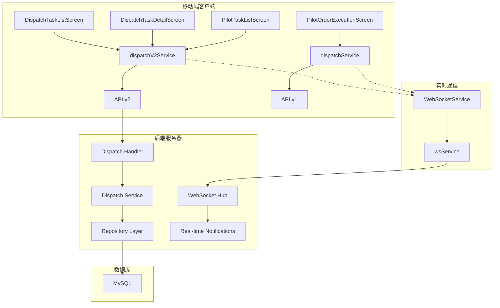
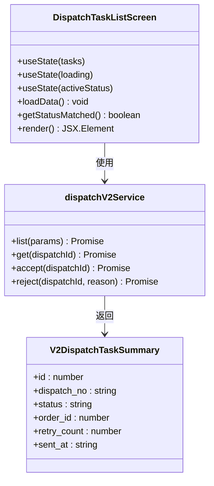
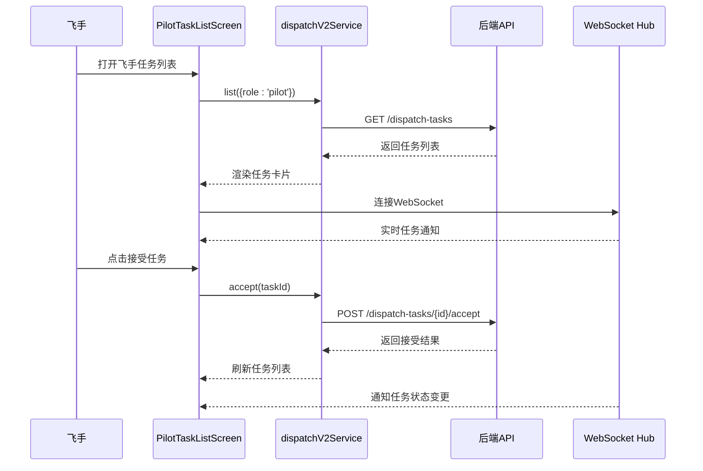
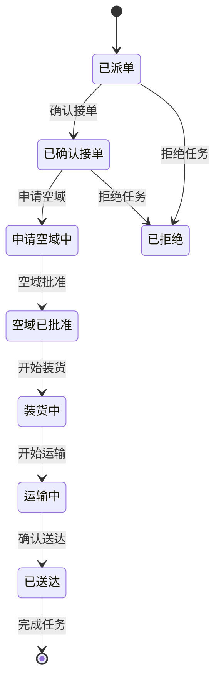
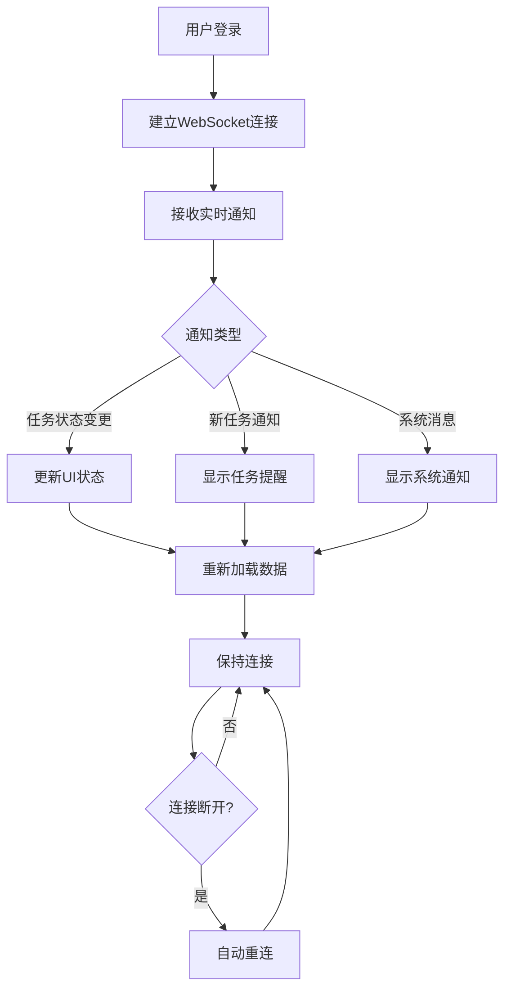
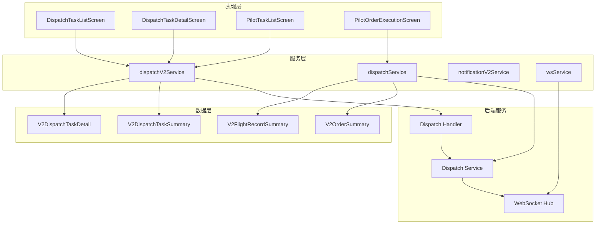

# 派单与执行模块

<cite>
**本文档引用的文件**
- [DispatchTaskListScreen.tsx](file://mobile/src/screens/dispatch/DispatchTaskListScreen.tsx)
- [DispatchTaskDetailScreen.tsx](file://mobile/src/screens/dispatch/DispatchTaskDetailScreen.tsx)
- [PilotTaskListScreen.tsx](file://mobile/src/screens/dispatch/PilotTaskListScreen.tsx)
- [PilotOrderExecutionScreen.tsx](file://mobile/src/screens/dispatch/PilotOrderExecutionScreen.tsx)
- [dispatch.ts](file://mobile/src/services/dispatch.ts)
- [dispatchV2.ts](file://mobile/src/services/dispatchV2.ts)
- [index.ts](file://mobile/src/types/index.ts)
- [visuals.ts](file://mobile/src/components/business/visuals.ts)
- [MainNavigator.tsx](file://mobile/src/navigation/MainNavigator.tsx)
- [websocket.ts](file://mobile/src/services/websocket.ts)
- [notificationV2.ts](file://mobile/src/services/notificationV2.ts)
- [handler.go](file://backend/internal/api/v2/dispatch/handler.go)
- [dispatch_service.go](file://backend/internal/service/dispatch_service.go)
- [hub.go](file://backend/internal/websocket/hub.go)
</cite>

## 目录
1. [简介](#简介)
2. [项目结构](#项目结构)
3. [核心组件](#核心组件)
4. [架构概览](#架构概览)
5. [详细组件分析](#详细组件分析)
6. [依赖关系分析](#依赖关系分析)
7. [性能考虑](#性能考虑)
8. [故障排除指南](#故障排除指南)
9. [结论](#结论)

## 简介

派单与执行模块是无人机租赁平台移动端的核心业务模块，负责管理从订单创建到任务执行的完整生命周期。该模块实现了正式派单任务的创建、分配、跟踪和完成等全流程管理，为机主和飞手提供了完整的任务管理体验。

模块主要包含以下核心功能：
- 正式派单任务管理：支持机主创建、查看和管理正式派单任务
- 飞手任务列表：提供待响应、进行中、已完成等状态的任务管理
- 订单执行页面：支持任务确认、开始执行、状态更新、完成报告
- 实时通信：集成WebSocket实现任务通知、状态同步和异常处理
- 智能调度算法：基于多维度评分的飞手匹配和任务分配

## 项目结构

移动端派单模块采用按功能划分的目录结构，主要文件组织如下：

```mermaid
graph TB
subgraph "移动端结构"
A[dispatch/] -- 派单相关屏幕
B[services/] -- API服务层
C[navigation/] -- 导航配置
D[components/] -- 业务组件
E[types/] -- TypeScript类型定义
end
subgraph "后端结构"
F[internal/api/v2/dispatch/] -- API处理器
G[internal/service/] -- 业务服务
H[internal/websocket/] -- WebSocket服务
I[internal/repository/] -- 数据访问层
end
A --> B
B --> F
F --> G
G --> I
H --> G
```

**图表来源**
- [DispatchTaskListScreen.tsx:1-302](file://mobile/src/screens/dispatch/DispatchTaskListScreen.tsx#L1-L302)
- [handler.go:1-281](file://backend/internal/api/v2/dispatch/handler.go#L1-L281)

**章节来源**
- [DispatchTaskListScreen.tsx:1-302](file://mobile/src/screens/dispatch/DispatchTaskListScreen.tsx#L1-L302)
- [MainNavigator.tsx:63-67](file://mobile/src/navigation/MainNavigator.tsx#L63-L67)

## 核心组件

派单与执行模块由多个核心组件构成，每个组件负责特定的功能领域：

### 移动端核心组件

1. **任务列表组件**：展示正式派单任务的列表视图
2. **任务详情组件**：提供详细的派单任务信息和操作界面
3. **飞手任务组件**：管理飞手的个人任务列表
4. **执行页面组件**：处理订单的执行流程和状态更新

### 后端核心组件

1. **派发处理器**：处理正式派单的API请求
2. **派发服务**：实现智能匹配算法和任务管理逻辑
3. **WebSocket Hub**：提供实时通信功能

**章节来源**
- [dispatchV2.ts:20-35](file://mobile/src/services/dispatchV2.ts#L20-L35)
- [handler.go:27-60](file://backend/internal/api/v2/dispatch/handler.go#L27-L60)

## 架构概览

系统采用前后端分离架构，移动端通过HTTP API与后端服务通信，同时集成WebSocket实现实时通知。



**图表来源**
- [DispatchTaskListScreen.tsx:19-91](file://mobile/src/screens/dispatch/DispatchTaskListScreen.tsx#L19-L91)
- [dispatchV2.ts:20-35](file://mobile/src/services/dispatchV2.ts#L20-L35)
- [handler.go:27-60](file://backend/internal/api/v2/dispatch/handler.go#L27-L60)
- [dispatch_service.go:17-92](file://backend/internal/service/dispatch_service.go#L17-L92)

## 详细组件分析

### 正式派单任务列表

正式派单任务列表页面提供了机主查看所有正式派单任务的功能，支持多种状态筛选和实时刷新。



**图表来源**
- [DispatchTaskListScreen.tsx:73-102](file://mobile/src/screens/dispatch/DispatchTaskListScreen.tsx#L73-L102)
- [dispatchV2.ts:20-35](file://mobile/src/services/dispatchV2.ts#L20-L35)
- [index.ts:609-639](file://mobile/src/types/index.ts#L609-L639)

#### 状态管理机制

页面实现了完整的状态管理，包括：
- **状态筛选**：支持全部、待响应、已接单、执行中、已结束等状态
- **实时刷新**：支持下拉刷新和后台自动更新
- **数据缓存**：使用React hooks实现本地状态管理

**章节来源**
- [DispatchTaskListScreen.tsx:24-61](file://mobile/src/screens/dispatch/DispatchTaskListScreen.tsx#L24-L61)
- [DispatchTaskListScreen.tsx:99-102](file://mobile/src/screens/dispatch/DispatchTaskListScreen.tsx#L99-L102)

### 飞手任务列表

飞手任务列表页面专门为飞手提供个人任务管理功能，支持待响应和已接受任务的不同视图。



**图表来源**
- [PilotTaskListScreen.tsx:58-86](file://mobile/src/screens/dispatch/PilotTaskListScreen.tsx#L58-L86)
- [dispatchV2.ts:27-31](file://mobile/src/services/dispatchV2.ts#L27-L31)
- [websocket.ts:13-47](file://mobile/src/services/websocket.ts#L13-L47)

#### 任务状态流转

飞手任务支持以下状态流转：
- **待响应**：飞手可以接受或拒绝任务
- **已接受**：飞手可以进入订单执行页面
- **已拒绝**：系统自动重派给其他飞手
- **执行中**：飞手完成任务执行

**章节来源**
- [PilotTaskListScreen.tsx:88-100](file://mobile/src/screens/dispatch/PilotTaskListScreen.tsx#L88-L100)
- [PilotTaskListScreen.tsx:161-162](file://mobile/src/screens/dispatch/PilotTaskListScreen.tsx#L161-L162)

### 订单执行页面

订单执行页面提供了完整的任务执行流程，支持7个执行步骤的状态管理。



**图表来源**
- [PilotOrderExecutionScreen.tsx:19-37](file://mobile/src/screens/dispatch/PilotOrderExecutionScreen.tsx#L19-L37)
- [PilotOrderExecutionScreen.tsx:93-96](file://mobile/src/screens/dispatch/PilotOrderExecutionScreen.tsx#L93-L96)

#### 执行步骤设计

执行页面包含以下关键功能：
- **进度可视化**：7个执行步骤的进度条展示
- **状态确认**：每一步都需要飞手确认
- **飞行数据**：集成飞行监控和轨迹记录功能
- **实时状态**：通过WebSocket实现实时状态更新

**章节来源**
- [PilotOrderExecutionScreen.tsx:119-124](file://mobile/src/screens/dispatch/PilotOrderExecutionScreen.tsx#L119-L124)
- [PilotOrderExecutionScreen.tsx:216-230](file://mobile/src/screens/dispatch/PilotOrderExecutionScreen.tsx#L216-L230)

### 实时通信系统

系统集成了WebSocket实现实时通知和状态同步功能。



**图表来源**
- [websocket.ts:13-47](file://mobile/src/services/websocket.ts#L13-L47)
- [hub.go:45-96](file://backend/internal/websocket/hub.go#L45-L96)

#### 通信协议设计

WebSocket通信采用以下协议：
- **消息格式**：JSON格式，包含type、data、timestamp字段
- **事件类型**：支持chat、order_update、system、matching等事件类型
- **重连机制**：指数退避算法，最多重连5次
- **消息路由**：支持用户级私信和全局广播

**章节来源**
- [websocket.ts:6-83](file://mobile/src/services/websocket.ts#L6-L83)
- [hub.go:28-33](file://backend/internal/websocket/hub.go#L28-L33)

## 依赖关系分析

派单模块的依赖关系体现了清晰的分层架构设计：



**图表来源**
- [DispatchTaskListScreen.tsx:19-22](file://mobile/src/screens/dispatch/DispatchTaskListScreen.tsx#L19-L22)
- [dispatchV2.ts:2-9](file://mobile/src/services/dispatchV2.ts#L2-L9)
- [index.ts:609-748](file://mobile/src/types/index.ts#L609-L748)

### 外部依赖

系统依赖以下外部组件：
- **React Navigation**：提供页面导航和路由管理
- **Redux**：管理全局应用状态
- **Axios**：HTTP客户端库
- **Zustand**：轻量级状态管理库

**章节来源**
- [MainNavigator.tsx:1-195](file://mobile/src/navigation/MainNavigator.tsx#L1-L195)
- [dispatchV2.ts:1-10](file://mobile/src/services/dispatchV2.ts#L1-L10)

## 性能考虑

派单模块在设计时充分考虑了性能优化：

### 前端性能优化

1. **虚拟列表**：使用FlatList实现大数据集的高效渲染
2. **状态缓存**：合理使用React hooks避免不必要的重渲染
3. **懒加载**：图片和组件的懒加载机制
4. **内存管理**：及时清理事件监听器和定时器

### 后端性能优化

1. **索引优化**：为常用查询字段建立数据库索引
2. **连接池**：数据库连接池管理
3. **缓存策略**：Redis缓存热点数据
4. **异步处理**：耗时操作异步化处理

### 网络优化

1. **请求合并**：减少HTTP请求次数
2. **数据压缩**：传输数据压缩
3. **CDN加速**：静态资源CDN分发
4. **长连接**：WebSocket长连接复用

## 故障排除指南

### 常见问题及解决方案

#### 1. 任务状态不同步

**问题现象**：飞手看到的任务状态与机主不一致

**解决步骤**：
1. 检查WebSocket连接状态
2. 验证用户权限和角色
3. 查看API响应状态码
4. 检查数据库事务一致性

**章节来源**
- [websocket.ts:60-65](file://mobile/src/services/websocket.ts#L60-L65)
- [handler.go:84-87](file://backend/internal/api/v2/dispatch/handler.go#L84-L87)

#### 2. 匹配算法异常

**问题现象**：飞手无法收到合适的任务推荐

**排查步骤**：
1. 检查飞手资质和认证状态
2. 验证匹配参数配置
3. 查看候选人数统计
4. 检查地理位置坐标精度

**章节来源**
- [dispatch_service.go:689-695](file://backend/internal/service/dispatch_service.go#L689-L695)
- [dispatch_service.go:307-341](file://backend/internal/service/dispatch_service.go#L307-L341)

#### 3. 实时通知延迟

**问题现象**：任务状态变更通知延迟

**解决方法**：
1. 检查WebSocket服务器连接数限制
2. 优化消息队列处理速度
3. 调整重连策略参数
4. 监控网络带宽使用情况

**章节来源**
- [hub.go:118-131](file://backend/internal/websocket/hub.go#L118-L131)
- [websocket.ts:60-65](file://mobile/src/services/websocket.ts#L60-L65)

### 调试工具

1. **浏览器开发者工具**：监控网络请求和WebSocket通信
2. **Redux DevTools**：调试应用状态变化
3. **数据库监控**：查看SQL执行计划和慢查询
4. **日志分析**：集中式日志收集和分析

## 结论

派单与执行模块通过精心设计的架构和完善的功能实现，为无人机租赁平台提供了完整的任务管理解决方案。模块具有以下特点：

### 技术优势

1. **模块化设计**：清晰的职责分离和依赖管理
2. **实时通信**：基于WebSocket的即时通知系统
3. **智能匹配**：多维度评分算法确保任务分配质量
4. **状态管理**：完整的生命周期状态控制

### 业务价值

1. **提升效率**：自动化任务分配和状态跟踪
2. **改善体验**：直观的操作界面和实时反馈
3. **增强可靠性**：完善的异常处理和容错机制
4. **扩展性强**：可配置的算法参数和灵活的业务逻辑

### 未来发展方向

1. **AI优化**：引入机器学习算法优化匹配效果
2. **多平台支持**：扩展到Web和桌面应用
3. **数据分析**：增强业务洞察和决策支持
4. **集成扩展**：与其他业务系统的深度集成

该模块为无人机租赁平台的商业化运营奠定了坚实的技术基础，通过持续的优化和迭代，将进一步提升平台的服务质量和用户体验。