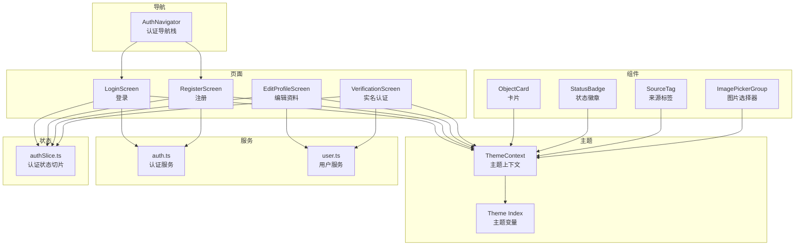
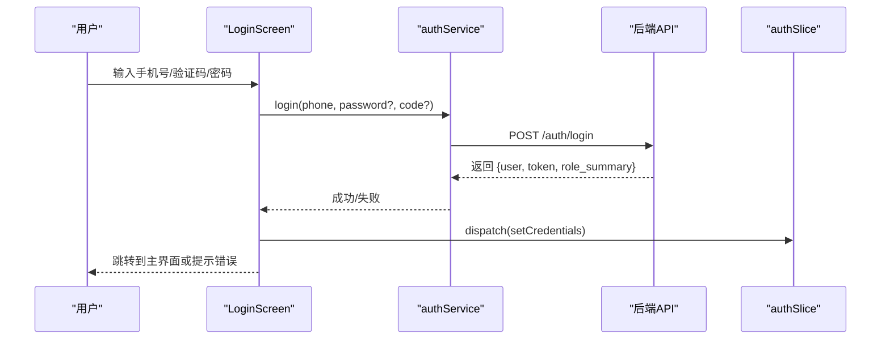
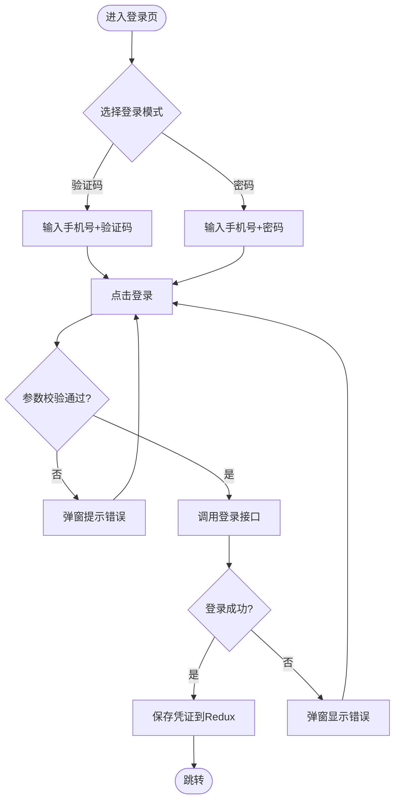
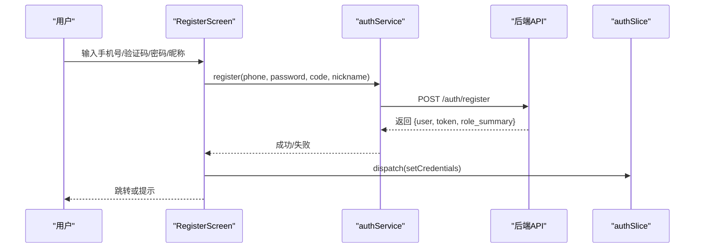
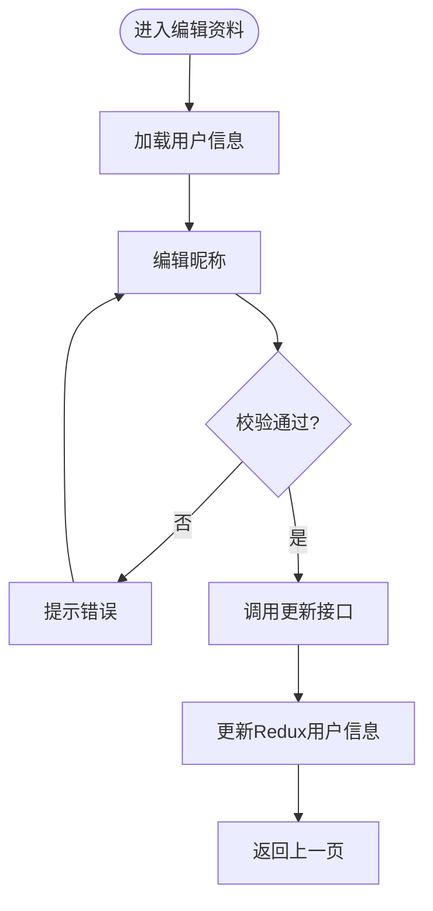
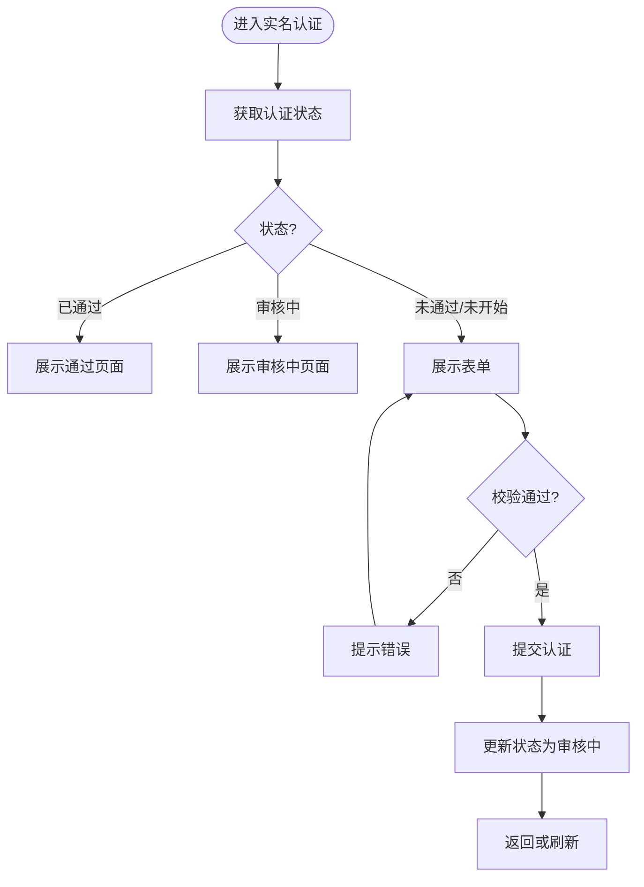
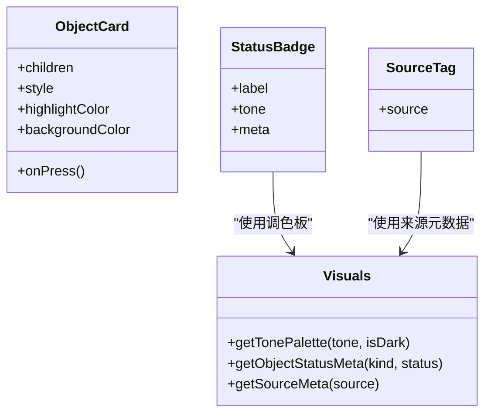
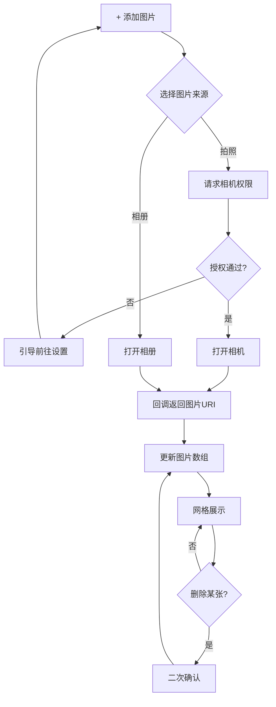
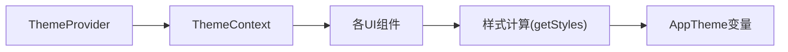
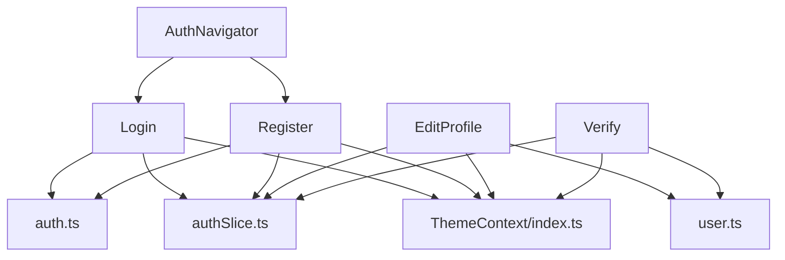

# 用户界面模块

<cite>
**本文引用的文件**
- [LoginScreen.tsx](file://mobile/src/screens/auth/LoginScreen.tsx)
- [RegisterScreen.tsx](file://mobile/src/screens/auth/RegisterScreen.tsx)
- [EditProfileScreen.tsx](file://mobile/src/screens/profile/EditProfileScreen.tsx)
- [VerificationScreen.tsx](file://mobile/src/screens/profile/VerificationScreen.tsx)
- [ObjectCard.tsx](file://mobile/src/components/business/ObjectCard.tsx)
- [StatusBadge.tsx](file://mobile/src/components/business/StatusBadge.tsx)
- [SourceTag.tsx](file://mobile/src/components/business/SourceTag.tsx)
- [visuals.ts](file://mobile/src/components/business/visuals.ts)
- [ImagePickerGroup.tsx](file://mobile/src/components/ImagePickerGroup.tsx)
- [ThemeContext.tsx](file://mobile/src/theme/ThemeContext.tsx)
- [index.ts](file://mobile/src/theme/index.ts)
- [AuthNavigator.tsx](file://mobile/src/navigation/AuthNavigator.tsx)
- [auth.ts](file://mobile/src/services/auth.ts)
- [user.ts](file://mobile/src/services/user.ts)
- [authSlice.ts](file://mobile/src/store/slices/authSlice.ts)
</cite>

## 目录
1. [简介](#简介)
2. [项目结构](#项目结构)
3. [核心组件](#核心组件)
4. [架构总览](#架构总览)
5. [详细组件分析](#详细组件分析)
6. [依赖关系分析](#依赖关系分析)
7. [性能考量](#性能考量)
8. [故障排查指南](#故障排查指南)
9. [结论](#结论)
10. [附录](#附录)

## 简介
本文件面向移动端用户界面模块，聚焦于登录注册、个人资料与实名认证、UI组件库与主题系统、业务组件以及交互与可访问性最佳实践。文档以代码为依据，结合架构图与流程图，帮助开发者与产品人员理解模块设计与实现细节。

## 项目结构
移动端UI位于 mobile 目录，采用按功能域划分的组织方式：
- screens：页面级组件，如登录、注册、个人资料、实名认证等
- components：通用与业务组件，如卡片、标签、状态徽章、图片选择器
- services：与后端API交互封装，如认证、用户服务
- store：Redux状态管理，如认证状态切片
- theme：主题上下文与主题变量
- navigation：导航栈定义，如认证导航

图表来源
- [AuthNavigator.tsx:1-16](file://mobile/src/navigation/AuthNavigator.tsx#L1-L16)
- [LoginScreen.tsx:1-444](file://mobile/src/screens/auth/LoginScreen.tsx#L1-L444)
- [RegisterScreen.tsx:1-98](file://mobile/src/screens/auth/RegisterScreen.tsx#L1-L98)
- [EditProfileScreen.tsx:1-175](file://mobile/src/screens/profile/EditProfileScreen.tsx#L1-L175)
- [VerificationScreen.tsx:1-301](file://mobile/src/screens/profile/VerificationScreen.tsx#L1-L301)
- [ObjectCard.tsx:1-53](file://mobile/src/components/business/ObjectCard.tsx#L1-L53)
- [StatusBadge.tsx:1-45](file://mobile/src/components/business/StatusBadge.tsx#L1-L45)
- [SourceTag.tsx:1-42](file://mobile/src/components/business/SourceTag.tsx#L1-L42)
- [ImagePickerGroup.tsx:1-153](file://mobile/src/components/ImagePickerGroup.tsx#L1-L153)
- [ThemeContext.tsx:1-31](file://mobile/src/theme/ThemeContext.tsx#L1-L31)
- [index.ts:1-202](file://mobile/src/theme/index.ts#L1-L202)
- [auth.ts:1-45](file://mobile/src/services/auth.ts#L1-L45)
- [user.ts:1-25](file://mobile/src/services/user.ts#L1-L25)
- [authSlice.ts:1-65](file://mobile/src/store/slices/authSlice.ts#L1-L65)

章节来源
- [AuthNavigator.tsx:1-16](file://mobile/src/navigation/AuthNavigator.tsx#L1-L16)
- [ThemeContext.tsx:1-31](file://mobile/src/theme/ThemeContext.tsx#L1-L31)
- [index.ts:1-202](file://mobile/src/theme/index.ts#L1-L202)

## 核心组件
- 登录与注册页面：提供手机号+验证码或密码两种登录模式；注册流程包含手机号、验证码、密码与昵称输入，并调用认证服务完成登录或注册。
- 个人资料管理：支持昵称编辑、只读展示手机号与身份摘要、账户状态展示；与用户服务交互更新资料。
- 实名认证：支持提交身份证信息、查看审核状态、展示通过/审核中/拒绝结果页；包含简易身份证号格式校验。
- 业务组件：卡片容器、状态徽章、来源标签；通过视觉语义映射实现一致的状态表达。
- 图片选择器：跨平台图片选择与删除，支持相机权限请求与图片网格展示。
- 主题系统：深浅主题切换，基于上下文注入的主题变量，组件内按需消费。

章节来源
- [LoginScreen.tsx:1-444](file://mobile/src/screens/auth/LoginScreen.tsx#L1-L444)
- [RegisterScreen.tsx:1-98](file://mobile/src/screens/auth/RegisterScreen.tsx#L1-L98)
- [EditProfileScreen.tsx:1-175](file://mobile/src/screens/profile/EditProfileScreen.tsx#L1-L175)
- [VerificationScreen.tsx:1-301](file://mobile/src/screens/profile/VerificationScreen.tsx#L1-L301)
- [ObjectCard.tsx:1-53](file://mobile/src/components/business/ObjectCard.tsx#L1-L53)
- [StatusBadge.tsx:1-45](file://mobile/src/components/business/StatusBadge.tsx#L1-L45)
- [SourceTag.tsx:1-42](file://mobile/src/components/business/SourceTag.tsx#L1-L42)
- [ImagePickerGroup.tsx:1-153](file://mobile/src/components/ImagePickerGroup.tsx#L1-L153)
- [ThemeContext.tsx:1-31](file://mobile/src/theme/ThemeContext.tsx#L1-L31)
- [index.ts:1-202](file://mobile/src/theme/index.ts#L1-L202)

## 架构总览
移动端UI采用“页面-服务-状态-主题”的分层设计：
- 页面负责用户交互与数据收集
- 服务层封装API调用，统一返回类型
- Redux切片维护认证态与用户信息
- 主题上下文提供全局样式变量与切换逻辑

图表来源
- [LoginScreen.tsx:111-134](file://mobile/src/screens/auth/LoginScreen.tsx#L111-L134)
- [auth.ts:21-26](file://mobile/src/services/auth.ts#L21-L26)
- [authSlice.ts:26-33](file://mobile/src/store/slices/authSlice.ts#L26-L33)

## 详细组件分析

### 登录页面 LoginScreen
- 功能要点
  - 支持验证码登录与密码登录双模式切换
  - 发送验证码倒计时与防重复提交
  - 开发模式快速登录与账号下拉选择
  - 主题切换与渐变背景、发光圆球装饰
- 表单验证
  - 手机号长度校验（11位）
  - 登录前根据模式选择是否必填验证码或密码
- 错误处理
  - 统一Alert提示
  - 请求并发保护：请求ID与挂载标记避免竞态
- 交互细节
  - 键盘避让、滚动内容适配安全区
  - 第三方登录占位提示（微信/QQ）

图表来源
- [LoginScreen.tsx:91-134](file://mobile/src/screens/auth/LoginScreen.tsx#L91-L134)
- [auth.ts:21-26](file://mobile/src/services/auth.ts#L21-L26)
- [authSlice.ts:26-33](file://mobile/src/store/slices/authSlice.ts#L26-L33)

章节来源
- [LoginScreen.tsx:1-444](file://mobile/src/screens/auth/LoginScreen.tsx#L1-L444)
- [auth.ts:1-45](file://mobile/src/services/auth.ts#L1-L45)
- [authSlice.ts:1-65](file://mobile/src/store/slices/authSlice.ts#L1-L65)

### 注册页面 RegisterScreen
- 功能要点
  - 手机号、验证码、密码、昵称输入
  - 发送验证码倒计时
  - 注册成功后保存凭证并跳转
- 表单验证
  - 必填项检查
  - 密码长度至少6位
- 错误处理
  - 统一Alert提示

图表来源
- [RegisterScreen.tsx:42-61](file://mobile/src/screens/auth/RegisterScreen.tsx#L42-L61)
- [auth.ts:14-19](file://mobile/src/services/auth.ts#L14-L19)
- [authSlice.ts:26-33](file://mobile/src/store/slices/authSlice.ts#L26-L33)

章节来源
- [RegisterScreen.tsx:1-98](file://mobile/src/screens/auth/RegisterScreen.tsx#L1-L98)
- [auth.ts:1-45](file://mobile/src/services/auth.ts#L1-L45)
- [authSlice.ts:1-65](file://mobile/src/store/slices/authSlice.ts#L1-L65)

### 个人资料管理 EditProfileScreen
- 功能要点
  - 昵称编辑、只读手机号与身份摘要展示
  - 账户状态展示（实名认证、信用分、注册时间）
  - 保存时进行昵称非空与长度限制校验
- 数据流
  - 从Redux读取用户信息
  - 调用用户服务更新资料
  - 更新Redux中的用户信息

图表来源
- [EditProfileScreen.tsx:25-57](file://mobile/src/screens/profile/EditProfileScreen.tsx#L25-L57)
- [user.ts:8-9](file://mobile/src/services/user.ts#L8-L9)
- [authSlice.ts:34-37](file://mobile/src/store/slices/authSlice.ts#L34-L37)

章节来源
- [EditProfileScreen.tsx:1-175](file://mobile/src/screens/profile/EditProfileScreen.tsx#L1-L175)
- [user.ts:1-25](file://mobile/src/services/user.ts#L1-L25)
- [authSlice.ts:1-65](file://mobile/src/store/slices/authSlice.ts#L1-L65)

### 实名认证 VerificationScreen
- 功能要点
  - 加载实名认证状态，展示通过/审核中/拒绝不同页面
  - 提交身份证信息（姓名、18位身份证号），支持重新提交
  - 简易身份证号格式校验
- 流程
  - 首次进入加载状态
  - 根据状态渲染不同UI
  - 提交后更新状态并提示

图表来源
- [VerificationScreen.tsx:33-87](file://mobile/src/screens/profile/VerificationScreen.tsx#L33-L87)
- [user.ts:16-20](file://mobile/src/services/user.ts#L16-L20)

章节来源
- [VerificationScreen.tsx:1-301](file://mobile/src/screens/profile/VerificationScreen.tsx#L1-L301)
- [user.ts:1-25](file://mobile/src/services/user.ts#L1-L25)

### 业务组件库
- ObjectCard：卡片容器，支持高亮边框与点击回调，统一圆角、边框与内边距
- StatusBadge：状态徽章，根据视觉语义映射生成背景、边框与文字颜色
- SourceTag：来源标签，基于业务来源元数据生成标签
- visuals：状态与来源的视觉语义映射，提供色调调色板与元数据查询

图表来源
- [ObjectCard.tsx:10-24](file://mobile/src/components/business/ObjectCard.tsx#L10-L24)
- [StatusBadge.tsx:6-15](file://mobile/src/components/business/StatusBadge.tsx#L6-L15)
- [SourceTag.tsx:6-10](file://mobile/src/components/business/SourceTag.tsx#L6-L10)
- [visuals.ts:59-165](file://mobile/src/components/business/visuals.ts#L59-L165)

章节来源
- [ObjectCard.tsx:1-53](file://mobile/src/components/business/ObjectCard.tsx#L1-L53)
- [StatusBadge.tsx:1-45](file://mobile/src/components/business/StatusBadge.tsx#L1-L45)
- [SourceTag.tsx:1-42](file://mobile/src/components/business/SourceTag.tsx#L1-L42)
- [visuals.ts:1-185](file://mobile/src/components/business/visuals.ts#L1-L185)

### 图片选择器 ImagePickerGroup
- 功能要点
  - 支持拍照与相册选择
  - 跨平台选择器（iOS ActionSheet与Android Alert）
  - 相机权限请求（Android）
  - 图片网格展示与删除
- 设计模式
  - 受控组件：通过props传递当前图片数组与变更回调
  - 最大数量限制与计数显示

图表来源
- [ImagePickerGroup.tsx:35-81](file://mobile/src/components/ImagePickerGroup.tsx#L35-L81)

章节来源
- [ImagePickerGroup.tsx:1-153](file://mobile/src/components/ImagePickerGroup.tsx#L1-L153)

### 主题系统 ThemeContext 与主题变量
- ThemeContext：提供深浅主题切换与当前主题对象
- index.ts：定义AppTheme接口与深色/浅色主题变量，覆盖背景、卡片、文本、输入、分割线、Tab、按钮、状态色、导航等
- 组件消费：所有UI组件通过useTheme读取主题变量，保证风格一致性

图表来源
- [ThemeContext.tsx:14-25](file://mobile/src/theme/ThemeContext.tsx#L14-L25)
- [index.ts:1-202](file://mobile/src/theme/index.ts#L1-L202)

章节来源
- [ThemeContext.tsx:1-31](file://mobile/src/theme/ThemeContext.tsx#L1-L31)
- [index.ts:1-202](file://mobile/src/theme/index.ts#L1-L202)

## 依赖关系分析
- 页面依赖服务：Login/ Register依赖authService；EditProfile/ Verification依赖userService
- 页面依赖状态：均依赖authSlice进行凭证与用户信息管理
- 组件依赖主题：所有UI组件依赖ThemeContext与主题变量
- 导航依赖：AuthNavigator承载登录与注册页面

图表来源
- [LoginScreen.tsx:18-19](file://mobile/src/screens/auth/LoginScreen.tsx#L18-L19)
- [RegisterScreen.tsx:7-8](file://mobile/src/screens/auth/RegisterScreen.tsx#L7-L8)
- [EditProfileScreen.tsx:9-10](file://mobile/src/screens/profile/EditProfileScreen.tsx#L9-L10)
- [VerificationScreen.tsx:9-10](file://mobile/src/screens/profile/VerificationScreen.tsx#L9-L10)
- [auth.ts:1-45](file://mobile/src/services/auth.ts#L1-L45)
- [user.ts:1-25](file://mobile/src/services/user.ts#L1-L25)
- [authSlice.ts:1-65](file://mobile/src/store/slices/authSlice.ts#L1-L65)
- [ThemeContext.tsx:1-31](file://mobile/src/theme/ThemeContext.tsx#L1-L31)
- [index.ts:1-202](file://mobile/src/theme/index.ts#L1-L202)
- [AuthNavigator.tsx:1-16](file://mobile/src/navigation/AuthNavigator.tsx#L1-L16)

章节来源
- [auth.ts:1-45](file://mobile/src/services/auth.ts#L1-L45)
- [user.ts:1-25](file://mobile/src/services/user.ts#L1-L25)
- [authSlice.ts:1-65](file://mobile/src/store/slices/authSlice.ts#L1-L65)
- [ThemeContext.tsx:1-31](file://mobile/src/theme/ThemeContext.tsx#L1-L31)
- [index.ts:1-202](file://mobile/src/theme/index.ts#L1-L202)
- [AuthNavigator.tsx:1-16](file://mobile/src/navigation/AuthNavigator.tsx#L1-L16)

## 性能考量
- 登录/注册防抖与并发控制：通过请求ID与挂载标记避免竞态与重复提交
- 主题样式计算：getStyles在组件内部创建样式对象，减少主题切换时的重复计算
- 图片选择器：受控组件与最大数量限制，避免无界增长导致的渲染压力
- 滚动与键盘避让：使用KeyboardAvoidingView与安全区适配，减少布局抖动

## 故障排查指南
- 登录失败
  - 检查手机号格式与验证码/密码必填
  - 查看Alert错误提示与网络请求日志
  - 确认请求并发保护逻辑未阻止最新请求
- 注册失败
  - 确认必填项与密码长度
  - 检查验证码发送与倒计时
- 编辑资料失败
  - 校验昵称长度与非空
  - 检查网络请求与后端返回消息
- 实名认证
  - 身份证号格式校验（18位）
  - 审核状态变化后及时更新Redux
- 图片选择
  - Android相机权限未授予时引导至设置
  - iOS使用ActionSheet选择来源

章节来源
- [LoginScreen.tsx:91-134](file://mobile/src/screens/auth/LoginScreen.tsx#L91-L134)
- [RegisterScreen.tsx:22-61](file://mobile/src/screens/auth/RegisterScreen.tsx#L22-L61)
- [EditProfileScreen.tsx:25-57](file://mobile/src/screens/profile/EditProfileScreen.tsx#L25-L57)
- [VerificationScreen.tsx:52-87](file://mobile/src/screens/profile/VerificationScreen.tsx#L52-L87)
- [ImagePickerGroup.tsx:13-81](file://mobile/src/components/ImagePickerGroup.tsx#L13-L81)

## 结论
该UI模块以清晰的分层与强约束的组件化设计，实现了登录注册、个人资料与实名认证的核心功能。主题系统与业务组件库确保了视觉一致性与可扩展性。通过服务层与状态层的解耦，提升了可测试性与可维护性。建议在后续迭代中进一步完善无障碍支持与国际化文案。

## 附录
- 组件复用策略
  - 业务组件通过统一的视觉语义映射实现跨页面复用
  - 主题变量集中管理，便于全局风格调整
- 样式定制方案
  - 使用ThemeContext注入主题变量，组件内部按需消费
  - getStyles函数将主题变量转换为具体样式对象
- 无障碍访问支持建议
  - 为可交互元素提供可访问名称与角色
  - 保持对比度满足WCAG AA标准
  - 为图片选择器提供替代文本与键盘操作路径
- 交互最佳实践
  - 明确的反馈与加载状态
  - 合理的输入限制与即时校验
  - 清晰的错误提示与重试路径