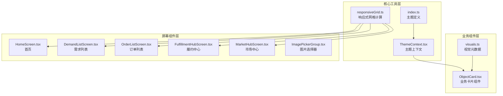
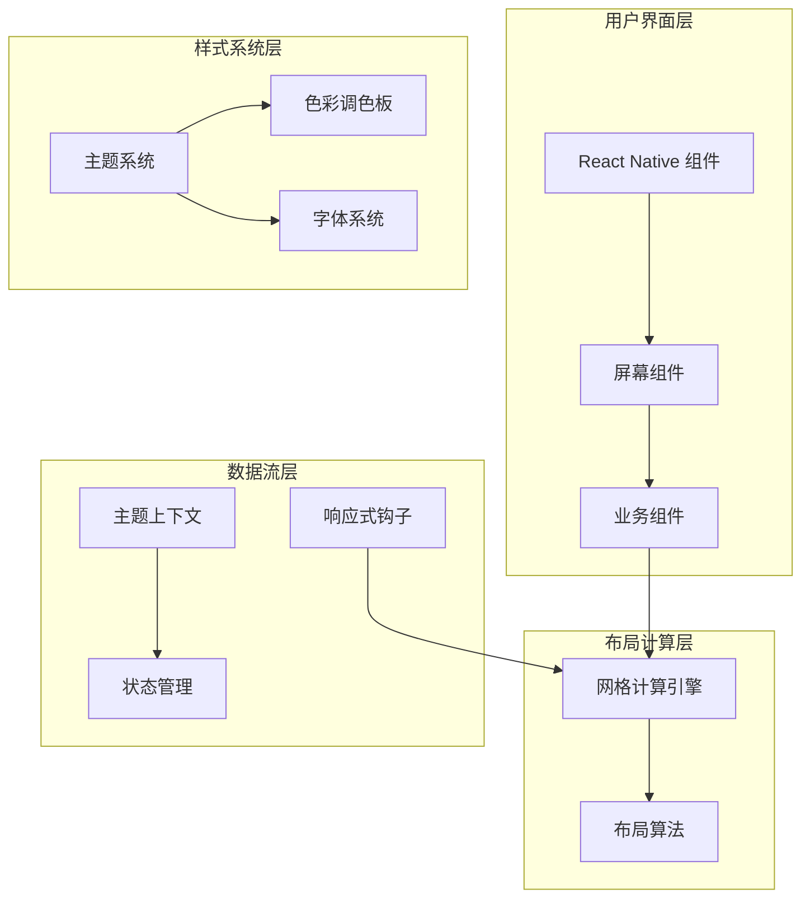
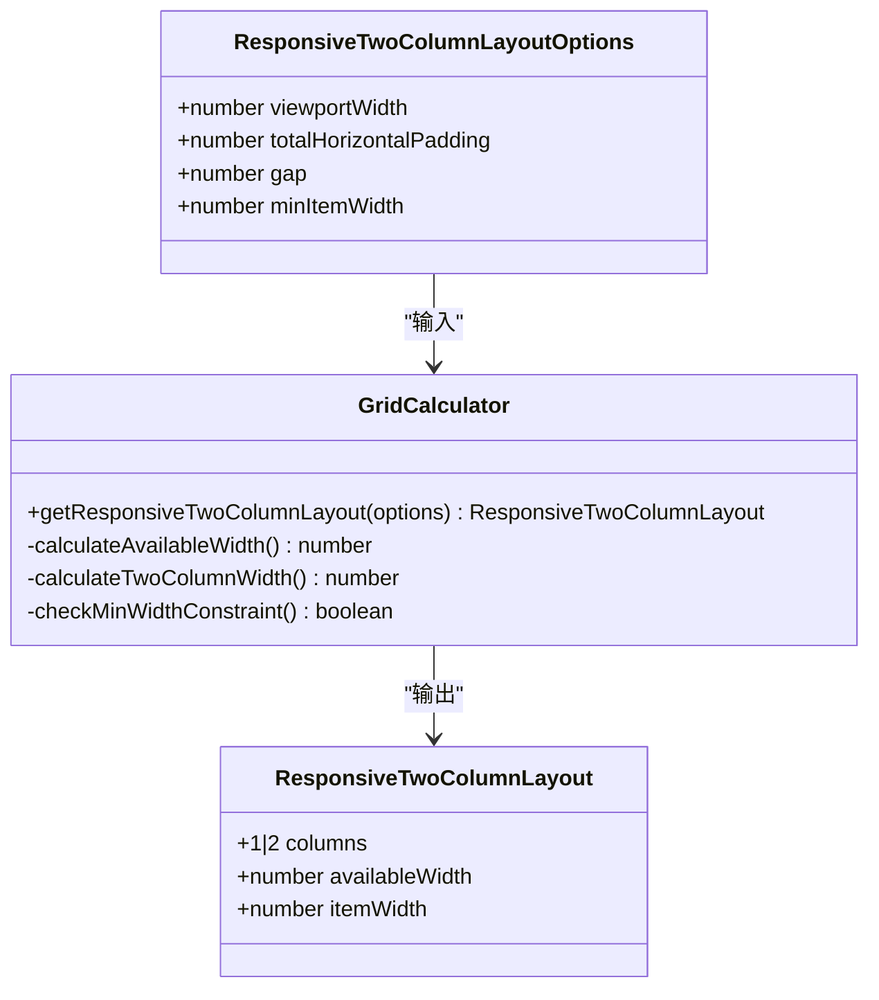
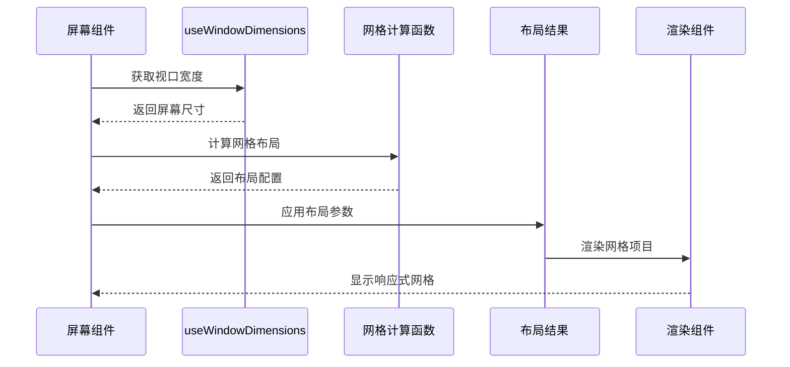
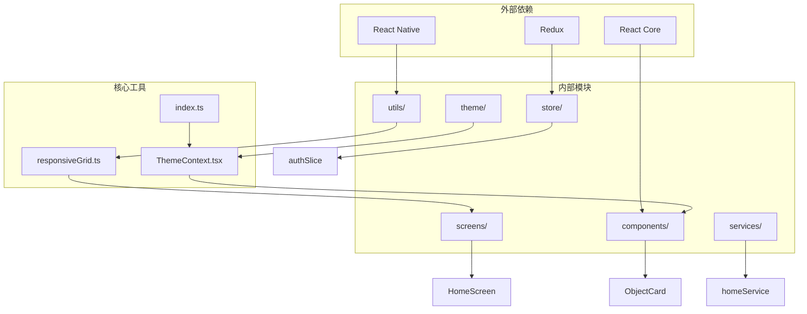

# 移动端响应式网格布局系统

<cite>
**本文档引用的文件**
- [responsiveGrid.ts](file://mobile/src/utils/responsiveGrid.ts)
- [index.ts](file://mobile/src/theme/index.ts)
- [ThemeContext.tsx](file://mobile/src/theme/ThemeContext.tsx)
- [ObjectCard.tsx](file://mobile/src/components/business/ObjectCard.tsx)
- [visuals.ts](file://mobile/src/components/business/visuals.ts)
- [HomeScreen.tsx](file://mobile/src/screens/home/HomeScreen.tsx)
- [DemandListScreen.tsx](file://mobile/src/screens/demand/DemandListScreen.tsx)
- [OrderListScreen.tsx](file://mobile/src/screens/order/OrderListScreen.tsx)
- [FulfillmentHubScreen.tsx](file://mobile/src/screens/fulfillment/FulfillmentHubScreen.tsx)
- [MarketHubScreen.tsx](file://mobile/src/screens/market/MarketHubScreen.tsx)
- [ImagePickerGroup.tsx](file://mobile/src/components/ImagePickerGroup.tsx)
- [navigation.web.ts](file://mobile/src/utils/navigation.web.ts)
</cite>

## 目录
1. [简介](#简介)
2. [项目结构](#项目结构)
3. [核心组件](#核心组件)
4. [架构概览](#架构概览)
5. [详细组件分析](#详细组件分析)
6. [依赖关系分析](#依赖关系分析)
7. [性能考虑](#性能考虑)
8. [故障排除指南](#故障排除指南)
9. [结论](#结论)

## 简介

移动端响应式网格布局系统是该无人机租赁平台移动应用的核心UI基础设施，专为React Native应用设计，提供灵活、高效的响应式网格布局解决方案。该系统通过智能的两列布局算法，能够根据设备屏幕尺寸自动调整网格项目的宽度和列数，确保在各种设备上都能提供最佳的用户体验。

系统采用类型安全的设计，结合主题系统和业务组件，实现了高度可定制的网格布局功能。通过统一的布局计算函数，所有屏幕组件都能获得一致的响应式行为，同时保持良好的性能表现。

## 项目结构

移动端响应式网格布局系统主要分布在以下目录结构中：



**图表来源**
- [responsiveGrid.ts:1-38](file://mobile/src/utils/responsiveGrid.ts#L1-L38)
- [ThemeContext.tsx:1-31](file://mobile/src/theme/ThemeContext.tsx#L1-L31)
- [HomeScreen.tsx:35-380](file://mobile/src/screens/home/HomeScreen.tsx#L35-L380)

**章节来源**
- [responsiveGrid.ts:1-38](file://mobile/src/utils/responsiveGrid.ts#L1-L38)
- [ThemeContext.tsx:1-31](file://mobile/src/theme/ThemeContext.tsx#L1-L31)
- [index.ts:1-202](file://mobile/src/theme/index.ts#L1-L202)

## 核心组件

### 响应式网格计算引擎

响应式网格计算引擎是整个系统的核心，提供了智能的两列布局算法。该引擎通过输入视口宽度、内边距和最小项目宽度等参数，自动计算出最适合的布局方案。

```mermaid
flowchart TD
Start([开始计算]) --> Input[接收输入参数<br/>- 视口宽度<br/>- 总水平内边距<br/>- 间距<br/>- 最小项目宽度]
Input --> CalcAvailable[计算可用宽度<br/>availableWidth = max(viewportWidth - totalHorizontalPadding, 0)]
CalcAvailable --> CalcTwoCol[计算双列宽度<br/>twoColumnWidth = floor((availableWidth - gap) / 2)]
CalcTwoCol --> CheckMin{"检查最小宽度限制"}
CheckMin --> |不满足| OneColumn[返回单列布局<br/>columns = 1<br/>itemWidth = availableWidth]
CheckMin --> |满足| TwoColumn[返回双列布局<br/>columns = 2<br/>itemWidth = twoColumnWidth]
OneColumn --> End([输出布局结果])
TwoColumn --> End
```

**图表来源**
- [responsiveGrid.ts:14-37](file://mobile/src/utils/responsiveGrid.ts#L14-L37)

### 主题系统集成

系统采用深色和浅色双主题设计，通过ThemeContext提供主题状态管理。主题系统与网格布局紧密集成，确保在不同主题下都能保持一致的视觉效果。

**章节来源**
- [responsiveGrid.ts:1-38](file://mobile/src/utils/responsiveGrid.ts#L1-L38)
- [ThemeContext.tsx:1-31](file://mobile/src/theme/ThemeContext.tsx#L1-L31)
- [index.ts:65-201](file://mobile/src/theme/index.ts#L65-L201)

## 架构概览

移动端响应式网格布局系统采用分层架构设计，确保了良好的模块化和可维护性：



**图表来源**
- [HomeScreen.tsx:251-380](file://mobile/src/screens/home/HomeScreen.tsx#L251-L380)
- [ThemeContext.tsx:14-26](file://mobile/src/theme/ThemeContext.tsx#L14-L26)

系统的核心优势在于其模块化设计，每个组件都有明确的职责分工，同时通过统一的接口进行交互，确保了系统的可扩展性和可维护性。

## 详细组件分析

### 响应式网格计算函数

getResponsiveTwoColumnLayout函数是整个系统的核心，它实现了智能的网格布局计算逻辑：



**图表来源**
- [responsiveGrid.ts:1-38](file://mobile/src/utils/responsiveGrid.ts#L1-L38)

该函数的计算逻辑简洁而高效，通过数学运算确保在任何屏幕尺寸下都能得到最优的布局结果。

### 屏幕组件集成模式

多个屏幕组件都集成了响应式网格布局功能，形成了统一的用户体验：



**图表来源**
- [HomeScreen.tsx:371-380](file://mobile/src/screens/home/HomeScreen.tsx#L371-L380)
- [FulfillmentHubScreen.tsx:52-61](file://mobile/src/screens/fulfillment/FulfillmentHubScreen.tsx#L52-L61)

### 业务组件适配

ObjectCard业务组件作为网格布局的基础单元，完美适配了响应式网格系统：

**章节来源**
- [ObjectCard.tsx:18-52](file://mobile/src/components/business/ObjectCard.tsx#L18-L52)
- [visuals.ts:1-185](file://mobile/src/components/business/visuals.ts#L1-L185)

## 依赖关系分析

系统各组件之间的依赖关系清晰明确，形成了良好的层次结构：



**图表来源**
- [HomeScreen.tsx:1-50](file://mobile/src/screens/home/HomeScreen.tsx#L1-L50)
- [ThemeContext.tsx:1-31](file://mobile/src/theme/ThemeContext.tsx#L1-L31)

这种依赖关系设计确保了系统的模块化程度高，便于单独测试和维护各个组件。

## 性能考虑

响应式网格布局系统在设计时充分考虑了性能优化：

### 计算优化
- 使用useMemo缓存布局计算结果，避免重复计算
- 通过useWindowDimensions监听屏幕尺寸变化，仅在必要时重新计算
- 数学运算复杂度为O(1)，确保实时响应性能

### 渲染优化
- 采用Flexbox布局，充分利用React Native的原生渲染优势
- 合理使用StyleSheet.create减少样式对象创建开销
- 图片选择器使用固定尺寸，避免布局抖动

### 内存管理
- 及时清理事件监听器和定时器
- 合理使用React.memo避免不必要的重渲染

## 故障排除指南

### 常见问题及解决方案

**布局计算异常**
- 检查视口宽度是否正确传递
- 确认总水平内边距计算准确
- 验证最小项目宽度设置合理

**主题显示问题**
- 确认ThemeContext正确提供主题状态
- 检查主题切换逻辑是否正常工作
- 验证CSS变量是否正确应用

**性能问题**
- 使用React DevTools Profiler分析组件渲染
- 检查是否有不必要的useMemo依赖
- 优化大列表的虚拟化渲染

**章节来源**
- [responsiveGrid.ts:14-37](file://mobile/src/utils/responsiveGrid.ts#L14-L37)
- [ThemeContext.tsx:14-26](file://mobile/src/theme/ThemeContext.tsx#L14-L26)

## 结论

移动端响应式网格布局系统通过其精心设计的架构和实现，成功地解决了跨设备屏幕适配的挑战。系统不仅提供了灵活高效的布局解决方案，还通过统一的主题系统和业务组件集成，确保了用户体验的一致性和可维护性。

该系统的成功之处在于其模块化的设计理念、类型安全的编程实践，以及对性能的持续关注。通过将复杂的布局计算抽象为简单的API，开发者可以专注于业务逻辑的实现，而不必担心底层的布局细节。

未来的发展方向包括进一步优化性能、扩展更多的布局模式支持，以及增强与其他UI框架的兼容性。随着移动设备屏幕尺寸的不断多样化，该系统将继续演进以满足新的设计需求和技术挑战。