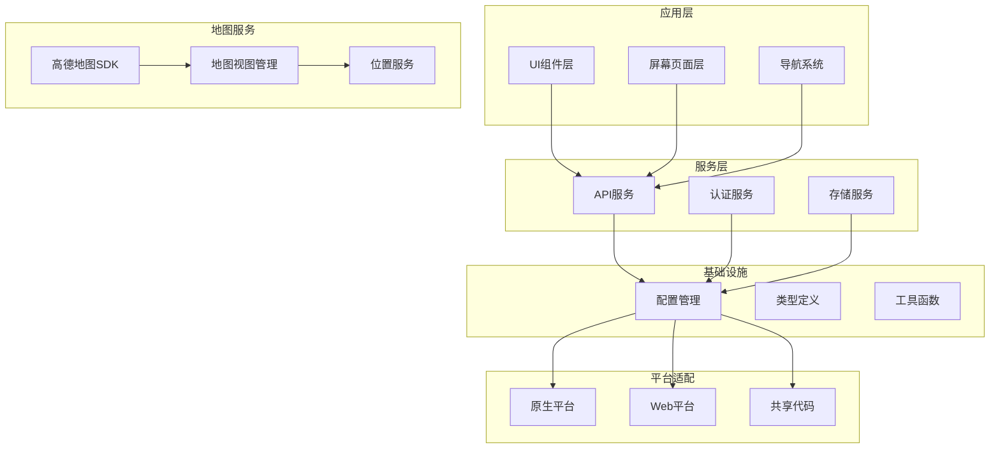
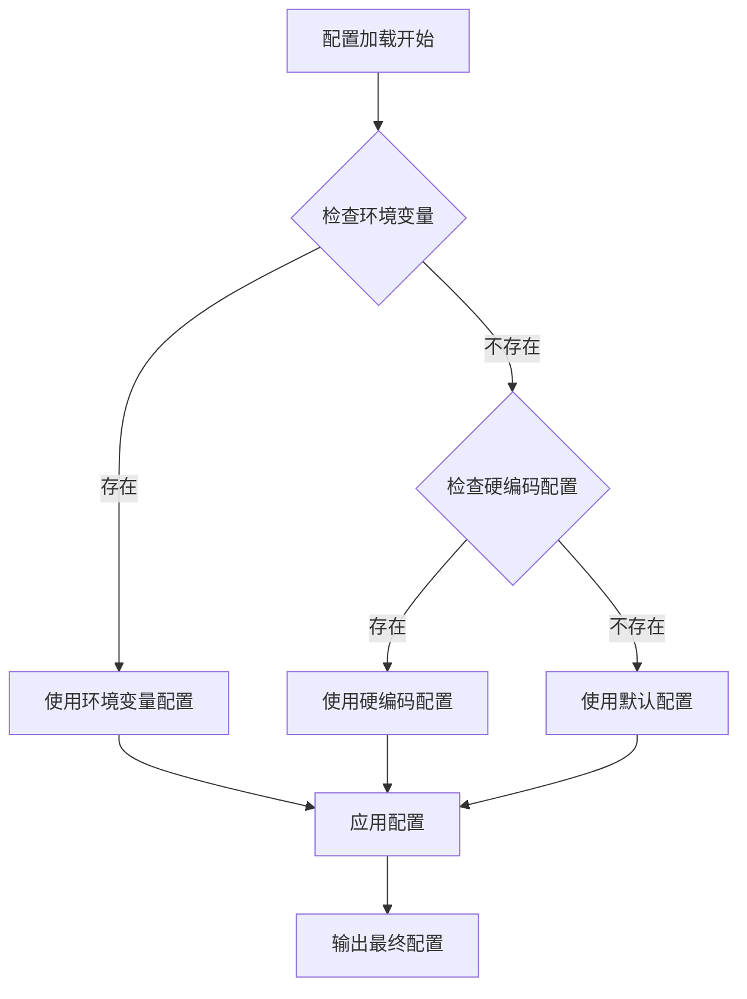
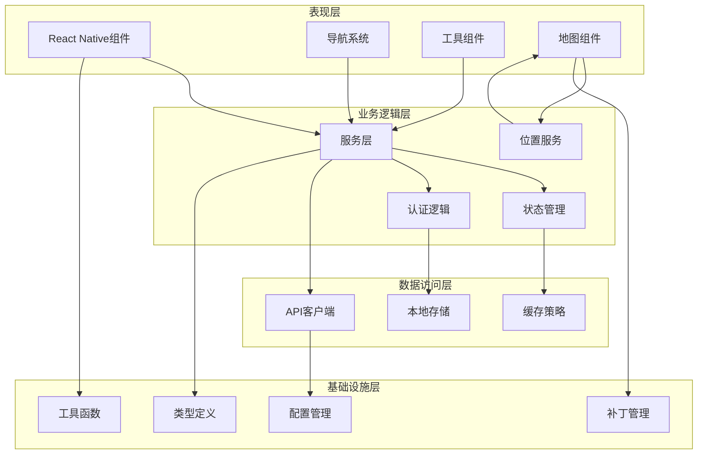
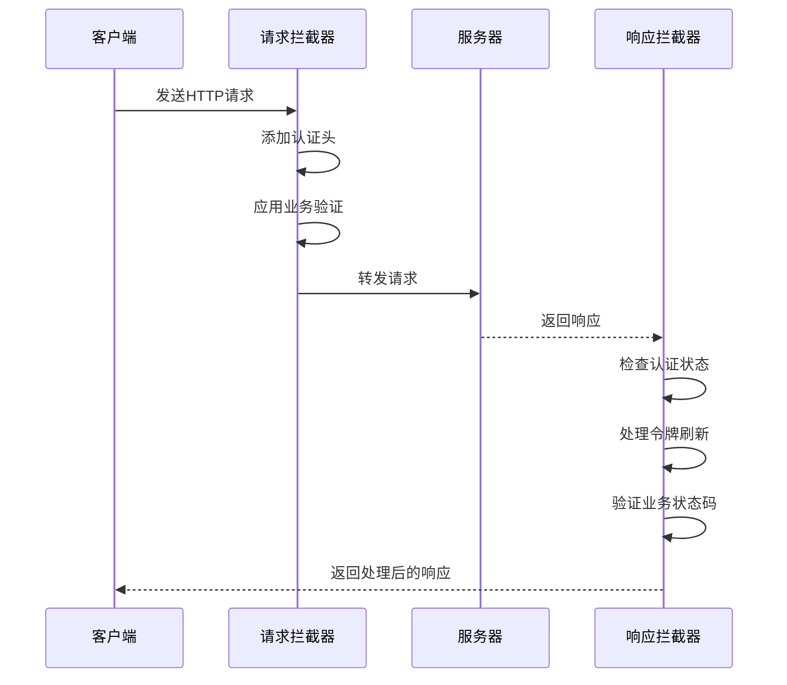
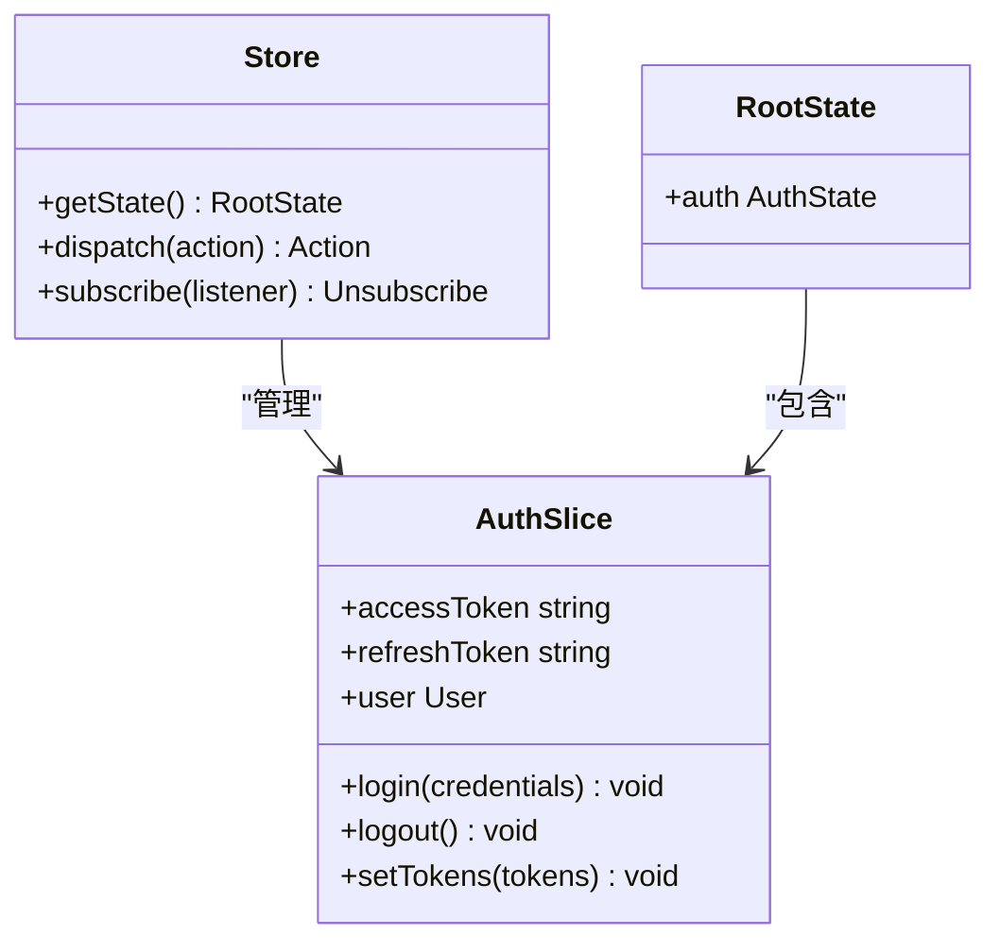
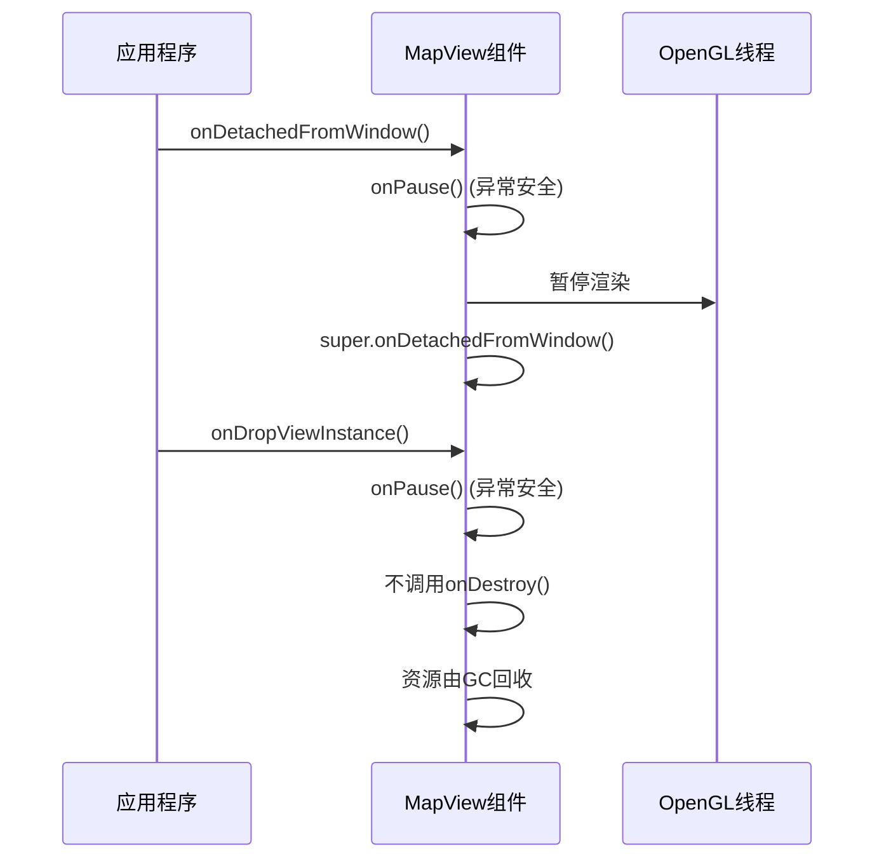
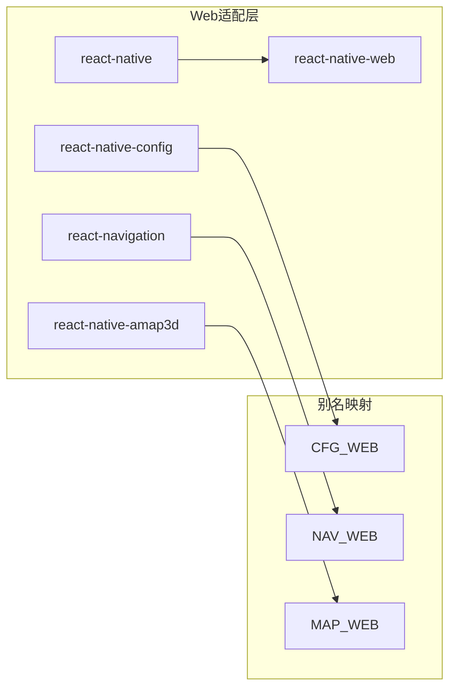
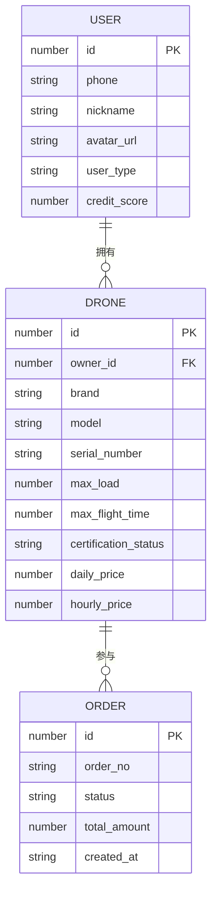
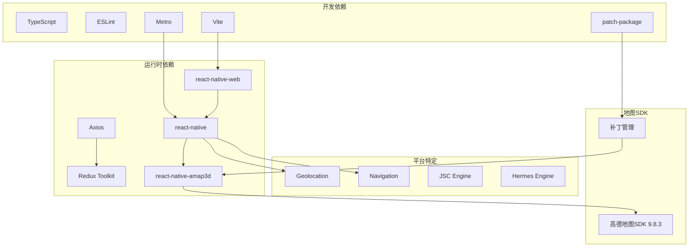
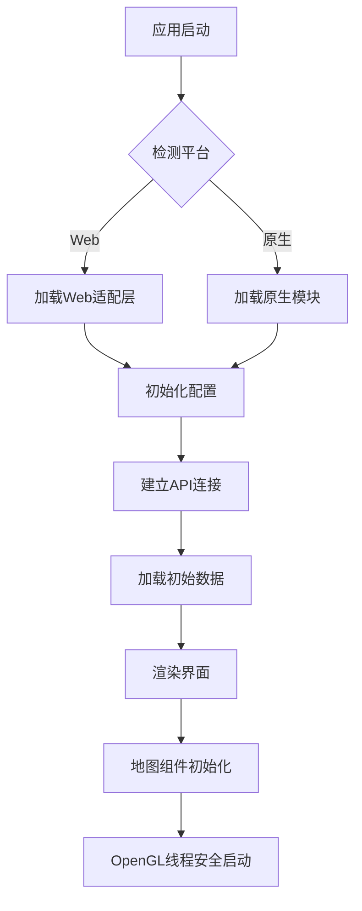

# 移动应用依赖管理

<cite>
**本文档引用的文件**
- [package.json](file://mobile/package.json)
- [android/app/build.gradle](file://mobile/android/app/build.gradle)
- [ios/Podfile](file://mobile/ios/Podfile)
- [android/build.gradle](file://mobile/android/build.gradle)
- [android/gradle.properties](file://mobile/android/gradle.properties)
- [vite.config.ts](file://mobile/vite.config.ts)
- [metro.config.js](file://mobile/metro.config.js)
- [babel.config.js](file://mobile/babel.config.js)
- [.eslintrc.js](file://mobile/.eslintrc.js)
- [tsconfig.json](file://mobile/tsconfig.json)
- [src/services/api.ts](file://mobile/src/services/api.ts)
- [src/store/store.ts](file://mobile/src/store/store.ts)
- [src/constants/index.ts](file://mobile/src/constants/index.ts)
- [src/utils/config.web.ts](file://mobile/src/utils/config.web.ts)
- [src/utils/navigation.web.ts](file://mobile/src/utils/navigation.web.ts)
- [src/types/index.ts](file://mobile/src/types/index.ts)
- [src/config/mockData.ts](file://mobile/src/config/mockData.ts)
- [src/types/react-native-amap3d.d.ts](file://mobile/src/types/react-native-amap3d.d.ts)
- [src/screens/location/MapPickerScreen.tsx](file://mobile/src/screens/location/MapPickerScreen.tsx)
- [patches/react-native-amap3d+3.2.4.patch](file://mobile/patches/react-native-amap3d+3.2.4.patch)
</cite>

## 更新摘要
**所做更改**
- 新增高德地图SDK关键补丁说明，修复OpenGL渲染线程生命周期管理问题
- 更新地图组件生命周期管理章节，反映新的onDetachedFromWindow和onPause处理机制
- 新增SIGABRT崩溃防护机制说明
- 更新依赖关系分析，包含react-native-amap3d的补丁影响

## 目录
1. [简介](#简介)
2. [项目结构](#项目结构)
3. [核心组件](#核心组件)
4. [架构概览](#架构概览)
5. [详细组件分析](#详细组件分析)
6. [依赖关系分析](#依赖关系分析)
7. [性能考虑](#性能考虑)
8. [故障排除指南](#故障排除指南)
9. [结论](#结论)

## 简介

这是一个基于 React Native 的无人机租赁平台移动应用，采用原生移动端与Web端一体化的跨平台架构设计。该应用通过统一的依赖管理系统，实现了Android、iOS和Web三个平台的一致性开发体验。

项目采用现代化的开发工具链，包括React Native 0.84.0、TypeScript、Redux Toolkit等核心技术栈，支持原生应用打包和Web浏览器运行两种部署方式。**新增**：应用集成了高德地图SDK（版本9.8.3），通过react-native-amap3d模块提供地图功能，并实施了关键的OpenGL渲染线程生命周期管理补丁。

## 项目结构

移动应用采用模块化组织结构，主要分为以下几个核心区域：

**图表来源**
- [package.json:14-35](file://mobile/package.json#L14-L35)
- [src/services/api.ts:1-155](file://mobile/src/services/api.ts#L1-L155)
- [src/types/react-native-amap3d.d.ts:1-87](file://mobile/src/types/react-native-amap3d.d.ts#L1-L87)

**章节来源**
- [package.json:1-66](file://mobile/package.json#L1-L66)
- [tsconfig.json:1-15](file://mobile/tsconfig.json#L1-L15)

## 核心组件

### 依赖管理策略

应用采用了多层次的依赖管理策略，确保在不同平台间的一致性和可维护性：

#### 核心依赖层次
- **运行时依赖**: React Native、Redux Toolkit、Axios等核心框架
- **开发依赖**: TypeScript、ESLint、Vite、Metro等开发工具
- **平台特定依赖**: React Native Config、地图SDK、导航库等
- **第三方补丁**: patch-package管理的react-native-amap3d关键补丁

#### 平台适配机制
- **Web兼容层**: 通过别名映射实现原生API到Web API的转换
- **配置抽象层**: 统一的配置管理，支持环境变量和硬编码配置
- **类型安全层**: 完整的TypeScript类型定义，确保编译时安全
- **补丁管理**: 通过patch-package自动化应用第三方库的修复补丁

**章节来源**
- [package.json:14-59](file://mobile/package.json#L14-L59)
- [vite.config.ts:11-28](file://mobile/vite.config.ts#L11-L28)
- [patches/react-native-amap3d+3.2.4.patch:1-45](file://mobile/patches/react-native-amap3d+3.2.4.patch#L1-L45)

### 高德地图SDK集成

应用集成了高德地图SDK，通过react-native-amap3d模块提供完整的地图功能：

#### 地图组件生命周期管理
**更新**：应用了关键的OpenGL渲染线程生命周期管理补丁：

- **onDetachedFromWindow重写**: 确保在TextureView表面销毁前正确暂停GL线程
- **onPause替代onDestroy**: 避免可能导致SIGABRT崩溃的直接销毁调用
- **异常安全处理**: 所有生命周期方法都包含try-catch保护

#### 地图服务特性
- **实时定位**: 集成高德地图定位服务
- **POI搜索**: 周边兴趣点查询和展示
- **路径规划**: 地图导航和路线规划
- **缩放控制**: 支持手势缩放和控件缩放

**章节来源**
- [src/types/react-native-amap3d.d.ts:1-87](file://mobile/src/types/react-native-amap3d.d.ts#L1-L87)
- [src/screens/location/MapPickerScreen.tsx:1-473](file://mobile/src/screens/location/MapPickerScreen.tsx#L1-L473)
- [patches/react-native-amap3d+3.2.4.patch:17-42](file://mobile/patches/react-native-amap3d+3.2.4.patch#L17-L42)

### 配置管理系统

应用实现了灵活的配置管理机制，支持多环境部署：

**图表来源**
- [src/constants/index.ts:21-59](file://mobile/src/constants/index.ts#L21-L59)

**章节来源**
- [src/constants/index.ts:1-228](file://mobile/src/constants/index.ts#L1-L228)
- [src/utils/config.web.ts:1-26](file://mobile/src/utils/config.web.ts#L1-L26)

## 架构概览

应用采用分层架构设计，通过清晰的职责分离实现高内聚低耦合：

**图表来源**
- [src/services/api.ts:6-155](file://mobile/src/services/api.ts#L6-L155)
- [src/store/store.ts:1-12](file://mobile/src/store/store.ts#L1-L12)
- [src/types/react-native-amap3d.d.ts:78-82](file://mobile/src/types/react-native-amap3d.d.ts#L78-L82)

## 详细组件分析

### API服务组件

API服务组件是应用的核心通信层，实现了统一的HTTP请求处理和响应拦截：

#### 请求拦截器流程

**图表来源**
- [src/services/api.ts:18-152](file://mobile/src/services/api.ts#L18-L152)

#### 令牌管理机制
API服务实现了完整的令牌管理机制，包括：

- **自动认证头注入**: 自动为每个请求添加Authorization头
- **并发刷新控制**: 防止多个请求同时触发令牌刷新
- **重试机制**: 在令牌刷新成功后自动重试原请求
- **错误处理**: 处理各种认证和授权相关的错误情况

**章节来源**
- [src/services/api.ts:1-155](file://mobile/src/services/api.ts#L1-L155)

### Redux状态管理

应用采用Redux Toolkit作为状态管理解决方案：

**图表来源**
- [src/store/store.ts:1-12](file://mobile/src/store/store.ts#L1-L12)

**章节来源**
- [src/store/store.ts:1-12](file://mobile/src/store/store.ts#L1-L12)

### 地图组件生命周期管理

**更新**：应用了关键的OpenGL渲染线程生命周期管理补丁，确保地图组件的稳定运行：

#### OpenGL渲染线程管理

**图表来源**
- [patches/react-native-amap3d+3.2.4.patch:17-42](file://mobile/patches/react-native-amap3d+3.2.4.patch#L17-L42)

#### SIGABRT崩溃防护机制
- **异常捕获**: 所有生命周期方法都包含try-catch保护
- **渐进式清理**: 使用onPause替代可能导致崩溃的onDestroy
- **资源安全释放**: 依赖垃圾回收机制安全释放OpenGL资源

#### 地图组件安全退出
应用实现了安全的地图组件退出机制：

- **延迟销毁**: 通过定时器延迟组件销毁，避免立即卸载
- **状态跟踪**: 使用ref跟踪组件关闭状态，防止重复操作
- **导航拦截**: 拦截返回操作，先隐藏地图再执行导航

**章节来源**
- [patches/react-native-amap3d+3.2.4.patch:17-42](file://mobile/patches/react-native-amap3d+3.2.4.patch#L17-L42)
- [src/screens/location/MapPickerScreen.tsx:89-105](file://mobile/src/screens/location/MapPickerScreen.tsx#L89-L105)

### 平台适配层

应用实现了完善的平台适配机制，确保在不同平台间的一致性：

#### Web平台适配

**图表来源**
- [vite.config.ts:12-18](file://mobile/vite.config.ts#L12-L18)

**章节来源**
- [vite.config.ts:1-37](file://mobile/vite.config.ts#L1-L37)
- [src/utils/navigation.web.ts:1-165](file://mobile/src/utils/navigation.web.ts#L1-L165)

### 类型安全系统

应用建立了完整的TypeScript类型定义体系：

#### 核心类型结构

**图表来源**
- [src/types/index.ts:1-909](file://mobile/src/types/index.ts#L1-L909)

#### 高德地图类型定义
**更新**：新增完整的高德地图SDK类型定义：

- **MapViewProps接口**: 完整的地图视图属性定义
- **CameraEvent接口**: 相机事件数据结构
- **Marker组件**: 地标组件类型定义
- **AMapSdk命名空间**: SDK初始化和版本查询

**章节来源**
- [src/types/index.ts:1-909](file://mobile/src/types/index.ts#L1-L909)
- [src/types/react-native-amap3d.d.ts:1-87](file://mobile/src/types/react-native-amap3d.d.ts#L1-L87)

## 依赖关系分析

### 依赖图谱

应用的依赖关系呈现复杂的多层嵌套结构：

**图表来源**
- [package.json:14-59](file://mobile/package.json#L14-L59)
- [android/app/build.gradle:119](file://mobile/android/app/build.gradle#L119)

### 依赖冲突解决

应用通过以下策略解决潜在的依赖冲突：

1. **版本锁定**: 使用package-lock.json确保依赖版本一致性
2. **别名映射**: 通过Vite配置解决模块解析冲突
3. **条件加载**: 根据平台动态选择合适的实现
4. **类型声明**: 提供完整的TypeScript类型定义
5. **补丁管理**: 通过patch-package自动化应用第三方库修复

**更新**：新增补丁管理机制，确保第三方库的安全更新：

- **自动化补丁**: 通过postinstall脚本自动应用补丁
- **OpenGL线程安全**: 修复可能导致SIGABRT的生命周期管理问题
- **异常安全**: 所有生命周期方法都包含异常处理

**章节来源**
- [package.json:1-66](file://mobile/package.json#L1-L66)
- [vite.config.ts:11-37](file://mobile/vite.config.ts#L11-L37)
- [patches/react-native-amap3d+3.2.4.patch:1-45](file://mobile/patches/react-native-amap3d+3.2.4.patch#L1-L45)

## 性能考虑

### 构建优化

应用采用了多项性能优化策略：

#### Web构建优化
- **依赖预构建**: 通过optimizeDeps配置预构建常用依赖
- **按需加载**: 利用React.lazy实现组件的懒加载
- **代码分割**: 自动生成路由级别的代码分割

#### 原生构建优化
- **Hermes引擎**: 启用Hermes JavaScript引擎提升运行性能
- **多架构支持**: 支持ARM64、x86等多种CPU架构
- **增量构建**: 利用Gradle的增量编译功能

#### 地图组件性能优化
**更新**：地图组件实施了多项性能优化措施：

- **OpenGL线程管理**: 通过补丁优化OpenGL渲染线程生命周期
- **内存安全释放**: 使用onPause替代onDestroy避免内存泄漏
- **异常安全处理**: 所有操作都包含try-catch保护
- **渐进式清理**: 避免立即销毁组件导致的性能问题

### 运行时性能

**图表来源**
- [src/constants/index.ts:121-132](file://mobile/src/constants/index.ts#L121-L132)

## 故障排除指南

### 常见问题诊断

#### 配置问题
- **API地址无法访问**: 检查环境变量设置和网络连接
- **地图SDK初始化失败**: 验证高德地图Key的有效性
- **认证失败**: 确认令牌刷新机制正常工作

#### 构建问题
- **依赖安装失败**: 清理node_modules和package-lock.json重新安装
- **Android构建错误**: 检查NDK和SDK版本兼容性
- **iOS构建错误**: 验证CocoaPods依赖和签名配置
- **补丁应用失败**: 检查patch-package配置和补丁文件完整性

#### 运行时问题
- **Web端功能异常**: 检查Vite配置和别名映射
- **原生模块加载失败**: 验证autolinking配置
- **类型检查错误**: 更新TypeScript定义文件
- **地图组件崩溃**: 检查OpenGL线程管理补丁是否正确应用
- **SIGABRT崩溃**: 确认onPause替代onDestroy的补丁生效

#### 地图组件问题
**更新**：新增地图组件相关故障排除：

- **OpenGL渲染异常**: 检查onDetachedFromWindow重写是否生效
- **内存泄漏**: 确认onPause调用而非onDestroy
- **地图不响应**: 验证异常安全处理机制
- **定位服务失效**: 检查高德地图Key配置

**章节来源**
- [src/constants/index.ts:1-228](file://mobile/src/constants/index.ts#L1-L228)
- [src/utils/config.web.ts:1-26](file://mobile/src/utils/config.web.ts#L1-L26)
- [patches/react-native-amap3d+3.2.4.patch:17-42](file://mobile/patches/react-native-amap3d+3.2.4.patch#L17-L42)

## 结论

该移动应用的依赖管理系统展现了现代React Native项目的最佳实践：

### 主要优势
1. **统一的开发体验**: 一套代码支持多个平台部署
2. **完善的类型安全**: 全面的TypeScript类型定义
3. **灵活的配置管理**: 支持多环境和多平台配置
4. **健壮的状态管理**: 基于Redux Toolkit的可预测状态管理
5. **安全的第三方库集成**: 通过补丁管理确保库的安全更新
6. **高性能的地图服务**: 优化的OpenGL渲染线程管理

### 技术亮点
- **模块化架构**: 清晰的职责分离和依赖关系
- **平台适配机制**: 优雅的跨平台解决方案
- **性能优化策略**: 多层次的性能优化措施
- **开发工具链**: 完善的开发和构建工具配置
- **安全补丁管理**: 自动化的第三方库修复机制
- **异常安全处理**: 全面的错误处理和恢复机制

### 最新改进
**更新**：本次更新重点加强了地图组件的稳定性：

- **OpenGL线程安全**: 通过补丁修复了可能导致SIGABRT的生命周期管理问题
- **渐进式清理机制**: 使用onPause替代可能导致崩溃的onDestroy
- **异常安全保护**: 所有生命周期方法都包含try-catch保护
- **资源安全释放**: 依赖垃圾回收机制安全释放OpenGL资源

该依赖管理体系为项目的长期维护和发展奠定了坚实的基础，为类似的企业级移动应用开发提供了优秀的参考模板。特别是新增的地图组件安全机制，为高德地图SDK的稳定使用提供了重要保障。