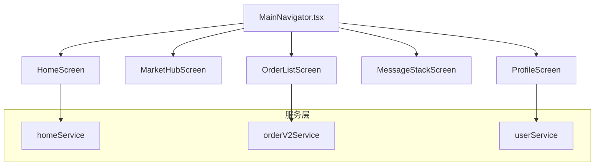
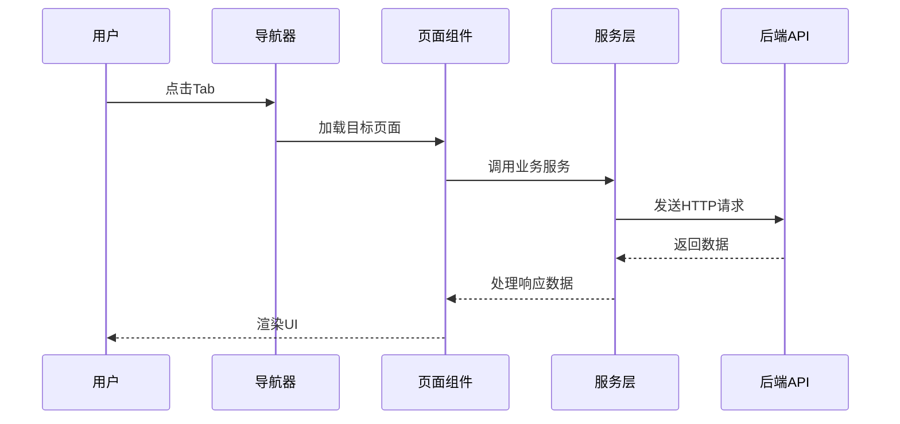
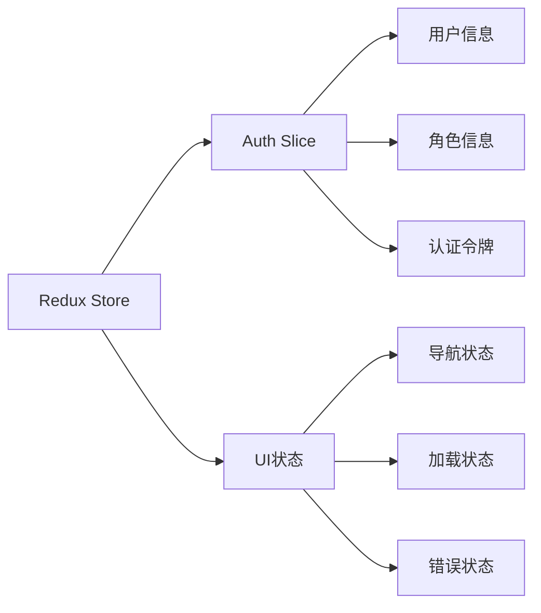

# 移动端UX简化执行规划

<cite>
**本文档引用的文件**
- [MOBILE_UX_SIMPLIFICATION_EXECUTION_PLAN.md](file://MOBILE_UX_SIMPLIFICATION_EXECUTION_PLAN.md)
- [MainNavigator.tsx](file://mobile/src/navigation/MainNavigator.tsx)
- [HomeScreen.tsx](file://mobile/src/screens/home/HomeScreen.tsx)
- [ProfileScreen.tsx](file://mobile/src/screens/profile/ProfileScreen.tsx)
- [OrderListScreen.tsx](file://mobile/src/screens/order/OrderListScreen.tsx)
- [MarketHubScreen.tsx](file://mobile/src/screens/market/MarketHubScreen.tsx)
- [api.ts](file://mobile/src/services/api.ts)
- [index.ts](file://mobile/src/types/index.ts)
- [roleSummary.ts](file://mobile/src/utils/roleSummary.ts)
- [index.ts](file://mobile/src/theme/index.ts)
- [store.ts](file://mobile/src/store/store.ts)
- [package.json](file://mobile/package.json)
</cite>

## 目录
1. [项目概述](#项目概述)
2. [执行规划总览](#执行规划总览)
3. [核心目标与原则](#核心目标与原则)
4. [任务分解与执行计划](#任务分解与执行计划)
5. [技术架构分析](#技术架构分析)
6. [详细任务分析](#详细任务分析)
7. [质量保证与验收标准](#质量保证与验收标准)
8. [风险控制与变更管理](#风险控制与变更管理)
9. [总结与展望](#总结与展望)

## 项目概述

本项目是一个基于React Native的无人机租赁平台移动应用，采用现代化的移动端UX简化执行规划，旨在解决当前"移动端不好找、层级偏深、心智负担偏重"的问题。

### 项目特点

- **多角色支持**：客户、机主、飞手、复合身份四类角色
- **核心对象**：需求、供给、订单、正式派单、飞行记录五类核心业务对象
- **技术栈**：React Native 0.84.0 + TypeScript + Redux Toolkit + React Navigation
- **跨平台**：同时支持iOS、Android和Web平台

## 执行规划总览

### 项目基线状态

根据执行规划文件，项目当前处于以下状态：

- **仓库路径**：`/Users/yinsw1994/myproject/drone_rental_platform/drone_Rental_platform_v1`
- **当前分支**：`main`
- **当前提交**：`d5f6dffb0289dafa122c908895b0cc207a40224e`
- **工作区状态**：clean

### 顶级导航结构

项目采用5个一级Tab的导航结构：

| Tab | 当前名称 | 目标名称 | 职责 |
|-----|----------|----------|------|
| 首页 | 首页 | 首页 | 今日待办 + 进行中任务 |
| 市场 | 市场 | 市场 | 需求/服务内容列表 |
| 履约 | Orders | 进度 | 订单列表 |
| 消息 | 消息 | 消息 | 会话和通知 |
| 我的 | 我的 | 我的 | 账号、资料、常用个人入口 |

## 核心目标与原则

### 本轮改版目标

本轮移动端UX简化改版的核心目标是降低用户认知负荷，具体包括：

1. **内容优先**：用户进入Tab后先看到内容，而不是先看到解释页或目录页
2. **任务驱动**：首页只回答"现在最该处理什么"，不再承担业务百科角色
3. **用户友好**：用户不需要先理解"供给/履约/候选/驾驶舱"等内部术语
4. **入口优化**：高频动作入口数量减少，但带上下文的深链入口仍保留

### 设计原则

- **先减法，后重做**：优先去除重复和解释性内容
- **保持对象边界**：订单列表只展示订单，需求列表只展示需求
- **前后端分离**：不修改后端契约，不新增API接口
- **同步更新**：Native与Web必须同时更新

## 任务分解与执行计划

### Sprint A（必须完成）

#### UX-01：进度Tab直达订单列表

**目标**：将"履约"标签改为"进度"，并让Orders Tab直接指向订单列表

**关键变更**：
- 修改MainNavigator.tsx中的Tab标签为"进度"
- 将Orders Tab的组件从`FulfillmentHubScreen`切换到`OrderListScreen`
- Web预览中同步更新Orders Tab落地内容

**验收标准**：
- 点击底部"进度"，第一屏是订单列表
- Web和Native行为一致
- 机主与飞手仍可从进度页进入各自执行工具

#### UX-02：首页减负

**目标**：将首页从"驾驶舱"改为"今天该做什么"

**设计冻结点**：
- 保留角色切换但降级为视图筛选器
- 保留"待办"与"进行中"两个核心区域
- 删除市场Feed区块
- Hero改为简洁摘要，不再保留大块指标矩阵
- 快捷入口最多保留4个

**实现策略**：
- 保留现有数据源`homeService.getDashboard()`
- 缩短Hero文案，只保留一句摘要和一个主操作
- 将"紧急待办"改成"今天优先处理"
- 直接移除`feedConfig`相关渲染

#### UX-03："我的"页减负

**目标**：将"我的"页首屏变成普通用户能快速理解的页面

**设计冻结点**：
- Hero资料卡保留
- 首屏只强调高频入口
- "账号卡/身份卡/能力卡"不再全部强展示在首屏
- "退出登录"继续保留在底部

**推荐结构**：
1. Hero资料卡
2. 常用入口
3. 账号与安全
4. 可选折叠区：身份与能力

### Sprint B（建议完成）

#### UX-04：市场页内容化

**目标**：让市场Tab首屏看到真实内容，而不是动作卡目录

**设计冻结点**：
- 市场页首屏必须展示内容流
- 顶部使用"看需求/看服务"或同义结构
- 主操作按钮只保留一个
- 原本的"边界提醒"和"大段解释"不再作为主内容

**技术约束**：
- 优先复用现有列表能力
- 如果现有API不足以支撑真正的双列表聚合，不要强行新造复杂数据层

### 通用任务

#### UX-05：文案统一与重复入口收敛

**目标**：减少重复入口和设计者话语

**执行规则**：
- "履约"改成"进度"
- 首页不再突出"驾驶舱"
- 主文案优先使用"任务/服务/进度/飞手任务"
- 保留上下文深链，不保留泛化重复入口

#### UX-06：回归与验收文档更新

**目标**：固定本轮减负改版的验收方式

## 技术架构分析

### 导航架构

项目采用React Navigation的底部标签导航模式：



**图表来源**
- [MainNavigator.tsx:111-129](file://mobile/src/navigation/MainNavigator.tsx#L111-L129)
- [HomeScreen.tsx:32-32](file://mobile/src/screens/home/HomeScreen.tsx#L32-L32)
- [OrderListScreen.tsx:20-20](file://mobile/src/screens/order/OrderListScreen.tsx#L20-L20)

### 数据流架构



**图表来源**
- [api.ts:66-78](file://mobile/src/services/api.ts#L66-L78)
- [HomeScreen.tsx:334-353](file://mobile/src/screens/home/HomeScreen.tsx#L334-L353)

### 状态管理

项目使用Redux Toolkit进行状态管理：



**图表来源**
- [store.ts:4-7](file://mobile/src/store/store.ts#L4-L7)
- [roleSummary.ts:14-15](file://mobile/src/utils/roleSummary.ts#L14-L15)

## 详细任务分析

### UX-01：进度Tab直达订单列表

#### 技术实现要点

1. **导航配置修改**：
   - 修改MainNavigator.tsx中的`Orders` Tab标签为"进度"
   - 将组件从`FulfillmentHubScreen`切换到`OrderListScreen`

2. **Web同步更新**：
   - 更新index.web.tsx中的对应Tab配置
   - 确保Web和Native行为一致

3. **工具入口保留**：
   - 机主保留"正式派单"入口
   - 飞手保留"飞手任务"和"飞行记录"入口

#### 关键文件变更

**MainNavigator.tsx关键行**：
- 第124行：`<Tab.Screen name="Orders" component={OrderListScreen} options={{tabBarLabel: '进度'}} />`

**OrderListScreen.tsx增强**：
- 添加轻量工具入口区域
- 根据角色显示相应工具按钮

### UX-02：首页减负

#### 设计重构

1. **信息层次简化**：
   - 从原来的5段内容压缩为4层结构
   - 删除市场Feed和大段解释性Hero文案
   - 移除大块指标矩阵

2. **内容结构调整**：
   - 简洁头部摘要
   - "今天优先处理"
   - "进行中"
   - "常用动作"

3. **入口优化**：
   - 快捷入口最多保留4个
   - 删除重复的入口项
   - 保留上下文深链

#### 数据源利用

首页继续使用现有的`homeService.getDashboard()`数据源，通过前端逻辑重组数据展示。

### UX-03："我的"页减负

#### 结构重组

1. **首屏优化**：
   - 保留Hero资料卡
   - 首屏强调高频入口（我的订单、我的需求、我的供给、实名认证、设置）
   - 删除"账号卡/身份卡/能力卡"的强展示

2. **交互改进**：
   - "身份与能力"详情改为可折叠区域
   - 保持原有档案链路从二级入口进入

3. **角色适配**：
   - 根据用户实际拥有的角色动态显示入口
   - 不存在的角色不补空占位卡

#### 组件优化

ProfileScreen.tsx经过重构后，首屏信息量显著减少，用户体验更加直观。

### UX-04：市场页内容化

#### 实现策略

由于UX-04属于Sprint B任务，当前阶段主要考虑：

1. **渐进式内容化**：
   - 保持MarketHubScreen作为过渡页面
   - 顶部添加"看需求/看服务"切换器
   - 保留当前的动作卡布局

2. **未来扩展**：
   - 可以逐步将MarketHubScreen改造成"轻内容页+单个默认列表入口+一个主按钮"
   - 保持与现有列表能力的兼容性

## 质量保证与验收标准

### 验收标准体系

#### 导航层验收
- MainNavigator与index.web是否同步
- "进度"是否已经直达订单列表
- 是否还存在多余的中转目录页

#### 首页验收
- 首屏是否明显比旧版更短
- 是否去掉了独立市场Feed
- 是否仍保留上下文明确的待办跳转
- 是否没有新增新的解释性大段文案

#### "我的"页验收
- 高频入口是否上收到了首屏
- 系统概念是否已经下沉或弱化
- 用户是否能快速找到设置与认证

#### 文案验收
- 是否仍在主标题中大量使用"驾驶舱/履约/撮合"
- 是否把用户文案改成过度口语，导致专业含义丢失
- 是否存在同一对象多种叫法混用

### 测试策略

1. **自动化测试**：
   - 运行`npx tsc --noEmit`确保类型检查通过
   - 运行`npm run web:build`验证Web构建

2. **手动回归测试**：
   - 多角色账号测试（客户/机主/飞手）
   - Native与Web对比测试
   - 关键流程验证（登录、导航、数据加载）

## 风险控制与变更管理

### 风险识别

1. **范围蔓延风险**：
   - 严格按照本轮冻结决策执行
   - 不得擅自扩大任务范围

2. **技术债务风险**：
   - 保持现有API契约不变
   - 不得修改后端接口

3. **一致性风险**：
   - Native与Web必须同步更新
   - 任何涉及Tab的改动都需要两端同时修改

### 变更控制流程

1. **版本标记**：
   ```bash
   git tag -a ui-before-ux-simplification-20260326 -m "Before mobile UX simplification round"
   git push origin ui-before-ux-simplification-20260326
   ```

2. **回退机制**：
   ```bash
   git checkout -b restore/ui-before-ux-simplification ui-before-ux-simplification-20260326
   ```

3. **代码审查**：
   - 每个任务完成后进行代码审查
   - 确保符合执行规划要求
   - 验证验收标准达标

### 并行与串行规则

#### 可并行任务
- UX-02 首页减负
- UX-03 我的页减负

#### 必须串行任务
1. UX-00 先于一切
2. UX-01 先于 UX-06
3. UX-02 与 UX-05 串行
4. UX-04 最好在 UX-01/02/03 稳定后再做

## 总结与展望

### 项目成果预期

通过本轮移动端UX简化改版，预期达到以下成果：

1. **用户体验提升**：用户能够更快找到所需功能，减少学习成本
2. **信息架构优化**：内容优先的设计让用户直接看到有价值的信息
3. **操作效率提高**：高频动作入口减少，操作路径更加清晰
4. **技术债务控制**：在不改变后端契约的前提下实现界面优化

### 后续改进建议

1. **持续优化**：根据用户反馈持续改进界面设计
2. **性能监控**：关注页面加载速度和交互流畅度
3. **无障碍支持**：考虑更多用户群体的使用需求
4. **国际化扩展**：为多语言环境做好准备

### 技术债务清理

项目在执行过程中需要注意：
- 保持现有代码结构的稳定性
- 避免引入不必要的复杂度
- 确保向后兼容性
- 维护代码质量和可维护性

通过严格的执行规划和质量控制，本项目将成功实现移动端UX的简化目标，为用户提供更加直观、高效的服务体验。