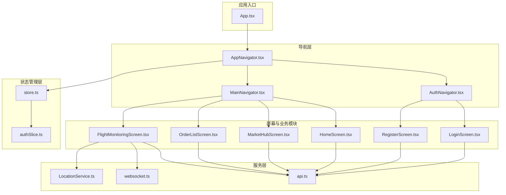
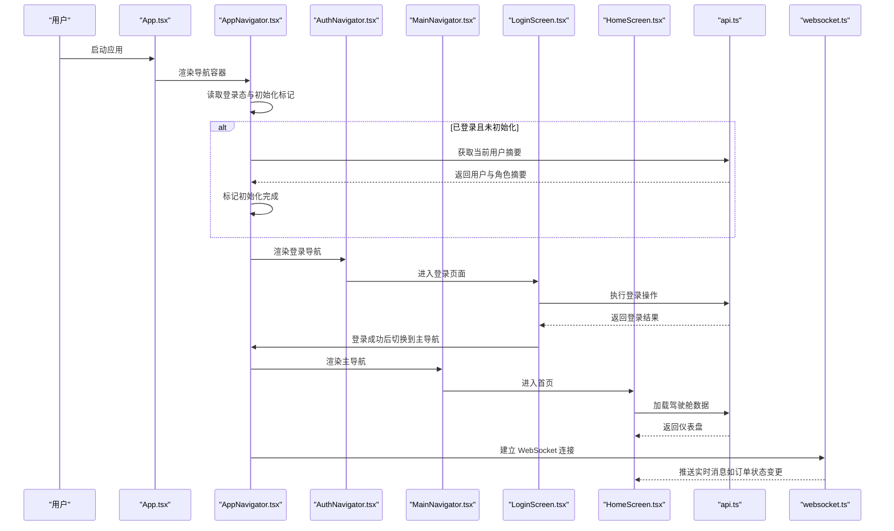
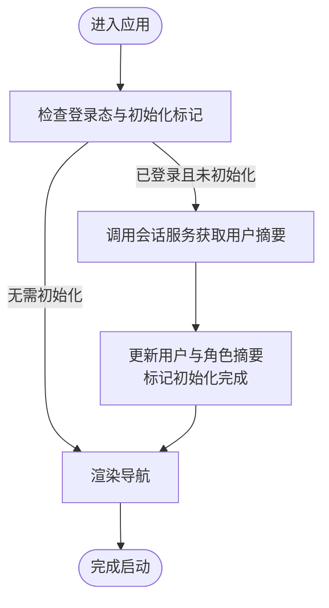
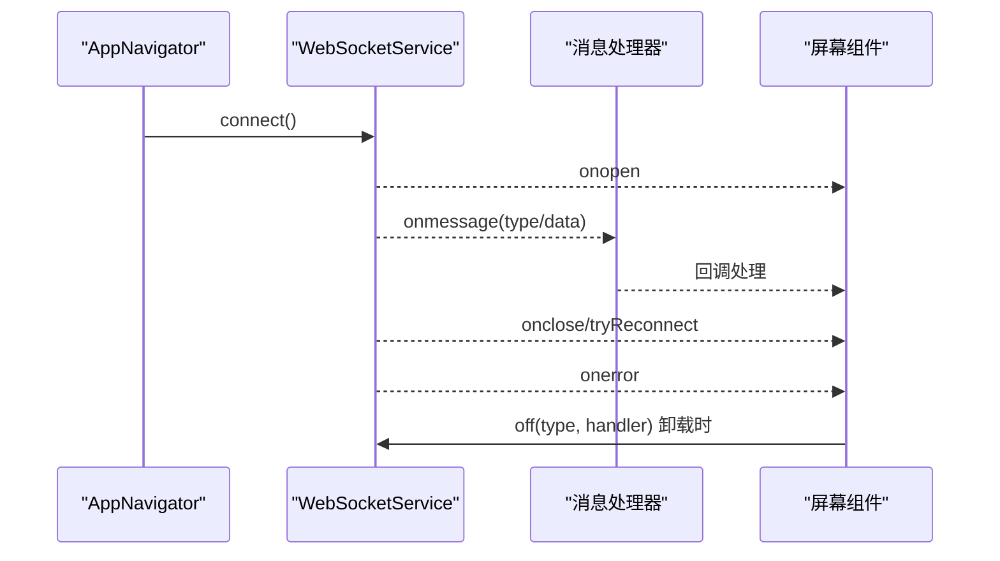
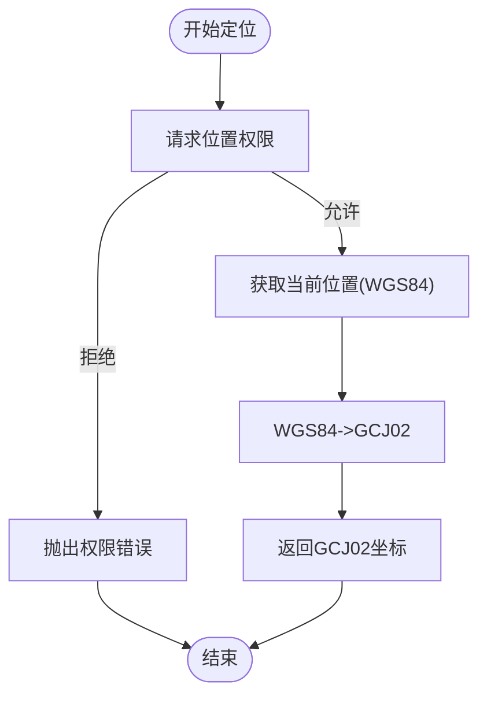
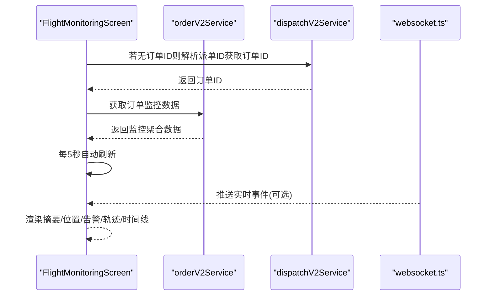
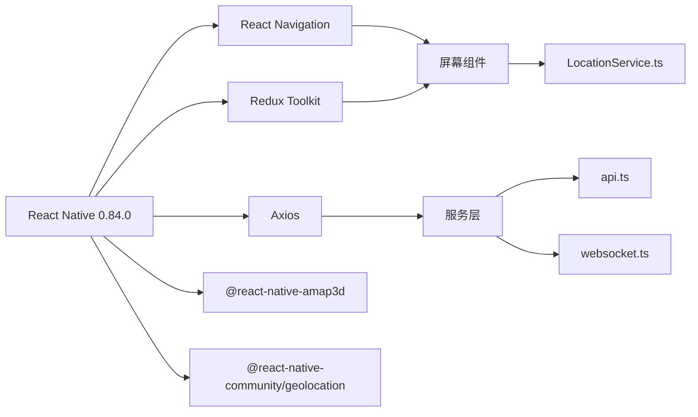

# 移动端应用

<cite>
**本文引用的文件**
- [mobile/README.md](file://mobile/README.md)
- [mobile/package.json](file://mobile/package.json)
- [mobile/package-lock.json](file://mobile/package-lock.json)
- [mobile/ios/Podfile](file://mobile/ios/Podfile)
- [mobile/ios/Podfile.lock](file://mobile/ios/Podfile.lock)
- [mobile/ios/WurenjiMobile/AppDelegate.swift](file://mobile/ios/WurenjiMobile/AppDelegate.swift)
- [mobile/ios/WurenjiMobile/Info.plist](file://mobile/ios/WurenjiMobile/Info.plist)
- [mobile/android/app/src/main/AndroidManifest.xml](file://mobile/android/app/src/main/AndroidManifest.xml)
- [mobile/android/app/src/main/res/values/strings.xml](file://mobile/android/app/src/main/res/values/strings.xml)
- [mobile/android/app/src/main/java/com/wurenjimobile/MainActivity.kt](file://mobile/android/app/src/main/java/com/wurenjimobile/MainActivity.kt)
- [mobile/android/app/src/main/java/com/wurenjimobile/MainApplication.kt](file://mobile/android/app/src/main/java/com/wurenjimobile/MainApplication.kt)
- [mobile/app.json](file://mobile/app.json)
- [App.tsx](file://mobile/App.tsx)
- [src/navigation/AppNavigator.tsx](file://mobile/src/navigation/AppNavigator.tsx)
- [src/navigation/MainNavigator.tsx](file://mobile/src/navigation/MainNavigator.tsx)
- [src/navigation/AuthNavigator.tsx](file://mobile/src/navigation/AuthNavigator.tsx)
- [src/store/store.ts](file://mobile/src/store/store.ts)
- [src/store/slices/authSlice.ts](file://mobile/src/store/slices/authSlice.ts)
- [src/services/api.ts](file://mobile/src/services/api.ts)
- [src/services/websocket.ts](file://mobile/src/services/websocket.ts)
- [src/utils/LocationService.ts](file://mobile/src/utils/LocationService.ts)
- [src/screens/home/HomeScreen.tsx](file://mobile/src/screens/home/HomeScreen.tsx)
- [src/screens/market/MarketHubScreen.tsx](file://mobile/src/screens/market/MarketHubScreen.tsx)
- [src/screens/order/OrderListScreen.tsx](file://mobile/src/screens/order/OrderListScreen.tsx)
- [src/screens/flight/FlightMonitoringScreen.tsx](file://mobile/src/screens/flight/FlightMonitoringScreen.tsx)
- [src/screens/auth/LoginScreen.tsx](file://mobile/src/screens/auth/LoginScreen.tsx)
- [src/screens/auth/RegisterScreen.tsx](file://mobile/src/screens/auth/RegisterScreen.tsx)
</cite>

## 更新摘要
**变更内容**
- 应用品牌重塑：将应用名称从 'WurenjiMobile' 更新为 '无人机服务'
- 移动应用配置更新：app.json 中的 displayName 更新为 '无人机服务'
- iOS平台配置更新：Info.plist 中的 CFBundleDisplayName 和 CFBundleName 更新为 '无人机服务'
- Android平台配置更新：strings.xml 中的 app_name 更新为 '无人机服务'
- 登录界面更新：LoginScreen.tsx 中的应用标题更新为 '无人机服务'
- 包名保持不变：Android 包名 com.wurenjimobile 仍为 wurenjimobile

## 目录
1. [简介](#简介)
2. [项目结构](#项目结构)
3. [核心组件](#核心组件)
4. [架构总览](#架构总览)
5. [详细组件分析](#详细组件分析)
6. [依赖关系分析](#依赖关系分析)
7. [性能考量](#性能考量)
8. [故障排查指南](#故障排查指南)
9. [结论](#结论)
10. [附录](#附录)

## 简介
本文件为无人机租赁平台移动端应用（React Native）的完整技术文档，面向移动端开发与产品团队，覆盖应用架构、导航体系、状态管理、模块化功能实现（用户界面、需求发布、市场与撮合、订单管理、飞行监控）、移动端特性（实时定位、地图集成、离线数据策略）、API 调用与鉴权、错误处理与最佳实践。

**更新** 本版本反映了应用品牌重塑的重要变更，将应用名称从 'WurenjiMobile' 更新为 '无人机服务'，涉及移动应用配置、iOS平台配置、Android平台配置以及登录界面等多个文件的更新。

## 项目结构
移动端采用 React Native + TypeScript 架构，使用 Redux Toolkit 管理全局状态，基于 React Navigation 实现多层级导航，结合 Axios 与自定义拦截器实现 API 与鉴权，WebSocket 提供消息推送，内置定位与地图工具链支持飞行监控与地理围栏场景。

**章节来源**
- [mobile/README.md:1-98](file://mobile/README.md#L1-L98)
- [mobile/package.json:1-64](file://mobile/package.json#L1-L64)

## 核心组件
- 应用入口与主题：应用根组件负责 Provider、SafeAreaProvider、StatusBar 与主题上下文注入，确保全屏安全区域与主题一致。
- 导航容器：AppNavigator 根据登录态切换 AuthNavigator 或 MainNavigator，并在登录后建立 WebSocket 连接；MainNavigator 使用底部标签与原生栈组合，承载所有业务页面。
- 状态管理：Redux Store 仅包含 auth 模块，提供登录态、用户信息、角色汇总与令牌存储；通过切片集中管理登录、登出、令牌刷新与初始化标记。
- 服务层：API 客户端封装 v1/v2 两套基础地址，统一请求头注入与响应拦截，内置并发刷新令牌队列与错误提示；WebSocket 封装连接、断线重连、订阅与发送。
- 工具层：定位服务提供权限请求、超时保护、WGS84 到 GCJ02 坐标转换，适配国内地图 SDK。

**更新** 品牌重塑后，核心组件保持原有架构不变，但应用名称统一更新为 '无人机服务'，体现在各平台的配置文件和界面显示中。

**章节来源**
- [App.tsx:1-33](file://mobile/App.tsx#L1-L33)
- [src/navigation/AppNavigator.tsx:1-88](file://mobile/src/navigation/AppNavigator.tsx#L1-L88)
- [src/navigation/MainNavigator.tsx:1-195](file://mobile/src/navigation/MainNavigator.tsx#L1-L195)
- [src/navigation/AuthNavigator.tsx:1-16](file://mobile/src/navigation/AuthNavigator.tsx#L1-L16)
- [src/store/store.ts:1-12](file://mobile/src/store/store.ts#L1-L12)
- [src/store/slices/authSlice.ts:1-65](file://mobile/src/store/slices/authSlice.ts#L1-L65)
- [src/services/api.ts:1-155](file://mobile/src/services/api.ts#L1-L155)
- [src/services/websocket.ts:1-86](file://mobile/src/services/websocket.ts#L1-L86)
- [src/utils/LocationService.ts:1-145](file://mobile/src/utils/LocationService.ts#L1-L145)

## 架构总览
应用采用"入口-导航-状态-服务-屏幕"分层架构，导航层根据登录态与角色动态渲染；状态层集中管理认证与用户信息；服务层抽象网络与实时通信；屏幕层按业务域组织，复用通用组件与视觉规范。

**更新** 架构保持稳定，品牌重塑后的应用名称统一显示为 '无人机服务'。

**图表来源**
- [App.tsx:1-33](file://mobile/App.tsx#L1-L33)
- [src/navigation/AppNavigator.tsx:1-88](file://mobile/src/navigation/AppNavigator.tsx#L1-L88)
- [src/navigation/AuthNavigator.tsx:1-16](file://mobile/src/navigation/AuthNavigator.tsx#L1-L16)
- [src/navigation/MainNavigator.tsx:1-195](file://mobile/src/navigation/MainNavigator.tsx#L1-L195)
- [src/screens/home/HomeScreen.tsx:1-800](file://mobile/src/screens/home/HomeScreen.tsx#L1-L800)
- [src/services/api.ts:1-155](file://mobile/src/services/api.ts#L1-L155)
- [src/services/websocket.ts:1-86](file://mobile/src/services/websocket.ts#L1-L86)

## 详细组件分析

### 导航系统
- 登录态切换：AppNavigator 在每次登录态变化时重建导航容器 key，确保 Auth 与 Main 的正确切换；同时在登录态变化时连接/断开 WebSocket。
- 主导航结构：MainNavigator 使用底部标签与原生栈组合，统一承载市场、履约、消息、我的等入口；大量业务页面以栈内 Screen 形式注册，便于参数传递与返回栈管理。
- 权限与角色：导航层不直接处理权限，但屏幕层通过角色摘要与用户信息控制菜单项与行为。

**章节来源**
- [src/navigation/AppNavigator.tsx:1-88](file://mobile/src/navigation/AppNavigator.tsx#L1-L88)
- [src/navigation/MainNavigator.tsx:1-195](file://mobile/src/navigation/MainNavigator.tsx#L1-L195)
- [src/navigation/AuthNavigator.tsx:1-16](file://mobile/src/navigation/AuthNavigator.tsx#L1-L16)

### 状态管理策略
- Store 结构：仅包含 auth reducer，避免过度拆分导致复杂度上升。
- 认证状态：包含用户、角色摘要、访问令牌、刷新令牌、登录态与初始化标记；提供 setCredentials、logout、setTokens、setMeSummary 等动作。
- 初始化流程：AppNavigator 在已登录且未初始化时拉取用户摘要，完成后标记初始化，避免重复请求。

**图表来源**
- [src/navigation/AppNavigator.tsx:32-65](file://mobile/src/navigation/AppNavigator.tsx#L32-L65)
- [src/store/slices/authSlice.ts:22-61](file://mobile/src/store/slices/authSlice.ts#L22-L61)

**章节来源**
- [src/store/store.ts:1-12](file://mobile/src/store/store.ts#L1-L12)
- [src/store/slices/authSlice.ts:1-65](file://mobile/src/store/slices/authSlice.ts#L1-L65)
- [src/navigation/AppNavigator.tsx:1-88](file://mobile/src/navigation/AppNavigator.tsx#L1-L88)

### API 调用策略与鉴权
- 客户端构建：分别构建 v1 与 v2 基础地址客户端，统一超时与 Content-Type。
- 请求头注入：拦截器在请求前从 Redux 中读取 access_token 并附加 Authorization。
- 业务码校验：对 v1 与 v2 的成功码进行统一判断，非成功码统一抛错。
- 刷新令牌：401 时尝试使用 refresh_token 刷新 access_token，避免并发刷新冲突，失败则登出。
- 错误处理：统一提取 message/error/message 字段作为错误提示，兜底为"网络请求失败"。

```mermaid
sequenceDiagram
participant C as "调用方"
participant AX as "api.ts/Axios"
participant INT as "拦截器"
participant BE as "后端"
participant RT as "刷新令牌接口"
C->>AX : 发起请求
AX->>INT : 注入Authorization头
INT->>BE : 发送带令牌请求
alt 成功
BE-->>AX : 返回业务数据
AX-->>C : 解析并返回
else 401 且有refresh_token
BE-->>AX : 401 Unauthorized
AX->>RT : POST 刷新令牌
alt 刷新成功
RT-->>AX : 新access_token
AX->>INT : 更新Authorization头
INT->>BE : 重试原请求
BE-->>AX : 返回业务数据
AX-->>C : 解析并返回
else 刷新失败
RT-->>AX : 失败
AX->>C : 触发登出并报错
end
else 其他错误
BE-->>AX : 错误响应
AX-->>C : 统一错误提示
end
```

**图表来源**
- [src/services/api.ts:6-155](file://mobile/src/services/api.ts#L6-L155)

**章节来源**
- [src/services/api.ts:1-155](file://mobile/src/services/api.ts#L1-L155)

### 实时通信与消息推送
- 连接建立：登录后由 AppNavigator 建立 WebSocket，携带 access_token 查询参数。
- 消息路由：按 message.type 分发给订阅处理器，同时广播给通配订阅者。
- 断线重连：指数退避最多 5 次，避免频繁重试。
- 使用建议：在屏幕组件中订阅类型事件，组件卸载时取消订阅，避免内存泄漏。

**图表来源**
- [src/navigation/AppNavigator.tsx:21-30](file://mobile/src/navigation/AppNavigator.tsx#L21-L30)
- [src/services/websocket.ts:6-86](file://mobile/src/services/websocket.ts#L6-L86)

**章节来源**
- [src/services/websocket.ts:1-86](file://mobile/src/services/websocket.ts#L1-L86)
- [src/navigation/AppNavigator.tsx:1-88](file://mobile/src/navigation/AppNavigator.tsx#L1-L88)

### 移动端特性：实时定位与地图集成
- 权限与超时：Android 使用权限请求，iOS 通过原生授权接口并设置超时兜底；定位失败按错误码映射提示。
- 坐标转换：提供 WGS84 到 GCJ02 的转换函数，适配国内地图 SDK。
- 使用建议：在需要地图选点或轨迹绘制前，先调用权限请求与定位，再进行地图渲染。

**图表来源**
- [src/utils/LocationService.ts:65-144](file://mobile/src/utils/LocationService.ts#L65-L144)

**章节来源**
- [src/utils/LocationService.ts:1-145](file://mobile/src/utils/LocationService.ts#L1-L145)

### 用户界面模块（首页驾驶舱）
- 角色驱动：根据用户角色（客户/机主/飞手）与角色汇总动态切换首页内容与快捷入口。
- 数据聚合：首页驾驶舱聚合订单、市场、派单等指标，支持按角色与状态过滤。
- 交互体验：下拉刷新、懒加载、徽标提示与一键跳转。

**章节来源**
- [src/screens/home/HomeScreen.tsx:1-800](file://mobile/src/screens/home/HomeScreen.tsx#L1-L800)

### 市场与撮合模块（市场枢纽）
- 功能边界：市场页专注于需求与供给的浏览与发布，不直接展示订单与派单任务。
- 角色扩展：依据角色显示"发布需求/供给"、"我的需求/供给/无人机"等入口。
- 交互设计：网格布局、强调色与图标卡片提升点击效率。

**章节来源**
- [src/screens/market/MarketHubScreen.tsx:1-282](file://mobile/src/screens/market/MarketHubScreen.tsx#L1-L282)

### 订单管理模块
- 数据源：统一从 v2 订单服务拉取，支持按角色与状态聚合。
- 过滤与排序：支持"全部/待处理/进行中/已完成"分组与精确状态筛选；按更新时间倒序合并。
- 展示策略：一行卡片展示来源、状态、金额、角色提示，点击进入详情。

**章节来源**
- [src/screens/order/OrderListScreen.tsx:1-554](file://mobile/src/screens/order/OrderListScreen.tsx#L1-L554)

### 飞行监控模块
- 数据聚合：从订单监控接口获取订单状态、派单、最新位置、告警、统计与时间线。
- 自动刷新：进入页面后每 5 秒轮询一次，支持手动暂停。
- 场景联动：可从订单详情或派单详情进入，支持跳转轨迹记录与派单详情。

**图表来源**
- [src/screens/flight/FlightMonitoringScreen.tsx:236-429](file://mobile/src/screens/flight/FlightMonitoringScreen.tsx#L236-L429)
- [src/services/websocket.ts:6-86](file://mobile/src/services/websocket.ts#L6-L86)

**章节来源**
- [src/screens/flight/FlightMonitoringScreen.tsx:1-708](file://mobile/src/screens/flight/FlightMonitoringScreen.tsx#L1-L708)
- [src/services/websocket.ts:1-86](file://mobile/src/services/websocket.ts#L1-L86)

### 登录界面模块
- 品牌统一：登录界面标题统一显示为 '无人机服务'，体现品牌重塑效果。
- 多样化登录：支持验证码登录和密码登录两种模式，提供第三方登录入口。
- 快速登录：开发模式下提供多种角色的快速登录选项，便于测试和演示。

**更新** 登录界面已更新为新的品牌名称 '无人机服务'，体现在标题显示和界面元素中。

**章节来源**
- [src/screens/auth/LoginScreen.tsx:1-445](file://mobile/src/screens/auth/LoginScreen.tsx#L1-L445)

### 注册界面模块
- 简洁设计：注册界面采用简洁的表单设计，包含手机号、验证码、密码和昵称输入。
- 流程引导：提供验证码发送倒计时功能，引导用户完成注册流程。
- 状态管理：注册成功后自动登录并跳转到应用主界面。

**章节来源**
- [src/screens/auth/RegisterScreen.tsx:1-98](file://mobile/src/screens/auth/RegisterScreen.tsx#L1-L98)

## 依赖关系分析
- 运行时依赖：React、React Native、Redux Toolkit、Axios、React Navigation、地图与定位相关插件。
- 开发依赖：Babel、TypeScript、ESLint、Vite（Web 预览）、Jest。
- 关键耦合点：导航层依赖状态层以决定渲染；屏幕层依赖服务层；服务层依赖状态层以读取令牌。

**更新** 依赖管理现代化后，依赖版本得到显著提升：
- React Native升级至0.84.0，提供更好的性能和稳定性
- Node.js要求升级至22.11.0，确保与现代开发环境兼容
- package-lock.json升级至版本3，提供更好的依赖锁定和构建性能
- iOS平台配置现代化，支持最新的Xcode和CocoaPods版本

**图表来源**
- [mobile/package.json:14-35](file://mobile/package.json#L14-L35)

**章节来源**
- [mobile/package.json:1-64](file://mobile/package.json#L1-L64)

## 性能考量
- 导航切换：使用 key 变更强制重建导航容器，避免状态污染；仅在登录态变化时重建，减少不必要的重渲染。
- 列表渲染：订单列表使用 FlatList，分组与过滤在前端完成；建议在服务端支持分页与筛选以降低前端压力。
- 图标与主题：底部标签使用表情符号，减少图片资源；主题上下文集中管理，避免重复计算。
- 网络优化：统一超时与错误提示，避免长时间阻塞 UI；刷新令牌采用队列去重，避免并发风暴。
- 地图与定位：定位请求带超时与兜底，坐标转换在本地完成，减少网络往返。

**更新** 依赖管理现代化带来的性能提升：
- Node.js 22.11.0提供更好的垃圾回收和执行性能
- React Native 0.84.0优化了原生模块集成和内存管理
- 包锁版本3提供更精确的依赖解析，减少构建时间
- iOS平台配置现代化提升编译效率和运行时性能

## 故障排查指南
- 登录后无数据：检查 AppNavigator 是否完成"获取用户摘要"流程，确认初始化标记；查看 API 拦截器是否注入了 Authorization。
- 401 刷新失败：确认 refresh_token 是否存在；检查刷新接口返回码与数据结构；必要时触发登出清理状态。
- WebSocket 不连：确认 access_token 是否存在；检查断线重连次数上限；在组件卸载时及时 off 订阅。
- 定位失败：Android 检查权限请求结果；iOS 检查授权回调与超时逻辑；定位失败时根据错误码提示用户。
- 页面空白或加载慢：检查屏幕组件的懒加载与缓存策略；避免在渲染中进行重型计算。
- 品牌显示异常：检查 app.json、Info.plist、AndroidManifest.xml 中的应用名称配置是否一致。

**更新** 新增品牌重塑相关故障排查：
- 应用名称显示不一致：检查各平台配置文件中的应用名称是否都已更新为 '无人机服务'
- 包名冲突：确认 Android 包名 com.wurenjimobile 与应用名称 '无人机服务' 的一致性
- 登录界面显示异常：检查 LoginScreen.tsx 中的应用标题是否已更新

**章节来源**
- [src/navigation/AppNavigator.tsx:21-65](file://mobile/src/navigation/AppNavigator.tsx#L21-L65)
- [src/services/api.ts:79-146](file://mobile/src/services/api.ts#L79-L146)
- [src/services/websocket.ts:13-47](file://mobile/src/services/websocket.ts#L13-L47)
- [src/utils/LocationService.ts:65-144](file://mobile/src/utils/LocationService.ts#L65-L144)

## 结论
该移动端应用以清晰的分层架构与职责划分，实现了从导航到状态、从网络到实时通信的完整闭环。通过角色驱动的界面与统一的服务层，满足了无人机租赁平台在市场撮合、订单履约与飞行监控等场景下的移动端需求。

**更新** 品牌重塑升级后，应用获得了以下优势：
- 统一的品牌形象和用户体验
- 更符合目标用户认知的应用名称
- 完整的跨平台配置更新（iOS、Android、Web预览）
- 保持了原有的技术架构和功能完整性

建议在后续迭代中进一步完善服务端分页与筛选能力、增强离线数据策略与缓存一致性，并持续优化首屏性能与弱网体验。

## 附录
- 快速启动与运行：参考项目 README 的 Metro 启动、Android/iOS 运行步骤与调试方式。
- 项目脚本：包含启动、打包、测试、Web 预览等常用命令。
- 依赖管理：Node.js 22.11.0、React Native 0.84.0、package-lock.json版本3、iOS平台现代化配置。
- 品牌配置：应用名称统一更新为 '无人机服务'，涉及 app.json、Info.plist、AndroidManifest.xml 等多个配置文件。

**更新** 新增品牌重塑相关信息：
- 应用名称：无人机服务
- iOS配置：CFBundleDisplayName 和 CFBundleName 更新为 '无人机服务'
- Android配置：app_name 更新为 '无人机服务'
- Web预览：mobile-preview/src/App.tsx 中的应用名称已同步更新
- 包名保持：Android 包名 com.wurenjimobile 保持不变

**章节来源**
- [mobile/README.md:1-98](file://mobile/README.md#L1-L98)
- [mobile/package.json:5-12](file://mobile/package.json#L5-L12)
- [mobile/package.json:60-62](file://mobile/package.json#L60-L62)
- [mobile/app.json:1-5](file://mobile/app.json#L1-L5)
- [mobile/ios/WurenjiMobile/Info.plist:9-18](file://mobile/ios/WurenjiMobile/Info.plist#L9-L18)
- [mobile/android/app/src/main/res/values/strings.xml:1-4](file://mobile/android/app/src/main/res/values/strings.xml#L1-L4)
- [mobile/src/screens/auth/LoginScreen.tsx:182-184](file://mobile/src/screens/auth/LoginScreen.tsx#L182-L184)