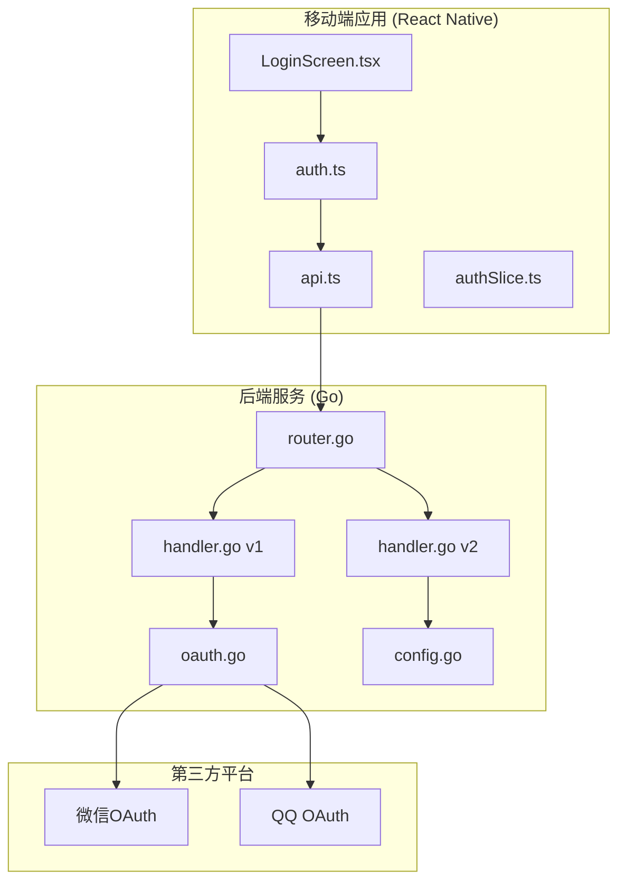
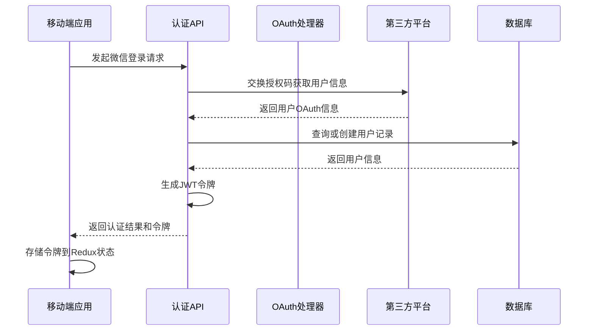
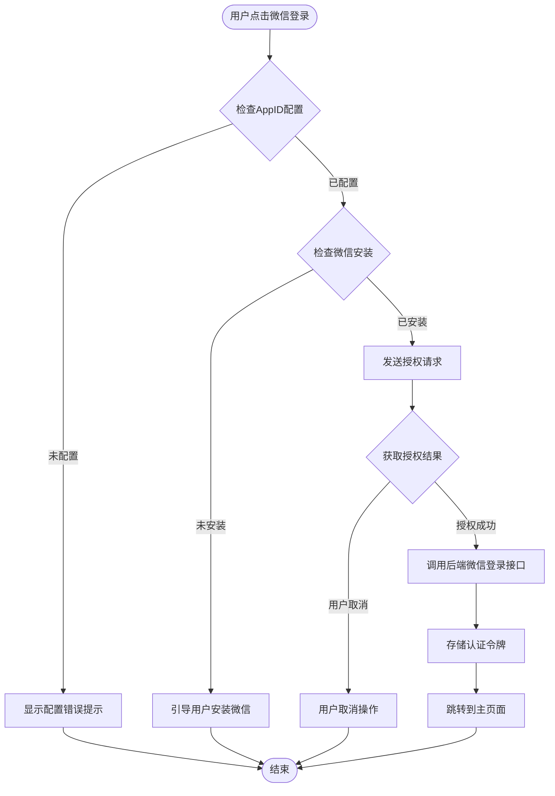
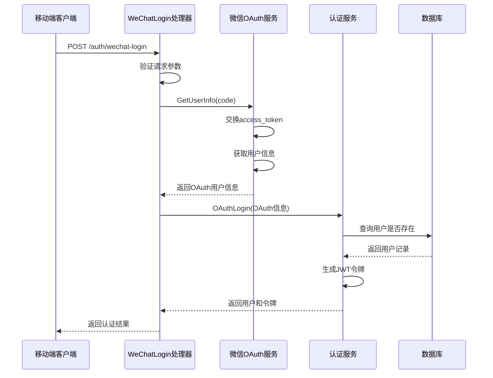
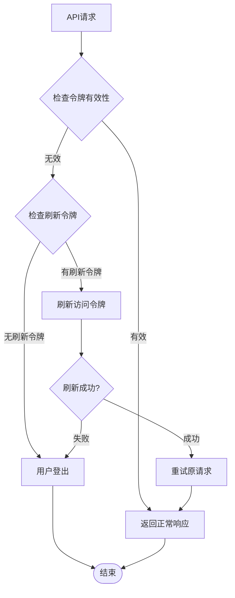
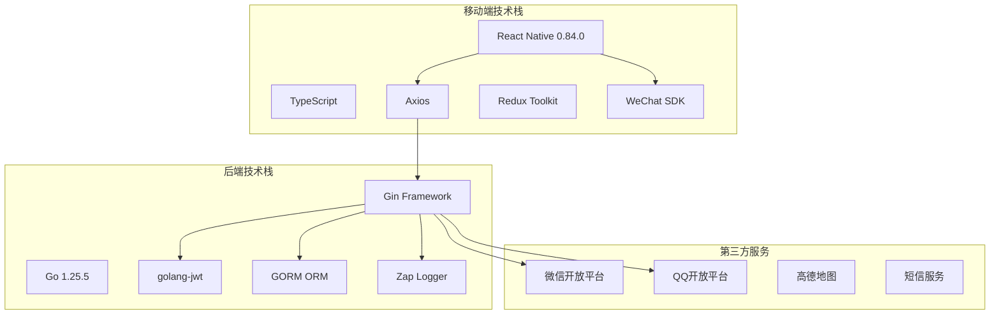

# 移动端第三方登录集成

<cite>
**本文档引用的文件**
- [mobile/src/services/auth.ts](file://mobile/src/services/auth.ts)
- [backend/internal/pkg/oauth/oauth.go](file://backend/internal/pkg/oauth/oauth.go)
- [mobile/src/screens/auth/LoginScreen.tsx](file://mobile/src/screens/auth/LoginScreen.tsx)
- [mobile/src/constants/index.ts](file://mobile/src/constants/index.ts)
- [backend/internal/api/v1/auth/handler.go](file://backend/internal/api/v1/auth/handler.go)
- [backend/internal/api/v2/auth/handler.go](file://backend/internal/api/v2/auth/handler.go)
- [mobile/android/app/src/main/java/com/wurenjimobile/wxapi/WXEntryActivity.java](file://mobile/android/app/src/main/java/com/wurenjimobile/wxapi/WXEntryActivity.java)
- [mobile/src/store/slices/authSlice.ts](file://mobile/src/store/slices/authSlice.ts)
- [mobile/src/services/api.ts](file://mobile/src/services/api.ts)
- [backend/internal/config/config.go](file://backend/internal/config/config.go)
- [backend/internal/api/v1/router.go](file://backend/internal/api/v1/router.go)
- [mobile/package.json](file://mobile/package.json)
- [backend/go.mod](file://backend/go.mod)
</cite>

## 目录
1. [简介](#简介)
2. [项目结构](#项目结构)
3. [核心组件](#核心组件)
4. [架构概览](#架构概览)
5. [详细组件分析](#详细组件分析)
6. [依赖关系分析](#依赖关系分析)
7. [性能考虑](#性能考虑)
8. [故障排除指南](#故障排除指南)
9. [结论](#结论)

## 简介

本文档详细介绍了无人机租赁平台项目的移动端第三方登录集成方案。该系统支持微信和QQ两种第三方登录方式，采用React Native移动端应用配合Go语言后端服务的架构设计。

系统的核心功能包括：
- 微信OAuth登录集成
- QQ OAuth登录支持
- 令牌管理和刷新机制
- 用户身份验证和授权
- 跨平台兼容性（Android/iOS）

## 项目结构

项目采用前后端分离的架构设计，主要分为三个核心部分：

**图表来源**
- [mobile/src/screens/auth/LoginScreen.tsx:1-502](file://mobile/src/screens/auth/LoginScreen.tsx#L1-L502)
- [backend/internal/api/v1/router.go:1-654](file://backend/internal/api/v1/router.go#L1-L654)
- [backend/internal/pkg/oauth/oauth.go:1-262](file://backend/internal/pkg/oauth/oauth.go#L1-L262)

**章节来源**
- [mobile/src/screens/auth/LoginScreen.tsx:1-502](file://mobile/src/screens/auth/LoginScreen.tsx#L1-L502)
- [backend/internal/api/v1/router.go:1-654](file://backend/internal/api/v1/router.go#L1-L654)

## 核心组件

### 移动端认证服务

移动端应用提供了完整的认证服务层，包含以下关键组件：

#### 认证服务接口
- **手机号验证码登录**: 支持验证码驱动的快速登录
- **密码登录**: 传统的用户名密码认证
- **微信登录**: 基于OAuth 2.0协议的第三方登录
- **QQ登录**: 支持QQ开放平台的第三方登录
- **令牌刷新**: 自动处理JWT令牌续期

#### 登录界面组件
- **微信登录按钮**: 集成微信SDK，支持一键登录
- **QQ登录占位**: 当前版本主要支持微信登录
- **快速登录功能**: 开发模式下的便捷登录选项

**章节来源**
- [mobile/src/services/auth.ts:1-45](file://mobile/src/services/auth.ts#L1-L45)
- [mobile/src/screens/auth/LoginScreen.tsx:1-502](file://mobile/src/screens/auth/LoginScreen.tsx#L1-L502)

### 后端OAuth处理

后端服务实现了完整的OAuth认证流程：

#### OAuth提供商实现
- **微信OAuth**: 实现微信官方OAuth 2.0协议
- **QQ OAuth**: 支持QQ开放平台认证流程
- **用户信息获取**: 从第三方平台获取用户基本信息

#### 认证处理器
- **WeChatLogin**: 处理微信登录请求
- **QQLogin**: 处理QQ登录请求
- **OAuthLogin**: 统一的第三方登录处理逻辑

**章节来源**
- [backend/internal/pkg/oauth/oauth.go:1-262](file://backend/internal/pkg/oauth/oauth.go#L1-L262)
- [backend/internal/api/v1/auth/handler.go:146-215](file://backend/internal/api/v1/auth/handler.go#L146-L215)

## 架构概览

系统采用分层架构设计，确保各组件职责清晰、耦合度低：

**图表来源**
- [mobile/src/services/auth.ts:35-44](file://mobile/src/services/auth.ts#L35-L44)
- [backend/internal/api/v1/auth/handler.go:146-179](file://backend/internal/api/v1/auth/handler.go#L146-L179)
- [backend/internal/pkg/oauth/oauth.go:61-144](file://backend/internal/pkg/oauth/oauth.go#L61-L144)

### 数据流分析

系统的数据流遵循标准的OAuth 2.0流程：

1. **移动端发起登录请求**
2. **后端调用第三方平台API**
3. **获取用户授权信息**
4. **数据库用户信息同步**
5. **生成并返回认证令牌**

**章节来源**
- [mobile/src/services/api.ts:110-139](file://mobile/src/services/api.ts#L110-L139)
- [backend/internal/api/v1/auth/handler.go:168-174](file://backend/internal/api/v1/auth/handler.go#L168-L174)

## 详细组件分析

### 微信登录集成

#### 移动端实现

微信登录是当前版本的主要第三方登录方式，实现了完整的OAuth 2.0流程：

**图表来源**
- [mobile/src/screens/auth/LoginScreen.tsx:97-142](file://mobile/src/screens/auth/LoginScreen.tsx#L97-L142)

#### 后端处理流程

后端服务负责处理微信OAuth的完整流程：

**图表来源**
- [backend/internal/api/v1/auth/handler.go:146-179](file://backend/internal/api/v1/auth/handler.go#L146-L179)
- [backend/internal/pkg/oauth/oauth.go:61-144](file://backend/internal/pkg/oauth/oauth.go#L61-L144)

**章节来源**
- [mobile/src/screens/auth/LoginScreen.tsx:69-142](file://mobile/src/screens/auth/LoginScreen.tsx#L69-L142)
- [backend/internal/api/v1/auth/handler.go:146-179](file://backend/internal/api/v1/auth/handler.go#L146-L179)

### QQ登录集成

#### 当前状态

QQ登录功能在当前版本中处于占位状态，主要提供开发指导：

- **SDK集成**: QQ开放平台SDK已准备就绪
- **接口预留**: 后端已实现QQ OAuth处理逻辑
- **开发模式**: 当前版本主要支持微信登录

**章节来源**
- [mobile/src/screens/auth/LoginScreen.tsx:144-146](file://mobile/src/screens/auth/LoginScreen.tsx#L144-L146)
- [backend/internal/pkg/oauth/oauth.go:177-261](file://backend/internal/pkg/oauth/oauth.go#L177-L261)

### 令牌管理系统

系统实现了完整的令牌管理机制：

#### 令牌刷新策略

**图表来源**
- [mobile/src/services/api.ts:82-139](file://mobile/src/services/api.ts#L82-L139)

**章节来源**
- [mobile/src/services/api.ts:32-139](file://mobile/src/services/api.ts#L32-L139)
- [mobile/src/store/slices/authSlice.ts:1-65](file://mobile/src/store/slices/authSlice.ts#L1-L65)

## 依赖关系分析

### 技术栈依赖

系统采用了现代化的技术栈组合：

**图表来源**
- [mobile/package.json:15-37](file://mobile/package.json#L15-L37)
- [backend/go.mod:5-21](file://backend/go.mod#L5-L21)

### 配置管理

系统通过配置文件管理各种依赖和服务：

#### 移动端配置
- **API基础URL**: 动态配置支持远程测试
- **第三方登录配置**: 微信和QQ App ID配置
- **环境变量支持**: react-native-config集成

#### 后端配置
- **OAuth配置**: 微信和QQ应用密钥
- **JWT配置**: 令牌过期时间和密钥设置
- **数据库配置**: MySQL连接参数

**章节来源**
- [mobile/src/constants/index.ts:155-161](file://mobile/src/constants/index.ts#L155-L161)
- [backend/internal/config/config.go:380-406](file://backend/internal/config/config.go#L380-L406)

## 性能考虑

### 登录性能优化

系统在设计时充分考虑了性能优化：

#### 缓存策略
- **令牌缓存**: 在内存中缓存有效的认证令牌
- **用户信息缓存**: 减少重复的用户信息查询
- **配置缓存**: 避免频繁读取配置文件

#### 网络优化
- **并发请求**: 避免同时发起多个认证请求
- **请求去重**: 使用请求ID避免重复处理
- **超时控制**: 合理的网络请求超时设置

#### 错误处理
- **重试机制**: 对临时性错误进行智能重试
- **降级策略**: 在第三方服务不可用时提供降级方案
- **监控告警**: 完善的错误监控和告警机制

## 故障排除指南

### 常见问题及解决方案

#### 微信登录问题

| 问题类型 | 症状描述 | 解决方案 |
|---------|----------|----------|
| AppID未配置 | 显示"微信登录未配置AppID" | 检查环境变量配置 |
| 微信未安装 | 弹出"请先安装微信App" | 引导用户安装微信 |
| 授权失败 | 微信授权失败，错误码显示 | 检查微信开放平台配置 |
| 令牌过期 | 401未授权错误 | 实施令牌刷新机制 |

#### QQ登录问题

| 问题类型 | 症状描述 | 解决方案 |
|---------|----------|----------|
| SDK集成失败 | QQ SDK初始化失败 | 检查Pod依赖安装 |
| 授权码无效 | QQ授权失败 | 验证access_token有效性 |
| 用户信息获取失败 | 无法获取QQ用户信息 | 检查QQ开放平台权限 |

#### 令牌管理问题

| 问题类型 | 症状描述 | 解决方案 |
|---------|----------|----------|
| 刷新令牌失效 | 401错误且无法刷新 | 清除本地存储的令牌 |
| 并发刷新冲突 | 多个刷新请求导致冲突 | 实现刷新状态锁机制 |
| 令牌丢失 | 应用重启后需要重新登录 | 实现持久化存储机制 |

**章节来源**
- [mobile/src/screens/auth/LoginScreen.tsx:102-141](file://mobile/src/screens/auth/LoginScreen.tsx#L102-L141)
- [mobile/src/services/api.ts:82-139](file://mobile/src/services/api.ts#L82-L139)

### 调试技巧

#### 移动端调试
- **日志输出**: 详细的console.log输出便于问题定位
- **错误提示**: 用户友好的错误信息展示
- **开发工具**: 利用React DevTools进行状态检查

#### 后端调试
- **请求追踪**: 完整的请求日志记录
- **错误堆栈**: 详细的错误信息和堆栈跟踪
- **性能监控**: 关键操作的性能指标收集

## 结论

该移动端第三方登录集成方案具有以下特点：

### 技术优势
- **架构清晰**: 分层设计确保代码可维护性
- **扩展性强**: 支持多种第三方登录方式
- **安全性高**: 完整的令牌管理和安全机制
- **用户体验佳**: 无缝的登录体验和错误处理

### 实现亮点
- **微信登录优先**: 当前版本重点实现微信OAuth集成
- **模块化设计**: 各组件职责明确，耦合度低
- **错误处理完善**: 全面的异常情况处理机制
- **配置灵活**: 支持多种部署环境和配置方式

### 发展建议
- **QQ登录完善**: 在后续版本中完善QQ登录功能
- **多平台支持**: 考虑支持更多第三方登录方式
- **性能优化**: 持续优化登录流程的性能表现
- **安全加固**: 不断改进安全机制和防护措施

该系统为无人机租赁平台提供了稳定可靠的第三方登录基础设施，为用户提供了便捷的认证体验，为企业提供了可扩展的身份认证解决方案。