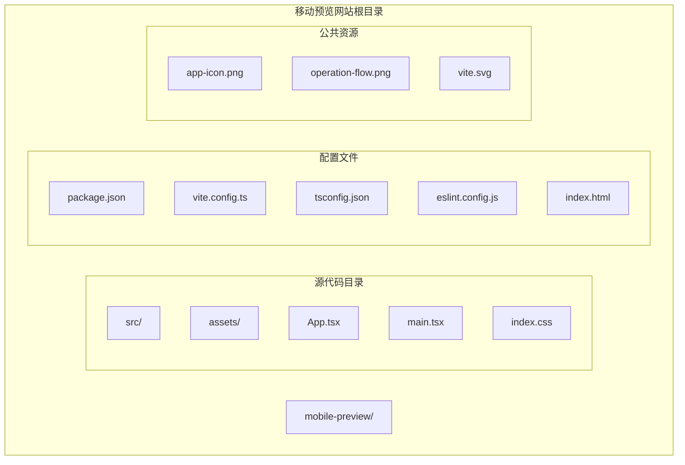
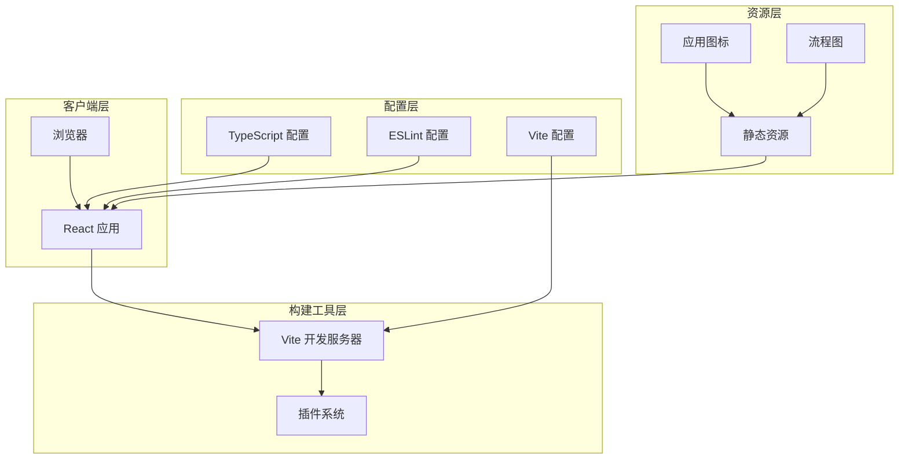
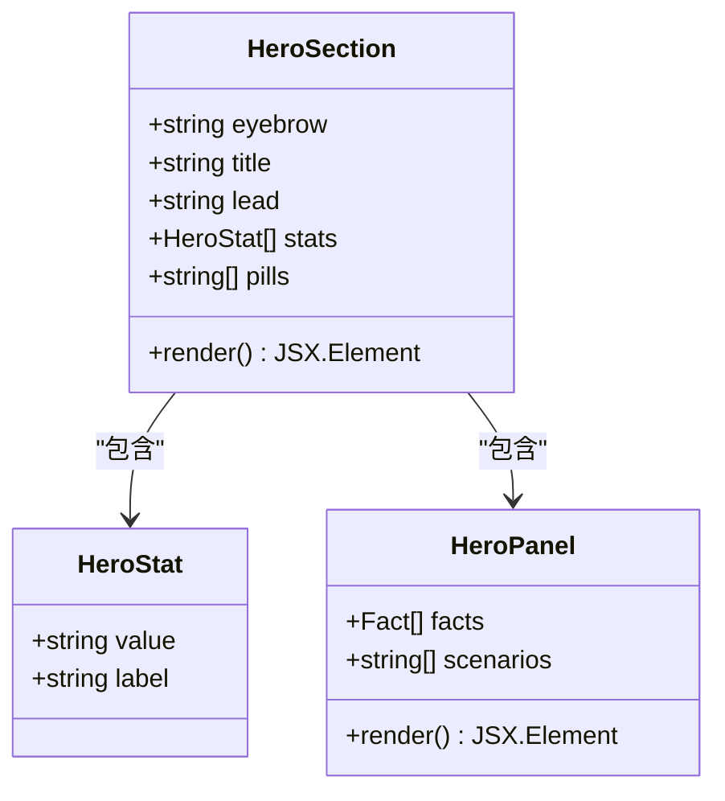
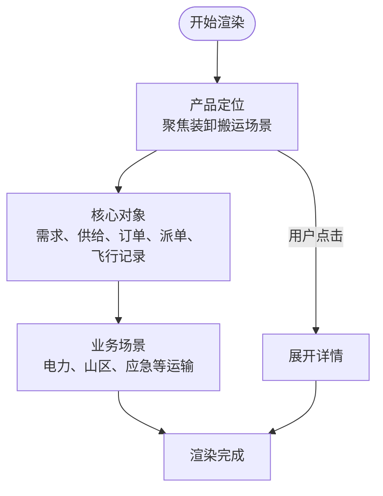
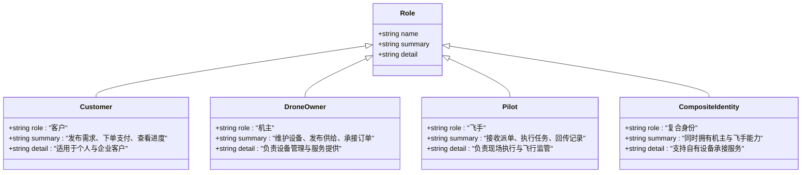
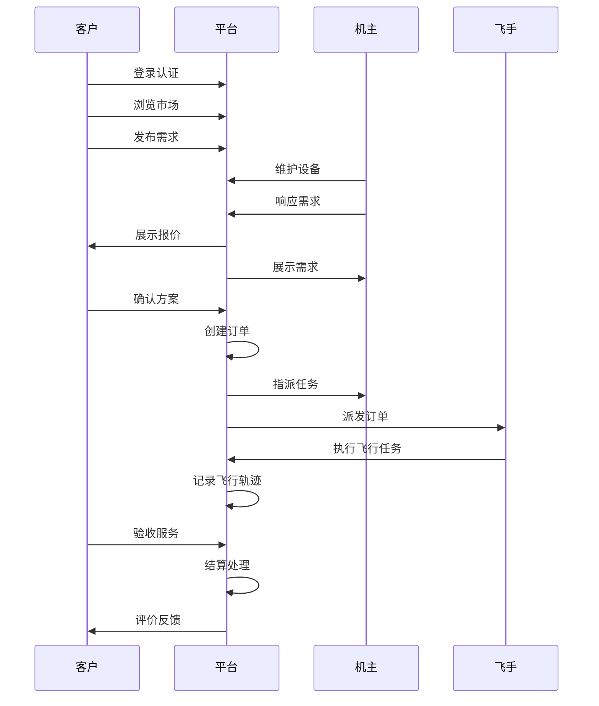
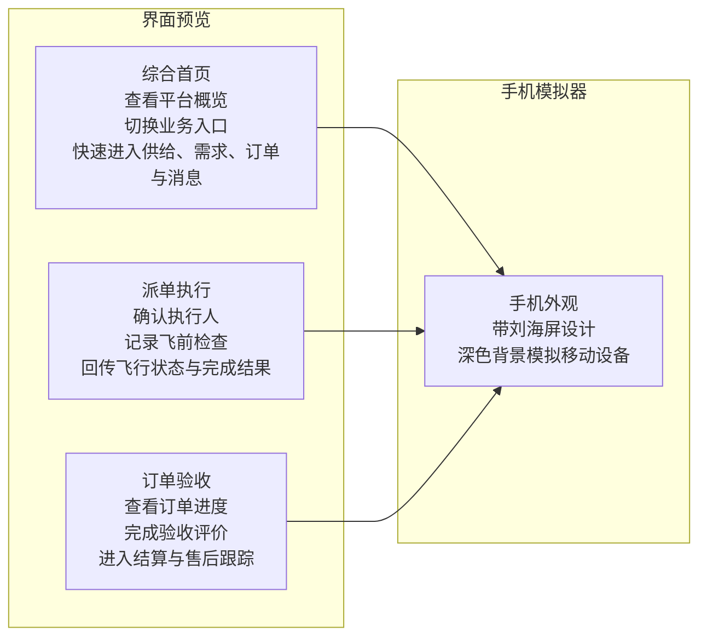
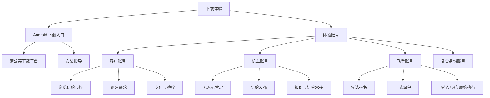
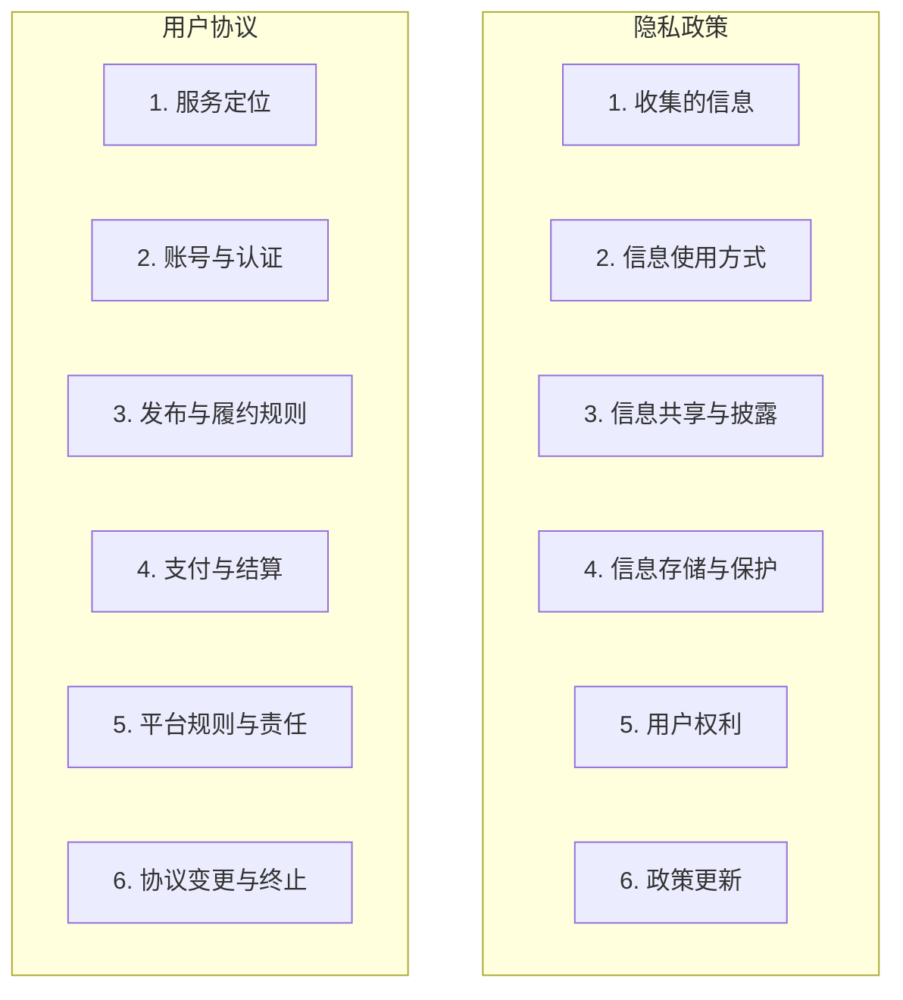
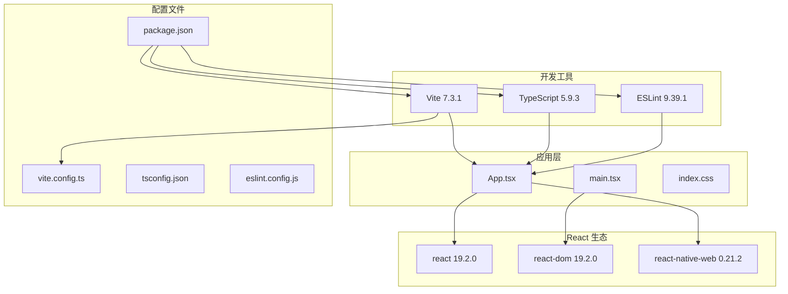

# 移动预览网站

<cite>
**本文档中引用的文件**
- [README.md](file://mobile-preview/README.md)
- [package.json](file://mobile-preview/package.json)
- [App.tsx](file://mobile-preview/src/App.tsx)
- [vite.config.ts](file://mobile-preview/vite.config.ts)
- [main.tsx](file://mobile-preview/src/main.tsx)
- [index.css](file://mobile-preview/src/index.css)
- [tsconfig.json](file://mobile-preview/tsconfig.json)
- [tsconfig.app.json](file://mobile-preview/tsconfig.app.json)
- [tsconfig.node.json](file://mobile-preview/tsconfig.node.json)
- [eslint.config.js](file://mobile-preview/eslint.config.js)
- [index.html](file://mobile-preview/index.html)
- [app-icon.png](file://mobile-preview/public/app-icon.png)
- [operation-flow.png](file://mobile-preview/public/operation-flow.png)
</cite>

## 目录
1. [简介](#简介)
2. [项目结构](#项目结构)
3. [核心组件](#核心组件)
4. [架构概览](#架构概览)
5. [详细组件分析](#详细组件分析)
6. [依赖关系分析](#依赖关系分析)
7. [性能考虑](#性能考虑)
8. [故障排除指南](#故障排除指南)
9. [结论](#结论)

## 简介

移动预览网站是一个专门为"无人机服务"移动应用设计的静态展示网站。该网站提供了应用的核心信息展示、业务流程说明、下载入口和用户体验支持等功能，旨在帮助不同角色的用户（客户、机主、飞手）快速了解应用的功能定位、使用方式和服务场景。

该项目基于现代前端技术栈构建，使用 React + TypeScript + Vite 技术组合，通过 react-native-web 实现跨平台兼容性，能够在桌面浏览器中模拟移动应用的外观和交互效果。

## 项目结构

移动预览网站采用标准的 Vite + React + TypeScript 项目结构，主要包含以下目录和文件：



**图表来源**
- [package.json:1-32](file://mobile-preview/package.json#L1-L32)
- [vite.config.ts:1-22](file://mobile-preview/vite.config.ts#L1-L22)
- [tsconfig.json:1-8](file://mobile-preview/tsconfig.json#L1-L8)

**章节来源**
- [package.json:1-32](file://mobile-preview/package.json#L1-L32)
- [vite.config.ts:1-22](file://mobile-preview/vite.config.ts#L1-L22)
- [tsconfig.json:1-8](file://mobile-preview/tsconfig.json#L1-L8)

## 核心组件

### 应用主体组件

应用的主要组件是 `App.tsx`，它包含了整个网站的所有内容，包括导航栏、英雄区域、产品概览、角色体系、核心能力、运行流程、界面示意、下载体验、隐私政策和用户协议等模块。

### 数据模型定义

应用使用 TypeScript 接口来定义各种数据结构：

- **Fact**: 应用基本信息卡片
- **Role**: 角色定义
- **Capability**: 核心能力描述
- **AuditPoint**: 审计要点
- **PreviewCard**: 界面预览卡片
- **DemoAccount**: 体验账号信息
- **DocumentSection**: 文档章节
- **ValueCard**: 价值主张卡片
- **SupportCard**: 支持卡片
- **FaqItem**: 常见问题项

### 样式系统

应用采用现代化的 CSS 变量系统，定义了完整的主题色彩方案和响应式设计规范。样式文件 `index.css` 包含了从全局样式到组件样式的完整定义。

**章节来源**
- [App.tsx:1-746](file://mobile-preview/src/App.tsx#L1-L746)
- [index.css:1-895](file://mobile-preview/src/index.css#L1-L895)

## 架构概览

移动预览网站采用单页面应用（SPA）架构，基于 React 组件化开发模式：



**图表来源**
- [vite.config.ts:1-22](file://mobile-preview/vite.config.ts#L1-L22)
- [package.json:1-32](file://mobile-preview/package.json#L1-L32)
- [App.tsx:321-745](file://mobile-preview/src/App.tsx#L321-L745)

### 技术栈选择

- **React 19.2.0**: 现代化的 JavaScript 库，提供组件化开发体验
- **TypeScript 5.9.3**: 类型安全的 JavaScript 超集，提供更好的开发体验
- **Vite 7.3.1**: 快速的构建工具和开发服务器
- **react-native-web 0.21.2**: 实现 React Native 组件在 Web 上的渲染
- **ESLint 9.39.1**: 代码质量保证工具

**章节来源**
- [package.json:12-30](file://mobile-preview/package.json#L12-L30)
- [vite.config.ts:1-22](file://mobile-preview/vite.config.ts#L1-L22)

## 详细组件分析

### 导航系统

应用的导航系统采用响应式设计，包含品牌标识、主导航链接和搜索功能。导航栏支持粘性定位，在页面滚动时保持可见。

```mermaid
sequenceDiagram
participant User as 用户
participant Header as 导航栏
participant Link as 导航链接
participant Section as 页面区域
User->>Header : 加载页面
Header->>Link : 渲染导航链接
User->>Link : 点击链接
Link->>Section : 平滑滚动到目标区域
Section->>User : 显示对应内容
```

**图表来源**
- [App.tsx:324-343](file://mobile-preview/src/App.tsx#L324-L343)
- [App.tsx:357-368](file://mobile-preview/src/App.tsx#L357-L368)

### 英雄区域组件

英雄区域是页面的主要视觉焦点，包含应用标题、描述、行动按钮和统计信息展示。



**图表来源**
- [App.tsx:346-414](file://mobile-preview/src/App.tsx#L346-L414)
- [App.tsx:127-131](file://mobile-preview/src/App.tsx#L127-L131)

### 产品概览模块

产品概览模块详细介绍了应用的定位、核心对象和服务场景。该模块采用卡片式布局，清晰地展示了应用的业务逻辑。



**图表来源**
- [App.tsx:446-478](file://mobile-preview/src/App.tsx#L446-L478)
- [App.tsx:459-475](file://mobile-preview/src/App.tsx#L459-L475)

### 角色体系展示

应用支持四种主要角色：客户、机主、飞手和复合身份用户。每个角色都有明确的职责和能力范围。



**图表来源**
- [App.tsx:63-84](file://mobile-preview/src/App.tsx#L63-L84)
- [App.tsx:166-171](file://mobile-preview/src/App.tsx#L166-L171)

### 核心能力矩阵

应用的核心能力围绕完整的业务流程展开，从需求发布到验收结算形成闭环。

| 能力类别 | 描述 | 关键特性 |
|---------|------|----------|
| 需求发布与供给上架 | 客户发布装卸搬运需求，机主发布无人机服务供给 | 统一管理服务范围、时间、地点与预算 |
| 在线沟通与报价撮合 | 围绕服务内容、执行时间和现场条件进行在线沟通 | 完成供需双方的报价和确认 |
| 订单创建与支付 | 当方案确认后生成正式订单 | 记录订单状态、支付进度和服务约束条件 |
| 派单与资源匹配 | 平台支持机主指派飞手执行任务 | 或由复合身份用户直接承接并自行执行 |
| 飞行执行与监控 | 飞手执行任务过程中记录轨迹、状态和关键节点 | 形成可回溯的履约留痕 |
| 验收、结算与评价 | 客户完成验收后进入结算阶段 | 平台支持订单收尾、评价反馈与后续服务跟进 |

**章节来源**
- [App.tsx:86-111](file://mobile-preview/src/App.tsx#L86-L111)
- [App.tsx:500-517](file://mobile-preview/src/App.tsx#L500-L517)

### 运行流程图

应用提供完整的移动端业务流程图，展示从登录认证到验收结算的完整业务闭环。



**图表来源**
- [App.tsx:519-545](file://mobile-preview/src/App.tsx#L519-L545)
- [operation-flow.png](file://mobile-preview/public/operation-flow.png)

### 界面预览系统

应用提供了三个核心页面的界面预览，帮助用户直观了解移动应用的布局和交互。



**图表来源**
- [App.tsx:148-164](file://mobile-preview/src/App.tsx#L148-L164)
- [App.tsx:555-582](file://mobile-preview/src/App.tsx#L555-L582)

### 下载体验模块

应用提供多种体验入口，包括 Android 下载和测试账号支持。



**图表来源**
- [App.tsx:585-630](file://mobile-preview/src/App.tsx#L585-L630)
- [App.tsx:612-627](file://mobile-preview/src/App.tsx#L612-L627)

### 合作与支持

应用针对不同角色提供专门的支持和咨询入口。

| 支持类型 | 目标用户 | 主要内容 |
|---------|----------|----------|
| 业务场景咨询 | 客户、机主、飞手 | 适用于装卸搬运、重载吊运等场景的咨询 |
| 应用体验支持 | 所有角色 | Android 下载入口和体验账号支持 |
| 合作对象 | 项目合作方 | 产品定位、使用方式和服务组织形式说明 |

**章节来源**
- [App.tsx:632-654](file://mobile-preview/src/App.tsx#L632-L654)
- [App.tsx:173-189](file://mobile-preview/src/App.tsx#L173-L189)

### 法律文档系统

应用包含完整的隐私政策和用户协议，采用分章节的形式详细说明各项条款。



**图表来源**
- [App.tsx:210-266](file://mobile-preview/src/App.tsx#L210-L266)
- [App.tsx:268-319](file://mobile-preview/src/App.tsx#L268-L319)

**章节来源**
- [App.tsx:675-721](file://mobile-preview/src/App.tsx#L675-L721)
- [App.tsx:191-208](file://mobile-preview/src/App.tsx#L191-L208)

## 依赖关系分析

### 核心依赖关系

移动预览网站的依赖关系相对简单，主要围绕 React 生态系统构建：



**图表来源**
- [package.json:12-30](file://mobile-preview/package.json#L12-L30)
- [vite.config.ts:1-22](file://mobile-preview/vite.config.ts#L1-L22)

### 构建配置分析

应用使用 Vite 作为构建工具，配置了 React 插件和别名解析：

- **React 插件**: 提供热重载和快速刷新功能
- **别名解析**: 将 `react-native` 映射到 `react-native-web`
- **扩展名支持**: 支持 `.web.tsx`、`.web.ts`、`.web.js` 等扩展名
- **开发服务器**: 配置端口 3100，自动打开浏览器

**章节来源**
- [vite.config.ts:4-21](file://mobile-preview/vite.config.ts#L4-L21)
- [package.json:6-11](file://mobile-preview/package.json#L6-L11)

### 类型系统配置

TypeScript 配置采用多项目结构，分别针对应用代码和配置文件：

- **应用配置**: 针对 `src` 目录，启用严格模式和 JSX 支持
- **节点配置**: 针对 `vite.config.ts`，提供类型支持
- **编译选项**: 使用 ES2022 目标，支持现代 JavaScript 特性

**章节来源**
- [tsconfig.app.json:1-29](file://mobile-preview/tsconfig.app.json#L1-L29)
- [tsconfig.node.json:1-27](file://mobile-preview/tsconfig.node.json#L1-L27)

## 性能考虑

### 构建优化

- **Tree Shaking**: Vite 自动移除未使用的代码
- **代码分割**: 按需加载组件和资源
- **压缩优化**: 生产环境自动压缩 JavaScript 和 CSS

### 运行时优化

- **虚拟 DOM**: React 的高效更新机制
- **组件缓存**: 避免不必要的重新渲染
- **CSS 变量**: 减少重复样式计算

### 资源优化

- **图片优化**: PNG 格式的应用图标和流程图
- **字体加载**: 使用系统字体，减少网络请求
- **CDN 支持**: 可配置外部资源 CDN

## 故障排除指南

### 常见问题

1. **开发服务器无法启动**
   - 检查端口 3100 是否被占用
   - 确认 Node.js 版本兼容性
   - 运行 `npm install` 安装依赖

2. **样式显示异常**
   - 检查 CSS 变量定义是否正确
   - 确认 `react-native-web` 兼容性
   - 验证媒体查询断点设置

3. **TypeScript 类型错误**
   - 运行 `npm run lint` 检查代码质量
   - 更新 TypeScript 到最新版本
   - 检查接口定义的一致性

### 调试技巧

- 使用浏览器开发者工具检查元素和样式
- 在 React DevTools 中检查组件树
- 利用 Vite 的热重载功能快速调试
- 检查控制台错误信息和警告

**章节来源**
- [eslint.config.js:1-24](file://mobile-preview/eslint.config.js#L1-L24)
- [vite.config.ts:16-21](file://mobile-preview/vite.config.ts#L16-L21)

## 结论

移动预览网站是一个精心设计的静态展示平台，成功地将复杂的无人机服务应用概念转化为易于理解的视觉化内容。通过合理的组件化设计、现代化的技术栈选择和完善的开发工具配置，该网站为不同角色的用户提供了清晰的应用介绍、流程说明和体验支持。

网站的核心优势在于：

1. **清晰的视觉层次**: 通过精心设计的布局和色彩系统，营造专业的品牌形象
2. **完整的功能覆盖**: 从产品介绍到法律文档，提供全方位的信息展示
3. **优秀的用户体验**: 响应式设计确保在各种设备上的良好表现
4. **技术实现先进**: 基于最新的前端技术，提供良好的开发体验和性能表现

该网站不仅有效地传达了无人机服务应用的价值主张，还为实际的移动应用开发奠定了坚实的基础。通过持续的迭代和优化，这个预览网站将继续发挥其在产品推广和用户教育方面的重要作用。