# 第三方登录配置管理

<cite>
**本文档引用的文件**
- [oauth.go](file://backend/internal/pkg/oauth/oauth.go)
- [handler.go](file://backend/internal/api/v1/auth/handler.go)
- [auth_service.go](file://backend/internal/service/auth_service.go)
- [config.go](file://backend/internal/config/config.go)
- [main.go](file://backend/cmd/server/main.go)
- [user_repo.go](file://backend/internal/repository/user_repo.go)
- [models.go](file://backend/internal/model/models.go)
- [config.example.yaml](file://backend/config.example.yaml)
- [LoginScreen.tsx](file://mobile/src/screens/auth/LoginScreen.tsx)
</cite>

## 目录
1. [简介](#简介)
2. [项目结构](#项目结构)
3. [核心组件](#核心组件)
4. [架构概览](#架构概览)
5. [详细组件分析](#详细组件分析)
6. [依赖关系分析](#依赖关系分析)
7. [性能考虑](#性能考虑)
8. [故障排除指南](#故障排除指南)
9. [结论](#结论)

## 简介

第三方登录配置管理系统是无人机租赁平台的重要组成部分，负责管理微信和QQ两种第三方登录方式。该系统提供了完整的OAuth认证流程，包括配置管理、用户信息获取、用户注册登录等功能。系统采用模块化设计，支持动态配置启用/禁用不同的第三方登录提供商，并提供了完善的错误处理和日志记录机制。

## 项目结构

该项目采用典型的三层架构设计，第三方登录功能主要分布在以下层次：

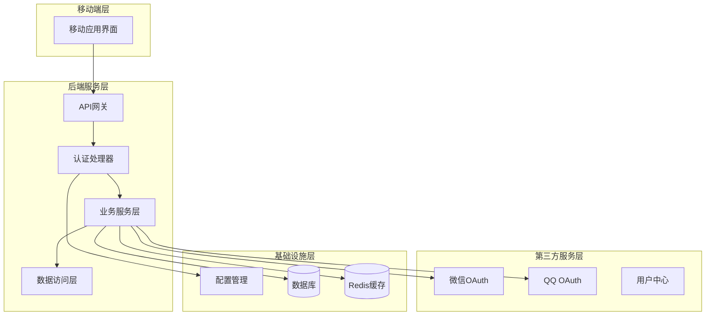

**图表来源**
- [main.go:162-179](file://backend/cmd/server/main.go#L162-L179)
- [handler.go:11-19](file://backend/internal/api/v1/auth/handler.go#L11-L19)

**章节来源**
- [main.go:162-179](file://backend/cmd/server/main.go#L162-L179)
- [config.go:380-406](file://backend/internal/config/config.go#L380-L406)

## 核心组件

### OAuth配置管理器

系统的核心是OAuth配置管理器，它负责管理所有第三方登录提供商的配置和状态。

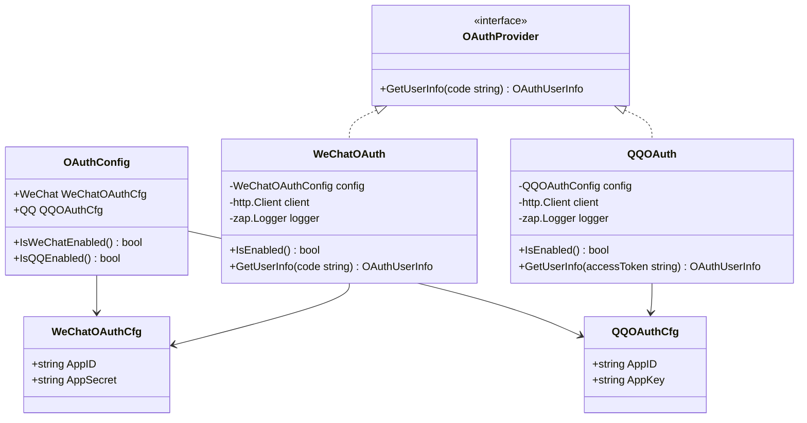

**图表来源**
- [config.go:380-406](file://backend/internal/config/config.go#L380-L406)
- [oauth.go:24-28](file://backend/internal/pkg/oauth/oauth.go#L24-L28)
- [oauth.go:40-54](file://backend/internal/pkg/oauth/oauth.go#L40-L54)
- [oauth.go:156-170](file://backend/internal/pkg/oauth/oauth.go#L156-L170)

### 认证处理器

认证处理器负责接收前端请求，调用相应的OAuth提供商，并处理认证结果。

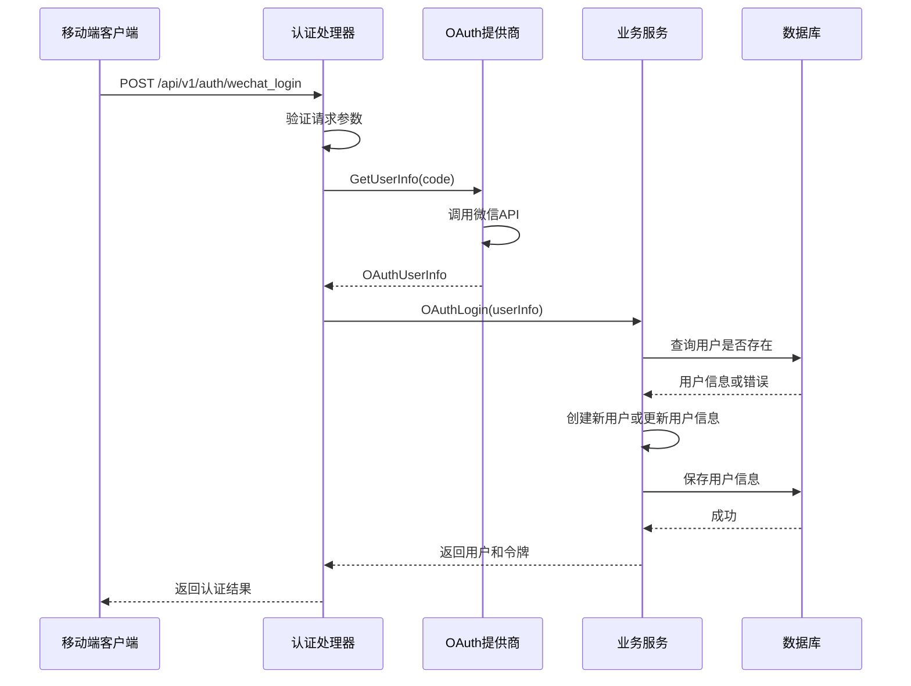

**图表来源**
- [handler.go:146-179](file://backend/internal/api/v1/auth/handler.go#L146-L179)
- [auth_service.go:272-325](file://backend/internal/service/auth_service.go#L272-L325)

**章节来源**
- [handler.go:146-179](file://backend/internal/api/v1/auth/handler.go#L146-L179)
- [auth_service.go:272-325](file://backend/internal/service/auth_service.go#L272-L325)

## 架构概览

系统的整体架构采用了分层设计，确保了良好的可维护性和扩展性：

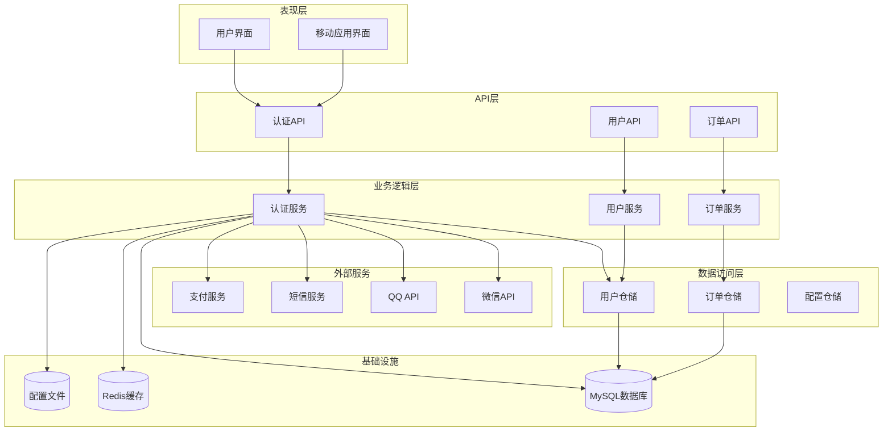

**图表来源**
- [main.go:224-246](file://backend/cmd/server/main.go#L224-L246)
- [main.go:162-179](file://backend/cmd/server/main.go#L162-L179)

## 详细组件分析

### OAuth配置系统

OAuth配置系统是整个第三方登录功能的基础，它提供了灵活的配置管理和状态检测机制。

#### 配置结构设计

系统使用结构化的配置结构来管理不同提供商的配置信息：

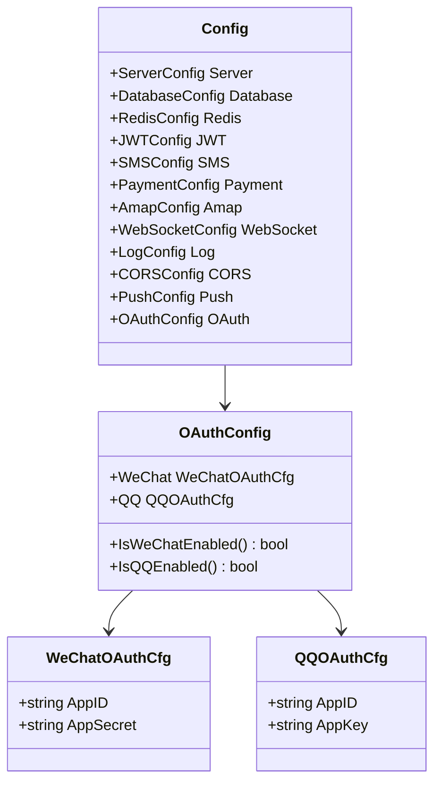

**图表来源**
- [config.go:16-31](file://backend/internal/config/config.go#L16-L31)
- [config.go:380-396](file://backend/internal/config/config.go#L380-L396)

#### 动态配置加载

系统支持运行时动态加载和验证配置，确保配置变更的及时生效：

```mermaid
flowchart TD
Start([启动应用]) --> LoadConfig[加载配置文件]
LoadConfig --> ValidateConfig[验证配置]
ValidateConfig --> CheckOAuth[检查OAuth配置]
CheckOAuth --> WeChatEnabled{微信配置可用?}
CheckOAuth --> QQEnabled{QQ配置可用?}
WeChatEnabled --> |是| InitWeChat[初始化微信OAuth]
WeChatEnabled --> |否| SkipWeChat[跳过微信OAuth]
QQEnabled --> |是| InitQQ[初始化QQOAuth]
QQEnabled --> |否| SkipQQ[跳过QQOAuth]
InitWeChat --> CreateHandler[创建认证处理器]
SkipWeChat --> CreateHandler
InitQQ --> CreateHandler
SkipQQ --> CreateHandler
CreateHandler --> Ready([服务就绪])
```

**图表来源**
- [main.go:59-70](file://backend/cmd/server/main.go#L59-L70)
- [main.go:162-179](file://backend/cmd/server/main.go#L162-L179)

**章节来源**
- [config.go:415-435](file://backend/internal/config/config.go#L415-L435)
- [main.go:162-179](file://backend/cmd/server/main.go#L162-L179)

### 微信OAuth实现

微信OAuth实现了完整的OAuth 2.0流程，包括授权码获取、用户信息获取等功能。

#### 微信OAuth流程

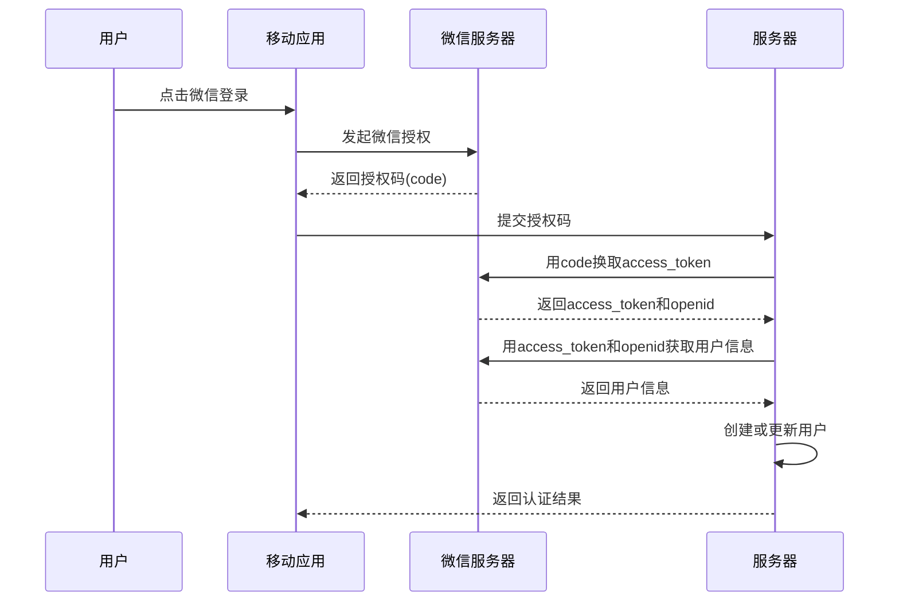

**图表来源**
- [oauth.go:61-144](file://backend/internal/pkg/oauth/oauth.go#L61-L144)

#### 微信OAuth配置

微信OAuth使用标准的OAuth 2.0配置结构：

| 配置项 | 类型 | 描述 | 示例值 |
|--------|------|------|--------|
| app_id | string | 微信开放平台应用ID | wx1234567890abcdef |
| app_secret | string | 微信应用密钥 | 1234567890abcdef1234567890abcdef |

**章节来源**
- [oauth.go:34-58](file://backend/internal/pkg/oauth/oauth.go#L34-L58)
- [config.go:386-390](file://backend/internal/config/config.go#L386-L390)

### QQ OAuth实现

QQ OAuth提供了与微信类似的OAuth流程，但使用了不同的API端点和数据格式。

#### QQ OAuth流程

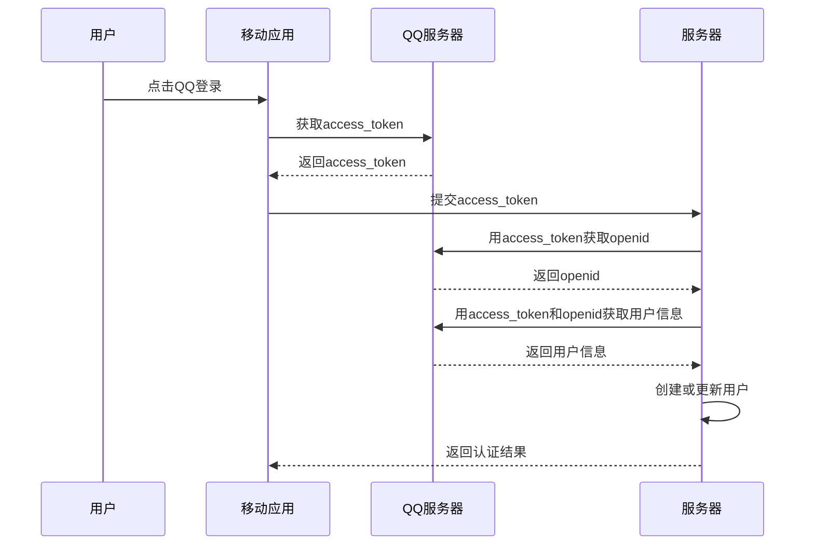

**图表来源**
- [oauth.go:177-261](file://backend/internal/pkg/oauth/oauth.go#L177-L261)

#### QQ OAuth配置

QQ OAuth使用与微信类似的配置结构：

| 配置项 | 类型 | 描述 | 示例值 |
|--------|------|------|--------|
| app_id | string | QQ互联应用ID | 1234567890 |
| app_key | string | QQ应用Key | abcdef1234567890 |

**章节来源**
- [oauth.go:150-175](file://backend/internal/pkg/oauth/oauth.go#L150-L175)
- [config.go:392-396](file://backend/internal/config/config.go#L392-L396)

### 认证处理器

认证处理器是第三方登录功能的入口点，负责处理来自前端的所有认证请求。

#### 请求处理流程

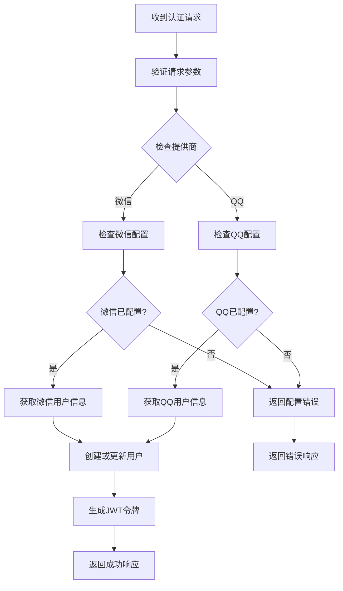

**图表来源**
- [handler.go:146-214](file://backend/internal/api/v1/auth/handler.go#L146-L214)

#### 错误处理机制

系统提供了完善的错误处理机制，确保各种异常情况都能得到适当的处理：

| 错误类型 | 错误码 | 描述 | 处理方式 |
|----------|--------|------|----------|
| 参数错误 | 400 | 请求参数缺失或格式错误 | 返回参数错误信息 |
| 配置错误 | 400 | 第三方登录未配置 | 提示配置相关信息 |
| 授权失败 | 401 | 第三方授权失败 | 返回授权失败信息 |
| 数据库错误 | 500 | 用户创建或更新失败 | 返回数据库错误信息 |

**章节来源**
- [handler.go:146-214](file://backend/internal/api/v1/auth/handler.go#L146-L214)

### 用户仓储层

用户仓储层负责管理用户数据的持久化操作，特别是第三方登录相关的用户信息存储。

#### 用户模型设计

用户模型包含了第三方登录所需的所有字段：

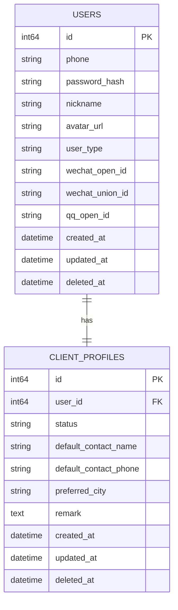

**图表来源**
- [models.go:9-26](file://backend/internal/model/models.go#L9-L26)

#### 用户查询操作

仓储层提供了多种用户查询操作，支持基于不同标识符的用户查找：

| 查询类型 | 方法名 | 参数 | 用途 |
|----------|--------|------|------|
| 按ID查询 | GetByID | id: int64 | 获取用户基本信息 |
| 按手机号查询 | GetByPhone | phone: string | 验证手机号唯一性 |
| 按微信OpenID查询 | GetByWechatOpenID | openID: string | 查找微信用户 |
| 按QQ OpenID查询 | GetByQQOpenID | openID: string | 查找QQ用户 |

**章节来源**
- [user_repo.go:65-75](file://backend/internal/repository/user_repo.go#L65-L75)
- [models.go:9-26](file://backend/internal/model/models.go#L9-L26)

## 依赖关系分析

系统中的依赖关系体现了清晰的分层架构设计：

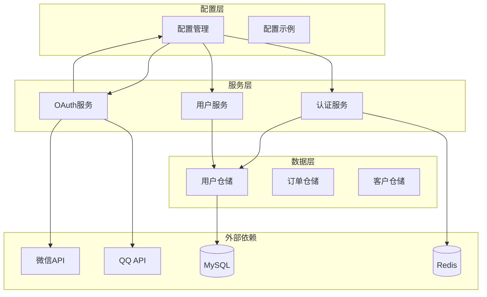

**图表来源**
- [main.go:162-179](file://backend/cmd/server/main.go#L162-L179)
- [handler.go:11-19](file://backend/internal/api/v1/auth/handler.go#L11-L19)

### 依赖注入模式

系统采用了依赖注入的设计模式，确保了组件间的松耦合：

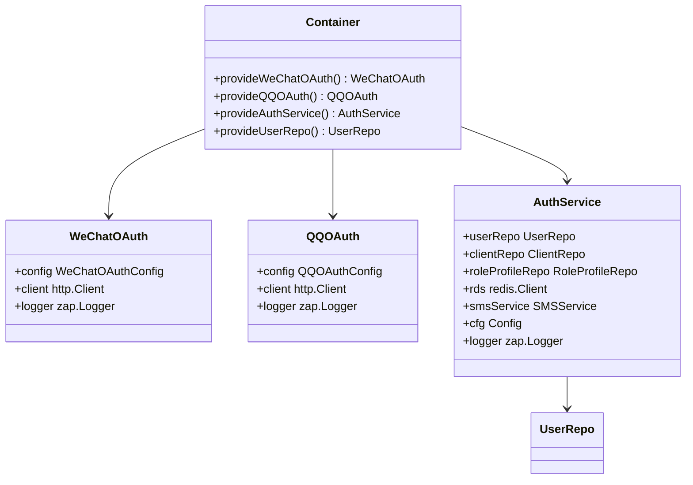

**图表来源**
- [main.go:162-182](file://backend/cmd/server/main.go#L162-L182)
- [handler.go:17-19](file://backend/internal/api/v1/auth/handler.go#L17-L19)

**章节来源**
- [main.go:162-182](file://backend/cmd/server/main.go#L162-L182)
- [handler.go:17-19](file://backend/internal/api/v1/auth/handler.go#L17-L19)

## 性能考虑

### 缓存策略

系统采用了多层缓存策略来提升性能：

1. **Redis缓存**：用于存储验证码、用户会话信息等临时数据
2. **数据库索引**：为常用查询字段建立索引，如手机号、OpenID等
3. **HTTP客户端缓存**：第三方API调用的响应缓存

### 并发处理

系统支持高并发场景下的第三方登录请求：

- **连接池管理**：合理配置数据库连接池大小
- **Redis连接复用**：使用连接池减少连接开销
- **异步处理**：非关键操作采用异步处理方式

### 错误重试机制

系统实现了智能的错误重试机制：

- **指数退避算法**：第三方API调用失败时采用指数退避重试
- **超时控制**：合理的超时设置避免请求阻塞
- **熔断保护**：第三方服务不可用时的快速失败机制

## 故障排除指南

### 常见问题及解决方案

#### 配置问题

**问题**：第三方登录无法使用
**原因**：配置文件中缺少必要的配置项
**解决方案**：
1. 检查配置文件中的OAuth配置部分
2. 确认AppID和AppSecret正确无误
3. 重新启动服务使配置生效

#### API调用失败

**问题**：第三方API调用失败
**原因**：网络问题或第三方服务限制
**解决方案**：
1. 检查网络连接状态
2. 查看第三方服务的API限制
3. 实施重试机制

#### 用户数据不一致

**问题**：用户信息显示不正确
**原因**：缓存数据过期或数据库同步问题
**解决方案**：
1. 清除相关缓存数据
2. 检查数据库连接状态
3. 重新获取用户信息

**章节来源**
- [config.go:491-508](file://backend/internal/config/config.go#L491-L508)

### 调试技巧

1. **启用详细日志**：在开发环境中使用debug模式
2. **监控第三方API状态**：定期检查第三方服务的可用性
3. **性能监控**：监控关键指标如响应时间、错误率等

## 结论

第三方登录配置管理系统是一个设计良好、功能完整的认证解决方案。系统具有以下特点：

1. **模块化设计**：清晰的分层架构和职责分离
2. **配置灵活**：支持动态配置和运行时切换
3. **扩展性强**：易于添加新的第三方登录提供商
4. **可靠性高**：完善的错误处理和重试机制
5. **性能优化**：多层缓存和并发处理机制

该系统为无人机租赁平台提供了可靠的第三方登录能力，支持微信和QQ两种主流社交平台的用户认证，为用户提供了便捷的登录体验。通过合理的架构设计和配置管理，系统能够适应不同的部署环境和业务需求。