# 订单管理模块

<cite>
**本文档引用的文件**
- [CreateOrderScreen.tsx](file://mobile/src/screens/order/CreateOrderScreen.tsx)
- [OrderListScreen.tsx](file://mobile/src/screens/order/OrderListScreen.tsx)
- [OrderDetailScreen.tsx](file://mobile/src/screens/order/OrderDetailScreen.tsx)
- [PaymentScreen.tsx](file://mobile/src/screens/order/PaymentScreen.tsx)
- [ReviewScreen.tsx](file://mobile/src/screens/order/ReviewScreen.tsx)
- [orderV2.ts](file://mobile/src/services/orderV2.ts)
- [orderFinanceV2.ts](file://mobile/src/services/orderFinanceV2.ts)
- [MainNavigator.tsx](file://mobile/src/navigation/MainNavigator.tsx)
- [index.ts](file://mobile/src/types/index.ts)
- [handler.go](file://backend/internal/api/v2/order/handler.go)
- [order_service.go](file://backend/internal/service/order_service.go)
- [order_repo.go](file://backend/internal/repository/order_repo.go)
- [payment_handler.go](file://backend/internal/api/v2/payment/handler.go)
- [review_handler.go](file://backend/internal/api/v2/review/handler.go)
</cite>

## 目录
1. [简介](#简介)
2. [项目结构](#项目结构)
3. [核心组件](#核心组件)
4. [架构概览](#架构概览)
5. [详细组件分析](#详细组件分析)
6. [依赖关系分析](#依赖关系分析)
7. [性能考虑](#性能考虑)
8. [故障排除指南](#故障排除指南)
9. [结论](#结论)

## 简介

订单管理模块是无人机租赁平台的核心业务模块，负责处理从订单创建到完成的完整生命周期管理。该模块实现了移动端订单管理的所有关键功能，包括订单创建、支付处理、执行跟踪、评价系统等。

本模块采用前后端分离架构，前端使用React Native构建移动应用界面，后端使用Go语言实现RESTful API服务。系统支持多种订单类型和复杂的业务流程，包括直供订单、市场匹配订单、货运订单等。

## 项目结构

订单管理模块在项目中的组织结构如下：

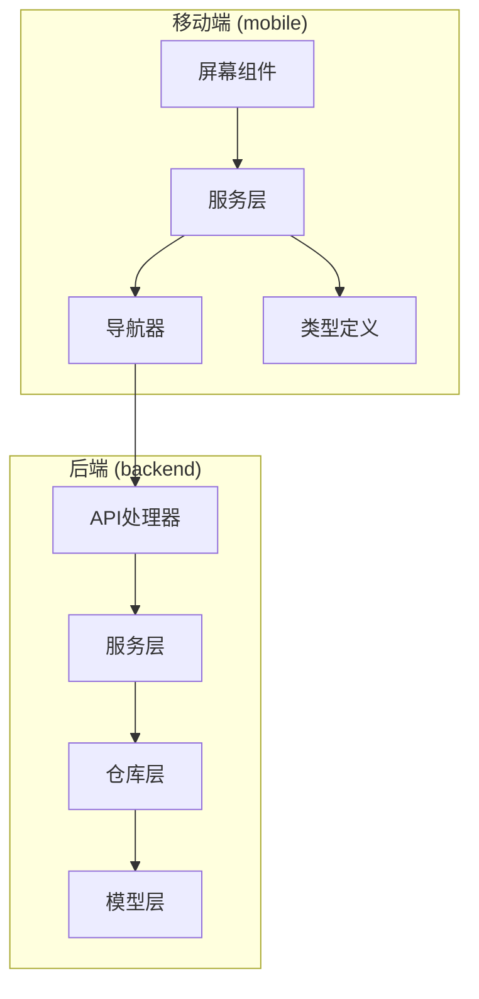

**图表来源**
- [CreateOrderScreen.tsx:1-231](file://mobile/src/screens/order/CreateOrderScreen.tsx#L1-L231)
- [OrderListScreen.tsx:1-554](file://mobile/src/screens/order/OrderListScreen.tsx#L1-L554)
- [handler.go:1-763](file://backend/internal/api/v2/order/handler.go#L1-L763)

**章节来源**
- [CreateOrderScreen.tsx:1-231](file://mobile/src/screens/order/CreateOrderScreen.tsx#L1-L231)
- [OrderListScreen.tsx:1-554](file://mobile/src/screens/order/OrderListScreen.tsx#L1-L554)
- [MainNavigator.tsx:1-195](file://mobile/src/navigation/MainNavigator.tsx#L1-L195)

## 核心组件

### 移动端核心组件

订单管理模块包含以下核心屏幕组件：

1. **订单创建屏幕** (`CreateOrderScreen`)
   - 实现无人机租赁订单的创建流程
   - 包含日期选择、参数配置、费用计算等功能

2. **订单列表屏幕** (`OrderListScreen`)
   - 展示用户的所有订单
   - 支持按角色和状态过滤
   - 提供订单状态可视化展示

3. **订单详情屏幕** (`OrderDetailScreen`)
   - 显示订单的详细信息
   - 展示参与方信息、执行状态、财务信息
   - 提供操作按钮和状态跟踪

4. **支付屏幕** (`PaymentScreen`)
   - 处理订单支付流程
   - 支付方式选择和验证
   - 支付结果处理

5. **评价屏幕** (`ReviewScreen`)
   - 实现订单评价功能
   - 支持评分和评论提交
   - 历史记录展示

**章节来源**
- [CreateOrderScreen.tsx:1-231](file://mobile/src/screens/order/CreateOrderScreen.tsx#L1-L231)
- [OrderListScreen.tsx:1-554](file://mobile/src/screens/order/OrderListScreen.tsx#L1-L554)
- [OrderDetailScreen.tsx:1-935](file://mobile/src/screens/order/OrderDetailScreen.tsx#L1-L935)
- [PaymentScreen.tsx:1-523](file://mobile/src/screens/order/PaymentScreen.tsx#L1-L523)
- [ReviewScreen.tsx:1-486](file://mobile/src/screens/order/ReviewScreen.tsx#L1-L486)

### 服务层组件

移动端通过服务层与后端API进行通信：

1. **订单服务** (`orderV2Service`)
   - 订单列表查询
   - 订单详情获取
   - 订单状态操作

2. **订单金融服务** (`orderFinanceV2Service`)
   - 支付处理
   - 退款管理
   - 评价管理

**章节来源**
- [orderV2.ts:1-49](file://mobile/src/services/orderV2.ts#L1-L49)
- [orderFinanceV2.ts:1-56](file://mobile/src/services/orderFinanceV2.ts#L1-L56)

## 架构概览

订单管理模块采用分层架构设计，确保前后端职责清晰分离：

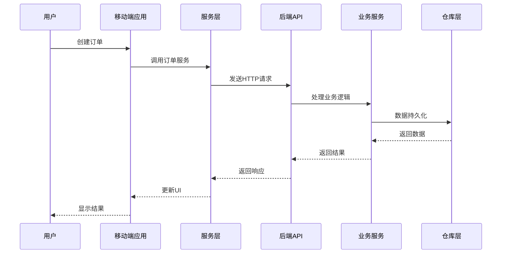

**图表来源**
- [orderV2.ts:20-40](file://mobile/src/services/orderV2.ts#L20-L40)
- [handler.go:32-80](file://backend/internal/api/v2/order/handler.go#L32-L80)

### 数据流架构

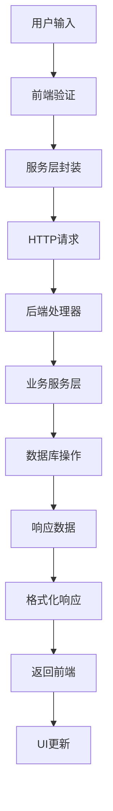

**图表来源**
- [PaymentScreen.tsx:103-125](file://mobile/src/screens/order/PaymentScreen.tsx#L103-L125)
- [payment_handler.go:27-82](file://backend/internal/api/v2/payment/handler.go#L27-L82)

**章节来源**
- [MainNavigator.tsx:131-195](file://mobile/src/navigation/MainNavigator.tsx#L131-L195)
- [index.ts:569-800](file://mobile/src/types/index.ts#L569-L800)

## 详细组件分析

### 订单创建流程

订单创建是整个订单管理的核心流程，涉及多个步骤和验证机制：

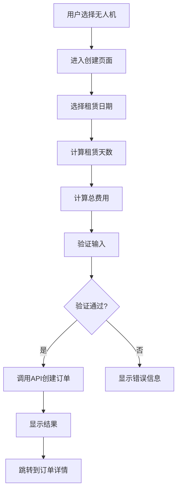

**图表来源**
- [CreateOrderScreen.tsx:39-72](file://mobile/src/screens/order/CreateOrderScreen.tsx#L39-L72)

#### 关键实现细节

1. **日期选择和验证**
   - 使用DateTimePicker组件处理日期选择
   - 实现最小日期限制和逻辑验证
   - 动态计算租赁天数和费用

2. **费用计算逻辑**
   - 基础费用：天数 × 日租金
   - 押金：固定押金金额
   - 总费用：基础费用 + 押金

3. **订单创建API调用**
   - 调用`orderService.create()`方法
   - 传递必要的订单参数
   - 处理异步响应和错误

**章节来源**
- [CreateOrderScreen.tsx:23-72](file://mobile/src/screens/order/CreateOrderScreen.tsx#L23-L72)
- [orderV2.ts:20-35](file://mobile/src/services/orderV2.ts#L20-L35)

### 订单列表管理

订单列表屏幕提供了强大的过滤和排序功能：

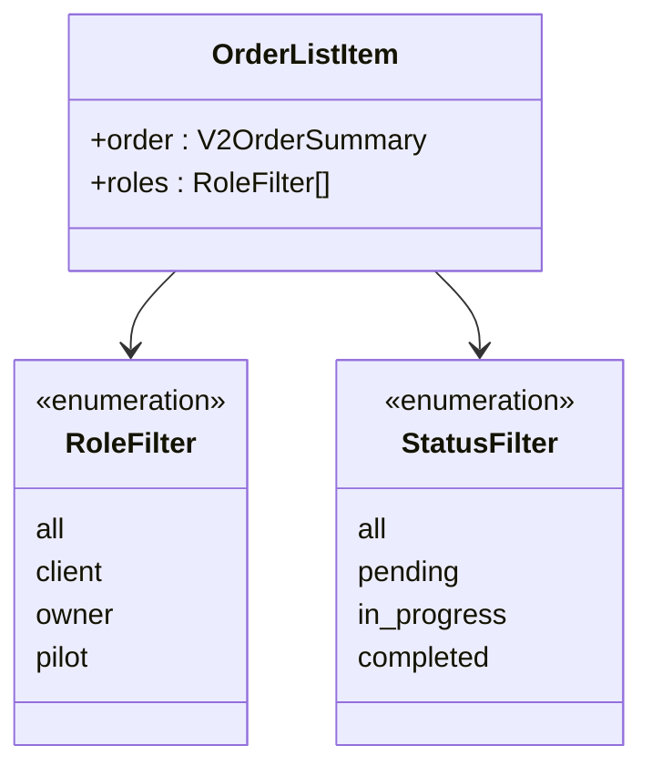

**图表来源**
- [OrderListScreen.tsx:30-34](file://mobile/src/screens/order/OrderListScreen.tsx#L30-L34)

#### 过滤和排序机制

1. **角色过滤**
   - 客户视角：显示所有相关订单
   - 机主视角：显示承接的订单
   - 飞手视角：显示执行的订单

2. **状态分组**
   - 待处理：创建、待支付、待确认等
   - 进行中：已确认、执行中等
   - 已完成：已完成、已取消等

3. **精确状态筛选**
   - 支持按具体状态精确过滤
   - 提供清除筛选功能

**章节来源**
- [OrderListScreen.tsx:151-377](file://mobile/src/screens/order/OrderListScreen.tsx#L151-L377)

### 订单详情展示

订单详情屏幕提供了完整的订单信息展示和操作功能：

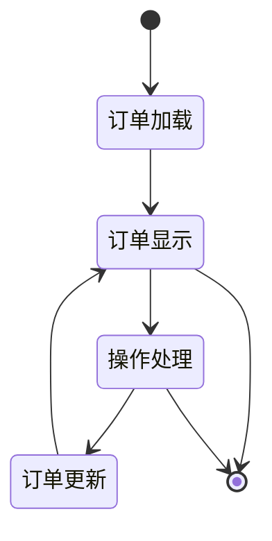

**图表来源**
- [OrderDetailScreen.tsx:244-611](file://mobile/src/screens/order/OrderDetailScreen.tsx#L244-L611)

#### 参与方信息管理

订单详情屏幕展示了三个关键参与方的信息：

1. **客户 (Client)**
   - 订单发起人信息
   - 联系方式和身份标识

2. **承接方 (Owner)**
   - 无人机机主信息
   - 承接订单的责任方

3. **执行方 (Pilot)**
   - 飞手执行信息
   - 订单实际执行者

#### 操作按钮动态生成

根据订单状态和用户角色动态生成可用的操作按钮：

- **机主确认/拒绝**：针对直供订单
- **客户支付**：针对待支付订单
- **签收确认**：针对已完成订单
- **派单管理**：针对需要派单的订单
- **飞行监控**：针对执行中的订单
- **订单评价**：针对已完成订单
- **售后处理**：针对需要售后的订单

**章节来源**
- [OrderDetailScreen.tsx:244-611](file://mobile/src/screens/order/OrderDetailScreen.tsx#L244-L611)

### 支付处理流程

支付屏幕实现了完整的支付处理流程，支持多种支付方式：

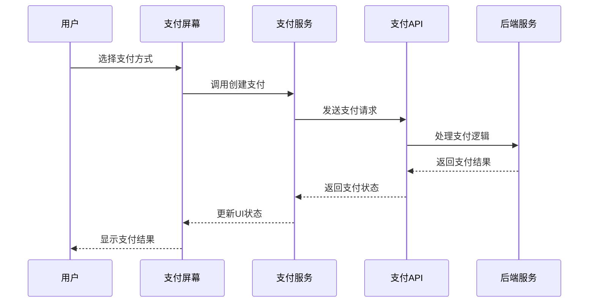

**图表来源**
- [PaymentScreen.tsx:142-175](file://mobile/src/screens/order/PaymentScreen.tsx#L142-L175)

#### 支付方式支持

1. **微信支付**
   - 生成支付单后等待外部支付完成
   - 支持真实的第三方支付集成

2. **支付宝**
   - 类似微信支付的处理流程
   - 支持标准的第三方支付接口

3. **模拟支付**
   - 开发测试环境专用
   - 立即回写支付成功状态

#### 支付状态管理

- **待处理 (pending)**：支付单已创建但未完成
- **已支付 (paid)**：支付已完成
- **已退款 (refunded)**：已发起或完成退款
- **失败 (failed)**：支付过程中出现错误

**章节来源**
- [PaymentScreen.tsx:90-311](file://mobile/src/screens/order/PaymentScreen.tsx#L90-L311)
- [payment_handler.go:27-82](file://backend/internal/api/v2/payment/handler.go#L27-L82)

### 评价系统

评价屏幕实现了订单评价功能，支持多维度评价：

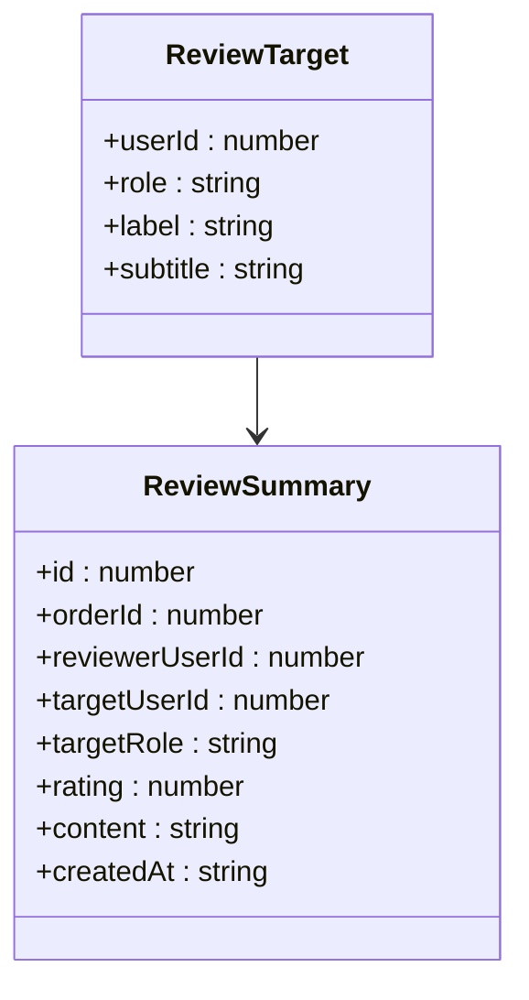

**图表来源**
- [ReviewScreen.tsx:27-32](file://mobile/src/screens/order/ReviewScreen.tsx#L27-L32)

#### 评价目标识别

系统自动识别可评价的参与方：

1. **客户评价机主**
   - 客户可以评价机主的服务质量
   - 评价内容和评分都会保存

2. **客户评价飞手**
   - 客户可以评价飞手的执行表现
   - 支持详细的飞行执行评价

3. **机主评价客户**
   - 机主可以评价客户的配合度
   - 影响双方的信用评级

4. **机主评价飞手**
   - 机主可以评价飞手的专业能力
   - 影响飞手的接单机会

#### 评价规则

- **评分范围**：1-5星制
- **内容长度**：最多500字符
- **唯一性**：每个用户对同一订单只能评价一次
- **时机限制**：只有订单状态为"completed"时才能评价

**章节来源**
- [ReviewScreen.tsx:82-295](file://mobile/src/screens/order/ReviewScreen.tsx#L82-L295)
- [review_handler.go:28-84](file://backend/internal/api/v2/review/handler.go#L28-L84)

## 依赖关系分析

订单管理模块的依赖关系体现了清晰的分层架构：

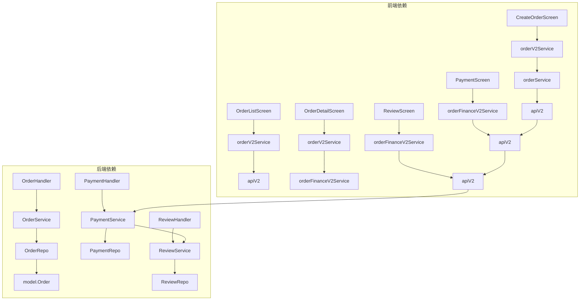

**图表来源**
- [orderV2.ts:1-49](file://mobile/src/services/orderV2.ts#L1-L49)
- [orderFinanceV2.ts:1-56](file://mobile/src/services/orderFinanceV2.ts#L1-L56)
- [handler.go:18-30](file://backend/internal/api/v2/order/handler.go#L18-L30)

### 类型定义依赖

系统使用统一的类型定义确保前后端数据一致性：

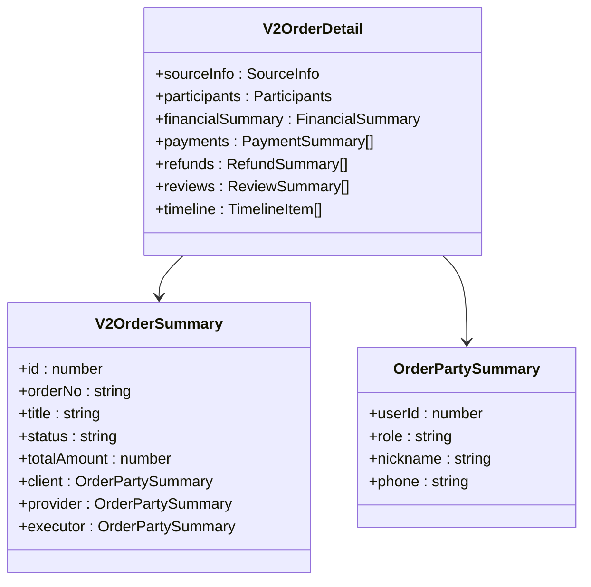

**图表来源**
- [index.ts:569-797](file://mobile/src/types/index.ts#L569-L797)

**章节来源**
- [index.ts:506-797](file://mobile/src/types/index.ts#L506-L797)

## 性能考虑

### 前端性能优化

1. **懒加载策略**
   - 使用`useFocusEffect`优化屏幕加载
   - 按需加载数据，减少初始渲染压力

2. **状态管理**
   - 使用React Hooks管理组件状态
   - 避免不必要的重新渲染

3. **网络请求优化**
   - 批量请求合并
   - 缓存策略实现

### 后端性能优化

1. **数据库查询优化**
   - 使用预加载避免N+1查询问题
   - 合理的索引设计

2. **事务处理**
   - 关键业务流程使用事务保证数据一致性
   - 减少数据库锁竞争

3. **缓存机制**
   - 频繁访问的数据使用缓存
   - 缓存失效策略设计

## 故障排除指南

### 常见问题及解决方案

1. **订单创建失败**
   - 检查无人机可用性状态
   - 验证日期选择的合理性
   - 确认用户权限

2. **支付处理异常**
   - 检查支付方式配置
   - 验证订单状态是否正确
   - 查看支付日志

3. **评价提交失败**
   - 确认订单状态为completed
   - 检查评价目标的有效性
   - 验证评分范围

### 错误处理机制

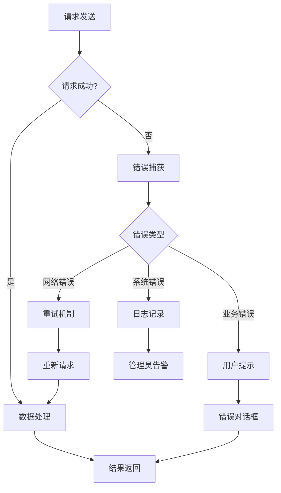

**图表来源**
- [CreateOrderScreen.tsx:67-72](file://mobile/src/screens/order/CreateOrderScreen.tsx#L67-L72)
- [PaymentScreen.tsx:165-175](file://mobile/src/screens/order/PaymentScreen.tsx#L165-L175)

**章节来源**
- [CreateOrderScreen.tsx:39-72](file://mobile/src/screens/order/CreateOrderScreen.tsx#L39-L72)
- [PaymentScreen.tsx:142-175](file://mobile/src/screens/order/PaymentScreen.tsx#L142-L175)

## 结论

订单管理模块是一个功能完整、架构清晰的移动端业务系统。通过合理的分层设计和严格的业务逻辑实现，该模块能够有效支撑无人机租赁平台的核心业务需求。

### 主要优势

1. **完整的业务流程覆盖**
   - 从订单创建到完成评价的全生命周期管理
   - 支持多种订单类型和复杂的业务场景

2. **良好的用户体验**
   - 直观的界面设计和交互流程
   - 实时的状态更新和反馈机制

3. **可靠的系统架构**
   - 清晰的前后端分离设计
   - 完善的错误处理和异常恢复机制

### 技术亮点

1. **灵活的订单状态管理**
   - 支持复杂的订单状态流转
   - 动态的操作按钮生成

2. **强大的数据可视化**
   - 多维度的订单信息展示
   - 直观的状态进度跟踪

3. **完善的支付体系**
   - 支持多种支付方式
   - 安全的支付处理机制

该模块为无人机租赁平台提供了坚实的技术基础，能够有效支撑业务的持续发展和扩展需求。