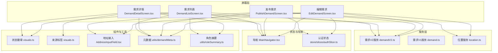
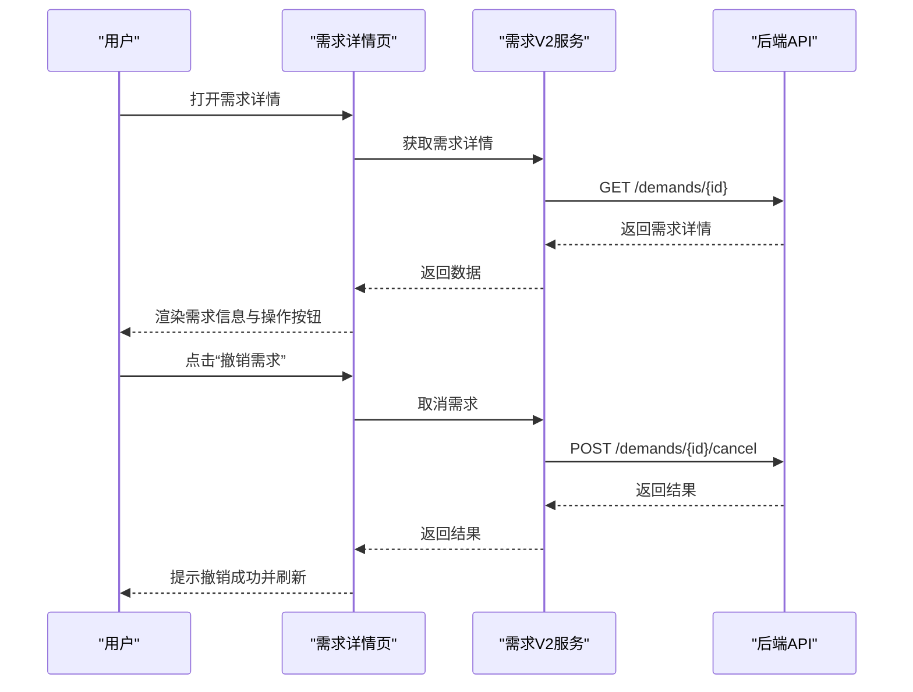
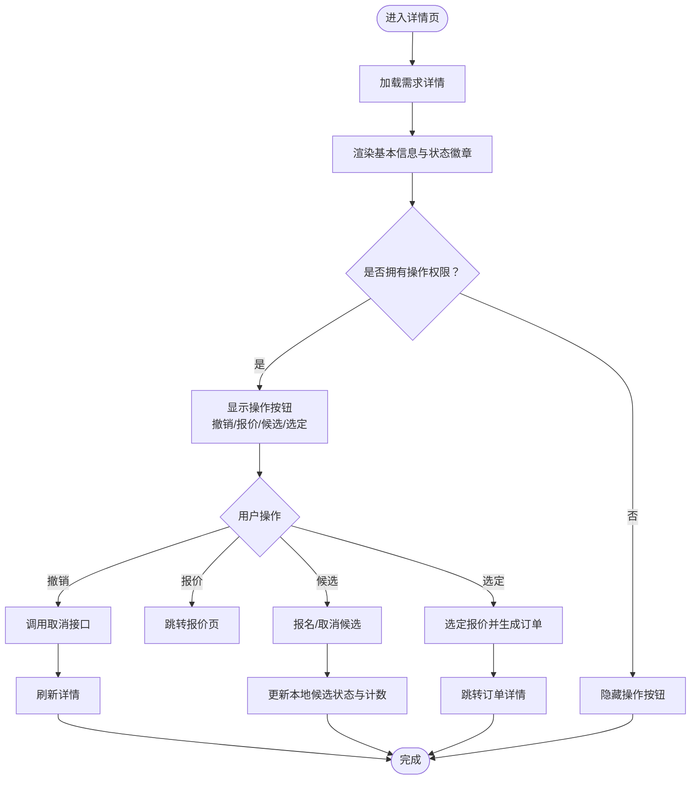
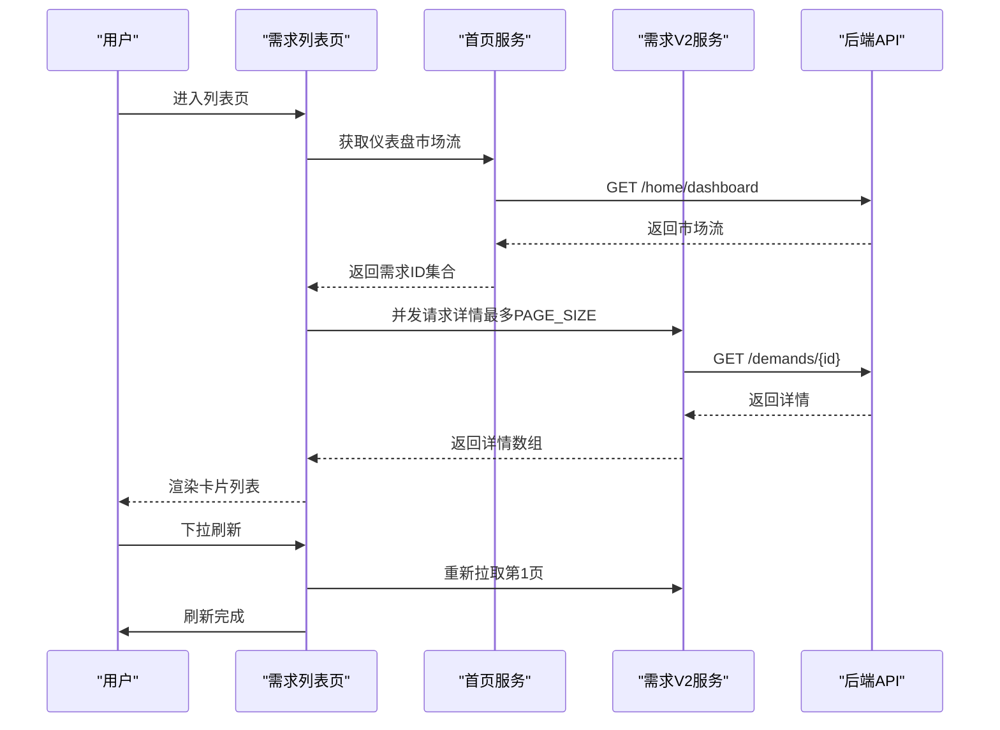
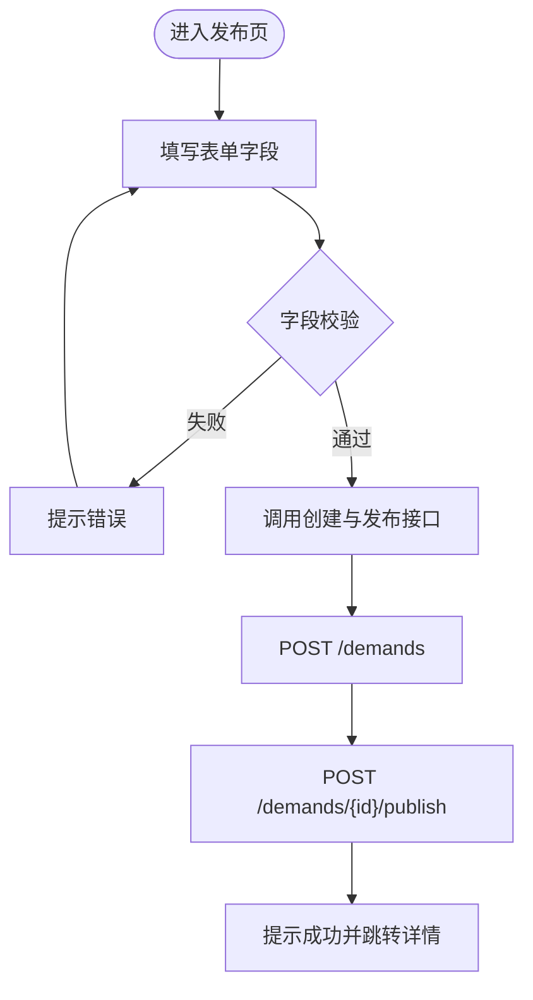
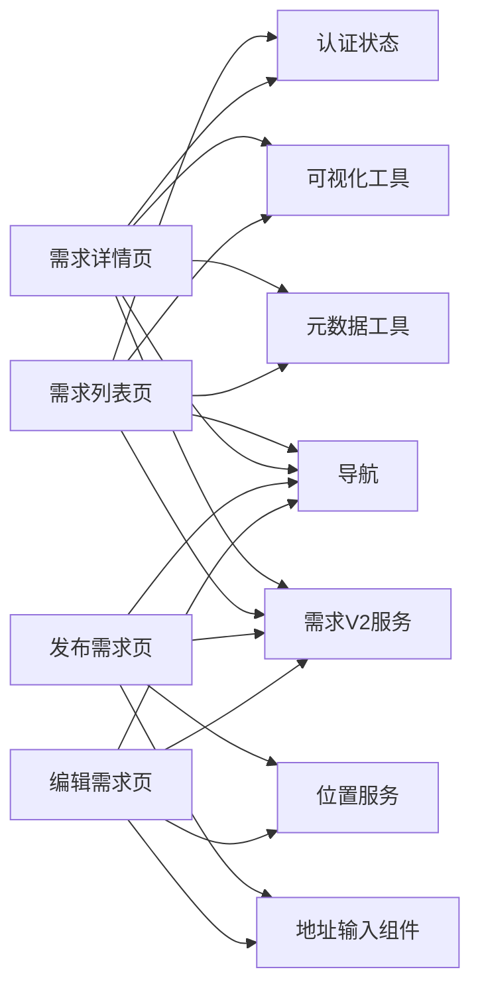

# 需求发布模块

<cite>
**本文档引用的文件**
- [DemandDetailScreen.tsx](file://mobile/src/screens/demand/DemandDetailScreen.tsx)
- [DemandListScreen.tsx](file://mobile/src/screens/demand/DemandListScreen.tsx)
- [PublishDemandScreen.tsx](file://mobile/src/screens/publish/PublishDemandScreen.tsx)
- [EditDemandScreen.tsx](file://mobile/src/screens/publish/EditDemandScreen.tsx)
- [demandV2.ts](file://mobile/src/services/demandV2.ts)
- [demand.ts](file://mobile/src/services/demand.ts)
- [index.ts](file://mobile/src/types/index.ts)
- [demandMeta.ts](file://mobile/src/utils/demandMeta.ts)
- [visuals.ts](file://mobile/src/components/business/visuals.ts)
- [MainNavigator.tsx](file://mobile/src/navigation/MainNavigator.tsx)
- [AddressInputField.tsx](file://mobile/src/components/AddressInputField.tsx)
- [location.ts](file://mobile/src/services/location.ts)
- [roleSummary.ts](file://mobile/src/utils/roleSummary.ts)
- [authSlice.ts](file://mobile/src/store/slices/authSlice.ts)
</cite>

## 目录
1. [简介](#简介)
2. [项目结构](#项目结构)
3. [核心组件](#核心组件)
4. [架构总览](#架构总览)
5. [详细组件分析](#详细组件分析)
6. [依赖关系分析](#依赖关系分析)
7. [性能考虑](#性能考虑)
8. [故障排除指南](#故障排除指南)
9. [结论](#结论)

## 简介
本文件面向移动端需求发布模块，系统性梳理从需求创建、编辑、发布、管理到详情展示与列表呈现的完整流程。文档重点覆盖以下方面：
- 需求详情页：信息展示、状态管理、操作按钮（撤销、报价、候选报名、选定方案）
- 需求列表页：模式切换（公开/机主/飞手）、筛选排序、分页加载、状态标识
- 发布表单：字段校验、数据绑定、提交处理、默认时间与有效期
- 元数据管理：场景标签、预算格式化、时间格式化、地址解析
- 地理位置选择：地址输入组件、POI搜索、逆地理编码、常用地址管理
- 时间预约：默认时间段与有效期策略
- 状态流转与用户交互优化：权限判断、UI反馈、加载与错误处理

## 项目结构
需求发布模块位于移动端工程的 screens、services、components、utils、navigation、store 等目录中，采用按功能域划分的组织方式：
- screens：需求详情、需求列表、发布需求、编辑需求
- services：v2 需求服务封装（含市场、撮合、发布、取消、候选等）
- components：业务组件（状态徽章、来源标签、可视化主题）
- utils：元数据格式化（预算、时间、场景、地址）、角色摘要
- navigation：路由注册与页面跳转
- store：认证状态与角色摘要

**图表来源**
- [DemandListScreen.tsx:1-324](file://mobile/src/screens/demand/DemandListScreen.tsx#L1-L324)
- [DemandDetailScreen.tsx:1-424](file://mobile/src/screens/demand/DemandDetailScreen.tsx#L1-L424)
- [PublishDemandScreen.tsx:1-228](file://mobile/src/screens/publish/PublishDemandScreen.tsx#L1-L228)
- [EditDemandScreen.tsx:1-263](file://mobile/src/screens/publish/EditDemandScreen.tsx#L1-L263)
- [demandV2.ts:1-84](file://mobile/src/services/demandV2.ts#L1-L84)
- [demand.ts:1-68](file://mobile/src/services/demand.ts#L1-L68)
- [visuals.ts:1-185](file://mobile/src/components/business/visuals.ts#L1-L185)
- [demandMeta.ts:1-63](file://mobile/src/utils/demandMeta.ts#L1-L63)
- [MainNavigator.tsx:1-195](file://mobile/src/navigation/MainNavigator.tsx#L1-L195)
- [AddressInputField.tsx:1-66](file://mobile/src/components/AddressInputField.tsx#L1-L66)
- [location.ts:1-51](file://mobile/src/services/location.ts#L1-L51)
- [roleSummary.ts:1-39](file://mobile/src/utils/roleSummary.ts#L1-L39)
- [authSlice.ts:1-65](file://mobile/src/store/slices/authSlice.ts#L1-L65)

**章节来源**
- [MainNavigator.tsx:131-195](file://mobile/src/navigation/MainNavigator.tsx#L131-L195)

## 核心组件
- 需求详情页：负责渲染需求信息、状态徽章、来源标签；根据用户角色与需求状态控制操作按钮（撤销、报价、候选报名、选定方案）；支持展开/收起报价列表并异步加载报价。
- 需求列表页：支持三种模式（公开/机主/飞手），基于角色动态显示；使用 FlatList 实现分页加载与下拉刷新；卡片式展示预算、场景、区域、时间、报价数与候选数。
- 发布需求页：表单字段包含标题、场景、服务地址、货物重量、预计架次、预算范围、需求说明；提交时进行基础校验，并调用服务创建与发布。
- 编辑需求页：加载现有需求详情，支持服务地址或往返路线两种模式切换，提交时进行字段校验并更新。

**章节来源**
- [DemandDetailScreen.tsx:32-424](file://mobile/src/screens/demand/DemandDetailScreen.tsx#L32-L424)
- [DemandListScreen.tsx:51-324](file://mobile/src/screens/demand/DemandListScreen.tsx#L51-L324)
- [PublishDemandScreen.tsx:54-228](file://mobile/src/screens/publish/PublishDemandScreen.tsx#L54-L228)
- [EditDemandScreen.tsx:51-263](file://mobile/src/screens/publish/EditDemandScreen.tsx#L51-L263)

## 架构总览
需求发布模块遵循“屏幕-服务-类型-工具-导航-状态”的分层设计：
- 屏幕层：负责用户交互与页面渲染
- 服务层：封装 API 请求，统一 v1/v2 需求接口
- 类型层：定义需求详情、摘要、报价、候选、地址快照等数据结构
- 工具层：格式化预算、时间、场景、地址；状态与来源可视化；角色摘要
- 导航层：集中注册页面与跳转
- 状态层：Redux Toolkit 维护用户、令牌、角色摘要

**图表来源**
- [DemandDetailScreen.tsx:138-156](file://mobile/src/screens/demand/DemandDetailScreen.tsx#L138-L156)
- [demandV2.ts:75-77](file://mobile/src/services/demandV2.ts#L75-L77)

## 详细组件分析

### 需求详情页（DemandDetailScreen）
- 数据加载与缓存：通过 demandV2Service.getById 拉取详情，使用本地状态缓存；支持通过 route.params.refreshAt 触发重新加载。
- 权限与状态控制：根据当前用户与需求状态判断是否允许编辑/撤销；对机主与飞手分别开放报价与候选报名入口；支持展开/收起报价列表并异步加载。
- 操作流程：
  - 撤销需求：二次确认弹窗，调用 cancel 接口，成功后刷新详情。
  - 报价：跳转至报价编辑页，提交后回到详情页。
  - 候选报名：调用 applyCandidate 或 withdrawCandidate，更新本地 my_candidate 与候选计数。
  - 选定方案：调用 selectProvider，成功后弹出提示并跳转到订单详情。
- 展示内容：需求编号、标题、状态徽章、来源标签、预算、场景/地址/时间/重量/类型/架次/候选开关、描述、特殊要求、撮合进度与报价卡片。

**图表来源**
- [DemandDetailScreen.tsx:61-156](file://mobile/src/screens/demand/DemandDetailScreen.tsx#L61-L156)
- [DemandDetailScreen.tsx:121-136](file://mobile/src/screens/demand/DemandDetailScreen.tsx#L121-L136)
- [DemandDetailScreen.tsx:101-119](file://mobile/src/screens/demand/DemandDetailScreen.tsx#L101-L119)
- [DemandDetailScreen.tsx:138-156](file://mobile/src/screens/demand/DemandDetailScreen.tsx#L138-L156)

**章节来源**
- [DemandDetailScreen.tsx:32-424](file://mobile/src/screens/demand/DemandDetailScreen.tsx#L32-L424)
- [demandV2.ts:52-82](file://mobile/src/services/demandV2.ts#L52-L82)
- [visuals.ts:149-165](file://mobile/src/components/business/visuals.ts#L149-L165)
- [demandMeta.ts:4-63](file://mobile/src/utils/demandMeta.ts#L4-L63)
- [roleSummary.ts:14-39](file://mobile/src/utils/roleSummary.ts#L14-L39)

### 需求列表页（DemandListScreen）
- 模式与角色：根据角色摘要动态显示模式（公开/机主/飞手），不同模式对应不同的数据源与动作提示。
- 分页与刷新：PAGE_SIZE 固定为 20；公开模式通过首页仪表盘的市场流聚合 ID 后批量拉取；非公开模式通过分页接口获取。
- 渲染逻辑：ObjectCard 展示标题、来源标签、状态徽章、预算、场景/区域/时间、报价数/候选数与操作提示；支持下拉刷新与触底加载。
- 空态与描述：根据加载状态与模式显示空态文案与引导描述。

**图表来源**
- [DemandListScreen.tsx:85-111](file://mobile/src/screens/demand/DemandListScreen.tsx#L85-L111)
- [DemandListScreen.tsx:127-156](file://mobile/src/screens/demand/DemandListScreen.tsx#L127-L156)
- [DemandListScreen.tsx:203-239](file://mobile/src/screens/demand/DemandListScreen.tsx#L203-L239)

**章节来源**
- [DemandListScreen.tsx:51-324](file://mobile/src/screens/demand/DemandListScreen.tsx#L51-L324)
- [demandV2.ts:43-50](file://mobile/src/services/demandV2.ts#L43-L50)

### 发布需求页（PublishDemandScreen）
- 表单字段与校验：标题必填、服务地址必填、货物重量需大于0；预算范围可选；默认开启候选报名与设置预约时间窗口与有效期。
- 数据绑定：使用 useState 维护表单值；toAddressSnapshot 将地址数据转换为服务端所需的快照格式。
- 提交流程：handleSubmit 中进行基础校验，调用 demandV2Service.create 创建，再调用 publish 完成发布；成功后提示并跳转详情页。

**图表来源**
- [PublishDemandScreen.tsx:69-109](file://mobile/src/screens/publish/PublishDemandScreen.tsx#L69-L109)
- [PublishDemandScreen.tsx:85-100](file://mobile/src/screens/publish/PublishDemandScreen.tsx#L85-L100)

**章节来源**
- [PublishDemandScreen.tsx:54-228](file://mobile/src/screens/publish/PublishDemandScreen.tsx#L54-L228)
- [demandV2.ts:66-73](file://mobile/src/services/demandV2.ts#L66-L73)

### 编辑需求页（EditDemandScreen）
- 加载与回填：首次进入通过 demandV2Service.getById 加载详情，回填各字段；支持服务地址或往返路线两种模式。
- 校验与更新：与发布页类似的字段校验逻辑；调用 update 接口提交变更；成功后提示并返回详情页。
- 地址快照转换：snapshotToAddressData 与 toAddressSnapshot 在双向转换中保持兼容。

**章节来源**
- [EditDemandScreen.tsx:51-263](file://mobile/src/screens/publish/EditDemandScreen.tsx#L51-L263)
- [demandV2.ts:69-70](file://mobile/src/services/demandV2.ts#L69-L70)

### 地理位置与地址选择
- 地址输入组件：AddressInputField 负责展示当前选中地址或占位符，并触发地址选择导航。
- 位置服务：locationService 提供 POI 搜索、逆地理编码、周边搜索与常用地址管理。
- 使用场景：发布/编辑需求页通过地址输入组件选择服务地址；也可在地图选点页进一步细化位置。

**章节来源**
- [AddressInputField.tsx:17-51](file://mobile/src/components/AddressInputField.tsx#L17-L51)
- [location.ts:4-51](file://mobile/src/services/location.ts#L4-L51)

### 元数据与可视化
- 场景标签：getDemandSceneLabel 将场景键映射为中文标签。
- 预算格式化：formatDemandBudget 支持区间、上限、下限与待沟通四种情况。
- 时间格式化：formatDemandSchedule 统一格式化开始/结束时间。
- 地址解析：resolveDemandPrimaryAddress 优先级依次为服务地址文本、服务地址、起点/终点地址。
- 状态徽章：getObjectStatusMeta 根据对象类型与状态返回徽章元数据。
- 来源标签：getSourceMeta 返回来源类型徽章。

**章节来源**
- [demandMeta.ts:4-63](file://mobile/src/utils/demandMeta.ts#L4-L63)
- [visuals.ts:149-165](file://mobile/src/components/business/visuals.ts#L149-L165)

## 依赖关系分析
- 屏幕与服务：详情/列表/发布/编辑均依赖 demandV2Service；发布/编辑还依赖地址输入组件与位置服务。
- 类型与工具：所有屏幕共享 types 中的 DemandDetail、DemandSummary、DemandQuoteSummary、AddressSnapshot 等类型；使用 utils 中的格式化与可视化工具。
- 导航与状态：MainNavigator 注册所有页面；authSlice 提供用户与角色摘要，roleSummary 提供有效角色摘要计算。

**图表来源**
- [MainNavigator.tsx:131-195](file://mobile/src/navigation/MainNavigator.tsx#L131-L195)
- [authSlice.ts:1-65](file://mobile/src/store/slices/authSlice.ts#L1-L65)

**章节来源**
- [index.ts:457-492](file://mobile/src/types/index.ts#L457-L492)
- [index.ts:318-342](file://mobile/src/types/index.ts#L318-L342)

## 性能考虑
- 列表分页：固定 PAGE_SIZE=20，避免一次性加载过多数据；公开模式通过首页仪表盘聚合 ID 后并发请求，减少网络往返。
- 异步加载：详情页报价列表按需加载，避免初始渲染压力。
- 本地状态更新：候选报名与撤销时先更新本地状态，再等待接口返回，提升交互流畅度。
- 图片与渲染：卡片组件复用，避免重复渲染；徽章与标签使用统一可视化工具，减少重复计算。

## 故障排除指南
- 获取详情失败：详情页捕获异常并弹出错误提示，同时将需求置空以显示空态。
- 加载报价失败：报价列表加载失败时弹出错误提示，保持界面稳定。
- 撤销失败：撤销接口失败时弹出错误提示并保留当前状态，允许用户重试。
- 发布/编辑校验失败：针对必填字段与数值有效性进行即时提示，避免无效请求。
- 地址选择异常：地址输入组件点击后导航至地址选择页，若无地址选中则显示占位符。

**章节来源**
- [DemandDetailScreen.tsx:66-72](file://mobile/src/screens/demand/DemandDetailScreen.tsx#L66-L72)
- [DemandDetailScreen.tsx:86-91](file://mobile/src/screens/demand/DemandDetailScreen.tsx#L86-L91)
- [DemandDetailScreen.tsx:148-156](file://mobile/src/screens/demand/DemandDetailScreen.tsx#L148-L156)
- [PublishDemandScreen.tsx:70-81](file://mobile/src/screens/publish/PublishDemandScreen.tsx#L70-L81)
- [EditDemandScreen.tsx:101-119](file://mobile/src/screens/publish/EditDemandScreen.tsx#L101-L119)

## 结论
需求发布模块通过清晰的分层设计与完善的权限控制，实现了从创建、编辑、发布到管理的闭环流程。详情页与列表页分别承担信息展示与入口聚合职责，配合统一的元数据与可视化工具，确保了良好的用户体验。发布/编辑表单在字段校验与提交流程上的严谨性，结合地理位置服务与地址输入组件，满足了复杂场景下的需求发布与管理需求。