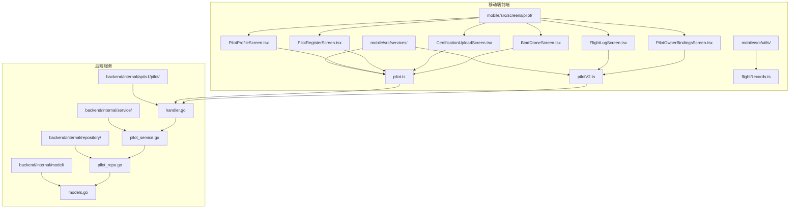
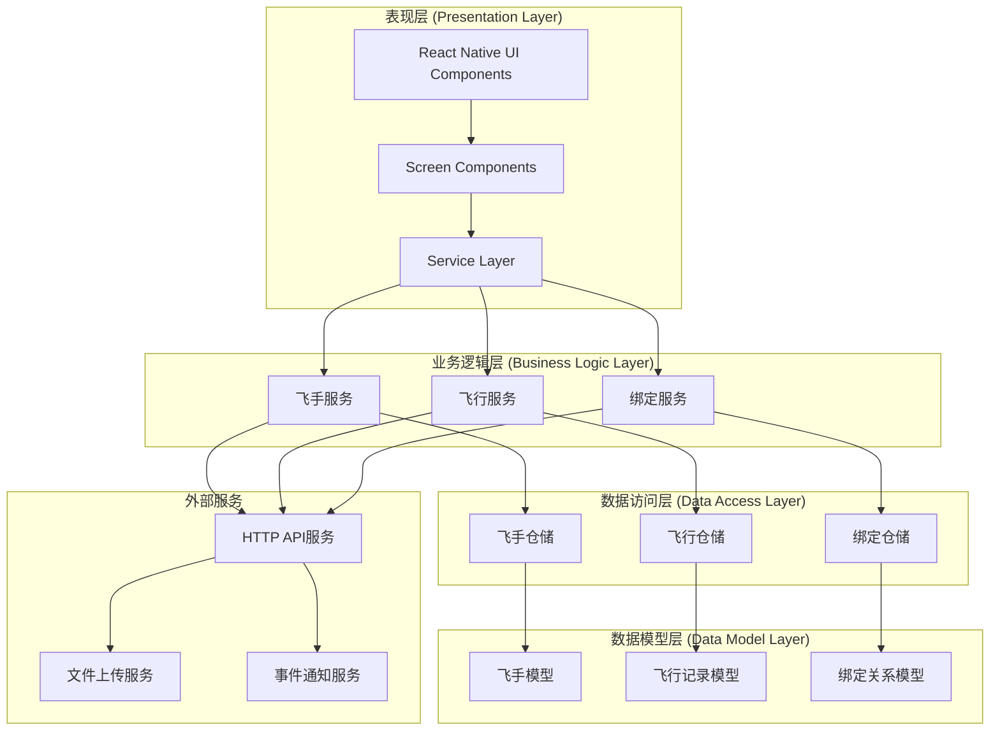
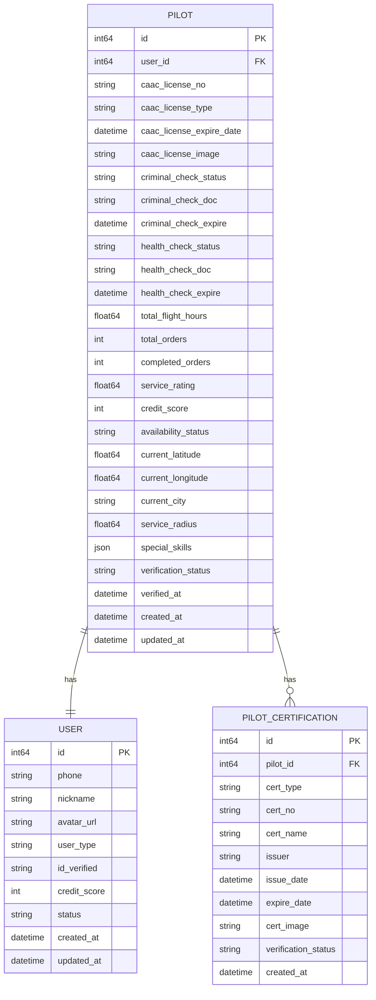
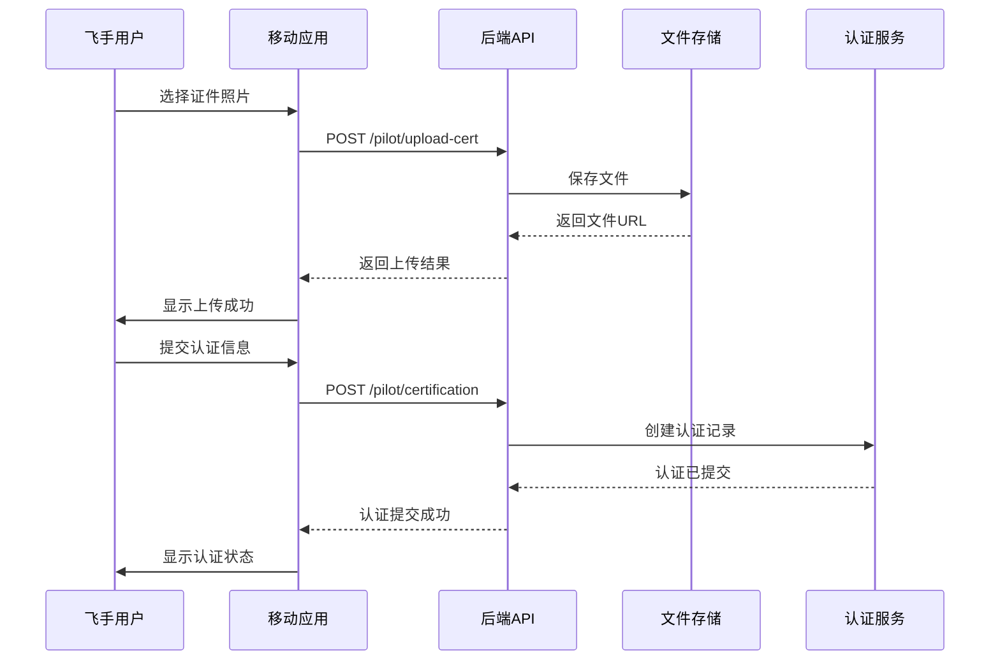
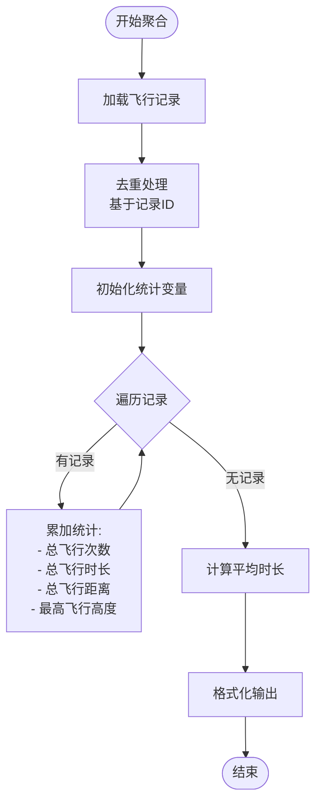
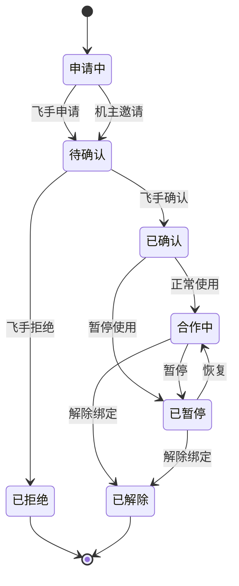
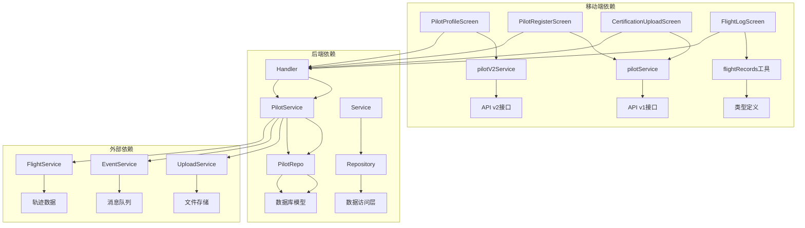

# 飞手管理模块

<cite>
**本文档引用的文件**
- [mobile/src/screens/pilot/PilotProfileScreen.tsx](file://mobile/src/screens/pilot/PilotProfileScreen.tsx)
- [mobile/src/screens/pilot/PilotRegisterScreen.tsx](file://mobile/src/screens/pilot/PilotRegisterScreen.tsx)
- [mobile/src/screens/pilot/CertificationUploadScreen.tsx](file://mobile/src/screens/pilot/CertificationUploadScreen.tsx)
- [mobile/src/screens/pilot/FlightLogScreen.tsx](file://mobile/src/screens/pilot/FlightLogScreen.tsx)
- [mobile/src/screens/pilot/PilotOwnerBindingsScreen.tsx](file://mobile/src/screens/pilot/PilotOwnerBindingsScreen.tsx)
- [mobile/src/screens/pilot/BindDroneScreen.tsx](file://mobile/src/screens/pilot/BindDroneScreen.tsx)
- [mobile/src/services/pilot.ts](file://mobile/src/services/pilot.ts)
- [mobile/src/services/pilotV2.ts](file://mobile/src/services/pilotV2.ts)
- [mobile/src/utils/flightRecords.ts](file://mobile/src/utils/flightRecords.ts)
- [backend/internal/api/v1/pilot/handler.go](file://backend/internal/api/v1/pilot/handler.go)
- [backend/internal/service/pilot_service.go](file://backend/internal/service/pilot_service.go)
- [backend/internal/repository/pilot_repo.go](file://backend/internal/repository/pilot_repo.go)
- [backend/internal/model/models.go](file://backend/internal/model/models.go)
</cite>

## 目录
1. [简介](#简介)
2. [项目结构](#项目结构)
3. [核心组件](#核心组件)
4. [架构概览](#架构概览)
5. [详细组件分析](#详细组件分析)
6. [依赖关系分析](#依赖关系分析)
7. [性能考虑](#性能考虑)
8. [故障排除指南](#故障排除指南)
9. [结论](#结论)

## 简介

飞手管理模块是无人机租赁平台的核心功能模块之一，负责管理飞手的整个生命周期。该模块涵盖了飞手档案管理、资质认证、技能等级、飞行日志管理、无人机绑定关系等多个方面。

本模块采用前后端分离架构，前端使用React Native构建移动应用界面，后端使用Go语言开发RESTful API服务。系统支持完整的飞手认证流程，包括身份验证、技能测试、培训完成等环节。

## 项目结构

飞手管理模块主要分布在以下目录结构中：

**图表来源**
- [mobile/src/screens/pilot/PilotProfileScreen.tsx:1-345](file://mobile/src/screens/pilot/PilotProfileScreen.tsx#L1-L345)
- [mobile/src/services/pilot.ts:1-346](file://mobile/src/services/pilot.ts#L1-L346)
- [backend/internal/api/v1/pilot/handler.go:1-724](file://backend/internal/api/v1/pilot/handler.go#L1-L724)

**章节来源**
- [mobile/src/screens/pilot/PilotProfileScreen.tsx:1-345](file://mobile/src/screens/pilot/PilotProfileScreen.tsx#L1-L345)
- [mobile/src/services/pilot.ts:1-346](file://mobile/src/services/pilot.ts#L1-L346)
- [backend/internal/api/v1/pilot/handler.go:1-724](file://backend/internal/api/v1/pilot/handler.go#L1-L724)

## 核心组件

飞手管理模块包含以下核心组件：

### 移动端界面组件

1. **飞手档案管理界面** - [PilotProfileScreen.tsx](file://mobile/src/screens/pilot/PilotProfileScreen.tsx)
   - 飞手个人信息维护
   - 资质认证状态展示
   - 技能等级管理
   - 服务范围设置

2. **飞手注册界面** - [PilotRegisterScreen.tsx](file://mobile/src/screens/pilot/PilotRegisterScreen.tsx)
   - 身份验证流程
   - 技能测试准备
   - 培训完成确认
   - 认证资料提交

3. **认证上传界面** - [CertificationUploadScreen.tsx](file://mobile/src/screens/pilot/CertificationUploadScreen.tsx)
   - 证件扫描功能
   - 信息录入处理
   - 审核状态跟踪

4. **飞行日志管理界面** - [FlightLogScreen.tsx](file://mobile/src/screens/pilot/FlightLogScreen.tsx)
   - 飞行记录展示
   - 成绩统计分析
   - 经验积累追踪

### 服务层组件

1. **飞手服务接口** - [pilot.ts](file://mobile/src/services/pilot.ts)
   - 飞手档案CRUD操作
   - 资质证书管理
   - 飞行记录查询
   - 无人机绑定管理

2. **飞手v2服务接口** - [pilotV2.ts](file://mobile/src/services/pilotV2.ts)
   - 新版本飞手档案API
   - 实时飞行记录查询
   - 绑定关系管理

### 工具函数

1. **飞行记录工具** - [flightRecords.ts](file://mobile/src/utils/flightRecords.ts)
   - 飞行记录聚合计算
   - 时间格式化处理
   - 距离单位转换

**章节来源**
- [mobile/src/screens/pilot/PilotProfileScreen.tsx:1-345](file://mobile/src/screens/pilot/PilotProfileScreen.tsx#L1-L345)
- [mobile/src/screens/pilot/PilotRegisterScreen.tsx:1-264](file://mobile/src/screens/pilot/PilotRegisterScreen.tsx#L1-L264)
- [mobile/src/screens/pilot/CertificationUploadScreen.tsx:1-647](file://mobile/src/screens/pilot/CertificationUploadScreen.tsx#L1-L647)
- [mobile/src/screens/pilot/FlightLogScreen.tsx:1-312](file://mobile/src/screens/pilot/FlightLogScreen.tsx#L1-L312)
- [mobile/src/services/pilot.ts:1-346](file://mobile/src/services/pilot.ts#L1-L346)
- [mobile/src/services/pilotV2.ts:1-91](file://mobile/src/services/pilotV2.ts#L1-L91)
- [mobile/src/utils/flightRecords.ts:1-95](file://mobile/src/utils/flightRecords.ts#L1-L95)

## 架构概览

飞手管理模块采用分层架构设计，确保了良好的可维护性和扩展性：

**图表来源**
- [backend/internal/service/pilot_service.go:1-800](file://backend/internal/service/pilot_service.go#L1-L800)
- [backend/internal/repository/pilot_repo.go:1-395](file://backend/internal/repository/pilot_repo.go#L1-L395)
- [backend/internal/api/v1/pilot/handler.go:1-724](file://backend/internal/api/v1/pilot/handler.go#L1-L724)

该架构实现了以下关键特性：

1. **清晰的职责分离** - 每个层次都有明确的职责边界
2. **可测试性** - 通过接口抽象实现了良好的可测试性
3. **可扩展性** - 支持新功能的平滑集成
4. **数据一致性** - 通过事务管理和仓储模式保证数据完整性

**章节来源**
- [backend/internal/service/pilot_service.go:1-800](file://backend/internal/service/pilot_service.go#L1-L800)
- [backend/internal/repository/pilot_repo.go:1-395](file://backend/internal/repository/pilot_repo.go#L1-L395)
- [backend/internal/api/v1/pilot/handler.go:1-724](file://backend/internal/api/v1/pilot/handler.go#L1-L724)

## 详细组件分析

### 飞手档案管理系统

飞手档案管理系统是整个模块的核心，负责管理飞手的基本信息和状态。

#### 数据模型设计

**图表来源**
- [backend/internal/model/models.go:759-796](file://backend/internal/model/models.go#L759-L796)
- [backend/internal/model/models.go:799-800](file://backend/internal/model/models.go#L799-L800)

#### 核心功能实现

飞手档案管理的核心功能包括：

1. **档案创建与更新**
   - 首次注册时创建飞手档案
   - 后续更新个人信息和资质
   - 自动同步角色档案

2. **状态管理**
   - 资质认证状态跟踪
   - 接单状态管理
   - 信用评分维护

3. **位置服务**
   - 实时位置更新
   - 服务范围计算
   - 周边飞手查找

**章节来源**
- [backend/internal/service/pilot_service.go:129-206](file://backend/internal/service/pilot_service.go#L129-L206)
- [backend/internal/service/pilot_service.go:218-308](file://backend/internal/service/pilot_service.go#L218-L308)
- [backend/internal/repository/pilot_repo.go:24-72](file://backend/internal/repository/pilot_repo.go#L24-L72)

### 资质认证上传系统

资质认证上传系统提供了完整的证件扫描和认证流程。

#### 上传流程设计

**图表来源**
- [mobile/src/screens/pilot/CertificationUploadScreen.tsx:100-206](file://mobile/src/screens/pilot/CertificationUploadScreen.tsx#L100-L206)
- [backend/internal/api/v1/pilot/handler.go:415-438](file://backend/internal/api/v1/pilot/handler.go#L415-L438)

#### 支持的认证类型

系统支持多种类型的飞手认证：

| 认证类型 | 描述 | 必填字段 |
|---------|------|----------|
| 无犯罪记录证明 | 无犯罪记录证明 | 证明文件URL |
| 健康证明 | 体检健康证明 | 文件URL, 有效期 |
| CAAC执照 | 中国民航局执照 | 执照编号, 类型, 图片 |
| AOPA合格证 | 中国航空器拥有者及驾驶员协会证书 | 证书编号, 名称, 发证机关 |
| UTC操控师证 | 国际标准操控师证书 | 证书编号, 名称, 发证机关 |
| 培训结业证书 | 专业培训结业证明 | 证书编号, 名称, 发证机关 |
| 保险证明 | 飞行保险证明 | 证书编号, 名称, 发证机关 |
| 其他资质 | 其他相关资质证明 | 证书编号, 名称, 发证机关 |

**章节来源**
- [mobile/src/screens/pilot/CertificationUploadScreen.tsx:36-45](file://mobile/src/screens/pilot/CertificationUploadScreen.tsx#L36-L45)
- [mobile/src/screens/pilot/CertificationUploadScreen.tsx:134-206](file://mobile/src/screens/pilot/CertificationUploadScreen.tsx#L134-L206)
- [backend/internal/api/v1/pilot/handler.go:459-511](file://backend/internal/api/v1/pilot/handler.go#L459-L511)

### 飞行日志管理系统

飞行日志管理系统负责记录和分析飞手的飞行活动。

#### 飞行记录聚合算法

**图表来源**
- [mobile/src/utils/flightRecords.ts:21-45](file://mobile/src/utils/flightRecords.ts#L21-L45)

#### 飞行统计指标

系统提供以下飞行统计指标：

1. **基础统计**
   - 总飞行次数
   - 总飞行时长（格式化显示）
   - 总飞行距离（格式化显示）
   - 最高飞行高度

2. **高级统计**
   - 平均每次飞行时长
   - 飞行效率分析
   - 技能发展轨迹

3. **实时监控**
   - 当前飞行状态
   - 即时飞行数据
   - 飞行轨迹追踪

**章节来源**
- [mobile/src/utils/flightRecords.ts:1-95](file://mobile/src/utils/flightRecords.ts#L1-L95)
- [mobile/src/screens/pilot/FlightLogScreen.tsx:32-180](file://mobile/src/screens/pilot/FlightLogScreen.tsx#L32-L180)

### 无人机绑定关系管理

无人机绑定关系管理模块实现了飞手与无人机之间的灵活绑定机制。

#### 绑定关系状态流转

#### 绑定类型支持

系统支持多种绑定类型：

| 绑定类型 | 描述 | 使用场景 |
|---------|------|----------|
| 自有无人机 | 飞手拥有 | 个人使用, 完全控制 |
| 授权使用 | 机主授权 | 短期使用, 有限权限 |
| 租赁使用 | 正规租赁 | 商业用途, 规范管理 |
| 临时绑定 | 临时授权 | 特殊任务, 短期使用 |

**章节来源**
- [mobile/src/screens/pilot/PilotOwnerBindingsScreen.tsx:41-159](file://mobile/src/screens/pilot/PilotOwnerBindingsScreen.tsx#L41-L159)
- [mobile/src/screens/pilot/BindDroneScreen.tsx:29-107](file://mobile/src/screens/pilot/BindDroneScreen.tsx#L29-L107)
- [backend/internal/service/pilot_service.go:405-527](file://backend/internal/service/pilot_service.go#L405-L527)

## 依赖关系分析

飞手管理模块的依赖关系体现了清晰的分层架构设计：

**图表来源**
- [mobile/src/services/pilot.ts:1-346](file://mobile/src/services/pilot.ts#L1-L346)
- [mobile/src/services/pilotV2.ts:1-91](file://mobile/src/services/pilotV2.ts#L1-L91)
- [backend/internal/api/v1/pilot/handler.go:15-25](file://backend/internal/api/v1/pilot/handler.go#L15-L25)
- [backend/internal/service/pilot_service.go:21-59](file://backend/internal/service/pilot_service.go#L21-L59)

### 关键依赖特性

1. **接口抽象** - 通过接口定义规范了各层之间的依赖关系
2. **依赖注入** - 支持服务间的松耦合依赖
3. **事务管理** - 确保数据操作的一致性
4. **事件驱动** - 通过事件服务实现异步处理

**章节来源**
- [backend/internal/service/pilot_service.go:61-75](file://backend/internal/service/pilot_service.go#L61-L75)
- [backend/internal/repository/pilot_repo.go:12-22](file://backend/internal/repository/pilot_repo.go#L12-L22)

## 性能考虑

飞手管理模块在设计时充分考虑了性能优化：

### 数据访问优化

1. **索引策略**
   - 飞手档案按用户ID建立唯一索引
   - 资质证书按飞手ID建立索引
   - 飞行记录按时间排序建立索引

2. **查询优化**
   - 使用预加载减少N+1查询问题
   - 分页查询避免大数据量加载
   - 条件查询限制返回字段

### 缓存策略

1. **内存缓存**
   - 飞手档案缓存
   - 认证状态缓存
   - 配置信息缓存

2. **数据库缓存**
   - 查询结果缓存
   - 统计数据缓存
   - 热点数据预加载

### 异步处理

1. **文件上传**
   - 异步文件处理
   - 进度回调机制
   - 错误重试机制

2. **事件处理**
   - 异步事件通知
   - 事件队列管理
   - 失败重试策略

## 故障排除指南

### 常见问题及解决方案

#### 飞手注册问题

**问题**: 注册时提示"用户不存在"
**解决方案**: 
1. 检查用户认证状态
2. 确认用户ID有效性
3. 验证用户类型设置

**问题**: 重复注册错误
**解决方案**:
1. 检查用户是否已有飞手档案
2. 清理缓存后重试
3. 联系技术支持

#### 资质认证问题

**问题**: 上传文件失败
**解决方案**:
1. 检查文件格式和大小
2. 确认网络连接稳定
3. 重新尝试上传

**问题**: 认证状态长时间停留在"待审核"
**解决方案**:
1. 检查认证材料完整性
2. 联系客服获取帮助
3. 重新提交认证申请

#### 飞行记录问题

**问题**: 飞行记录不显示
**解决方案**:
1. 检查订单状态
2. 确认飞行数据完整性
3. 刷新页面重试

**问题**: 统计数据异常
**解决方案**:
1. 清理浏览器缓存
2. 重新登录账户
3. 联系技术支持

#### 无人机绑定问题

**问题**: 绑定申请无法提交
**解决方案**:
1. 检查机主用户ID
2. 确认双方身份验证
3. 重新填写申请信息

**问题**: 绑定状态异常
**解决方案**:
1. 检查绑定时间范围
2. 确认绑定类型有效性
3. 联系机主确认

**章节来源**
- [mobile/src/screens/pilot/PilotRegisterScreen.tsx:87-139](file://mobile/src/screens/pilot/PilotRegisterScreen.tsx#L87-L139)
- [mobile/src/screens/pilot/CertificationUploadScreen.tsx:134-206](file://mobile/src/screens/pilot/CertificationUploadScreen.tsx#L134-L206)
- [mobile/src/screens/pilot/BindDroneScreen.tsx:75-107](file://mobile/src/screens/pilot/BindDroneScreen.tsx#L75-L107)

## 结论

飞手管理模块通过精心设计的架构和完善的功能实现，为无人机租赁平台提供了强大的飞手管理能力。模块具有以下特点：

1. **功能完整** - 覆盖飞手管理的所有关键环节
2. **架构清晰** - 分层设计便于维护和扩展
3. **用户体验良好** - 界面友好，操作简便
4. **性能优异** - 优化的数据访问和缓存策略
5. **安全可靠** - 完善的权限控制和数据保护

该模块的成功实施为平台的飞手生态建设奠定了坚实基础，为未来的功能扩展和技术升级提供了良好的技术支撑。