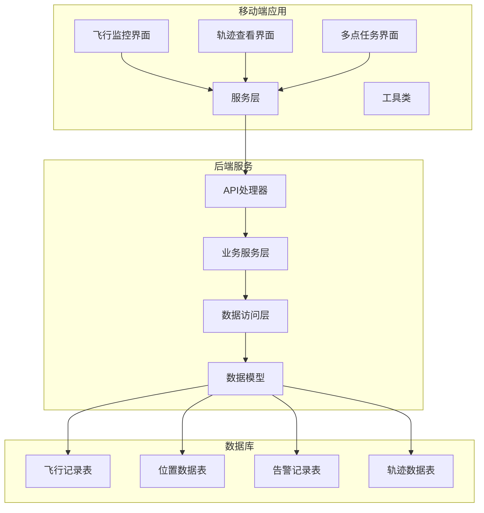
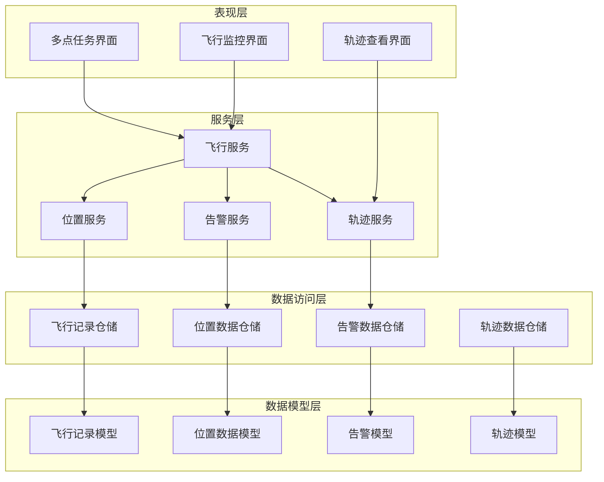
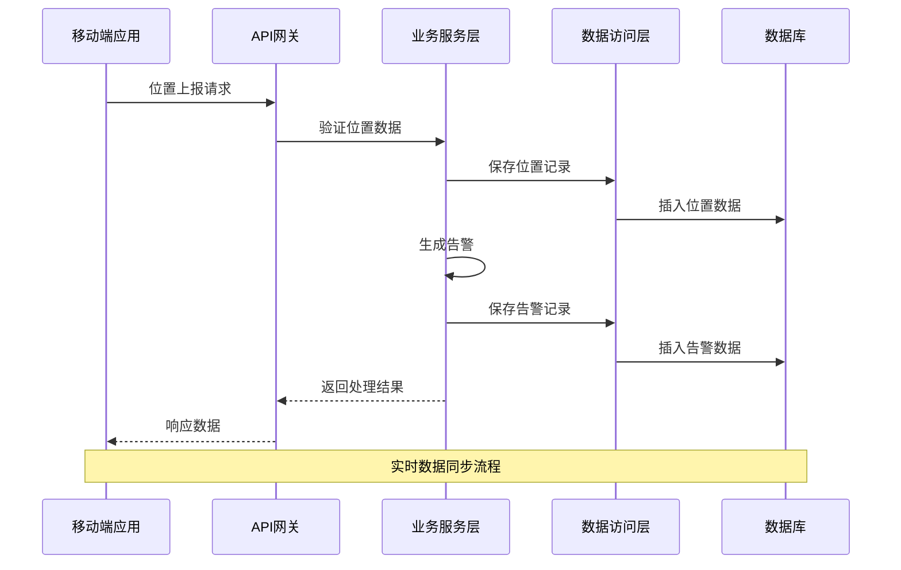
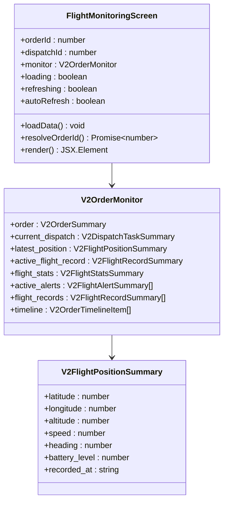
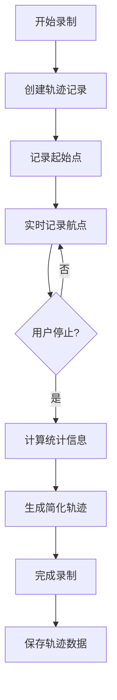
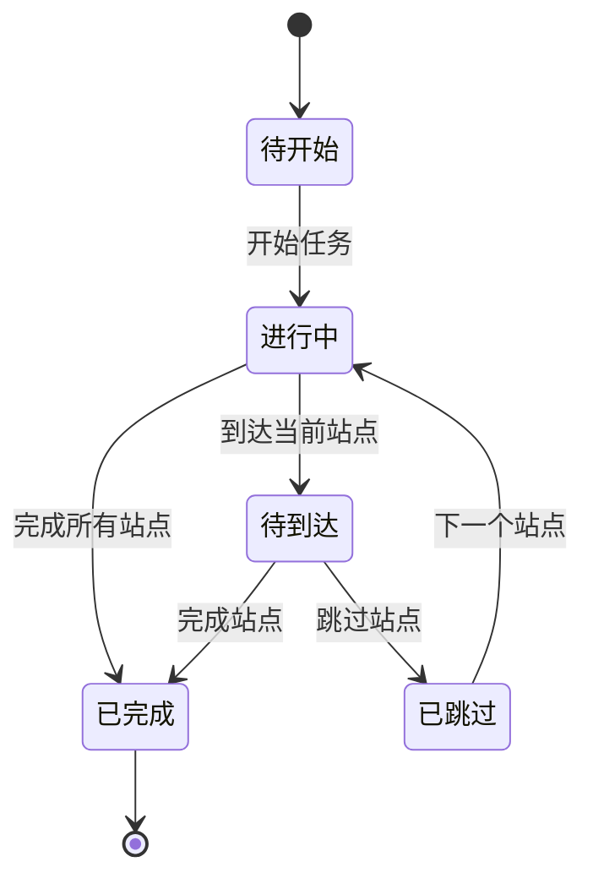
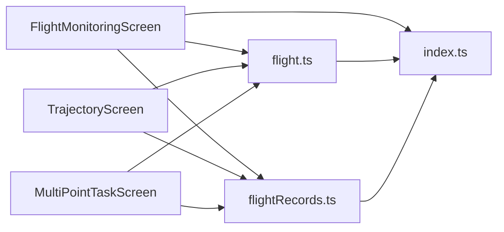
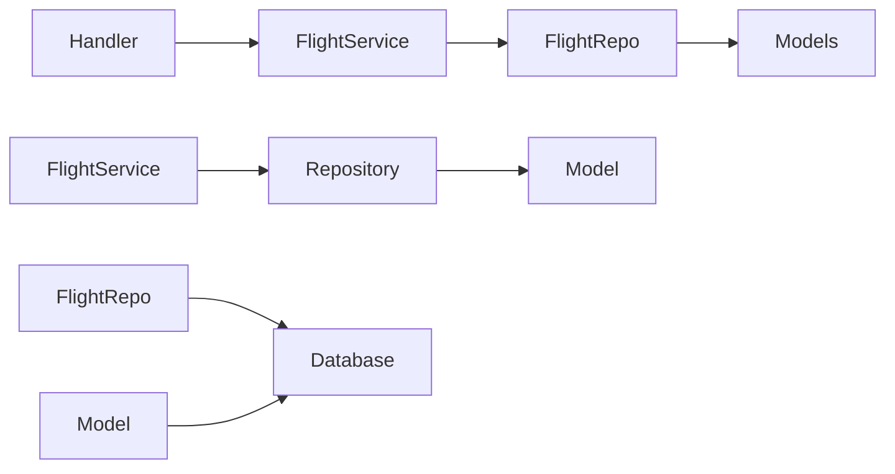

# 飞行监控模块

<cite>
**本文档引用的文件**
- [FlightMonitoringScreen.tsx](file://mobile/src/screens/flight/FlightMonitoringScreen.tsx)
- [TrajectoryScreen.tsx](file://mobile/src/screens/flight/TrajectoryScreen.tsx)
- [MultiPointTaskScreen.tsx](file://mobile/src/screens/flight/MultiPointTaskScreen.tsx)
- [flight.ts](file://mobile/src/services/flight.ts)
- [flightRecords.ts](file://mobile/src/utils/flightRecords.ts)
- [index.ts](file://mobile/src/types/index.ts)
- [handler.go](file://backend/internal/api/v1/flight/handler.go)
- [flight_service.go](file://backend/internal/service/flight_service.go)
- [flight_repo.go](file://backend/internal/repository/flight_repo.go)
- [models.go](file://backend/internal/model/models.go)
</cite>

## 目录
1. [项目概述](#项目概述)
2. [项目结构](#项目结构)
3. [核心组件](#核心组件)
4. [架构概览](#架构概览)
5. [详细组件分析](#详细组件分析)
6. [依赖关系分析](#依赖关系分析)
7. [性能考虑](#性能考虑)
8. [故障排除指南](#故障排除指南)
9. [结论](#结论)

## 项目概述

飞行监控模块是无人机租赁平台的核心功能模块，负责实时监控无人机飞行状态、管理飞行任务和提供飞行数据分析。该模块实现了完整的飞行监控生态系统，包括实时位置追踪、飞行状态显示、异常报警、轨迹查看、多点任务管理等功能。

### 主要功能特性

- **实时飞行监控**：提供无人机实时位置追踪、飞行状态显示和异常报警
- **历史轨迹查看**：支持历史飞行轨迹绘制、路径分析和速度计算
- **多点任务管理**：实现复杂的多点任务规划、航点管理和自动返航
- **飞行记录存储**：完整的GPS数据处理、时间戳管理和数据压缩
- **飞行安全保障**：电子围栏、高度限制、风速预警等安全监控
- **实时数据同步**：支持实时数据同步和离线轨迹回放
- **性能优化**：高效的内存管理和网络优化策略

## 项目结构

飞行监控模块采用前后端分离的架构设计，前端使用React Native构建移动应用界面，后端使用Go语言实现RESTful API服务。

**图表来源**
- [FlightMonitoringScreen.tsx:1-708](file://mobile/src/screens/flight/FlightMonitoringScreen.tsx#L1-L708)
- [handler.go:1-800](file://backend/internal/api/v1/flight/handler.go#L1-L800)

**章节来源**
- [FlightMonitoringScreen.tsx:1-708](file://mobile/src/screens/flight/FlightMonitoringScreen.tsx#L1-L708)
- [TrajectoryScreen.tsx:1-629](file://mobile/src/screens/flight/TrajectoryScreen.tsx#L1-L629)
- [MultiPointTaskScreen.tsx:1-829](file://mobile/src/screens/flight/MultiPointTaskScreen.tsx#L1-L829)

## 核心组件

### 移动端核心组件

#### 飞行监控主界面
飞行监控主界面提供了实时飞行状态的集中展示，包括订单状态、当前派单、最新位置、告警信息和飞行留痕等关键信息。

#### 轨迹查看界面
轨迹查看界面支持飞行轨迹的录制、查看和管理，提供详细的飞行统计数据和航点信息。

#### 多点任务界面
多点任务界面实现了复杂的多点任务管理功能，支持任务创建、执行监控和状态跟踪。

### 后端核心组件

#### API处理器
后端API处理器负责处理所有飞行监控相关的HTTP请求，包括位置上报、轨迹管理、告警处理等功能。

#### 业务服务层
业务服务层实现了飞行监控的核心逻辑，包括位置验证、告警生成、轨迹分析等复杂业务规则。

#### 数据访问层
数据访问层提供了对飞行监控数据的统一访问接口，支持数据的增删改查和复杂查询操作。

**章节来源**
- [flight.ts:1-305](file://mobile/src/services/flight.ts#L1-L305)
- [handler.go:1-800](file://backend/internal/api/v1/flight/handler.go#L1-L800)
- [flight_service.go:1-800](file://backend/internal/service/flight_service.go#L1-L800)

## 架构概览

飞行监控模块采用分层架构设计，确保了代码的可维护性和扩展性。

**图表来源**
- [flight_service.go:17-69](file://backend/internal/service/flight_service.go#L17-L69)
- [flight_repo.go:14-25](file://backend/internal/repository/flight_repo.go#L14-L25)
- [models.go:1310-1376](file://backend/internal/model/models.go#L1310-L1376)

### 数据流架构

**图表来源**
- [flight_service.go:112-158](file://backend/internal/service/flight_service.go#L112-L158)
- [flight_repo.go:84-95](file://backend/internal/repository/flight_repo.go#L84-L95)

## 详细组件分析

### 飞行监控主界面组件

#### 实时数据展示
飞行监控主界面实现了多种数据类型的实时展示，包括订单状态、飞行统计、当前位置和告警信息。

**图表来源**
- [FlightMonitoringScreen.tsx:236-430](file://mobile/src/screens/flight/FlightMonitoringScreen.tsx#L236-L430)
- [index.ts:737-748](file://mobile/src/types/index.ts#L737-L748)

#### 实时刷新机制
系统实现了智能的实时刷新机制，支持自动刷新和手动刷新两种模式，确保数据的及时性。

**章节来源**
- [FlightMonitoringScreen.tsx:281-304](file://mobile/src/screens/flight/FlightMonitoringScreen.tsx#L281-L304)

### 轨迹查看组件

#### 轨迹录制功能
轨迹录制功能支持飞行轨迹的实时录制和管理，提供详细的飞行统计数据和航点信息。

**图表来源**
- [flight_service.go:687-800](file://backend/internal/service/flight_service.go#L687-L800)
- [flight_repo.go:587-631](file://backend/internal/repository/flight_repo.go#L587-L631)

#### 轨迹数据分析
系统提供了丰富的轨迹数据分析功能，包括距离计算、速度分析、高度统计等。

**章节来源**
- [TrajectoryScreen.tsx:197-336](file://mobile/src/screens/flight/TrajectoryScreen.tsx#L197-L336)
- [flight_service.go:721-800](file://backend/internal/service/flight_service.go#L721-L800)

### 多点任务组件

#### 任务规划功能
多点任务组件实现了复杂的任务规划功能，支持多个站点的管理和执行监控。

**图表来源**
- [MultiPointTaskScreen.tsx:29-41](file://mobile/src/screens/flight/MultiPointTaskScreen.tsx#L29-L41)
- [flight_service.go:796-800](file://backend/internal/service/flight_service.go#L796-L800)

#### 自动返航功能
系统支持自动返航功能，当任务状态发生变化时自动触发返航程序。

**章节来源**
- [MultiPointTaskScreen.tsx:51-96](file://mobile/src/screens/flight/MultiPointTaskScreen.tsx#L51-L96)
- [flight_service.go:774-794](file://backend/internal/service/flight_service.go#L774-L794)

## 依赖关系分析

### 前端依赖关系

**图表来源**
- [FlightMonitoringScreen.tsx:18-28](file://mobile/src/screens/flight/FlightMonitoringScreen.tsx#L18-L28)
- [TrajectoryScreen.tsx:17-28](file://mobile/src/screens/flight/TrajectoryScreen.tsx#L17-L28)
- [MultiPointTaskScreen.tsx:15-25](file://mobile/src/screens/flight/MultiPointTaskScreen.tsx#L15-L25)

### 后端依赖关系

**图表来源**
- [handler.go:16-27](file://backend/internal/api/v1/flight/handler.go#L16-L27)
- [flight_service.go:17-26](file://backend/internal/service/flight_service.go#L17-L26)
- [flight_repo.go:14-21](file://backend/internal/repository/flight_repo.go#L14-L21)

**章节来源**
- [flight.ts:1-305](file://mobile/src/services/flight.ts#L1-L305)
- [flight_service.go:1-800](file://backend/internal/service/flight_service.go#L1-L800)

## 性能考虑

### 数据存储优化

系统采用了多种数据存储优化策略：

1. **索引优化**：为常用查询字段建立适当的数据库索引
2. **数据压缩**：对历史轨迹数据进行压缩存储
3. **缓存策略**：实现多层次的数据缓存机制
4. **批量操作**：支持批量数据插入和更新操作

### 网络通信优化

1. **数据分页**：实现大数据集的分页加载
2. **增量更新**：支持增量数据同步
3. **连接池管理**：优化HTTP连接的使用效率
4. **错误重试**：实现智能的网络错误重试机制

### 内存管理优化

1. **虚拟列表**：对大量数据项使用虚拟渲染
2. **懒加载**：实现组件和数据的懒加载
3. **内存泄漏防护**：确保定时器和事件监听器的正确清理
4. **图片优化**：实现图片的懒加载和缓存

## 故障排除指南

### 常见问题及解决方案

#### 位置数据异常
- **问题**：位置数据延迟或不准确
- **解决方案**：检查GPS信号强度、网络连接状态和设备权限设置

#### 轨迹录制失败
- **问题**：轨迹录制过程中断
- **解决方案**：检查存储空间、权限设置和网络连接

#### 告警通知延迟
- **问题**：告警通知发送延迟
- **解决方案**：检查服务器负载、网络延迟和消息队列状态

#### 数据同步问题
- **问题**：移动端与服务器数据不同步
- **解决方案**：检查网络连接、重新登录账户和清除应用缓存

### 调试工具和方法

1. **日志分析**：通过日志系统分析问题根因
2. **性能监控**：使用性能监控工具识别性能瓶颈
3. **网络抓包**：通过网络抓包工具分析通信问题
4. **数据库查询**：直接查询数据库验证数据一致性

**章节来源**
- [flight_service.go:471-533](file://backend/internal/service/flight_service.go#L471-L533)
- [flight_repo.go:154-227](file://backend/internal/repository/flight_repo.go#L154-L227)

## 结论

飞行监控模块是一个功能完整、架构清晰的无人机飞行管理系统。通过实时监控、历史轨迹分析、多点任务管理和安全监控等功能，为无人机租赁平台提供了强大的技术支持。

### 技术优势

1. **实时性强**：采用WebSocket和轮询相结合的方式确保数据的实时性
2. **扩展性好**：模块化设计便于功能扩展和维护
3. **安全性高**：完善的权限控制和数据加密机制
4. **性能优异**：优化的数据存储和网络通信策略

### 发展方向

1. **AI集成**：引入机器学习算法进行飞行预测和异常检测
2. **可视化增强**：提供更丰富的飞行数据可视化功能
3. **自动化提升**：增加更多自动化飞行管理功能
4. **生态扩展**：支持更多类型的无人机和飞行场景

该模块为无人机租赁平台的发展奠定了坚实的技术基础，为用户提供安全、可靠的飞行监控服务。