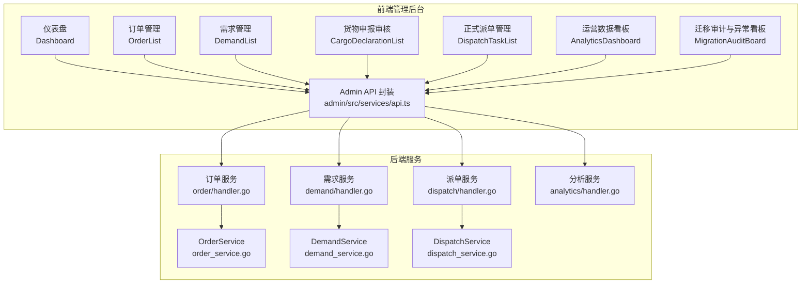
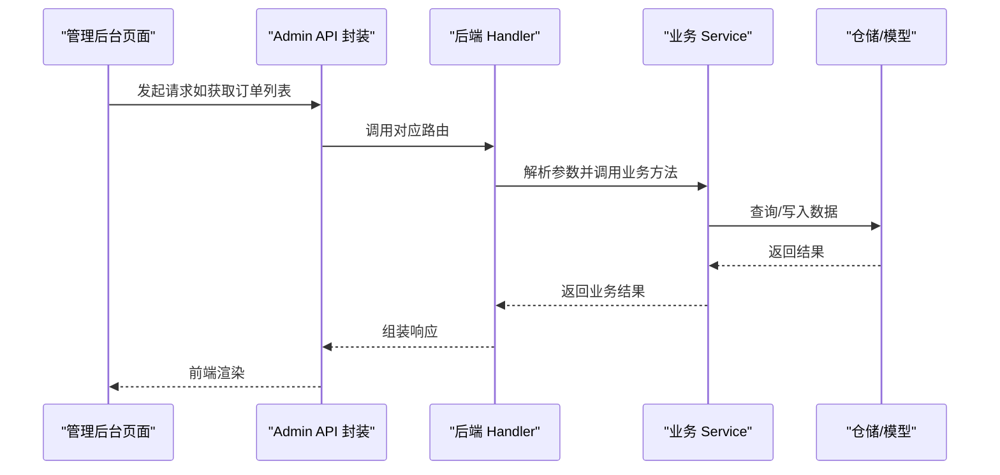
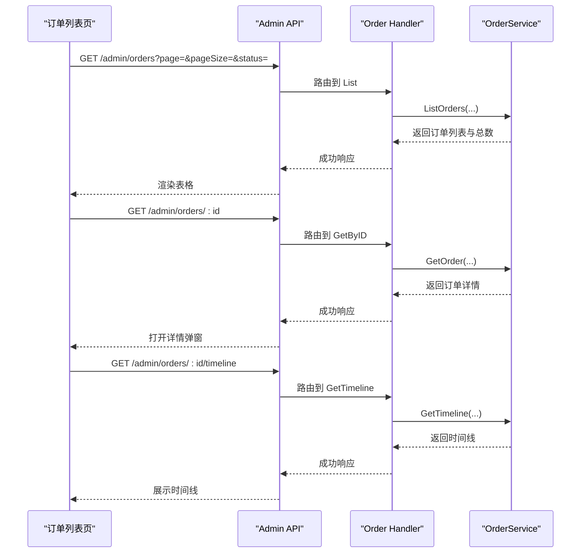
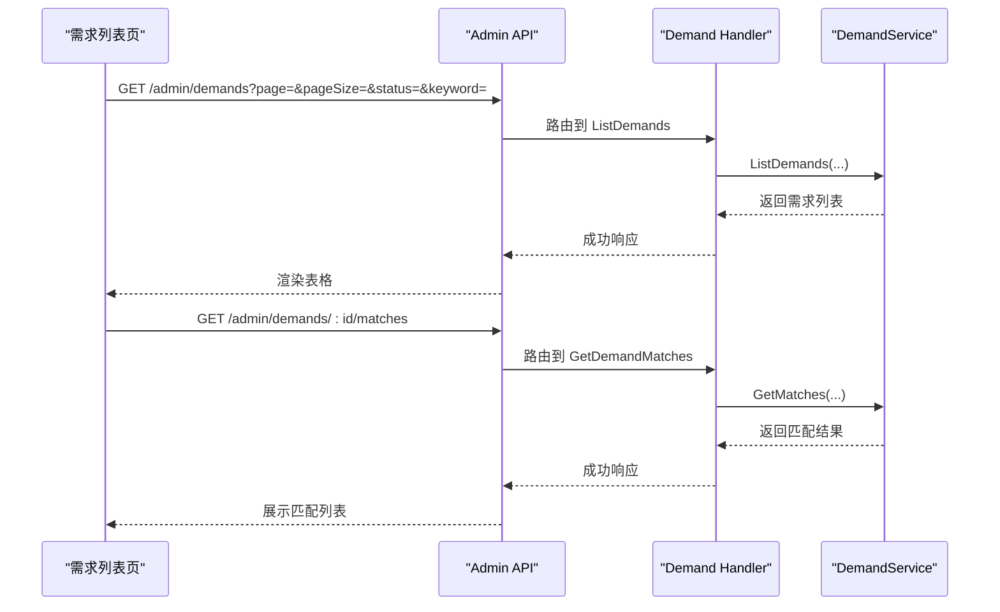
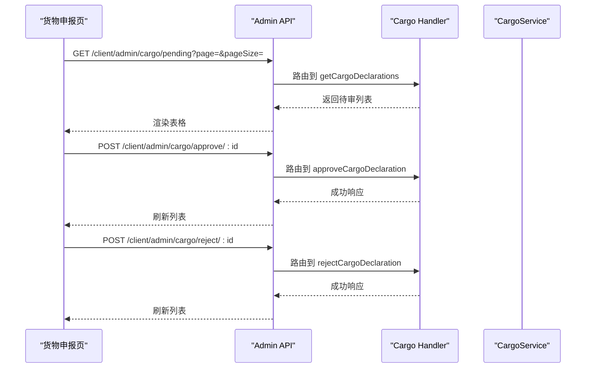
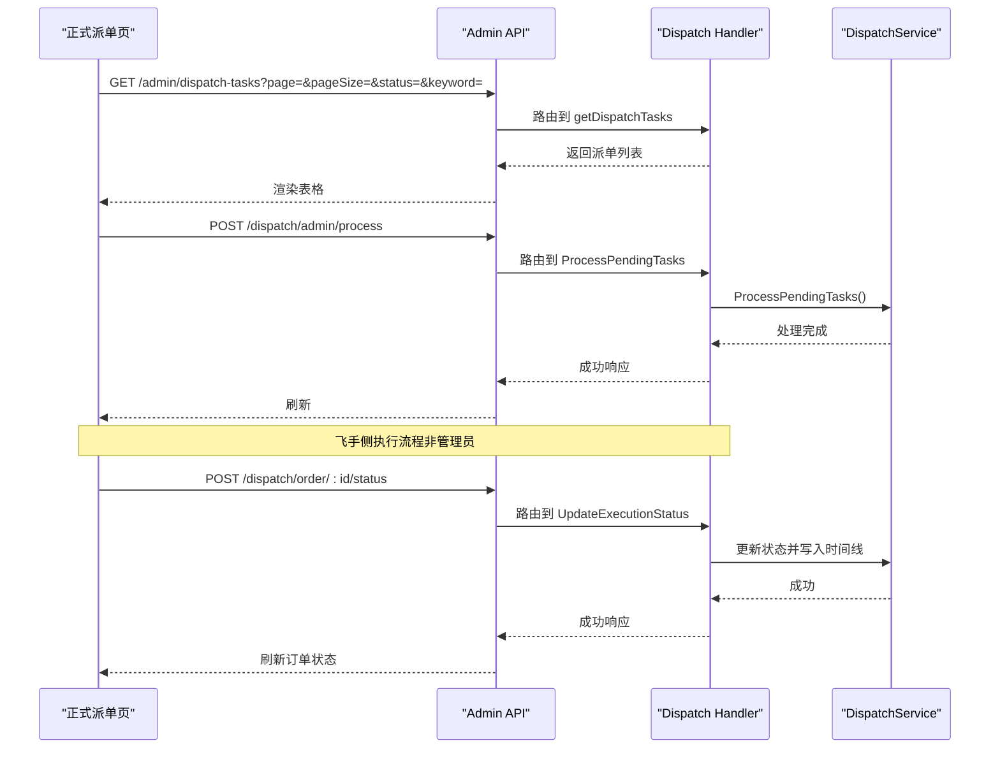
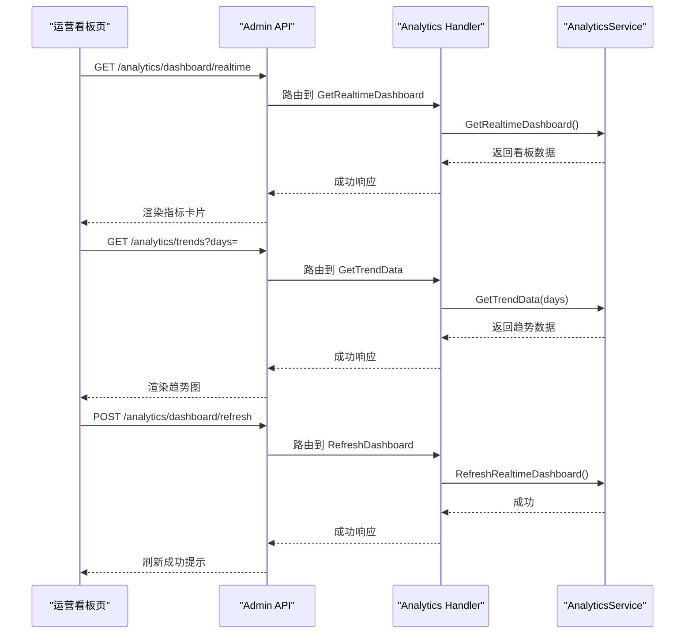
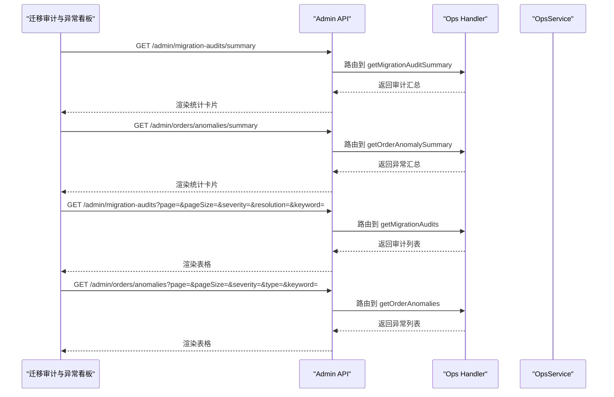
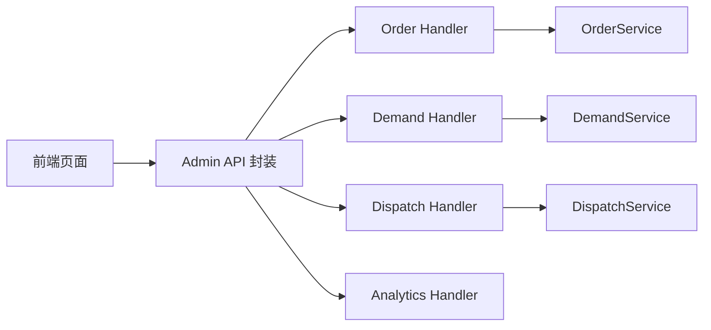

# 业务运营管理

<cite>
**本文引用的文件**
- [admin/src/pages/Dashboard/index.tsx](file://admin/src/pages/Dashboard/index.tsx)
- [admin/src/pages/Order/OrderList.tsx](file://admin/src/pages/Order/OrderList.tsx)
- [admin/src/pages/Demand/DemandList.tsx](file://admin/src/pages/Demand/DemandList.tsx)
- [admin/src/pages/Cargo/CargoDeclarationList.tsx](file://admin/src/pages/Cargo/CargoDeclarationList.tsx)
- [admin/src/pages/Dispatch/DispatchTaskList.tsx](file://admin/src/pages/Dispatch/DispatchTaskList.tsx)
- [admin/src/pages/Analytics/AnalyticsDashboard.tsx](file://admin/src/pages/Analytics/AnalyticsDashboard.tsx)
- [admin/src/pages/Operations/MigrationAuditBoard.tsx](file://admin/src/pages/Operations/MigrationAuditBoard.tsx)
- [admin/src/services/api.ts](file://admin/src/services/api.ts)
- [backend/internal/api/v1/order/handler.go](file://backend/internal/api/v1/order/handler.go)
- [backend/internal/api/v1/demand/handler.go](file://backend/internal/api/v1/demand/handler.go)
- [backend/internal/api/v1/dispatch/handler.go](file://backend/internal/api/v1/dispatch/handler.go)
- [backend/internal/api/v1/analytics/handler.go](file://backend/internal/api/v1/analytics/handler.go)
- [backend/internal/service/order_service.go](file://backend/internal/service/order_service.go)
- [backend/internal/service/demand_service.go](file://backend/internal/service/demand_service.go)
- [backend/internal/service/dispatch_service.go](file://backend/internal/service/dispatch_service.go)
</cite>

## 目录
1. [引言](#引言)
2. [项目结构](#项目结构)
3. [核心组件](#核心组件)
4. [架构总览](#架构总览)
5. [详细组件分析](#详细组件分析)
6. [依赖分析](#依赖分析)
7. [性能考虑](#性能考虑)
8. [故障排查指南](#故障排查指南)
9. [结论](#结论)
10. [附录](#附录)

## 引言
本文件面向业务运营管理者与技术维护人员，系统化梳理无人机租赁平台的业务运营管理能力，覆盖订单监控、需求管理、货物申报、派单任务等核心业务功能；解释业务流程监控、异常预警、数据统计分析机制；并提供业务指标看板、流程追踪、质量评估等运营工具的实现细节与使用指南，帮助制定业务规则配置、流程优化与效率提升策略。

## 项目结构
系统采用前后端分离架构：
- 前端管理后台（React + Ant Design）：负责运营看板、订单/需求/派单/货物等业务页面与交互。
- 后端服务（Go + Gin）：提供REST API，承载订单、需求、派单、分析等业务服务。

**图表来源**
- [admin/src/pages/Dashboard/index.tsx:1-211](file://admin/src/pages/Dashboard/index.tsx#L1-L211)
- [admin/src/pages/Order/OrderList.tsx:1-344](file://admin/src/pages/Order/OrderList.tsx#L1-L344)
- [admin/src/pages/Demand/DemandList.tsx:1-194](file://admin/src/pages/Demand/DemandList.tsx#L1-L194)
- [admin/src/pages/Cargo/CargoDeclarationList.tsx:1-339](file://admin/src/pages/Cargo/CargoDeclarationList.tsx#L1-L339)
- [admin/src/pages/Dispatch/DispatchTaskList.tsx:1-131](file://admin/src/pages/Dispatch/DispatchTaskList.tsx#L1-L131)
- [admin/src/pages/Analytics/AnalyticsDashboard.tsx:1-446](file://admin/src/pages/Analytics/AnalyticsDashboard.tsx#L1-L446)
- [admin/src/pages/Operations/MigrationAuditBoard.tsx:1-457](file://admin/src/pages/Operations/MigrationAuditBoard.tsx#L1-L457)
- [admin/src/services/api.ts:1-402](file://admin/src/services/api.ts#L1-L402)
- [backend/internal/api/v1/order/handler.go:1-155](file://backend/internal/api/v1/order/handler.go#L1-L155)
- [backend/internal/api/v1/demand/handler.go:1-383](file://backend/internal/api/v1/demand/handler.go#L1-L383)
- [backend/internal/api/v1/dispatch/handler.go:1-774](file://backend/internal/api/v1/dispatch/handler.go#L1-L774)
- [backend/internal/api/v1/analytics/handler.go:1-499](file://backend/internal/api/v1/analytics/handler.go#L1-L499)

**章节来源**
- [admin/src/pages/Dashboard/index.tsx:1-211](file://admin/src/pages/Dashboard/index.tsx#L1-L211)
- [admin/src/pages/Order/OrderList.tsx:1-344](file://admin/src/pages/Order/OrderList.tsx#L1-L344)
- [admin/src/pages/Demand/DemandList.tsx:1-194](file://admin/src/pages/Demand/DemandList.tsx#L1-L194)
- [admin/src/pages/Cargo/CargoDeclarationList.tsx:1-339](file://admin/src/pages/Cargo/CargoDeclarationList.tsx#L1-L339)
- [admin/src/pages/Dispatch/DispatchTaskList.tsx:1-131](file://admin/src/pages/Dispatch/DispatchTaskList.tsx#L1-L131)
- [admin/src/pages/Analytics/AnalyticsDashboard.tsx:1-446](file://admin/src/pages/Analytics/AnalyticsDashboard.tsx#L1-L446)
- [admin/src/pages/Operations/MigrationAuditBoard.tsx:1-457](file://admin/src/pages/Operations/MigrationAuditBoard.tsx#L1-L457)
- [admin/src/services/api.ts:1-402](file://admin/src/services/api.ts#L1-L402)
- [backend/internal/api/v1/order/handler.go:1-155](file://backend/internal/api/v1/order/handler.go#L1-L155)
- [backend/internal/api/v1/demand/handler.go:1-383](file://backend/internal/api/v1/demand/handler.go#L1-L383)
- [backend/internal/api/v1/dispatch/handler.go:1-774](file://backend/internal/api/v1/dispatch/handler.go#L1-L774)
- [backend/internal/api/v1/analytics/handler.go:1-499](file://backend/internal/api/v1/analytics/handler.go#L1-L499)

## 核心组件
- 订单管理：支持订单列表、状态筛选、详情查看、流程时间轴查询。
- 需求管理：支持需求列表、状态筛选、详情查看、匹配结果查看。
- 货物申报：支持待审列表、审核通过/拒绝、详情查看。
- 正式派单：支持派单任务列表、状态筛选、详情查看。
- 运营看板：支持实时指标、趋势图、区域排行、系统健康度。
- 迁移审计与异常：集中展示迁移审计问题与异常订单，支持筛选与详情查看。

**章节来源**
- [admin/src/pages/Order/OrderList.tsx:1-344](file://admin/src/pages/Order/OrderList.tsx#L1-L344)
- [admin/src/pages/Demand/DemandList.tsx:1-194](file://admin/src/pages/Demand/DemandList.tsx#L1-L194)
- [admin/src/pages/Cargo/CargoDeclarationList.tsx:1-339](file://admin/src/pages/Cargo/CargoDeclarationList.tsx#L1-L339)
- [admin/src/pages/Dispatch/DispatchTaskList.tsx:1-131](file://admin/src/pages/Dispatch/DispatchTaskList.tsx#L1-L131)
- [admin/src/pages/Analytics/AnalyticsDashboard.tsx:1-446](file://admin/src/pages/Analytics/AnalyticsDashboard.tsx#L1-L446)
- [admin/src/pages/Operations/MigrationAuditBoard.tsx:1-457](file://admin/src/pages/Operations/MigrationAuditBoard.tsx#L1-L457)

## 架构总览
前端通过统一的 Admin API 封装调用后端接口，后端按领域拆分服务层（Order/Demand/Dispatch/Analytics），每个领域包含 Handler（路由与参数解析）、Service（业务逻辑）与仓储（Repository）。

**图表来源**
- [admin/src/services/api.ts:144-382](file://admin/src/services/api.ts#L144-L382)
- [backend/internal/api/v1/order/handler.go:47-60](file://backend/internal/api/v1/order/handler.go#L47-L60)
- [backend/internal/service/order_service.go:721-792](file://backend/internal/service/order_service.go#L721-L792)

**章节来源**
- [admin/src/services/api.ts:144-382](file://admin/src/services/api.ts#L144-L382)
- [backend/internal/api/v1/order/handler.go:1-155](file://backend/internal/api/v1/order/handler.go#L1-L155)
- [backend/internal/service/order_service.go:1-800](file://backend/internal/service/order_service.go#L1-L800)

## 详细组件分析

### 订单监控与流程追踪
- 功能要点
  - 订单列表：支持按状态、类型、关键词筛选，展示订单关键字段与状态标签。
  - 订单详情：展示订单基础信息、费用信息、参与方信息、无人机信息、时间信息。
  - 流程时间轴：支持查询订单时间线，便于流程追踪与问题定位。
- 关键实现
  - 前端通过 Admin API 的订单接口获取数据与详情。
  - 后端 Handler 提供订单列表、详情、时间轴查询接口。
  - 业务 Service 实现订单状态流转与快照同步。

**图表来源**
- [admin/src/pages/Order/OrderList.tsx:94-121](file://admin/src/pages/Order/OrderList.tsx#L94-L121)
- [admin/src/services/api.ts:238-248](file://admin/src/services/api.ts#L238-L248)
- [backend/internal/api/v1/order/handler.go:47-60](file://backend/internal/api/v1/order/handler.go#L47-L60)
- [backend/internal/api/v1/order/handler.go:146-154](file://backend/internal/api/v1/order/handler.go#L146-L154)

**章节来源**
- [admin/src/pages/Order/OrderList.tsx:1-344](file://admin/src/pages/Order/OrderList.tsx#L1-L344)
- [admin/src/services/api.ts:238-248](file://admin/src/services/api.ts#L238-L248)
- [backend/internal/api/v1/order/handler.go:1-155](file://backend/internal/api/v1/order/handler.go#L1-L155)
- [backend/internal/service/order_service.go:721-792](file://backend/internal/service/order_service.go#L721-L792)

### 需求管理与报价匹配
- 功能要点
  - 需求列表：支持状态筛选、关键词搜索、查看详情。
  - 报价匹配：支持查看需求匹配结果（适用于货运/租赁）。
- 关键实现
  - 后端 Handler 提供需求 CRUD、报价匹配查询接口。
  - 服务层负责需求与供给的同步与匹配。

**图表来源**
- [admin/src/pages/Demand/DemandList.tsx:56-74](file://admin/src/pages/Demand/DemandList.tsx#L56-L74)
- [admin/src/services/api.ts:250-257](file://admin/src/services/api.ts#L250-L257)
- [backend/internal/api/v1/demand/handler.go:250-258](file://backend/internal/api/v1/demand/handler.go#L250-L258)
- [backend/internal/service/demand_service.go:1-343](file://backend/internal/service/demand_service.go#L1-L343)

**章节来源**
- [admin/src/pages/Demand/DemandList.tsx:1-194](file://admin/src/pages/Demand/DemandList.tsx#L1-L194)
- [admin/src/services/api.ts:250-257](file://admin/src/services/api.ts#L250-L257)
- [backend/internal/api/v1/demand/handler.go:1-383](file://backend/internal/api/v1/demand/handler.go#L1-L383)
- [backend/internal/service/demand_service.go:1-343](file://backend/internal/service/demand_service.go#L1-L343)

### 货物申报审核
- 功能要点
  - 待审列表：按合规状态筛选，支持详情查看、审核通过/拒绝。
  - 审核流程：通过/拒绝需记录备注，支持批量刷新与提醒。
- 关键实现
  - 前端通过 Admin API 的货物申报接口进行查询与操作。
  - 后端提供审核通过/拒绝接口。

**图表来源**
- [admin/src/pages/Cargo/CargoDeclarationList.tsx:63-82](file://admin/src/pages/Cargo/CargoDeclarationList.tsx#L63-L82)
- [admin/src/services/api.ts:225-237](file://admin/src/services/api.ts#L225-L237)
- [backend/internal/api/v1/analytics/handler.go:1-499](file://backend/internal/api/v1/analytics/handler.go#L1-L499)

**章节来源**
- [admin/src/pages/Cargo/CargoDeclarationList.tsx:1-339](file://admin/src/pages/Cargo/CargoDeclarationList.tsx#L1-L339)
- [admin/src/services/api.ts:225-237](file://admin/src/services/api.ts#L225-L237)

### 正式派单管理与执行流程
- 功能要点
  - 派单任务列表：支持状态筛选、关键词搜索、详情查看。
  - 飞手执行：支持获取我的活动订单、更新执行状态（如确认空域申请、装载/卸载、完成等）。
  - 管理员能力：手动触发匹配、处理待派单任务、处理过期任务。
- 关键实现
  - Handler 提供派单任务 CRUD、飞手接单/拒单、执行状态更新、管理员操作等接口。
  - Service 实现智能匹配、候选评分、正式派单创建与状态推进。

**图表来源**
- [admin/src/pages/Dispatch/DispatchTaskList.tsx:44-58](file://admin/src/pages/Dispatch/DispatchTaskList.tsx#L44-L58)
- [admin/src/services/api.ts:268-275](file://admin/src/services/api.ts#L268-L275)
- [backend/internal/api/v1/dispatch/handler.go:753-773](file://backend/internal/api/v1/dispatch/handler.go#L753-L773)
- [backend/internal/service/dispatch_service.go:632-779](file://backend/internal/service/dispatch_service.go#L632-L779)

**章节来源**
- [admin/src/pages/Dispatch/DispatchTaskList.tsx:1-131](file://admin/src/pages/Dispatch/DispatchTaskList.tsx#L1-L131)
- [admin/src/services/api.ts:268-275](file://admin/src/services/api.ts#L268-L275)
- [backend/internal/api/v1/dispatch/handler.go:1-774](file://backend/internal/api/v1/dispatch/handler.go#L1-L774)
- [backend/internal/service/dispatch_service.go:1-800](file://backend/internal/service/dispatch_service.go#L1-L800)

### 运营数据看板与趋势分析
- 功能要点
  - 实时看板：今日订单、收入、在线飞手、活跃告警、系统健康度等核心指标。
  - 趋势分析：订单趋势、收入趋势、用户增长趋势，支持切换时间维度。
  - 区域统计：热门区域 TOP5，支持刷新缓存。
- 关键实现
  - 后端提供实时看板、趋势、每日统计、区域统计、热力图等接口。
  - 前端聚合指标并可视化展示。

**图表来源**
- [admin/src/pages/Analytics/AnalyticsDashboard.tsx:103-135](file://admin/src/pages/Analytics/AnalyticsDashboard.tsx#L103-L135)
- [admin/src/services/api.ts:339-357](file://admin/src/services/api.ts#L339-L357)
- [backend/internal/api/v1/analytics/handler.go:24-50](file://backend/internal/api/v1/analytics/handler.go#L24-L50)

**章节来源**
- [admin/src/pages/Analytics/AnalyticsDashboard.tsx:1-446](file://admin/src/pages/Analytics/AnalyticsDashboard.tsx#L1-L446)
- [admin/src/services/api.ts:339-357](file://admin/src/services/api.ts#L339-L357)
- [backend/internal/api/v1/analytics/handler.go:1-499](file://backend/internal/api/v1/analytics/handler.go#L1-L499)

### 迁移审计与异常看板
- 功能要点
  - 迁移审计：集中展示迁移阶段的问题记录，支持按严重度、处理状态、关键词筛选。
  - 异常订单：集中展示异常订单，支持按严重度、异常类型、关键词筛选。
  - 统计概览：展示待处理审计、严重问题、异常订单总数、严重异常等。
- 关键实现
  - 前端通过 Admin API 获取审计与异常列表、汇总数据。
  - 提供刷新看板能力，便于运营人员及时掌握风险。

**图表来源**
- [admin/src/pages/Operations/MigrationAuditBoard.tsx:128-174](file://admin/src/pages/Operations/MigrationAuditBoard.tsx#L128-L174)
- [admin/src/services/api.ts:285-307](file://admin/src/services/api.ts#L285-L307)
- [backend/internal/api/v1/analytics/handler.go:1-499](file://backend/internal/api/v1/analytics/handler.go#L1-L499)

**章节来源**
- [admin/src/pages/Operations/MigrationAuditBoard.tsx:1-457](file://admin/src/pages/Operations/MigrationAuditBoard.tsx#L1-L457)
- [admin/src/services/api.ts:285-307](file://admin/src/services/api.ts#L285-L307)

## 依赖分析
- 前端依赖
  - Admin API 封装：统一管理后端接口、鉴权与错误处理。
  - Ant Design UI：提供表格、卡片、标签、模态框等组件。
- 后端依赖
  - Gin：HTTP 路由与中间件。
  - GORM：数据访问与事务。
  - Zap：日志。
  - 领域服务解耦：Handler 仅做参数解析与响应组装，业务逻辑集中在 Service。

**图表来源**
- [admin/src/services/api.ts:144-382](file://admin/src/services/api.ts#L144-L382)
- [backend/internal/api/v1/order/handler.go:1-155](file://backend/internal/api/v1/order/handler.go#L1-L155)
- [backend/internal/api/v1/demand/handler.go:1-383](file://backend/internal/api/v1/demand/handler.go#L1-L383)
- [backend/internal/api/v1/dispatch/handler.go:1-774](file://backend/internal/api/v1/dispatch/handler.go#L1-L774)
- [backend/internal/api/v1/analytics/handler.go:1-499](file://backend/internal/api/v1/analytics/handler.go#L1-L499)

**章节来源**
- [admin/src/services/api.ts:1-402](file://admin/src/services/api.ts#L1-L402)
- [backend/internal/api/v1/order/handler.go:1-155](file://backend/internal/api/v1/order/handler.go#L1-L155)
- [backend/internal/api/v1/demand/handler.go:1-383](file://backend/internal/api/v1/demand/handler.go#L1-L383)
- [backend/internal/api/v1/dispatch/handler.go:1-774](file://backend/internal/api/v1/dispatch/handler.go#L1-L774)
- [backend/internal/api/v1/analytics/handler.go:1-499](file://backend/internal/api/v1/analytics/handler.go#L1-L499)

## 性能考虑
- 前端
  - 表格分页与懒加载：控制每页数据量，减少一次性渲染压力。
  - 指标卡片与趋势图使用轻量渲染，避免频繁重绘。
- 后端
  - 仓储层使用事务包裹关键写操作，保证一致性。
  - 分析类接口支持缓存与定时刷新，降低实时计算压力。
  - 派单匹配采用分层半径与评分阈值，控制候选规模。

[本节为通用指导，无需特定文件引用]

## 故障排查指南
- 登录与鉴权
  - 若出现 401，检查本地存储的令牌是否有效，必要时重新登录。
- 订单异常
  - 使用订单时间轴接口定位状态变更节点，结合异常看板识别异常订单。
- 货物申报
  - 对于拒绝的申报，确认拒绝原因是否完整；通过待审列表快速定位。
- 派单问题
  - 查看派单任务详情与日志，确认匹配与通知环节是否正常。
  - 如需人工干预，使用管理员接口触发匹配或处理待派单任务。
- 看板刷新
  - 实时看板支持手动刷新缓存，若数据陈旧可主动触发刷新。

**章节来源**
- [admin/src/services/api.ts:74-136](file://admin/src/services/api.ts#L74-L136)
- [admin/src/pages/Order/OrderList.tsx:145-192](file://admin/src/pages/Order/OrderList.tsx#L145-L192)
- [admin/src/pages/Cargo/CargoDeclarationList.tsx:88-143](file://admin/src/pages/Cargo/CargoDeclarationList.tsx#L88-L143)
- [admin/src/pages/Dispatch/DispatchTaskList.tsx:44-58](file://admin/src/pages/Dispatch/DispatchTaskList.tsx#L44-L58)
- [admin/src/pages/Analytics/AnalyticsDashboard.tsx:124-135](file://admin/src/pages/Analytics/AnalyticsDashboard.tsx#L124-L135)

## 结论
本系统通过清晰的前后端职责划分与领域服务解耦，提供了覆盖订单、需求、派单、货物、分析与审计的全链路运营能力。运营看板与异常监控帮助管理者快速掌握业务健康度与风险点；流程追踪与时间轴为问题定位提供依据；派单智能匹配与执行流程保障了作业效率与质量。建议在日常运营中结合看板指标、异常告警与流程回溯，持续优化业务规则与流程设计。

[本节为总结性内容，无需特定文件引用]

## 附录
- 使用建议
  - 业务规则配置：通过系统配置接口调整派单匹配参数（半径、权重、阈值）以适配不同区域与业务场景。
  - 流程优化：基于异常看板与迁移审计，定期复盘流程瓶颈与数据不一致问题，推动流程标准化与自动化。
  - 效率提升：利用趋势分析与区域统计，识别高峰时段与高价值区域，动态调度资源与优化派单策略。
- 快速入口
  - 订单监控：订单列表页 + 订单时间轴
  - 需求与报价：需求列表页 + 匹配结果
  - 货物合规：货物申报审核页
  - 派单执行：正式派单管理页 + 飞手执行状态更新
  - 运营看板：运营数据看板页 + 区域统计
  - 风险管控：迁移审计与异常看板页

[本节为通用指导，无需特定文件引用]