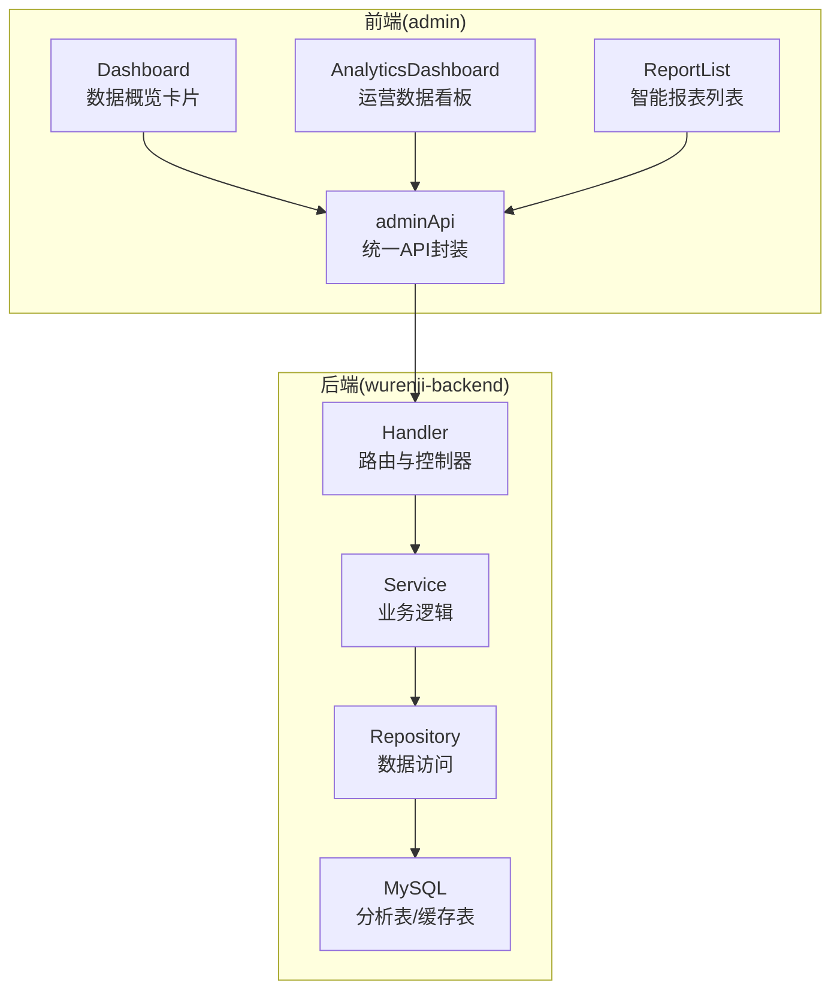
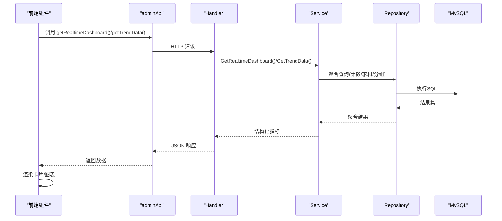
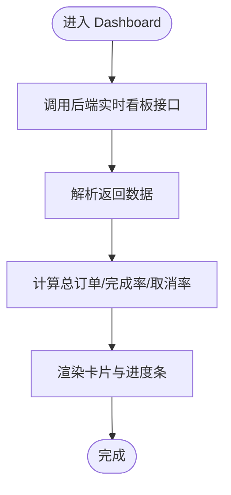
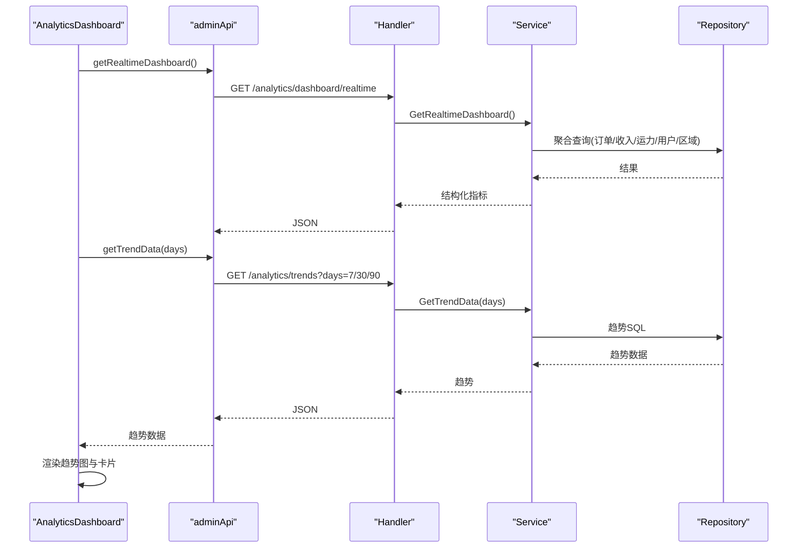
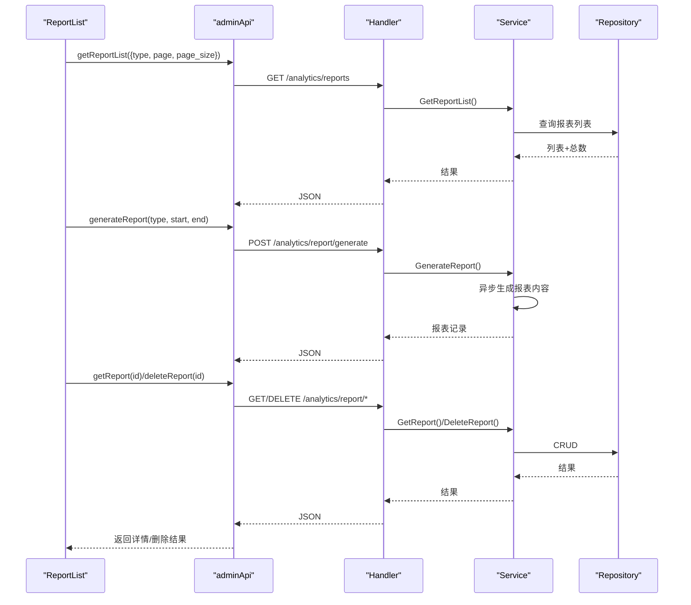
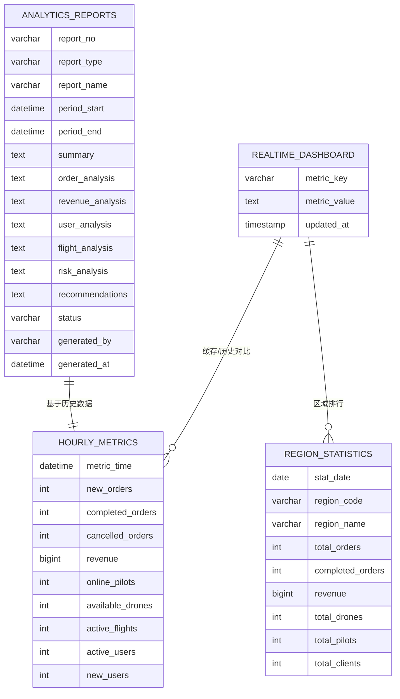
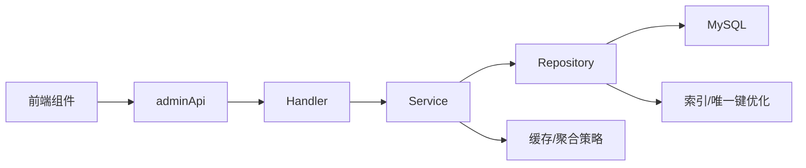

# 仪表板概览

<cite>
**本文档引用的文件**
- [admin/src/pages/Dashboard/index.tsx](file://admin/src/pages/Dashboard/index.tsx)
- [admin/src/pages/Analytics/AnalyticsDashboard.tsx](file://admin/src/pages/Analytics/AnalyticsDashboard.tsx)
- [admin/src/pages/Analytics/ReportList.tsx](file://admin/src/pages/Analytics/ReportList.tsx)
- [admin/src/services/api.ts](file://admin/src/services/api.ts)
- [backend/internal/api/v1/analytics/handler.go](file://backend/internal/api/v1/analytics/handler.go)
- [backend/internal/service/analytics_service.go](file://backend/internal/service/analytics_service.go)
- [backend/internal/repository/analytics_repo.go](file://backend/internal/repository/analytics_repo.go)
- [backend/migrations/014_add_analytics_tables.sql](file://backend/migrations/014_add_analytics_tables.sql)
</cite>

## 目录
1. [简介](#简介)
2. [项目结构](#项目结构)
3. [核心组件](#核心组件)
4. [架构总览](#架构总览)
5. [详细组件分析](#详细组件分析)
6. [依赖关系分析](#依赖关系分析)
7. [性能考虑](#性能考虑)
8. [故障排查指南](#故障排查指南)
9. [结论](#结论)
10. [附录](#附录)

## 简介
本文件面向管理后台“仪表板概览”系统，全面阐述数据仪表板的整体布局设计、关键指标展示、实时数据更新机制；详解 KPI 指标计算逻辑、数据聚合策略与图表组件集成；说明仪表板的数据来源、刷新机制与性能优化方案；并提供自定义指标配置、数据筛选、报表导出等高级特性实现指南。

## 项目结构
管理后台采用前端 React + 后端 Go Gin 的分层架构：
- 前端负责仪表板页面与交互（Dashboard、AnalyticsDashboard、ReportList），通过 adminApi 统一调用后端接口。
- 后端提供分析类 API（实时看板、趋势、报表等），由 Handler -> Service -> Repository 层实现，数据持久化于 MySQL。

**图表来源**
- [admin/src/pages/Dashboard/index.tsx:1-211](file://admin/src/pages/Dashboard/index.tsx#L1-L211)
- [admin/src/pages/Analytics/AnalyticsDashboard.tsx:1-446](file://admin/src/pages/Analytics/AnalyticsDashboard.tsx#L1-L446)
- [admin/src/pages/Analytics/ReportList.tsx:1-487](file://admin/src/pages/Analytics/ReportList.tsx#L1-L487)
- [admin/src/services/api.ts:339-382](file://admin/src/services/api.ts#L339-L382)
- [backend/internal/api/v1/analytics/handler.go:24-50](file://backend/internal/api/v1/analytics/handler.go#L24-L50)
- [backend/internal/service/analytics_service.go:90-158](file://backend/internal/service/analytics_service.go#L90-L158)
- [backend/internal/repository/analytics_repo.go:232-480](file://backend/internal/repository/analytics_repo.go#L232-L480)

**章节来源**
- [admin/src/pages/Dashboard/index.tsx:1-211](file://admin/src/pages/Dashboard/index.tsx#L1-L211)
- [admin/src/pages/Analytics/AnalyticsDashboard.tsx:1-446](file://admin/src/pages/Analytics/AnalyticsDashboard.tsx#L1-L446)
- [admin/src/pages/Analytics/ReportList.tsx:1-487](file://admin/src/pages/Analytics/ReportList.tsx#L1-L487)
- [admin/src/services/api.ts:339-382](file://admin/src/services/api.ts#L339-L382)
- [backend/internal/api/v1/analytics/handler.go:24-50](file://backend/internal/api/v1/analytics/handler.go#L24-L50)
- [backend/internal/service/analytics_service.go:90-158](file://backend/internal/service/analytics_service.go#L90-L158)
- [backend/internal/repository/analytics_repo.go:232-480](file://backend/internal/repository/analytics_repo.go#L232-L480)

## 核心组件
- 前端仪表板组件
  - 数据概览卡片：用户数、注册无人机、总订单、已完成订单、活跃/待处理订单、完成率/取消率、订单状态分布。
  - 运营数据看板：今日新订单/完成/取消、今日收入、在线飞手/可用无人机/飞行中、活跃告警、用户分布、热门区域 TOP5、数据趋势（订单/收入/用户增长）。
  - 报表列表：报表类型筛选、生成任务、查看详情、删除。
- 后端分析服务
  - 实时看板：今日订单、今日收入、在线运力、活跃用户、告警统计、区域统计、系统健康。
  - 趋势数据：订单/收入/用户增长 N 日趋势。
  - 报表生成：按日/周/月/季度/年报表生成与管理。
  - 缓存与聚合：实时看板指标缓存表、小时级指标表、区域统计表、报表表。

**章节来源**
- [admin/src/pages/Dashboard/index.tsx:15-208](file://admin/src/pages/Dashboard/index.tsx#L15-L208)
- [admin/src/pages/Analytics/AnalyticsDashboard.tsx:96-442](file://admin/src/pages/Analytics/AnalyticsDashboard.tsx#L96-L442)
- [admin/src/pages/Analytics/ReportList.tsx:108-486](file://admin/src/pages/Analytics/ReportList.tsx#L108-L486)
- [backend/internal/service/analytics_service.go:90-158](file://backend/internal/service/analytics_service.go#L90-L158)
- [backend/internal/service/analytics_service.go:201-228](file://backend/internal/service/analytics_service.go#L201-L228)

## 架构总览
前端通过 adminApi 调用后端分析接口，后端 Handler 将请求委派给 Service，Service 使用 Repository 执行 SQL 查询与聚合，最终返回给前端渲染。

**图表来源**
- [admin/src/services/api.ts:339-382](file://admin/src/services/api.ts#L339-L382)
- [backend/internal/api/v1/analytics/handler.go:24-71](file://backend/internal/api/v1/analytics/handler.go#L24-L71)
- [backend/internal/service/analytics_service.go:90-158](file://backend/internal/service/analytics_service.go#L90-L158)
- [backend/internal/repository/analytics_repo.go:232-480](file://backend/internal/repository/analytics_repo.go#L232-L480)

## 详细组件分析

### 数据概览卡片（Dashboard）
- 数据来源：后端实时看板接口返回的用户总量、无人机总量、订单统计。
- 指标计算：
  - 总订单 = 各状态计数之和
  - 已完成订单、活跃订单（进行中+已支付）、待处理订单（created）、已取消订单
  - 完成率 = 完成数/总订单×100%，取消率 = 取消数/总订单×100%
- 展示形式：Ant Design Statistic + Progress 圆形进度条 + 订单状态分布卡片网格。

**图表来源**
- [admin/src/pages/Dashboard/index.tsx:19-36](file://admin/src/pages/Dashboard/index.tsx#L19-L36)
- [admin/src/pages/Dashboard/index.tsx:55-205](file://admin/src/pages/Dashboard/index.tsx#L55-L205)

**章节来源**
- [admin/src/pages/Dashboard/index.tsx:15-208](file://admin/src/pages/Dashboard/index.tsx#L15-L208)

### 运营数据看板（AnalyticsDashboard）
- 数据来源：实时看板 + 趋势数据；支持按 7/30/90 天切换。
- 指标计算：
  - 订单完成率：今日完成订单/今日新订单×100%
  - 用户分布：飞手/机主/业主人数占比
  - 热门区域 TOP5：按订单数排序取前五
  - 趋势：订单/收入/用户增长柱状图，按最大值归一化高度
- 功能特性：手动刷新、系统健康状态标签、金额格式化（元/万元）。

**图表来源**
- [admin/src/pages/Analytics/AnalyticsDashboard.tsx:103-135](file://admin/src/pages/Analytics/AnalyticsDashboard.tsx#L103-L135)
- [admin/src/services/api.ts:339-353](file://admin/src/services/api.ts#L339-L353)
- [backend/internal/api/v1/analytics/handler.go:24-71](file://backend/internal/api/v1/analytics/handler.go#L24-L71)
- [backend/internal/service/analytics_service.go:201-228](file://backend/internal/service/analytics_service.go#L201-L228)
- [backend/internal/repository/analytics_repo.go:278-377](file://backend/internal/repository/analytics_repo.go#L278-L377)

**章节来源**
- [admin/src/pages/Analytics/AnalyticsDashboard.tsx:96-442](file://admin/src/pages/Analytics/AnalyticsDashboard.tsx#L96-L442)
- [backend/internal/api/v1/analytics/handler.go:24-71](file://backend/internal/api/v1/analytics/handler.go#L24-L71)
- [backend/internal/service/analytics_service.go:201-228](file://backend/internal/service/analytics_service.go#L201-L228)
- [backend/internal/repository/analytics_repo.go:278-377](file://backend/internal/repository/analytics_repo.go#L278-L377)

### 报表列表（ReportList）
- 数据来源：后端报表管理接口，支持按类型筛选、分页、生成报表。
- 功能：查看报表详情（含摘要与建议）、删除报表、快捷生成日报/周报/月报。
- 报表内容：概要、订单分析、收入分析、用户分析、飞行分析、风控分析、趋势分析、建议。

**图表来源**
- [admin/src/pages/Analytics/ReportList.tsx:125-192](file://admin/src/pages/Analytics/ReportList.tsx#L125-L192)
- [admin/src/services/api.ts:364-381](file://admin/src/services/api.ts#L364-L381)
- [backend/internal/api/v1/analytics/handler.go:176-276](file://backend/internal/api/v1/analytics/handler.go#L176-L276)
- [backend/internal/service/analytics_service.go:330-429](file://backend/internal/service/analytics_service.go#L330-L429)

**章节来源**
- [admin/src/pages/Analytics/ReportList.tsx:108-486](file://admin/src/pages/Analytics/ReportList.tsx#L108-L486)
- [backend/internal/api/v1/analytics/handler.go:176-276](file://backend/internal/api/v1/analytics/handler.go#L176-L276)
- [backend/internal/service/analytics_service.go:330-429](file://backend/internal/service/analytics_service.go#L330-L429)

### 数据模型与聚合策略
- 实时看板指标缓存表：用于存放今日订单、今日收入、在线运力、活跃用户、告警摘要、热门区域、系统健康等 JSON 内容，支持快速读取与刷新。
- 小时级指标表：每小时写入一次，包含订单、收入、运力、用户等指标，支撑短期趋势与实时监控。
- 区域统计表：按日期与区域维度统计订单与收入，支撑区域排行与热力图。
- 报表表：存储各类周期报表的 JSON 内容与分析结果，支持导出与复用。
- 聚合策略：
  - 今日订单：按创建/更新日期分组统计新单、完成、取消、进行中。
  - 今日收入：按结算日期统计已结算订单的最终金额与平台费用。
  - 在线运力：在线飞手、可用无人机、飞行中订单数。
  - 用户统计：总用户、飞手、机主、业主数量。
  - 区域统计：按城市分组统计订单数与收入。
  - 趋势：按自然日分组聚合，支持 N 日窗口。

**图表来源**
- [backend/migrations/014_add_analytics_tables.sql:6-234](file://backend/migrations/014_add_analytics_tables.sql#L6-L234)
- [backend/internal/repository/analytics_repo.go:232-480](file://backend/internal/repository/analytics_repo.go#L232-L480)

**章节来源**
- [backend/migrations/014_add_analytics_tables.sql:6-234](file://backend/migrations/014_add_analytics_tables.sql#L6-L234)
- [backend/internal/repository/analytics_repo.go:232-480](file://backend/internal/repository/analytics_repo.go#L232-L480)

## 依赖关系分析
- 前端依赖 adminApi 提供的统一接口，避免硬编码 URL，便于切换环境与版本。
- 后端 Handler 仅负责路由与参数校验，业务逻辑集中在 Service，数据访问集中在 Repository，职责清晰。
- Repository 通过原生 SQL 与 GORM Raw 查询实现高效聚合，减少 ORM 层开销。
- 数据库层面通过索引与唯一键优化高频查询（如按日期、区域、时间窗口）。

**图表来源**
- [admin/src/services/api.ts:339-382](file://admin/src/services/api.ts#L339-L382)
- [backend/internal/api/v1/analytics/handler.go:24-71](file://backend/internal/api/v1/analytics/handler.go#L24-L71)
- [backend/internal/service/analytics_service.go:90-158](file://backend/internal/service/analytics_service.go#L90-L158)
- [backend/internal/repository/analytics_repo.go:232-480](file://backend/internal/repository/analytics_repo.go#L232-L480)

**章节来源**
- [admin/src/services/api.ts:339-382](file://admin/src/services/api.ts#L339-L382)
- [backend/internal/api/v1/analytics/handler.go:24-71](file://backend/internal/api/v1/analytics/handler.go#L24-L71)
- [backend/internal/service/analytics_service.go:90-158](file://backend/internal/service/analytics_service.go#L90-L158)
- [backend/internal/repository/analytics_repo.go:232-480](file://backend/internal/repository/analytics_repo.go#L232-L480)

## 性能考虑
- 前端
  - 使用并发请求获取实时看板与趋势数据，避免阻塞渲染。
  - 图表渲染采用归一化高度与过渡动画，提升交互体验。
  - 金额格式化与百分比显示减少前端计算负担。
- 后端
  - Repository 使用原生 SQL 与 GORM Raw Rows，降低 ORM 反射成本。
  - 按日期/区域/时间窗口分组查询，配合索引提升查询效率。
  - 实时看板指标缓存表减少复杂聚合查询压力。
- 数据库
  - 关键字段建立索引（日期、区域编码、时间戳等）。
  - 使用唯一键约束避免重复写入（小时指标、区域统计、实时缓存）。

[本节为通用性能指导，无需特定文件引用]

## 故障排查指南
- 前端
  - 若数据加载失败：检查 adminApi 的响应拦截器与错误提示，确认网络与鉴权状态。
  - 刷新失败：检查刷新按钮的 loading 状态与消息反馈。
- 后端
  - 接口返回错误：查看 Handler 的错误码与日志，定位 Service/Repository 层问题。
  - 聚合查询异常：核对 SQL 与表结构，确保日期格式与分组字段正确。
- 数据库
  - 缓存表缺失：确认迁移脚本已执行，初始化数据是否存在。
  - 索引缺失：根据查询条件补充索引，避免全表扫描。

**章节来源**
- [admin/src/pages/Analytics/AnalyticsDashboard.tsx:124-135](file://admin/src/pages/Analytics/AnalyticsDashboard.tsx#L124-L135)
- [admin/src/services/api.ts:66-137](file://admin/src/services/api.ts#L66-L137)
- [backend/internal/api/v1/analytics/handler.go:24-71](file://backend/internal/api/v1/analytics/handler.go#L24-L71)
- [backend/migrations/014_add_analytics_tables.sql:196-206](file://backend/migrations/014_add_analytics_tables.sql#L196-L206)

## 结论
本仪表板概览系统通过前后端清晰分层与数据库高效聚合，实现了多维度关键指标的实时展示与趋势分析。通过缓存与索引优化，保障了在高并发场景下的稳定性与性能。结合报表生成功能，进一步完善了管理后台的数据驱动决策能力。

[本节为总结性内容，无需特定文件引用]

## 附录

### 关键指标与计算公式
- 订单完成率：今日完成订单 / 今日新订单 × 100%
- 订单取消率：今日取消订单 / 今日新订单 × 100%
- 活跃订单：进行中 + 已支付
- 热门区域 TOP5：按订单数降序取前五

**章节来源**
- [admin/src/pages/Dashboard/index.tsx:35-36](file://admin/src/pages/Dashboard/index.tsx#L35-L36)
- [admin/src/pages/Analytics/AnalyticsDashboard.tsx:267-282](file://admin/src/pages/Analytics/AnalyticsDashboard.tsx#L267-L282)

### 数据来源与刷新机制
- 数据来源：实时看板接口返回当日聚合指标；趋势接口返回 N 日聚合数据。
- 刷新机制：后端提供刷新接口，Service 将聚合结果写入缓存表；前端支持手动刷新与自动轮询（可扩展）。

**章节来源**
- [admin/src/services/api.ts:339-342](file://admin/src/services/api.ts#L339-L342)
- [backend/internal/api/v1/analytics/handler.go:38-50](file://backend/internal/api/v1/analytics/handler.go#L38-L50)
- [backend/internal/service/analytics_service.go:160-190](file://backend/internal/service/analytics_service.go#L160-L190)

### 高级特性实现指南
- 自定义指标配置：在 Service 中扩展聚合方法，在 Handler 中新增路由与参数校验，在前端新增卡片与图表组件。
- 数据筛选：在 Repository 中增加 WHERE 条件与参数化查询，前端通过筛选器传递参数。
- 报表导出：在报表生成流程中增加导出文件字段，前端提供下载链接与进度反馈。

**章节来源**
- [backend/internal/service/analytics_service.go:330-429](file://backend/internal/service/analytics_service.go#L330-L429)
- [backend/internal/api/v1/analytics/handler.go:176-212](file://backend/internal/api/v1/analytics/handler.go#L176-L212)
- [admin/src/pages/Analytics/ReportList.tsx:170-192](file://admin/src/pages/Analytics/ReportList.tsx#L170-L192)