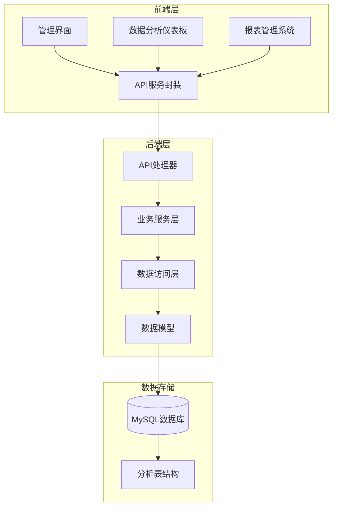
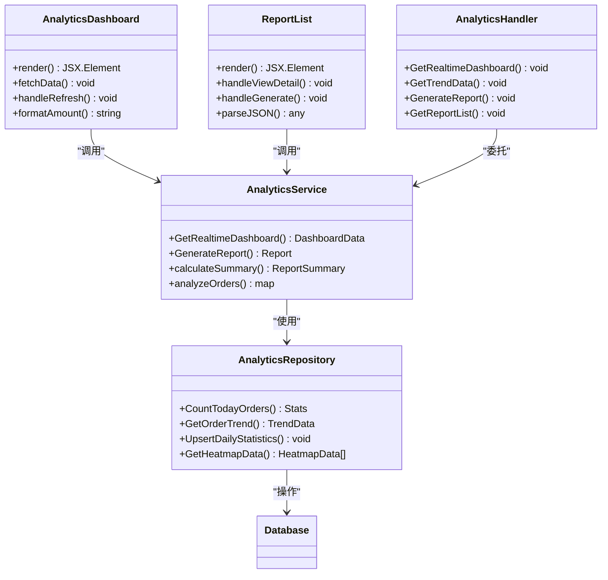
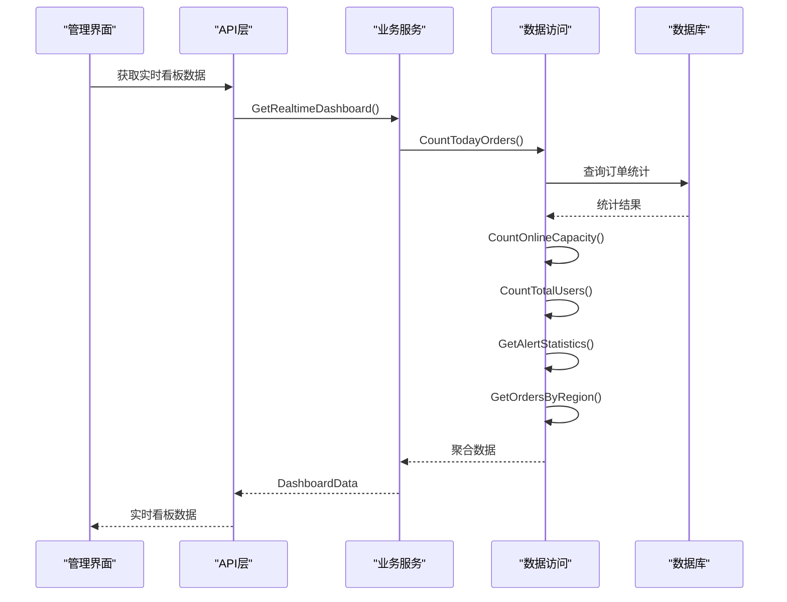
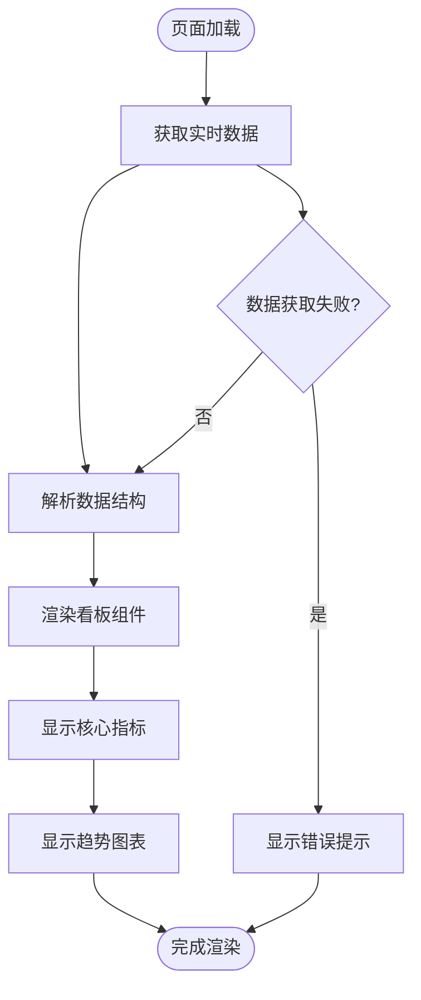
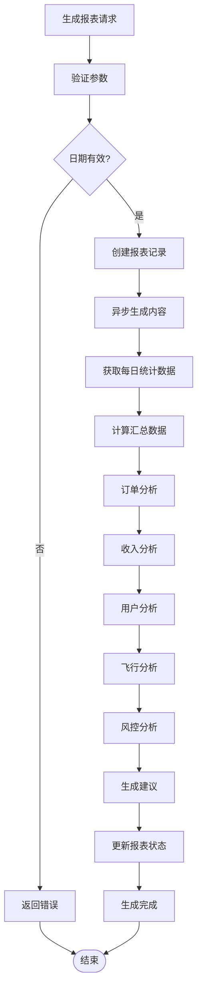
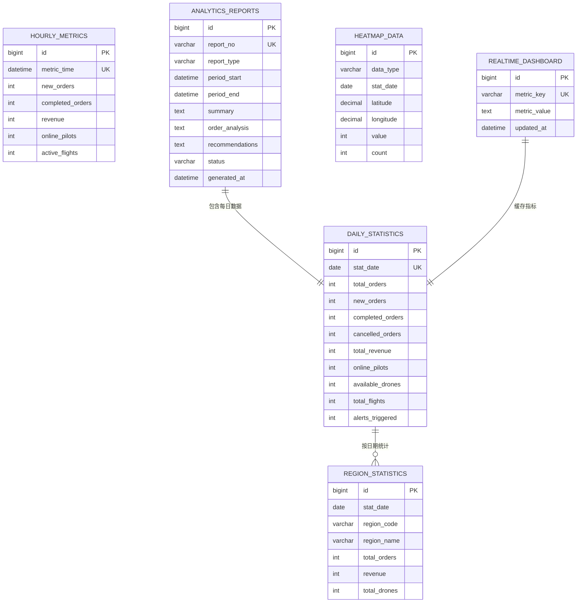
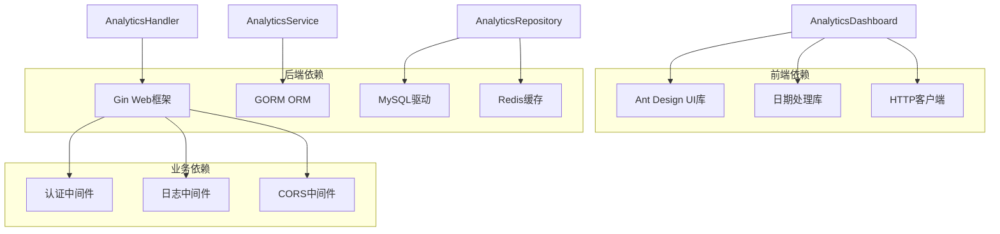
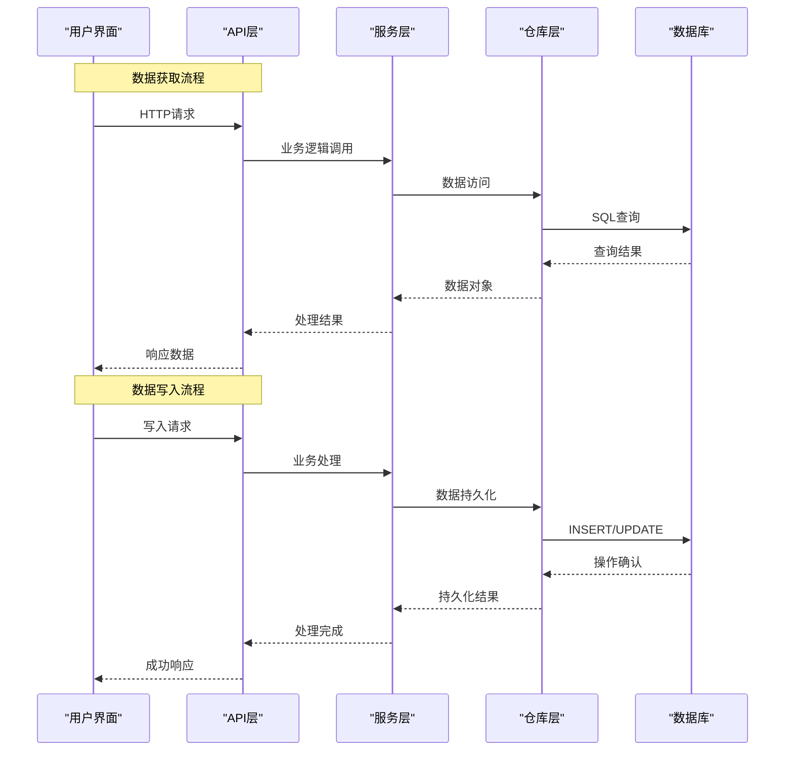

# 数据分析模块

<cite>
**本文档引用的文件**
- [AnalyticsDashboard.tsx](file://admin/src/pages/Analytics/AnalyticsDashboard.tsx)
- [ReportList.tsx](file://admin/src/pages/Analytics/ReportList.tsx)
- [handler.go](file://backend/internal/api/v1/analytics/handler.go)
- [analytics_service.go](file://backend/internal/service/analytics_service.go)
- [analytics_repo.go](file://backend/internal/repository/analytics_repo.go)
- [models.go](file://backend/internal/model/models.go)
- [api.ts](file://admin/src/services/api.ts)
- [014_add_analytics_tables.sql](file://backend/migrations/014_add_analytics_tables.sql)
- [router.go](file://backend/internal/api/v1/router.go)
- [main.go](file://backend/cmd/server/main.go)
</cite>

## 目录
1. [项目概述](#项目概述)
2. [项目结构](#项目结构)
3. [核心组件](#核心组件)
4. [架构概览](#架构概览)
5. [详细组件分析](#详细组件分析)
6. [依赖关系分析](#依赖关系分析)
7. [性能考虑](#性能考虑)
8. [故障排除指南](#故障排除指南)
9. [结论](#结论)

## 项目概述

数据分析模块是无人机租赁平台的核心决策支持系统，提供实时运营监控、趋势分析、报表生成和智能洞察功能。该模块通过整合平台的业务数据，为管理层提供全面的数据驱动决策支持。

### 主要功能特性

- **实时运营看板**：展示关键业务指标和实时数据
- **多维度分析**：订单、收入、用户、飞行等多维度统计
- **智能报表生成**：支持日报、周报、月报等自动化报表
- **趋势预测**：基于历史数据的趋势分析和预测
- **异常检测**：自动识别业务异常和风险信号
- **数据可视化**：丰富的图表和仪表板界面

## 项目结构

数据分析模块采用前后端分离架构，分为前端管理界面和后端数据处理服务两大部分：

**图表来源**
- [AnalyticsDashboard.tsx:1-446](file://admin/src/pages/Analytics/AnalyticsDashboard.tsx#L1-L446)
- [handler.go:1-499](file://backend/internal/api/v1/analytics/handler.go#L1-L499)
- [analytics_service.go:1-783](file://backend/internal/service/analytics_service.go#L1-L783)

**章节来源**
- [AnalyticsDashboard.tsx:1-446](file://admin/src/pages/Analytics/AnalyticsDashboard.tsx#L1-L446)
- [ReportList.tsx:1-487](file://admin/src/pages/Analytics/ReportList.tsx#L1-L487)
- [handler.go:1-499](file://backend/internal/api/v1/analytics/handler.go#L1-L499)

## 核心组件

### 前端组件

#### 数据分析仪表板
- **实时看板**：展示今日订单、收入、在线运力等核心指标
- **趋势图表**：订单趋势、收入趋势、用户增长趋势可视化
- **区域分析**：热门区域TOP5展示
- **系统健康**：系统状态监控和告警显示

#### 报表管理系统
- **报表生成**：支持多种报表类型的自动生成
- **报表列表**：报表历史管理和筛选
- **报表详情**：详细的分析结果和建议
- **导出功能**：支持PDF、Excel等格式导出

### 后端组件

#### API处理器
- **实时数据接口**：看板数据、趋势数据获取
- **报表管理接口**：报表生成、查询、删除
- **统计分析接口**：每日统计、区域统计、热力图数据

#### 业务服务层
- **数据聚合**：复杂业务指标的计算和聚合
- **报表生成**：智能报表的内容生成和分析
- **定时任务**：自动化的数据统计和报表生成

#### 数据访问层
- **数据库操作**：各类分析表的CRUD操作
- **聚合查询**：复杂的SQL聚合查询实现
- **缓存管理**：实时看板数据的缓存机制

**章节来源**
- [analytics_service.go:90-190](file://backend/internal/service/analytics_service.go#L90-L190)
- [analytics_repo.go:232-481](file://backend/internal/repository/analytics_repo.go#L232-L481)

## 架构概览

数据分析模块采用经典的三层架构设计，确保了良好的可维护性和扩展性：

**图表来源**
- [AnalyticsDashboard.tsx:96-135](file://admin/src/pages/Analytics/AnalyticsDashboard.tsx#L96-L135)
- [ReportList.tsx:108-192](file://admin/src/pages/Analytics/ReportList.tsx#L108-L192)
- [handler.go:24-50](file://backend/internal/api/v1/analytics/handler.go#L24-L50)
- [analytics_service.go:90-190](file://backend/internal/service/analytics_service.go#L90-L190)

### 数据流架构

**图表来源**
- [handler.go:24-50](file://backend/internal/api/v1/analytics/handler.go#L24-L50)
- [analytics_service.go:90-158](file://backend/internal/service/analytics_service.go#L90-L158)
- [analytics_repo.go:232-414](file://backend/internal/repository/analytics_repo.go#L232-L414)

## 详细组件分析

### 实时看板组件

实时看板是数据分析模块的核心界面，提供业务运营的全景视图：

#### 核心指标展示
- **今日订单指标**：新订单、完成订单、取消订单、进行中订单
- **收入指标**：总收入、平台费用、飞手收入、机主收入
- **运力指标**：在线飞手、可用无人机、飞行中订单
- **用户指标**：活跃用户分布、新增用户统计
- **告警指标**：活跃告警、今日解决、严重告警

#### 趋势分析组件
- **订单趋势**：7/30/90天订单量变化
- **收入趋势**：7/30/90天收入变化
- **用户增长**：7/30/90天新增用户趋势
- **可视化设计**：柱状图、折线图等多种图表形式

**图表来源**
- [AnalyticsDashboard.tsx:103-122](file://admin/src/pages/Analytics/AnalyticsDashboard.tsx#L103-L122)

**章节来源**
- [AnalyticsDashboard.tsx:206-440](file://admin/src/pages/Analytics/AnalyticsDashboard.tsx#L206-L440)

### 报表管理系统

报表管理系统提供完整的报表生命周期管理：

#### 报表类型支持
- **日报**：每日运营总结
- **周报**：每周业务回顾
- **月报**：月度经营分析
- **季报**：季度战略评估
- **年报**：年度总结报告
- **自定义报表**：按需定制的时间段分析

#### 报表内容分析
- **概要分析**：关键指标汇总
- **订单分析**：订单量、完成率、取消率
- **收入分析**：收入构成、增长趋势
- **用户分析**：用户增长、活跃度
- **飞行分析**：飞行次数、距离、时长
- **风控分析**：告警、违规、理赔统计
- **趋势分析**：环比、同比分析
- **智能建议**：基于数据的业务建议

**图表来源**
- [analytics_service.go:331-429](file://backend/internal/service/analytics_service.go#L331-L429)

**章节来源**
- [ReportList.tsx:108-482](file://admin/src/pages/Analytics/ReportList.tsx#L108-L482)
- [analytics_service.go:330-655](file://backend/internal/service/analytics_service.go#L330-L655)

### 数据模型设计

数据分析模块采用规范化的数据模型设计，确保数据的一致性和完整性：

#### 核心数据表结构

| 表名 | 描述 | 主要字段 |
|------|------|----------|
| daily_statistics | 每日统计数据 | stat_date, total_orders, total_revenue, online_pilots等 |
| hourly_metrics | 小时级指标 | metric_time, new_orders, revenue, active_flights等 |
| region_statistics | 区域统计 | stat_date, region_code, total_orders, revenue等 |
| analytics_reports | 分析报表 | report_no, report_type, period_start/end, status等 |
| heatmap_data | 热力图数据 | data_type, stat_date, latitude, longitude, value等 |
| realtime_dashboard | 实时看板缓存 | metric_key, metric_value, updated_at等 |

#### 数据关系图

**图表来源**
- [014_add_analytics_tables.sql:6-234](file://backend/migrations/014_add_analytics_tables.sql#L6-L234)
- [models.go:2509-2700](file://backend/internal/model/models.go#L2509-L2700)

**章节来源**
- [014_add_analytics_tables.sql:1-234](file://backend/migrations/014_add_analytics_tables.sql#L1-L234)
- [models.go:2509-2700](file://backend/internal/model/models.go#L2509-L2700)

### API接口设计

数据分析模块提供RESTful API接口，支持完整的数据分析功能：

#### 实时看板接口
- `GET /api/v1/analytics/dashboard/realtime` - 获取实时看板数据
- `POST /api/v1/analytics/dashboard/refresh` - 刷新看板缓存
- `GET /api/v1/analytics/overview` - 获取数据概览

#### 趋势分析接口
- `GET /api/v1/analytics/trends?days=N` - 获取趋势数据
- `GET /api/v1/analytics/hourly?hours=N` - 获取小时指标

#### 统计分析接口
- `GET /api/v1/analytics/daily?date=YYYY-MM-DD` - 获取每日统计
- `GET /api/v1/analytics/daily/range?start=&end=` - 获取日期范围统计
- `GET /api/v1/analytics/regions?date=YYYY-MM-DD` - 获取区域统计
- `GET /api/v1/analytics/regions/top?date=YYYY-MM-DD&limit=N` - 获取TOP区域

#### 报表管理接口
- `GET /api/v1/analytics/reports` - 获取报表列表
- `GET /api/v1/analytics/report/:id` - 获取报表详情
- `POST /api/v1/analytics/report/generate` - 生成报表
- `DELETE /api/v1/analytics/report/:id` - 删除报表

**章节来源**
- [handler.go:24-499](file://backend/internal/api/v1/analytics/handler.go#L24-L499)
- [router.go:558-596](file://backend/internal/api/v1/router.go#L558-L596)

## 依赖关系分析

数据分析模块的依赖关系清晰明确，遵循分层架构原则：

**图表来源**
- [AnalyticsDashboard.tsx:1-12](file://admin/src/pages/Analytics/AnalyticsDashboard.tsx#L1-L12)
- [api.ts:1-402](file://admin/src/services/api.ts#L1-L402)
- [main.go:1-390](file://backend/cmd/server/main.go#L1-L390)

### 数据流依赖

**图表来源**
- [analytics_repo.go:36-43](file://backend/internal/repository/analytics_repo.go#L36-L43)
- [analytics_service.go:243-312](file://backend/internal/service/analytics_service.go#L243-L312)

**章节来源**
- [main.go:132-204](file://backend/cmd/server/main.go#L132-L204)
- [router.go:58-59](file://backend/internal/api/v1/router.go#L58-L59)

## 性能考虑

数据分析模块在设计时充分考虑了性能优化：

### 缓存策略
- **实时看板缓存**：使用Redis缓存核心指标，减少数据库查询压力
- **热点数据缓存**：对频繁访问的报表数据进行缓存
- **查询结果缓存**：对复杂聚合查询结果进行缓存

### 数据库优化
- **索引优化**：为常用查询字段建立合适索引
- **分区表**：按时间分区存储历史数据
- **读写分离**：将读操作和写操作分离到不同数据库实例

### 异步处理
- **报表生成**：使用goroutine异步生成报表，避免阻塞主线程
- **定时任务**：通过定时任务批量处理统计数据
- **数据同步**：异步同步实时数据到分析表

### 前端优化
- **懒加载**：图表组件按需加载
- **虚拟滚动**：大数据量表格使用虚拟滚动
- **防抖节流**：输入框和搜索功能使用防抖节流

## 故障排除指南

### 常见问题及解决方案

#### 数据显示异常
1. **症状**：看板数据显示为空或错误
2. **原因**：数据缓存失效或数据库连接问题
3. **解决方案**：
   - 检查Redis连接状态
   - 验证数据库连接配置
   - 手动刷新看板数据

#### 报表生成失败
1. **症状**：报表状态长时间为"生成中"
2. **原因**：后台任务队列阻塞或数据库连接异常
3. **解决方案**：
   - 检查后台任务进程状态
   - 验证数据库连接池配置
   - 查看任务队列积压情况

#### API请求超时
1. **症状**：前端请求超时或响应缓慢
2. **原因**：数据库查询性能问题或网络延迟
3. **解决方案**：
   - 优化慢查询SQL
   - 增加数据库索引
   - 调整API超时配置

### 调试工具和方法

#### 后端调试
- **日志分析**：查看Gin框架日志和业务日志
- **数据库监控**：监控慢查询和连接数
- **性能分析**：使用pprof分析CPU和内存使用

#### 前端调试
- **网络面板**：检查API请求和响应
- **控制台日志**：查看JavaScript错误和警告
- **性能面板**：分析页面渲染性能

**章节来源**
- [api.ts:65-137](file://admin/src/services/api.ts#L65-L137)
- [analytics_service.go:740-782](file://backend/internal/service/analytics_service.go#L740-L782)

## 结论

数据分析模块通过精心设计的架构和完善的实现，为无人机租赁平台提供了强大的数据驱动能力。模块具有以下优势：

### 技术优势
- **架构清晰**：采用分层架构，职责分离明确
- **扩展性强**：支持多种报表类型和分析维度
- **性能优秀**：通过缓存和优化确保响应速度
- **可靠性高**：完善的错误处理和监控机制

### 业务价值
- **决策支持**：提供实时的业务洞察和趋势分析
- **运营优化**：帮助识别业务瓶颈和优化机会
- **风险控制**：及时发现异常和潜在风险
- **效率提升**：自动化报表生成减少人工工作量

### 发展前景
随着业务的发展，数据分析模块还可以进一步扩展：
- **机器学习集成**：引入预测分析和智能推荐
- **实时流处理**：支持实时数据流分析
- **多维分析**：支持更复杂的交叉分析和钻取
- **移动端支持**：提供移动端的数据分析功能

通过持续的优化和扩展，数据分析模块将成为平台最重要的决策支持系统，为业务发展提供强有力的数据保障。