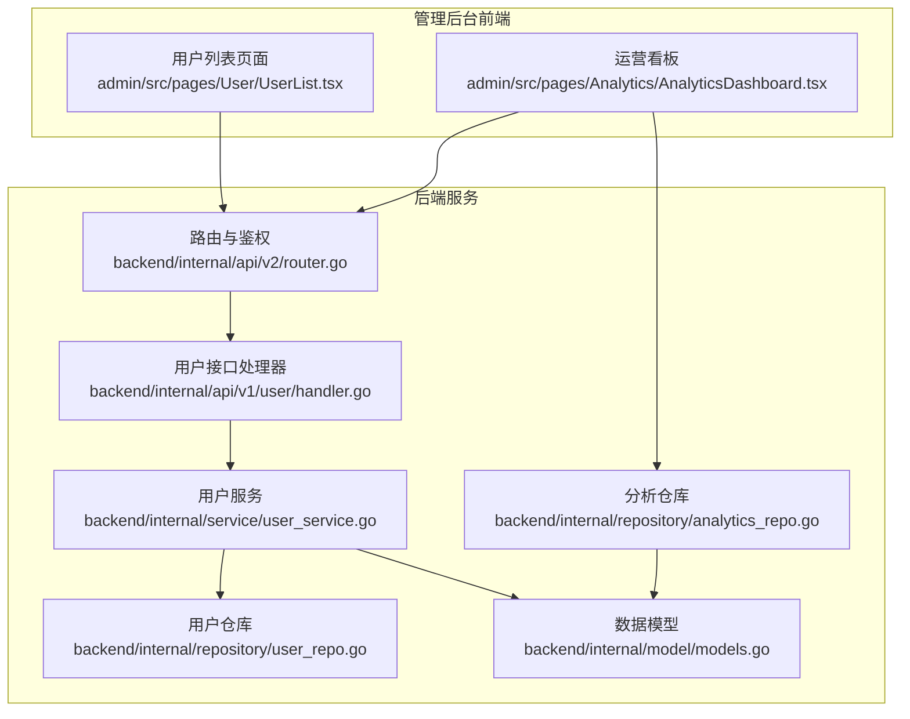
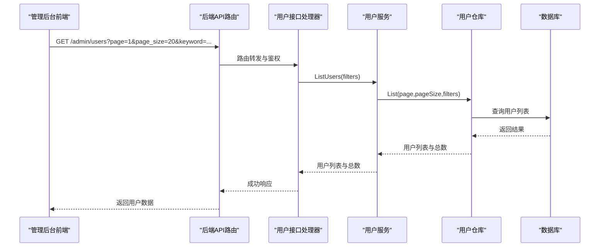
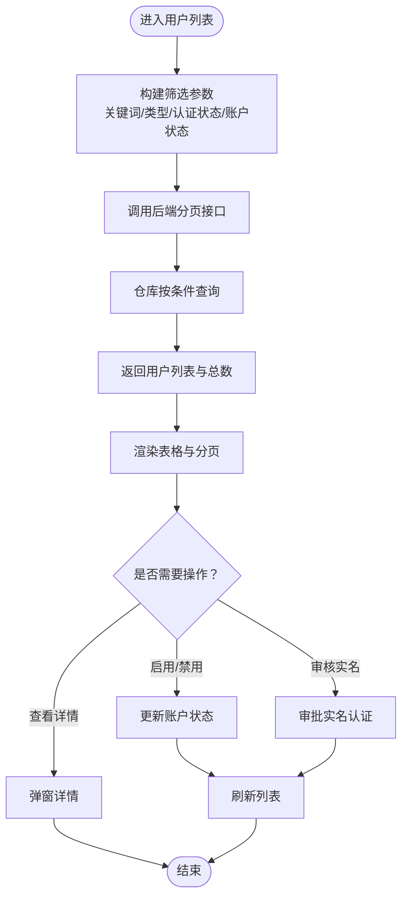
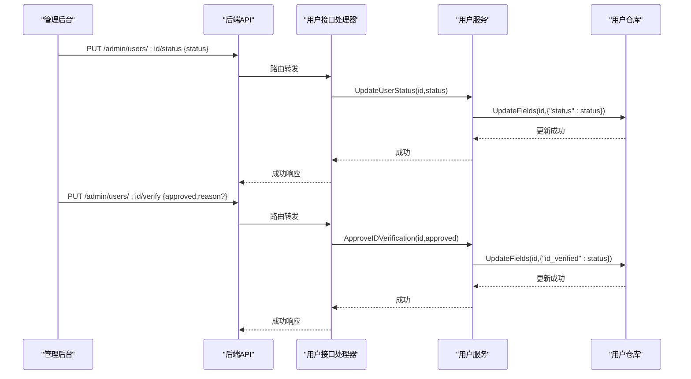
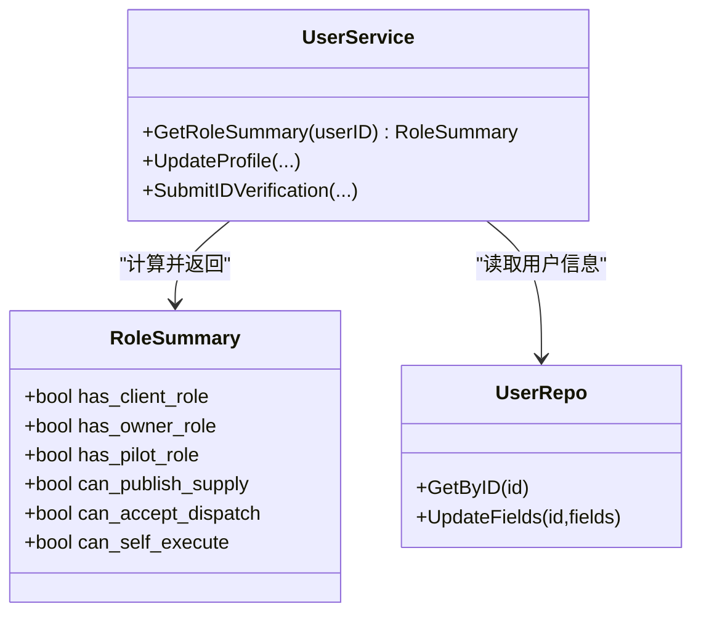
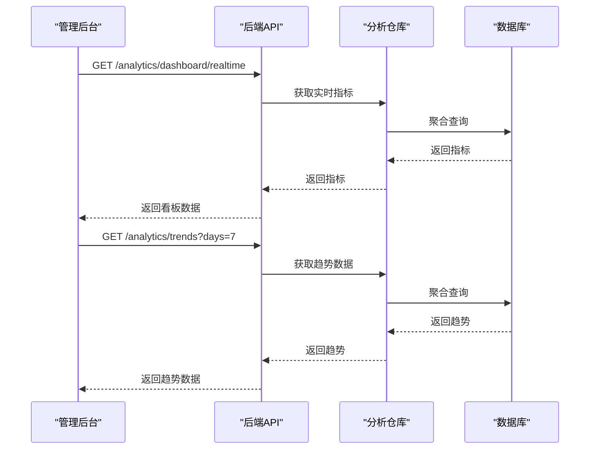
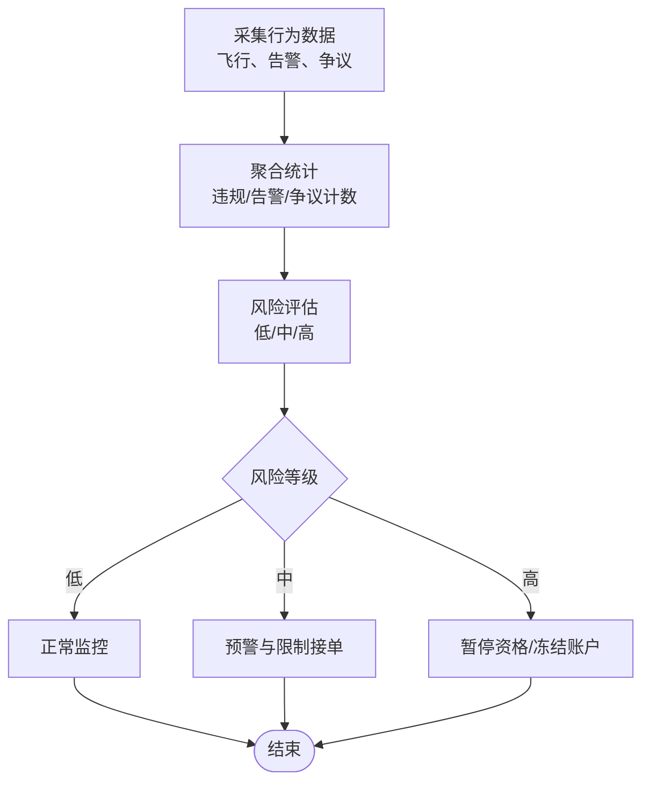
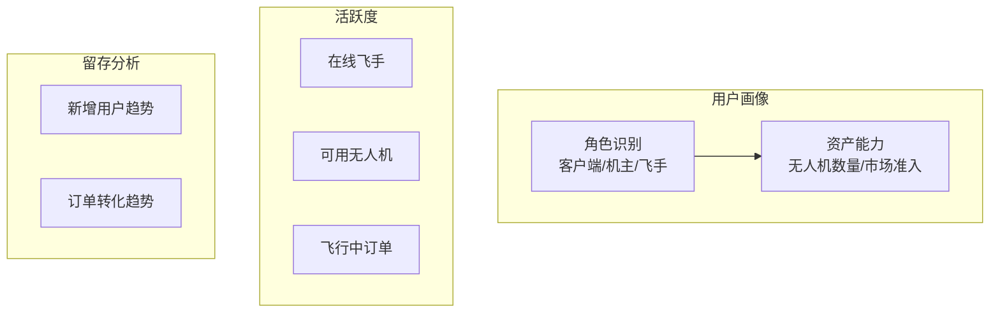
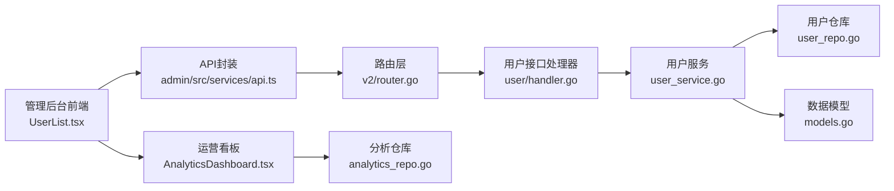

# 用户管理

<cite>
**本文档引用的文件**
- [admin/src/pages/User/UserList.tsx](file://admin/src/pages/User/UserList.tsx)
- [admin/src/services/api.ts](file://admin/src/services/api.ts)
- [backend/internal/api/v1/user/handler.go](file://backend/internal/api/v1/user/handler.go)
- [backend/internal/api/v2/router.go](file://backend/internal/api/v2/router.go)
- [backend/internal/service/user_service.go](file://backend/internal/service/user_service.go)
- [backend/internal/repository/user_repo.go](file://backend/internal/repository/user_repo.go)
- [backend/internal/model/models.go](file://backend/internal/model/models.go)
- [admin/src/pages/Analytics/AnalyticsDashboard.tsx](file://admin/src/pages/Analytics/AnalyticsDashboard.tsx)
- [backend/internal/repository/analytics_repo.go](file://backend/internal/repository/analytics_repo.go)
- [backend/internal/service/analytics_service.go](file://backend/internal/service/analytics_service.go)
</cite>

## 目录
1. [简介](#简介)
2. [项目结构](#项目结构)
3. [核心组件](#核心组件)
4. [架构总览](#架构总览)
5. [详细组件分析](#详细组件分析)
6. [依赖关系分析](#依赖关系分析)
7. [性能考虑](#性能考虑)
8. [故障排查指南](#故障排查指南)
9. [结论](#结论)
10. [附录](#附录)

## 简介
本文件面向“用户管理系统”的设计与实现，覆盖用户信息管理、角色权限控制、账户状态管理、不同用户类型的管理界面、批量操作能力、数据导入导出机制、用户行为监控、风险评估与违规处理、用户画像分析、活跃度统计与留存分析等运营功能。文档以代码为依据，结合前端管理后台与后端服务的交互，提供可操作的使用指南与最佳实践。

## 项目结构
用户管理功能由三部分组成：
- 管理后台前端：负责用户列表展示、筛选、状态变更、实名认证审核、详情查看等。
- 后端服务：提供用户信息查询、状态更新、实名认证审批、角色汇总计算等接口。
- 数据层与模型：统一的用户模型、角色档案、统计数据模型支撑业务逻辑与分析。

**图表来源**
- [admin/src/pages/User/UserList.tsx:1-299](file://admin/src/pages/User/UserList.tsx#L1-L299)
- [admin/src/pages/Analytics/AnalyticsDashboard.tsx:1-446](file://admin/src/pages/Analytics/AnalyticsDashboard.tsx#L1-L446)
- [backend/internal/api/v2/router.go:249-271](file://backend/internal/api/v2/router.go#L249-L271)
- [backend/internal/api/v1/user/handler.go:1-119](file://backend/internal/api/v1/user/handler.go#L1-L119)
- [backend/internal/service/user_service.go:1-213](file://backend/internal/service/user_service.go#L1-L213)
- [backend/internal/repository/user_repo.go:1-97](file://backend/internal/repository/user_repo.go#L1-L97)
- [backend/internal/model/models.go:1-200](file://backend/internal/model/models.go#L1-L200)
- [backend/internal/repository/analytics_repo.go:1-481](file://backend/internal/repository/analytics_repo.go#L1-L481)

**章节来源**
- [admin/src/pages/User/UserList.tsx:1-299](file://admin/src/pages/User/UserList.tsx#L1-L299)
- [admin/src/pages/Analytics/AnalyticsDashboard.tsx:1-446](file://admin/src/pages/Analytics/AnalyticsDashboard.tsx#L1-L446)
- [backend/internal/api/v2/router.go:249-271](file://backend/internal/api/v2/router.go#L249-L271)
- [backend/internal/api/v1/user/handler.go:1-119](file://backend/internal/api/v1/user/handler.go#L1-L119)
- [backend/internal/service/user_service.go:1-213](file://backend/internal/service/user_service.go#L1-L213)
- [backend/internal/repository/user_repo.go:1-97](file://backend/internal/repository/user_repo.go#L1-L97)
- [backend/internal/model/models.go:1-200](file://backend/internal/model/models.go#L1-L200)
- [backend/internal/repository/analytics_repo.go:1-481](file://backend/internal/repository/analytics_repo.go#L1-L481)

## 核心组件
- 用户列表与筛选：支持按手机号/昵称关键词、用户类型、认证状态、账户状态进行筛选；支持分页与详情查看。
- 账户状态管理：支持启用/禁用账户；支持实名认证审核（通过/拒绝）。
- 角色权限控制：基于用户角色汇总（客户端、机主、飞手）与能力标识（发布供给、接单、自执行）进行权限判定。
- 数据洞察：运营看板提供实时指标、趋势分析、区域统计、系统健康度等；支持报表生成与自动刷新。
- 批量操作与数据导出：前端提供批量选择与操作入口；后端提供报表生成接口，支持导出。

**章节来源**
- [admin/src/pages/User/UserList.tsx:33-299](file://admin/src/pages/User/UserList.tsx#L33-L299)
- [backend/internal/service/user_service.go:83-147](file://backend/internal/service/user_service.go#L83-L147)
- [admin/src/pages/Analytics/AnalyticsDashboard.tsx:96-446](file://admin/src/pages/Analytics/AnalyticsDashboard.tsx#L96-L446)
- [backend/internal/repository/analytics_repo.go:18-481](file://backend/internal/repository/analytics_repo.go#L18-L481)

## 架构总览
用户管理的前后端交互遵循清晰的分层：
- 前端通过管理后台API封装调用后端接口，统一处理鉴权与响应格式。
- 后端路由层对管理员端接口进行鉴权与权限控制，用户接口层处理具体业务逻辑。
- 服务层聚合仓库与模型，完成数据读写与业务规则校验。
- 分析仓库与服务层提供运营看板所需的数据聚合与报表生成能力。

**图表来源**
- [admin/src/services/api.ts:155-171](file://admin/src/services/api.ts#L155-L171)
- [backend/internal/api/v2/router.go:249-271](file://backend/internal/api/v2/router.go#L249-L271)
- [backend/internal/api/v1/user/handler.go:1-119](file://backend/internal/api/v1/user/handler.go#L1-L119)
- [backend/internal/service/user_service.go:190-192](file://backend/internal/service/user_service.go#L190-L192)
- [backend/internal/repository/user_repo.go:45-57](file://backend/internal/repository/user_repo.go#L45-L57)

## 详细组件分析

### 用户列表与筛选组件
- 功能要点
  - 关键词搜索：支持手机号/昵称模糊匹配。
  - 多维筛选：用户类型、认证状态、账户状态。
  - 行内操作：启用/禁用账户、实名认证审核。
  - 详情查看：弹窗展示用户基本信息与状态。
- 数据流
  - 前端构建查询参数，调用后端分页接口；后端根据filters组装SQL条件查询；返回列表与总数。
- 扩展性
  - 支持新增筛选维度（如信用分区间、注册时间范围）。
  - 支持批量操作（勾选多条执行状态变更或导出）。

**图表来源**
- [admin/src/pages/User/UserList.tsx:49-128](file://admin/src/pages/User/UserList.tsx#L49-L128)
- [admin/src/services/api.ts:155-171](file://admin/src/services/api.ts#L155-L171)
- [backend/internal/service/user_service.go:190-192](file://backend/internal/service/user_service.go#L190-L192)
- [backend/internal/repository/user_repo.go:45-57](file://backend/internal/repository/user_repo.go#L45-L57)

**章节来源**
- [admin/src/pages/User/UserList.tsx:33-299](file://admin/src/pages/User/UserList.tsx#L33-L299)
- [admin/src/services/api.ts:155-171](file://admin/src/services/api.ts#L155-L171)
- [backend/internal/service/user_service.go:190-192](file://backend/internal/service/user_service.go#L190-L192)
- [backend/internal/repository/user_repo.go:45-57](file://backend/internal/repository/user_repo.go#L45-L57)

### 账户状态管理与实名认证
- 账户状态
  - 支持状态切换：active/suspended。
  - 禁用影响：被禁用用户无法登录系统。
- 实名认证
  - 审核状态：pending/approved/rejected。
  - 操作：通过/拒绝，支持附带原因。
- 后端实现
  - 提供更新状态与审批接口；服务层封装字段更新逻辑。

**图表来源**
- [admin/src/services/api.ts:166-170](file://admin/src/services/api.ts#L166-L170)
- [backend/internal/api/v1/user/handler.go:194-204](file://backend/internal/api/v1/user/handler.go#L194-L204)
- [backend/internal/service/user_service.go:194-204](file://backend/internal/service/user_service.go#L194-L204)
- [backend/internal/repository/user_repo.go:41-43](file://backend/internal/repository/user_repo.go#L41-L43)

**章节来源**
- [admin/src/pages/User/UserList.tsx:80-116](file://admin/src/pages/User/UserList.tsx#L80-L116)
- [admin/src/services/api.ts:166-170](file://admin/src/services/api.ts#L166-L170)
- [backend/internal/api/v1/user/handler.go:194-204](file://backend/internal/api/v1/user/handler.go#L194-L204)
- [backend/internal/service/user_service.go:194-204](file://backend/internal/service/user_service.go#L194-L204)
- [backend/internal/repository/user_repo.go:41-43](file://backend/internal/repository/user_repo.go#L41-L43)

### 角色权限控制与用户画像
- 角色汇总
  - 客户端角色、机主角色、飞手角色识别。
  - 能力标识：能否发布供给、能否接单、能否自执行。
- 用户画像
  - 基于角色与资产（无人机数量、市场准入）动态计算能力。
  - 用于前端界面的可见性与功能开关。

**图表来源**
- [backend/internal/service/user_service.go:12-31](file://backend/internal/service/user_service.go#L12-L31)
- [backend/internal/service/user_service.go:83-147](file://backend/internal/service/user_service.go#L83-L147)
- [backend/internal/repository/user_repo.go:25-29](file://backend/internal/repository/user_repo.go#L25-L29)

**章节来源**
- [backend/internal/service/user_service.go:83-147](file://backend/internal/service/user_service.go#L83-L147)
- [backend/internal/repository/user_repo.go:25-29](file://backend/internal/repository/user_repo.go#L25-L29)

### 数据洞察与运营看板
- 实时看板
  - 今日订单、收入、在线飞手/无人机、活跃告警、系统健康度等核心指标。
  - 支持手动刷新与自动刷新触发。
- 趋势分析
  - 订单趋势、收入趋势、用户增长趋势（7/30/90天）。
- 区域统计
  - 热门区域TOP5，按订单数与收入排序。
- 报表与导出
  - 报表生成接口，支持按类型与时间段生成报告；支持删除与查询最新报表。

**图表来源**
- [admin/src/pages/Analytics/AnalyticsDashboard.tsx:103-135](file://admin/src/pages/Analytics/AnalyticsDashboard.tsx#L103-L135)
- [backend/internal/repository/analytics_repo.go:20-481](file://backend/internal/repository/analytics_repo.go#L20-L481)

**章节来源**
- [admin/src/pages/Analytics/AnalyticsDashboard.tsx:96-446](file://admin/src/pages/Analytics/AnalyticsDashboard.tsx#L96-L446)
- [backend/internal/repository/analytics_repo.go:18-481](file://backend/internal/repository/analytics_repo.go#L18-L481)

### 用户行为监控、风险评估与违规处理
- 行为监控
  - 飞行轨迹、告警事件、争议与申诉等数据可用于行为画像。
- 风险评估
  - 基于违规次数、告警数量、争议数量等指标进行风险等级评估（低/中/高）。
- 违规处理
  - 对高风险用户可采取限制接单、暂停资格、冻结账户等措施（策略由业务决定）。

**图表来源**
- [backend/internal/repository/analytics_repo.go:416-481](file://backend/internal/repository/analytics_repo.go#L416-L481)
- [backend/internal/service/analytics_service.go:577-602](file://backend/internal/service/analytics_service.go#L577-L602)

**章节来源**
- [backend/internal/repository/analytics_repo.go:416-481](file://backend/internal/repository/analytics_repo.go#L416-L481)
- [backend/internal/service/analytics_service.go:577-602](file://backend/internal/service/analytics_service.go#L577-L602)

### 用户画像分析、活跃度统计与留存分析
- 用户画像
  - 基于角色与资产能力，区分客户端、机主、飞手三大类。
- 活跃度统计
  - 在线飞手、可用无人机、飞行中订单等指标反映当日活跃度。
- 留存分析
  - 新增用户趋势与订单转化趋势可用于留存分析（需结合订单与结算数据）。

**图表来源**
- [backend/internal/service/user_service.go:83-147](file://backend/internal/service/user_service.go#L83-L147)
- [backend/internal/repository/analytics_repo.go:232-276](file://backend/internal/repository/analytics_repo.go#L232-L276)
- [backend/internal/repository/analytics_repo.go:348-377](file://backend/internal/repository/analytics_repo.go#L348-L377)

**章节来源**
- [backend/internal/service/user_service.go:83-147](file://backend/internal/service/user_service.go#L83-L147)
- [backend/internal/repository/analytics_repo.go:232-276](file://backend/internal/repository/analytics_repo.go#L232-L276)
- [backend/internal/repository/analytics_repo.go:348-377](file://backend/internal/repository/analytics_repo.go#L348-L377)

## 依赖关系分析
- 前端依赖
  - 管理后台API封装提供统一的HTTP客户端与拦截器，负责鉴权与响应处理。
- 后端依赖
  - 路由层对管理员端接口进行鉴权；用户接口层调用用户服务；用户服务依赖仓库与模型。
- 数据层依赖
  - 用户模型包含用户基础信息、角色档案、无人机与飞手档案等，支撑角色与能力判断。

**图表来源**
- [admin/src/pages/User/UserList.tsx:1-299](file://admin/src/pages/User/UserList.tsx#L1-L299)
- [admin/src/services/api.ts:144-402](file://admin/src/services/api.ts#L144-L402)
- [backend/internal/api/v2/router.go:249-271](file://backend/internal/api/v2/router.go#L249-L271)
- [backend/internal/api/v1/user/handler.go:1-119](file://backend/internal/api/v1/user/handler.go#L1-L119)
- [backend/internal/service/user_service.go:1-213](file://backend/internal/service/user_service.go#L1-L213)
- [backend/internal/repository/user_repo.go:1-97](file://backend/internal/repository/user_repo.go#L1-L97)
- [backend/internal/model/models.go:1-200](file://backend/internal/model/models.go#L1-L200)
- [admin/src/pages/Analytics/AnalyticsDashboard.tsx:1-446](file://admin/src/pages/Analytics/AnalyticsDashboard.tsx#L1-L446)
- [backend/internal/repository/analytics_repo.go:1-481](file://backend/internal/repository/analytics_repo.go#L1-L481)

**章节来源**
- [admin/src/services/api.ts:144-402](file://admin/src/services/api.ts#L144-L402)
- [backend/internal/api/v2/router.go:249-271](file://backend/internal/api/v2/router.go#L249-L271)
- [backend/internal/api/v1/user/handler.go:1-119](file://backend/internal/api/v1/user/handler.go#L1-L119)
- [backend/internal/service/user_service.go:1-213](file://backend/internal/service/user_service.go#L1-L213)
- [backend/internal/repository/user_repo.go:1-97](file://backend/internal/repository/user_repo.go#L1-L97)
- [backend/internal/model/models.go:1-200](file://backend/internal/model/models.go#L1-L200)
- [admin/src/pages/Analytics/AnalyticsDashboard.tsx:1-446](file://admin/src/pages/Analytics/AnalyticsDashboard.tsx#L1-L446)
- [backend/internal/repository/analytics_repo.go:1-481](file://backend/internal/repository/analytics_repo.go#L1-L481)

## 性能考虑
- 分页与筛选
  - 后端按条件查询并返回总数，前端分页加载，避免一次性传输大量数据。
- 缓存与聚合
  - 运营看板指标可通过分析仓库的聚合查询减少复杂联表查询。
- 并发与限流
  - 建议在路由层增加限流策略，防止高频刷新导致数据库压力。
- 图片与文件
  - 头像上传采用独立存储路径，避免用户信息响应体过大。

[本节为通用指导，不涉及具体文件分析]

## 故障排查指南
- 401未授权
  - 前端拦截器会尝试刷新令牌；若刷新失败，将清空本地令牌并跳转登录页。
- 参数错误
  - 用户资料更新与实名认证提交均进行参数校验，错误时返回明确提示。
- 数据异常
  - 若出现数据不一致，检查用户状态与实名认证状态字段更新是否成功。

**章节来源**
- [admin/src/services/api.ts:74-137](file://admin/src/services/api.ts#L74-L137)
- [backend/internal/api/v1/user/handler.go:47-58](file://backend/internal/api/v1/user/handler.go#L47-L58)
- [backend/internal/api/v1/user/handler.go:86-98](file://backend/internal/api/v1/user/handler.go#L86-L98)

## 结论
用户管理系统通过清晰的前后端分层与完善的权限控制，实现了用户信息管理、状态变更、实名认证审核、角色能力计算与运营数据洞察。结合运营看板与分析仓库，平台能够对用户行为进行监控、评估风险并实施差异化治理策略。建议在后续迭代中进一步完善批量操作与数据导出能力，并持续优化性能与稳定性。

[本节为总结性内容，不涉及具体文件分析]

## 附录
- 数据模型关键字段
  - 用户基础信息：手机号、昵称、头像、用户类型、实名认证状态、信用分、账户状态。
  - 角色档案：客户端、机主、飞手档案，支撑角色与能力判断。
- 常用接口
  - 用户列表与详情、状态更新、实名认证审批。
  - 运营看板实时指标、趋势数据、区域统计、报表生成。

**章节来源**
- [backend/internal/model/models.go:9-26](file://backend/internal/model/models.go#L9-L26)
- [backend/internal/model/models.go:32-89](file://backend/internal/model/models.go#L32-L89)
- [admin/src/services/api.ts:155-171](file://admin/src/services/api.ts#L155-L171)
- [admin/src/services/api.ts:338-382](file://admin/src/services/api.ts#L338-L382)