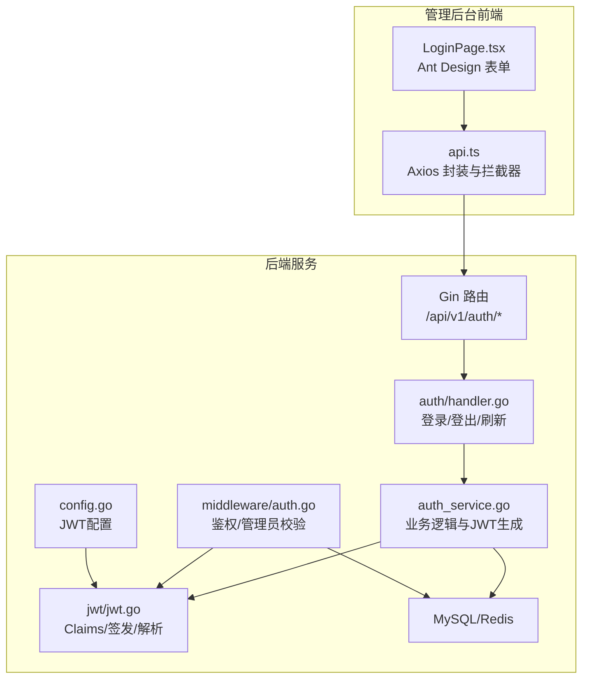
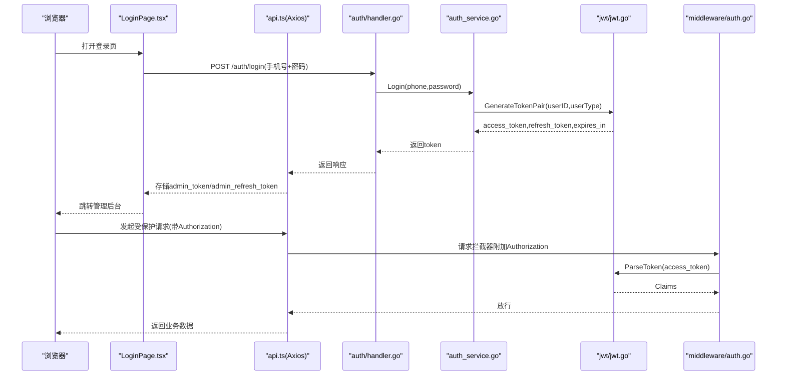
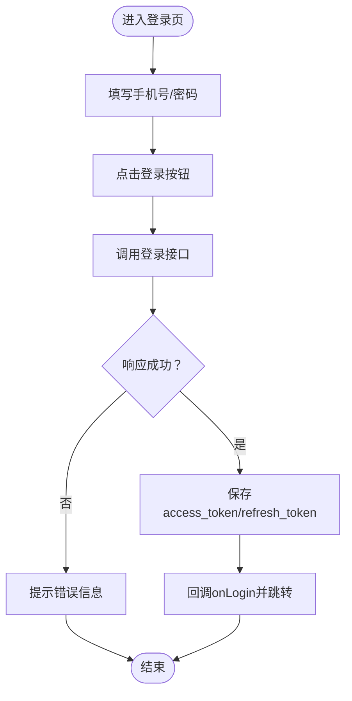
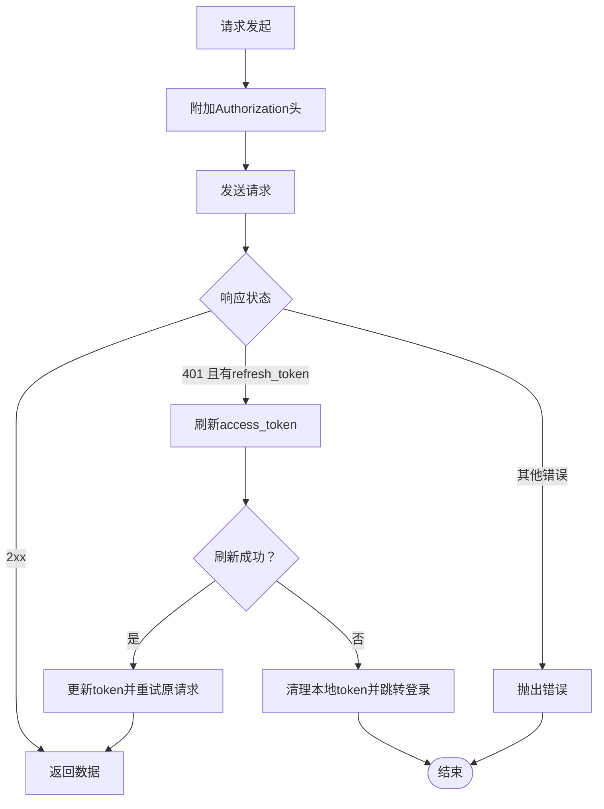
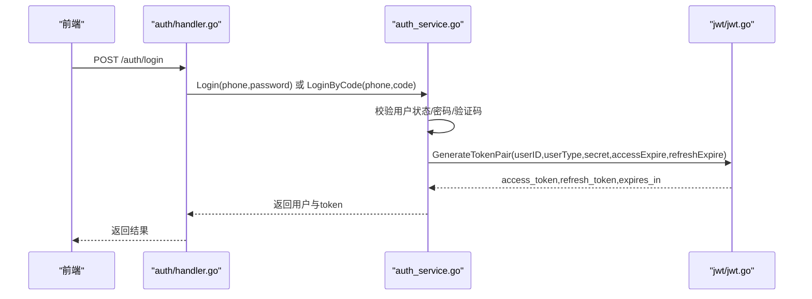
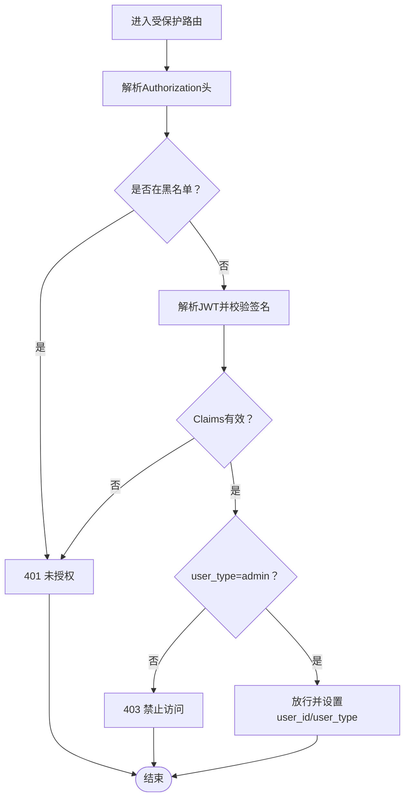
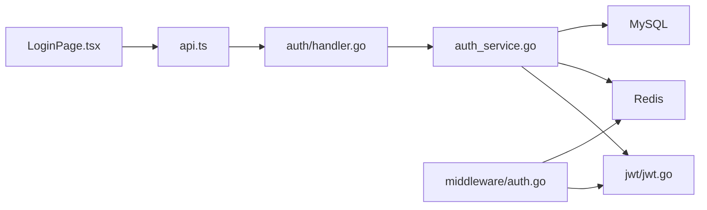

# 登录认证

<cite>
**本文引用的文件**   
- [admin/src/pages/LoginPage.tsx](file://admin/src/pages/LoginPage.tsx)
- [admin/src/services/api.ts](file://admin/src/services/api.ts)
- [backend/internal/api/middleware/auth.go](file://backend/internal/api/middleware/auth.go)
- [backend/internal/pkg/jwt/jwt.go](file://backend/internal/pkg/jwt/jwt.go)
- [backend/internal/api/v1/auth/handler.go](file://backend/internal/api/v1/auth/handler.go)
- [backend/internal/service/auth_service.go](file://backend/internal/service/auth_service.go)
- [backend/internal/model/models.go](file://backend/internal/model/models.go)
- [backend/internal/config/config.go](file://backend/internal/config/config.go)
- [backend/cmd/server/main.go](file://backend/cmd/server/main.go)
</cite>

## 目录
1. [简介](#简介)
2. [项目结构](#项目结构)
3. [核心组件](#核心组件)
4. [架构总览](#架构总览)
5. [详细组件分析](#详细组件分析)
6. [依赖分析](#依赖分析)
7. [性能考虑](#性能考虑)
8. [故障排查指南](#故障排查指南)
9. [结论](#结论)
10. [附录](#附录)

## 简介
本文件面向管理后台的登录认证系统，覆盖管理员登录流程、JWT令牌验证机制、会话管理策略、UI表单与错误处理、权限与角色校验、安全防护措施，并提供登录失败处理、密码重置、多设备登录管理等安全功能的使用指南。文档以代码为依据，结合可视化图示帮助读者快速理解与落地实施。

## 项目结构
管理后台登录认证由前端页面与后端接口共同组成：
- 前端负责表单输入、调用登录接口、存储令牌并在后续请求中携带 Authorization 头。
- 后端提供认证接口、JWT签发与解析、中间件鉴权与角色过滤、Redis黑名单与过期控制。

图表来源
- [admin/src/pages/LoginPage.tsx:1-53](file://admin/src/pages/LoginPage.tsx#L1-L53)
- [admin/src/services/api.ts:144-150](file://admin/src/services/api.ts#L144-L150)
- [backend/internal/api/v1/auth/handler.go:76-107](file://backend/internal/api/v1/auth/handler.go#L76-L107)
- [backend/internal/service/auth_service.go:159-182](file://backend/internal/service/auth_service.go#L159-L182)
- [backend/internal/pkg/jwt/jwt.go:27-67](file://backend/internal/pkg/jwt/jwt.go#L27-L67)
- [backend/internal/api/middleware/auth.go:22-61](file://backend/internal/api/middleware/auth.go#L22-L61)
- [backend/internal/config/config.go:132-162](file://backend/internal/config/config.go#L132-L162)

章节来源
- [admin/src/pages/LoginPage.tsx:1-53](file://admin/src/pages/LoginPage.tsx#L1-L53)
- [admin/src/services/api.ts:144-150](file://admin/src/services/api.ts#L144-L150)
- [backend/internal/api/v1/auth/handler.go:76-107](file://backend/internal/api/v1/auth/handler.go#L76-L107)
- [backend/internal/service/auth_service.go:159-182](file://backend/internal/service/auth_service.go#L159-L182)
- [backend/internal/pkg/jwt/jwt.go:27-67](file://backend/internal/pkg/jwt/jwt.go#L27-L67)
- [backend/internal/api/middleware/auth.go:22-61](file://backend/internal/api/middleware/auth.go#L22-L61)
- [backend/internal/config/config.go:132-162](file://backend/internal/config/config.go#L132-L162)

## 核心组件
- 登录页面与表单
  - 使用 Ant Design 表单组件，包含手机号与密码字段，提交时调用后端登录接口。
  - 成功后将 access_token 与 refresh_token 写入本地存储，并回调父组件完成登录态更新。
- Axios 封装与拦截器
  - 请求拦截器自动附加 Authorization: Bearer token。
  - 响应拦截器统一处理错误；当出现 401 且存在 refresh_token 时触发刷新流程。
- 认证处理器
  - 提供登录、登出、刷新令牌接口；支持密码登录与验证码登录两种方式。
- 认证服务
  - 负责用户校验、密码哈希比对、JWT生成、令牌刷新与黑名单写入。
- 中间件
  - 鉴权中间件解析并校验 JWT，支持黑名单检查；管理员中间件限制访问范围。
- JWT 工具
  - 定义 Claims 结构，生成与解析 Access/Refresh Token。
- 配置
  - JWT 密钥、Access/Refresh 过期间隔等安全参数。

章节来源
- [admin/src/pages/LoginPage.tsx:10-29](file://admin/src/pages/LoginPage.tsx#L10-L29)
- [admin/src/services/api.ts:52-63](file://admin/src/services/api.ts#L52-L63)
- [admin/src/services/api.ts:66-137](file://admin/src/services/api.ts#L66-L137)
- [backend/internal/api/v1/auth/handler.go:76-107](file://backend/internal/api/v1/auth/handler.go#L76-L107)
- [backend/internal/service/auth_service.go:159-182](file://backend/internal/service/auth_service.go#L159-L182)
- [backend/internal/api/middleware/auth.go:22-61](file://backend/internal/api/middleware/auth.go#L22-L61)
- [backend/internal/pkg/jwt/jwt.go:10-25](file://backend/internal/pkg/jwt/jwt.go#L10-L25)

## 架构总览
下图展示从登录到请求受保护资源的整体流程，包括前端令牌存储、请求头注入、后端鉴权与角色校验、以及刷新令牌与错误处理。

图表来源
- [admin/src/pages/LoginPage.tsx:13-24](file://admin/src/pages/LoginPage.tsx#L13-L24)
- [admin/src/services/api.ts:52-63](file://admin/src/services/api.ts#L52-L63)
- [backend/internal/api/v1/auth/handler.go:76-107](file://backend/internal/api/v1/auth/handler.go#L76-L107)
- [backend/internal/service/auth_service.go:159-182](file://backend/internal/service/auth_service.go#L159-L182)
- [backend/internal/pkg/jwt/jwt.go:27-67](file://backend/internal/pkg/jwt/jwt.go#L27-L67)
- [backend/internal/api/middleware/auth.go:22-61](file://backend/internal/api/middleware/auth.go#L22-L61)

## 详细组件分析

### 登录页面与表单验证
- 表单字段
  - 手机号：必填校验。
  - 密码：必填校验。
- 提交流程
  - 调用 adminApi.login(phone, password)。
  - 解析响应中的 token.access_token 与 token.refresh_token，分别持久化到 localStorage。
  - 回调 onLogin(token) 完成登录态同步。
- 错误处理
  - 捕获异常并提示错误消息。

图表来源
- [admin/src/pages/LoginPage.tsx:13-29](file://admin/src/pages/LoginPage.tsx#L13-L29)

章节来源
- [admin/src/pages/LoginPage.tsx:10-29](file://admin/src/pages/LoginPage.tsx#L10-L29)

### Axios 封装与令牌刷新
- 请求拦截器
  - 自动从 localStorage 读取 admin_token 并设置 Authorization 头。
- 响应拦截器
  - 统一错误处理：非成功码抛错。
  - 401 且未重试过：
    - 若正在刷新，将当前请求加入等待队列，待新 token 到来后重试。
    - 否则尝试使用 admin_refresh_token 调用 /auth/refresh-token 获取新 token。
    - 成功后更新本地 token 并重试原请求；失败则清理本地 token 并跳转登录页。

图表来源
- [admin/src/services/api.ts:52-63](file://admin/src/services/api.ts#L52-L63)
- [admin/src/services/api.ts:66-137](file://admin/src/services/api.ts#L66-L137)

章节来源
- [admin/src/services/api.ts:52-63](file://admin/src/services/api.ts#L52-L63)
- [admin/src/services/api.ts:66-137](file://admin/src/services/api.ts#L66-L137)

### 后端登录流程与JWT生成
- 登录接口
  - 支持密码登录与验证码登录；根据请求参数选择分支。
  - 校验通过后返回用户信息与 token 对（access_token、refresh_token、expires_in）。
- 认证服务
  - 密码登录：按手机号查询用户，校验状态与密码哈希，生成 token 对。
  - 验证码登录：校验验证码后，若用户不存在则自动注册，再生成 token 对。
- JWT 生成
  - Access Token：包含 user_id、user_type、issuer、iat、exp。
  - Refresh Token：issuer 标识不同，过期时间更长。

图表来源
- [backend/internal/api/v1/auth/handler.go:76-107](file://backend/internal/api/v1/auth/handler.go#L76-L107)
- [backend/internal/service/auth_service.go:159-182](file://backend/internal/service/auth_service.go#L159-L182)
- [backend/internal/pkg/jwt/jwt.go:27-67](file://backend/internal/pkg/jwt/jwt.go#L27-L67)

章节来源
- [backend/internal/api/v1/auth/handler.go:76-107](file://backend/internal/api/v1/auth/handler.go#L76-L107)
- [backend/internal/service/auth_service.go:159-182](file://backend/internal/service/auth_service.go#L159-L182)
- [backend/internal/pkg/jwt/jwt.go:27-67](file://backend/internal/pkg/jwt/jwt.go#L27-L67)

### JWT 令牌验证与管理员权限
- 鉴权中间件
  - 从 Authorization 头解析 Bearer token。
  - 检查 Redis 黑名单键是否存在；存在则拒绝。
  - 使用配置的密钥解析 JWT，提取 user_id 与 user_type，写入上下文。
- 管理员中间件
  - 仅允许 user_type 为 admin 的请求通过。
- 登出与黑名单
  - 登出时将 access_token 与 refresh_token 加入黑名单，键格式为 token:blacklist:{token}，过期时间与原始 token 一致。

图表来源
- [backend/internal/api/middleware/auth.go:22-73](file://backend/internal/api/middleware/auth.go#L22-L73)
- [backend/internal/service/auth_service.go:234-262](file://backend/internal/service/auth_service.go#L234-L262)

章节来源
- [backend/internal/api/middleware/auth.go:22-73](file://backend/internal/api/middleware/auth.go#L22-L73)
- [backend/internal/service/auth_service.go:234-262](file://backend/internal/service/auth_service.go#L234-L262)

### 登录失败处理与安全防护
- 登录失败
  - 前端捕获异常并提示错误；后端返回统一错误码与消息。
- 密码重置
  - 当前 v1 认证接口未提供“忘记密码”入口；建议复用短信验证码流程（SendCode/VerifyCode）实现“验证码重置密码”能力。
- 多设备登录管理
  - 后端通过黑名单机制实现“单点登录/强制下线”：登出时将当前 token 加入黑名单，后续请求被拒绝。
  - 建议在新设备登录时同时将旧设备 token 加入黑名单，实现互斥登录。

章节来源
- [admin/src/pages/LoginPage.tsx:25-27](file://admin/src/pages/LoginPage.tsx#L25-L27)
- [backend/internal/api/v1/auth/handler.go:128-144](file://backend/internal/api/v1/auth/handler.go#L128-L144)
- [backend/internal/service/auth_service.go:234-262](file://backend/internal/service/auth_service.go#L234-L262)

### 权限模型与角色检查
- 用户类型
  - model.User 中定义 user_type 字段，支持多种角色；管理员中间件限定为 admin。
- 角色检查
  - 中间件从上下文读取 user_type 并进行过滤，确保只有管理员可访问管理端路由。

章节来源
- [backend/internal/model/models.go:9-26](file://backend/internal/model/models.go#L9-L26)
- [backend/internal/api/middleware/auth.go:63-73](file://backend/internal/api/middleware/auth.go#L63-L73)

### 配置与安全参数
- JWT 配置
  - secret：必须至少 32 位且不可为示例值。
  - access_expire、refresh_expire：需为正数，且 refresh_expire > access_expire。
- 应用启动
  - 启动时加载配置并校验；初始化 Redis、数据库、服务与中间件。

章节来源
- [backend/internal/config/config.go:132-162](file://backend/internal/config/config.go#L132-L162)
- [backend/cmd/server/main.go:59-70](file://backend/cmd/server/main.go#L59-L70)

## 依赖分析
- 前端依赖
  - adminApi.login 调用 /auth/login；响应中提取 token 并持久化。
  - Axios 拦截器统一处理 401 与刷新。
- 后端依赖
  - Gin 路由 -> 认证处理器 -> 认证服务 -> JWT 工具 -> Redis/数据库。
  - 中间件依赖 Redis 黑名单与 JWT 配置。

图表来源
- [admin/src/pages/LoginPage.tsx:13-24](file://admin/src/pages/LoginPage.tsx#L13-L24)
- [admin/src/services/api.ts:144-150](file://admin/src/services/api.ts#L144-L150)
- [backend/internal/api/v1/auth/handler.go:76-107](file://backend/internal/api/v1/auth/handler.go#L76-L107)
- [backend/internal/service/auth_service.go:159-182](file://backend/internal/service/auth_service.go#L159-L182)
- [backend/internal/pkg/jwt/jwt.go:27-67](file://backend/internal/pkg/jwt/jwt.go#L27-L67)
- [backend/internal/api/middleware/auth.go:22-61](file://backend/internal/api/middleware/auth.go#L22-L61)

章节来源
- [admin/src/pages/LoginPage.tsx:13-24](file://admin/src/pages/LoginPage.tsx#L13-L24)
- [admin/src/services/api.ts:144-150](file://admin/src/services/api.ts#L144-L150)
- [backend/internal/api/v1/auth/handler.go:76-107](file://backend/internal/api/v1/auth/handler.go#L76-L107)
- [backend/internal/service/auth_service.go:159-182](file://backend/internal/service/auth_service.go#L159-L182)
- [backend/internal/pkg/jwt/jwt.go:27-67](file://backend/internal/pkg/jwt/jwt.go#L27-L67)
- [backend/internal/api/middleware/auth.go:22-61](file://backend/internal/api/middleware/auth.go#L22-L61)

## 性能考虑
- 令牌刷新并发控制
  - 使用 isRefreshing 与 pendingRequests 队列避免重复刷新与请求风暴。
- 黑名单命中
  - Redis 黑名单键带过期时间，避免无限增长；建议定期清理过期键。
- 密码哈希成本
  - bcrypt 默认成本已足够安全；如需进一步提升，可在配置中调整。
- 请求超时与重试
  - Axios 超时与 401 自动重试策略降低弱网与过期场景下的失败率。

## 故障排查指南
- 登录失败
  - 检查手机号/密码是否正确；确认用户状态为 active。
  - 查看后端日志与响应错误码，定位具体原因。
- 401 未授权
  - 确认前端是否正确附加 Authorization 头。
  - 检查 access_token 是否在黑名单；若被登出或互斥登录，会被拉黑。
- 403 禁止访问
  - 确认 user_type 是否为 admin；非管理员无法访问管理端路由。
- 刷新失败
  - 检查 refresh_token 是否有效且未被加入黑名单。
  - 确认 JWT secret 配置一致且未被修改。

章节来源
- [admin/src/services/api.ts:77-133](file://admin/src/services/api.ts#L77-L133)
- [backend/internal/api/middleware/auth.go:22-89](file://backend/internal/api/middleware/auth.go#L22-L89)
- [backend/internal/service/auth_service.go:219-231](file://backend/internal/service/auth_service.go#L219-L231)

## 结论
本认证体系采用前后端分离的 JWT 方案，前端负责表单与令牌生命周期管理，后端提供鉴权、管理员权限与黑名单控制。通过 Axios 拦截器与后端中间件形成闭环的安全链路。建议在现有基础上补充“验证码重置密码”与“互斥登录”能力，进一步完善安全与用户体验。

## 附录
- 使用指南
  - 登录：填写手机号与密码，提交后自动存储令牌并跳转。
  - 登出：调用登出接口，后端将当前 token 加入黑名单，前端清理本地存储并跳转登录。
  - 刷新：401 时自动尝试刷新，失败则清空本地 token 并跳转登录。
  - 管理员权限：仅 admin 可访问管理端路由。