# 管理后台

<cite>
**本文引用的文件**
- [App.tsx](file://admin/src/App.tsx)
- [main.tsx](file://admin/src/main.tsx)
- [package.json](file://admin/package.json)
- [vite.config.ts](file://admin/vite.config.ts)
- [api.ts](file://admin/src/services/api.ts)
- [Dashboard/index.tsx](file://admin/src/pages/Dashboard/index.tsx)
- [LoginPage.tsx](file://admin/src/pages/LoginPage.tsx)
- [AnalyticsDashboard.tsx](file://admin/src/pages/Analytics/AnalyticsDashboard.tsx)
- [ReportList.tsx](file://admin/src/pages/Analytics/ReportList.tsx)
- [UserList.tsx](file://admin/src/pages/User/UserList.tsx)
- [OrderList.tsx](file://admin/src/pages/Order/OrderList.tsx)
- [TransactionList.tsx](file://admin/src/pages/Finance/TransactionList.tsx)
- [DroneList.tsx](file://admin/src/pages/Drone/DroneList.tsx)
- [PilotList.tsx](file://admin/src/pages/Pilot/PilotList.tsx)
- [ClientList.tsx](file://admin/src/pages/Client/ClientList.tsx)
</cite>

## 目录
1. [简介](#简介)
2. [项目结构](#项目结构)
3. [核心组件](#核心组件)
4. [架构总览](#架构总览)
5. [详细组件分析](#详细组件分析)
6. [依赖关系分析](#依赖关系分析)
7. [性能考量](#性能考量)
8. [故障排查指南](#故障排查指南)
9. [结论](#结论)
10. [附录](#附录)

## 简介
本项目为基于 React 的无人机租赁平台管理后台，采用 Ant Design 作为 UI 框架，Vite 作为构建工具，Axios 进行 HTTP 通信。系统提供完整的后台管理能力，覆盖用户管理、无人机管理、飞手管理、客户管理、订单管理、财务记录、数据分析看板与智能报表、飞行记录、正式派单、货物申报审核、迁移审计与异常订单等模块。后台支持管理员登录、权限控制、数据可视化、报表生成与导出等实用功能，为运营与系统维护提供高效工具。

## 项目结构
管理后台前端位于 admin 目录，采用 React + TypeScript + Vite 构建，Antd 提供基础 UI 组件，路由由 react-router-dom 管理，Axios 封装统一 API 调用与鉴权逻辑。

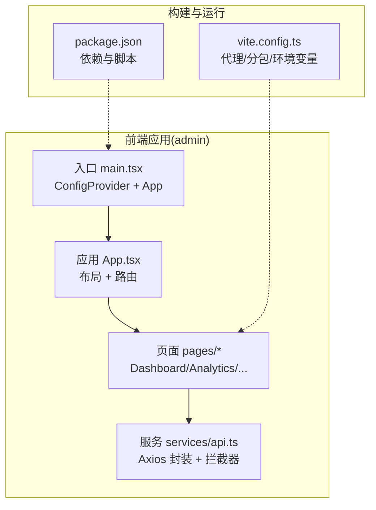

**图表来源**
- [main.tsx:1-14](file://admin/src/main.tsx#L1-L14)
- [App.tsx:1-130](file://admin/src/App.tsx#L1-L130)
- [vite.config.ts:1-64](file://admin/vite.config.ts#L1-L64)
- [package.json:1-33](file://admin/package.json#L1-L33)

**章节来源**
- [main.tsx:1-14](file://admin/src/main.tsx#L1-L14)
- [App.tsx:1-130](file://admin/src/App.tsx#L1-L130)
- [vite.config.ts:1-64](file://admin/vite.config.ts#L1-L64)
- [package.json:1-33](file://admin/package.json#L1-L33)

## 核心组件
- 应用入口与国际化：在入口文件中注入 Antd 本地化配置，确保界面语言与组件文案符合中文环境。
- 布局与导航：左侧菜单固定，支持折叠；顶部提供登出入口；右侧内容区根据路由渲染不同页面。
- 路由与权限：未登录状态下仅显示登录页；登录后进入 AdminLayout，菜单项与页面路由一一对应。
- API 与拦截器：统一 Axios 实例，自动注入 Authorization 头；对 401 错误进行 Token 刷新与重试；统一响应校验与错误提示。
- 环境与代理：开发环境通过 Vite 代理转发到后端 API；支持 WebSocket 代理；生产环境直连后端。

**章节来源**
- [main.tsx:1-14](file://admin/src/main.tsx#L1-L14)
- [App.tsx:1-130](file://admin/src/App.tsx#L1-L130)
- [api.ts:1-140](file://admin/src/services/api.ts#L1-L140)
- [vite.config.ts:1-64](file://admin/vite.config.ts#L1-L64)

## 架构总览
管理后台采用“前端路由 + Axios API 封装”的前后端分离架构。前端负责 UI 展示与交互，后端提供 RESTful API。登录后通过本地存储的访问令牌进行鉴权，支持刷新令牌以维持会话。

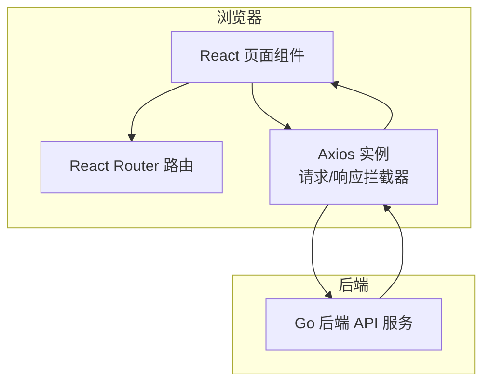

**图表来源**
- [App.tsx:85-102](file://admin/src/App.tsx#L85-L102)
- [api.ts:16-139](file://admin/src/services/api.ts#L16-L139)

## 详细组件分析

### 登录与权限控制
- 登录流程：登录页收集手机号与密码，调用登录接口，成功后将访问令牌与刷新令牌存入本地存储，触发应用重新渲染进入后台。
- 退出登录：点击顶部退出按钮，清理本地令牌并跳转至登录页。
- 权限校验：请求拦截器自动附加 Authorization 头；响应拦截器统一校验返回码；401 时尝试刷新令牌，失败则强制登出。

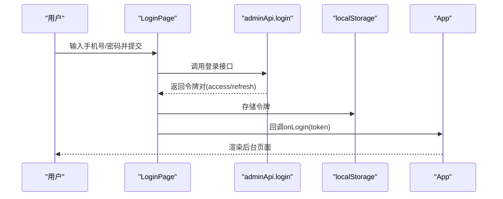

**图表来源**
- [LoginPage.tsx:10-30](file://admin/src/pages/LoginPage.tsx#L10-L30)
- [api.ts:146-150](file://admin/src/services/api.ts#L146-L150)

**章节来源**
- [LoginPage.tsx:1-53](file://admin/src/pages/LoginPage.tsx#L1-L53)
- [App.tsx:110-127](file://admin/src/App.tsx#L110-L127)
- [api.ts:51-139](file://admin/src/services/api.ts#L51-L139)

### 数据概览面板
- 功能：拉取仪表盘聚合数据，展示用户总数、注册无人机数量、订单总量、已完成订单、活跃订单、待处理订单、订单完成率与取消率、订单状态分布等。
- 交互：首次进入自动拉取数据，加载态友好提示；卡片内含进度环与状态分布条，直观呈现关键指标。

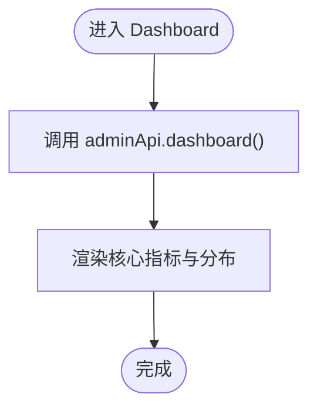

**图表来源**
- [Dashboard/index.tsx:15-24](file://admin/src/pages/Dashboard/index.tsx#L15-L24)

**章节来源**
- [Dashboard/index.tsx:1-211](file://admin/src/pages/Dashboard/index.tsx#L1-L211)
- [api.ts:152-153](file://admin/src/services/api.ts#L152-L153)

### 运营看板与实时数据
- 功能：提供实时看板、趋势数据、系统健康度、热门区域 TOP、订单完成率与用户分布等可视化视图。
- 交互：支持手动刷新看板数据；趋势图支持切换时间窗口（7/30/90 天）；系统状态颜色区分健康等级。

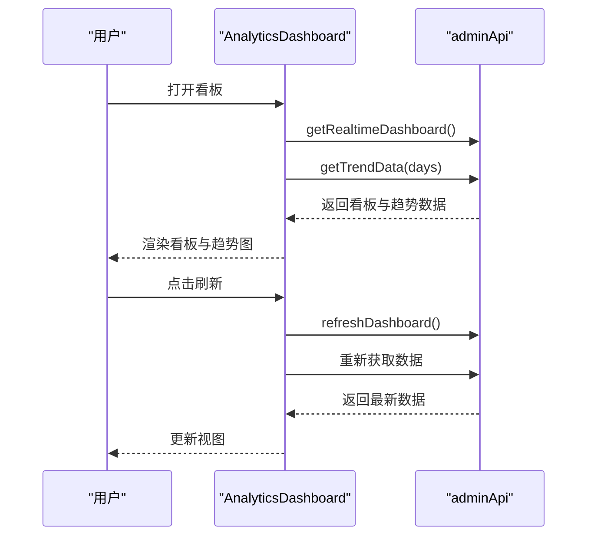

**图表来源**
- [AnalyticsDashboard.tsx:103-135](file://admin/src/pages/Analytics/AnalyticsDashboard.tsx#L103-L135)
- [api.ts:340-353](file://admin/src/services/api.ts#L340-L353)

**章节来源**
- [AnalyticsDashboard.tsx:1-446](file://admin/src/pages/Analytics/AnalyticsDashboard.tsx#L1-L446)
- [api.ts:338-381](file://admin/src/services/api.ts#L338-L381)

### 智能报表管理
- 功能：列出系统生成或手动生成的各类报表（日报/周报/月报/季报/年报/自定义），支持按类型筛选、查看详情、删除；支持快捷生成与自定义日期范围生成。
- 交互：详情弹窗解析并展示 JSON 摘要与建议；生成任务提交后刷新列表。

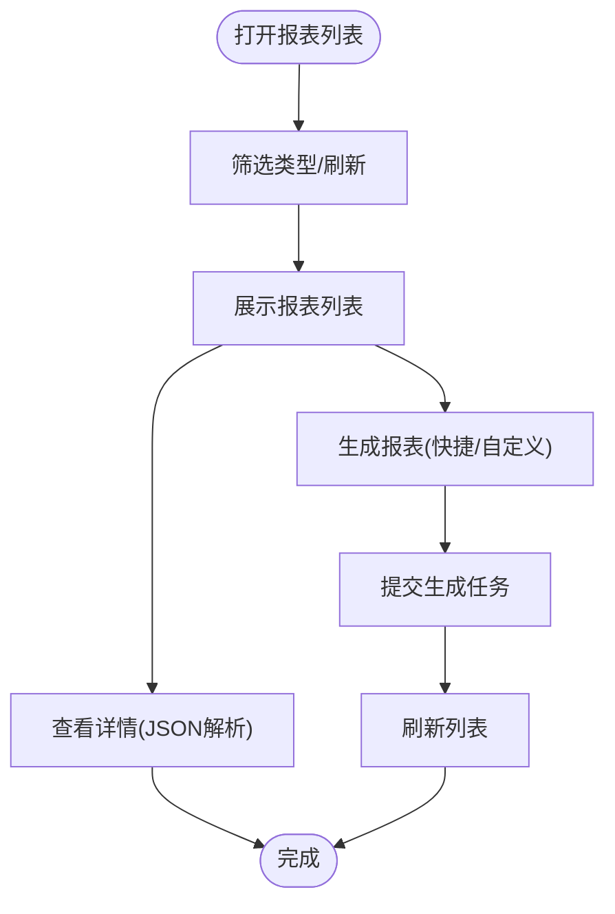

**图表来源**
- [ReportList.tsx:125-192](file://admin/src/pages/Analytics/ReportList.tsx#L125-L192)
- [api.ts:364-376](file://admin/src/services/api.ts#L364-L376)

**章节来源**
- [ReportList.tsx:1-487](file://admin/src/pages/Analytics/ReportList.tsx#L1-L487)
- [api.ts:364-376](file://admin/src/services/api.ts#L364-L376)

### 用户管理
- 功能：分页查询用户列表，支持关键词、状态、用户类型、认证状态筛选；支持启用/禁用账户、实名认证审核；详情弹窗展示用户完整信息。
- 交互：本地前端过滤用户类型与认证状态；操作前二次确认；成功后刷新当前页。

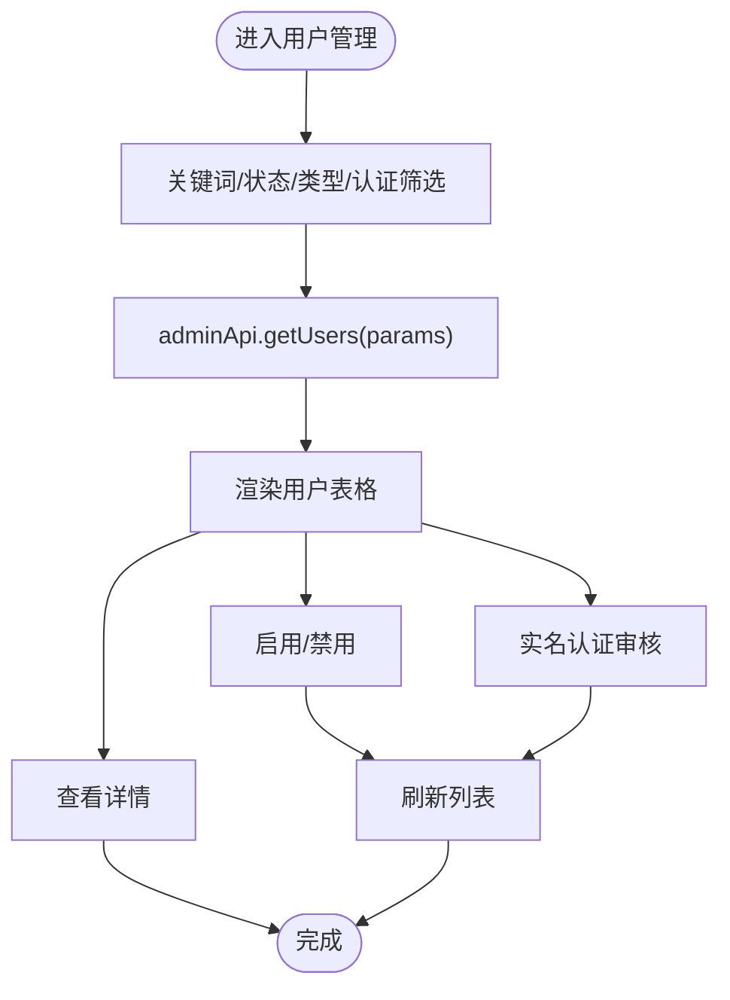

**图表来源**
- [UserList.tsx:49-116](file://admin/src/pages/User/UserList.tsx#L49-L116)
- [api.ts:156-170](file://admin/src/services/api.ts#L156-L170)

**章节来源**
- [UserList.tsx:1-299](file://admin/src/pages/User/UserList.tsx#L1-L299)
- [api.ts:156-170](file://admin/src/services/api.ts#L156-L170)

### 订单管理
- 功能：分页查询订单列表，支持状态、类型、关键词筛选；详情弹窗展示订单基本信息、费用信息、参与方信息、无人机信息与时间信息。
- 交互：本地前端过滤订单类型与关键词；表格列宽自适应滚动；金额格式化展示。

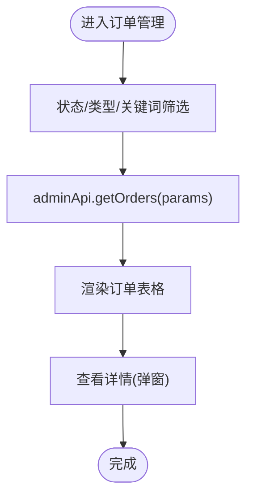

**图表来源**
- [OrderList.tsx:94-121](file://admin/src/pages/Order/OrderList.tsx#L94-L121)
- [api.ts:238-248](file://admin/src/services/api.ts#L238-L248)

**章节来源**
- [OrderList.tsx:1-344](file://admin/src/pages/Order/OrderList.tsx#L1-L344)
- [api.ts:238-248](file://admin/src/services/api.ts#L238-L248)

### 财务记录
- 功能：分页查询支付流水，支持状态、类型、支付方式筛选；统计收入总额、退款总额、交易笔数；金额正负与颜色区分。
- 交互：本地前端过滤类型与支付方式；按状态计算统计值。

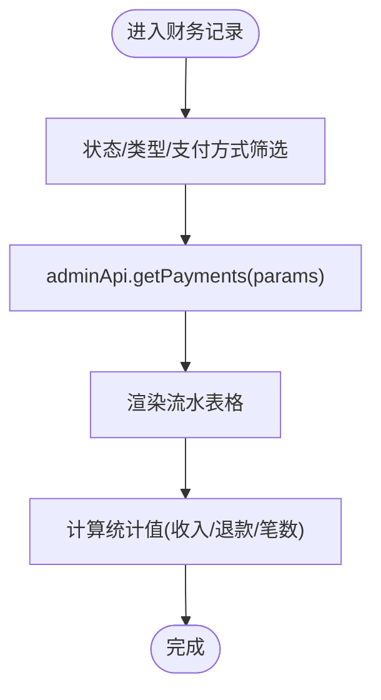

**图表来源**
- [TransactionList.tsx:50-72](file://admin/src/pages/Finance/TransactionList.tsx#L50-L72)
- [api.ts:309-322](file://admin/src/services/api.ts#L309-L322)

**章节来源**
- [TransactionList.tsx:1-225](file://admin/src/pages/Finance/TransactionList.tsx#L1-L225)
- [api.ts:309-322](file://admin/src/services/api.ts#L309-L322)

### 无人机管理
- 功能：分页查询无人机列表，支持关键词、认证状态、可用状态筛选；详情弹窗展示无人机基础信息与平台登记/UOM/保险/适航证书审核状态与文件；支持通过/拒绝认证与各项审核。
- 交互：本地前端过滤可用状态；详情弹窗异步拉取最新详情；审核通过后刷新详情与列表。

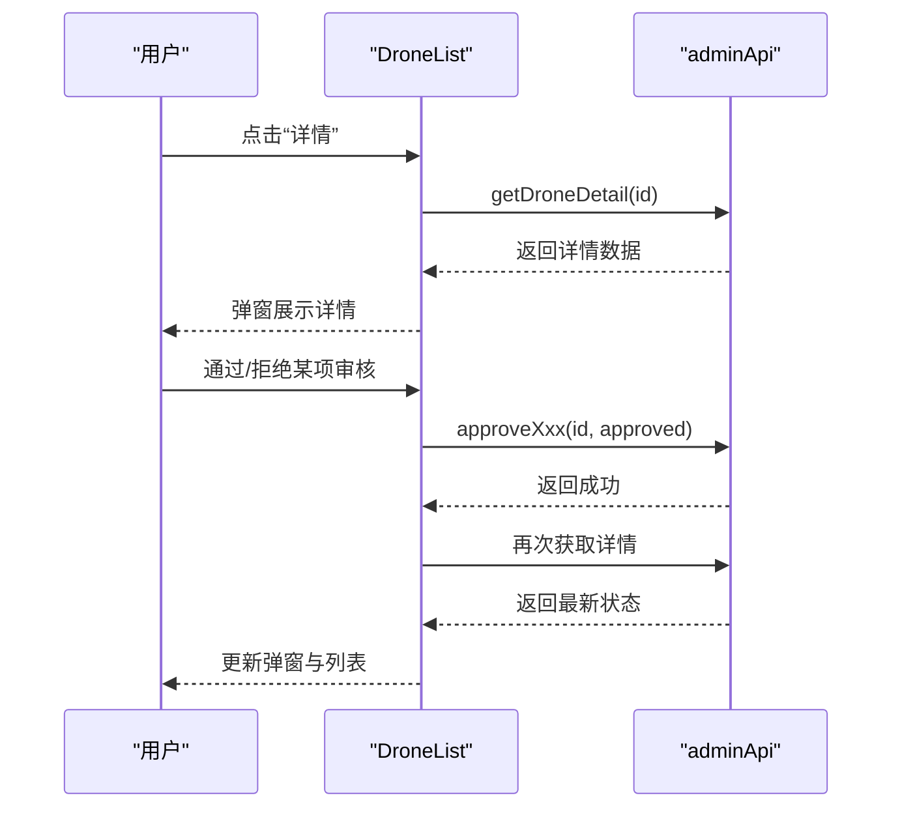

**图表来源**
- [DroneList.tsx:82-115](file://admin/src/pages/Drone/DroneList.tsx#L82-L115)
- [api.ts:172-196](file://admin/src/services/api.ts#L172-L196)

**章节来源**
- [DroneList.tsx:1-445](file://admin/src/pages/Drone/DroneList.tsx#L1-L445)
- [api.ts:172-196](file://admin/src/services/api.ts#L172-L196)

### 飞手管理
- 功能：分页查询飞手列表，支持认证状态筛选；详情弹窗展示飞手信息、CAAC 执照、无犯罪记录证明、健康体检证明；支持通过/拒绝认证与两类检查审核。
- 交互：拒绝时可填写备注；审核通过后刷新详情与列表。

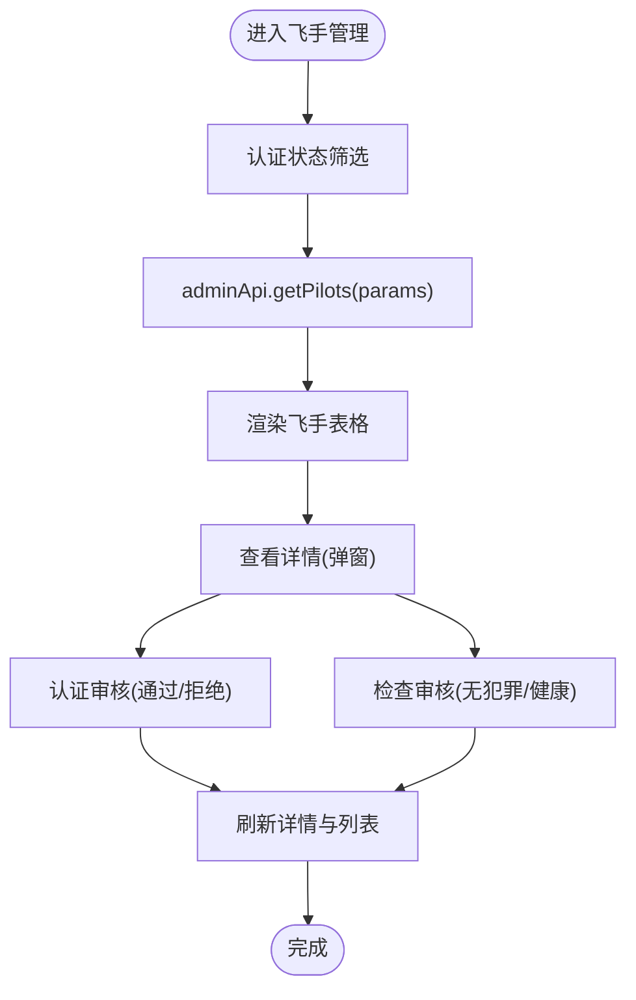

**图表来源**
- [PilotList.tsx:52-102](file://admin/src/pages/Pilot/PilotList.tsx#L52-L102)
- [api.ts:198-212](file://admin/src/services/api.ts#L198-L212)

**章节来源**
- [PilotList.tsx:1-337](file://admin/src/pages/Pilot/PilotList.tsx#L1-L337)
- [api.ts:198-212](file://admin/src/services/api.ts#L198-L212)

### 客户管理
- 功能：分页查询客户列表，支持客户类型与审核状态筛选；详情弹窗展示客户基础信息、企业信息（如适用）、信用分、订单与消费统计；支持审核通过/拒绝。
- 交互：待审核计数卡片；拒绝时可填写备注；审核通过后关闭弹窗并刷新列表。

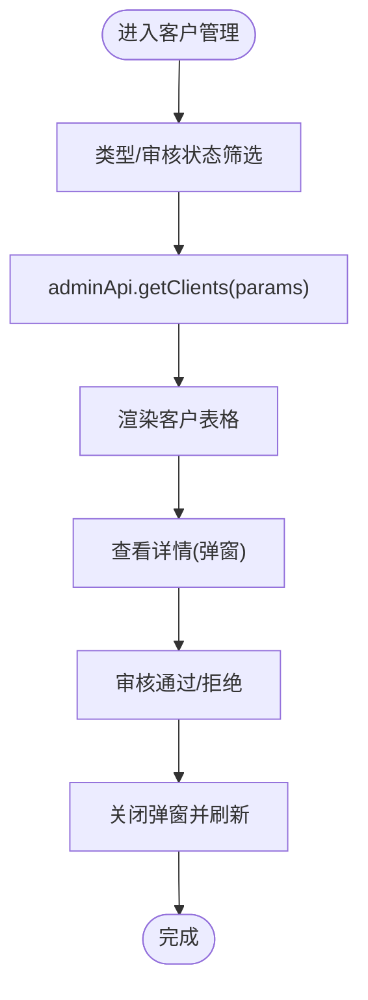

**图表来源**
- [ClientList.tsx:64-101](file://admin/src/pages/Client/ClientList.tsx#L64-L101)
- [api.ts:214-223](file://admin/src/services/api.ts#L214-L223)

**章节来源**
- [ClientList.tsx:1-371](file://admin/src/pages/Client/ClientList.tsx#L1-L371)
- [api.ts:214-223](file://admin/src/services/api.ts#L214-L223)

## 依赖关系分析
- 依赖关系：页面组件依赖 adminApi 进行数据获取；App 负责路由与布局；main 注入 Antd 本地化；vite.config 提供代理与分包策略；package.json 管理依赖与脚本。
- 外部集成：Axios 拦截器对接后端 API；WebSocket 代理用于实时通信；开发环境通过代理避免跨域问题。

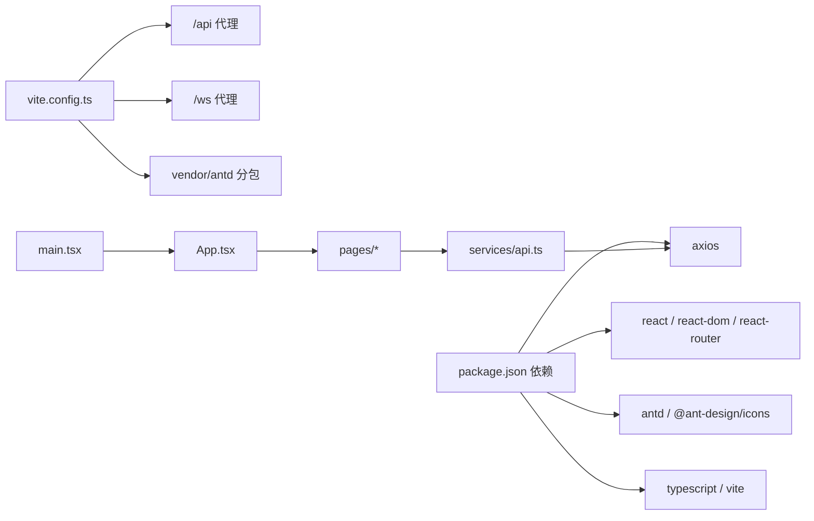

**图表来源**
- [package.json:14-31](file://admin/package.json#L14-L31)
- [vite.config.ts:14-56](file://admin/vite.config.ts#L14-L56)
- [main.tsx:1-14](file://admin/src/main.tsx#L1-L14)
- [App.tsx:1-130](file://admin/src/App.tsx#L1-L130)
- [api.ts:1-140](file://admin/src/services/api.ts#L1-L140)

**章节来源**
- [package.json:1-33](file://admin/package.json#L1-L33)
- [vite.config.ts:1-64](file://admin/vite.config.ts#L1-L64)
- [main.tsx:1-14](file://admin/src/main.tsx#L1-L14)
- [App.tsx:1-130](file://admin/src/App.tsx#L1-L130)
- [api.ts:1-140](file://admin/src/services/api.ts#L1-L140)

## 性能考量
- 构建优化：通过 Vite 的 Rollup 手动分包策略，将 vendor（React 生态）与 antd（UI 组件库）拆分为独立 chunk，提升缓存命中率与首屏加载速度。
- 代理与网络：开发环境使用代理避免 CORS，减少跨域带来的额外握手成本；生产环境直连后端，降低中间层开销。
- 前端渲染：页面组件采用本地过滤与分页，避免一次性渲染超大数据集；图表组件按需渲染，减少重绘。
- 状态与缓存：Axios 拦截器内置 Token 刷新与等待队列，避免重复请求与频繁刷新导致的抖动。

[本节为通用指导，不直接分析具体文件]

## 故障排查指南
- 登录失败：检查登录页输入与后端接口返回；确认本地存储是否写入令牌；查看控制台是否有网络错误。
- 401 未授权：确认请求头是否携带 Authorization；观察响应拦截器是否触发刷新流程；若刷新失败，将被强制登出。
- 数据为空或异常：检查 API 返回码与数据结构；确认参数传递（分页、筛选条件）是否正确；必要时在页面组件中打印响应数据辅助定位。
- 图表渲染异常：检查趋势数据与热力图数据接口返回格式；确认日期范围与字段映射是否一致。
- 文件下载/查看：部分详情弹窗包含文件链接，确认后端返回的文件 URL 可访问且未过期。

**章节来源**
- [api.ts:65-139](file://admin/src/services/api.ts#L65-L139)
- [DroneList.tsx:82-92](file://admin/src/pages/Drone/DroneList.tsx#L82-L92)
- [PilotList.tsx:104-129](file://admin/src/pages/Pilot/PilotList.tsx#L104-L129)

## 结论
本管理后台以 React + Antd 为基础，结合 Axios 统一 API 封装与 Vite 构建工具，实现了从登录鉴权、数据可视化到报表生成的完整后台管理能力。通过清晰的页面职责划分与稳定的 API 交互，系统能够满足运营与维护场景下的日常管理需求。后续可在以下方面持续优化：完善权限细化与细粒度角色控制、增强数据导出与报表下载能力、引入缓存与懒加载策略以进一步提升性能。

[本节为总结性内容，不直接分析具体文件]

## 附录
- 环境变量与代理：通过 Vite 环境变量配置 API 基础地址、前缀、超时、高德地图密钥、上传限制等；开发环境代理到后端，生产环境直连。
- 版本与构建：定义全局常量 __APP_VERSION__；构建时生成 sourcemap（非生产）；按需开启分包策略。

**章节来源**
- [vite.config.ts:7-62](file://admin/vite.config.ts#L7-L62)
- [api.ts:387-402](file://admin/src/services/api.ts#L387-L402)