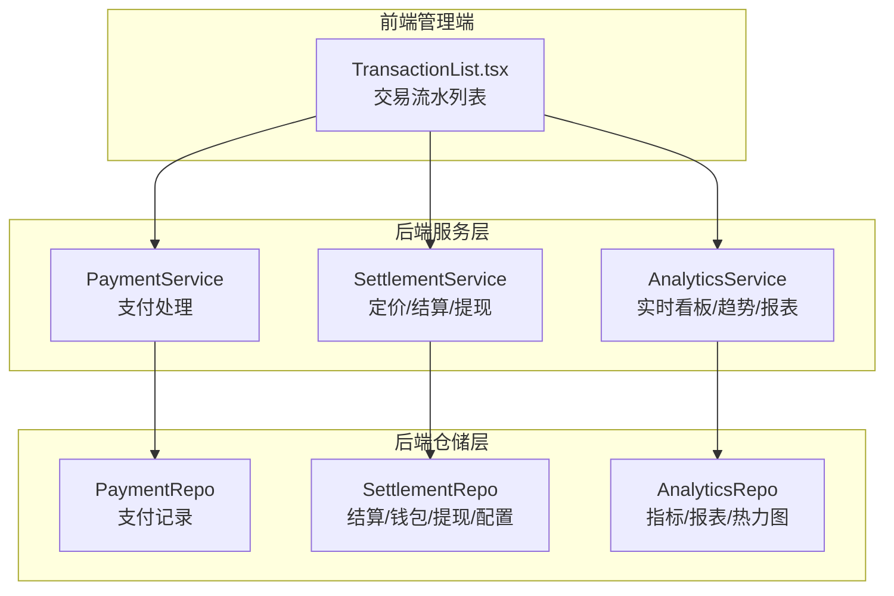
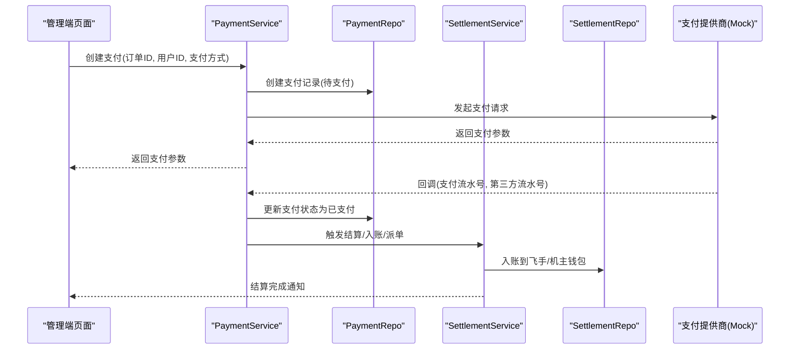
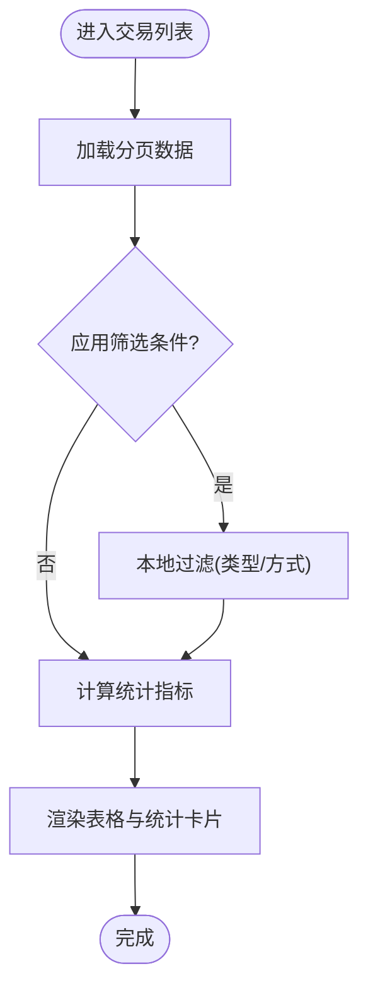
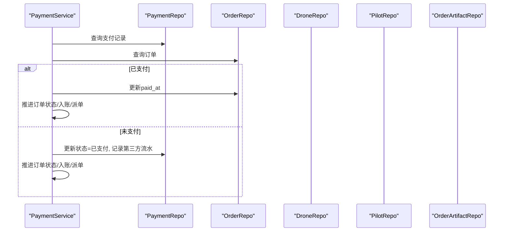
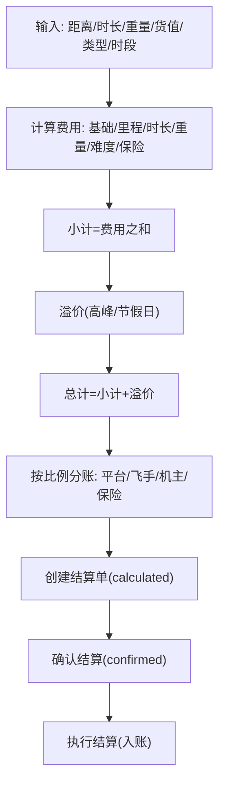
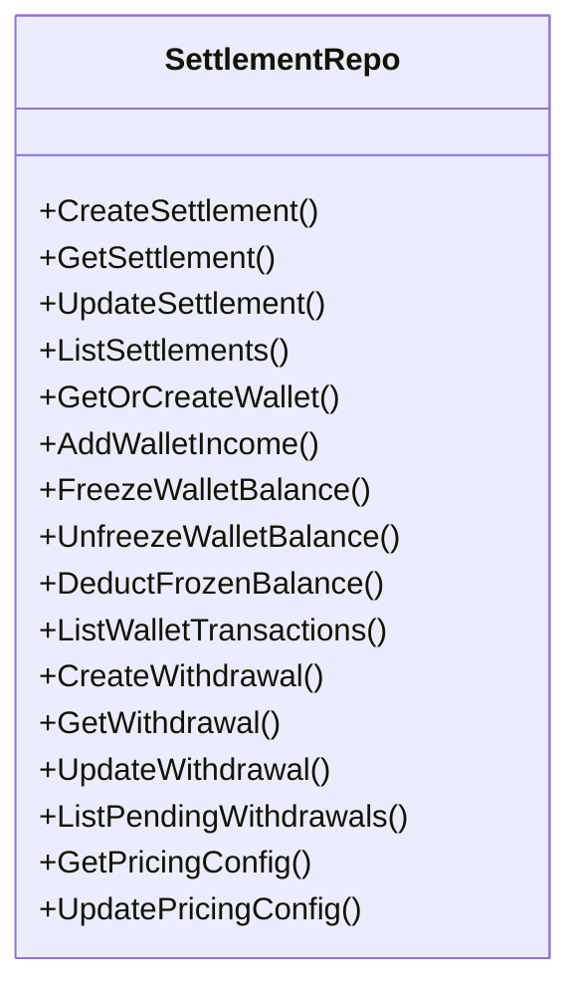
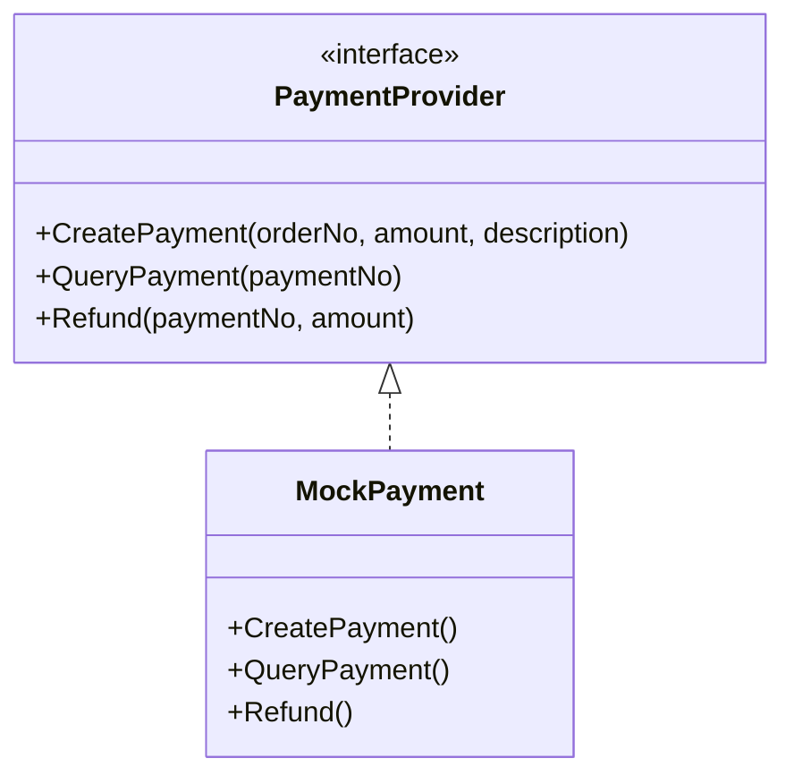
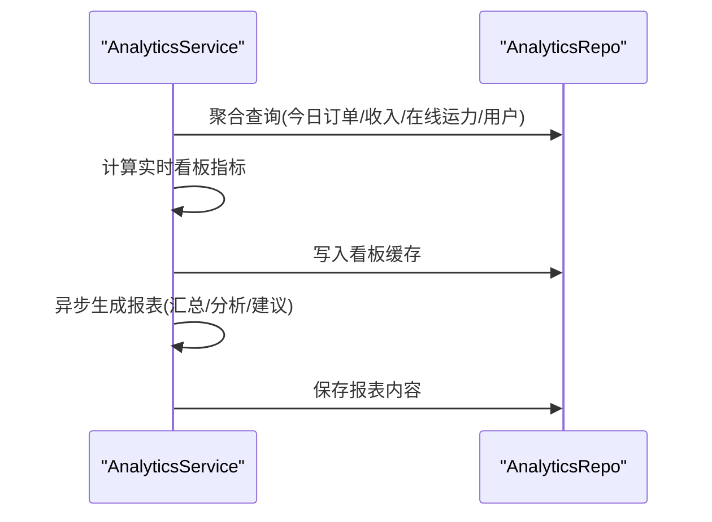
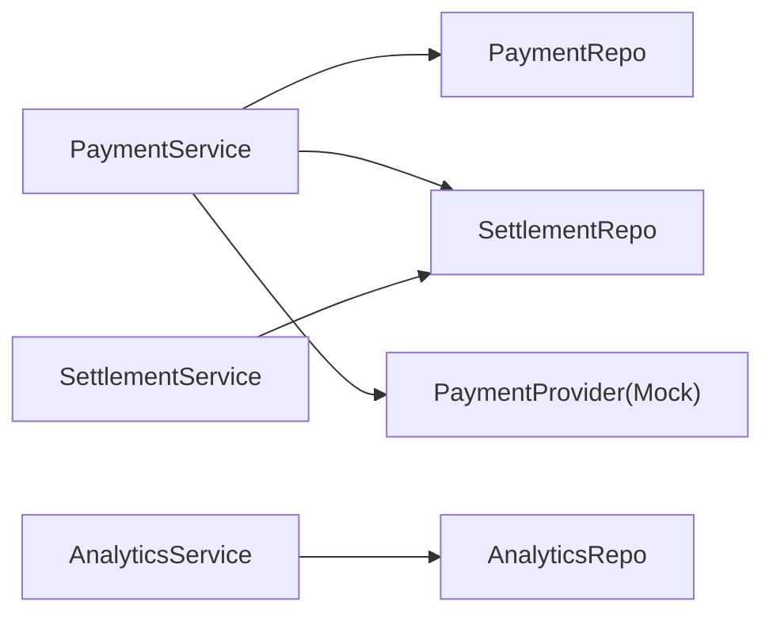
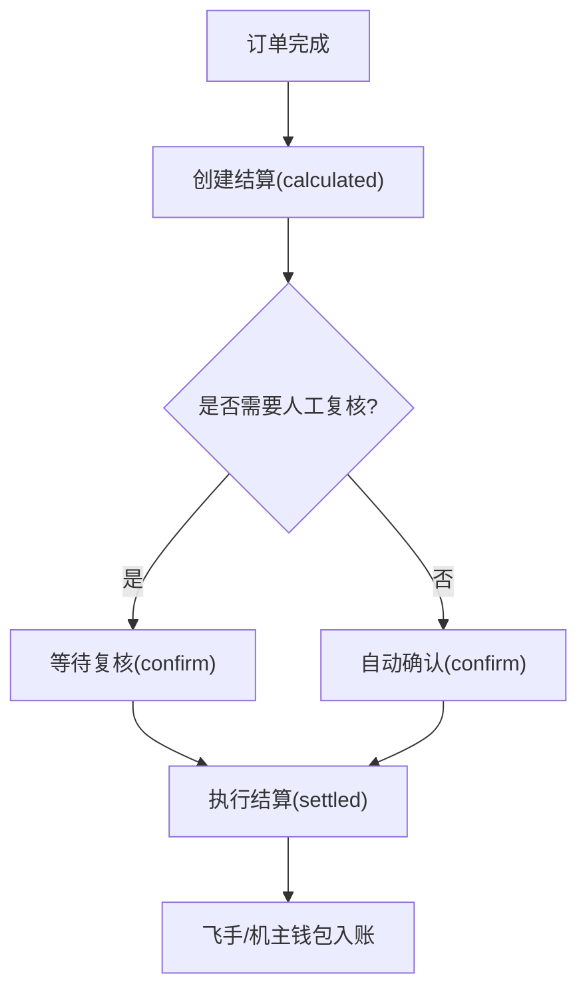

# 财务管理

<cite>
**本文引用的文件**
- [TransactionList.tsx](file://admin/src/pages/Finance/TransactionList.tsx)
- [payment.go](file://backend/internal/pkg/payment/payment.go)
- [payment_service.go](file://backend/internal/service/payment_service.go)
- [settlement_service.go](file://backend/internal/service/settlement_service.go)
- [analytics_service.go](file://backend/internal/service/analytics_service.go)
- [analytics_repo.go](file://backend/internal/repository/analytics_repo.go)
- [settlement_repo.go](file://backend/internal/repository/settlement_repo.go)
- [payment_repo.go](file://backend/internal/repository/payment_repo.go)
</cite>

## 目录
1. [简介](#简介)
2. [项目结构](#项目结构)
3. [核心组件](#核心组件)
4. [架构总览](#架构总览)
5. [详细组件分析](#详细组件分析)
6. [依赖关系分析](#依赖关系分析)
7. [性能考量](#性能考量)
8. [故障排查指南](#故障排查指南)
9. [结论](#结论)
10. [附录](#附录)

## 简介
本文件面向“财务管理”子系统，围绕交易记录管理、收入支出统计、财务报表生成、资金流水监控、对账机制、税务处理与成本控制等主题，系统梳理后端定价与结算、支付回调、钱包与提现、前端交易列表展示等能力，并给出企业级使用指南与最佳实践。

## 项目结构
财务管理相关代码主要分布在以下位置：
- 后端服务层：定价与结算、支付处理、数据分析与报表
- 后端仓储层：订单结算、钱包与流水、提现、定价配置
- 前端管理端：交易流水列表与统计卡片

图表来源
- [TransactionList.tsx:1-225](file://admin/src/pages/Finance/TransactionList.tsx#L1-L225)
- [payment_service.go:1-489](file://backend/internal/service/payment_service.go#L1-L489)
- [settlement_service.go:1-538](file://backend/internal/service/settlement_service.go#L1-L538)
- [analytics_service.go:1-783](file://backend/internal/service/analytics_service.go#L1-L783)
- [payment_repo.go:1-59](file://backend/internal/repository/payment_repo.go#L1-L59)
- [settlement_repo.go:1-336](file://backend/internal/repository/settlement_repo.go#L1-L336)
- [analytics_repo.go:1-481](file://backend/internal/repository/analytics_repo.go#L1-L481)

章节来源
- [TransactionList.tsx:1-225](file://admin/src/pages/Finance/TransactionList.tsx#L1-L225)
- [payment_service.go:1-489](file://backend/internal/service/payment_service.go#L1-L489)
- [settlement_service.go:1-538](file://backend/internal/service/settlement_service.go#L1-L538)
- [analytics_service.go:1-783](file://backend/internal/service/analytics_service.go#L1-L783)
- [payment_repo.go:1-59](file://backend/internal/repository/payment_repo.go#L1-L59)
- [settlement_repo.go:1-336](file://backend/internal/repository/settlement_repo.go#L1-L336)
- [analytics_repo.go:1-481](file://backend/internal/repository/analytics_repo.go#L1-L481)

## 核心组件
- 支付与退款处理（PaymentService）
  - 创建支付、处理支付回调、驱动订单状态推进、触发自动派单、退款处理与对账
- 定价与结算（SettlementService）
  - 动态定价计算、订单结算、钱包入账、提现申请与审批、批量执行结算
- 数据分析与报表（AnalyticsService）
  - 实时看板、趋势数据、每日统计、报表生成、区域与热力图、定时任务
- 仓储层（Repository）
  - 支付记录、订单结算、钱包与流水、提现、定价配置、指标聚合查询

章节来源
- [payment_service.go:55-92](file://backend/internal/service/payment_service.go#L55-L92)
- [settlement_service.go:219-285](file://backend/internal/service/settlement_service.go#L219-L285)
- [analytics_service.go:90-158](file://backend/internal/service/analytics_service.go#L90-L158)
- [payment_repo.go:21-39](file://backend/internal/repository/payment_repo.go#L21-L39)
- [settlement_repo.go:22-46](file://backend/internal/repository/settlement_repo.go#L22-L46)
- [analytics_repo.go:232-253](file://backend/internal/repository/analytics_repo.go#L232-L253)

## 架构总览
财务管理采用“服务层 + 仓储层”的分层设计，前端通过管理端页面展示交易流水与统计；服务层负责业务编排与跨模型协调；仓储层封装数据库访问与事务一致性。

图表来源
- [payment_service.go:55-92](file://backend/internal/service/payment_service.go#L55-L92)
- [payment_service.go:94-143](file://backend/internal/service/payment_service.go#L94-L143)
- [settlement_service.go:304-346](file://backend/internal/service/settlement_service.go#L304-L346)
- [payment_repo.go:21-39](file://backend/internal/repository/payment_repo.go#L21-L39)
- [settlement_repo.go:114-146](file://backend/internal/repository/settlement_repo.go#L114-L146)

## 详细组件分析

### 交易记录管理（前端）
- 功能要点
  - 支持按状态、类型、支付方式筛选
  - 展示流水号、订单ID、金额、状态、第三方流水号、时间等字段
  - 提供收入总额、退款总额、交易笔数的统计卡片
- 关键映射
  - 类型映射：订单支付、押金、退款
  - 方法映射：微信、支付宝、模拟支付
  - 状态映射：已支付、待支付、已退款、失败
- 使用建议
  - 使用“重置”按钮清空筛选条件
  - 通过“第三方流水号”辅助对账核对

图表来源
- [TransactionList.tsx:40-88](file://admin/src/pages/Finance/TransactionList.tsx#L40-L88)
- [TransactionList.tsx:167-221](file://admin/src/pages/Finance/TransactionList.tsx#L167-L221)

章节来源
- [TransactionList.tsx:1-225](file://admin/src/pages/Finance/TransactionList.tsx#L1-L225)

### 支付处理（服务层）
- 关键流程
  - 创建支付：校验订单状态与权限，生成支付单据，调用支付提供商
  - 支付回调：幂等更新支付状态，推进订单状态，触发结算与入账，必要时自动派单
  - 退款：基于待处理退款清单，逐笔调用支付提供商退款，更新支付与订单状态
- 并发与一致性
  - 回调处理支持事务包裹，确保支付状态、订单状态与快照的一致性
  - 退款流程在事务中更新退款记录与支付状态，失败回滚并记录日志

图表来源
- [payment_service.go:166-214](file://backend/internal/service/payment_service.go#L166-L214)
- [payment_service.go:344-407](file://backend/internal/service/payment_service.go#L344-L407)

章节来源
- [payment_service.go:55-92](file://backend/internal/service/payment_service.go#L55-L92)
- [payment_service.go:94-143](file://backend/internal/service/payment_service.go#L94-L143)
- [payment_service.go:216-342](file://backend/internal/service/payment_service.go#L216-L342)
- [payment_service.go:466-488](file://backend/internal/service/payment_service.go#L466-L488)

### 定价与结算（服务层）
- 定价引擎
  - 输入：飞行距离、时长、载重、货值、货物类型、任务类型、高峰/节假日/夜间等
  - 输出：基础费、里程费、时长费、重量费、难度费、保险费、小计、溢价、总计
- 结算流程
  - 创建结算：按平台/飞手/机主/保险分账比例计算，生成结算单
  - 确认结算：状态从“已计算”变为“已确认”
  - 执行结算：事务性入账到飞手/机主钱包，标记为“已结算”
- 提现流程
  - 申请：校验余额、计算手续费、冻结余额并创建提现记录
  - 审批：通过则模拟转账成功，失败则解冻余额
  - 完成：扣减冻结余额，更新记录状态

图表来源
- [settlement_service.go:56-101](file://backend/internal/service/settlement_service.go#L56-L101)
- [settlement_service.go:219-285](file://backend/internal/service/settlement_service.go#L219-L285)
- [settlement_service.go:287-346](file://backend/internal/service/settlement_service.go#L287-L346)

章节来源
- [settlement_service.go:27-101](file://backend/internal/service/settlement_service.go#L27-L101)
- [settlement_service.go:219-285](file://backend/internal/service/settlement_service.go#L219-L285)
- [settlement_service.go:303-346](file://backend/internal/service/settlement_service.go#L303-L346)
- [settlement_service.go:362-462](file://backend/internal/service/settlement_service.go#L362-L462)

### 钱包与流水（仓储层）
- 钱包操作
  - 入账：事务内增加可用余额与总收入，写入流水
  - 冻结/解冻/扣减冻结：提现流程中的余额管控
  - 查询：按用户与类型分页查询流水
- 提现管理
  - 申请：创建提现记录并冻结余额
  - 审批：通过/拒绝，分别执行解冻或转账成功后的扣减冻结
- 定价配置
  - 读取/更新定价配置，支持分类查询

图表来源
- [settlement_repo.go:22-46](file://backend/internal/repository/settlement_repo.go#L22-L46)
- [settlement_repo.go:114-146](file://backend/internal/repository/settlement_repo.go#L114-L146)
- [settlement_repo.go:148-242](file://backend/internal/repository/settlement_repo.go#L148-L242)
- [settlement_repo.go:272-302](file://backend/internal/repository/settlement_repo.go#L272-L302)
- [settlement_repo.go:306-329](file://backend/internal/repository/settlement_repo.go#L306-L329)

章节来源
- [settlement_repo.go:87-108](file://backend/internal/repository/settlement_repo.go#L87-L108)
- [settlement_repo.go:114-146](file://backend/internal/repository/settlement_repo.go#L114-L146)
- [settlement_repo.go:148-242](file://backend/internal/repository/settlement_repo.go#L148-L242)
- [settlement_repo.go:272-302](file://backend/internal/repository/settlement_repo.go#L272-L302)
- [settlement_repo.go:306-329](file://backend/internal/repository/settlement_repo.go#L306-L329)

### 支付接口抽象与Mock（支付包）
- 接口职责
  - 创建支付、查询支付状态、发起退款
- Mock实现
  - 开发环境下的模拟支付/退款，便于联调与测试
- 编号生成
  - 支付单号与退款单号均采用带时间戳与随机片段的规则

图表来源
- [payment.go:11-15](file://backend/internal/pkg/payment/payment.go#L11-L15)
- [payment.go:34-73](file://backend/internal/pkg/payment/payment.go#L34-L73)

章节来源
- [payment.go:11-78](file://backend/internal/pkg/payment/payment.go#L11-L78)

### 数据分析与报表（服务层/仓储层）
- 实时看板
  - 今日订单、今日收入、在线运力、活跃用户、告警摘要、最近订单、TOP区域、系统健康
- 趋势与每日统计
  - 订单/收入/用户趋势、每日统计数据生成与缓存
- 报表生成
  - 支持日报/周报/月报/季报/年报，异步生成并落库，包含汇总、分析与建议
- 聚合查询
  - 今日订单/收入/在线运力/用户统计、趋势数据、区域统计、飞行统计、告警统计

图表来源
- [analytics_service.go:90-158](file://backend/internal/service/analytics_service.go#L90-L158)
- [analytics_service.go:375-429](file://backend/internal/service/analytics_service.go#L375-L429)
- [analytics_repo.go:232-253](file://backend/internal/repository/analytics_repo.go#L232-L253)
- [analytics_repo.go:278-346](file://backend/internal/repository/analytics_repo.go#L278-L346)
- [analytics_repo.go:379-414](file://backend/internal/repository/analytics_repo.go#L379-L414)

章节来源
- [analytics_service.go:90-190](file://backend/internal/service/analytics_service.go#L90-L190)
- [analytics_service.go:201-240](file://backend/internal/service/analytics_service.go#L201-L240)
- [analytics_service.go:330-429](file://backend/internal/service/analytics_service.go#L330-L429)
- [analytics_repo.go:232-481](file://backend/internal/repository/analytics_repo.go#L232-L481)

## 依赖关系分析
- 服务层依赖仓储层，保证领域逻辑与数据访问分离
- 支付服务依赖支付提供商接口，便于替换真实支付通道
- 结算服务依赖订单仓储与钱包仓储，确保入账与对账一致
- 分析服务依赖仓储层聚合查询，支撑看板与报表

图表来源
- [payment_service.go:15-45](file://backend/internal/service/payment_service.go#L15-L45)
- [settlement_service.go:15-23](file://backend/internal/service/settlement_service.go#L15-L23)
- [analytics_service.go:12-20](file://backend/internal/service/analytics_service.go#L12-L20)
- [payment.go:11-15](file://backend/internal/pkg/payment/payment.go#L11-L15)

章节来源
- [payment_service.go:15-45](file://backend/internal/service/payment_service.go#L15-L45)
- [settlement_service.go:15-23](file://backend/internal/service/settlement_service.go#L15-L23)
- [analytics_service.go:12-20](file://backend/internal/service/analytics_service.go#L12-L20)
- [payment.go:11-15](file://backend/internal/pkg/payment/payment.go#L11-L15)

## 性能考量
- 分页与索引
  - 支付与结算列表查询使用分页与排序，建议在高频查询列建立索引
- 事务边界
  - 钱包入账/冻结/扣减均在事务内完成，避免并发场景下的余额不一致
- 聚合查询
  - 实时看板与报表使用聚合查询，建议定期刷新缓存，减少重复计算
- 批量处理
  - 结算批量执行与报表异步生成，降低高峰期对主线程的影响

## 故障排查指南
- 支付回调未生效
  - 检查回调参数与幂等逻辑，确认支付记录状态与订单推进是否一致
  - 查看服务日志定位失败点
- 退款失败
  - 核对退款清单与支付记录对应关系，查看退款提供商返回与错误日志
- 结算未入账
  - 确认结算状态流转（已计算→已确认→已结算），检查钱包入账事务是否成功
- 提现异常
  - 余额不足、冻结余额不足、状态不符都会导致失败，核对钱包与流水记录
- 报表生成失败
  - 检查报表生成任务调度与数据库连接，查看报表状态与失败原因

章节来源
- [payment_service.go:94-143](file://backend/internal/service/payment_service.go#L94-L143)
- [payment_service.go:216-342](file://backend/internal/service/payment_service.go#L216-L342)
- [settlement_service.go:303-346](file://backend/internal/service/settlement_service.go#L303-L346)
- [settlement_service.go:411-462](file://backend/internal/service/settlement_service.go#L411-L462)
- [analytics_service.go:375-429](file://backend/internal/service/analytics_service.go#L375-L429)

## 结论
该财务管理子系统以清晰的服务/仓储分层实现了从定价、支付、结算到报表的全链路闭环。前端交易列表提供直观的流水与统计视图，服务层保障业务一致性与扩展性，仓储层提供事务与聚合能力。结合定时任务与缓存策略，系统具备良好的可观测性与可维护性。

## 附录

### 企业级使用指南
- 银行对账
  - 使用“第三方流水号”与“支付时间/创建时间”进行对账，前端交易列表支持筛选与导出
- 发票管理
  - 建议在订单与结算单中扩展发票关联字段，配合财务系统对接
- 财务审批
  - 提现审批流程已在系统内实现，建议接入OA或财务审批系统
- 税务处理
  - 结算单包含平台/飞手/机主/保险分账，可据此生成税务口径的分配表
- 成本控制
  - 通过每日统计与趋势分析识别成本波动，结合区域与任务类型维度优化运营

### 关键流程图（概念示意）
