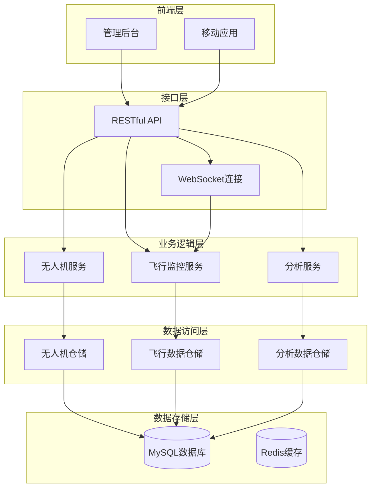
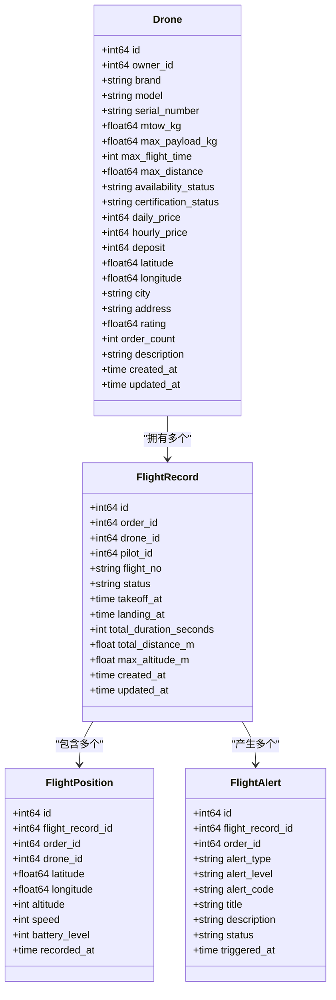
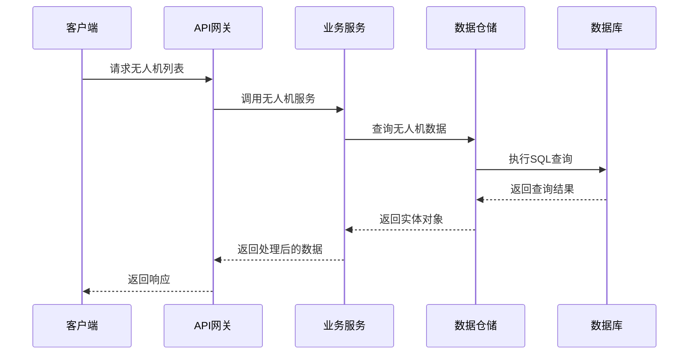
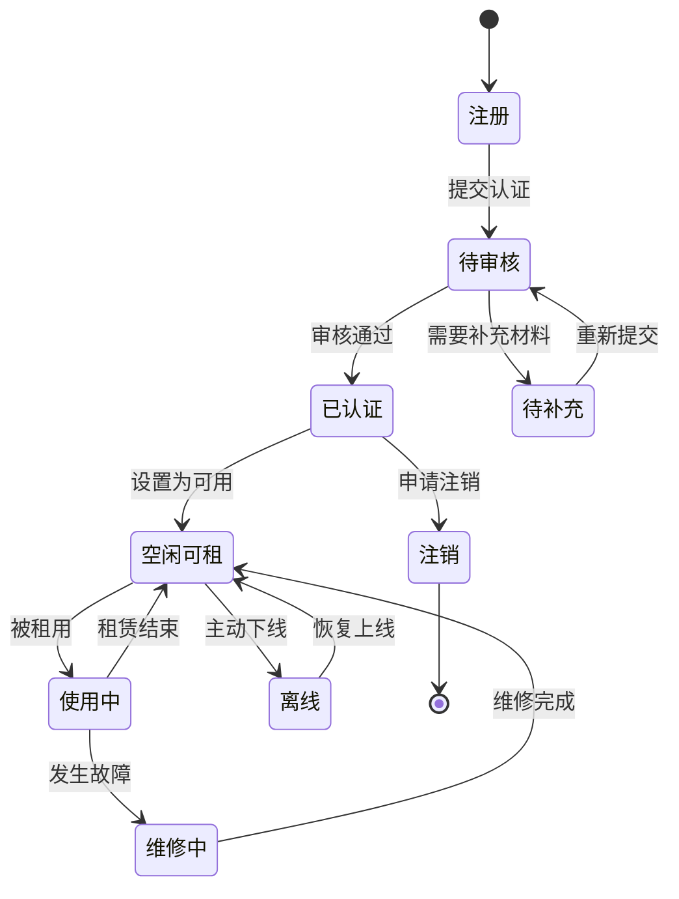
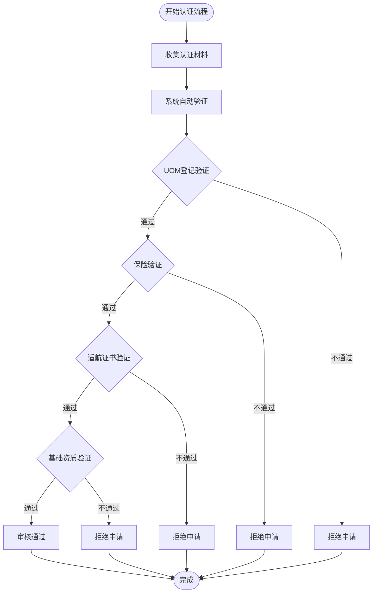
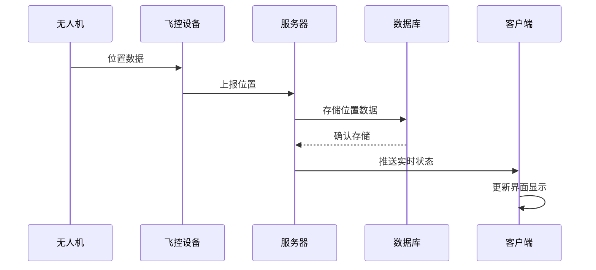
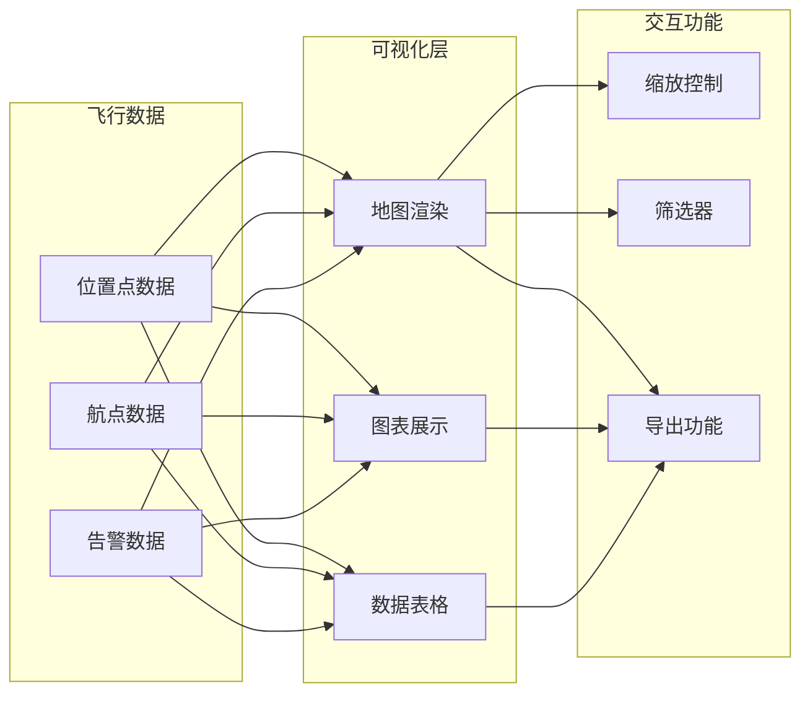
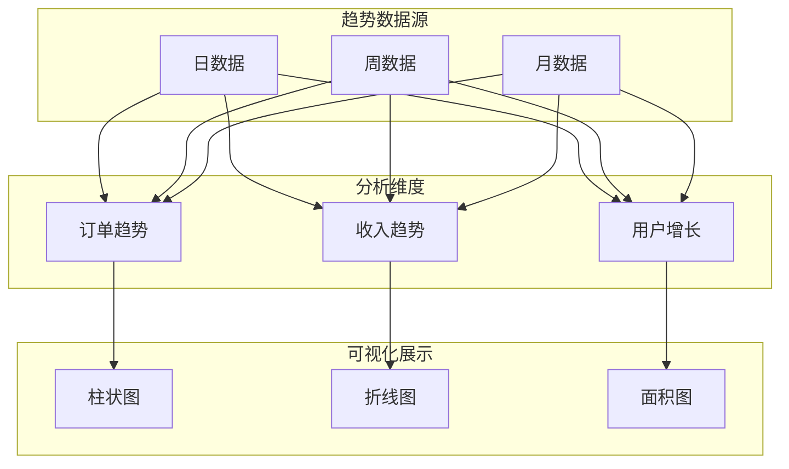
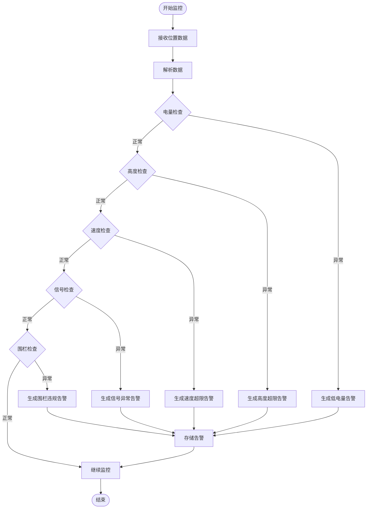
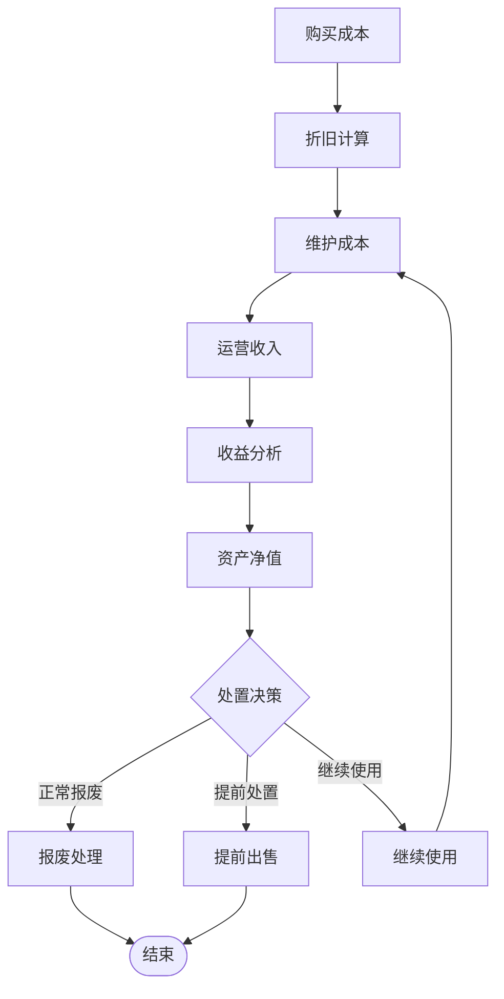

# 资产管理系统

<cite>
**本文档引用的文件**
- [models.go](file://backend/internal/model/models.go)
- [drone_service.go](file://backend/internal/service/drone_service.go)
- [flight_service.go](file://backend/internal/service/flight_service.go)
- [drone_repo.go](file://backend/internal/repository/drone_repo.go)
- [flight_repo.go](file://backend/internal/repository/flight_repo.go)
- [analytics_service.go](file://backend/internal/service/analytics_service.go)
- [DroneList.tsx](file://admin/src/pages/Drone/DroneList.tsx)
- [FlightRecordList.tsx](file://admin/src/pages/Flight/FlightRecordList.tsx)
- [AnalyticsDashboard.tsx](file://admin/src/pages/Analytics/AnalyticsDashboard.tsx)
- [MyDronesScreen.tsx](file://mobile/src/screens/drone/MyDronesScreen.tsx)
- [FlightMonitoringScreen.tsx](file://mobile/src/screens/flight/FlightMonitoringScreen.tsx)
- [drone.ts](file://mobile/src/services/drone.ts)
</cite>

## 目录
1. [项目概述](#项目概述)
2. [系统架构](#系统架构)
3. [核心组件](#核心组件)
4. [资产管理功能](#资产管理功能)
5. [飞行监控功能](#飞行监控功能)
6. [数据分析与报告](#数据分析与报告)
7. [安全监控与合规检查](#安全监控与合规检查)
8. [财务与运营分析](#财务与运营分析)
9. [使用指南](#使用指南)
10. [故障排除](#故障排除)

## 项目概述

本资产管理系统是一个基于无人机租赁业务的综合性管理平台，涵盖了无人机资产全生命周期管理、飞行监控、数据分析和合规检查等功能。系统采用前后端分离架构，包含Web管理后台、移动端应用和后端服务三层结构。

### 系统特点

- **全生命周期管理**：从无人机注册、认证到退役的完整资产管理流程
- **实时飞行监控**：基于GPS位置数据的实时飞行状态跟踪
- **智能合规检查**：自动化资质审核和合规性验证
- **数据驱动决策**：丰富的数据分析和可视化报表
- **多终端支持**：Web管理后台和移动应用双端协同

## 系统架构

**图表来源**
- [drone_service.go:13-35](file://backend/internal/service/drone_service.go#L13-L35)
- [flight_service.go:17-26](file://backend/internal/service/flight_service.go#L17-L26)
- [analytics_service.go:12-20](file://backend/internal/service/analytics_service.go#L12-L20)

## 核心组件

### 数据模型设计

系统采用清晰的数据模型设计，确保资产信息的完整性和一致性：

**图表来源**
- [models.go:91-148](file://backend/internal/model/models.go#L91-L148)
- [models.go:413-480](file://backend/internal/model/models.go#L413-L480)
- [models.go:1486-1539](file://backend/internal/model/models.go#L1486-L1539)

### 服务层架构

**图表来源**
- [drone_service.go:127-133](file://backend/internal/service/drone_service.go#L127-L133)
- [drone_repo.go:74-86](file://backend/internal/repository/drone_repo.go#L74-L86)

**章节来源**
- [models.go:91-148](file://backend/internal/model/models.go#L91-L148)
- [drone_service.go:13-35](file://backend/internal/service/drone_service.go#L13-L35)
- [drone_repo.go:9-20](file://backend/internal/repository/drone_repo.go#L9-L20)

## 资产管理功能

### 无人机资产管理

系统提供完整的无人机资产管理功能，包括设备注册、状态管理和维护记录：

#### 资产状态跟踪

**图表来源**
- [drone_service.go:142-166](file://backend/internal/service/drone_service.go#L142-L166)
- [models.go:113-116](file://backend/internal/model/models.go#L113-L116)

#### 维护计划管理

系统支持无人机维护计划的制定和跟踪：

| 维护类型 | 描述 | 周期建议 | 关键指标 |
|---------|------|----------|----------|
| 日常检查 | 外观检查、功能测试 | 每次使用前 | 电池状态、螺旋桨、外壳 |
| 定期保养 | 润滑、校准、更换易损件 | 每100飞行小时 | GPS精度、电机性能 |
| 年度检修 | 全面检测和大修 | 每年一次 | 结构完整性、载重能力 |
| 专项维修 | 针对特定问题的修复 | 按需 | 故障代码、性能参数 |

**章节来源**
- [drone_service.go:376-429](file://backend/internal/service/drone_service.go#L376-L429)
- [drone_repo.go:125-141](file://backend/internal/repository/drone_repo.go#L125-L141)

### 合规性管理

系统实现了多层次的合规性检查机制：

**图表来源**
- [drone_service.go:168-192](file://backend/internal/service/drone_service.go#L168-L192)
- [drone_service.go:203-234](file://backend/internal/service/drone_service.go#L203-L234)
- [drone_service.go:248-284](file://backend/internal/service/drone_service.go#L248-L284)

**章节来源**
- [drone_service.go:168-192](file://backend/internal/service/drone_service.go#L168-L192)
- [drone_service.go:203-234](file://backend/internal/service/drone_service.go#L203-L234)
- [drone_service.go:248-284](file://backend/internal/service/drone_service.go#L248-L284)

## 飞行监控功能

### 实时位置监控

系统提供实时的飞行位置监控和状态跟踪：

#### 飞行数据采集

**图表来源**
- [flight_service.go:113-134](file://backend/internal/service/flight_service.go#L113-L134)
- [flight_repo.go:84-95](file://backend/internal/repository/flight_repo.go#L84-L95)

#### 飞行状态分析

系统支持多种飞行状态的分析和统计：

| 分析维度 | 指标类型 | 计算方法 | 应用场景 |
|---------|----------|----------|----------|
| 飞行效率 | 平均速度 | 总距离/总时长 | 评估飞行性能 |
| 能耗分析 | 电池消耗率 | 电量变化/飞行时长 | 优化飞行计划 |
| 路线分析 | 距离偏差 | 实际距离-规划距离 | 路线优化 |
| 安全分析 | 偏航距离 | 偏离规划路径距离 | 风险评估 |

**章节来源**
- [flight_service.go:375-417](file://backend/internal/service/flight_service.go#L375-L417)
- [flight_repo.go:508-551](file://backend/internal/repository/flight_repo.go#L508-L551)

### 飞行数据可视化

系统提供丰富的飞行数据可视化功能：

#### 飞行轨迹展示

**图表来源**
- [FlightMonitoringScreen.tsx:157-203](file://mobile/src/screens/flight/FlightMonitoringScreen.tsx#L157-L203)
- [FlightMonitoringScreen.tsx:410-426](file://mobile/src/screens/flight/FlightMonitoringScreen.tsx#L410-L426)

**章节来源**
- [FlightMonitoringScreen.tsx:236-430](file://mobile/src/screens/flight/FlightMonitoringScreen.tsx#L236-L430)
- [flight_repo.go:587-648](file://backend/internal/repository/flight_repo.go#L587-L648)

## 数据分析与报告

### 实时看板

系统提供实时运营看板，展示关键业务指标：

#### 核心指标面板

| 指标类别 | 指标名称 | 计算方式 | 阈值标准 | 颜色含义 |
|---------|----------|----------|----------|----------|
| 订单指标 | 今日新订单 | 当日新增订单数 | 基准值 | 绿色：正常 |
| 收入指标 | 今日收入 | 当日订单收入 | 基准值 | 绿色：正常 |
| 运力指标 | 在线飞手 | 在线飞手数量 | 基准值 | 绿色：正常 |
| 风控指标 | 活跃告警 | 当前告警数量 | 0个 | 绿色：正常 |
| 系统指标 | 系统状态 | 健康检查 | healthy | 绿色：正常 |

#### 趋势分析

系统支持多维度的趋势分析：

**图表来源**
- [AnalyticsDashboard.tsx:206-321](file://admin/src/pages/Analytics/AnalyticsDashboard.tsx#L206-L321)
- [analytics_service.go:202-228](file://backend/internal/service/analytics_service.go#L202-L228)

**章节来源**
- [AnalyticsDashboard.tsx:96-446](file://admin/src/pages/Analytics/AnalyticsDashboard.tsx#L96-L446)
- [analytics_service.go:90-190](file://backend/internal/service/analytics_service.go#L90-L190)

### 报表生成

系统支持多种类型的报表生成：

#### 自动化报表

| 报表类型 | 生成频率 | 内容概要 | 用途 |
|---------|----------|----------|------|
| 日报 | 每日凌晨1点 | 当日运营概况 | 日常运营监控 |
| 周报 | 每周一凌晨2点 | 本周运营总结 | 周度分析 |
| 月报 | 每月1日凌晨3点 | 本月运营报告 | 月度总结 |
| 季报 | 季度首月1日 | 季度运营分析 | 季度回顾 |
| 年报 | 年度最后一天 | 年度运营总结 | 年度评估 |

**章节来源**
- [analytics_service.go:752-782](file://backend/internal/service/analytics_service.go#L752-L782)
- [AnalyticsDashboard.tsx:324-440](file://admin/src/pages/Analytics/AnalyticsDashboard.tsx#L324-L440)

## 安全监控与合规检查

### 风险预警系统

系统建立了多层次的安全监控和预警机制：

#### 飞行安全监控

**图表来源**
- [flight_service.go:471-533](file://backend/internal/service/flight_service.go#L471-L533)
- [flight_service.go:559-614](file://backend/internal/service/flight_service.go#L559-L614)

#### 合规检查机制

系统实现了自动化的合规检查流程：

| 检查项目 | 检查标准 | 验证方式 | 处理策略 |
|---------|----------|----------|----------|
| UOM登记 | 已登记且有效 | 系统自动验证 | 通过/拒绝 |
| 保险验证 | 保额≥500万，未过期 | 系统自动验证 | 通过/拒绝 |
| 适航证书 | 有效期内 | 系统自动验证 | 通过/拒绝 |
| 基础资质 | 通过审核 | 系统自动验证 | 通过/拒绝 |
| 维护记录 | 完整且及时 | 系统自动验证 | 通过/拒绝 |

**章节来源**
- [flight_service.go:471-533](file://backend/internal/service/flight_service.go#L471-L533)
- [drone_service.go:438-471](file://backend/internal/service/drone_service.go#L438-L471)

### 告警管理

系统提供完善的告警管理和处理流程：

#### 告警级别分类

| 告警级别 | 颜色标识 | 严重程度 | 处理时限 | 触发条件 |
|---------|----------|----------|----------|----------|
| 信息 | 蓝色 | 无风险 | 可忽略 | 系统提示 |
| 警告 | 黄色 | 一般风险 | 24小时内 | 参数异常 |
| 危险 | 橙色 | 较高风险 | 8小时内 | 重要参数异常 |
| 严重 | 红色 | 极高风险 | 2小时内 | 安全威胁 |

**章节来源**
- [flight_service.go:535-557](file://backend/internal/service/flight_service.go#L535-L557)
- [flight_repo.go:155-247](file://backend/internal/repository/flight_repo.go#L155-L247)

## 财务与运营分析

### 资产生命周期管理

系统支持无人机资产的全生命周期财务管理：

#### 资产价值管理

**图表来源**
- [MyDronesScreen.tsx:169-173](file://mobile/src/screens/drone/MyDronesScreen.tsx#L169-L173)

#### 折旧计算模型

系统采用多种折旧计算方法：

| 折旧方法 | 计算公式 | 适用场景 | 优缺点 |
|---------|----------|----------|--------|
| 直线法 | (原值-残值)/使用年限 | 稳定使用 | 简单易懂，折旧均匀 |
| 年数总和法 | 剩余使用年数/年数总和×(原值-残值) | 使用初期较高 | 前期折旧较高，后期较低 |
| 双倍余额递减法 | 2/预计使用年限×账面净值 | 快速回收成本 | 前期折旧高，后期低 |
| 工作量法 | (原值-残值)×实际工作量/总工作量 | 使用强度不均 | 与使用强度匹配 |

**章节来源**
- [MyDronesScreen.tsx:78-157](file://mobile/src/screens/drone/MyDronesScreen.tsx#L78-L157)
- [drone_repo.go:117-123](file://backend/internal/repository/drone_repo.go#L117-L123)

### 使用效率分析

系统提供多维度的使用效率分析：

#### 飞行效率指标

| 指标类型 | 计算公式 | 分析意义 | 优化建议 |
|---------|----------|----------|----------|
| 出租率 | 使用中时间/总时间×100% | 设备利用率 | 优化调度，减少空闲 |
| 平均飞行时长 | 总飞行时长/飞行次数 | 飞行效率 | 合理安排飞行任务 |
| 平均载重率 | 实际载重/最大载重×100% | 载重利用效率 | 优化货物装载 |
| 平均速度 | 总距离/总飞行时长 | 飞行性能 | 优化飞行路线 |
| 能耗效率 | 飞行距离/耗电量 | 能源利用效率 | 优化飞行模式 |

#### 维护效率分析

| 指标 | 计算方法 | 分析价值 | 改进方向 |
|------|----------|----------|----------|
| 故障率 | 故障次数/总飞行小时 | 设备可靠性 | 加强预防性维护 |
| 维修时间 | 维修总时长/维修次数 | 维修效率 | 优化维修流程 |
| 维修成本 | 维修总费用/总飞行小时 | 维修经济性 | 控制维修成本 |
| 预防性维护执行率 | 已执行预防性维护次数/应执行次数×100% | 维护计划执行情况 | 提高维护计划执行率 |

**章节来源**
- [analytics_service.go:555-575](file://backend/internal/service/analytics_service.go#L555-L575)
- [flight_repo.go:553-583](file://backend/internal/repository/flight_repo.go#L553-L583)

### 风险预警与合规分析

#### 风险评估模型

系统建立的风险评估指标体系：

| 风险类别 | 评估指标 | 风险等级 | 阈值标准 | 应对措施 |
|---------|----------|----------|----------|----------|
| 操作风险 | 告警次数、违规次数 | 低/中/高 | ≤5次/月 | 加强培训 |
| 市场风险 | 订单波动、价格变动 | 低/中/高 | 波动幅度 | 套期保值 |
| 财务风险 | 收入波动、成本上升 | 低/中/高 | 波动幅度 | 成本控制 |
| 合规风险 | 审核通过率、违规处罚 | 低/中/高 | ≥95% | 完善制度 |
| 技术风险 | 设备故障率、系统稳定性 | 低/中/高 | ≤2% | 技术升级 |

**章节来源**
- [analytics_service.go:577-602](file://backend/internal/service/analytics_service.go#L577-L602)
- [flight_repo.go:424-443](file://backend/internal/repository/flight_repo.go#L424-L443)

## 使用指南

### 管理后台操作指南

#### 无人机管理

1. **登录系统**：使用管理员账号登录管理后台
2. **查看无人机列表**：在左侧菜单选择"无人机管理"
3. **筛选和搜索**：使用顶部筛选器按状态、认证状态等条件筛选
4. **查看详情**：点击"详情"按钮查看无人机完整信息
5. **审核认证**：对待审核的无人机进行审核操作

#### 飞行监控

1. **进入监控页面**：在左侧菜单选择"飞行监控"
2. **选择监控对象**：从下拉列表中选择要监控的订单或无人机
3. **查看实时状态**：监控面板显示最新的飞行状态和位置信息
4. **查看历史轨迹**：点击"查看轨迹记录"查看历史飞行数据
5. **处理告警**：对出现的告警进行确认和处理

#### 数据分析

1. **打开看板**：在左侧菜单选择"数据分析"
2. **查看实时指标**：看板显示核心业务指标的实时状态
3. **查看趋势分析**：切换不同时间维度查看趋势变化
4. **生成报表**：点击"生成报表"按钮生成各类分析报表
5. **导出数据**：支持将分析结果导出为Excel或PDF格式

### 移动端操作指南

#### 机主端使用

1. **登录应用**：使用机主账号登录移动应用
2. **查看资产**：在首页查看所有无人机的实时状态
3. **更新状态**：根据设备使用情况更新可用状态
4. **查看认证进度**：查看各类认证的审核状态
5. **管理维护**：记录和查看维护保养历史

#### 飞手端使用

1. **登录应用**：使用飞手账号登录移动应用
2. **查看任务**：查看分配给自己的飞行任务
3. **实时监控**：查看当前执行中的订单监控信息
4. **上报状态**：在飞行过程中及时上报状态变化
5. **查看收益**：查看个人的收入统计和结算信息

### API接口使用

#### 无人机相关接口

| 接口 | 方法 | 路径 | 功能 | 请求参数 | 响应数据 |
|------|------|------|------|----------|----------|
| 获取无人机列表 | GET | /drone | 获取无人机列表 | page, page_size, city | PageData<Drone> |
| 获取无人机详情 | GET | /drone/{id} | 获取无人机详细信息 | id | Drone |
| 创建无人机 | POST | /drone | 创建新的无人机 | Drone | Drone |
| 更新无人机 | PUT | /drone/{id} | 更新无人机信息 | id, Drone | ApiResponse |
| 删除无人机 | DELETE | /drone/{id} | 删除无人机 | id | ApiResponse |
| 我的无人机 | GET | /drone/my | 获取当前用户的无人机 | page, page_size | PageData<Drone> |
| 附近无人机 | GET | /drone/nearby | 获取附近的无人机 | lat, lng, radius | PageData<Drone> |
| 更新可用状态 | PUT | /drone/{id}/availability | 更新无人机可用状态 | id, status | ApiResponse |

#### 飞行监控接口

| 接口 | 方法 | 路径 | 功能 | 请求参数 | 响应数据 |
|------|------|------|------|----------|----------|
| 上报位置 | POST | /flight/position | 上报飞行位置 | ReportPositionRequest | ApiResponse |
| 获取飞行记录 | GET | /flight/record | 获取飞行记录 | order_id | FlightRecord |
| 获取告警列表 | GET | /flight/alert | 获取告警列表 | order_id | FlightAlert[] |
| 获取轨迹数据 | GET | /flight/trajectory | 获取轨迹数据 | order_id | FlightTrajectory |
| 创建围栏 | POST | /flight/geofence | 创建电子围栏 | Geofence | ApiResponse |

**章节来源**
- [drone.ts:4-30](file://mobile/src/services/drone.ts#L4-L30)
- [DroneList.tsx:117-163](file://admin/src/pages/Drone/DroneList.tsx#L117-L163)
- [FlightMonitoringScreen.tsx:236-430](file://mobile/src/screens/flight/FlightMonitoringScreen.tsx#L236-L430)

## 故障排除

### 常见问题诊断

#### 无人机状态异常

**问题现象**：无人机状态显示异常或无法更新

**可能原因**：
1. 网络连接不稳定
2. 设备离线或故障
3. 权限不足
4. 系统缓存问题

**解决方案**：
1. 检查网络连接状态
2. 确认设备在线状态
3. 验证用户权限
4. 清除浏览器缓存后重试

#### 飞行数据延迟

**问题现象**：飞行监控数据更新延迟

**可能原因**：
1. 位置上报频率设置过高
2. 服务器负载过大
3. 网络传输问题
4. 客户端缓存问题

**解决方案**：
1. 调整位置上报间隔
2. 检查服务器性能
3. 优化网络配置
4. 刷新页面或重启应用

#### 报表生成失败

**问题现象**：报表生成过程中出现错误

**可能原因**：
1. 数据库连接异常
2. 内存不足
3. 文件权限问题
4. 生成时间过长

**解决方案**：
1. 检查数据库连接
2. 增加系统内存
3. 检查文件权限
4. 优化查询性能

### 系统监控

#### 性能监控指标

| 监控指标 | 正常范围 | 警告阈值 | 异常阈值 | 监控方法 |
|---------|----------|----------|----------|----------|
| API响应时间 | <500ms | 500-1000ms | >1000ms | 应用监控 |
| 数据库连接数 | <100 | 100-150 | >150 | 数据库监控 |
| 内存使用率 | <70% | 70-85% | >85% | 系统监控 |
| CPU使用率 | <80% | 80-90% | >90% | 系统监控 |
| 磁盘空间 | >20% | 20-10% | <10% | 系统监控 |

#### 日志分析

系统提供详细的日志记录和分析功能：

**日志类型**：
- 系统日志：记录系统运行状态和错误信息
- 业务日志：记录关键业务操作和流程
- 访问日志：记录用户访问行为和操作
- 错误日志：记录系统错误和异常情况

**日志分析工具**：
1. 实时日志查看
2. 日志搜索和过滤
3. 日志统计分析
4. 错误趋势分析

### 维护指南

#### 定期维护任务

**每日任务**：
1. 检查系统运行状态
2. 监控关键指标
3. 备份重要数据
4. 清理临时文件

**每周任务**：
1. 分析系统性能
2. 检查磁盘空间
3. 更新安全补丁
4. 备份系统配置

**每月任务**：
1. 生成月度报表
2. 分析使用趋势
3. 优化系统配置
4. 备份完整数据

#### 应急预案

**系统故障**：
1. 立即启动备用系统
2. 通知技术支持团队
3. 评估影响范围
4. 制定恢复计划

**数据丢失**：
1. 立即停止写入操作
2. 检查备份系统
3. 恢复最近备份
4. 分析数据丢失原因

**网络安全事件**：
1. 立即隔离受影响系统
2. 通知安全部门
3. 分析攻击方式
4. 加强安全防护

**章节来源**
- [flight_service.go:71-82](file://backend/internal/service/flight_service.go#L71-L82)
- [drone_repo.go:117-123](file://backend/internal/repository/drone_repo.go#L117-L123)
- [analytics_service.go:740-782](file://backend/internal/service/analytics_service.go#L740-L782)