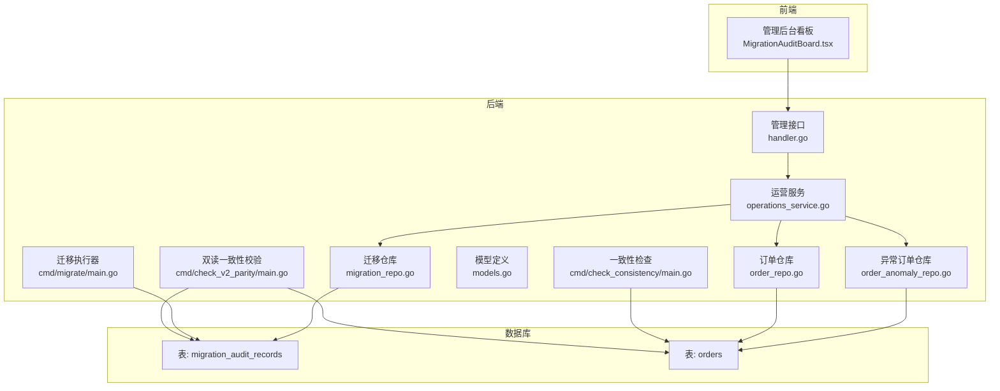
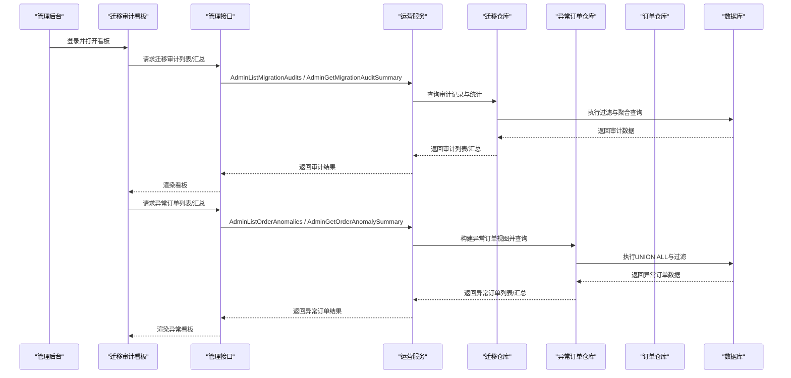
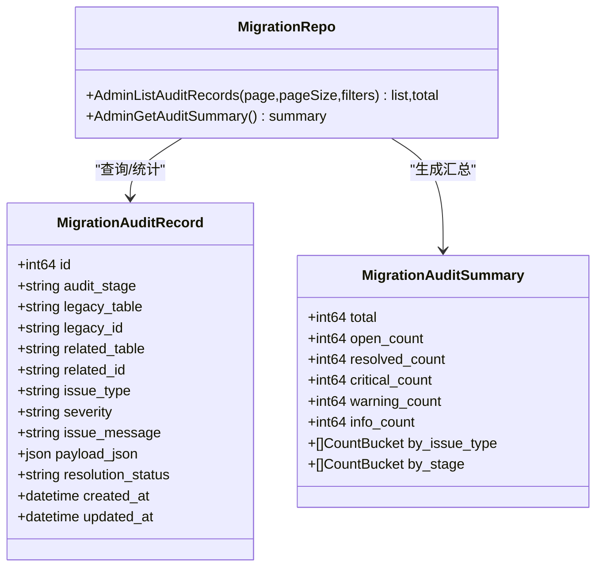
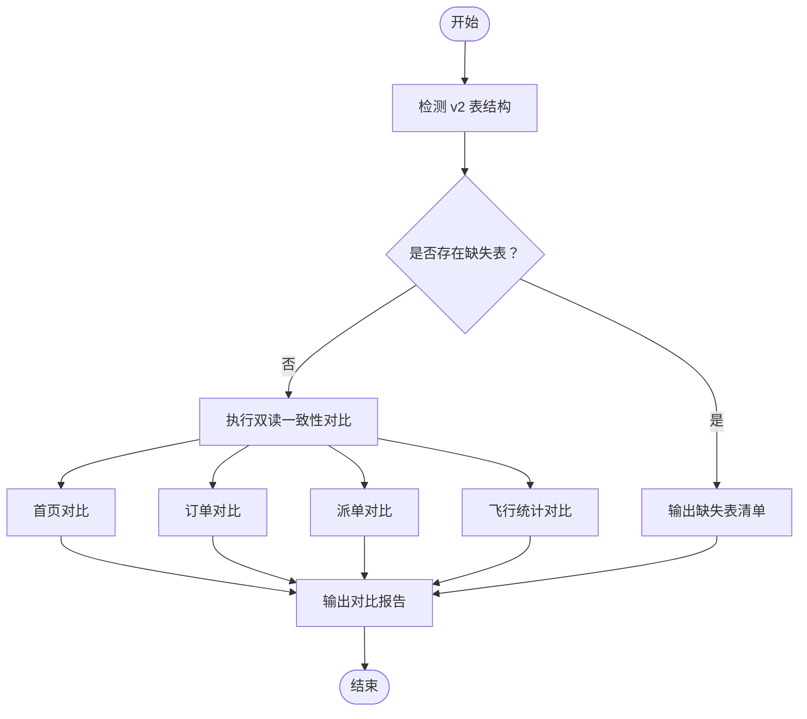
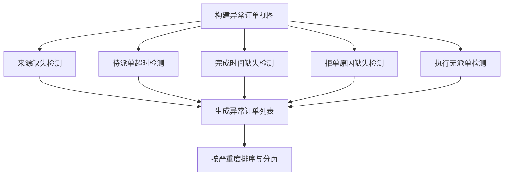
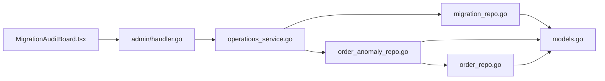

# 运营审计

<cite>
**本文引用的文件**
- [backend/internal/service/operations_service.go](file://backend/internal/service/operations_service.go)
- [backend/internal/repository/migration_repo.go](file://backend/internal/repository/migration_repo.go)
- [backend/internal/repository/order_anomaly_repo.go](file://backend/internal/repository/order_anomaly_repo.go)
- [backend/internal/repository/order_repo.go](file://backend/internal/repository/order_repo.go)
- [backend/internal/model/models.go](file://backend/internal/model/models.go)
- [admin/src/pages/Operations/MigrationAuditBoard.tsx](file://admin/src/pages/Operations/MigrationAuditBoard.tsx)
- [backend/cmd/migrate/main.go](file://backend/cmd/migrate/main.go)
- [backend/cmd/check_consistency/main.go](file://backend/cmd/check_consistency/main.go)
- [backend/cmd/check_v2_parity/main.go](file://backend/cmd/check_v2_parity/main.go)
- [backend/docs/PHASE9_MIGRATION_RUNBOOK.md](file://backend/docs/PHASE9_MIGRATION_RUNBOOK.md)
</cite>

## 目录
1. [简介](#简介)
2. [项目结构](#项目结构)
3. [核心组件](#核心组件)
4. [架构总览](#架构总览)
5. [详细组件分析](#详细组件分析)
6. [依赖分析](#依赖分析)
7. [性能考虑](#性能考虑)
8. [故障排查指南](#故障排查指南)
9. [结论](#结论)
10. [附录](#附录)

## 简介
本文件系统化梳理无人机租赁平台的运营审计体系，覆盖数据迁移审计、系统变更监控、合规性检查、异常检测、风险评估、迁移过程监控、数据一致性检查、操作回滚等运维保障能力，并提供审计报告生成、合规性证明、风险预警等监管合规工具的使用指南。文档以代码为依据，结合前端看板与后端工具链，形成从“发现问题—定位问题—治理问题—验证效果”的闭环。

## 项目结构
- 后端
  - 服务层：封装运营审计相关接口，聚合仓库层查询与汇总。
  - 仓库层：提供迁移审计记录与异常订单的查询、过滤、分页与统计。
  - 模型层：定义迁移审计记录、异常订单、实体映射等数据结构。
  - 命令行工具：迁移执行器、一致性检查器、双读一致性校验器。
  - 文档：阶段九迁移执行手册，明确回滚策略与验证重点。
- 前端
  - 运维看板：集中展示迁移审计与异常订单的统计与明细，支持筛选与导出。

**图表来源**
- [admin/src/pages/Operations/MigrationAuditBoard.tsx:106-179](file://admin/src/pages/Operations/MigrationAuditBoard.tsx#L106-L179)
- [backend/internal/api/v1/admin/handler.go:317-384](file://backend/internal/api/v1/admin/handler.go#L317-L384)
- [backend/internal/service/operations_service.go:20-35](file://backend/internal/service/operations_service.go#L20-L35)
- [backend/internal/repository/migration_repo.go:23-59](file://backend/internal/repository/migration_repo.go#L23-L59)
- [backend/internal/repository/order_anomaly_repo.go:13-30](file://backend/internal/repository/order_anomaly_repo.go#L13-L30)
- [backend/internal/repository/order_repo.go:133-158](file://backend/internal/repository/order_repo.go#L133-L158)
- [backend/cmd/migrate/main.go:25-87](file://backend/cmd/migrate/main.go#L25-L87)
- [backend/cmd/check_consistency/main.go:12-141](file://backend/cmd/check_consistency/main.go#L12-L141)
- [backend/cmd/check_v2_parity/main.go:89-145](file://backend/cmd/check_v2_parity/main.go#L89-L145)

**章节来源**
- [admin/src/pages/Operations/MigrationAuditBoard.tsx:106-179](file://admin/src/pages/Operations/MigrationAuditBoard.tsx#L106-L179)
- [backend/internal/api/v1/admin/handler.go:317-384](file://backend/internal/api/v1/admin/handler.go#L317-L384)
- [backend/internal/service/operations_service.go:20-35](file://backend/internal/service/operations_service.go#L20-L35)
- [backend/internal/repository/migration_repo.go:23-59](file://backend/internal/repository/migration_repo.go#L23-L59)
- [backend/internal/repository/order_anomaly_repo.go:13-30](file://backend/internal/repository/order_anomaly_repo.go#L13-L30)
- [backend/internal/repository/order_repo.go:133-158](file://backend/internal/repository/order_repo.go#L133-L158)
- [backend/cmd/migrate/main.go:25-87](file://backend/cmd/migrate/main.go#L25-L87)
- [backend/cmd/check_consistency/main.go:12-141](file://backend/cmd/check_consistency/main.go#L12-L141)
- [backend/cmd/check_v2_parity/main.go:89-145](file://backend/cmd/check_v2_parity/main.go#L89-L145)

## 核心组件
- 运营服务（OperationsService）
  - 提供迁移审计与异常订单的列表、汇总查询能力，作为管理接口的业务编排层。
- 迁移仓库（MigrationRepo）
  - 支持按严重度、处理状态、问题类型、审计阶段、关键词等条件过滤迁移审计记录；提供按严重度与阶段分布的统计。
- 异常订单仓库（OrderAnomalyRepo）
  - 构建异常订单的统一视图，包含来源缺失、状态异常、派单异常等多类异常；支持按异常类型、严重度、状态、关键词过滤与分页。
- 订单仓库（OrderRepo）
  - 提供订单列表、按用户/角色查询、状态统计等基础能力，支撑异常订单的上下文展示。
- 模型定义（Models）
  - 定义迁移审计记录、异常订单、实体映射等结构体及字段，确保前后端与数据库一致。
- 前端看板（MigrationAuditBoard）
  - 提供迁移审计与异常订单的可视化看板，支持筛选、分页、详情弹窗与统计卡片。

**章节来源**
- [backend/internal/service/operations_service.go:20-35](file://backend/internal/service/operations_service.go#L20-L35)
- [backend/internal/repository/migration_repo.go:23-59](file://backend/internal/repository/migration_repo.go#L23-L59)
- [backend/internal/repository/order_anomaly_repo.go:13-30](file://backend/internal/repository/order_anomaly_repo.go#L13-L30)
- [backend/internal/repository/order_repo.go:133-158](file://backend/internal/repository/order_repo.go#L133-L158)
- [backend/internal/model/models.go:670-733](file://backend/internal/model/models.go#L670-L733)
- [admin/src/pages/Operations/MigrationAuditBoard.tsx:106-179](file://admin/src/pages/Operations/MigrationAuditBoard.tsx#L106-L179)

## 架构总览
运营审计体系由“前端看板—后端接口—服务层—仓库层—数据库—运维工具”构成，形成“可观测—可治理—可验证”的闭环。

**图表来源**
- [admin/src/pages/Operations/MigrationAuditBoard.tsx:128-174](file://admin/src/pages/Operations/MigrationAuditBoard.tsx#L128-L174)
- [backend/internal/api/v1/admin/handler.go:317-384](file://backend/internal/api/v1/admin/handler.go#L317-L384)
- [backend/internal/service/operations_service.go:20-35](file://backend/internal/service/operations_service.go#L20-L35)
- [backend/internal/repository/migration_repo.go:23-59](file://backend/internal/repository/migration_repo.go#L23-L59)
- [backend/internal/repository/order_anomaly_repo.go:13-30](file://backend/internal/repository/order_anomaly_repo.go#L13-L30)

## 详细组件分析

### 数据迁移审计
- 数据模型
  - 迁移审计记录包含审计阶段、旧表/旧ID、关联新表/新ID、问题类型、严重度、问题描述、补充上下文、处理状态等字段。
- 查询与过滤
  - 支持按严重度、处理状态、问题类型、审计阶段、关键词过滤；按严重度优先级与更新时间排序。
- 统计与分布
  - 提供总数量、开放/已解决数量、严重度分布、问题类型分布、阶段分布等汇总信息。
- 运维工具
  - 迁移执行器按编号范围或精确集合执行 SQL 迁移，支持 dry-run 预演。
  - 双读一致性校验器对比 v1 与 v2 的首页、订单、派单、飞行统计，输出差异报告。
  - 一致性检查器对关键状态进行一致性校验，辅助定位问题。

**图表来源**
- [backend/internal/model/models.go:670-688](file://backend/internal/model/models.go#L670-L688)
- [backend/internal/repository/migration_repo.go:23-59](file://backend/internal/repository/migration_repo.go#L23-L59)
- [backend/internal/model/models.go:695-704](file://backend/internal/model/models.go#L695-L704)

**章节来源**
- [backend/internal/model/models.go:670-688](file://backend/internal/model/models.go#L670-L688)
- [backend/internal/repository/migration_repo.go:23-59](file://backend/internal/repository/migration_repo.go#L23-L59)
- [backend/internal/model/models.go:695-704](file://backend/internal/model/models.go#L695-L704)
- [backend/cmd/migrate/main.go:25-87](file://backend/cmd/migrate/main.go#L25-L87)
- [backend/cmd/check_v2_parity/main.go:298-317](file://backend/cmd/check_v2_parity/main.go#L298-L317)
- [backend/cmd/check_consistency/main.go:12-141](file://backend/cmd/check_consistency/main.go#L12-L141)

### 系统变更监控
- 变更入口
  - 迁移执行器：按编号范围/集合执行 SQL，支持 dry-run。
  - 双读一致性校验器：对比 v1 与 v2 的关键指标，输出差异报告。
- 监控指标
  - v2 表结构完整性检测（缺失表清单）。
  - 首页、订单、派单、飞行统计的对比结果。
- 回滚策略
  - 阶段九迁移涉及结构变更，推荐执行前做数据库快照；若回填失败，基于审计记录识别问题并重试。

**图表来源**
- [backend/cmd/check_v2_parity/main.go:298-317](file://backend/cmd/check_v2_parity/main.go#L298-L317)
- [backend/cmd/check_v2_parity/main.go:319-341](file://backend/cmd/check_v2_parity/main.go#L319-L341)
- [backend/cmd/check_v2_parity/main.go:343-371](file://backend/cmd/check_v2_parity/main.go#L343-L371)
- [backend/cmd/check_v2_parity/main.go:373-393](file://backend/cmd/check_v2_parity/main.go#L373-L393)

**章节来源**
- [backend/cmd/migrate/main.go:25-87](file://backend/cmd/migrate/main.go#L25-L87)
- [backend/cmd/check_v2_parity/main.go:298-317](file://backend/cmd/check_v2_parity/main.go#L298-L317)
- [backend/docs/PHASE9_MIGRATION_RUNBOOK.md:52-71](file://backend/docs/PHASE9_MIGRATION_RUNBOOK.md#L52-L71)

### 合规性检查
- 合规维度
  - 数据完整性：迁移审计记录覆盖未落稳数据、来源缺失、状态异常等。
  - 结构合规：v2 表结构完整性检测。
  - 一致性合规：双读一致性校验，确保切流前后业务数据等价。
- 前端看板
  - 提供统计卡片与分布图，直观展示严重问题与开放问题分布。
  - 支持关键词搜索、严重度与处理状态筛选，便于合规审查与整改追踪。

**章节来源**
- [admin/src/pages/Operations/MigrationAuditBoard.tsx:241-262](file://admin/src/pages/Operations/MigrationAuditBoard.tsx#L241-L262)
- [admin/src/pages/Operations/MigrationAuditBoard.tsx:302-323](file://admin/src/pages/Operations/MigrationAuditBoard.tsx#L302-L323)
- [admin/src/pages/Operations/MigrationAuditBoard.tsx:373-394](file://admin/src/pages/Operations/MigrationAuditBoard.tsx#L373-L394)

### 异常检测与风险评估
- 异常类型
  - 直达订单缺少 source_supply_id、需求转单缺少 demand_id。
  - 长时间待派单（超过阈值）。
  - 已完成订单缺少完成时间戳。
  - 机主拒单未记录原因。
  - 需要派单却无正式派单记录。
- 风险等级
  - 严重（critical）、警告（warning）、提示（info）三级分级，优先处置严重问题。
- 评估方法
  - 基于 SQL UNION ALL 构建异常订单视图，按严重度与更新时间排序，支持分页与统计。

**图表来源**
- [backend/internal/repository/order_anomaly_repo.go:121-294](file://backend/internal/repository/order_anomaly_repo.go#L121-L294)

**章节来源**
- [backend/internal/repository/order_anomaly_repo.go:13-30](file://backend/internal/repository/order_anomaly_repo.go#L13-L30)
- [backend/internal/repository/order_anomaly_repo.go:84-119](file://backend/internal/repository/order_anomaly_repo.go#L84-L119)
- [backend/internal/repository/order_anomaly_repo.go:121-294](file://backend/internal/repository/order_anomaly_repo.go#L121-L294)

### 运维保障：迁移过程监控、数据一致性检查、操作回滚
- 迁移过程监控
  - 迁移执行器支持按编号范围/集合执行，dry-run 预演，输出将执行的 SQL 序列。
  - 迁移审计记录表记录每个问题的上下文与处理状态，便于过程审计。
- 数据一致性检查
  - 一致性检查器对关键状态进行一致性校验，如无人机状态与活跃订单数的关系。
- 操作回滚
  - 阶段九迁移涉及结构变更，推荐执行前做数据库快照；若回填失败，基于审计记录识别问题并重试。

**章节来源**
- [backend/cmd/migrate/main.go:25-87](file://backend/cmd/migrate/main.go#L25-L87)
- [backend/cmd/check_consistency/main.go:12-141](file://backend/cmd/check_consistency/main.go#L12-L141)
- [backend/docs/PHASE9_MIGRATION_RUNBOOK.md:52-71](file://backend/docs/PHASE9_MIGRATION_RUNBOOK.md#L52-L71)

### 审计报告生成、合规性证明、风险预警
- 审计报告生成
  - 看板提供统计卡片与分布图，支持导出与归档。
- 合规性证明
  - 双读一致性校验器输出对比报告，包含缺失表清单与各模块对比结果。
- 风险预警
  - 严重问题优先展示，支持按严重度筛选与分页，便于运营人员快速响应。

**章节来源**
- [admin/src/pages/Operations/MigrationAuditBoard.tsx:241-262](file://admin/src/pages/Operations/MigrationAuditBoard.tsx#L241-L262)
- [backend/cmd/check_v2_parity/main.go:134-145](file://backend/cmd/check_v2_parity/main.go#L134-L145)

## 依赖分析
- 组件耦合
  - 看板依赖管理接口；管理接口依赖运营服务；运营服务依赖迁移与异常订单仓库；仓库依赖模型与数据库。
- 外部依赖
  - MySQL 驱动、GORM ORM、Zap 日志库、Ant Design 前端组件库。
- 潜在循环依赖
  - 当前结构清晰，未发现循环依赖迹象。

**图表来源**
- [admin/src/pages/Operations/MigrationAuditBoard.tsx:106-179](file://admin/src/pages/Operations/MigrationAuditBoard.tsx#L106-L179)
- [backend/internal/api/v1/admin/handler.go:317-384](file://backend/internal/api/v1/admin/handler.go#L317-L384)
- [backend/internal/service/operations_service.go:20-35](file://backend/internal/service/operations_service.go#L20-L35)
- [backend/internal/repository/migration_repo.go:23-59](file://backend/internal/repository/migration_repo.go#L23-L59)
- [backend/internal/repository/order_anomaly_repo.go:13-30](file://backend/internal/repository/order_anomaly_repo.go#L13-L30)
- [backend/internal/repository/order_repo.go:133-158](file://backend/internal/repository/order_repo.go#L133-L158)
- [backend/internal/model/models.go:670-733](file://backend/internal/model/models.go#L670-L733)

**章节来源**
- [admin/src/pages/Operations/MigrationAuditBoard.tsx:106-179](file://admin/src/pages/Operations/MigrationAuditBoard.tsx#L106-L179)
- [backend/internal/api/v1/admin/handler.go:317-384](file://backend/internal/api/v1/admin/handler.go#L317-L384)
- [backend/internal/service/operations_service.go:20-35](file://backend/internal/service/operations_service.go#L20-L35)
- [backend/internal/repository/migration_repo.go:23-59](file://backend/internal/repository/migration_repo.go#L23-L59)
- [backend/internal/repository/order_anomaly_repo.go:13-30](file://backend/internal/repository/order_anomaly_repo.go#L13-L30)
- [backend/internal/repository/order_repo.go:133-158](file://backend/internal/repository/order_repo.go#L133-L158)
- [backend/internal/model/models.go:670-733](file://backend/internal/model/models.go#L670-L733)

## 性能考虑
- 查询优化
  - 迁移审计与异常订单查询均支持多字段过滤与排序，建议在高频查询字段上建立合适索引。
- 分页与缓存
  - 前端采用分页加载，后端按严重度优先级与更新时间排序，避免一次性返回大量数据。
- 工具链效率
  - 迁移执行器支持 dry-run，减少误操作风险；双读一致性校验器按用户抽样对比，降低全量对比成本。

## 故障排查指南
- 迁移失败
  - 使用迁移执行器的 dry-run 预演，核对将执行的 SQL 序列；根据错误信息定位具体语句。
  - 若回填失败，查看迁移审计记录，识别未处理数据并重试。
- 一致性异常
  - 使用一致性检查器对关键状态进行校验，定位状态不一致的记录。
  - 使用双读一致性校验器输出对比报告，结合看板统计进行问题归因。
- 前端看板无数据
  - 确认管理接口已正确调用运营服务；检查仓库层查询条件与数据库表结构是否匹配。

**章节来源**
- [backend/cmd/migrate/main.go:25-87](file://backend/cmd/migrate/main.go#L25-L87)
- [backend/cmd/check_consistency/main.go:12-141](file://backend/cmd/check_consistency/main.go#L12-L141)
- [backend/cmd/check_v2_parity/main.go:134-145](file://backend/cmd/check_v2_parity/main.go#L134-L145)
- [admin/src/pages/Operations/MigrationAuditBoard.tsx:128-174](file://admin/src/pages/Operations/MigrationAuditBoard.tsx#L128-L174)

## 结论
本运营审计体系通过“前端看板—后端接口—服务层—仓库层—数据库—运维工具”的协同，实现了对数据迁移、系统变更、异常订单的全生命周期审计与治理。配合阶段九迁移执行手册与双读一致性校验工具，能够有效保障切流质量与合规性，提升运维效率与风险控制能力。

## 附录
- 使用指南
  - 迁移执行：在 backend 目录执行迁移命令，先执行结构准备脚本，再执行回填脚本，最后查看审计记录与看板。
  - 双读校验：在迁移完成后执行双读一致性校验，核对首页、订单、派单、飞行统计等模块的对比结果。
  - 异常治理：在看板中筛选严重问题，结合审计记录与异常订单详情进行整改与验证。

**章节来源**
- [backend/docs/PHASE9_MIGRATION_RUNBOOK.md:26-51](file://backend/docs/PHASE9_MIGRATION_RUNBOOK.md#L26-L51)
- [backend/cmd/check_v2_parity/main.go:134-145](file://backend/cmd/check_v2_parity/main.go#L134-L145)
- [admin/src/pages/Operations/MigrationAuditBoard.tsx:128-174](file://admin/src/pages/Operations/MigrationAuditBoard.tsx#L128-L174)