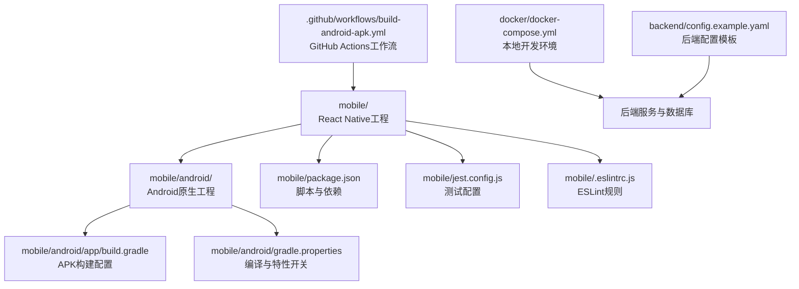
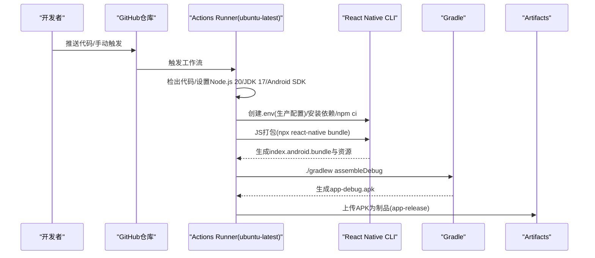
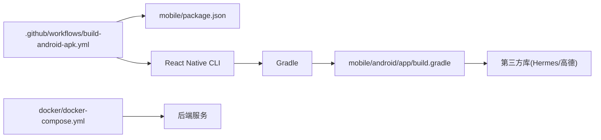

# CI/CD流水线

<cite>
**本文引用的文件**
- [.github/workflows/build-android-apk.yml](file://.github/workflows/build-android-apk.yml)
- [mobile/package.json](file://mobile/package.json)
- [mobile/app.json](file://mobile/app.json)
- [mobile/android/gradle.properties](file://mobile/android/gradle.properties)
- [mobile/android/build.gradle](file://mobile/android/build.gradle)
- [mobile/android/app/build.gradle](file://mobile/android/app/build.gradle)
- [mobile/jest.config.js](file://mobile/jest.config.js)
- [mobile/.eslintrc.js](file://mobile/.eslintrc.js)
- [mobile/__tests__/App.test.tsx](file://mobile/__tests__/App.test.tsx)
- [mobile/README.md](file://mobile/README.md)
- [docker/docker-compose.yml](file://docker/docker-compose.yml)
- [backend/config.example.yaml](file://backend/config.example.yaml)
- [README.md](file://README.md)
</cite>

## 目录
1. [简介](#简介)
2. [项目结构](#项目结构)
3. [核心组件](#核心组件)
4. [架构总览](#架构总览)
5. [详细组件分析](#详细组件分析)
6. [依赖关系分析](#依赖关系分析)
7. [性能考虑](#性能考虑)
8. [故障排查指南](#故障排查指南)
9. [结论](#结论)
10. [附录](#附录)

## 简介
本文件面向无人机租赁平台的开发团队，提供基于GitHub Actions的CI/CD流水线配置与操作指南。重点覆盖：
- Android APK构建流程与触发条件
- 代码质量检查与自动化测试执行
- 环境变量与构建产物管理
- 移动端APK打包配置与签名证书策略
- 版本号与构建产物命名规范
- 代码审查流程与测试覆盖率要求
- 部署前检查清单与最佳实践

## 项目结构
本仓库采用多模块组织方式，CI/CD主要涉及移动端RN工程与后端Go服务。Android构建由GitHub Actions在ubuntu环境中完成，前端RN工程通过NPM脚本与Gradle进行打包。

图表来源
- [.github/workflows/build-android-apk.yml:1-74](file://.github/workflows/build-android-apk.yml#L1-L74)
- [mobile/android/app/build.gradle:1-127](file://mobile/android/app/build.gradle#L1-L127)
- [mobile/android/gradle.properties:1-48](file://mobile/android/gradle.properties#L1-L48)
- [mobile/package.json:1-63](file://mobile/package.json#L1-L63)
- [mobile/jest.config.js:1-4](file://mobile/jest.config.js#L1-L4)
- [mobile/.eslintrc.js:1-5](file://mobile/.eslintrc.js#L1-L5)
- [docker/docker-compose.yml:1-27](file://docker/docker-compose.yml#L1-L27)
- [backend/config.example.yaml:1-338](file://backend/config.example.yaml#L1-L338)

章节来源
- [.github/workflows/build-android-apk.yml:1-74](file://.github/workflows/build-android-apk.yml#L1-L74)
- [mobile/android/app/build.gradle:1-127](file://mobile/android/app/build.gradle#L1-L127)
- [mobile/android/gradle.properties:1-48](file://mobile/android/gradle.properties#L1-L48)
- [mobile/package.json:1-63](file://mobile/package.json#L1-L63)
- [mobile/jest.config.js:1-4](file://mobile/jest.config.js#L1-L4)
- [mobile/.eslintrc.js:1-5](file://mobile/.eslintrc.js#L1-L5)
- [docker/docker-compose.yml:1-27](file://docker/docker-compose.yml#L1-L27)
- [backend/config.example.yaml:1-338](file://backend/config.example.yaml#L1-L338)

## 核心组件
- GitHub Actions工作流：负责检出代码、安装依赖、构建APK并上传制品。
- RN工程：通过NPM脚本与React Native CLI进行JS打包与原生构建。
- Android Gradle工程：定义SDK版本、签名配置、构建类型与资源注入。
- 测试与质量工具：Jest测试框架与ESLint代码规范。
- 本地开发环境：Docker Compose组合MySQL与Redis，支撑后端服务。

章节来源
- [.github/workflows/build-android-apk.yml:1-74](file://.github/workflows/build-android-apk.yml#L1-L74)
- [mobile/package.json:1-63](file://mobile/package.json#L1-L63)
- [mobile/android/app/build.gradle:1-127](file://mobile/android/app/build.gradle#L1-L127)
- [mobile/jest.config.js:1-4](file://mobile/jest.config.js#L1-L4)
- [mobile/.eslintrc.js:1-5](file://mobile/.eslintrc.js#L1-L5)
- [docker/docker-compose.yml:1-27](file://docker/docker-compose.yml#L1-L27)

## 架构总览
下图展示了从代码提交到APK产物的流水线全貌，包括触发条件、步骤与产物归档。

图表来源
- [.github/workflows/build-android-apk.yml:12-73](file://.github/workflows/build-android-apk.yml#L12-L73)

章节来源
- [.github/workflows/build-android-apk.yml:1-74](file://.github/workflows/build-android-apk.yml#L1-L74)

## 详细组件分析

### GitHub Actions工作流配置
- 触发条件
  - 推送至main/master分支
  - 手动触发(workflow_dispatch)
- 运行环境
  - ubuntu-latest
  - Node.js 20（含npm缓存）
  - JDK 17
  - Android SDK（通过android-actions/setup-android）
- 关键步骤
  - 检出代码
  - 创建.env文件注入生产环境变量
  - 安装依赖（npm ci）
  - 使gradlew可执行
  - 准备assets目录
  - JS打包与APK构建（assembleDebug）
  - 上传制品（app-debug.apk），保留30天

章节来源
- [.github/workflows/build-android-apk.yml:3-73](file://.github/workflows/build-android-apk.yml#L3-L73)

### 移动端APK打包配置
- 应用标识与版本
  - applicationId与versionCode/versionName在app/build.gradle中定义
  - 当前versionCode为1，versionName为1.0
- 构建类型与签名
  - debug/release构建类型均使用debug签名配置
  - release构建未启用混淆（enableProguardInReleaseBuilds为false）
- 构建变体与架构
  - reactNativeArchitectures包含armeabi-v7a/arm64-v8a/x86/x86_64
- 资源与第三方库
  - 高德地图SDK依赖已声明
  - hermesEnabled为true，使用Hermes引擎

章节来源
- [mobile/android/app/build.gradle:80-112](file://mobile/android/app/build.gradle#L80-L112)
- [mobile/android/gradle.properties:25-39](file://mobile/android/gradle.properties#L25-L39)

### 环境变量与配置注入
- .env文件注入
  - 在工作流中动态创建.env，包含API_BASE_URL、WS_BASE_URL、API_TIMEOUT、APP_ENV、DEBUG_MODE
- Manifest占位符
  - 通过manifestPlaceholders注入高德地图Android Key
- Gradle属性
  - AMAP_ANDROID_KEY在gradle.properties中定义

章节来源
- [.github/workflows/build-android-apk.yml:32-41](file://.github/workflows/build-android-apk.yml#L32-L41)
- [mobile/android/app/build.gradle:88-91](file://mobile/android/app/build.gradle#L88-L91)
- [mobile/android/gradle.properties:46-47](file://mobile/android/gradle.properties#L46-L47)

### 代码质量与测试
- ESLint
  - 继承@react-native规则，统一代码风格
- Jest测试
  - preset为react-native，已提供基础测试入口
  - 工作流中未包含lint/test步骤，可在后续扩展

章节来源
- [mobile/.eslintrc.js:1-5](file://mobile/.eslintrc.js#L1-L5)
- [mobile/jest.config.js:1-4](file://mobile/jest.config.js#L1-L4)
- [mobile/__tests__/App.test.tsx:1-14](file://mobile/__tests__/App.test.tsx#L1-L14)

### 构建产物管理
- 产物位置
  - app-debug.apk位于android/app/build/outputs/apk/debug/
- 归档命名
  - 上传制品名为app-release
- 保留策略
  - 保留30天

章节来源
- [.github/workflows/build-android-apk.yml:68-73](file://.github/workflows/build-android-apk.yml#L68-L73)

### 版本号与构建产物命名规范
- 当前版本
  - versionCode=1，versionName=1.0
- 建议策略
  - 使用CI自动递增versionCode
  - 语义化版本号管理（如MAJOR.MINOR.PATCH）
  - 为不同渠道/构建类型维护独立命名与标签

章节来源
- [mobile/android/app/build.gradle:85-86](file://mobile/android/app/build.gradle#L85-L86)

### 代码审查流程与测试覆盖率要求
- 代码审查
  - PR需通过CI构建与测试（建议在PR检查中启用）
- 测试覆盖率
  - 当前未配置覆盖率统计与阈值
  - 建议在Jest中启用覆盖率统计，并设置最低覆盖率阈值

章节来源
- [mobile/jest.config.js:1-4](file://mobile/jest.config.js#L1-L4)

### 部署前检查清单
- Android签名
  - release签名需替换为正式keystore（当前使用debug签名）
- 环境变量
  - 确认API_BASE_URL、WS_BASE_URL、DEBUG_MODE等符合目标环境
- 构建类型
  - 明确使用assembleDebug还是assembleRelease
- 产物校验
  - 校验APK完整性与签名信息

章节来源
- [mobile/android/app/build.gradle:93-112](file://mobile/android/app/build.gradle#L93-L112)
- [.github/workflows/build-android-apk.yml:55-66](file://.github/workflows/build-android-apk.yml#L55-L66)

## 依赖关系分析
- 工作流对RN工程的依赖
  - 依赖NPM脚本与React Native CLI进行JS打包
  - 依赖Gradle进行原生构建
- Gradle对第三方库的依赖
  - 高德地图SDK、Hermes或JSC引擎
- 本地开发环境对后端服务的依赖
  - Docker Compose启动MySQL与Redis，支撑后端服务

图表来源
- [.github/workflows/build-android-apk.yml:12-66](file://.github/workflows/build-android-apk.yml#L12-L66)
- [mobile/package.json:5-12](file://mobile/package.json#L5-L12)
- [mobile/android/app/build.gradle:115-126](file://mobile/android/app/build.gradle#L115-L126)
- [docker/docker-compose.yml:1-27](file://docker/docker-compose.yml#L1-L27)

章节来源
- [.github/workflows/build-android-apk.yml:12-66](file://.github/workflows/build-android-apk.yml#L12-L66)
- [mobile/package.json:5-12](file://mobile/package.json#L5-L12)
- [mobile/android/app/build.gradle:115-126](file://mobile/android/app/build.gradle#L115-L126)
- [docker/docker-compose.yml:1-27](file://docker/docker-compose.yml#L1-L27)

## 性能考虑
- 依赖缓存
  - Actions中已启用npm缓存，建议固定Node版本以提升命中率
- 构建并行化
  - Gradle并行构建可通过gradle.properties开启（当前注释）
- 资源准备
  - 提前准备assets目录，避免重复IO
- 产物清理
  - 控制制品保留天数，避免磁盘占用增长

## 故障排查指南
- Node版本不匹配
  - 工作流使用Node 20；工程engines要求>=22.11.0。建议在工作流中保持一致或升级工程要求
- Android SDK/NDK版本
  - compileSdk/targetSdk为36；NDK版本在根build.gradle中指定。确保本地与CI一致
- 签名问题
  - release构建使用debug签名，无法发布到应用商店。需替换为正式keystore
- 环境变量缺失
  - 若.env未正确注入，API调用将失败。确认工作流中的.env创建步骤
- 测试失败
  - 当前工作流未执行测试。若添加测试，请确保依赖安装与测试命令可用

章节来源
- [.github/workflows/build-android-apk.yml:16-21](file://.github/workflows/build-android-apk.yml#L16-L21)
- [mobile/package.json:59-61](file://mobile/package.json#L59-L61)
- [mobile/android/build.gradle:1-27](file://mobile/android/build.gradle#L1-L27)
- [mobile/android/app/build.gradle:93-112](file://mobile/android/app/build.gradle#L93-L112)
- [.github/workflows/build-android-apk.yml:32-41](file://.github/workflows/build-android-apk.yml#L32-L41)

## 结论
本CI/CD流水线已具备构建Android APK的基础能力，建议下一步完善：
- 在PR检查中加入lint与test步骤
- 引入正式签名与release构建
- 实施版本号自动递增与产物命名规范
- 增加覆盖率阈值与代码审查策略
- 将后端配置与数据库初始化纳入CI（可选）

## 附录

### A. 触发条件与运行矩阵
- 推送main/master分支
- 手动触发workflow_dispatch

章节来源
- [.github/workflows/build-android-apk.yml:3-6](file://.github/workflows/build-android-apk.yml#L3-L6)

### B. 环境变量清单
- API_BASE_URL
- WS_BASE_URL
- API_TIMEOUT
- APP_ENV
- DEBUG_MODE
- AMAP_ANDROID_KEY

章节来源
- [.github/workflows/build-android-apk.yml:32-41](file://.github/workflows/build-android-apk.yml#L32-L41)
- [mobile/android/gradle.properties:46-47](file://mobile/android/gradle.properties#L46-L47)

### C. 构建产物与归档
- 产物路径：android/app/build/outputs/apk/debug/app-debug.apk
- 归档名称：app-release
- 保留天数：30

章节来源
- [.github/workflows/build-android-apk.yml:68-73](file://.github/workflows/build-android-apk.yml#L68-L73)

### D. 后端配置参考
- 示例配置文件：backend/config.example.yaml
- 包含数据库、Redis、JWT、短信、支付、高德地图等模块配置项

章节来源
- [backend/config.example.yaml:1-338](file://backend/config.example.yaml#L1-L338)