# Docker容器化部署

<cite>
**本文档引用的文件**
- [docker-compose.yml](file://docker/docker-compose.yml)
- [wurenji_backup.sql](file://docker/wurenji_backup.sql)
- [config.example.yaml](file://backend/config.example.yaml)
- [main.go](file://backend/cmd/server/main.go)
- [config.go](file://backend/internal/config/config.go)
- [001_init_schema.sql](file://backend/migrations/001_init_schema.sql)
- [PHASE9_MIGRATION_RUNBOOK.md](file://backend/docs/PHASE9_MIGRATION_RUNBOOK.md)
- [phase10_role_acceptance.sh](file://backend/scripts/phase10_role_acceptance.sh)
</cite>

## 目录
1. [简介](#简介)
2. [项目结构](#项目结构)
3. [核心组件](#核心组件)
4. [架构概览](#架构概览)
5. [详细组件分析](#详细组件分析)
6. [依赖关系分析](#依赖关系分析)
7. [性能考虑](#性能考虑)
8. [故障排除指南](#故障排除指南)
9. [结论](#结论)
10. [附录](#附录)

## 简介

本文档为无人机租赁平台提供完整的Docker容器化部署指南。该平台采用微服务架构，包含MySQL数据库、Redis缓存服务以及Go语言编写的后端服务。文档详细说明了docker-compose.yml配置文件中的各个服务组件，包括容器网络配置、数据卷挂载、环境变量设置，并提供了数据库初始化脚本使用方法、备份恢复流程、容器启动停止命令、日志查看方法以及健康检查配置。

## 项目结构

无人机租赁平台采用分层架构设计，主要由以下组件构成：

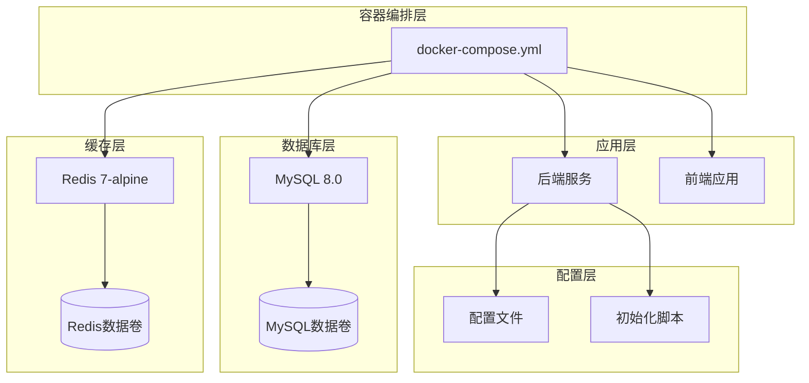

**图表来源**
- [docker-compose.yml:1-27](file://docker/docker-compose.yml#L1-L27)
- [config.example.yaml:1-338](file://backend/config.example.yaml#L1-L338)

**章节来源**
- [docker-compose.yml:1-27](file://docker/docker-compose.yml#L1-L27)
- [config.example.yaml:1-338](file://backend/config.example.yaml#L1-L338)

## 核心组件

### MySQL数据库服务

MySQL服务是平台的核心数据存储，采用MySQL 8.0版本，具有以下特点：

- **镜像配置**: 使用官方MySQL 8.0镜像，确保数据一致性和稳定性
- **数据持久化**: 通过命名卷`mysql_data`实现数据持久化存储
- **初始化脚本**: 自动执行`001_init_schema.sql`进行数据库结构初始化
- **字符集设置**: 配置utf8mb4字符集支持emoji表情符号
- **端口映射**: 暴露3306端口供外部访问

### Redis缓存服务

Redis服务提供高性能的键值存储，支持多种数据结构：

- **镜像配置**: 使用轻量级alpine Linux镜像减少资源占用
- **数据持久化**: 通过`/data`路径实现数据持久化
- **端口映射**: 暴露6379端口供应用程序访问
- **应用场景**: 缓存用户会话、验证码存储、限流控制

### 后端服务配置

后端服务通过配置文件进行灵活的环境适配：

- **服务器配置**: 支持debug、release、test三种运行模式
- **数据库连接**: 动态DSN生成，支持连接池配置
- **Redis集成**: 提供连接地址生成和配置验证
- **JWT认证**: 支持自定义密钥和过期时间配置

**章节来源**
- [docker-compose.yml:3-26](file://docker/docker-compose.yml#L3-L26)
- [config.example.yaml:14-117](file://backend/config.example.yaml#L14-L117)
- [config.go:61-126](file://backend/internal/config/config.go#L61-L126)

## 架构概览

平台采用容器化微服务架构，各组件通过Docker网络进行通信：

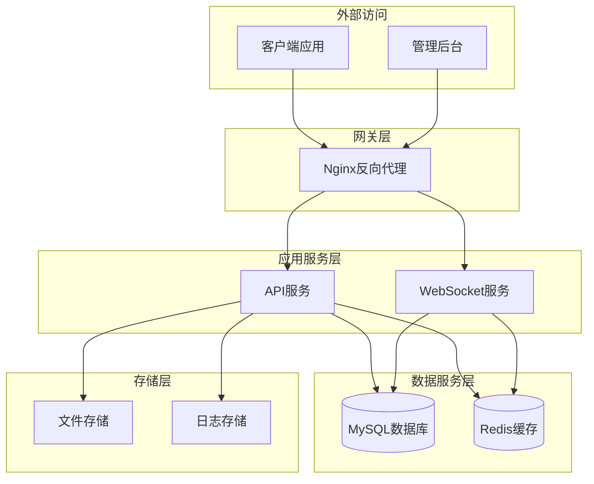

**图表来源**
- [docker-compose.yml:1-27](file://docker/docker-compose.yml#L1-L27)
- [config.example.yaml:28-77](file://backend/config.example.yaml#L28-L77)

## 详细组件分析

### Docker Compose配置详解

#### MySQL服务配置

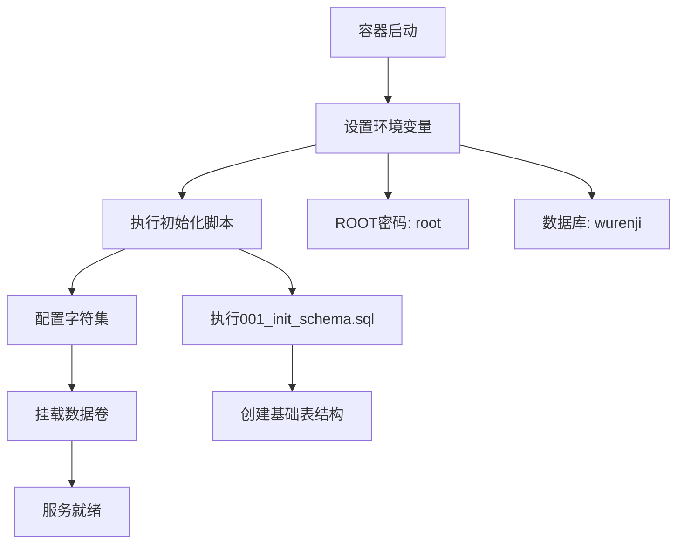

**图表来源**
- [docker-compose.yml:4-14](file://docker/docker-compose.yml#L4-L14)
- [001_init_schema.sql:1-26](file://backend/migrations/001_init_schema.sql#L1-L26)

#### Redis服务配置

Redis服务采用精简配置，专注于核心缓存功能：

- **镜像优化**: 使用alpine Linux基础镜像，减小容器体积
- **数据持久化**: 通过`/data`路径实现RDB持久化
- **端口暴露**: 6379端口供应用程序访问
- **资源效率**: 轻量级配置适合开发和测试环境

#### 数据卷管理

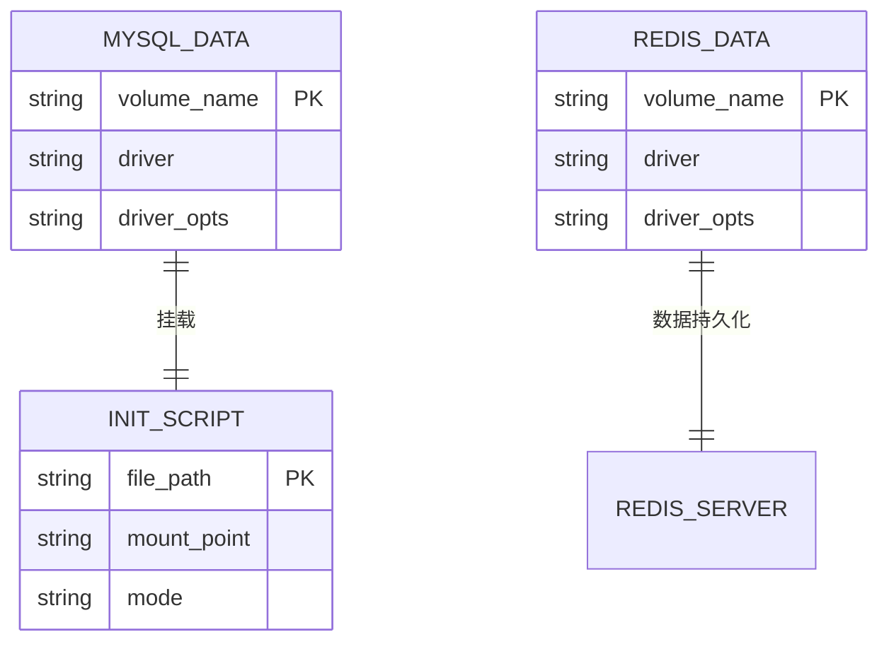

**图表来源**
- [docker-compose.yml:13-26](file://docker/docker-compose.yml#L13-L26)

**章节来源**
- [docker-compose.yml:1-27](file://docker/docker-compose.yml#L1-L27)

### 数据库初始化流程

平台提供完整的数据库初始化机制，确保开发环境的一致性：

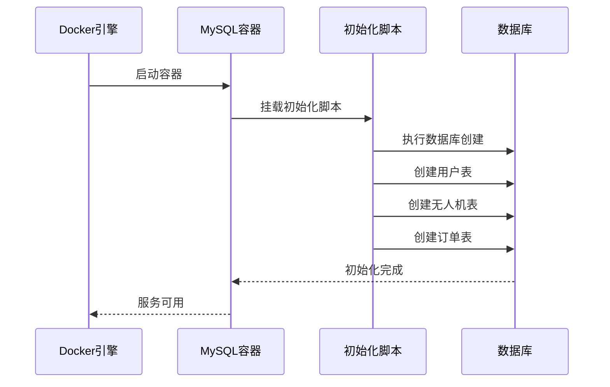

**图表来源**
- [docker-compose.yml:13](file://docker/docker-compose.yml#L13)
- [001_init_schema.sql:1-26](file://backend/migrations/001_init_schema.sql#L1-L26)

#### 初始化脚本功能

初始化脚本包含以下核心功能：

- **数据库创建**: 自动创建`wurenji`数据库
- **表结构定义**: 定义用户、无人机、订单等核心表
- **索引优化**: 为常用查询字段创建索引
- **字符集配置**: 设置utf8mb4字符集支持国际化

**章节来源**
- [001_init_schema.sql:1-200](file://backend/migrations/001_init_schema.sql#L1-L200)

### 配置管理系统

后端服务采用Viper配置管理库，支持多种配置源：

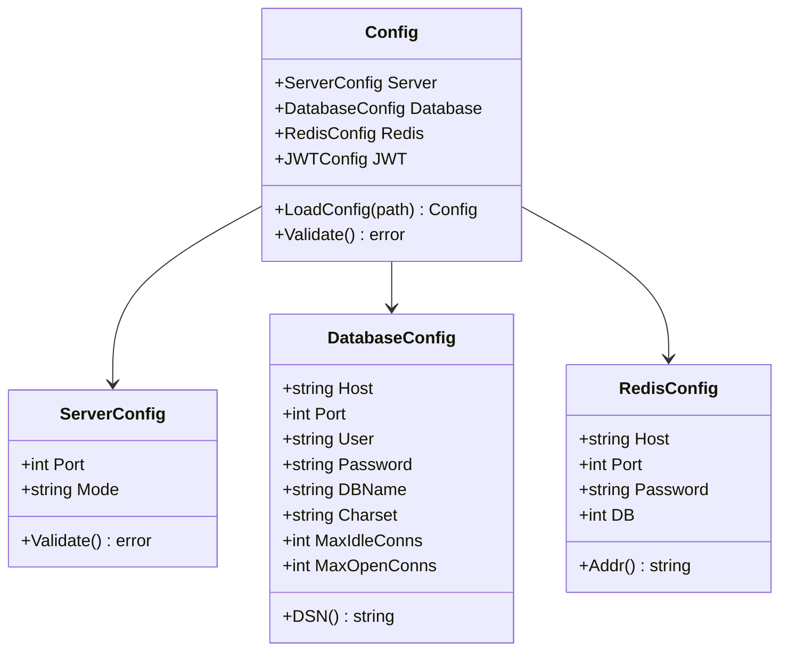

**图表来源**
- [config.go:16-126](file://backend/internal/config/config.go#L16-L126)

#### 配置验证机制

配置系统提供多层次的验证机制：

- **基础验证**: 检查必需字段的存在性和格式正确性
- **范围验证**: 确保端口号、连接数等数值在合理范围内
- **生产环境验证**: 生产模式强制要求特定配置项
- **环境变量覆盖**: 支持通过环境变量动态调整配置

**章节来源**
- [config.go:415-481](file://backend/internal/config/config.go#L415-L481)
- [config.example.yaml:28-77](file://backend/config.example.yaml#L28-L77)

### 备份恢复流程

平台提供完整的数据库备份和恢复机制：

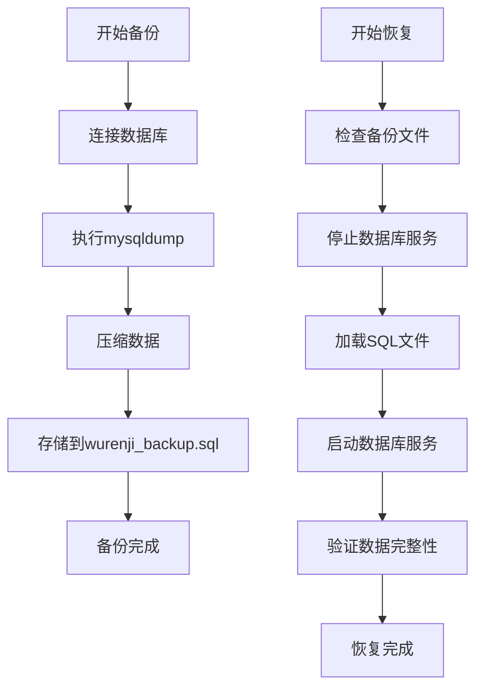

**图表来源**
- [wurenji_backup.sql:1-21](file://docker/wurenji_backup.sql#L1-L21)

#### 备份文件结构

备份文件包含以下关键信息：

- **元数据注释**: 记录备份时间和源数据库信息
- **SQL语句**: 完整的数据库结构和数据定义
- **字符集设置**: 确保导入时的字符集一致性
- **外键检查**: 在导入前禁用外键约束避免依赖问题

**章节来源**
- [wurenji_backup.sql:1-21](file://docker/wurenji_backup.sql#L1-L21)

## 依赖关系分析

### 组件间依赖关系

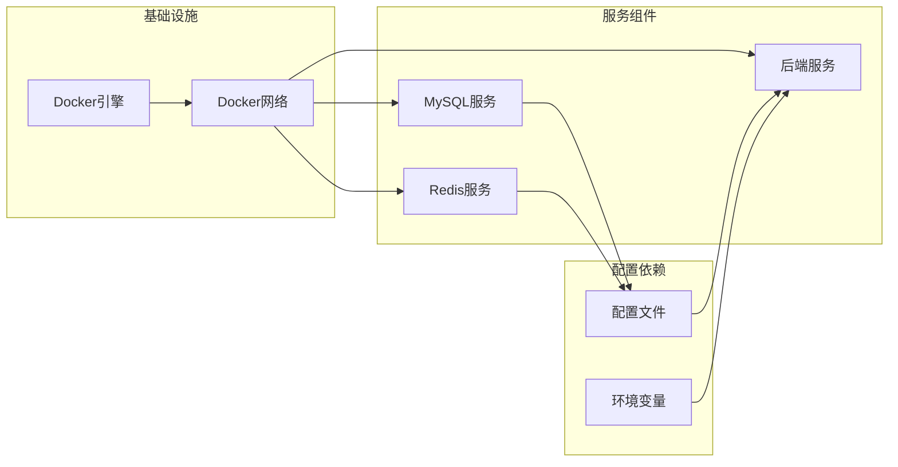

**图表来源**
- [docker-compose.yml:2-26](file://docker/docker-compose.yml#L2-L26)
- [config.example.yaml:1-338](file://backend/config.example.yaml#L1-L338)

### 数据流分析

平台的数据流遵循清晰的层次结构：

1. **客户端请求** → **API网关** → **后端服务**
2. **后端服务** → **数据库查询** → **MySQL**
3. **缓存查询** → **Redis** → **响应缓存数据**
4. **文件上传** → **本地存储** → **静态资源**

**章节来源**
- [main.go:52-266](file://backend/cmd/server/main.go#L52-L266)

## 性能考虑

### 资源优化建议

针对生产环境，建议进行以下性能优化：

#### MySQL性能调优

- **连接池配置**: 根据服务器内存调整最大连接数
- **字符集优化**: 使用utf8mb4支持完整Unicode字符
- **索引策略**: 为高频查询字段建立适当索引
- **缓冲区设置**: 调整innodb缓冲池大小

#### Redis性能优化

- **内存配置**: 根据数据量设置合适的内存限制
- **持久化策略**: 选择RDB或AOF持久化方式
- **淘汰策略**: 配置合理的内存淘汰算法
- **网络优化**: 使用Unix Socket减少网络开销

#### 容器资源限制

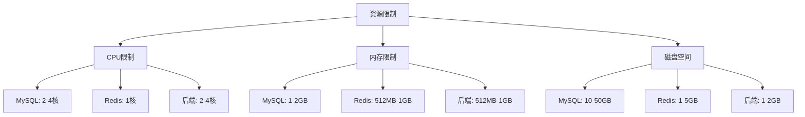

### 监控和日志

- **日志轮转**: 配置日志文件大小和保留策略
- **性能指标**: 监控数据库连接数、Redis命中率
- **健康检查**: 定期检查服务可用性和响应时间
- **告警机制**: 设置阈值告警和异常通知

## 故障排除指南

### 常见问题诊断

#### 数据库连接问题

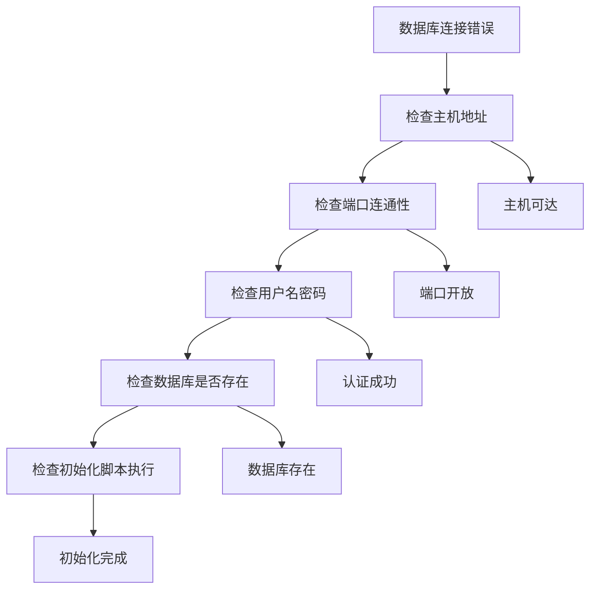

**图表来源**
- [config.go:80-95](file://backend/internal/config/config.go#L80-L95)

#### 容器启动失败

1. **检查依赖服务**: 确保MySQL和Redis先于后端服务启动
2. **验证配置文件**: 检查config.yaml的语法和必需字段
3. **查看日志输出**: 分析容器启动日志中的错误信息
4. **网络连接测试**: 验证容器间的网络连通性

#### 数据同步问题

1. **检查迁移脚本**: 确认所有迁移脚本按顺序执行
2. **验证数据完整性**: 检查关键表的数据一致性
3. **监控事务日志**: 查看数据库事务的执行情况
4. **重建索引**: 如有必要，重新创建数据库索引

**章节来源**
- [PHASE9_MIGRATION_RUNBOOK.md:1-104](file://backend/docs/PHASE9_MIGRATION_RUNBOOK.md#L1-L104)

### 运维脚本使用

平台提供自动化运维脚本简化日常维护工作：

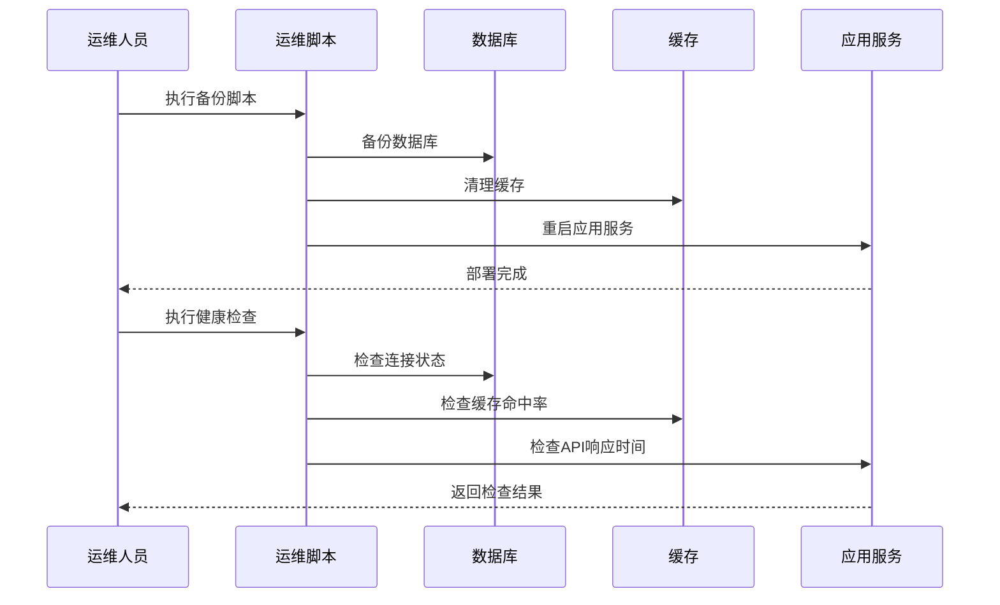

**图表来源**
- [phase10_role_acceptance.sh:1-606](file://backend/scripts/phase10_role_acceptance.sh#L1-606)

**章节来源**
- [phase10_role_acceptance.sh:1-606](file://backend/scripts/phase10_role_acceptance.sh#L1-L606)

## 结论

无人机租赁平台的Docker容器化部署提供了高度可扩展和可维护的解决方案。通过合理的容器编排、配置管理和监控机制，平台能够满足从开发测试到生产环境的各种需求。

关键优势包括：
- **模块化设计**: 各组件独立部署，便于扩展和维护
- **配置灵活性**: 支持多种配置源和环境变量覆盖
- **数据安全保障**: 完整的备份恢复机制和数据迁移工具
- **运维自动化**: 提供丰富的运维脚本和监控工具

建议在生产环境中进一步完善：
- 健康检查和自动重启机制
- 负载均衡和高可用配置
- 安全加固和访问控制
- 性能监控和容量规划

## 附录

### 部署命令参考

#### 基础部署

```bash
# 启动所有服务
docker-compose up -d

# 查看服务状态
docker-compose ps

# 查看日志
docker-compose logs -f

# 停止所有服务
docker-compose down
```

#### 数据库操作

```bash
# 进入MySQL容器
docker exec -it wurenji-mysql mysql -u root -p

# 备份数据库
docker exec wurenji-mysql mysqldump -u root -p wurenji > backup.sql

# 恢复数据库
docker exec -i wurenji-mysql mysql -u root -p wurenji < backup.sql
```

#### 配置管理

```bash
# 修改配置文件
cp backend/config.example.yaml backend/config.yaml

# 编辑配置项
vim backend/config.yaml

# 重新加载配置
docker-compose restart backend
```

### 安全配置建议

1. **生产环境配置**
   - 修改默认root密码
   - 创建专用数据库用户
   - 启用SSL连接
   - 配置防火墙规则

2. **容器安全**
   - 使用非root用户运行
   - 限制容器权限
   - 定期更新基础镜像
   - 配置资源限制

3. **数据保护**
   - 启用数据库加密
   - 定期备份策略
   - 敏感数据脱敏
   - 访问日志审计