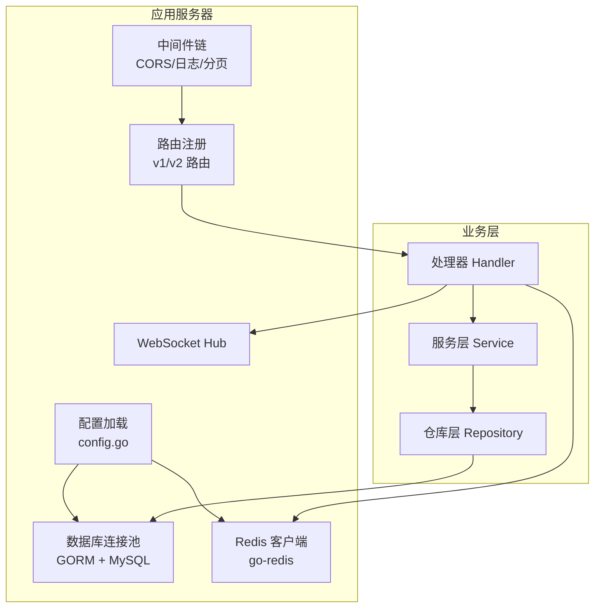
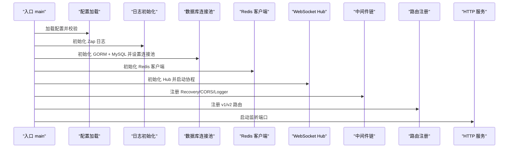
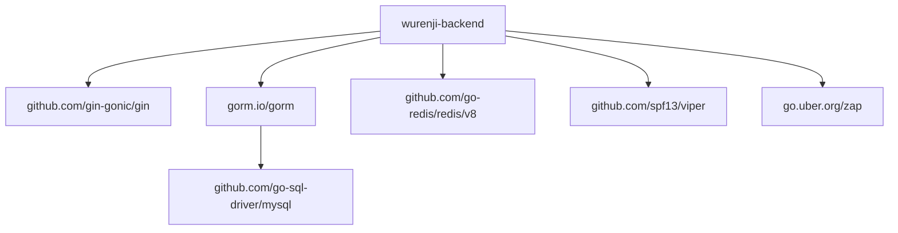

# 性能优化与调优

<cite>
**本文引用的文件**
- [backend/cmd/server/main.go](file://backend/cmd/server/main.go)
- [backend/internal/config/config.go](file://backend/internal/config/config.go)
- [backend/internal/api/middleware/pagination.go](file://backend/internal/api/middleware/pagination.go)
- [backend/internal/repository/order_repo.go](file://backend/internal/repository/order_repo.go)
- [backend/internal/repository/drone_repo.go](file://backend/internal/repository/drone_repo.go)
- [backend/internal/repository/user_repo.go](file://backend/internal/repository/user_repo.go)
- [backend/internal/model/models.go](file://backend/internal/model/models.go)
- [backend/migrations/001_init_schema.sql](file://backend/migrations/001_init_schema.sql)
- [backend/config.example.yaml](file://backend/config.example.yaml)
- [backend/go.mod](file://backend/go.mod)
</cite>

## 目录
1. [简介](#简介)
2. [项目结构](#项目结构)
3. [核心组件](#核心组件)
4. [架构总览](#架构总览)
5. [详细组件分析](#详细组件分析)
6. [依赖分析](#依赖分析)
7. [性能考虑](#性能考虑)
8. [故障排查指南](#故障排查指南)
9. [结论](#结论)
10. [附录](#附录)

## 简介
本指南面向开发与运维团队，围绕无人机租赁平台后端系统，提供应用服务器性能参数调优、数据库查询优化、缓存策略配置、分页查询优化、索引设计原则、慢查询分析、并发连接数配置、内存与CPU资源分配、负载测试与性能基准测试、瓶颈识别技巧、生产环境监控指标与问题排查方法，以及优化效果评估流程。目标是帮助团队在保证功能正确性的前提下，系统性提升系统吞吐与稳定性。

## 项目结构
后端采用 Go + Gin + GORM + MySQL + Redis 架构，核心入口负责配置加载、数据库连接池初始化、Redis 初始化、中间件注册、路由注册与服务启动；各业务模块通过仓库层（Repository）访问数据库，服务层（Service）编排业务逻辑，API 层（Handler）处理请求与响应。

图表来源
- [backend/cmd/server/main.go:52-266](file://backend/cmd/server/main.go#L52-L266)
- [backend/internal/config/config.go:16-521](file://backend/internal/config/config.go#L16-L521)

章节来源
- [backend/cmd/server/main.go:52-266](file://backend/cmd/server/main.go#L52-L266)
- [backend/internal/config/config.go:16-521](file://backend/internal/config/config.go#L16-L521)

## 核心组件
- 应用服务器启动与配置
  - 配置加载与校验、日志初始化、上传目录准备
  - 数据库连接池参数设置（最大空闲/打开连接数）
  - Redis 客户端初始化与注入
  - 中间件链：恢复、CORS、日志
  - 路由注册：v1/v2
- 分页中间件
  - 默认页码/页大小、最大页大小限制、上下文传递
- 仓库层（Repository）
  - 订单、无人机、用户等核心实体的查询与统计
  - 预加载与条件过滤、分页偏移与限制
- 模型与索引
  - 关键字段建立唯一/普通索引，支撑高频查询
- 配置模板
  - server、database、redis、jwt、upload、sms、payment、amap、websocket、log、cors、push、oauth 等

章节来源
- [backend/cmd/server/main.go:52-266](file://backend/cmd/server/main.go#L52-L266)
- [backend/internal/api/middleware/pagination.go:14-71](file://backend/internal/api/middleware/pagination.go#L14-L71)
- [backend/internal/repository/order_repo.go:119-158](file://backend/internal/repository/order_repo.go#L119-L158)
- [backend/internal/repository/drone_repo.go:43-86](file://backend/internal/repository/drone_repo.go#L43-L86)
- [backend/internal/repository/user_repo.go:45-57](file://backend/internal/repository/user_repo.go#L45-L57)
- [backend/internal/model/models.go:9-26](file://backend/internal/model/models.go#L9-L26)
- [backend/migrations/001_init_schema.sql:7-62](file://backend/migrations/001_init_schema.sql#L7-L62)
- [backend/config.example.yaml:14-56](file://backend/config.example.yaml#L14-L56)

## 架构总览
应用服务器启动流程与关键依赖关系如下：

图表来源
- [backend/cmd/server/main.go:52-266](file://backend/cmd/server/main.go#L52-L266)

章节来源
- [backend/cmd/server/main.go:52-266](file://backend/cmd/server/main.go#L52-L266)

## 详细组件分析

### 应用服务器性能参数调优
- 运行模式与日志
  - server.mode 控制 Gin 运行模式，生产建议 release
  - 日志级别与输出方式影响 I/O，建议生产使用 file/both 并配合滚动
- 连接池参数
  - database.max_idle_conns 与 max_open_conns 控制 MySQL 连接池规模
  - 建议结合 MySQL max_connections 与业务 QPS 动态调整
- 服务器端口与网络
  - server.port 为服务监听端口，需与容器/反向代理一致
- 上传与文件处理
  - upload.max_size、save_path、allowed_exts 影响磁盘 I/O 与并发上传
- JWT 与认证
  - jwt.access_expire、refresh_expire 影响鉴权开销与刷新频率
- Redis
  - redis.host/port/password/db 与连接池复用，避免频繁重建连接
- WebSocket
  - websocket.max_message_size、write_wait、pong_wait、ping_period 影响长连接稳定性与资源占用

章节来源
- [backend/internal/config/config.go:16-521](file://backend/internal/config/config.go#L16-L521)
- [backend/config.example.yaml:14-56](file://backend/config.example.yaml#L14-L56)
- [backend/cmd/server/main.go:268-292](file://backend/cmd/server/main.go#L268-L292)

### 数据库查询优化
- 分页查询优化
  - 使用 Offset/Limit 实现分页，但需注意大数据量下的跳页性能
  - 建议引入“基于游标”的分页或“索引覆盖”减少回表
- 预加载与 N+1 查询
  - Preload 会触发多次子查询，应按需预加载或改用 Joins
- 条件过滤与统计
  - Count + 查询分离，避免重复扫描
  - Group/Aggregate 尽量在数据库侧完成
- 示例路径
  - 订单分页与条件过滤：[backend/internal/repository/order_repo.go:119-158](file://backend/internal/repository/order_repo.go#L119-L158)
  - 无人机分页与距离计算：[backend/internal/repository/drone_repo.go:88-115](file://backend/internal/repository/drone_repo.go#L88-L115)
  - 用户分页与批量查询：[backend/internal/repository/user_repo.go:45-57](file://backend/internal/repository/user_repo.go#L45-L57)

章节来源
- [backend/internal/repository/order_repo.go:119-158](file://backend/internal/repository/order_repo.go#L119-L158)
- [backend/internal/repository/drone_repo.go:88-115](file://backend/internal/repository/drone_repo.go#L88-L115)
- [backend/internal/repository/user_repo.go:45-57](file://backend/internal/repository/user_repo.go#L45-L57)

### 缓存策略配置
- Redis 作为验证码、会话、限流等场景的缓存介质
- 建议：
  - 为热点数据设置合理 TTL
  - 使用连接池与管道命令降低 RTT
  - 对写多读少场景采用异步更新或队列解耦
- 初始化与注入：
  - [backend/cmd/server/main.go:95-108](file://backend/cmd/server/main.go#L95-L108)

章节来源
- [backend/cmd/server/main.go:95-108](file://backend/cmd/server/main.go#L95-L108)

### 分页查询优化
- 分页中间件
  - 默认页码/页大小、最大页大小限制，防止过大请求导致资源耗尽
  - 上下文传递 page/page_size，便于后续查询统一处理
- 优化建议
  - 基于主键或唯一索引的“书签式分页”
  - 对排序字段建立复合索引，避免排序带来的临时表
  - 对高频分页接口增加缓存层
- 示例路径
  - [backend/internal/api/middleware/pagination.go:14-71](file://backend/internal/api/middleware/pagination.go#L14-L71)

章节来源
- [backend/internal/api/middleware/pagination.go:14-71](file://backend/internal/api/middleware/pagination.go#L14-L71)

### 索引设计原则
- 唯一索引
  - 用户手机号、无人机序列号等唯一约束字段
- 普通索引
  - 高频过滤字段：用户类型、状态、城市、归属者ID、订单状态、删除标记等
- 联合索引
  - 多条件组合过滤时，优先考虑最左前缀匹配
- 距离查询
  - 无人机附近检索使用 Haversine 公式，建议配合空间索引或地理围栏策略
- 示例路径
  - 模型字段索引定义：[backend/internal/model/models.go:9-26](file://backend/internal/model/models.go#L9-L26)
  - 初始 Schema 索引：[backend/migrations/001_init_schema.sql:22-62](file://backend/migrations/001_init_schema.sql#L22-L62)

章节来源
- [backend/internal/model/models.go:9-26](file://backend/internal/model/models.go#L9-L26)
- [backend/migrations/001_init_schema.sql:22-62](file://backend/migrations/001_init_schema.sql#L22-L62)

### 慢查询分析
- 建议手段
  - 开启 MySQL 慢查询日志，设置阈值与记录时间
  - 结合 EXPLAIN 分析执行计划，关注全表扫描、回表、临时表与 filesort
  - 对高频接口埋点统计耗时与错误率
- 关注点
  - 大 OFFSET 的分页查询
  - 缺失索引的 WHERE/JOIN/ORDER/GROUP
  - 预加载导致的 N+1 子查询
- 示例路径
  - 订单复杂条件与预加载：[backend/internal/repository/order_repo.go:133-158](file://backend/internal/repository/order_repo.go#L133-L158)
  - 无人机距离与多条件筛选：[backend/internal/repository/drone_repo.go:88-115](file://backend/internal/repository/drone_repo.go#L88-L115)

章节来源
- [backend/internal/repository/order_repo.go:133-158](file://backend/internal/repository/order_repo.go#L133-L158)
- [backend/internal/repository/drone_repo.go:88-115](file://backend/internal/repository/drone_repo.go#L88-L115)

### 并发连接数配置
- MySQL 连接池
  - database.max_idle_conns、max_open_conns 与 MySQL max_connections 协同
  - 建议：max_idle_conns ≈ CPU/2，max_open_conns ≈ CPU × 4~8
- 应用并发
  - Gin 默认并发模型，建议结合容器资源限制与 HPA 策略
- Redis
  - 连接池大小与超时设置，避免阻塞与连接泄漏

章节来源
- [backend/cmd/server/main.go:268-292](file://backend/cmd/server/main.go#L268-L292)
- [backend/config.example.yaml:52-56](file://backend/config.example.yaml#L52-L56)

### 内存使用优化
- 日志滚动与级别
  - 生产使用文件输出并设置 max_size/max_age/max_backups
- 对象与切片
  - 避免不必要的拷贝，复用缓冲区
- GORM 预加载
  - 按需预加载，避免一次性加载过多关联数据
- 上传与图片
  - 控制单文件大小与并发上传，避免 OOM

章节来源
- [backend/config.example.yaml:252-270](file://backend/config.example.yaml#L252-L270)
- [backend/internal/repository/order_repo.go:35-49](file://backend/internal/repository/order_repo.go#L35-L49)

### CPU 资源分配
- 业务热点接口
  - 引入缓存与异步处理，降低 CPU 热点
- 计算密集型
  - 地理距离计算建议在数据库侧完成或使用专用库
- 并发与协程
  - 合理设置 GOMAXPROCS，避免过度抢占

章节来源
- [backend/internal/repository/drone_repo.go:92-114](file://backend/internal/repository/drone_repo.go#L92-L114)

### 负载测试与性能基准测试
- 工具建议
  - wrk、ab、JMeter、K6 等
- 场景设计
  - 登录/注册、订单列表/详情、无人机搜索、下单支付、飞行轨迹同步
- 指标采集
  - QPS、P95/P99 延迟、错误率、连接池使用率、CPU/内存/IO
- 基准基线
  - 在相同硬件与数据库配置下，记录基线数据，对比优化前后变化

[本节为通用指导，不直接分析具体文件]

### 瓶颈识别技巧
- 分层定位
  - 应用层：接口耗时、错误率、日志异常
  - 数据库层：慢查询、锁等待、连接池饱和
  - 缓存层：命中率、延迟、过期策略
  - 网络层：RTT、带宽、TLS 握手
- 观察点
  - 分页接口 OFFSET 指数增长
  - 预加载导致的 N+1 查询
  - 缺失索引导致的全表扫描
  - Redis 集群热点 Key

[本节为通用指导，不直接分析具体文件]

### 生产环境性能监控指标
- 应用层
  - 请求量、错误率、P95/P99 延迟、并发连接数、GC 次数与暂停时间
- 数据库层
  - QPS、慢查询数、连接数、锁等待、Buffer Pool 命中率
- 缓存层
  - 命中率、过期率、淘汰率、内存使用
- 基础设施
  - CPU 使用率、内存使用、磁盘 IO、网络带宽

[本节为通用指导，不直接分析具体文件]

### 性能问题排查方法
- 快速止损
  - 降级非核心功能、开启只读副本、临时提高连接池上限
- 深入分析
  - 抓取火焰图、慢查询日志、数据库审计日志
- 回归验证
  - 修复后进行回归测试与 A/B 对比

[本节为通用指导，不直接分析具体文件]

## 依赖分析
- 外部依赖
  - Gin、GORM、MySQL Driver、Redis、Zap、Viper 等
- 版本与兼容性
  - go.mod 指定 Go 版本与依赖版本，确保升级时进行兼容性测试

图表来源
- [backend/go.mod:5-21](file://backend/go.mod#L5-L21)

章节来源
- [backend/go.mod:5-21](file://backend/go.mod#L5-L21)

## 性能考虑
- 连接池与并发
  - 合理设置数据库连接池与应用并发，避免资源争用
- 索引与查询
  - 为高频过滤/排序字段建立索引，避免全表扫描
- 缓存与异步
  - 对热点数据加缓存，对耗时操作异步化
- 分页与预加载
  - 采用游标分页或索引覆盖，减少预加载带来的 N+1
- 日志与监控
  - 生产使用文件输出与滚动，接入集中式日志与监控

[本节为通用指导，不直接分析具体文件]

## 故障排查指南
- 启动阶段
  - 配置校验失败、数据库连接失败、Redis 连接失败
- 运行阶段
  - 分页接口延迟升高、慢查询增多、缓存命中率下降
- 处理步骤
  - 检查配置、核对索引、分析慢查询、压测验证、回滚变更

章节来源
- [backend/cmd/server/main.go:59-90](file://backend/cmd/server/main.go#L59-L90)
- [backend/internal/config/config.go:438-464](file://backend/internal/config/config.go#L438-L464)

## 结论
通过系统化的配置调优、查询优化、索引设计、缓存策略与监控体系，可以显著提升无人机租赁平台的性能与稳定性。建议在灰度环境中逐步上线优化措施，并持续进行压测与回归验证，确保优化效果可量化、可追溯。

[本节为总结，不直接分析具体文件]

## 附录
- 配置模板参考
  - [backend/config.example.yaml:14-56](file://backend/config.example.yaml#L14-L56)
- 数据库初始化与索引
  - [backend/migrations/001_init_schema.sql:7-62](file://backend/migrations/001_init_schema.sql#L7-L62)
- 模型字段与索引
  - [backend/internal/model/models.go:9-26](file://backend/internal/model/models.go#L9-L26)