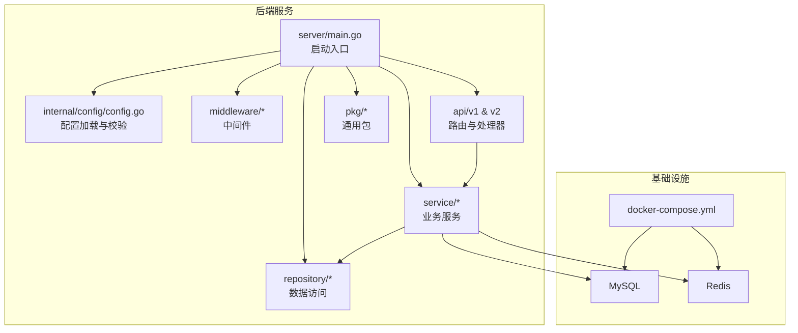
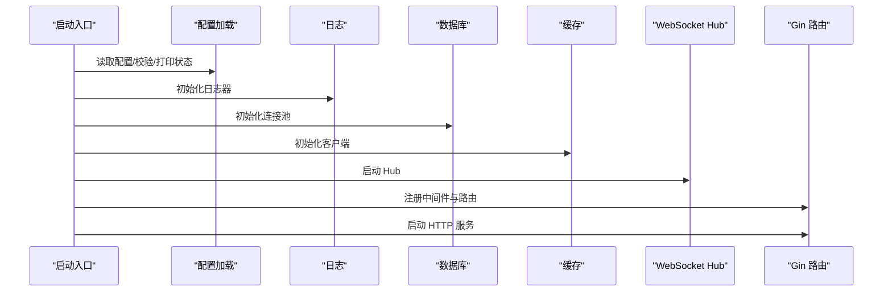
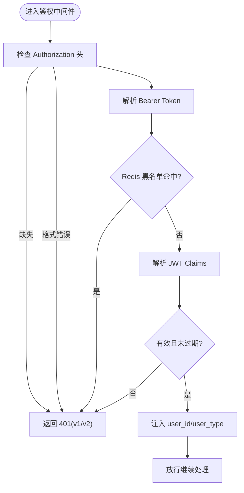
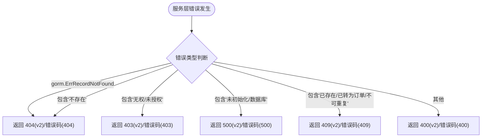
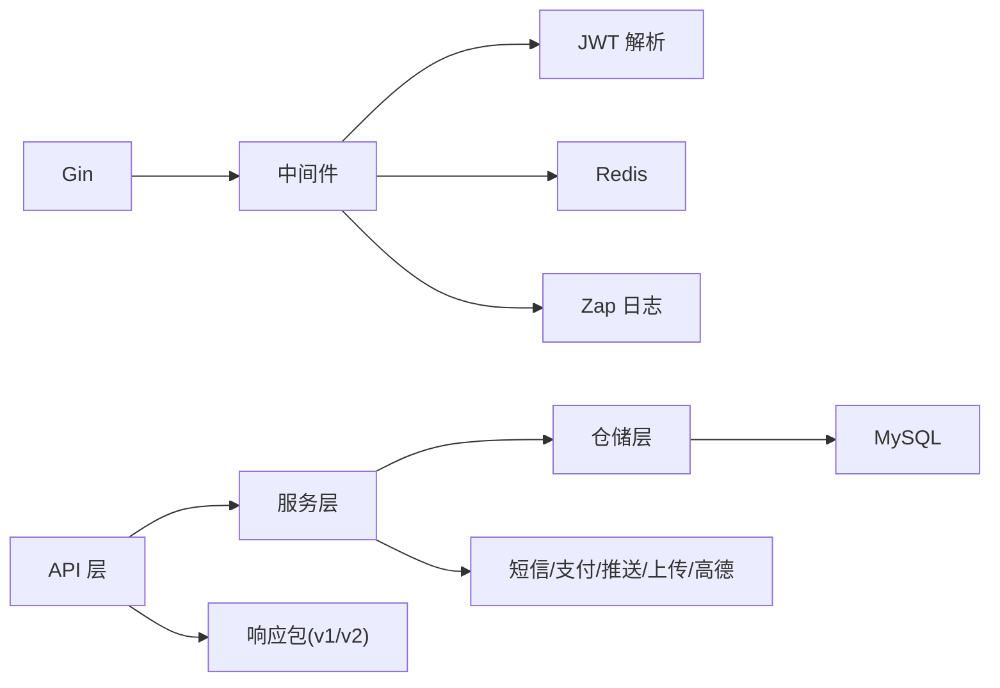

# 故障排查指南

<cite>
**本文引用的文件**
- [backend/cmd/server/main.go](file://backend/cmd/server/main.go)
- [backend/internal/config/config.go](file://backend/internal/config/config.go)
- [backend/go.mod](file://backend/go.mod)
- [docker/docker-compose.yml](file://docker/docker-compose.yml)
- [backend/docs/API_V1_V2_DIFF.md](file://backend/docs/API_V1_V2_DIFF.md)
- [backend/internal/api/middleware/logger.go](file://backend/internal/api/middleware/logger.go)
- [backend/internal/api/middleware/auth.go](file://backend/internal/api/middleware/auth.go)
- [backend/internal/api/middleware/legacy_write_freeze.go](file://backend/internal/api/middleware/legacy_write_freeze.go)
- [backend/internal/api/v1/auth/handler.go](file://backend/internal/api/v1/auth/handler.go)
- [backend/internal/api/v2/common/errors.go](file://backend/internal/api/v2/common/errors.go)
- [backend/internal/pkg/response/response.go](file://backend/internal/pkg/response/response.go)
- [backend/internal/pkg/response/v2.go](file://backend/internal/pkg/response/v2.go)
- [backend/config.example.yaml](file://backend/config.example.yaml)
</cite>

## 目录
1. [简介](#简介)
2. [项目结构](#项目结构)
3. [核心组件](#核心组件)
4. [架构总览](#架构总览)
5. [详细组件分析](#详细组件分析)
6. [依赖分析](#依赖分析)
7. [性能考虑](#性能考虑)
8. [故障排查指南](#故障排查指南)
9. [结论](#结论)
10. [附录](#附录)

## 简介
本指南面向运维与技术支持团队，围绕无人机租赁平台后端服务，提供系统化、可操作的故障排查流程与方法。涵盖服务启动失败、数据库连接异常、API 接口错误、日志分析、错误码含义、调试工具使用、网络与权限问题、第三方服务异常处理、应急响应与根因分析等主题，帮助快速定位与解决问题。

## 项目结构
后端采用 Go + Gin 框架，模块化组织 API、中间件、服务层、仓库层与通用包，支持 v1/v2 双版本 API 并行与兼容。配置通过 YAML 文件集中管理，容器编排使用 Docker Compose 提供本地 MySQL 与 Redis 服务。

**图表来源**
- [backend/cmd/server/main.go:52-266](file://backend/cmd/server/main.go#L52-L266)
- [backend/internal/config/config.go:16-521](file://backend/internal/config/config.go#L16-L521)
- [docker/docker-compose.yml:1-27](file://docker/docker-compose.yml#L1-L27)

**章节来源**
- [backend/cmd/server/main.go:52-266](file://backend/cmd/server/main.go#L52-L266)
- [backend/internal/config/config.go:16-521](file://backend/internal/config/config.go#L16-L521)
- [docker/docker-compose.yml:1-27](file://docker/docker-compose.yml#L1-L27)

## 核心组件
- 启动入口与生命周期
  - 加载配置、校验配置、打印配置状态、创建上传目录
  - 初始化日志、数据库、Redis、WebSocket Hub
  - 构建仓储与业务服务、注入依赖、注册路由、启动 HTTP 服务
- 配置系统
  - 支持环境变量覆盖、严格校验、生产环境更严规则、打印配置状态、确保上传目录存在
- 中间件体系
  - CORS、日志、鉴权、管理员鉴权、遗留写入冻结
- API 层
  - v1 与 v2 双栈并行，v2 采用统一响应结构与错误码
- 通用包
  - 响应封装（v1/v2）、JWT 解析、短信、支付、推送、上传、高德地图

**章节来源**
- [backend/cmd/server/main.go:52-266](file://backend/cmd/server/main.go#L52-L266)
- [backend/internal/config/config.go:415-521](file://backend/internal/config/config.go#L415-L521)
- [backend/internal/api/middleware/logger.go:10-31](file://backend/internal/api/middleware/logger.go#L10-L31)
- [backend/internal/api/middleware/auth.go:22-106](file://backend/internal/api/middleware/auth.go#L22-L106)
- [backend/internal/api/middleware/legacy_write_freeze.go:12-31](file://backend/internal/api/middleware/legacy_write_freeze.go#L12-L31)
- [backend/internal/pkg/response/response.go:24-104](file://backend/internal/pkg/response/response.go#L24-L104)
- [backend/internal/pkg/response/v2.go:39-141](file://backend/internal/pkg/response/v2.go#L39-L141)

## 架构总览
服务启动流程与关键依赖关系如下：

**图表来源**
- [backend/cmd/server/main.go:52-266](file://backend/cmd/server/main.go#L52-L266)
- [backend/internal/config/config.go:415-521](file://backend/internal/config/config.go#L415-L521)

## 详细组件分析

### 启动与配置组件
- 配置加载与校验
  - 支持 YAML 文件与环境变量覆盖，自动替换点号为下划线
  - 严格校验各子配置（服务器、数据库、Redis、JWT、上传、短信、支付、WebSocket 等）
  - 生产环境校验：必须为 release 模式、不得使用 mock 短信、至少配置一种支付方式
  - 启动时打印配置状态，便于快速核对
- 数据库初始化
  - 设置连接池最大空闲/打开连接数
  - 显式设置字符集为 utf8mb4
  - 自动迁移模型（含订单、派单、飞行、空域、支付结算、信用风控、保险、分析等）
- Redis 初始化
  - 作为验证码/会话/限流等缓存使用，并注入到鉴权中间件用于令牌黑名单检查
- 日志与中间件
  - Gin Recovery、CORS、自定义日志中间件（记录状态码、方法、路径、IP、耗时、Body 尺寸）

**章节来源**
- [backend/cmd/server/main.go:52-266](file://backend/cmd/server/main.go#L52-L266)
- [backend/internal/config/config.go:415-521](file://backend/internal/config/config.go#L415-L521)
- [backend/internal/api/middleware/logger.go:10-31](file://backend/internal/api/middleware/logger.go#L10-L31)

### 鉴权与权限组件
- 鉴权中间件
  - 从 Authorization 头解析 Bearer Token
  - 支持令牌黑名单检查（Redis 键格式 token:blacklist:<token>）
  - 解析 JWT Claims，注入 user_id 与 user_type
- 管理员中间件
  - 仅允许 user_type=admin 的请求通过
- v1/v2 响应差异
  - v2 使用统一响应体与错误码，便于前端与监控系统标准化处理

**图表来源**
- [backend/internal/api/middleware/auth.go:22-106](file://backend/internal/api/middleware/auth.go#L22-L106)

**章节来源**
- [backend/internal/api/middleware/auth.go:22-106](file://backend/internal/api/middleware/auth.go#L22-L106)
- [backend/internal/pkg/response/v2.go:39-141](file://backend/internal/pkg/response/v2.go#L39-L141)

### API 错误处理与响应
- v1 响应
  - 统一结构包含 code、message、data、timestamp
  - 常见错误码：参数错误、未授权、禁止访问、未找到、已存在、服务器错误、数据库错误、Redis 错误、短信错误、支付错误、上传错误、验证码错误、订单错误
- v2 响应
  - 统一结构包含 code、message、data、meta、trace_id
  - 标准错误码：OK、BAD_REQUEST、VALIDATION_ERROR、UNAUTHORIZED、FORBIDDEN、NOT_FOUND、CONFLICT、NOT_IMPLEMENTED、INTERNAL_ERROR
- 服务层错误处理
  - 根据错误类型映射到 v1/v2 对应错误码（如记录不存在映射为 404，冲突映射为 409，参数错误映射为 400 等）

**图表来源**
- [backend/internal/api/v2/common/errors.go:13-35](file://backend/internal/api/v2/common/errors.go#L13-L35)
- [backend/internal/pkg/response/response.go:88-103](file://backend/internal/pkg/response/response.go#L88-L103)
- [backend/internal/pkg/response/v2.go:27-37](file://backend/internal/pkg/response/v2.go#L27-L37)

**章节来源**
- [backend/internal/pkg/response/response.go:24-104](file://backend/internal/pkg/response/response.go#L24-L104)
- [backend/internal/pkg/response/v2.go:39-141](file://backend/internal/pkg/response/v2.go#L39-L141)
- [backend/internal/api/v2/common/errors.go:13-35](file://backend/internal/api/v2/common/errors.go#L13-L35)

### 遗留写入冻结中间件
- 作用
  - 冻结 v1 的写入（POST/PUT/DELETE），仅允许 GET/HEAD/OPTIONS
  - 支持通过前缀白名单绕过（如 /api/v1/dispatch/admin/）
- 影响
  - 防止在 v2 迁移期间误用 v1 写接口，避免数据不一致
  - 仅在 v1 路由组启用，v2 路由不受影响

**章节来源**
- [backend/internal/api/middleware/legacy_write_freeze.go:12-31](file://backend/internal/api/middleware/legacy_write_freeze.go#L12-L31)

### v1/v2 差异与兼容
- 路由前缀：/api/v1 vs /api/v2
- 响应结构：v1 使用旧结构，v2 使用 V2Envelope
- 鉴权与初始化：v2 返回统一角色摘要
- 业务对象边界：v2 明确拆分 demands/owner_supplies/orders/dispatch_tasks/flight_records
- 迁移状态：v2 已实现核心链路，部分路由仍占位返回 NOT_IMPLEMENTED
- 切换建议：优先走 v2，按页面逐步迁移

**章节来源**
- [backend/docs/API_V1_V2_DIFF.md:1-222](file://backend/docs/API_V1_V2_DIFF.md#L1-L222)

## 依赖分析
- 外部依赖
  - Web 框架：Gin
  - ORM：GORM + MySQL 驱动
  - 缓存：Redis
  - 日志：Zap
  - WebSocket：gorilla/websocket
  - 配置：Viper
  - JWT：golang-jwt/jwt
  - 第三方服务：高德地图、短信（阿里云/腾讯云）、推送（极光）
- 内部模块耦合
  - 服务层依赖仓储层，仓储层依赖数据库
  - 中间件依赖配置与外部服务（Redis、JWT）
  - API 层依赖服务层与通用响应包

**图表来源**
- [backend/go.mod:5-21](file://backend/go.mod#L5-L21)
- [backend/cmd/server/main.go:15-50](file://backend/cmd/server/main.go#L15-L50)

**章节来源**
- [backend/go.mod:5-21](file://backend/go.mod#L5-L21)
- [backend/cmd/server/main.go:15-50](file://backend/cmd/server/main.go#L15-L50)

## 性能考虑
- 数据库连接池
  - 合理设置最大空闲/打开连接数，避免连接不足或资源浪费
  - 字符集设置为 utf8mb4，确保表情符号与多语言支持
- 日志与中间件
  - 生产环境建议使用生产日志级别，避免过多 IO
  - 合理使用 CORS 与 Recovery，避免影响吞吐
- WebSocket
  - 合理配置消息大小、写等待、Pong 等待与 Ping 间隔，避免内存与连接泄漏

[本节为通用指导，无需特定文件来源]

## 故障排查指南

### 一、服务启动失败
- 常见现象
  - 启动即退出、端口占用、配置加载失败、数据库连接失败、Redis 连接失败
- 诊断步骤
  - 检查配置文件是否存在、路径是否正确、环境变量是否覆盖
  - 查看启动日志中的配置状态打印，确认端口、数据库、Redis、短信、支付、推送、OAuth 等配置
  - 确认上传目录存在且有写权限
  - 检查端口占用情况（默认 8080），必要时修改配置
  - 验证数据库与 Redis 可连通性（Docker Compose 已提供）
- 解决方案
  - 修正配置项，确保生产环境使用 release 模式、配置真实第三方服务参数
  - 使用 docker-compose 启动本地数据库与缓存，或修正配置指向真实实例
  - 修改端口或释放被占用端口
  - 修复上传目录权限

**章节来源**
- [backend/cmd/server/main.go:52-266](file://backend/cmd/server/main.go#L52-L266)
- [backend/internal/config/config.go:415-521](file://backend/internal/config/config.go#L415-L521)
- [docker/docker-compose.yml:1-27](file://docker/docker-compose.yml#L1-L27)

### 二、数据库连接异常
- 常见现象
  - 启动时报数据库连接错误、迁移失败、查询超时
- 诊断步骤
  - 校验配置中的 host/port/user/password/dbname/charset
  - 使用 DSN 检查连接串是否正确（包含字符集、时区、参数）
  - 检查数据库服务状态与网络连通性
  - 查看连接池参数（最大空闲/打开连接数）是否合理
- 解决方案
  - 修正数据库配置，确保字符集为 utf8mb4
  - 调整连接池参数，匹配数据库 max_connections
  - 使用 docker-compose 启动本地 MySQL，或修复网络与防火墙策略

**章节来源**
- [backend/internal/config/config.go:74-95](file://backend/internal/config/config.go#L74-L95)
- [backend/cmd/server/main.go:268-292](file://backend/cmd/server/main.go#L268-L292)
- [docker/docker-compose.yml:3-14](file://docker/docker-compose.yml#L3-L14)

### 三、API 接口错误
- 常见现象
  - 400 参数错误、401 未授权/令牌失效、403 禁止访问、404 未找到、409 冲突、500 内部错误
- 诊断步骤
  - 查看响应结构：v1 使用旧结构，v2 使用 V2Envelope
  - 根据错误码定位问题类型（参数、权限、资源、冲突、服务端）
  - 检查鉴权中间件：Authorization 头格式、令牌是否在黑名单、JWT 是否有效
  - 检查 v1 写入冻结中间件：是否误用 v1 写接口
- 解决方案
  - 修正请求参数或鉴权信息
  - 重新签发/刷新令牌，或检查黑名单键 token:blacklist:<token>
  - 使用 v2 对应接口，避免误用 v1 写接口
  - 修复业务逻辑导致的冲突或资源不存在问题

**章节来源**
- [backend/internal/pkg/response/response.go:24-104](file://backend/internal/pkg/response/response.go#L24-L104)
- [backend/internal/pkg/response/v2.go:39-141](file://backend/internal/pkg/response/v2.go#L39-L141)
- [backend/internal/api/middleware/auth.go:22-106](file://backend/internal/api/middleware/auth.go#L22-L106)
- [backend/internal/api/middleware/legacy_write_freeze.go:12-31](file://backend/internal/api/middleware/legacy_write_freeze.go#L12-L31)
- [backend/docs/API_V1_V2_DIFF.md:122-148](file://backend/docs/API_V1_V2_DIFF.md#L122-L148)

### 四、日志分析技巧
- 日志内容
  - 请求路径、方法、查询参数、客户端 IP、状态码、耗时、响应体大小
- 分析要点
  - 关注高频 4xx/5xx 的路径与参数
  - 结合 trace_id（v2）进行端到端追踪
  - 定位慢请求（高耗时）与异常状态码
- 工具建议
  - 使用日志聚合系统收集与检索
  - 配置告警阈值（错误率、延迟、异常状态码）

**章节来源**
- [backend/internal/api/middleware/logger.go:10-31](file://backend/internal/api/middleware/logger.go#L10-L31)
- [backend/internal/pkg/response/v2.go:111-121](file://backend/internal/pkg/response/v2.go#L111-L121)

### 五、错误码含义
- v1 常见错误码
  - 1001 参数错误、1002 未授权、1003 禁止访问、1004 未找到、1005 已存在、2001 服务器错误、2002 数据库错误、2003 Redis 错误、3001 短信错误、3002 支付错误、3003 上传错误、4001 验证码错误、5001 订单错误
- v2 常见错误码
  - BAD_REQUEST、VALIDATION_ERROR、UNAUTHORIZED、FORBIDDEN、NOT_FOUND、CONFLICT、NOT_IMPLEMENTED、INTERNAL_ERROR
- 使用建议
  - 前端与监控系统统一解析与展示
  - 为每个错误码建立知识库与处置指引

**章节来源**
- [backend/internal/pkg/response/response.go:88-103](file://backend/internal/pkg/response/response.go#L88-L103)
- [backend/internal/pkg/response/v2.go:27-37](file://backend/internal/pkg/response/v2.go#L27-L37)

### 六、调试工具使用
- 配置模板
  - 使用 config.example.yaml 作为模板，按环境填写必填项
- 生产环境校验
  - 使用生产环境校验规则，确保配置满足安全与可用性要求
- Docker Compose
  - 一键启动本地 MySQL 与 Redis，便于快速复现与测试

**章节来源**
- [backend/config.example.yaml:1-338](file://backend/config.example.yaml#L1-L338)
- [backend/internal/config/config.go:467-489](file://backend/internal/config/config.go#L467-L489)
- [docker/docker-compose.yml:1-27](file://docker/docker-compose.yml#L1-L27)

### 七、网络连接问题
- 现象
  - 无法访问服务、跨域失败、WebSocket 连接断开
- 诊断与解决
  - 检查 CORS 配置（允许的域名、方法、头）
  - 确认端口开放与防火墙策略
  - 检查 WebSocket 配置（消息大小、写等待、Pong 等待、Ping 间隔）

**章节来源**
- [backend/internal/config/config.go:348-353](file://backend/internal/config/config.go#L348-L353)
- [backend/internal/config/config.go:319-328](file://backend/internal/config/config.go#L319-L328)

### 八、权限配置错误
- 现象
  - 401/403 鉴权失败、管理员接口拒绝访问
- 诊断与解决
  - 检查 Authorization 头格式与令牌有效性
  - 确认令牌未被加入黑名单
  - 管理员接口需 user_type=admin

**章节来源**
- [backend/internal/api/middleware/auth.go:22-106](file://backend/internal/api/middleware/auth.go#L22-L106)

### 九、第三方服务异常
- 短信服务
  - 现象：验证码发送失败、mock 模式下仅打印
  - 诊断：provider 配置、阿里云/腾讯云参数是否正确
  - 解决：修正配置或切换到真实提供商
- 支付服务
  - 现象：支付回调失败、签名错误
  - 诊断：微信/支付宝参数、证书与密钥、回调地址
  - 解决：核对配置与证书，确保回调可达
- 推送服务
  - 现象：推送失败
  - 诊断：极光推送配置
  - 解决：修正 AppKey/Master Secret
- 高德地图
  - 现象：地图/地址服务异常
  - 诊断：API Key/Web Key
  - 解决：申请并配置有效 Key

**章节来源**
- [backend/internal/config/config.go:193-242](file://backend/internal/config/config.go#L193-L242)
- [backend/internal/config/config.go:248-290](file://backend/internal/config/config.go#L248-L290)
- [backend/internal/config/config.go:359-374](file://backend/internal/config/config.go#L359-L374)
- [backend/internal/config/config.go:296-305](file://backend/internal/config/config.go#L296-L305)

### 十、应急响应流程与根因分析
- 应急响应流程
  - 快速隔离：识别受影响范围（接口/模块/环境）
  - 降级与回滚：启用降级开关、回滚到稳定版本
  - 修复与验证：定位根因、修复并回归测试
  - 通知与复盘：发布公告、复盘总结
- 问题升级机制
  - 依据错误码与影响面分级，明确升级路径与时限
- 根因分析方法
  - 时间线梳理：结合日志与 trace_id 追踪请求链路
  - 假设验证：针对配置、依赖、代码变更逐一验证
  - 预防措施：完善监控、告警与自动化测试

[本节为通用指导，无需特定文件来源]

## 结论
通过规范的配置校验、完善的日志与中间件体系、清晰的 v1/v2 差异与错误码约定，以及容器化本地环境支持，本项目具备良好的可观测性与可维护性。建议在生产环境中严格执行配置校验与安全策略，持续优化日志与监控，确保故障能够被快速发现与高效解决。

## 附录
- 常用命令与文件
  - 启动服务：go run ./cmd/server/main.go
  - 配置文件：config.yaml（基于 config.example.yaml）
  - Docker Compose：docker-compose up -d
  - v1/v2 差异：docs/API_V1_V2_DIFF.md

[本节为通用信息，无需特定文件来源]