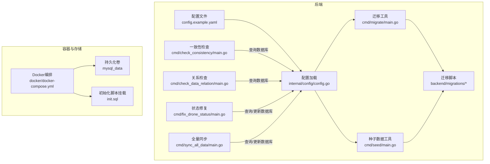
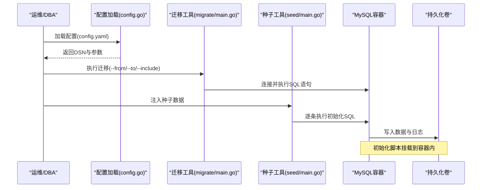
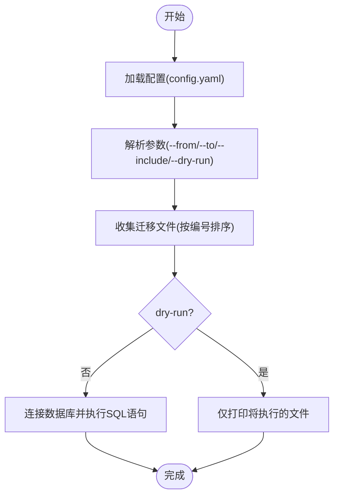
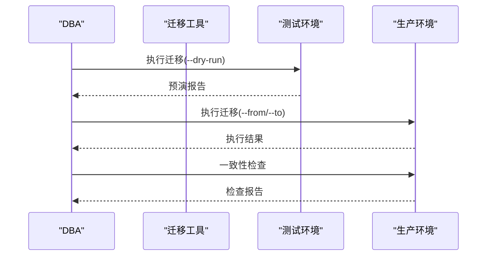
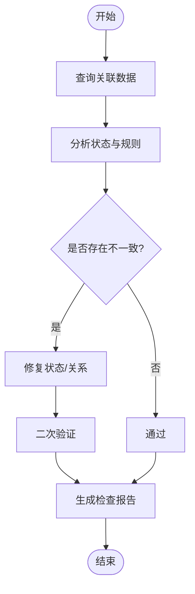
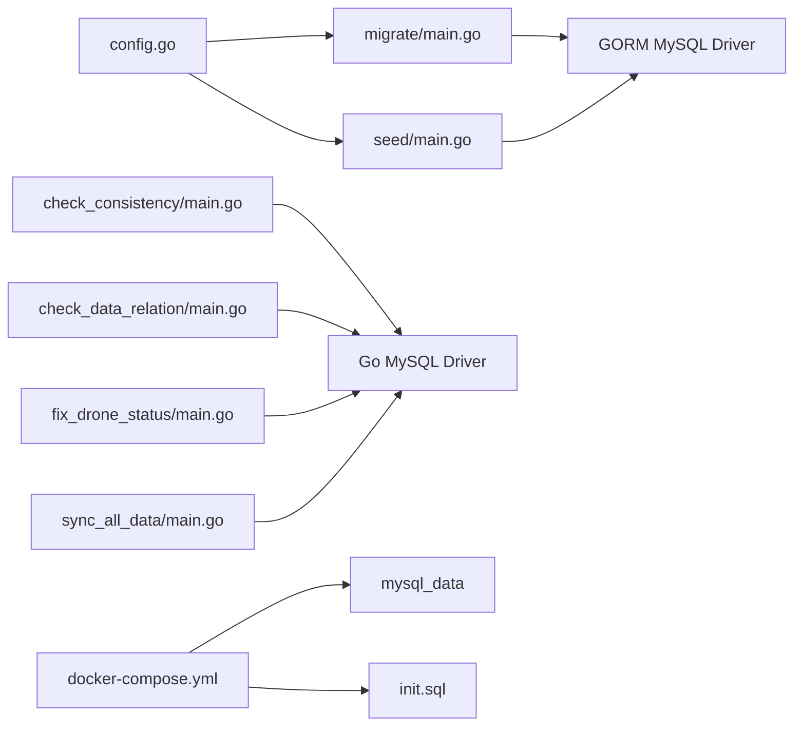

# 数据库备份恢复

<cite>
**本文引用的文件**
- [config.example.yaml](file://backend/config.example.yaml)
- [config.go](file://backend/internal/config/config.go)
- [docker-compose.yml](file://docker/docker-compose.yml)
- [wurenji_backup.sql](file://docker/wurenji_backup.sql)
- [001_init_schema.sql](file://backend/migrations/001_init_schema.sql)
- [002_seed_data.sql](file://backend/migrations/002_seed_data.sql)
- [migrate/main.go](file://backend/cmd/migrate/main.go)
- [seed/main.go](file://backend/cmd/seed/main.go)
- [check_consistency/main.go](file://backend/cmd/check_consistency/main.go)
- [check_data_relation/main.go](file://backend/cmd/check_data_relation/main.go)
- [fix_drone_status/main.go](file://backend/cmd/fix_drone_status/main.go)
- [sync_all_data/main.go](file://backend/cmd/sync_all_data/main.go)
</cite>

## 目录
1. [简介](#简介)
2. [项目结构](#项目结构)
3. [核心组件](#核心组件)
4. [架构总览](#架构总览)
5. [详细组件分析](#详细组件分析)
6. [依赖分析](#依赖分析)
7. [性能考虑](#性能考虑)
8. [故障排查指南](#故障排查指南)
9. [结论](#结论)
10. [附录](#附录)

## 简介
本文件面向DBA与运维团队，提供无人机租赁平台的数据库生命周期管理指南，涵盖备份策略、增量备份配置、备份文件存储管理、数据迁移脚本使用、版本升级流程、数据一致性验证、灾难恢复流程、紧急回滚操作、数据修复方法、备份验证测试、恢复演练计划以及备份监控告警建议。文档基于仓库中的配置、迁移脚本与辅助工具进行整理，帮助在生产环境中建立标准化、可审计、可恢复的数据库管理体系。

## 项目结构
- 数据库配置集中在后端配置文件中，通过DSN连接字符串统一管理主机、端口、账号、数据库名与字符集等参数。
- Docker编排定义了MySQL容器与初始化脚本挂载，便于本地快速搭建与验证。
- 迁移脚本位于migrations目录，采用编号前缀命名，便于顺序执行与版本化演进。
- 提供多个命令行工具用于迁移、种子数据注入、一致性检查、关系校验、状态修复与全量同步。

**图表来源**
- [config.example.yaml:28-56](file://backend/config.example.yaml#L28-L56)
- [config.go:74-78](file://backend/internal/config/config.go#L74-L78)
- [docker/docker-compose.yml:3-14](file://docker/docker-compose.yml#L3-L14)
- [migrate/main.go:25-64](file://backend/cmd/migrate/main.go#L25-L64)
- [seed/main.go:23-34](file://backend/cmd/seed/main.go#L23-L34)

**章节来源**
- [config.example.yaml:28-56](file://backend/config.example.yaml#L28-L56)
- [config.go:74-78](file://backend/internal/config/config.go#L74-L78)
- [docker/docker-compose.yml:3-14](file://docker/docker-compose.yml#L3-L14)

## 核心组件
- 数据库配置与DSN生成：集中于配置结构体与DSN函数，确保连接参数统一、可验证。
- 迁移工具：支持按编号范围或精确包含执行SQL迁移，具备干跑模式与语句级预览。
- 种子数据工具：读取并逐条执行初始化SQL，跳过USE与SELECT等非插入语句。
- 一致性与关系检查：提供跨表一致性验证、供给与无人机关系核对、无人机状态修复与全量同步。
- Docker编排：定义MySQL容器、持久化卷与初始化脚本挂载，便于本地复现。

**章节来源**
- [config.go:61-95](file://backend/internal/config/config.go#L61-L95)
- [config.go:74-78](file://backend/internal/config/config.go#L74-L78)
- [migrate/main.go:25-87](file://backend/cmd/migrate/main.go#L25-L87)
- [seed/main.go:36-109](file://backend/cmd/seed/main.go#L36-L109)
- [check_consistency/main.go:12-133](file://backend/cmd/check_consistency/main.go#L12-L133)
- [check_data_relation/main.go:12-107](file://backend/cmd/check_data_relation/main.go#L12-L107)
- [fix_drone_status/main.go:11-110](file://backend/cmd/fix_drone_status/main.go#L11-L110)
- [sync_all_data/main.go:12-179](file://backend/cmd/sync_all_data/main.go#L12-L179)
- [docker/docker-compose.yml:3-14](file://docker/docker-compose.yml#L3-L14)

## 架构总览
下图展示了数据库配置、迁移与运维工具之间的交互关系，以及容器层的初始化流程。

**图表来源**
- [config.go:415-435](file://backend/internal/config/config.go#L415-L435)
- [migrate/main.go:56-84](file://backend/cmd/migrate/main.go#L56-L84)
- [seed/main.go:28-34](file://backend/cmd/seed/main.go#L28-L34)
- [docker/docker-compose.yml:11-13](file://docker/docker-compose.yml#L11-L13)

## 详细组件分析

### 数据库备份策略
- 全量备份
  - 使用逻辑备份工具导出数据库结构与数据，结合字符集与时间戳命名，便于检索与归档。
  - 建议在业务低峰时段执行，确保一致性。
- 增量备份
  - 基于二进制日志(binlog)进行增量捕获，结合全量备份周期滚动保留，实现快速恢复到分钟级。
  - 需要开启binlog并定期轮转，配合备份工具实现自动化采集与归档。
- 备份文件存储管理
  - 本地与远端双写：本地用于快速恢复，远端用于异地容灾。
  - 分层归档：按日期/版本/环境分类存放，设置保留期限与清理策略。
  - 标准化命名：包含数据库名、时间戳、版本号、备份类型等信息，便于检索与自动化处理。

### 增量备份配置
- binlog配置要点
  - 开启binlog并设置合适的格式(推荐ROW)，保证变更细节完整。
  - 合理设置binlog文件大小阈值与过期时间，避免磁盘占满。
- 自动化采集
  - 结合定时任务与备份工具，定期抓取binlog并打包归档。
  - 对外提供接口或脚本，支持按时间点恢复。

### 备份文件存储管理
- 存储策略
  - 本地SSD高速存储用于近期备份，冷数据迁移到对象存储或磁带库。
  - 设置配额与清理规则，避免空间不足。
- 版本化管理
  - 以“数据库名_环境_日期_批次”命名，批次号递增，便于回溯。
- 访问权限
  - 限制访问用户，加密传输与存储，满足合规要求。

### 数据迁移脚本使用
- 迁移工具
  - 支持按编号范围执行(--from/--to)或精确包含(--include)。
  - 干跑模式(--dry-run)用于预演，避免误操作。
  - 逐条语句执行与错误定位，便于快速修复。
- 种子数据注入
  - 读取初始化SQL，跳过USE与SELECT，逐条执行INSERT等语句。
  - 适用于新环境初始化或测试数据准备。

**图表来源**
- [migrate/main.go:25-87](file://backend/cmd/migrate/main.go#L25-L87)

**章节来源**
- [migrate/main.go:25-87](file://backend/cmd/migrate/main.go#L25-L87)
- [seed/main.go:36-109](file://backend/cmd/seed/main.go#L36-L109)

### 版本升级流程
- 准备阶段
  - 备份当前数据库，确认备份完整性。
  - 在测试环境验证迁移脚本，确保无破坏性变更。
- 执行阶段
  - 使用迁移工具按编号范围执行，观察错误并及时修复。
  - 关注索引、约束、触发器等DDL变更的影响。
- 验证阶段
  - 使用一致性检查与关系检查工具验证数据正确性。
  - 对关键业务指标进行回归测试。

**图表来源**
- [migrate/main.go:25-87](file://backend/cmd/migrate/main.go#L25-L87)
- [check_consistency/main.go:12-133](file://backend/cmd/check_consistency/main.go#L12-L133)

**章节来源**
- [migrate/main.go:25-87](file://backend/cmd/migrate/main.go#L25-L87)
- [check_consistency/main.go:12-133](file://backend/cmd/check_consistency/main.go#L12-L133)

### 数据一致性验证
- 一致性检查
  - 跨表关联查询，验证业务规则与状态一致性。
  - 例如：无人机状态与活跃订单数的关系，供给状态与业务逻辑的匹配。
- 关系检查
  - 校验供给与无人机、机主的绑定关系，确保外键与业务字段一致。
- 状态修复
  - 针对不一致的状态进行批量修复，并二次验证。
- 全量同步
  - 综合检查与修复流程，输出统计报表，形成闭环。

**图表来源**
- [check_consistency/main.go:22-108](file://backend/cmd/check_consistency/main.go#L22-L108)
- [check_data_relation/main.go:22-106](file://backend/cmd/check_data_relation/main.go#L22-L106)
- [fix_drone_status/main.go:21-109](file://backend/cmd/fix_drone_status/main.go#L21-L109)
- [sync_all_data/main.go:22-178](file://backend/cmd/sync_all_data/main.go#L22-L178)

**章节来源**
- [check_consistency/main.go:12-133](file://backend/cmd/check_consistency/main.go#L12-L133)
- [check_data_relation/main.go:12-107](file://backend/cmd/check_data_relation/main.go#L12-L107)
- [fix_drone_status/main.go:11-110](file://backend/cmd/fix_drone_status/main.go#L11-L110)
- [sync_all_data/main.go:12-179](file://backend/cmd/sync_all_data/main.go#L12-L179)

### 灾难恢复流程
- 快速评估
  - 判断故障类型(硬件、网络、数据损坏、误删除)与影响范围。
  - 确认最近可用备份的时间点与完整性。
- 恢复执行
  - 优先使用最近全量备份，再应用对应时间段的binlog增量。
  - 在隔离环境先恢复验证，确保业务数据与应用兼容。
- 业务切换
  - 逐步切流，监控关键指标，确认无异常后再完全接管。
- 回归测试
  - 执行一致性检查与核心功能回归，确保系统稳定。

### 紧急回滚操作
- 回滚策略
  - 若升级导致业务异常，立即回退到上一个稳定的全量备份。
  - 如有binlog，回放至升级前的时间点，确保数据一致性。
- 回滚验证
  - 使用一致性检查工具与关键报表对比，确认回滚成功。
- 事后复盘
  - 记录回滚原因、过程与改进措施，完善迁移规范。

### 数据修复方法
- 自动修复
  - 使用状态修复与全量同步工具，批量修正不一致状态。
- 手工修复
  - 针对复杂场景编写SQL脚本，先在测试环境验证，再在生产执行。
- 预防机制
  - 在迁移脚本中加入前置校验与回滚点，降低风险。

**章节来源**
- [fix_drone_status/main.go:11-110](file://backend/cmd/fix_drone_status/main.go#L11-L110)
- [sync_all_data/main.go:12-179](file://backend/cmd/sync_all_data/main.go#L12-L179)

### 备份验证测试与恢复演练计划
- 备份验证测试
  - 定期抽取随机备份进行抽样恢复，验证备份文件完整性与可恢复性。
  - 验证点：数据库连通性、表结构一致性、关键数据条目核对。
- 恢复演练计划
  - 每季度组织一次模拟灾难恢复演练，覆盖全量+增量恢复场景。
  - 记录演练过程与耗时，持续优化恢复流程与工具。

### 备份监控告警
- 监控维度
  - 备份成功率、备份耗时、备份文件大小变化、binlog增量延迟。
- 告警策略
  - 失败即告警；延迟超过阈值触发预警；存储空间不足提前预警。
- 告警通道
  - 邮件、IM、电话等多通道并行，确保及时处置。

## 依赖分析
- 配置依赖
  - 迁移与种子工具均依赖配置加载模块生成DSN，确保连接参数一致。
- 工具依赖
  - 迁移工具依赖GORM与MySQL驱动，逐条执行SQL语句。
  - 检查类工具依赖原生SQL驱动，直接查询数据库并输出结果。
- 容器依赖
  - Docker编排定义MySQL容器、持久化卷与初始化脚本挂载，支撑本地复现。

**图表来源**
- [config.go:415-435](file://backend/internal/config/config.go#L415-L435)
- [migrate/main.go:13-17](file://backend/cmd/migrate/main.go#L13-L17)
- [seed/main.go:9-14](file://backend/cmd/seed/main.go#L9-L14)
- [check_consistency/main.go](file://backend/cmd/check_consistency/main.go#L9)
- [check_data_relation/main.go](file://backend/cmd/check_data_relation/main.go#L9)
- [fix_drone_status/main.go](file://backend/cmd/fix_drone_status/main.go#L8)
- [sync_all_data/main.go](file://backend/cmd/sync_all_data/main.go#L9)
- [docker/docker-compose.yml:11-13](file://docker/docker-compose.yml#L11-L13)

**章节来源**
- [config.go:415-435](file://backend/internal/config/config.go#L415-L435)
- [migrate/main.go:13-17](file://backend/cmd/migrate/main.go#L13-L17)
- [seed/main.go:9-14](file://backend/cmd/seed/main.go#L9-L14)
- [check_consistency/main.go](file://backend/cmd/check_consistency/main.go#L9)
- [check_data_relation/main.go](file://backend/cmd/check_data_relation/main.go#L9)
- [fix_drone_status/main.go](file://backend/cmd/fix_drone_status/main.go#L8)
- [sync_all_data/main.go](file://backend/cmd/sync_all_data/main.go#L9)
- [docker/docker-compose.yml:11-13](file://docker/docker-compose.yml#L11-L13)

## 性能考虑
- 备份性能
  - 全量备份建议在低峰时段执行，避免影响在线业务。
  - 增量备份应尽量缩短窗口，减少binlog堆积。
- 恢复性能
  - 恢复前预热数据库缓冲池，减少恢复时IO压力。
  - 分批导入与索引重建策略，平衡速度与一致性。
- 迁移性能
  - 大表DDL建议分批执行，避免长时间锁表。
  - 使用只读副本或临时从库进行离线迁移，降低对主库影响。

## 故障排查指南
- 连接失败
  - 检查配置文件中的主机、端口、账号与密码，确认DSN拼接正确。
  - 使用容器编排确认MySQL服务已就绪。
- 迁移失败
  - 查看失败语句与上下文，定位语法或约束冲突。
  - 使用干跑模式预演，提前发现潜在问题。
- 数据不一致
  - 使用一致性检查与关系检查工具定位问题表与字段。
  - 通过状态修复与全量同步工具进行批量修复。
- 恢复异常
  - 核对备份时间点与binlog偏移，确保链路完整。
  - 在隔离环境先行验证，确认无误后再切流。

**章节来源**
- [config.go:74-78](file://backend/internal/config/config.go#L74-L78)
- [migrate/main.go:66-84](file://backend/cmd/migrate/main.go#L66-L84)
- [check_consistency/main.go:12-133](file://backend/cmd/check_consistency/main.go#L12-L133)
- [fix_drone_status/main.go:11-110](file://backend/cmd/fix_drone_status/main.go#L11-L110)
- [sync_all_data/main.go:12-179](file://backend/cmd/sync_all_data/main.go#L12-L179)
- [docker/docker-compose.yml:3-14](file://docker/docker-compose.yml#L3-L14)

## 结论
通过标准化的备份策略、严格的增量备份配置、完善的备份文件存储管理、规范化的迁移与验证流程，以及完备的灾难恢复与回滚机制，可以有效保障无人机租赁平台数据库的高可用与可恢复性。建议将本文流程纳入日常运维规范，并结合监控告警体系，持续优化备份与恢复能力。

## 附录
- 数据库初始化脚本与种子数据
  - 初始化脚本定义了核心业务表结构，种子数据用于快速填充测试数据。
- Docker本地复现
  - 通过编排文件与初始化脚本挂载，可在本地快速搭建与验证数据库环境。

**章节来源**
- [001_init_schema.sql:1-200](file://backend/migrations/001_init_schema.sql#L1-L200)
- [002_seed_data.sql](file://backend/migrations/002_seed_data.sql)
- [docker/docker-compose.yml:11-13](file://docker/docker-compose.yml#L11-L13)
- [wurenji_backup.sql:1-21](file://docker/wurenji_backup.sql#L1-L21)