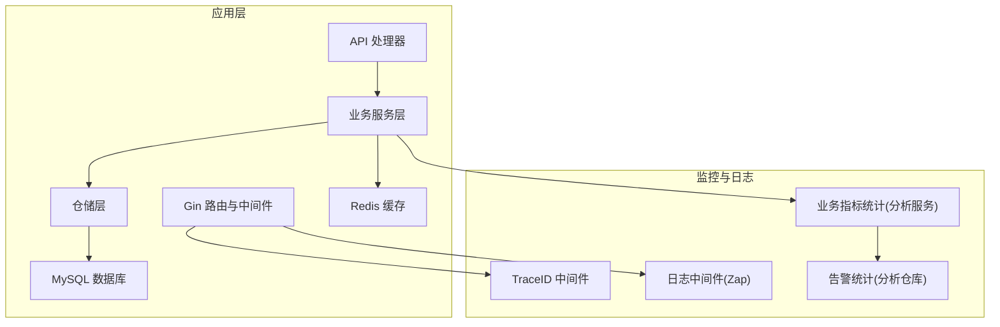
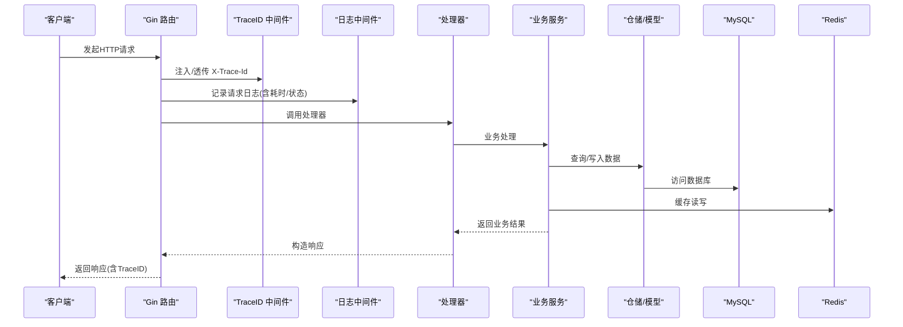
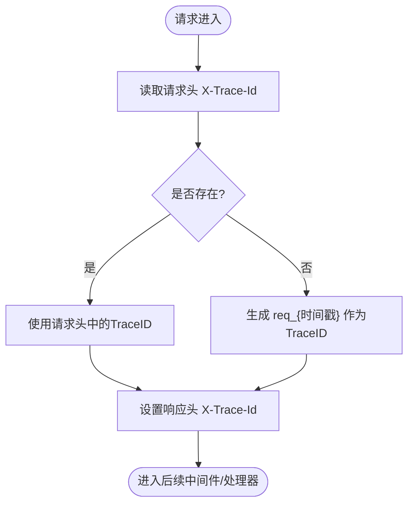
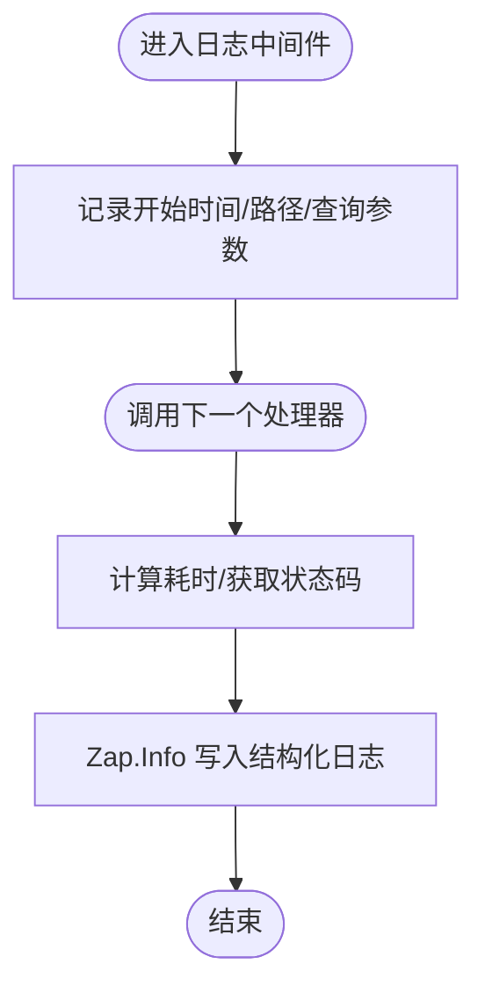
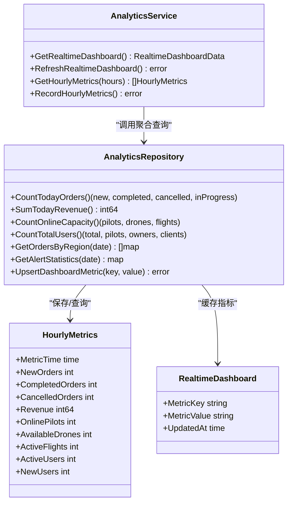
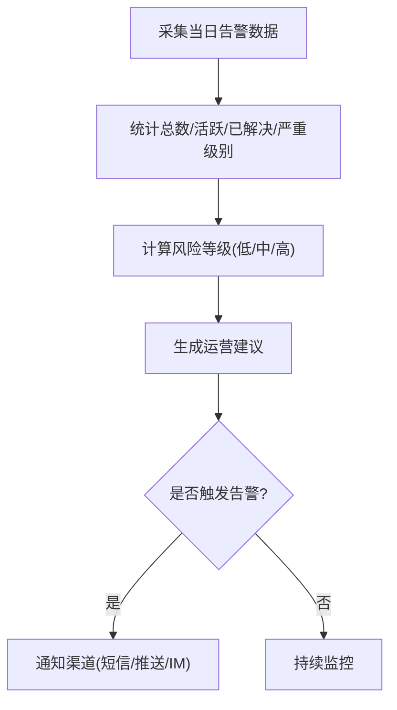
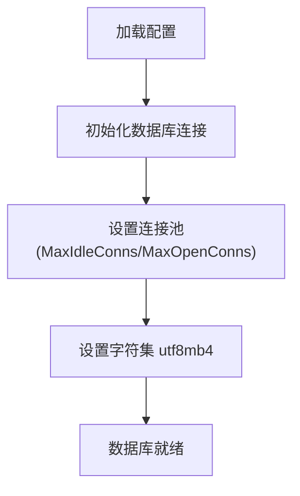
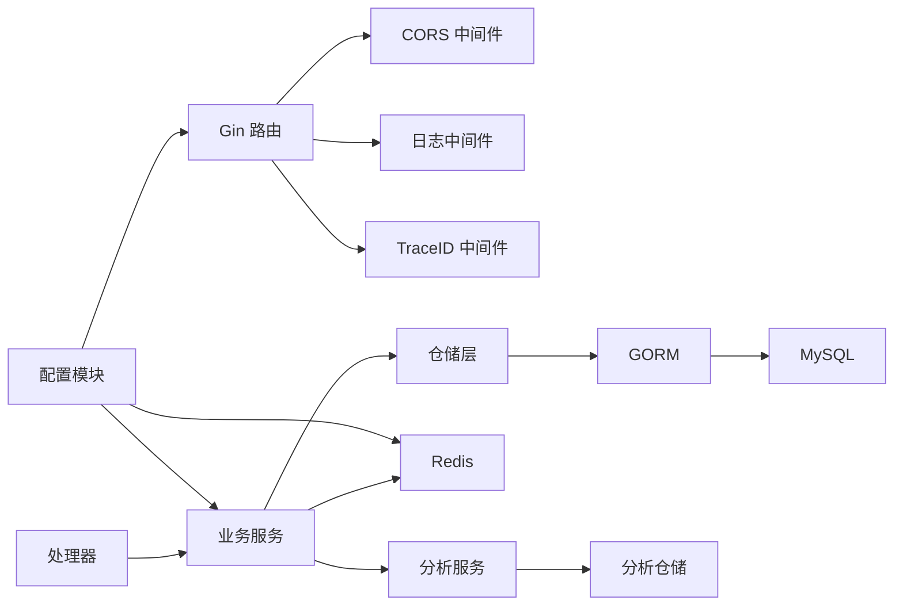

# 监控告警系统

<cite>
**本文档引用的文件**
- [backend/internal/api/middleware/logger.go](file://backend/internal/api/middleware/logger.go)
- [backend/internal/api/middleware/trace_id.go](file://backend/internal/api/middleware/trace_id.go)
- [backend/internal/pkg/response/v2.go](file://backend/internal/pkg/response/v2.go)
- [backend/internal/service/analytics_service.go](file://backend/internal/service/analytics_service.go)
- [backend/internal/repository/analytics_repo.go](file://backend/internal/repository/analytics_repo.go)
- [backend/internal/model/models.go](file://backend/internal/model/models.go)
- [backend/internal/config/config.go](file://backend/internal/config/config.go)
- [backend/cmd/server/main.go](file://backend/cmd/server/main.go)
- [backend/config.example.yaml](file://backend/config.example.yaml)
</cite>

## 目录
1. [简介](#简介)
2. [项目结构](#项目结构)
3. [核心组件](#核心组件)
4. [架构总览](#架构总览)
5. [详细组件分析](#详细组件分析)
6. [依赖关系分析](#依赖关系分析)
7. [性能考虑](#性能考虑)
8. [故障排查指南](#故障排查指南)
9. [结论](#结论)
10. [附录](#附录)

## 简介
本文件为无人机租赁平台的监控告警系统提供完整的技术文档，面向运维团队，涵盖应用服务器监控指标采集、日志聚合分析、性能监控配置；详细说明请求追踪ID生成、错误日志记录、业务指标统计；解释告警规则设置、阈值配置、通知渠道集成；并包含数据库连接池监控、Redis缓存性能监控、API响应时间监控；最后提供监控仪表板配置、告警处理流程、SLA指标跟踪等实用指南。

## 项目结构
后端采用Go语言开发，基于Gin框架构建REST API，并通过GORM进行数据库访问。监控与告警能力主要体现在以下方面：
- 请求链路追踪：通过中间件注入与透传X-Trace-Id，统一日志与响应体中的追踪ID。
- 日志采集：使用Zap结构化日志，在中间件中记录请求耗时、状态码、客户端IP等关键信息。
- 业务指标：通过分析服务聚合订单、收入、运力、用户、飞行、风控等指标，形成实时看板与报表。
- 告警统计：基于飞行告警表统计当日告警总量、活跃数、已解决数及严重级别分布。
- 配置化监控：数据库连接池参数、Redis连接配置、日志级别等均通过配置文件集中管理。

**图表来源**
- [backend/cmd/server/main.go:249-266](file://backend/cmd/server/main.go#L249-L266)
- [backend/internal/api/middleware/logger.go:10-31](file://backend/internal/api/middleware/logger.go#L10-L31)
- [backend/internal/api/middleware/trace_id.go:12-22](file://backend/internal/api/middleware/trace_id.go#L12-L22)
- [backend/internal/service/analytics_service.go:91-158](file://backend/internal/service/analytics_service.go#L91-L158)
- [backend/internal/repository/analytics_repo.go:451-480](file://backend/internal/repository/analytics_repo.go#L451-L480)

**章节来源**
- [backend/cmd/server/main.go:249-266](file://backend/cmd/server/main.go#L249-L266)
- [backend/internal/api/middleware/logger.go:10-31](file://backend/internal/api/middleware/logger.go#L10-L31)
- [backend/internal/api/middleware/trace_id.go:12-22](file://backend/internal/api/middleware/trace_id.go#L12-L22)

## 核心组件
- 请求追踪中间件：负责生成或读取X-Trace-Id，并在响应头中返回，便于跨服务链路追踪。
- 日志中间件：记录请求路径、方法、查询参数、客户端IP、耗时、响应体大小、状态码等。
- 响应封装中间件：在V2响应体中携带TraceID，便于定位问题。
- 业务指标服务：聚合今日订单、收入、在线运力、用户、区域TOP、系统健康等指标，形成实时看板。
- 告警统计仓库：按日统计告警总数、活跃数、已解决数、严重级别分布，支撑风控分析。
- 配置中心：集中管理数据库连接池、Redis、日志级别、CORS、JWT等配置。

**章节来源**
- [backend/internal/api/middleware/trace_id.go:12-34](file://backend/internal/api/middleware/trace_id.go#L12-L34)
- [backend/internal/api/middleware/logger.go:10-31](file://backend/internal/api/middleware/logger.go#L10-L31)
- [backend/internal/pkg/response/v2.go:111-121](file://backend/internal/pkg/response/v2.go#L111-L121)
- [backend/internal/service/analytics_service.go:91-158](file://backend/internal/service/analytics_service.go#L91-L158)
- [backend/internal/repository/analytics_repo.go:451-480](file://backend/internal/repository/analytics_repo.go#L451-L480)
- [backend/internal/config/config.go:61-95](file://backend/internal/config/config.go#L61-L95)

## 架构总览
下图展示监控告警系统的整体交互关系：请求进入Gin路由后经过TraceID与日志中间件，随后进入业务处理器，调用服务层与仓储层，最终访问数据库与Redis；同时分析服务对业务数据进行聚合，生成实时看板与报表；告警统计从飞行告警表中提取当日告警数据。

**图表来源**
- [backend/cmd/server/main.go:249-266](file://backend/cmd/server/main.go#L249-L266)
- [backend/internal/api/middleware/trace_id.go:12-22](file://backend/internal/api/middleware/trace_id.go#L12-L22)
- [backend/internal/api/middleware/logger.go:10-31](file://backend/internal/api/middleware/logger.go#L10-L31)
- [backend/internal/pkg/response/v2.go:111-121](file://backend/internal/pkg/response/v2.go#L111-L121)

## 详细组件分析

### 请求追踪ID生成与透传
- 优先从请求头读取X-Trace-Id，若不存在则生成req_{纳秒级时间戳}作为TraceID。
- 将TraceID写入响应头，便于前端与下游服务复用。
- V2响应体中同样携带TraceID，便于问题定位与日志关联。

**图表来源**
- [backend/internal/api/middleware/trace_id.go:12-22](file://backend/internal/api/middleware/trace_id.go#L12-L22)

**章节来源**
- [backend/internal/api/middleware/trace_id.go:12-34](file://backend/internal/api/middleware/trace_id.go#L12-L34)
- [backend/internal/pkg/response/v2.go:111-121](file://backend/internal/pkg/response/v2.go#L111-L121)

### 错误日志记录与结构化输出
- 使用Zap记录每次请求的关键信息：状态码、方法、路径、查询参数、客户端IP、耗时、响应体大小。
- 结构化字段便于日志聚合系统进行过滤、统计与告警。

**图表来源**
- [backend/internal/api/middleware/logger.go:10-31](file://backend/internal/api/middleware/logger.go#L10-L31)

**章节来源**
- [backend/internal/api/middleware/logger.go:10-31](file://backend/internal/api/middleware/logger.go#L10-L31)

### 业务指标统计与实时看板
- 指标维度：今日订单（新增/完成/取消/进行中）、完成率；今日收入（平台费、飞手收入、机主收入）；在线运力（飞手、无人机、飞行中）；活跃用户（总数、飞手、机主、客户）；告警摘要（活跃、今日已解决、严重级别）；区域TOP（区域、订单数、收入）；系统健康（状态、API延迟、数据库连接数）。
- 指标来源：仓储层聚合查询，分析服务进行二次加工与缓存更新。
- 缓存策略：将各指标序列化后写入实时看板缓存表，供仪表板快速读取。

**图表来源**
- [backend/internal/service/analytics_service.go:91-190](file://backend/internal/service/analytics_service.go#L91-L190)
- [backend/internal/repository/analytics_repo.go:232-480](file://backend/internal/repository/analytics_repo.go#L232-L480)
- [backend/internal/model/models.go:2570-2700](file://backend/internal/model/models.go#L2570-L2700)

**章节来源**
- [backend/internal/service/analytics_service.go:91-190](file://backend/internal/service/analytics_service.go#L91-L190)
- [backend/internal/repository/analytics_repo.go:232-480](file://backend/internal/repository/analytics_repo.go#L232-L480)
- [backend/internal/model/models.go:2570-2700](file://backend/internal/model/models.go#L2570-L2700)

### 告警规则设置与阈值配置
- 告警统计：按日统计告警总数、活跃数、已解决数、严重级别（critical/warning/info）分布。
- 风控分析：基于历史数据计算风险等级（低/中/高），并生成运营建议。
- 告警类型：包括低电量、禁飞区、偏航、信号丢失、高度/速度异常、天气等。
- 建议：当告警次数超过阈值或违规次数增多时，触发预警与人工审核流程。

**图表来源**
- [backend/internal/repository/analytics_repo.go:451-480](file://backend/internal/repository/analytics_repo.go#L451-L480)
- [backend/internal/service/analytics_service.go:577-602](file://backend/internal/service/analytics_service.go#L577-L602)
- [backend/internal/model/models.go:1386-1412](file://backend/internal/model/models.go#L1386-L1412)

**章节来源**
- [backend/internal/repository/analytics_repo.go:451-480](file://backend/internal/repository/analytics_repo.go#L451-L480)
- [backend/internal/service/analytics_service.go:577-602](file://backend/internal/service/analytics_service.go#L577-L602)
- [backend/internal/model/models.go:1386-1412](file://backend/internal/model/models.go#L1386-L1412)

### 数据库连接池监控
- 连接池参数：最大空闲连接数、最大打开连接数，通过配置文件集中管理。
- 初始化阶段设置连接池参数，并显式设置字符集。
- 监控要点：连接池利用率、等待时间、超时次数、慢查询占比。

**图表来源**
- [backend/cmd/server/main.go:268-292](file://backend/cmd/server/main.go#L268-L292)
- [backend/internal/config/config.go:61-95](file://backend/internal/config/config.go#L61-L95)

**章节来源**
- [backend/cmd/server/main.go:268-292](file://backend/cmd/server/main.go#L268-L292)
- [backend/internal/config/config.go:61-95](file://backend/internal/config/config.go#L61-L95)
- [backend/config.example.yaml:52-56](file://backend/config.example.yaml#L52-L56)

### Redis缓存性能监控
- Redis连接配置：主机、端口、密码、数据库编号，集中于配置文件。
- 使用场景：令牌黑名单、会话缓存、热点数据缓存。
- 监控要点：连接数、命中率、慢查询、内存使用、过期键数量。

**章节来源**
- [backend/internal/config/config.go:101-126](file://backend/internal/config/config.go#L101-L126)
- [backend/cmd/server/main.go:95-104](file://backend/cmd/server/main.go#L95-L104)

### API响应时间监控
- 日志中间件记录请求耗时，可用于计算P50/P90/P99响应时间。
- 建议：结合分布式追踪系统（如Jaeger/OpenTelemetry）对关键路径进行采样与可视化。

**章节来源**
- [backend/internal/api/middleware/logger.go:10-31](file://backend/internal/api/middleware/logger.go#L10-L31)

### 监控仪表板配置
- 实时看板：包含今日订单、今日收入、在线运力、活跃用户、告警摘要、区域TOP、系统健康等指标卡片。
- 指标缓存：通过实时看板缓存表实现快速读取与刷新。
- 报表生成：支持日报、周报、月报、季报、年报的自动生成与导出。

**章节来源**
- [backend/internal/service/analytics_service.go:91-190](file://backend/internal/service/analytics_service.go#L91-L190)
- [backend/internal/model/models.go:2690-2700](file://backend/internal/model/models.go#L2690-L2700)

### 告警处理流程
- 触发条件：告警次数、违规次数、系统异常等阈值。
- 处理步骤：接收告警 -> 自动分级 -> 通知相关人员 -> 跟踪处置 -> 关闭告警 -> 归档统计。
- 通知渠道：短信、推送、IM等，具体实现取决于配置与集成的服务商。

**章节来源**
- [backend/internal/service/analytics_service.go:635-655](file://backend/internal/service/analytics_service.go#L635-L655)
- [backend/internal/model/models.go:1386-1412](file://backend/internal/model/models.go#L1386-L1412)

### SLA指标跟踪
- 可用性：基于响应时间与错误率计算SLA达标情况。
- 性能：P50/P90/P99响应时间、吞吐量、并发连接数。
- 业务：订单完成率、收入达成率、活跃用户增长率、告警处置及时率。

**章节来源**
- [backend/internal/service/analytics_service.go:431-448](file://backend/internal/service/analytics_service.go#L431-L448)

## 依赖关系分析
- Gin路由依赖中间件：CORS、日志、TraceID。
- 业务服务依赖仓储层，仓储层依赖GORM与数据库。
- 分析服务依赖仓储层进行聚合统计，同时维护实时看板缓存。
- 配置模块集中管理数据库、Redis、日志、JWT等关键参数。

**图表来源**
- [backend/cmd/server/main.go:249-266](file://backend/cmd/server/main.go#L249-L266)
- [backend/internal/config/config.go:16-31](file://backend/internal/config/config.go#L16-L31)

**章节来源**
- [backend/cmd/server/main.go:249-266](file://backend/cmd/server/main.go#L249-L266)
- [backend/internal/config/config.go:16-31](file://backend/internal/config/config.go#L16-L31)

## 性能考虑
- 连接池优化：根据数据库最大连接数与服务器资源合理设置MaxOpenConns与MaxIdleConns，避免连接争用与超时。
- 日志级别：生产环境建议使用Warn级别以上，减少I/O开销；调试时可切换到Debug。
- 缓存策略：热点指标走Redis缓存，降低数据库压力；定期清理过期键，控制内存占用。
- 响应时间：对慢接口进行限流与降级，必要时引入异步处理与队列。

## 故障排查指南
- 无法获取TraceID：检查请求头是否正确传递X-Trace-Id，确认中间件顺序与响应头设置。
- 日志缺失：确认日志中间件已注册，检查Zap日志级别与输出配置。
- 指标不更新：检查分析服务定时任务是否运行，确认实时看板缓存写入逻辑。
- 数据库连接异常：核对配置文件中的DSN、连接池参数，查看连接数与慢查询。
- Redis连接失败：核对主机、端口、密码、DB编号，检查网络连通性与防火墙策略。

**章节来源**
- [backend/internal/api/middleware/trace_id.go:12-34](file://backend/internal/api/middleware/trace_id.go#L12-L34)
- [backend/internal/api/middleware/logger.go:10-31](file://backend/internal/api/middleware/logger.go#L10-L31)
- [backend/internal/service/analytics_service.go:160-190](file://backend/internal/service/analytics_service.go#L160-L190)
- [backend/internal/config/config.go:61-95](file://backend/internal/config/config.go#L61-L95)
- [backend/cmd/server/main.go:95-104](file://backend/cmd/server/main.go#L95-L104)

## 结论
本监控告警系统通过请求追踪、结构化日志、业务指标聚合与告警统计，形成了完整的可观测性闭环。配合配置化的数据库连接池与Redis参数，能够满足生产环境的稳定性与性能要求。建议进一步引入分布式追踪与APM工具，完善SLA监控与自动化告警处理流程。

## 附录
- 配置文件示例：包含数据库连接池参数、Redis配置、日志级别等关键项。
- 数据模型：实时看板缓存、小时指标、区域统计、分析报表等核心表结构。

**章节来源**
- [backend/config.example.yaml:24-56](file://backend/config.example.yaml#L24-L56)
- [backend/internal/model/models.go:2570-2700](file://backend/internal/model/models.go#L2570-L2700)