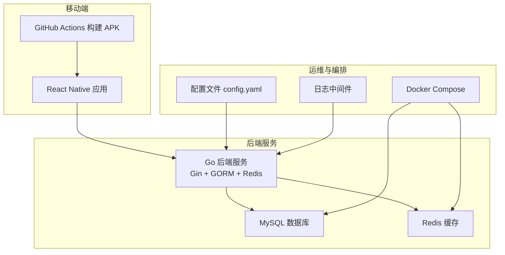
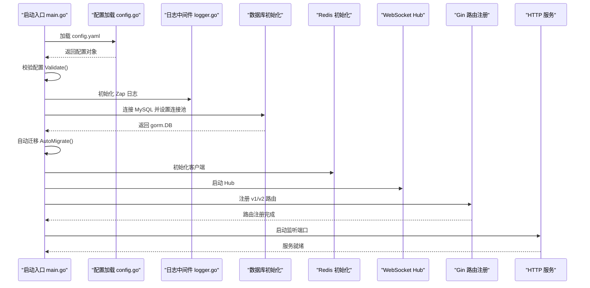
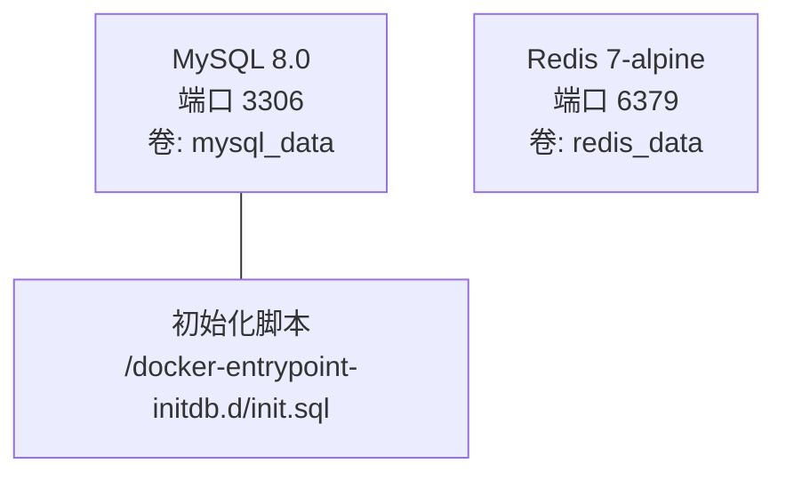
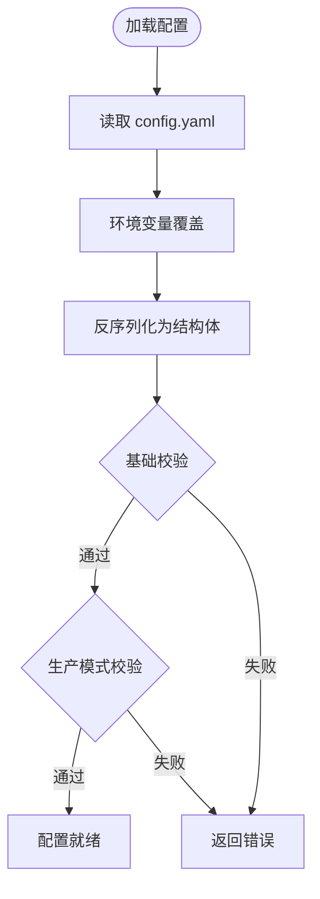
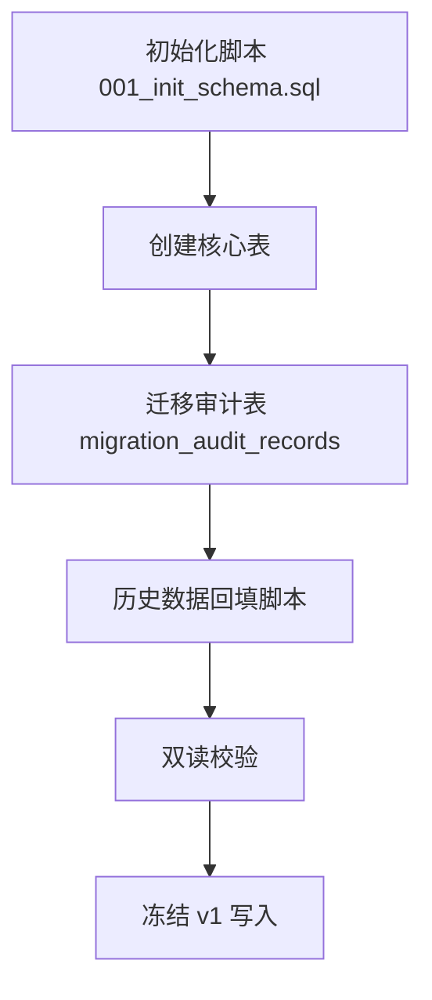
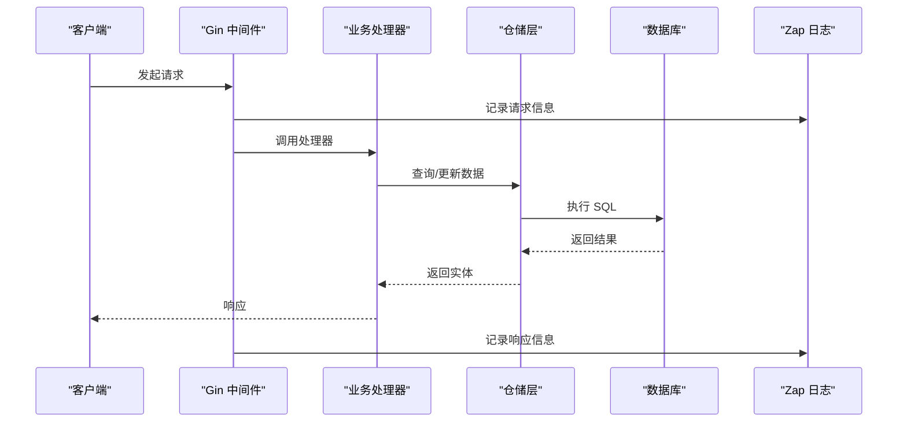
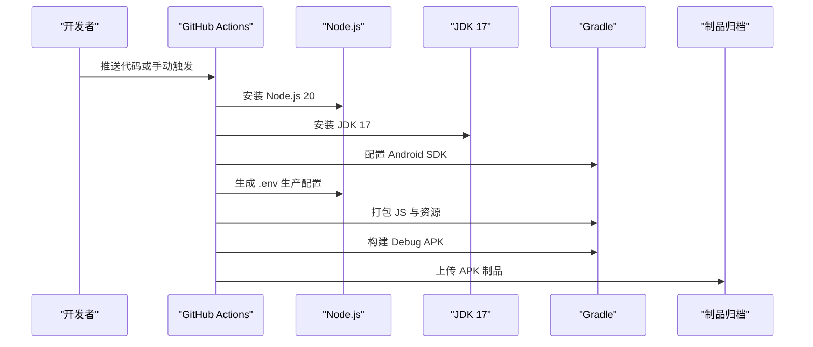
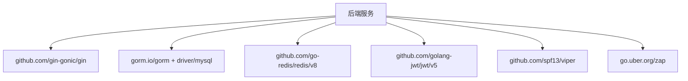

# 部署运维

<cite>
**本文引用的文件**
- [docker-compose.yml](file://docker/docker-compose.yml)
- [wurenji_backup.sql](file://docker/wurenji_backup.sql)
- [config.example.yaml](file://backend/config.example.yaml)
- [go.mod](file://backend/go.mod)
- [main.go](file://backend/cmd/server/main.go)
- [config.go](file://backend/internal/config/config.go)
- [logger.go](file://backend/internal/api/middleware/logger.go)
- [build-android-apk.yml](file://.github/workflows/build-android-apk.yml)
- [package.json](file://mobile/package.json)
- [001_init_schema.sql](file://backend/migrations/001_init_schema.sql)
- [PHASE9_MIGRATION_RUNBOOK.md](file://backend/docs/PHASE9_MIGRATION_RUNBOOK.md)
- [models.go](file://backend/internal/model/models.go)
- [analytics_service.go](file://backend/internal/service/analytics_service.go)
- [router.go](file://backend/internal/api/v2/router.go)
- [README.md](file://README.md)
</cite>

## 目录
1. [简介](#简介)
2. [项目结构](#项目结构)
3. [核心组件](#核心组件)
4. [架构总览](#架构总览)
5. [详细组件分析](#详细组件分析)
6. [依赖关系分析](#依赖关系分析)
7. [性能考量](#性能考量)
8. [故障排查指南](#故障排查指南)
9. [结论](#结论)
10. [附录](#附录)

## 简介
本运维手册面向无人机租赁平台的生产部署与日常运维，涵盖后端服务容器化、移动端 APK 构建与发布、CI/CD 流水线、环境配置管理、数据库迁移与备份恢复、监控与日志、性能监控、故障排查、版本发布与回滚策略、安全配置与容量规划等。文档以仓库现有文件为依据，结合 Go/Gin 技术栈与 React Native 移动端，提供可落地的操作指南。

## 项目结构
项目采用前后端分离与移动端独立工程的组织方式：
- 后端 backend：Go 语言实现，基于 Gin 框架，使用 GORM 连接 MySQL，集成 Redis、JWT、短信、支付、推送、OAuth 等模块。
- 移动端 mobile：React Native 工程，包含 Android/iOS 构建配置与脚本。
- Docker：提供本地开发环境编排，包含 MySQL 与 Redis。
- CI/CD：GitHub Actions 提供移动端 APK 构建流水线。
- 文档：包含 API 文档、迁移方案、验收文档等。

图表来源
- [docker-compose.yml:1-27](file://docker/docker-compose.yml#L1-L27)
- [main.go:52-266](file://backend/cmd/server/main.go#L52-L266)
- [config.go:415-435](file://backend/internal/config/config.go#L415-L435)
- [logger.go:10-31](file://backend/internal/api/middleware/logger.go#L10-L31)
- [build-android-apk.yml:1-74](file://.github/workflows/build-android-apk.yml#L1-L74)

章节来源
- [README.md:1-29](file://README.md#L1-L29)
- [docker-compose.yml:1-27](file://docker/docker-compose.yml#L1-L27)
- [main.go:52-266](file://backend/cmd/server/main.go#L52-L266)
- [config.go:415-435](file://backend/internal/config/config.go#L415-L435)
- [logger.go:10-31](file://backend/internal/api/middleware/logger.go#L10-L31)
- [build-android-apk.yml:1-74](file://.github/workflows/build-android-apk.yml#L1-L74)

## 核心组件
- 配置管理：通过 YAML 配置文件与环境变量覆盖，支持生产环境严格校验。
- 数据库与缓存：MySQL 初始化脚本与 Redis 缓存，配合连接池与字符集设置。
- 中间件与日志：Gin 中间件统一记录请求日志，便于审计与排障。
- 业务服务：认证、用户、无人机、订单、派单、飞行、支付、结算、风控、保险、分析等模块。
- CI/CD：移动端 APK 构建流水线，支持手动触发与产物归档。

章节来源
- [config.example.yaml:1-338](file://backend/config.example.yaml#L1-L338)
- [config.go:437-489](file://backend/internal/config/config.go#L437-L489)
- [001_init_schema.sql:1-200](file://backend/migrations/001_init_schema.sql#L1-L200)
- [logger.go:10-31](file://backend/internal/api/middleware/logger.go#L10-L31)
- [main.go:109-247](file://backend/cmd/server/main.go#L109-L247)
- [build-android-apk.yml:32-74](file://.github/workflows/build-android-apk.yml#L32-L74)

## 架构总览
后端服务启动流程：加载配置 → 校验配置 → 初始化日志 → 连接数据库并自动迁移 → 初始化 Redis 与 WebSocket Hub → 注册路由 → 启动 HTTP 服务。

图表来源
- [main.go:52-266](file://backend/cmd/server/main.go#L52-L266)
- [config.go:415-435](file://backend/internal/config/config.go#L415-L435)
- [logger.go:10-31](file://backend/internal/api/middleware/logger.go#L10-L31)

章节来源
- [main.go:52-266](file://backend/cmd/server/main.go#L52-L266)
- [config.go:437-489](file://backend/internal/config/config.go#L437-L489)

## 详细组件分析

### Docker 容器化与本地编排
- 使用 docker-compose 编排 MySQL 与 Redis，挂载卷持久化数据，初始化脚本在首次启动时导入。
- MySQL 默认字符集与排序规则设置，Redis 使用 Alpine 镜像，端口映射便于本地调试。

图表来源
- [docker-compose.yml:3-26](file://docker/docker-compose.yml#L3-L26)
- [001_init_schema.sql:1-20](file://backend/migrations/001_init_schema.sql#L1-L20)

章节来源
- [docker-compose.yml:1-27](file://docker/docker-compose.yml#L1-L27)
- [001_init_schema.sql:1-200](file://backend/migrations/001_init_schema.sql#L1-L200)

### 配置管理与环境隔离
- 配置文件模板提供完整键位，支持环境变量覆盖（点号转下划线），生产模式需严格校验。
- 关键配置项包括：服务端口、运行模式、数据库 DSN、Redis 地址与密码、JWT 密钥、短信/支付/推送/OAuth 等。

图表来源
- [config.go:415-435](file://backend/internal/config/config.go#L415-L435)
- [config.go:437-489](file://backend/internal/config/config.go#L437-L489)

章节来源
- [config.example.yaml:1-338](file://backend/config.example.yaml#L1-L338)
- [config.go:437-489](file://backend/internal/config/config.go#L437-L489)

### 数据库初始化与迁移
- 初始化脚本创建数据库与核心表，包含用户、无人机、订单、派单、飞行记录、区域统计、看板缓存等。
- 迁移审计与回填脚本支持阶段 9 的双读校验与切流策略，提供回滚与重试指引。

图表来源
- [001_init_schema.sql:1-200](file://backend/migrations/001_init_schema.sql#L1-L200)
- [models.go:670-688](file://backend/internal/model/models.go#L670-L688)
- [PHASE9_MIGRATION_RUNBOOK.md:60-104](file://backend/docs/PHASE9_MIGRATION_RUNBOOK.md#L60-L104)

章节来源
- [001_init_schema.sql:1-200](file://backend/migrations/001_init_schema.sql#L1-L200)
- [models.go:670-688](file://backend/internal/model/models.go#L670-L688)
- [PHASE9_MIGRATION_RUNBOOK.md:60-104](file://backend/docs/PHASE9_MIGRATION_RUNBOOK.md#L60-L104)

### 日志与监控
- 请求日志中间件记录状态码、方法、路径、IP、耗时与响应体大小，便于审计与性能分析。
- 分析服务提供实时看板指标（今日订单、收入、在线运力、用户分布、告警汇总）并缓存到数据库。

图表来源
- [logger.go:10-31](file://backend/internal/api/middleware/logger.go#L10-L31)
- [analytics_service.go:160-181](file://backend/internal/service/analytics_service.go#L160-L181)
- [router.go:223-247](file://backend/internal/api/v2/router.go#L223-L247)

章节来源
- [logger.go:10-31](file://backend/internal/api/middleware/logger.go#L10-L31)
- [analytics_service.go:94-181](file://backend/internal/service/analytics_service.go#L94-L181)
- [router.go:223-247](file://backend/internal/api/v2/router.go#L223-L247)

### 移动端 APK 构建与发布
- GitHub Actions 流水线在 Ubuntu 环境中安装 Node.js 与 JDK 17，配置 Android SDK，生成 .env 生产配置，打包 JS 资源并构建 Debug APK，最终上传制品。
- 移动端工程使用 React Native 0.84，依赖 axios、导航、Redux、地图等库。

图表来源
- [build-android-apk.yml:1-74](file://.github/workflows/build-android-apk.yml#L1-L74)
- [package.json:1-63](file://mobile/package.json#L1-L63)

章节来源
- [build-android-apk.yml:1-74](file://.github/workflows/build-android-apk.yml#L1-L74)
- [package.json:1-63](file://mobile/package.json#L1-L63)

## 依赖关系分析
- 后端依赖：Gin、GORM、MySQL 驱动、Redis 客户端、JWT、Zap、Viper 等。
- 移动端依赖：React Native、导航、Redux、地图、Axios 等。

图表来源
- [go.mod:5-21](file://backend/go.mod#L5-L21)

章节来源
- [go.mod:1-80](file://backend/go.mod#L1-L80)

## 性能考量
- 数据库连接池：通过配置最大空闲与打开连接数，结合字符集设置，避免慢查询与连接争用。
- 日志与中间件：统一记录请求耗时与状态，便于定位慢接口与异常路径。
- 实时看板：缓存关键指标到数据库，减少重复聚合计算压力。
- 移动端构建：使用打包命令将 JS 资源内嵌，减少冷启动与网络开销。

章节来源
- [config.go:73-95](file://backend/internal/config/config.go#L73-L95)
- [logger.go:10-31](file://backend/internal/api/middleware/logger.go#L10-L31)
- [analytics_service.go:160-181](file://backend/internal/service/analytics_service.go#L160-L181)
- [build-android-apk.yml:55-66](file://.github/workflows/build-android-apk.yml#L55-L66)

## 故障排查指南
- 配置校验失败：检查 config.yaml 与环境变量覆盖，确保生产模式与必需项已配置。
- 数据库连接失败：核对 DSN、字符集、排序规则与连接池参数。
- Redis 连接异常：确认地址、端口、密码与 DB 编号。
- 日志缺失：检查日志级别与输出方式，确保中间件已注册。
- 迁移异常：参考迁移手册，先做快照，再根据阶段回填与审计记录进行修复与重试。
- 分析看板异常：检查缓存写入与定时刷新任务，核对指标聚合逻辑。

章节来源
- [config.go:437-489](file://backend/internal/config/config.go#L437-L489)
- [main.go:268-292](file://backend/cmd/server/main.go#L268-L292)
- [logger.go:10-31](file://backend/internal/api/middleware/logger.go#L10-L31)
- [PHASE9_MIGRATION_RUNBOOK.md:60-104](file://backend/docs/PHASE9_MIGRATION_RUNBOOK.md#L60-L104)
- [analytics_service.go:160-181](file://backend/internal/service/analytics_service.go#L160-L181)

## 结论
本手册基于仓库现有文件，提供了从容器化部署、配置管理、CI/CD 构建到数据库迁移、监控日志、性能优化与故障排查的完整运维指南。建议在生产环境中严格执行配置校验、安全加固与容量规划，并持续完善监控与自动化运维流程。

## 附录

### 生产环境部署步骤（建议流程）
- 准备环境：Linux 服务器，安装 Docker 与 Docker Compose。
- 配置文件：复制配置模板为 config.yaml，按生产要求填写数据库、Redis、JWT、短信、支付、推送、OAuth 等关键项。
- 数据库初始化：使用初始化脚本创建数据库与表结构，必要时导入备份数据。
- 启动服务：通过 docker-compose 启动 MySQL 与 Redis，随后启动后端服务。
- 监控与日志：配置日志轮转与集中采集，开启实时看板与关键指标告警。
- 发布与回滚：移动端通过 CI/CD 构建 APK，发布前进行回归测试，回滚策略基于版本标签与制品管理。

章节来源
- [docker-compose.yml:1-27](file://docker/docker-compose.yml#L1-L27)
- [config.example.yaml:1-338](file://backend/config.example.yaml#L1-L338)
- [001_init_schema.sql:1-200](file://backend/migrations/001_init_schema.sql#L1-L200)
- [build-android-apk.yml:1-74](file://.github/workflows/build-android-apk.yml#L1-L74)

### 数据库备份与恢复
- 备份：使用逻辑备份工具导出 SQL，确保包含初始化脚本与历史数据。
- 恢复：在目标环境执行初始化脚本，再导入历史数据，最后验证关键表与索引完整性。
- 备份文件示例：仓库提供备份 SQL 文件，可用于离线备份与迁移场景。

章节来源
- [wurenji_backup.sql:1-21](file://docker/wurenji_backup.sql#L1-L21)
- [001_init_schema.sql:1-200](file://backend/migrations/001_init_schema.sql#L1-L200)

### 版本发布与回滚策略
- 移动端：通过 GitHub Actions 构建 APK，产物归档保留一定周期，按版本打标签。
- 回滚：若发现问题，回退到上一个稳定版本的 APK；同时回滚后端镜像与配置变更。

章节来源
- [build-android-apk.yml:68-74](file://.github/workflows/build-android-apk.yml#L68-L74)
- [package.json:1-63](file://mobile/package.json#L1-L63)

### 安全配置建议
- JWT 密钥：使用足够长度的随机密钥，定期轮换。
- 数据库凭据：使用专用账号与强密码，限制权限。
- Redis：启用密码与网络隔离，避免暴露公网。
- 支付与短信：生产环境禁用 mock，正确配置第三方密钥与回调地址。
- CORS：生产环境限制允许的来源与方法，避免通配符。

章节来源
- [config.example.yaml:82-95](file://backend/config.example.yaml#L82-L95)
- [config.example.yaml:28-56](file://backend/config.example.yaml#L28-L56)
- [config.example.yaml:63-76](file://backend/config.example.yaml#L63-L76)
- [config.example.yaml:122-161](file://backend/config.example.yaml#L122-L161)
- [config.example.yaml:166-214](file://backend/config.example.yaml#L166-L214)
- [config.example.yaml:275-294](file://backend/config.example.yaml#L275-L294)

### 容量规划指导
- 数据库：根据峰值 QPS 与连接数估算，合理设置最大连接数与空闲连接数。
- 缓存：根据会话、验证码、限流等场景估算内存占用，预留冗余。
- 日志：按日志级别与文件大小限制，配置轮转与保留天数。
- 服务：根据并发与响应时间目标，评估 CPU/内存与实例数量。

章节来源
- [config.go:73-95](file://backend/internal/config/config.go#L73-L95)
- [config.go:334-342](file://backend/internal/config/config.go#L334-L342)
- [logger.go:10-31](file://backend/internal/api/middleware/logger.go#L10-L31)