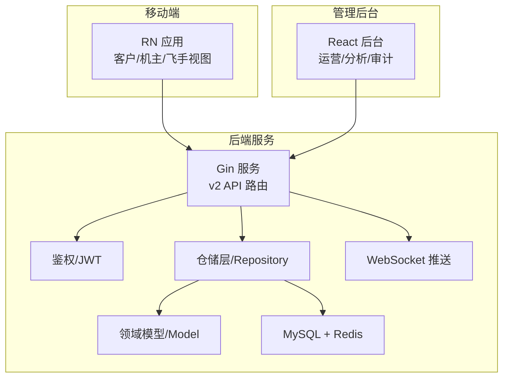
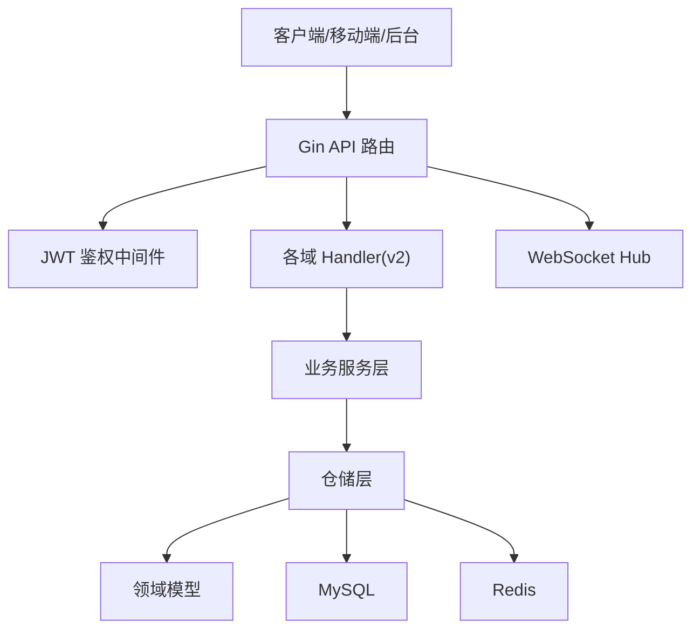
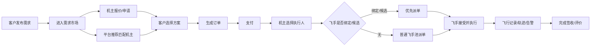
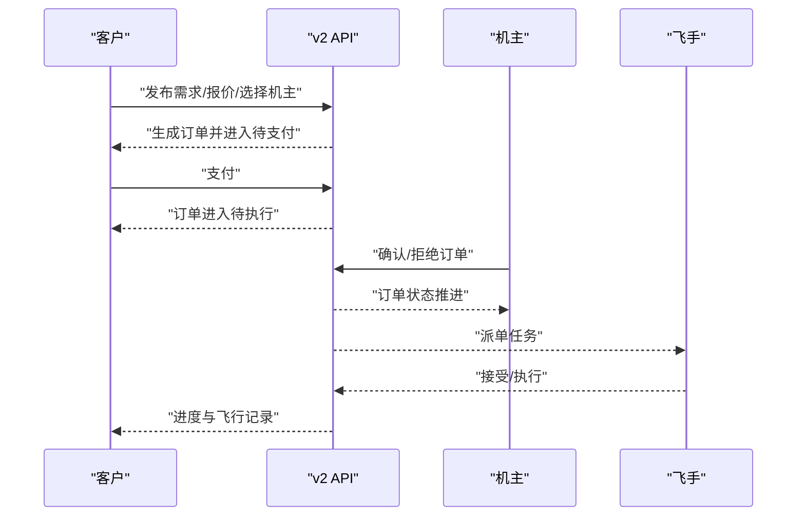
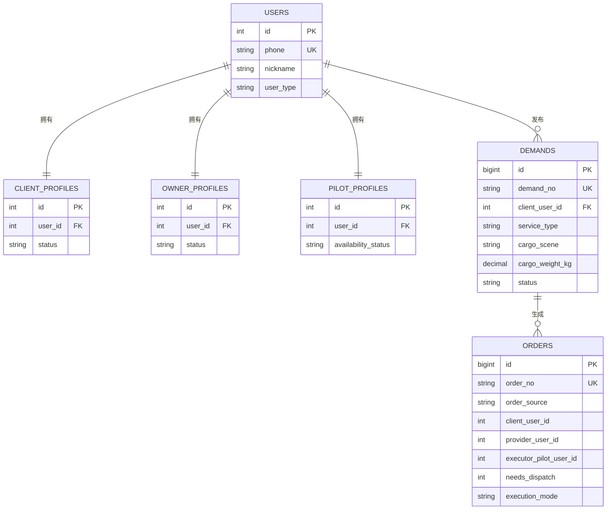
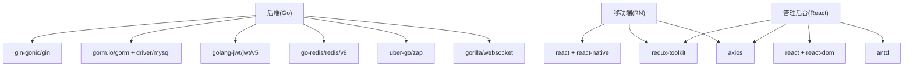

# 项目概述

<cite>
**本文引用的文件**   
- [README.md](file://README.md)
- [BUSINESS_ROLE_REDESIGN.md](file://BUSINESS_ROLE_REDESIGN.md)
- [BUSINESS_API_CONTRACT.md](file://BUSINESS_API_CONTRACT.md)
- [API_V1_V2_DIFF.md](file://backend/docs/API_V1_V2_DIFF.md)
- [openapi-v2.yaml](file://backend/docs/openapi-v2.yaml)
- [go.mod](file://backend/go.mod)
- [models.go](file://backend/internal/model/models.go)
- [101_create_role_profile_tables.sql](file://backend/migrations/101_create_role_profile_tables.sql)
- [103_create_demand_v2_tables.sql](file://backend/migrations/103_create_demand_v2_tables.sql)
- [104_extend_orders_for_v2_sources.sql](file://backend/migrations/104_extend_orders_for_v2_sources.sql)
- [config.example.yaml](file://backend/config.example.yaml)
- [index.ts](file://mobile/src/types/index.ts)
- [package.json](file://admin/package.json)
</cite>

## 目录
1. [引言](#引言)
2. [项目结构](#项目结构)
3. [核心组件](#核心组件)
4. [架构总览](#架构总览)
5. [详细组件分析](#详细组件分析)
6. [依赖分析](#依赖分析)
7. [性能考虑](#性能考虑)
8. [故障排查指南](#故障排查指南)
9. [结论](#结论)
10. [附录](#附录)

## 引言
本项目是面向“重载末端货物吊运”的无人机租赁平台，聚焦于大载重、远距离、复杂地形场景下的专业物流服务。v2 架构以“角色+能力+关系”为核心抽象，将原有的“人即角色”模式升级为“账号 + 能力档案 + 业务关系”，并明确拆分“需求/供给/订单/派单/飞行记录”五类核心对象，形成清晰的业务闭环。

项目目标用户包括：
- 客户：发布需求、下单、支付、查看进度与评价
- 机主：管理无人机资产、发布供给、报价/申请、承接服务订单、指派飞手
- 飞手：认证、上线接单、报名候选、执行飞行任务、记录轨迹
- 复合身份：同时具备客户、机主、飞手能力的个体经营者

业务边界限定在“起飞重量≥150kg、有效吊重大于等于50kg”的重载末端运输，排除城市即时配送、通用航拍/巡检等非目标场景。

## 项目结构
项目采用前后端分离的多模块布局：
- 后端（Go/Gin）：提供 v2 API、鉴权、服务编排、持久化与迁移
- 移动端（React Native）：面向客户/机主/飞手的业务页面与交互
- 管理后台（React + Ant Design）：运营分析、订单/派单/飞行监控、财务与审计
- 文档与迁移：OpenAPI v2、业务契约、角色重构、数据库迁移脚本

图表来源
- [openapi-v2.yaml:1-200](file://backend/docs/openapi-v2.yaml#L1-L200)
- [go.mod:1-80](file://backend/go.mod#L1-L80)

章节来源
- [README.md:1-29](file://README.md#L1-L29)
- [BUSINESS_ROLE_REDESIGN.md:1-800](file://BUSINESS_ROLE_REDESIGN.md#L1-L800)

## 核心组件
- 角色与能力
  - 平台账号：统一登录、实名、钱包、消息、基础资料
  - 客户：默认拥有，负责发布需求、下单、支付、进度查看与评价
  - 机主：扩展能力，负责无人机资产与供给管理、报价/申请、承接订单、指派飞手
  - 飞手：扩展能力，负责认证、接单、报名候选、执行飞行任务
  - 复合身份：同时具备上述能力，可自执行或指派他人执行

- 业务对象
  - 需求（Demands）：客户发布的公开需求，含服务类型、场景、地址、时间、货物参数、预算等
  - 供给（OwnerSupplies）：机主发布的服务能力，含机型门槛、服务区域、计价规则、是否接受直达下单等
  - 订单（Orders）：撮合后生成的履约合同，含来源、责任方、执行模式、派单关系等
  - 派单任务（DispatchTasks）：订单进入执行阶段后，对飞手发出的正式指令
  - 飞行记录（FlightRecords）：任务执行过程中的轨迹、时长、高度、告警等数据

- v1 到 v2 的演进
  - 路由前缀：v1 → /api/v1，v2 → /api/v2
  - 响应结构：v1 使用旧版封装，v2 统一为统一 envelope 结构
  - 业务对象边界：v1 中需求/供给/派单/飞行记录语义混用，v2 明确拆分
  - 迁移策略：v2 与 v1 并行，逐步冻结 v1 写入，前端默认切到 v2

章节来源
- [BUSINESS_ROLE_REDESIGN.md:44-130](file://BUSINESS_ROLE_REDESIGN.md#L44-L130)
- [BUSINESS_API_CONTRACT.md:18-112](file://BUSINESS_API_CONTRACT.md#L18-L112)
- [API_V1_V2_DIFF.md:7-53](file://backend/docs/API_V1_V2_DIFF.md#L7-L53)

## 架构总览
v2 架构以“统一 API + 清晰对象模型 + 可观测执行链路”为核心设计原则：
- API 层：统一 v2 路由，按域划分（Auth/Me/Client/Owner/Pilot/Order/Dispatch/Payment/Settlement/Notification/Review）
- 鉴权层：Bearer Token + JWT，统一响应结构与 trace_id
- 服务层：按业务域拆分 handler/service，职责清晰
- 仓储层：Repository 模式，隔离数据库与业务逻辑
- 数据层：MySQL 存储业务主数据，Redis 缓存验证码/会话/限流
- 推送层：WebSocket 实时通知与飞行监控

图表来源
- [openapi-v2.yaml:1-200](file://backend/docs/openapi-v2.yaml#L1-L200)
- [config.example.yaml:14-57](file://backend/config.example.yaml#L14-L57)

章节来源
- [BUSINESS_API_CONTRACT.md:265-396](file://BUSINESS_API_CONTRACT.md#L265-L396)
- [go.mod:5-21](file://backend/go.mod#L5-L21)

## 详细组件分析

### 角色与业务模型
- 客户
  - 能力：发布需求、管理地址/时间/预算、选择服务方、生成订单并支付、查看进度与评价
  - 默认自动拥有，无需额外申请
- 机主
  - 能力：绑定/新增无人机、维护资质（UOM/保险/适航/维护）、发布供给、浏览需求并报价/申请、接收直达订单、选择执行飞手、承担设备侧履约责任
  - 机主不必默认会飞
- 飞手
  - 能力：完成认证、设置可服务区域/技能类型/接单状态、接受/拒绝派单、公开需求报名候选、执行飞行任务、产生飞行记录与轨迹
  - 不一定拥有自己的无人机
- 复合身份
  - 能力叠加，可选择自执行或内部派飞手流程

图表来源
- [BUSINESS_ROLE_REDESIGN.md:220-382](file://BUSINESS_ROLE_REDESIGN.md#L220-L382)

章节来源
- [BUSINESS_ROLE_REDESIGN.md:74-130](file://BUSINESS_ROLE_REDESIGN.md#L74-L130)

### 订单与执行链路
- 订单来源
  - 需求撮合（demand_market）：客户发布需求，机主报价，客户选择后生成订单
  - 直达下单（supply_direct）：客户直接向机主下单，订单初始状态为待机主确认
- 订单责任关系
  - 订单中明确记录来源、责任方、执行人、设备归属、派单任务等字段，确保可追溯
- 执行阶段
  - 自执行：机主即飞手，订单从支付后可直接进入执行
  - 派单：机主指派绑定飞手或候选飞手，或扩展到普通飞手池
  - 飞行记录：轨迹、时长、高度、告警等数据沉淀，支撑结算与风控

图表来源
- [BUSINESS_ROLE_REDESIGN.md:649-770](file://BUSINESS_ROLE_REDESIGN.md#L649-L770)
- [BUSINESS_API_CONTRACT.md:578-797](file://BUSINESS_API_CONTRACT.md#L578-L797)

章节来源
- [BUSINESS_ROLE_REDESIGN.md:649-770](file://BUSINESS_ROLE_REDESIGN.md#L649-L770)
- [BUSINESS_API_CONTRACT.md:578-797](file://BUSINESS_API_CONTRACT.md#L578-L797)

### 数据模型与迁移
- 角色档案表（v2）
  - client_profiles、owner_profiles、pilot_profiles 三类角色档案，与 users 关联
  - 历史数据回填：从 legacy 用户、无人机、供给、飞手表迁移
- 需求表（Demands）
  - 统一需求对象，含服务类型、场景、地址快照、时间窗口、货物参数、预算、有效期、状态等
  - 历史 rental_demands/cargo_demands 回填
- 订单扩展
  - 新增来源、责任方、执行模式、派单关系等字段，索引优化
  - 历史订单回填来源与关系字段

图表来源
- [101_create_role_profile_tables.sql:5-61](file://backend/migrations/101_create_role_profile_tables.sql#L5-L61)
- [103_create_demand_v2_tables.sql:5-39](file://backend/migrations/103_create_demand_v2_tables.sql#L5-L39)
- [104_extend_orders_for_v2_sources.sql:5-28](file://backend/migrations/104_extend_orders_for_v2_sources.sql#L5-L28)

章节来源
- [models.go:9-199](file://backend/internal/model/models.go#L9-L199)
- [101_create_role_profile_tables.sql:63-141](file://backend/migrations/101_create_role_profile_tables.sql#L63-L141)
- [103_create_demand_v2_tables.sql:93-200](file://backend/migrations/103_create_demand_v2_tables.sql#L93-L200)
- [104_extend_orders_for_v2_sources.sql:29-157](file://backend/migrations/104_extend_orders_for_v2_sources.sql#L29-L157)

### API 与契约
- 统一响应结构：code/message/data/meta/trace_id
- 分页规则：page/page_size，默认 page=1、page_size=20
- 平台边界约束：v2 默认服务类型为 heavy_cargo_lift_transport，供给市场仅返回满足重载门槛的生效供给
- 首页驾驶舱：统一返回角色摘要与聚合数据，不再依赖前端拼角色

章节来源
- [BUSINESS_API_CONTRACT.md:18-112](file://BUSINESS_API_CONTRACT.md#L18-L112)
- [BUSINESS_API_CONTRACT.md:265-396](file://BUSINESS_API_CONTRACT.md#L265-L396)

## 依赖分析
- 后端依赖
  - Web 框架：Gin
  - ORM：GORM + MySQL 驱动
  - 加解密：golang-jwt/jwt/v5
  - 缓存：go-redis/redis/v8
  - 日志：uber-go/zap
  - WebSocket：gorilla/websocket
  - 配置：spf13/viper
- 前端依赖
  - 移动端：React Native + Redux Toolkit + Axios + Ant Design Mobile
  - 管理后台：React + Ant Design + React Router + Redux Toolkit + Axios

图表来源
- [go.mod:5-21](file://backend/go.mod#L5-L21)
- [package.json:14-32](file://admin/package.json#L14-L32)

章节来源
- [go.mod:5-80](file://backend/go.mod#L5-L80)
- [package.json:14-32](file://admin/package.json#L14-L32)

## 性能考虑
- 数据库
  - 为 v2 核心表添加必要索引，优化查询与回填性能
  - 使用连接池与慢查询日志，结合分页与条件过滤
- 缓存
  - 验证码、会话、限流使用 Redis，减少数据库压力
- API
  - 统一分页与响应结构，前端按需加载，避免一次性拉取大量数据
- 实时性
  - WebSocket 用于飞行监控与通知，注意消息大小与心跳周期配置

## 故障排查指南
- 认证与初始化
  - 使用 /api/v2/me 获取角色摘要，确认 has_client_role/has_owner_role/has_pilot_role
  - 如角色不正确，检查 JWT 与后端初始化逻辑
- 订单与派单
  - 通过 /api/v2/orders/{id} 查询订单来源、责任方、执行模式与派单关系
  - 派单任务状态推进需遵循生命周期规则，避免跨状态操作
- 飞行记录
  - 通过 /api/v2/flight-records/{id} 获取飞行记录与位置、告警数据
- 支付与结算
  - 使用 /api/v2/orders/{id}/payments 查询支付记录
  - 退款与争议通过对应接口查询与创建

章节来源
- [BUSINESS_API_CONTRACT.md:578-797](file://BUSINESS_API_CONTRACT.md#L578-L797)
- [API_V1_V2_DIFF.md:150-222](file://backend/docs/API_V1_V2_DIFF.md#L150-L222)

## 结论
v2 架构以“角色+能力+关系”为核心，将业务对象边界清晰化，实现了从“人即角色”到“账号+能力档案+业务关系”的抽象升级。通过统一 API、清晰的生命周期与可观测的执行链路，平台能够稳定支撑重载末端货物吊运的专业场景，并为未来扩展（如设备租赁、服务商团队等）预留空间。

## 附录
- 技术选型理由
  - Go/Gin：高性能、并发友好、生态成熟，适合高并发 API 服务
  - GORM：简洁易用的 ORM，配合 MySQL，满足业务快速迭代
  - React Native：一套代码多端运行，快速验证移动端业务
  - Ant Design：成熟的 UI 组件体系，提升开发与设计效率
- 运维配置
  - MySQL/Redis/JWT/短信/支付等配置集中在 config.yaml，生产环境务必替换默认值
- 前端类型与契约
  - 移动端 TypeScript 类型与 v2 响应结构保持一致，确保前后端契约稳定

章节来源
- [config.example.yaml:14-338](file://backend/config.example.yaml#L14-L338)
- [index.ts:1-909](file://mobile/src/types/index.ts#L1-L909)