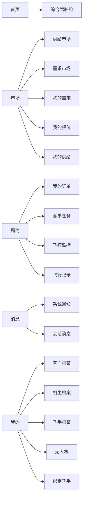

# 无人机服务平台页面信息架构

## 1. 文档目的

本文件用于把 [BUSINESS_ROLE_REDESIGN.md](/Users/yinsw1994/myproject/drone_rental_platform/drone_Rental_platform_v1/BUSINESS_ROLE_REDESIGN.md) 中的业务逻辑，落到移动端页面结构上。

它要解决的不是视觉样式问题，而是：

- 每个页面到底服务哪个业务对象
- 每个角色进入页面时首先应该看到什么
- 哪些页面展示 `需求`，哪些展示 `订单`，哪些展示 `派单任务`
- 哪些按钮应该出现，哪些按钮不该出现

这份文档后续会直接影响：

- 导航结构
- 页面拆分方式
- 接口聚合方式
- 列表和详情页的数据来源

## 2. 全局信息架构原则

### 2.1 四类对象绝不混页

页面层必须严格区分四类对象：

- `需求`
- `供给`
- `订单`
- `派单任务`

约束如下：

- `需求市场` 只展示需求，不展示订单卡片
- `我的订单` 只展示订单，不展示需求卡片
- `派单任务` 只展示派单任务，不展示订单卡片
- `飞行记录` 只展示飞行执行结果，不展示撮合信息

### 2.2 角色不是页面，页面服务的是目标动作

不要把页面仅仅理解为“客户页”“机主页”“飞手页”。

页面设计应围绕动作：

- 客户：发布需求、选择方案、付款、看执行
- 机主：浏览需求、报价、承接、派飞手
- 飞手：接派单、执行、留痕

### 2.3 首页与履约页必须分工明确

- 首页负责“今天最先要处理什么”
- 市场负责“撮合和获客”
- 履约负责“已经成交之后的执行”
- 我的负责“身份、资质、资产和个人资料”

### 2.4 同一对象在列表页与详情页必须保持一致

必须保证：

- 同一对象编号一致
- 状态口径一致
- 操作入口一致

不能再出现：

- 列表里显示“进行中”，详情里显示“已完成”
- 外部显示一个编号，进入详情显示另一个编号
- 页面 A 说是订单，页面 B 实际展示的是派单任务

### 2.5 平台边界必须体现在页面上

本平台不是面向城市即时配送的通用无人机平台，页面层也必须体现这一点。

约束如下：

- 首页、市场页、供给页、订单页的文案统一使用 `重载吊运 / 物资吊运 / 末端运输` 语义
- 市场筛选优先展示 `场景类型 / 吊重能力 / 起飞重量 / 作业区域`，而不是外卖式的轻小件筛选
- 不在页面中出现“同城闪送”“外卖配送”“干线物流”等误导性表达

## 3. 建议的移动端顶层导航

建议移动端采用 5 个一级导航，而不是继续把所有业务挤进当前结构中。

### 3.1 一级导航建议

| 一级导航 | 核心目标 | 核心对象 |
|----------|----------|----------|
| 首页 | 今日优先动作 | 聚合视图 |
| 市场 | 撮合与获客 | 需求、报价、供给 |
| 履约 | 已成交后的执行 | 订单、派单任务、飞行记录 |
| 消息 | 被动触达与沟通 | 通知、聊天 |
| 我的 | 身份、资质、资产、账户 | 档案、无人机、绑定关系 |

## 4. 首页架构

### 4.1 首页的目标

首页不是业务全量入口，而是驾驶舱。

首页只解决三个问题：

- 现在最重要的待办是什么
- 我当前最关心的数据是什么
- 我接下来最该点击哪个动作

### 4.2 首页顶层结构

建议首页固定分成四层：

1. 角色切换或综合视图
2. 驾驶舱摘要卡
3. 紧急待办
4. 快捷入口与动态流

### 4.3 综合驾驶舱

适用人群：

- 同时具备多个身份的用户

展示模块：

| 模块 | 展示内容 |
|------|----------|
| 今日摘要 | 进行中订单数、待响应派单数、待报价需求数 |
| 获客模块 | 新需求、待报价、供给曝光 |
| 执行模块 | 待接派单、今日执行任务、异常提醒 |
| 资产模块 | 无人机状态、资质到期提醒 |

主按钮建议：

- `发布需求`
- `查看新需求`
- `待接派单`

### 4.4 客户驾驶舱

| 区块 | 内容 |
|------|------|
| 摘要卡 | 待选择方案、待支付、进行中服务 |
| 紧急待办 | 新报价提醒、待付款订单、进行中订单 |
| 快捷入口 | 立即发布需求、浏览供给、我的需求、我的订单 |
| 信息流 | 推荐机主、热门重载供给、案例内容 |

空状态建议：

- 没有需求：引导 `发布第一条需求`
- 没有订单：展示服务示例和推荐机主

### 4.5 机主驾驶舱

| 区块 | 内容 |
|------|------|
| 摘要卡 | 新需求数、待报价数、待指派订单数 |
| 紧急待办 | 待报价需求、待处理订单、待派飞手 |
| 快捷入口 | 查看新需求、我的报价、我的供给、绑定飞手 |
| 信息流 | 平台推荐需求、供给曝光数据、资质提醒 |

空状态建议：

- 没有供给：引导 `发布第一条供给`
- 没有可用无人机：引导 `新增无人机`

### 4.6 飞手驾驶舱

| 区块 | 内容 |
|------|------|
| 摘要卡 | 待响应派单、今日任务、最近飞行记录 |
| 紧急待办 | 待接派单、异常任务、资质到期提醒 |
| 快捷入口 | 派单任务、飞行监控、飞行记录 |
| 信息流 | 可报名的公开需求、附近任务热度、个人执行数据 |

空状态建议：

- 未认证：引导 `完成飞手认证`
- 已认证但离线：引导 `切换为在线`

## 5. 市场域架构

### 5.1 `供给市场`

核心对象：`owner_supplies`

适用角色：

- 客户：浏览可直接下单的供给
- 机主：查看自己的供给在市场中的展示效果

页面结构建议：

| 区块 | 内容 |
|------|------|
| 筛选区 | 作业区域、场景类型、最大吊重、起飞重量、航程、是否支持直达下单 |
| 列表区 | 供给卡片 |
| 卡片信息 | 供给编号、标题、场景标签、机主摘要、服务区域、基础价格、设备能力 |
| 主操作 | 客户看到 `查看详情/立即下单`，机主看到 `编辑供给` |

明确约束：

- 供给市场只展示 `active + accepts_direct_order=true` 的供给
- 客户在供给市场不会看到需求卡片
- 直达下单入口必须从供给详情进入，不能在列表页直接跳过关键信息确认

### 5.2 `供给详情`

核心对象：`owner_supply`

角色差异：

- 客户看供给能力、服务范围、设备信息、价格规则，并决定是否发起直达下单
- 机主看自己供给的完整详情、曝光与咨询表现

页面结构建议：

| 区块 | 内容 |
|------|------|
| 头部 | 供给编号、状态、发布时间 |
| 能力区 | 服务类型、场景标签、起飞重量、载重、航程、设备摘要 |
| 覆盖区 | 服务区域、可服务时间段 |
| 价格区 | 基础价格、计价规则 |
| 操作区 | 客户：`发起直达下单`；机主：`编辑供给/暂停供给` |

### 5.3 `直达下单确认`

核心对象：`order draft view`

这是客户从供给详情页发起直达下单时的确认页，提交后直接创建订单，但订单先进入 `pending_provider_confirmation`。

页面结构建议：

| 区块 | 内容 |
|------|------|
| 供给摘要 | 供给编号、机主、设备、服务能力 |
| 服务信息 | 地址、时间、货物信息、补充说明 |
| 价格说明 | 基础价格、预估费用、支付规则 |
| 提示区 | 明确提示“提交后需等待机主确认” |
| 主操作 | `提交直达下单` |

### 5.4 `需求市场`

核心对象：`demands`

适用角色：

- 机主：浏览、报价
- 飞手：浏览允许候选报名的需求摘要

页面结构建议：

| 区块 | 内容 |
|------|------|
| 筛选区 | 作业区域、场景类型、时间、预算、吊重能力、是否开放候选 |
| 列表区 | 需求卡片 |
| 卡片信息 | 需求编号、标题、场景标签、地址、时间、预算、候选飞手数、报价数 |
| 主操作 | 机主看到 `报价/申请`，飞手看到 `报名候选` 或 `仅查看` |

明确约束：

- 机主可见完整需求摘要
- 飞手只可见允许候选报名的需求摘要
- 飞手在市场页不直接看到订单入口

### 5.5 `需求详情`

核心对象：`demand`

角色差异：

- 客户看自己需求的完整详情与报价列表
- 机主看需求详情并可报价
- 飞手看可报名需求的执行摘要，但不看价格竞争细节

页面结构建议：

| 区块 | 内容 |
|------|------|
| 头部 | 需求编号、状态、发布时间 |
| 内容区 | 场景类型、地址、时间、任务说明、货物信息、预算 |
| 撮合区 | 报价数量、候选飞手数量 |
| 操作区 | 客户：查看报价；机主：报价；飞手：报名候选 |

### 5.6 `我的需求`

核心对象：`demands`

仅客户可操作，机主和飞手不应看到此页主入口。

分组建议：

- 草稿
- 询价中
- 已选定
- 已转订单
- 已取消

主按钮：

- `发布需求`

### 5.7 `我的报价`

核心对象：`demand_quotes`

仅机主可见。

分组建议：

- 已提交
- 已选中
- 未中选
- 已过期

卡片字段建议：

- 报价编号
- 关联需求编号
- 需求标题
- 报价金额
- 当前状态

### 5.8 `我的供给`

核心对象：`owner_supplies`

仅机主可见。

分组建议：

- 草稿
- 生效中
- 已暂停
- 已关闭

卡片字段建议：

- 供给编号
- 标题
- 关联无人机
- 当前状态
- 最近曝光/咨询数据

## 6. 履约域架构

### 6.1 `我的订单`

核心对象：`orders`

这是最关键的页面之一，必须彻底与 `派单任务` 分开。

角色可见：

- 客户：看自己购买的订单
- 机主：看自己承接的订单
- 飞手：仅看与自己执行有关的订单

分栏建议：

- 全部
- 待机主确认
- 待支付
- 待派单 / 待执行
- 进行中
- 已完成
- 已取消 / 售后中

卡片字段建议：

- 订单编号
- 来源标识（需求编号或供给编号）
- 当前状态
- 服务地址
- 时间
- 金额
- 承接方 / 执行方摘要

明确约束：

- 订单列表不展示“候选报名状态”
- 飞手在订单页看到的是“我参与执行的订单”，不是“我可接的任务”

### 6.2 `订单详情`

核心对象：`order`

页面必须固定分成五块：

1. 基本信息
2. 参与方信息
3. 执行状态
4. 财务信息
5. 操作区

建议字段：

| 区块 | 字段 |
|------|------|
| 基本信息 | 订单编号、订单来源、来源需求编号/供给编号、状态、创建时间 |
| 参与方 | 客户、机主、执行飞手、无人机 |
| 执行状态 | 是否派单、当前执行节点、派单记录摘要 |
| 财务信息 | 支付金额、退款状态、分账摘要 |
| 操作区 | 支付、取消、查看监控、联系相关方 |

订单详情必须看得见：

- `谁承接`
- `谁执行`
- `是否自执行`
- `是否经过派单`
- `当前派单任务编号`

### 6.3 `派单任务`

核心对象：`dispatch_tasks`

只给机主和飞手主入口，不给客户主入口。

角色视角：

- 机主：看自己发出去的派单
- 飞手：看发给自己的派单

分组建议：

- 待响应
- 已接受
- 执行中
- 已完成
- 已拒绝 / 已超时 / 异常

卡片字段建议：

- 派单编号
- 关联订单编号
- 发起机主 / 目标飞手
- 派单来源
- 状态
- 响应倒计时或响应时间

明确约束：

- 派单列表不展示需求卡片
- 派单详情不承担订单的全部信息展示职责

### 6.4 `派单详情`

核心对象：`dispatch_task`

页面结构建议：

| 区块 | 内容 |
|------|------|
| 头部 | 派单编号、状态、来源 |
| 关联信息 | 订单编号、服务地址、时间、设备摘要 |
| 执行信息 | 目标飞手、派单说明、重派次数 |
| 操作区 | 飞手接受/拒绝，机主重派/取消 |

### 6.5 `飞行监控`

核心对象：`order + active dispatch + flight_record`

角色差异：

- 客户：只读监控视图
- 机主：只读监控视图 + 异常处理入口
- 飞手：执行视图，可上报关键节点

页面固定区块建议：

- 实时状态条
- 地图 / 轨迹
- 飞行数据面板
- 告警面板
- 节点操作区

### 6.6 `飞行记录`

核心对象：`flight_records`

该页和飞行监控不同，它是结果页，不是过程页。

分组建议：

- 全部
- 已完成
- 已中止

卡片字段建议：

- 飞行记录编号
- 关联订单编号
- 起飞时间
- 飞行时长
- 飞行距离
- 最大高度

## 7. 消息域架构

### 7.1 `系统通知`

系统通知必须按业务事件分类，不能只做一个杂乱通知流。

分类建议：

- 需求通知
- 报价通知
- 订单通知
- 派单通知
- 退款通知
- 资质通知

页面建议：

- 顶部采用 `系统通知 / 会话消息` 双标签结构
- 默认优先展示系统通知，并突出未读业务事件数量
- 点击通知后优先跳转到对应业务对象详情，而不是要求用户回聊天里确认状态

### 7.2 `会话消息`

会话消息仅承担人与人沟通，不承担正式业务状态确认。

明确约束：

- 接受/拒绝派单必须走派单系统
- 选择机主必须走需求/报价系统
- 不能靠聊天消息确认业务状态

## 8. 我的域架构

### 8.1 `我的`

“我的”页不应再只显示一个模糊的 `user_type`。

应改为显示：

- 账号信息
- 已拥有身份
- 当前可用能力
- 资质状态
- 资产状态

建议顶部展示：

| 模块 | 内容 |
|------|------|
| 账号卡 | 昵称、手机号、实名状态 |
| 身份卡 | 客户 / 机主 / 飞手 持有情况 |
| 能力卡 | 可发布供给、可接派单、可自执行 |
| 快捷入口 | 客户档案、机主档案、飞手档案 |

### 8.2 `客户档案`

展示内容：

- 默认联系人
- 常用地址
- 历史需求与订单统计

### 8.3 `机主档案`

展示内容：

- 档案审核状态
- 可用无人机数量
- 生效中供给数量
- 绑定飞手数量

主入口：

- 我的无人机
- 我的供给
- 绑定飞手

### 8.4 `飞手档案`

展示内容：

- 认证状态
- 接单状态
- 服务半径
- 技能标签
- 执行统计

主入口：

- 派单任务
- 飞行监控
- 飞行记录

### 8.5 `我的无人机`

核心对象：`drones`

分组建议：

- 可用
- 忙碌
- 维护中
- 不可用

### 8.6 `绑定飞手`

核心对象：`owner_pilot_bindings`

只给机主主入口。

分组建议：

- 待确认
- 合作中
- 已暂停
- 已终止

卡片字段建议：

- 飞手姓名
- 审核状态
- 在线状态
- 是否优先合作

## 9. 页面级空状态与禁用态

后续重构时，空状态必须按业务语义设计，不能统一写“暂无数据”。

建议口径：

| 页面 | 空状态文案方向 |
|------|----------------|
| 客户首页 | 还没有需求，去发布第一条需求 |
| 机主首页 | 还没有生效供给，先完善无人机与供给 |
| 飞手首页 | 暂无待接派单，可先切换在线或完善档案 |
| 我的订单 | 还没有订单，去市场看看或先发布需求 |
| 派单任务 | 暂无派单任务，保持在线以接收任务 |
| 绑定飞手 | 还没有合作飞手，可去邀请或筛选合适飞手 |

禁用态也必须明确原因，不允许只置灰不解释。

例如：

- 不能发布供给：因为无人机资质未通过
- 不能接派单：因为飞手未认证或当前离线
- 不能报名候选：因为该需求未开放候选报名

## 10. 页面信息架构对后续重构的直接帮助

这份文档后续会直接帮助重构三件事：

1. 导航重组
把当前混杂的 tab 和页面入口按业务对象重排。

2. 列表拆分
把 `需求 / 订单 / 派单任务 / 飞行记录` 四类列表彻底拆开。

3. 页面数据聚合
让每个页面只依赖一类主对象和少量关联对象，避免前端拼装复杂业务判断。
