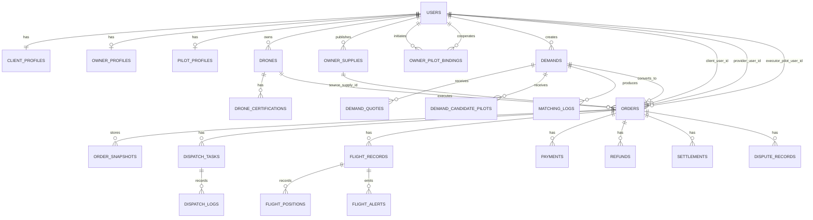

# 无人机服务平台目标数据库关系与迁移方案

## 1. 文档目的

本文件用于承接以下业务设计文档，并把它们进一步落到数据库重构与历史数据迁移层：

- [BUSINESS_ROLE_REDESIGN.md](./BUSINESS_ROLE_REDESIGN.md)
- [BUSINESS_FIELD_DICTIONARY.md](./BUSINESS_FIELD_DICTIONARY.md)
- [BUSINESS_API_CONTRACT.md](./BUSINESS_API_CONTRACT.md)

它要解决的核心问题是：

- 目标数据库结构到底长什么样
- 当前项目已有表如何迁到目标模型
- 哪些表是核心业务表，哪些表是辅助表
- 如何迁移历史数据而不把当前系统一次性打爆

## 2. 重构原则

### 2.1 以目标模型为准，不以现状表结构为准

当前项目已有较多历史表和阶段性表，它们能支持当前演示和局部功能，但不适合作为后续正式重构的骨架。

数据库重构时必须坚持：

- 目标模型服务于清晰业务对象
- 不为了兼容旧表名而牺牲新模型可读性
- 历史兼容通过迁移脚本和过渡层解决

### 2.2 撮合与履约必须彻底分层

后续数据库结构必须按下面两层拆开：

- 撮合层：`需求 / 报价 / 候选飞手 / 匹配日志`
- 履约层：`订单 / 派单任务 / 飞行记录 / 财务 / 争议`

这是整个数据库重构最重要的一条。

补充一条来源规则：

- 订单允许存在两种来源：`demand_market` 与 `supply_direct`
- `demand_market` 来源必须可追溯到 `demands`
- `supply_direct` 来源必须可追溯到 `owner_supplies`

### 2.3 用户角色不再由单字段承担

数据库里不再把 `users.user_type` 当成角色真相源。

后续判断口径应为：

- `users`：账号
- `client_profiles / owner_profiles / pilot_profiles`：身份档案
- `availability_status / verification_status / cert status`：能力可用性

### 2.4 迁移采用“新表先建，旧表并存，逐步切流”

不建议直接在旧表上硬改。

推荐模式：

1. 先建立 v2 目标表
2. 回填历史数据
3. 新接口改写到 v2
4. 新页面切到 v2
5. 最后下线 v1 旧表依赖

### 2.5 平台范围准入必须在迁移期就落地

由于平台明确聚焦重载末端货物吊运，数据迁移时必须同步落实平台准入边界，而不是等页面改完再处理。

固定规则：

- 只有满足 `mtow_kg >= 150` 且 `max_payload_kg >= 50` 的无人机，才允许进入主市场匹配池
- 不满足门槛的历史无人机数据可以保留，但默认不得回填为 `active` 的供给
- 不符合平台范围的历史订单、供给、演示数据要进入迁移审计清单，避免污染 v2 核心口径

### 2.6 开发测试环境优先走“清洁重构”

当前项目仍处于开发测试阶段，历史数据以演示数据、测试数据和阶段性结构为主，不应为了保留这些脏数据而过度复杂化新方案。

因此后续迁移执行时建议遵循：

- 新方案优先，不为测试脏数据牺牲目标模型清晰度
- 能通过一次性重建、重置、重灌种子数据解决的问题，不优先做高成本兼容
- 历史测试数据如果明显污染新模型、主匹配池或状态机，可直接删除、重置或不迁移
- 只有对当前开发联调仍有明确价值的少量数据，才做最低必要的兼容回填
- 若后续需要执行真正的清库、重建或重灌脚本，应在操作前单独确认，避免误删开发中仍需保留的数据

## 3. 目标数据库分层

### 3.1 核心业务层

这是后续重构的第一优先级。

#### 账号与身份

- `users`
- `client_profiles`
- `owner_profiles`
- `pilot_profiles`

#### 设备与供给

- `drones`
- `drone_certifications`
- `owner_supplies`
- `owner_pilot_bindings`

#### 撮合

- `demands`
- `demand_quotes`
- `demand_candidate_pilots`
- `matching_logs`

#### 履约

- `orders`
- `order_snapshots`
- `dispatch_tasks`
- `dispatch_logs`
- `flight_records`
- `flight_positions`
- `flight_alerts`

#### 财务与争议

- `payments`
- `refunds`
- `settlements`
- `dispute_records`

### 3.2 辅助业务层

这些模块不是当前重构第一刀的核心，但需要保留。

- `airspace_*`
- `credit_*`
- `insurance_*`
- `analytics_*`
- `messages`
- `reviews`

建议策略：

- 核心业务先完成切换
- 辅助业务后续逐步适配新订单/角色模型

## 4. 目标关系图

## 5. 当前项目现状表与目标表映射

下面这部分是后续真正写迁移脚本时最重要的参考。

### 5.1 账号与身份相关

| 当前表 | 目标表 | 迁移方式 |
|--------|--------|----------|
| `users` | `users` | 保留主表，清理角色字段语义 |
| `clients` | `client_profiles` | 结构迁移并重命名 |
| `pilots` | `pilot_profiles` | 结构迁移并重命名 |
| 当前无独立 `owner_profiles` | `owner_profiles` | 由具备机主资产/供给能力的用户补齐创建 |

关键规则：

- 所有账号默认补一条 `client_profiles`
- 满足机主条件的用户补 `owner_profiles`
- 已有飞手档案的用户补 `pilot_profiles`

### 5.2 设备与供给相关

| 当前表 | 目标表 | 迁移方式 |
|--------|--------|----------|
| `drones` | `drones` | 保留核心字段，补充新字段命名 |
| `drone_maintenance_logs` | `drone_certifications` 或保留旧表只读 | 优先回填维护类资质历史 |
| `drone_insurance_records` | `drone_certifications` 或保留旧表只读 | 回填保险历史 |
| `rental_offers` | `owner_supplies` | 语义迁移，字段重组 |
| `pilot_drone_bindings` | `owner_pilot_bindings` | 提取 owner-pilot 协作关系 |

说明：

- `pilot_drone_bindings` 当前表达的是 `飞手-无人机-机主` 的绑定关系
- 目标模型中核心先抽成 `owner_user_id + pilot_user_id` 的合作关系
- 新增 `initiated_by` 字段：历史数据因无法追溯发起方，统一回填为 `owner`（默认视为机主邀请）
- 新增 `confirmed_at` 字段：历史 `active` 记录回填为 `created_at`
- 状态映射：历史 `active` → `active`，历史 `terminated/deleted` → `dissolved`，其他 → 进入迁移审计表
- 如果后续还需要”飞手与具体无人机授权关系”，建议再单独补表，而不是混在当前主绑定表里
- 不满足重载门槛的历史无人机仍可保留在 `drones`，但不应自动回填出 `active` 的 `owner_supplies`
- 由于 legacy 模型当前缺失 `mtow_kg`，本轮回填与过渡期双写会将历史 `owner_supplies` 保守写为 `paused / closed / draft`，待 `R1.09` 补齐重载准入字段后再允许进入 `active`
- `R1.09` 完成后，迁移脚本会统一补齐 `drones.mtow_kg / drones.max_payload_kg`，并将不满足重载准入的历史 active 供给降级到 `paused`
- 运行期双写规则也应与迁移口径保持一致：关键资质重新提交进入 `pending` 时立即暂停对应供给；legacy active 供给在无人机重新满足门槛后可自动恢复为 `active`

### 5.3 撮合相关

| 当前表 | 目标表 | 迁移方式 |
|--------|--------|----------|
| `rental_demands` | `demands` | 合并迁移 |
| `cargo_demands` | `demands` | 合并迁移 |
| `cargo_declarations` | `demands.cargo_snapshot` 或辅助引用 | 作为需求货物快照来源 |
| `matching_records` | `matching_logs` | 日志化迁移 |
| 当前无统一报价表 | `demand_quotes` | 由订单/供给撮合关系反推部分历史记录，后续新流程直接写新表 |
| `dispatch_candidates` | `demand_candidate_pilots` 或 `dispatch_logs` | 需按来源拆分迁移 |

说明：

- `rental_demands` 与 `cargo_demands` 在目标模型里都不再作为长期保留主表
- 统一进入 `demands`
- 区别通过快照内容与扩展字段表达，不再靠表名分裂
- 当前真实 legacy `rental_demands / cargo_demands` 并不稳定包含 `client_id` 字段，因此迁移到 `demands.client_user_id` 时应直接以 `renter_id / publisher_id` 为准；若后续个别环境补齐了 `client_id`，也只能作为辅助映射来源，不能作为强依赖

`dispatch_candidates` 的拆分迁移规则建议固定为：

1. 若记录只关联 `demand_id`，且创建时点早于订单生成，不带正式派单响应结果，则迁入 `demand_candidate_pilots`
2. 若记录已经关联 `order_id / dispatch_task_id`，或包含 `accepted / rejected / expired` 等正式派单响应信息，则迁入 `dispatch_logs`
3. 若同一飞手先以候选身份出现，后又被正式派单，则保留候选记录，并额外在 `dispatch_logs` 中补一条 `created/accepted/rejected` 事件
4. 若无法判断记录属于“候选报名”还是“正式派单过程”，则进入迁移审计表，不直接写入目标表

### 5.4 履约相关

| 当前表 | 目标表 | 迁移方式 |
|--------|--------|----------|
| `orders` | `orders` | 保留主表，补齐核心字段 |
| `order_timelines` | 迁移期保留只读，后续映射为状态历史事件 | 不作为新主模型依赖 |
| `dispatch_tasks` | `dispatch_pool_tasks` + 新 `dispatch_tasks` | 旧表显式改名为任务池；新表专用于正式派单 |
| `dispatch_logs` | `dispatch_pool_logs` + 新 `dispatch_logs` | 旧日志保留任务池语义；新表专用于正式派单日志 |
| `flight_positions` | `flight_positions` | 直接保留或重挂新 flight 记录 |
| `flight_alerts` | `flight_alerts` | 直接保留或重挂新 flight 记录 |
| `pilot_flight_logs` | `flight_records` 或保留历史档案 | 根据是否关联订单决定是否迁入主履约链 |

说明：

- 当前 `dispatch_tasks` 更接近“业务任务池”
- 目标模型中的 `dispatch_tasks` 明确指“某订单发给某飞手的一次正式派单”
- 这意味着历史派单数据不能机械 1:1 复制，必须按订单与飞手关系重建

### 5.5 财务与争议相关

| 当前表 | 目标表 | 迁移方式 |
|--------|--------|----------|
| `payments` | `payments` | 保留主表，调整字段语义 |
| `order_settlements` | `settlements` | 迁移重命名 |
| `user_wallets` | 暂保留旧模型 | 不作为第一阶段核心重构阻塞项 |
| `wallet_transactions` | 暂保留旧模型 | 后续对齐 `payments / settlements` |
| `withdrawal_records` | 暂保留旧模型 | 后续接到钱包域 |
| 当前无统一 `refunds` | `refunds` | 从支付与订单取消记录补建；历史无法识别部分退款时进入迁移审计 |
| 当前无统一 `dispute_records` | `dispute_records` | 后续新流程创建 |

## 6. 历史数据迁移规则

### 6.1 用户迁移规则

对每一个 `users.id`：

1. 保留原账号记录
2. 自动补一条 `client_profiles`
3. 如果该用户在 `drones.owner_id` 中出现，或在 `rental_offers.owner_id` 中出现，则补 `owner_profiles`
4. 如果该用户在 `pilots.user_id` 中出现，则补 `pilot_profiles`

### 6.2 需求迁移规则

`rental_demands` 与 `cargo_demands` 都迁入 `demands`：

- 原标题映射到 `title`
- 原地址映射到 `departure_address_snapshot / destination_address_snapshot / service_address_snapshot`
- 原时间映射到 `scheduled_start_at / scheduled_end_at`
- 原货物字段和附属申报字段组装到 `cargo_snapshot`
- 原状态映射到新需求状态

建议保留一张迁移映射表：

- `legacy_table`
- `legacy_id`
- `new_table`
- `new_id`
- `mapping_type`

避免后续回查困难。

### 6.3 订单迁移规则

`orders` 是核心保留对象，但必须补齐以下字段：

- `order_source`
- `demand_id`
- `source_supply_id`
- `provider_user_id`
- `drone_owner_user_id`
- `executor_pilot_user_id`
- `needs_dispatch`
- `execution_mode`
- `paid_at`
- `completed_at`

额外补充一条业务范围规则：

- 如果历史订单对应的无人机、供给或货运场景明显不符合平台重载边界，订单可以保留历史查询能力，但不纳入 v2 主市场统计口径

补齐逻辑建议：

1. 若订单来源于需求表，则 `order_source = demand_market`，并补齐 `demand_id`
2. 若订单来源于供给/挂牌服务直达成交，则 `order_source = supply_direct`，并补齐 `source_supply_id`
3. `provider_user_id` 默认取旧 `owner_id`
4. `drone_owner_user_id` 默认与 `provider_user_id` 一致
5. `executor_pilot_user_id` 优先取旧 `pilot_id`
6. 若无 `pilot_id` 且订单为机主自执行，则写入 `provider_user_id`
7. 若执行人与承接方相同，则 `execution_mode = self_execute`
8. 若执行人为绑定飞手，则 `execution_mode = bound_pilot`
9. 其他需派单情形，`execution_mode = dispatch_pool`

当前项目实现层可直接采用的历史推断规则：

10. 旧 `cargo` 订单默认视为 `demand_market`，`demand_id` 通过 `cargo_demands -> demands` 回填
11. 旧 `dispatch` 订单默认视为 `demand_market`，优先通过 `dispatch_tasks.cargo_demand_id -> demands` 回填 `demand_id`
12. 旧 `rental` 且 `related_id = 0` 的订单，默认视为 `supply_direct`
13. 对于 `supply_direct` 历史订单，`source_supply_id` 优先按 `owner_id + drone_id` 匹配 `owner_supplies`
14. 若历史直达订单未能匹配到 `owner_supplies`，则保留 `source_supply_id = 0`，进入后续迁移审计补齐范围，而不是臆造错误来源

补充约束：

- `order_source = demand_market` 时，`source_supply_id` 可为空
- `order_source = supply_direct` 时，`demand_id` 为空
- 迁移期若无法准确判断来源，则进入迁移审计清单，不允许把不确定来源的记录直接写入目标 `orders`
- `paid_at` 优先由 `payments` 回填，`completed_at` 优先由 `order_timelines` 回填
- `order_snapshots` 至少回填 `client / pricing / execution` 三类快照；可识别来源时再补 `demand / supply`

### 6.4 派单迁移规则

历史 `dispatch_tasks` 与目标模型中的正式派单语义不完全一致，因此迁移规则建议分两类：

1. 原 `dispatch_tasks / dispatch_candidates / dispatch_logs / dispatch_configs` 先整体搬迁为 `dispatch_pool_*`
2. 能明确对应 `order_id + pilot_user_id` 的，再从 `dispatch_pool_tasks` 重建到新 `dispatch_tasks`
3. 不能明确对应关系的，保留在 `dispatch_pool_*`，只用于历史查询，不作为新系统正式派单逻辑依赖

需要额外补的字段：

- `dispatch_no`
- `dispatch_source`
- `retry_count`

### 6.5 飞行记录迁移规则

当前项目里飞行数据来源较杂，建议分层处理：

1. 与订单直接关联的飞行数据，迁为 `flight_records`
2. 仅手工记录、无订单归属的历史飞行日志，保留为历史档案，不纳入履约主链

换句话说：

- `flight_records` 只保存“订单履约飞行”
- 个人手工飞行记录可作为扩展历史，不应污染订单履约数据

落地细则补充：

1. 新建 `flight_records` 主表，作为履约飞行的唯一架次真相源
2. `flight_positions / flight_alerts` 增补 `flight_record_id`，旧 `order_id` 保留用于兼容旧接口查询
3. 历史回填优先依据 `orders.flight_start_time / flight_end_time / actual_flight_*` 与 `flight_positions`
4. 若订单侧证据不足，但 `pilot_flight_logs.order_id` 明确，则允许补一条历史履约飞行记录
5. 无 `order_id` 的纯手工飞行日志继续保留在 `pilot_flight_logs`，不迁入 `flight_records`
6. 回填完成后，订单侧 `actual_flight_distance / actual_flight_duration / max_altitude / flight_start_time / flight_end_time` 反向同步一次，保证旧页面也能读取真实履约汇总

## 7. 迁移执行阶段建议

### 阶段 A：建新表，不切流

目标：

- 建立 v2 目标表
- 不影响当前线上/演示流程

动作：

- 创建 `client_profiles / owner_profiles / pilot_profiles`
- 创建 `demands / demand_quotes / demand_candidate_pilots`
- 创建新的 `owner_supplies / owner_pilot_bindings`
- 为 `orders` 增补缺失字段
- 为 `orders` 增补来源追溯字段和确认状态字段
- 为 `orders` 增补 `paid_at / completed_at`
- 创建 `refunds / dispute_records / order_snapshots`

### 阶段 B：批量回填历史数据

目标：

- 把旧数据尽量映射进新结构

动作：

- 回填档案表
- 合并需求数据
- 补齐历史订单执行字段
- 重建可识别的派单记录
- 生成迁移映射表与迁移审计表

### 阶段 C：后端双读校验

目标：

- 确认新结构与旧结构在关键页面上的结果一致

动作：

- 首页读取新旧结果对比
- 订单列表读取新旧结果对比
- 派单任务读取新旧结果对比
- 飞行记录结果对比
- 使用 `go run ./cmd/check_v2_parity -config config.yaml -limit 3` 输出结构化对比结果
- 若存在缺表、主数据缺失或结果偏差，优先回到迁移审计表和异常订单看板定位

### 阶段 D：新接口切到 v2

目标：

- 新服务层只依赖 v2 模型

动作：

- 新页面全部调用 `/api/v2`
- 新接口只写新表
- 先切移动端，再切后台
- 为后台保留 `/api/v2/admin`、`/api/v2/analytics`、`/api/v2/client/admin/cargo/*` 兼容别名
- 旧接口保留只读或兼容层

### 阶段 E：前端切到新页面结构

目标：

- 页面语义与新业务对象一致

动作：

- 首页切新驾驶舱
- 市场、订单、派单分域
- 我的页改成身份卡与能力卡

### 阶段 F：下线旧依赖

目标：

- 去掉旧逻辑包袱

动作：

- 停止依赖 `user_type`
- 下线旧需求表直接读取逻辑
- 下线旧飞手任务混合展示逻辑
- 清理仅用于兼容的服务代码
- 冻结 `/api/v1` 核心业务写入，仅保留读取兼容与尚未迁移的边缘域

## 8. 建议的迁移脚本拆分

当前开发期已经有 `101-109` 这一组脚本，用来驱动建模和迭代验证。

进入真正的迁移切流阶段时，建议再补一组高位编号脚本，明确拆成：

1. `901_phase9_prepare_v2_schema.sql`
2. `911_phase9_backfill_v2_data.sql`

配套执行说明：

- [PHASE9_MIGRATION_RUNBOOK.md](/Users/yinswc2e/Code/drone_Rental_platform_v1/backend/docs/PHASE9_MIGRATION_RUNBOOK.md)

原则：

- 建表迁移与回填迁移严格分开
- 结构迁移与数据回填严格分开
- 可重复执行的脚本尽量幂等
- 执行期使用高位编号脚本，避免和开发期混合脚本混跑

## 9. 迁移验证清单

重构期间至少验证以下结果：

### 9.1 账号与身份

- 所有现有用户都存在 `client_profiles`
- 有无人机或供给的用户都存在 `owner_profiles`
- 历史飞手都存在 `pilot_profiles`

### 9.2 订单与执行

- 每个历史订单都能确定 `order_source`
- 每个历史订单都能确定 `provider_user_id`
- 直达订单能正确补齐 `source_supply_id`
- 需求转单能正确补齐 `demand_id`
- 能识别执行人的订单都补齐 `executor_pilot_user_id`
- 自执行订单正确写入 `execution_mode=self_execute`
- 派单订单能正确关联 `dispatch_task_id`

### 9.3 页面一致性

- 同一订单在列表与详情页编号一致
- 同一订单在列表与详情页状态一致
- 飞手页只看到派给自己的正式派单
- 订单页不再混入候选报名数据

### 9.4 数据回退能力

- 任意阶段切换失败，仍可退回旧页面与旧接口
- 新旧模型并行期间，旧数据不被破坏

## 10. 当前阶段最值得先做的数据库决策

如果是为了让我后续真正高效重构项目，建议你先把下面这几条当成“不可再改的决定”：

1. `users` 不再承担角色真相源
2. `demands` 统一承接历史需求对象
3. `orders` 必须补齐 `needs_dispatch` 与 `execution_mode`
4. `orders` 必须同时支持 `demand_market` 与 `supply_direct` 两种来源追溯
5. `dispatch_tasks` 明确定义为“订单对飞手的一次正式派单”
6. `flight_records` 只承接履约飞行，不承接纯手工个人飞行日志

只要这六条定住，后面的后端重构会顺很多。
