# 无人机服务平台角色与业务逻辑重构方案

## 1. 重构目标

当前项目里最容易混淆的地方，不是页面入口，而是以下三个概念被混在了一起：

- 人的账号身份
- 平台业务角色
- 订单执行关系

这会直接导致几个问题：

- `业主 / 租客 / 客户 / 货主` 概念重叠
- `机主` 是否必须自己能飞，没有统一定义
- `飞手` 能不能接单，取决于单子类型，但当前逻辑没有拆开
- `订单`、`需求`、`派单` 三个阶段在产品上混用了

因此建议把平台的业务抽象，从“按人分角色”改为“账号 + 能力档案 + 业务关系”。

### 1.1 平台业务边界

这不是一个“泛无人机服务平台”，而是一个面向 `重载末端货物吊运` 的垂直平台。

当前平台边界建议固定为：

- 主要服务对象：`起飞重量 150kg 及以上`、`有效吊重大于等于 50kg` 的重载无人机吊运业务
- 主要业务场景：电力电网建设物资吊运、山区竹木水果及农副产品吊运、高原给养运送、海岛给养及海鲜产品吊运、应急救援物资吊运
- 主要业务形态：偏 `末端重载物资运输`，而不是城市即时配送或干线物流

明确排除的非目标场景：

- 城市外卖、同城闪送、小件即时配送
- 通用支线/干线物流运输
- 通用航拍、测绘、植保、巡检等非重载吊运业务

这条边界会直接影响后续重构中的：

- 服务类型枚举
- 市场筛选条件
- 机型准入门槛
- 历史数据迁移策略
- 页面文案与运营口径

## 2. 新角色模型

### 2.1 基础原则

- 所有人先注册为同一个 `平台账号`
- 默认自动拥有 `客户` 能力
- `机主`、`飞手` 都是扩展能力，不是互斥身份
- 一个人可以同时拥有 `客户 + 机主 + 飞手`
- 真正决定某笔任务谁做、谁拿钱、谁担责的，不是 `user_type`，而是订单里的业务关系字段

### 2.2 推荐角色定义

| 层级 | 名称 | 是否默认拥有 | 核心职责 |
|------|------|-------------|----------|
| 账号层 | 平台账号 | 是 | 登录、实名、钱包、消息、基础资料 |
| 基础业务层 | 客户 | 是 | 发布需求、下单、付款、查看进度 |
| 扩展业务层 | 机主 | 否 | 管理无人机资产、发布供给、报价、承接服务订单 |
| 扩展业务层 | 飞手 | 否 | 接派单、执行飞行任务、记录轨迹、完成履约 |
| 复合业务层 | 机主+飞手 | 否 | 自己承接订单并自己执行 |

### 2.3 命名调整建议

为了降低理解成本，建议统一为：

- `客户`：原来的 `业主 / 租客 / 货主`
- `机主`：无人机资产提供方
- `飞手`：飞行执行者

不建议继续把默认角色叫 `业主`，因为它在中文语境里容易被理解为“资产拥有者”，和 `机主` 冲突。

## 3. 角色能力边界

### 3.1 客户

客户默认具备以下能力：

- 发布需求
- 管理地址、服务时间、预算
- 选择服务方
- 生成订单并支付
- 查看订单进度、监控、评价

客户不需要再“申请成为客户”，注册后应自动生成个人客户档案。

### 3.2 机主

机主的本质不是“会飞的人”，而是“设备与服务供给方”。

机主负责：

- 新增/绑定无人机
- 维护无人机资质：UOM、保险、适航、维护记录
- 发布供给
- 浏览市场需求并报价/申请
- 接收客户直达订单
- 为订单选择执行飞手
- 承担设备侧履约责任

机主不必默认会飞。

### 3.3 飞手

飞手的本质是“任务执行者”。

飞手负责：

- 完成认证
- 设置可服务区域、技能类型、接单状态
- 接受/拒绝派单
- 对公开需求报名候选
- 执行飞行任务
- 产生飞行记录、轨迹、告警、完成留痕

飞手不一定拥有自己的无人机。

### 3.4 机主+飞手

这是非常重要的复合身份，适合个体经营者。

该身份具备：

- 机主全部能力
- 飞手全部能力
- 拿到订单后可以选择“自己执行”
- 选择自己执行时，不再走内部派飞手流程

## 4. 订单模型重构建议

### 4.1 关键结论

平台里不要一上来就“发布订单”，而应该先“发布需求”。

建议统一成下面的业务阶段：

1. 发布需求
2. 市场撮合
3. 确认方案
4. 生成订单
5. 执行任务
6. 完成结算

### 4.2 四类核心对象

| 对象 | 含义 | 阶段 |
|------|------|------|
| 需求 | 客户提出服务请求 | 撮合前 |
| 供给 | 机主发布可提供的服务能力 | 撮合前 |
| 订单 | 客户与服务方确认后的履约合同 | 撮合后 |
| 派单任务 | 订单进入执行阶段后，对飞手发出的执行指令 | 执行中 |

### 4.3 为什么要拆开

如果不拆，会出现几个典型问题：

- 客户“发布订单”后，订单其实还没服务方，语义错误
- 飞手待接单列表和订单列表互相打架
- 机主拿单和机主派飞手是两个不同阶段，但当前页面会混成一个动作

### 4.4 需求对象核心字段

| 字段 | 类型 | 必填 | 说明 |
|------|------|------|------|
| demand_id | string | 自动生成 | 需求唯一标识 |
| client_user_id | string | 是 | 发布需求的客户 |
| title | string | 是 | 需求标题（如"电网塔材山区吊运"） |
| service_type | enum | 是 | 当前阶段固定为：`heavy_cargo_lift_transport` |
| cargo_scene | enum | 是 | 场景类型：`power_grid_material`、`mountain_agri`、`plateau_supply`、`island_supply`、`emergency_relief`、`other_heavy_lift` |
| departure_address | object | 是 | 出发地址（经纬度 + 文字描述） |
| destination_address | object | 视场景 | 目的地址（常规吊运必填） |
| service_address | object | 视场景 | 作业点或投送区域（应急投送、特殊吊装点等场景使用） |
| scheduled_start_at | datetime | 是 | 预约开始时间 |
| scheduled_end_at | datetime | 否 | 预约结束时间，不填则表示单点时间 |
| cargo_weight_kg | number | 是 | 货物重量（kg），重载吊运任务必填 |
| cargo_volume_m3 | number | 否 | 货物体积（m³） |
| cargo_type | string | 视类型 | 货物类型描述（如"电子元器件"、"农资"） |
| cargo_special_requirements | string | 否 | 特殊要求（如防震、恒温、危险品标识） |
| estimated_trip_count | int | 否 | 预计执行架次/往返次数 |
| budget_min | number | 否 | 预算下限 |
| budget_max | number | 否 | 预算上限 |
| description | string | 否 | 需求补充描述 |
| allows_pilot_candidate | boolean | 是 | 是否开放飞手报名候选入口 |
| status | enum | 自动 | 需求状态（见 9.1 生命周期） |
| created_at | datetime | 自动 | 创建时间 |
| expires_at | datetime | 否 | 需求有效期，过期自动关闭 |

### 4.5 供给对象核心字段

| 字段 | 类型 | 必填 | 说明 |
|------|------|------|------|
| supply_id | string | 自动生成 | 供给唯一标识 |
| owner_user_id | string | 是 | 发布供给的机主 |
| drone_id | string | 是 | 关联的无人机 |
| service_types | enum[] | 是 | 当前阶段仅允许：`heavy_cargo_lift_transport` |
| cargo_scenes | enum[] | 是 | 可承接场景类型 |
| service_areas | object[] | 是 | 可服务区域列表（多边形或圆形范围） |
| mtow_kg | number | 是 | 机型最大起飞重量（kg） |
| max_payload_kg | number | 是 | 最大载重能力（kg） |
| max_range_km | number | 是 | 最大航程（km） |
| base_price | number | 否 | 基础报价/挂牌价（用于直达订单） |
| pricing_unit | enum | 否 | 计价单位：按次、按公里、按小时、按公斤 |
| available_time_slots | object[] | 否 | 可服务时间段 |
| description | string | 否 | 供给补充描述 |
| status | enum | 自动 | 供给状态（见 9.2 生命周期） |
| created_at | datetime | 自动 | 创建时间 |

### 4.6 平台准入与非目标场景规则

为了防止系统后续被实现成“通用无人机平台”，建议把以下规则直接写死：

1. 只有 `mtow_kg >= 150` 且 `max_payload_kg >= 50` 的无人机，才允许进入主匹配池并发布生效中的供给
2. 低于该门槛的历史无人机数据可以保留，但默认不能参与新的需求匹配与直达下单
3. 供给和需求的服务类型统一围绕 `heavy_cargo_lift_transport`，不再扩展到航拍、测绘、植保、巡检等通用无人机业务
4. 市场页与首页运营口径统一围绕“重载末端物资吊运”，不出现“同城外卖”“即时配送”“干线物流”等误导性表达
5. 订单执行的前置动作必须强化 `货物申报、空域报备（短距吊运只需报备/申请临时空域，不需航线审批）、天气与地形评估、装卸点条件确认`

## 5. 三条核心业务主链路

### 5.1 客户主链路

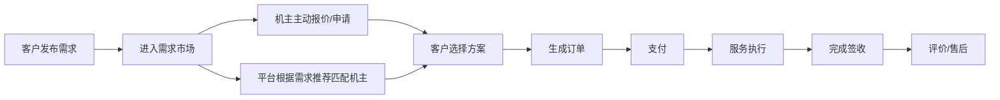

> **补充说明：供给侧反向推荐机制**
>
> 客户发布需求后，撮合不应只依赖机主主动浏览和报价。平台应根据需求的地址、时间、货物参数、履约能力等，自动匹配合适的机主并推荐给客户。这样做的好处是：
>
> - 降低客户等待成本，不必被动等机主来报价
> - 提升需求的成单转化率
> - 让优质但不活跃的机主也能被触达
>
> 同时，平台也应将匹配到的需求主动推送给合适的机主，形成双向撮合。

### 5.2 客户直达订单链路

除了"发布需求 → 市场撮合"的标准链路外，平台还支持客户直接向指定机主下单。

#### 5.2.1 适用场景

- 客户与某个机主已有过合作经验，希望直接复购
- 客户通过机主的供给详情页，直接发起服务请求
- 客户从平台推荐的机主列表中，直接选定并下单

#### 5.2.2 与标准链路的区别

| 对比项 | 标准链路（需求撮合） | 直达订单 |
|-------|-------------------|---------|
| 起点 | 客户发布需求 | 客户选定机主 |
| 撮合方式 | 多个机主报价，客户选择 | 客户直接指定机主 |
| 是否生成需求对象 | 是 | 否，直接创建来源为供给的待确认订单 |
| 报价环节 | 有，机主主动报价 | 可选，机主可按供给挂牌价直接确认 |
| 飞手候选报名 | 支持（需求公开阶段） | 不支持（无公开需求阶段） |

#### 5.2.3 直达订单流程

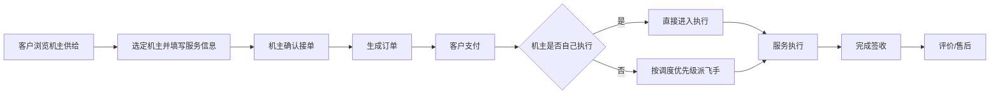

#### 5.2.4 边界约束

- 客户提交直达下单后，系统立即创建 `order_source = supply_direct` 的订单，初始状态为 `pending_provider_confirmation`
- 机主确认后，订单进入 `pending_payment`；机主拒绝后，订单进入 `provider_rejected`
- `provider_rejected` 为终态，订单不可复活；客户可查看拒绝原因（`provider_reject_reason`），需重新发起下单
- 客户可基于同一供给重新发起直达下单（生成新订单），不受已拒绝订单限制
- 直达订单的订单责任字段与标准订单完全一致（第 8 节）
- 直达订单中 `demand_id` 为空，`source_supply_id` 必填，表示该订单来源于供给而非需求市场
- 直达订单不经过公开需求阶段，因此不会产生候选飞手池，机主需从绑定飞手或普通飞手池中选择执行人

**直达下单价格确定规则：**

- 直达下单的订单金额直接采用供给的挂牌价（`base_price_amount`），不做二次计算
- 挂牌价的含义由 `pricing_unit` 决定：`per_trip`（按架次）、`per_km`（按公里）、`per_hour`（按小时）、`per_kg`（按公斤）
- 当 `pricing_unit` 不是 `per_trip` 时，客户下单时需填写预估用量（距离/时长/重量），系统按 `base_price_amount × 预估用量` 计算预估总价
- 预估总价作为订单的 `total_amount`，实际结算时可根据飞行记录中的真实数据调整（多退少补）
- 机主确认订单时可以看到预估总价，确认即表示接受该价格基准
- 需求转单场景的价格由机主报价决定（`demand_quotes.price_amount`），不使用挂牌价

### 5.3 机主主链路

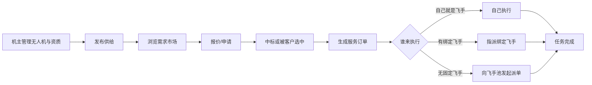

### 5.4 绑定飞手机制

`绑定飞手` 应该作为正式机制写入设计文档，不能只在主链路图里一句带过。

它的定位是：

- 建立 `机主` 与 `飞手` 之间的长期协作关系
- 用于优先调度固定合作飞手
- 让机主承接订单后，可以先从自己的稳定执行班底中选人

#### 5.4.1 绑定飞手的作用

- 形成机主自己的 `专属飞手池`
- 降低每次接单后重新找飞手的成本
- 提升执行稳定性、默契度和履约成功率
- 便于后续做固定分账、绩效、排班、服务区域协同

#### 5.4.2 绑定飞手不等于强制归属

绑定飞手建议理解为：

- `优先合作关系`

而不是：

- 劳动雇佣关系
- 唯一排他关系
- 一绑定就自动派单

也就是说，飞手可以与某个机主建立长期合作，但正式执行哪一笔任务，仍应以具体派单接受为准。

#### 5.4.3 推荐调度优先级

机主拿到订单后，执行人选择顺序建议如下：

1. 若机主本人具备飞手能力，可选择自己执行
2. 若有合适的绑定飞手，优先从绑定飞手中指派
3. 若没有合适的绑定飞手，且该需求已有报名候选飞手，则优先向候选飞手池派单
4. 若以上都不满足，再扩展到普通飞手池

这样做的原因是：

- 固定合作飞手的确定性最高
- 候选飞手池的任务意愿最强
- 普通飞手池作为兜底补充

#### 5.4.4 推荐流程

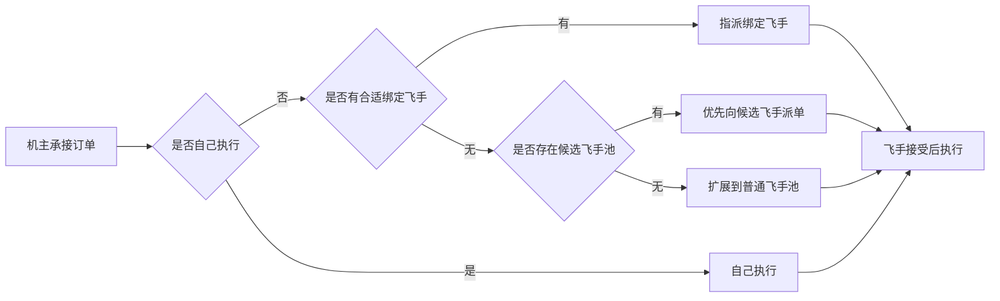

#### 5.4.5 边界约束

绑定飞手不应自动获得以下权利：

- 不应自动看到机主全部订单
- 不应未经派单确认直接进入执行
- 不应自动共享所有收益权限

建议绑定飞手默认只拥有：

- 被机主优先指派的资格
- 查看与自己相关的任务
- 接受/拒绝机主派单的权利

#### 5.4.6 与报名候选的关系

这两个机制不要混为一谈：

- `绑定飞手`：长期合作关系，偏组织内部调度
- `报名候选`：对公开需求表达意愿，偏市场撮合阶段预热

可以理解为：

- 绑定飞手解决“我平时和谁合作”
- 报名候选解决”这笔需求当前谁愿意执行”

#### 5.4.7 绑定关系的建立与解除

绑定飞手是一个正式的关系对象，需要有明确的生命周期。

**发起方式：**

- 机主邀请飞手：机主在平台上搜索或浏览飞手，发起绑定邀请
- 飞手申请加入：飞手浏览机主信息后，主动申请成为其绑定飞手

**确认机制：**

- 绑定关系必须双方确认才生效，单方发起不自动生效
- 被邀请方/被申请方有权拒绝

**绑定关系生命周期：**

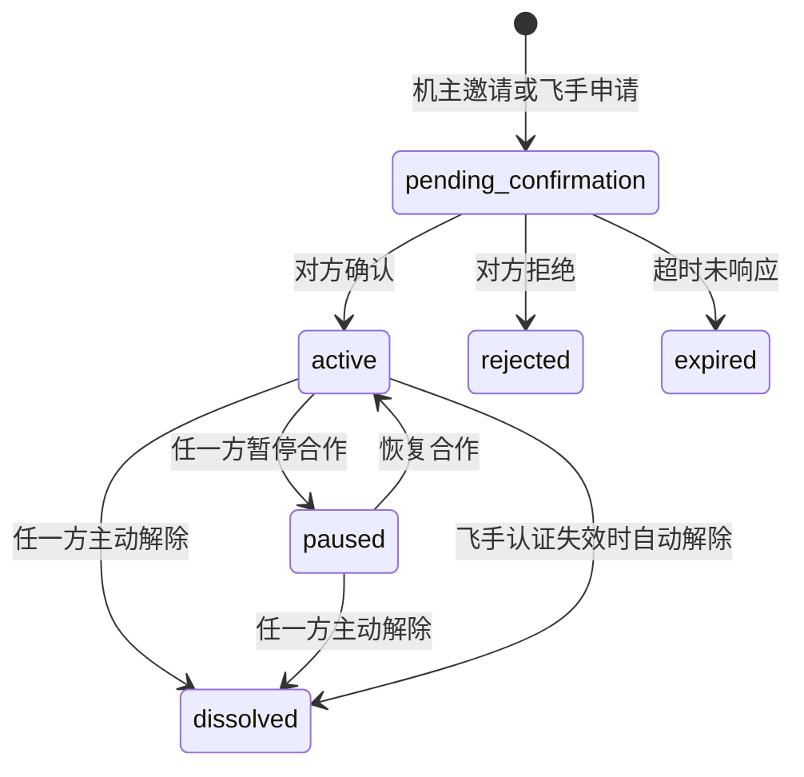

**绑定关系字段说明：**

- `initiated_by`：记录发起方，取值为 `owner`（机主邀请）或 `pilot`（飞手申请）
- 发起方和确认方是互补的：`initiated_by=owner` 时，由飞手确认；反之亦然

**解除规则：**

- 机主和飞手任一方均可主动解除绑定关系
- 解除后，该飞手不再出现在机主的专属飞手池中
- 已经进行中的派单任务不受绑定解除影响，仍需正常履约完成
- 飞手认证过期或被平台取消资质时，其所有绑定关系自动解除

**数量约束建议：**

- 一个飞手可以绑定多个机主（非排他）
- 一个机主可以绑定的飞手数量建议设上限（如 20 人），防止无效膨胀
- 具体上限可根据运营数据后续调整

### 5.5 飞手主链路

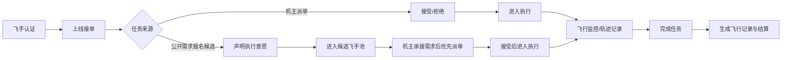

### 5.6 飞手报名候选机制

这里的 `报名候选`，指的是飞手对 `客户发布的公开需求` 先表达“我具备执行意愿和能力”，但并不是直接把完整订单接走。

它的定位不是“抢单成功”，而是“提前进入这笔需求的执行候选池”。

补充一条边界规则：

- 只有允许机主后续派飞手执行的公开需求，才开放飞手报名候选入口

也就是说，报名候选不是所有需求的默认能力，而是面向后续存在飞手调度可能的需求开放。

#### 5.6.1 作用

- 让平台提前判断这笔需求是否具备执行可行性
- 让机主在承接需求之后，可以优先从已有意愿的飞手里选人
- 减少机主拿单后从零找飞手的时间成本
- 提升任务成单后的执行确定性

#### 5.6.2 报名的对象

飞手报名的对象是：

- `客户发布的公开需求`

不是：

- 已经生成并归属某个机主的正式订单
- 已经发给某个飞手的正式派单任务

#### 5.6.3 报名后的效果

报名后，飞手进入该需求对应的 `候选飞手池`。

后续如果某个机主承接了这笔需求，平台派单顺序建议如下：

1. 若机主本人具备飞手能力，可选择自己执行
2. 若有合适的绑定飞手，优先从绑定飞手中指派
3. 若没有合适的绑定飞手，则优先展示并触达已报名的候选飞手
4. 若候选飞手无人接单，再扩展到普通飞手池

所以，`报名候选` 的价值不只是“排序加权”，而是：

- 获得优先触达资格
- 获得优先展示资格
- 成为该需求后续执行调度的首选池

补充一条状态规则：

- 候选飞手池的人数变化不会直接改变 `需求主状态`
- 需求是否从 `published` 进入 `quoting`，仍由报价行为驱动，而不是由飞手报名数量驱动

#### 5.6.4 机主视角的意义

对机主来说，报名候选机制的核心好处是：

- 接单前能看到这笔需求是否“有飞手可执行”
- 接单后能快速选人
- 减少因无人可飞导致的接单风险

#### 5.6.5 报名候选与机主报价的信息互通

飞手报名候选和机主报价/申请是并行发生的两个动作，两者之间的信息是否互通，直接影响撮合效率。

**机主视角可见信息：**

- 浏览需求市场时，可以看到每笔需求当前的 `候选飞手数量`（如"已有 3 名飞手候选"）
- 这个信息帮助机主评估接单风险：有飞手候选意味着拿单后不用担心无人可飞
- 机主承接需求后，可以查看候选飞手的资质、评分、服务区域等摘要信息

**飞手视角可见信息：**

- 报名候选时，可以看到该需求当前的 `机主报价数量`（如"已有 2 位机主报价"）
- 这个信息帮助飞手判断该需求的成单概率：有机主报价意味着后续大概率会有派单机会
- 飞手不应看到机主的具体报价金额和方案细节

**不应互通的信息：**

- 飞手不应看到机主的具体身份和报价内容
- 机主在未承接需求前，不应看到候选飞手的详细联系方式
- 避免绕过平台线下直接对接

#### 5.6.6 推荐流程

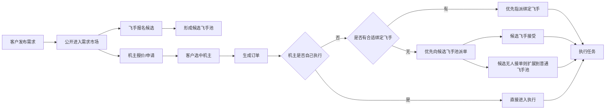

#### 5.6.7 边界约束

报名候选不应直接赋予飞手以下权利：

- 不应直接锁定该需求
- 不应越过机主直接获得完整服务订单归属
- 不应替代正式派单确认流程

正式执行关系，仍应以：

- 订单生成
- 机主选择执行人
- 飞手接受派单

这三个动作作为生效条件
 
## 6. 飞手是否能“直接接单”

这个点建议不要做成一句绝对规则，而是按单子类型判断。

### 6.1 可以直接参与的场景

- 机主发出的 `飞手劳务派单`
- 客户公开需求上的 `候选报名入口`
- 飞手本人同时具备机主身份，且名下有可用无人机，可直接承接完整服务订单

### 6.2 不能直接承接的场景

- 需要无人机资产履约的完整服务订单，但飞手本人没有可用无人机，也不与某个机主形成协作关系

### 6.3 产品表达建议

不要说“飞手不能直接接单”，应改为：

- `飞手可接执行任务`
- `完整服务订单需由具备设备履约能力的机主承接`

这样更准确，也更利于以后扩展更复杂的协作模式。

## 7. 首页信息架构建议

首页不应只是按角色切换，而应同时体现“当前最重要动作”。

### 7.1 客户首页

- 主按钮：`立即发布需求`
- 紧急待办：待确认报价、待选择方案、待支付订单、进行中服务
- 信息流：平台推荐机主、热门供给、服务案例、附近可服务能力

### 7.2 机主首页

- 主按钮：`查看新需求`
- 紧急待办：待报价需求、待处理订单、待指派飞手
- 经营数据：供给浏览量、报价转化、今日订单、设备状态

### 7.3 飞手首页

- 主按钮：`待接派单`
- 紧急待办：待响应派单、今日执行任务、异常告警
- 信息流：附近可报名任务、可服务区域热度、个人执行数据

### 7.4 复合身份首页

默认进入 `综合驾驶舱`，分三块：

- 获客：新需求、待报价
- 执行：待接派单、进行中任务
- 资产：无人机状态、资质到期提醒

## 8. 订单责任关系建议

在订单中不要只存一个 `user_type`，建议明确以下字段：

| 字段 | 含义 |
|------|------|
| order_source | 订单来源，取值为 `demand_market` 或 `supply_direct` |
| demand_id | 关联的原始需求，需求转单时必填 |
| source_supply_id | 关联的原始供给，直达下单时必填 |
| client_user_id | 客户 |
| provider_user_id | 承接服务方，通常是机主 |
| drone_owner_user_id | 无人机所属人 |
| executor_pilot_user_id | 实际执行飞手 |
| drone_id | 执行设备 |
| dispatch_task_id | 对应的飞手派单任务 |

这样才能解释清楚：

- 这笔订单从哪个需求转化而来
- 谁下单
- 谁接单
- 谁飞
- 谁拿设备分成
- 谁承担执行责任

> **补充说明：为什么 demand_id 必须保留**
>
> 对于由需求市场转化而来的订单，`demand_id` 必须保留。如果订单表里不关联原始需求，后续做需求转化率分析、需求市场热度统计、客户需求满足率等运营指标都会断链。
>
> 对于直达下单场景，订单不经过需求对象，因此 `demand_id` 为空，但必须通过 `order_source = supply_direct + source_supply_id` 保留来源追溯能力。

> **补充说明：provider_user_id 与 drone_owner_user_id 的关系**
>
> 在当前设计中，机主既是服务承接方也是无人机所有人，因此 `provider_user_id` 与 `drone_owner_user_id` 在绝大多数场景下值相同。之所以拆成两个字段，是为了预留以下扩展可能：
>
> - 未来如果引入"设备租赁"模式（机主 A 将无人机租给机主 B 使用），两个字段会不同
> - 未来如果引入"服务商/团队"概念，服务商名下可能挂载多个机主的设备
>
> **当前阶段实现建议：** 两个字段同时写入同一个机主的 user_id，代码层面不需要做差异化处理。但数据库建表时保留两个独立字段，不要合并。

## 9. 生命周期建议

### 9.1 需求生命周期

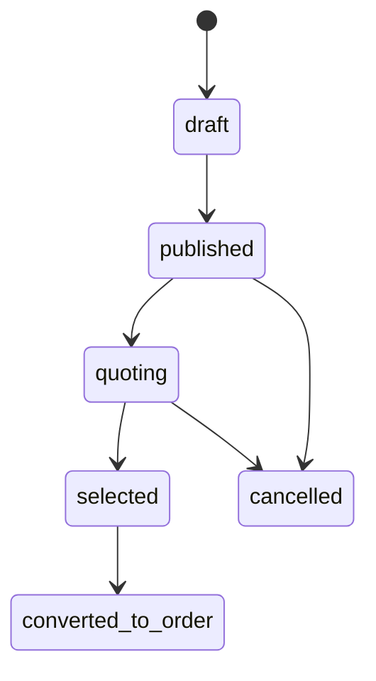

### 9.2 供给生命周期

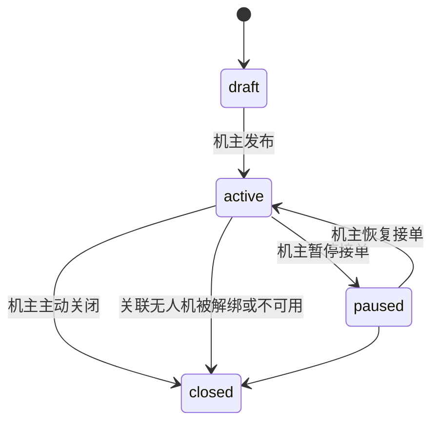

> **补充说明**
>
> - `active` 状态的供给才会出现在需求市场的匹配池中
> - 机主暂停接单（如设备维护、飞手不足等）时，供给进入 `paused`，不再参与撮合，但数据保留
> - 当供给关联的无人机被解绑、适航证过期或保险失效时，系统应自动将供给降级为 `paused` 并通知机主
> - 当机主重新提交关键资质并回到 `pending` 审核中时，系统也应立即将对应供给降级为 `paused`，避免待审设备继续暴露在主市场
> - legacy 供给若原始 `rental_offers.status = active`，且关联无人机重新满足重载门槛与关键资质要求后，可自动从 `paused` 恢复为 `active`
> - `closed` 为终态，如需重新供给应创建新记录

### 9.3 订单生命周期

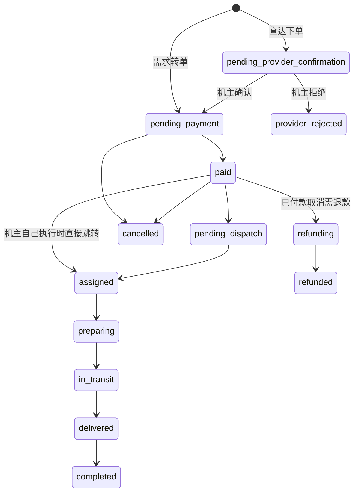

**执行阶段状态推进规则：**

| 状态变更 | 触发方 | 触发方式 |
|----------|--------|----------|
| `assigned → preparing` | 执行飞手 | 飞手在派单任务中点击"开始准备" |
| `preparing → in_transit` | 系统 | 飞手上报起飞或系统检测到首个飞行位置点 |
| `in_transit → delivered` | 执行飞手 | 飞手到达目的地后点击"确认投送" |
| `delivered → completed` | 客户 / 系统 | 客户确认签收；或投送后 24 小时无操作，系统自动确认 |

说明：

- 自执行场景下，机主即飞手，状态推进操作入口在订单详情页
- 派单场景下，飞手通过派单任务详情页推进状态，订单状态同步更新
- 每次状态推进都应写入 `dispatch_logs`（派单场景）或 `order_status_logs`（通用）

> **补充说明：自执行快捷路径**
>
> 当机主同时具备飞手身份并选择自己执行时，订单从 `paid` 可直接跳转到 `assigned`，跳过 `pending_dispatch` 阶段。此时 `executor_pilot_user_id` 与 `provider_user_id` 为同一人，无需生成独立的派单任务。
>
> **补充说明：直达下单待确认路径**
>
> 当客户从供给详情页直接发起下单时，订单先进入 `pending_provider_confirmation`。只有机主确认后才进入 `pending_payment`，这一步是为了避免在没有服务方确认的情况下要求客户付款。

### 9.4 派单生命周期

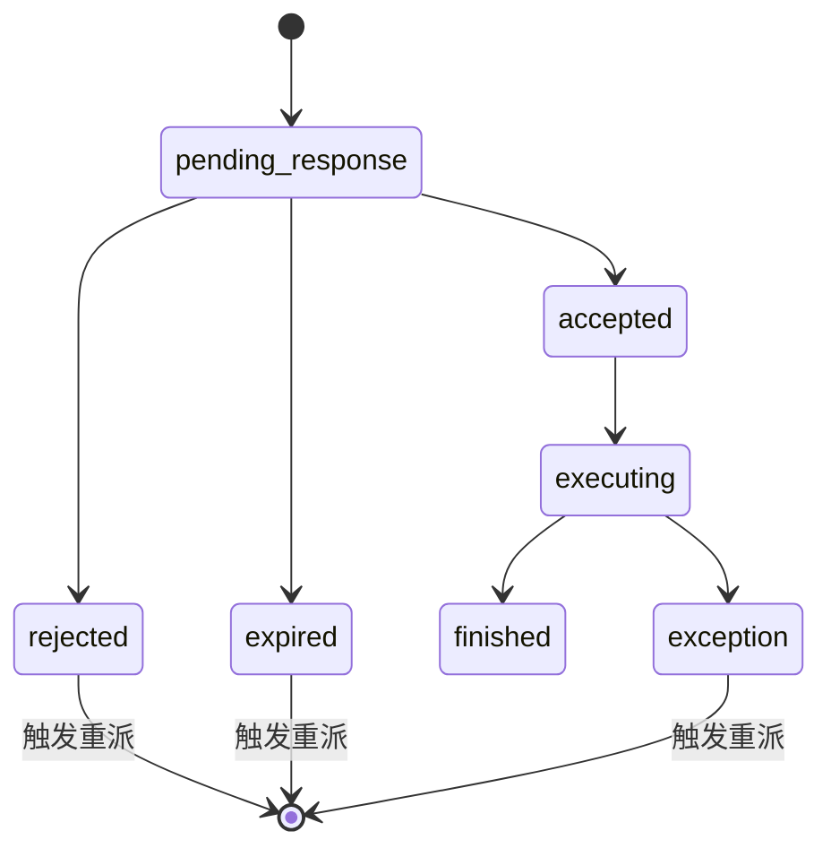

> **补充说明：派单被拒绝/超时/异常后的重派机制**
>
> 当派单进入 `rejected`、`expired` 或 `exception` 状态时，系统应自动触发重派流程，而非等待机主手动操作。
>
> **重派流程：**
>
> 1. 当前派单标记为终态（rejected / expired / exception）
> 2. 系统按调度优先级自动生成新的派单任务，跳过已拒绝/已超时的飞手
> 3. 若当前优先级层（如绑定飞手）已无可用人选，自动降级到下一层（候选飞手池 → 普通飞手池）
> 4. 若所有层级均无人接单，订单状态回退到 `pending_dispatch`，并通知机主手动处理
> 5. 机主可选择：重新发起派单、更换无人机、或与客户协商取消
>
> **重派次数限制：**
>
> - 同一订单的自动重派建议设上限（如 3 次），超过后转人工处理
> - 每次重派应记录原因和被跳过的飞手，便于后续分析调度效率

> **补充说明：调度优先级统一口径**
>
> 为避免文档不同章节出现冲突，机主承接订单后的执行人选择顺序统一为：
>
> 1. 机主本人可执行时，优先自己执行
> 2. 其次优先指派合适的绑定飞手
> 3. 若无合适绑定飞手，再优先触达该需求的候选飞手池
> 4. 候选飞手池无人接受时，再扩展到普通飞手池

### 9.5 飞行记录创建时机与多架次规则

**创建时机：**

- 当执行人调用"已起飞"接口（`POST /api/v2/orders/{order_id}/start-flight`）时，系统自动创建一条 `flight_records` 记录
- 飞行记录与订单为多对一关系：一个订单可以对应多条飞行记录，每条记录代表一个架次
- 首次起飞时创建第一条飞行记录；若订单有多架次需求（`estimated_trip_count > 1`），后续每次起飞创建新的飞行记录

**多架次处理规则：**

- 每条飞行记录独立记录起飞时间、降落时间、飞行距离、最大高度等
- 订单级别的飞行统计（总飞行时长、总距离等）由所有关联飞行记录聚合计算
- 只有当所有架次都完成后，执行人才能上报"已投送"推进订单状态
- 飞行记录的 `flight_no` 格式建议为 `{order_no}-F{序号}`，如 `ORD20260312001-F1`

**飞行记录生命周期：**

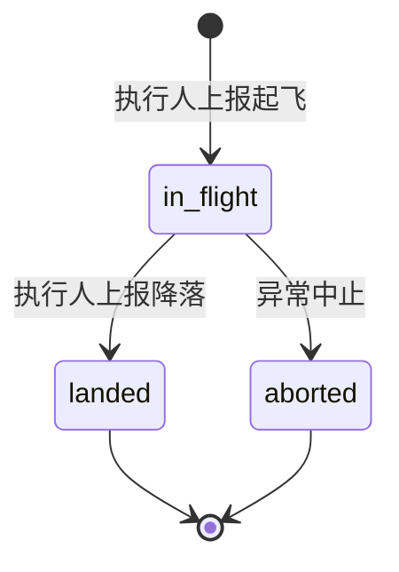

### 9.6 结算规则

**结算触发时机：**

- 订单进入 `completed` 后，进入结算等待期（T+3 自然日）
- 等待期内客户或机主可发起争议，争议期间冻结结算
- 等待期结束且无争议时，系统自动触发结算，将资金从平台托管账户分账到各方钱包

**分账规则：**

| 角色 | 分账说明 |
|------|----------|
| 平台 | 按订单金额的固定比例抽成（初始建议 10%），即 `platform_fee_amount = total_amount × platform_fee_rate` |
| 机主（承接方） | `provider_income_amount = total_amount - platform_fee_amount - pilot_income_amount` |
| 飞手（执行人） | 由机主与飞手的合作协议决定，平台不强制；默认 `pilot_income_amount = 0`（机主线下结算给飞手） |

**自执行场景：**

- 当 `execution_mode = self_execute` 时，机主即飞手，`pilot_income_amount = 0`
- 机主获得 `total_amount - platform_fee_amount` 的全部收入

**按量计价的结算调整：**

- 当 `pricing_unit` 不是 `per_trip` 时，订单完成后系统根据飞行记录中的真实数据（实际距离/时长/重量）计算实际金额
- 若实际金额与预估金额存在差异，生成结算调整单（多退少补）
- 调整幅度超过预估金额 20% 时，需人工审核后再结算

**结算状态：**

- `pending`：等待结算（T+3 等待期内）
- `processing`：结算处理中
- `completed`：已结算到账
- `frozen`：因争议冻结
- `adjusted`：因按量计价差异已调整

## 10. 异常处理与责任链

大型载重运货无人机的作业场景，异常是高频事件。本章节不定义所有细节，但明确异常处理的基本原则和责任归属链路。

### 10.1 异常分类

| 异常类型 | 典型场景 | 影响阶段 |
|---------|---------|---------|
| 执行人异常 | 飞手接了派单但临时无法执行（身体原因、证件过期等） | 执行中 |
| 设备异常 | 无人机故障、电池异常、适航证过期 | 执行前/执行中 |
| 货物异常 | 货物损坏、丢失、重量与申报不符 | 执行中/完成后 |
| 客户异常 | 客户取消已付款订单、变更需求内容 | 任意阶段 |
| 环境异常 | 天气不满足飞行条件、空域临时管制 | 执行前/执行中 |

### 10.2 责任归属原则

核心原则：**谁承诺、谁担责，按订单角色字段定责**。

| 责任主体 | 承担范围 |
|---------|---------|
| 客户 (client_user_id) | 需求信息准确性、货物申报真实性、按约支付 |
| 服务方/机主 (provider_user_id) | 服务方案可行性、设备可用性、飞手调度、整体履约 |
| 无人机所有人 (drone_owner_user_id) | 设备安全性、适航合规、保险覆盖、维护状态 |
| 执行飞手 (executor_pilot_user_id) | 飞行操作规范性、任务执行质量、异常现场处置 |

> 当 `provider_user_id` 与 `drone_owner_user_id` 为同一人时，设备和服务责任合并承担。
> 当 `provider_user_id` 与 `executor_pilot_user_id` 为同一人时（机主+飞手自执行），全链路责任由一人承担。

### 10.3 关键异常处理流程

#### 飞手临时无法执行

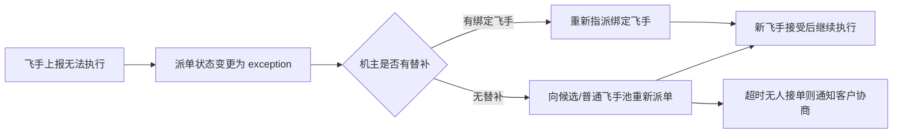

#### 设备故障

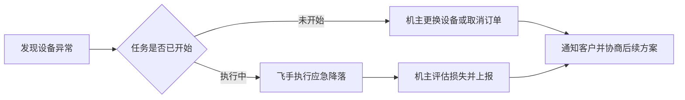

#### 客户取消已付款订单

| 取消时机 | 退款规则建议 |
|---------|------------|
| 付款后、派单前 | 全额退款 |
| 已派单、飞手未出发 | 扣除平台服务费后退款 |
| 飞手已出发/执行中 | 按实际产生成本扣除后退款，飞手和机主应获得对应补偿 |
| 任务已完成 | 不可取消，走售后/争议流程 |

### 10.4 争议处理原则

- 所有争议以平台订单数据、飞行轨迹记录、设备日志为核心证据
- 平台作为撮合方，在争议中承担调解角色，而非默认兜底赔付方
- 建议后续引入保险机制，将高风险场景（货物损坏、设备事故）的赔付转移给保险方

## 11. 为后续重构必须先定稿的规则

这一章的目的，不是补充概念，而是把后续重构时最容易反复修改、最容易导致返工的规则提前写死。

### 11.1 角色判定的单一口径

后续重构时，必须废弃“靠 `user_type` 单字段判断全部角色”的方式，改为“账号 + 档案 + 能力状态”三层判定。

建议统一为：

| 层 | 判定方式 | 用途 |
|----|----------|------|
| 账号 | `users` 存账号基础信息 | 登录、实名、消息、钱包 |
| 档案 | `client_profile / owner_profile / pilot_profile` | 判断用户拥有哪些业务身份 |
| 能力状态 | 资质、设备、接单状态、在线状态 | 判断某个身份当前是否可用 |

对应业务判断规则建议固定为：

- `客户`：注册即拥有，自动创建 `client_profile`
- `机主身份存在`：拥有 `owner_profile`
- `机主可发布供给`：存在可用无人机，且关键资质有效
- `飞手身份存在`：拥有 `pilot_profile`
- `飞手可接派单`：飞手已审核通过，且状态为在线
- `机主+飞手`：同时存在 `owner_profile` 和 `pilot_profile`

这条规则非常关键。后续前后端所有页面展示、按钮显隐、权限校验，都应基于这套口径。

### 11.2 权限与可见性矩阵

如果这部分不提前写清，后续页面和接口一定会出现“这个人到底该不该看见”的反复扯皮。

| 对象 | 客户 | 机主 | 飞手 |
|------|------|------|------|
| 公开需求摘要 | 可见自己发布和平台公开信息 | 可见可报价需求 | 仅可见允许报名候选的需求摘要 |
| 机主报价详情 | 仅客户本人可见完整内容 | 机主仅可见自己报价 | 不可见 |
| 候选飞手摘要 | 客户默认不可见 | 机主承接后可见摘要 | 仅可见自己状态 |
| 正式订单 | 订单相关方可见 | 承接机主可见 | 被指派飞手可见 |
| 派单任务 | 不可见 | 发起派单的机主可见 | 被派单飞手可见 |
| 飞行监控 | 客户可看订单级监控 | 机主可看执行监控 | 执行飞手可操作 |

建议再明确两条约束：

- 客户不直接接触候选飞手联系方式
- 飞手不直接接触未承接需求中的机主详细身份和报价内容

### 11.3 订单生成与快照规则

后续重构里，`订单` 必须是一个快照对象，而不是运行时实时拼装的视图。

订单创建时，建议一次性固化以下信息：

- 需求标题、地址、时间、货物信息
- 客户信息快照
- 被选中的机主与无人机
- 最终成交价格与计费规则
- 是否自执行
- 是否需要派单
- 初始执行人

这意味着：

- 订单生成后，原需求再修改，不应反向污染订单
- 订单是履约对象，需求是撮合来源对象
- 一条需求同一时间只能对应一个有效履约订单

同时补充两条来源规则：

- `order_source = demand_market` 时，必须保留 `demand_id`
- `order_source = supply_direct` 时，必须保留 `source_supply_id`，且订单初始状态为 `pending_provider_confirmation`

### 11.4 编号体系必须独立

为了避免后续列表、通知、日志全串在一起，建议在文档里明确多套编号：

- `demand_no`：需求编号
- `supply_no`：供给编号
- `quote_no`：报价/申请编号
- `order_no`：订单编号
- `dispatch_no`：派单任务编号
- `flight_no`：飞行记录编号

后续页面展示也必须区分：

- 客户看到的是需求编号、订单编号
- 机主看到的是订单编号、派单编号
- 飞手看到的是派单编号、飞行记录编号

不要再把不同业务对象混用一套编号。

### 11.5 自动触发事件必须前置定义

很多逻辑漏洞不是因为流程错，而是因为“该自动做什么”没写清楚。

建议提前固定以下自动触发规则：

| 事件 | 自动动作 |
|------|----------|
| 客户发布需求 | 推送给匹配机主；若允许候选报名，则开放飞手候选入口 |
| 需求到达 `expires_at` 仍未转单 | 自动关闭需求（`published/quoting → expired`），通知客户 |
| 客户发起直达下单 | 创建 `pending_provider_confirmation` 订单并通知机主确认 |
| 机主报价 | 更新需求状态、通知客户 |
| 客户选中机主 | 生成订单，关闭其他报价竞争状态 |
| 机主确认直达订单 | 订单进入 `pending_payment`，通知客户支付 |
| 机主拒绝直达订单 | 订单进入 `provider_rejected`（终态），通知客户 |
| 订单支付成功 | 进入 `pending_dispatch` 或直接 `assigned` |
| 派单被拒绝/超时 | 自动重派 |
| 绑定飞手邀请/申请超时未响应 | 自动标记为 `expired`，通知发起方 |
| 无人机不满足重载准入门槛 | 阻止供给生效，并从匹配池中移除 |
| 无人机资质失效 | 自动暂停供给，阻止继续承接 |
| 无人机关键资质重新提交审核 | 供给立即回退到 `paused`，待审核通过后再恢复可见 |
| 飞手认证失效 | 自动解除所有绑定关系 |
| 飞手状态离线 | 不再进入派单候选池 |

后续代码实现时，应优先围绕这些事件做状态机和通知系统，而不是散落在页面按钮里硬写。

### 11.6 平台边界与准入规则

这部分建议在重构前就固定，避免后面页面、运营和数据迁移出现偏差。

- 平台主服务类型固定为 `heavy_cargo_lift_transport`
- 主准入门槛固定为 `mtow_kg >= 150` 且 `max_payload_kg >= 50`
- 低于门槛的历史无人机与供给不删除，但不进入主市场匹配池
- 需求和供给都必须带有 `cargo_scene`，用于后续筛选、推荐和运营分析
- 空域报备、天气、地形、装卸点条件属于重载吊运的默认前置校验，不视为可选增强项（注：短距吊运只需空域报备，不涉及航线规划/审批）
- 页面和文案禁止使用“外卖”“闪送”“同城快递”“干线物流”等与平台边界不符的表达

### 11.7 推荐的最终业务结构图

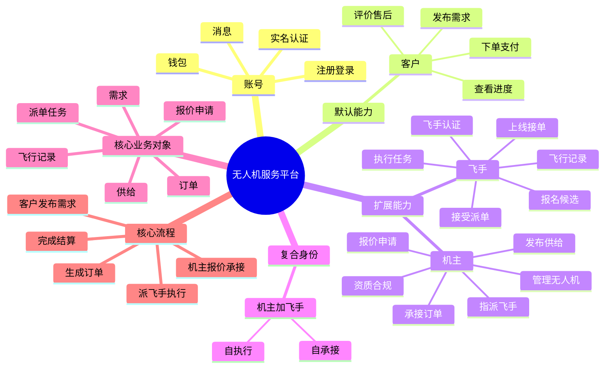

## 12. 对当前项目的完整改造建议

这一章不再以“最小代价改造”为目标，而以“后续真正重构项目时最省总成本”为目标。

### 12.1 总体原则

后续正式重构时，建议采用以下原则：

- 以本文档为业务真相源，而不是迁就当前代码结构
- 优先重构领域模型，再改页面和接口
- 对会长期保留的表、接口、页面重新命名，不做历史包袱兼容命名
- 当前 `mock`、`临时映射`、`前端兜底判断` 尽量在本轮一起清掉
- 重构目标不是“能跑”，而是让业务对象边界清楚，后续好扩展

### 12.2 建议的目标模块划分

后续后端建议按领域重组，而不是继续按零散页面功能堆积：

1. `account`
负责账号、实名、消息、钱包、基础资料。

2. `client`
负责客户档案、需求发布、需求管理、下单入口。

3. `owner`
负责机主档案、无人机、供给、绑定飞手、报价能力。

4. `pilot`
负责飞手档案、资质认证、在线状态、执行记录。

5. `matching`
负责需求匹配、报价流转、候选飞手池、推荐逻辑。

6. `order`
负责订单生成、订单快照、履约状态流转。

7. `dispatch`
负责派单任务、重派、执行人确认。

8. `flight`
负责飞行监控、轨迹、告警、飞行记录。

9. `settlement`
负责支付、退款、分账、赔付、售后证据。

如果继续沿用现有“接口有了就挂一个 handler”的方式，后面再改一次仍然会痛。

### 12.3 建议的目标数据模型

为了让后续改造更顺，建议目标模型按下面收敛：

#### 基础表

- `users`
- `client_profiles`
- `owner_profiles`
- `pilot_profiles`

#### 供给与协作表

- `drones`
- `drone_certifications`
- `owner_supplies`
- `owner_pilot_bindings`

#### 撮合表

- `demands`
- `demand_quotes`
- `demand_candidate_pilots`
- `matching_logs`

#### 履约表

- `orders`
- `order_snapshots`
- `dispatch_tasks`
- `dispatch_logs`
- `flight_records`
- `flight_positions`
- `flight_alerts`

#### 财务与证据表

- `payments`
- `refunds`
- `settlements`
- `dispute_records`
- `evidence_attachments`

这里最重要的不是表名，而是把“撮合阶段”和“履约阶段”拆开。

### 12.4 建议的关键字段改造

当前项目后续重构时，建议把这些字段作为强制保留项：

#### `demands`

- `demand_no`
- `client_user_id`
- `status`
- `service_address`
- `service_time`
- `cargo_snapshot`
- `allows_pilot_candidate`

#### `owner_supplies`

- `supply_no`
- `owner_user_id`
- `drone_id`
- `status`
- `service_scope`
- `availability_rule`

#### `orders`

- `order_no`
- `demand_id`
- `client_user_id`
- `provider_user_id`
- `drone_owner_user_id`
- `executor_pilot_user_id`
- `drone_id`
- `dispatch_task_id`
- `needs_dispatch`
- `execution_mode`

#### `dispatch_tasks`

- `dispatch_no`
- `order_id`
- `provider_user_id`
- `target_pilot_user_id`
- `dispatch_source`
- `status`
- `retry_count`

尤其建议增加两个字段：

- `needs_dispatch`
- `execution_mode`

这样很多页面和状态判断可以变得非常简单：

- 自执行：`needs_dispatch = false`，`execution_mode = self_execute`
- 指派绑定飞手：`needs_dispatch = true`，`execution_mode = bound_pilot`
- 候选/普通派单：`needs_dispatch = true`，`execution_mode = dispatch_pool`

### 12.5 后端接口重构建议

建议不要继续在旧接口上小修小补，而是整体按业务对象重列接口。

#### 客户端

- `/client/profile`
- `/demands`
- `/demands/:id`
- `/demands/:id/quotes`
- `/demands/:id/select-provider`

#### 机主端

- `/owner/profile`
- `/owner/drones`
- `/owner/supplies`
- `/owner/bindings`
- `/owner/demands/recommended`
- `/owner/quotes`

#### 飞手端

- `/pilot/profile`
- `/pilot/availability`
- `/pilot/candidate-demands`
- `/pilot/dispatch-tasks`
- `/pilot/flight-records`

#### 履约端

- `/orders`
- `/orders/:id`
- `/orders/:id/dispatch`
- `/dispatch/:id/accept`
- `/dispatch/:id/reject`
- `/orders/:id/monitor`

重构时建议保留旧接口一段时间只用于数据比对，但新页面和新服务层应直接走新接口，不要混用。

### 12.6 前端页面重构建议

移动端后续重构时，建议以业务域重排页面，而不是继续按历史 tab 内容堆叠。

#### 首页

- 综合驾驶舱
- 客户驾驶舱
- 机主驾驶舱
- 飞手驾驶舱

#### 市场域

- 需求市场
- 我的需求
- 我的报价
- 我的供给

#### 履约域

- 我的订单
- 派单任务
- 飞行监控
- 飞行记录

#### 我的域

- 客户档案
- 机主档案
- 飞手档案
- 绑定飞手
- 我的无人机

建议原则：

- `订单` 与 `派单任务` 分开
- `需求市场` 与 `我的订单` 分开
- `绑定飞手` 放入机主域，不放入飞手域
- `飞行记录` 只对飞手和相关订单方开放

### 12.7 状态与通知系统重构建议

后续如果不把通知和状态机一起重构，页面会继续出现“外面显示一个状态，里面显示另一个状态”的问题。

建议统一：

- 所有列表状态都来自同一套后端状态枚举
- 页面不自行推导业务状态名
- 所有自动流转都写入日志表
- 所有关键状态变化都触发通知事件

至少应覆盖以下通知：

- 需求发布成功
- 机主报价成功
- 客户选中机主
- 订单支付成功
- 飞手收到派单
- 飞手拒绝/超时
- 自动重派
- 任务完成
- 退款发起/完成

### 12.8 数据迁移建议

真正重构项目时，最怕的是代码改完了，历史数据接不上。

建议数据迁移按下面原则执行：

1. 新表先建，不直接覆盖旧表
2. 写数据迁移脚本，将旧数据映射到新模型
3. 对历史订单补齐 `demand_id / dispatch_task_id / execution_mode`
4. 对历史用户补齐 `client_profile / owner_profile / pilot_profile`
5. 对旧页面和新页面并行校验一段时间
6. 确认新模型稳定后，再逐步下线旧字段和旧接口

尤其注意：

- `user_type` 不要再作为业务主判断字段
- 老订单如果缺执行人信息，必须补齐映射规则
- 旧的飞手任务和订单展示逻辑，要统一回新状态机

### 12.9 推荐的实际重构顺序

为了后续真正开工时效率最高，建议按下面顺序推进：

1. 先定稿本文档
2. 画出目标数据库关系图
3. 定义状态枚举与字段字典
已补充字段字典：[BUSINESS_FIELD_DICTIONARY.md](./BUSINESS_FIELD_DICTIONARY.md)
已补充数据库关系与迁移方案：[BUSINESS_DATABASE_MIGRATION_PLAN.md](./BUSINESS_DATABASE_MIGRATION_PLAN.md)
4. 重写后端领域模型与迁移脚本
5. 重写核心接口：需求、报价、订单、派单
6. 重写首页、订单页、派单页
7. 最后接飞行监控、支付、结算、通知

不要反过来先改 UI。否则页面会一直被后端旧结构拖住。

### 12.10 这份文档后续还建议补充什么

如果是为了让我后面真正高效重构项目，我建议围绕这份主文档，持续维护以下配套文档：

1. `字段字典`
明确每个核心表、每个状态枚举、每个字段含义。
已补充：[BUSINESS_FIELD_DICTIONARY.md](./BUSINESS_FIELD_DICTIONARY.md)

2. `页面信息架构`
明确首页、订单页、派单页、我的页分别展示什么卡片、按钮、状态。
已补充：[BUSINESS_PAGE_INFORMATION_ARCHITECTURE.md](./BUSINESS_PAGE_INFORMATION_ARCHITECTURE.md)

3. `接口契约`
明确关键接口的 request / response 结构，避免前后端重构时反复对齐。
已补充：[BUSINESS_API_CONTRACT.md](./BUSINESS_API_CONTRACT.md)

4. `数据库关系与迁移方案`
明确目标表关系、旧表到新表的映射规则，以及实际切换顺序。
已补充：[BUSINESS_DATABASE_MIGRATION_PLAN.md](./BUSINESS_DATABASE_MIGRATION_PLAN.md)

5. `重构任务总表`
把业务文档、字段、页面、接口、迁移拆成可执行任务，并在后续重构过程中持续勾选更新。
已补充：[REFACTOR_MASTER_TASKLIST.md](../planning/REFACTOR_MASTER_TASKLIST.md)

## 13. 最终结论

这一轮重构文档最终要解决的，不只是“角色怎么命名”或“页面怎么改”，而是把整个平台重新定义成一个 `面向重载末端物资吊运` 的、可持续演进的业务系统。

### 13.1 平台定位已经明确

平台不是泛无人机平台，也不是城市即时配送平台，而是聚焦于以下场景：

- 电力电网建设物资吊运
- 山区竹木、水果、农副产品吊运
- 高原给养运送
- 海岛给养及海鲜产品吊运
- 应急救援物资吊运

因此，整个平台后续所有实现都必须围绕以下边界展开：

- 主服务类型固定为 `heavy_cargo_lift_transport`
- 主准入门槛固定为 `mtow_kg >= 150` 且 `max_payload_kg >= 50`
- 非目标场景，如外卖、同城闪送、轻小件即时配送、干线物流、通用航拍测绘植保巡检，不进入主模型

这意味着：平台后续不是“先做通用，再慢慢收窄”，而是一开始就按垂直重载吊运业务建模。

### 13.2 角色体系已经从“人设”改成“能力+关系”

当前最终角色模型，不再依赖单一 `user_type`，而是：

- `平台账号`：承载登录、实名、消息、钱包等基础能力
- `客户`：默认拥有，负责发需求、下单、付款、查看履约
- `机主`：负责设备、供给、承接服务、指派执行
- `飞手`：负责接派单、执行任务、记录飞行和履约留痕
- `机主+飞手`：负责自承接、自执行的一体化模式

真正定义一笔业务“谁下单、谁承接、谁执行、谁担责、谁分账”的，不是角色名，而是订单里的关系字段。

这也是后续后端、前端、数据迁移统一口径的根基。

### 13.3 核心业务对象已经固定

整个平台后续只围绕五类核心对象展开：

- `需求`
- `供给`
- `订单`
- `派单任务`
- `飞行记录`

这五类对象的边界已经明确：

- `需求` 属于撮合前
- `供给` 属于撮合前
- `订单` 属于撮合完成后的履约合同
- `派单任务` 属于订单执行阶段对飞手发出的正式指令
- `飞行记录` 属于履约过程或结果留痕

也就是说，后续页面、接口、数据库、通知系统，都不允许再把这些对象混成一个“任务列表”或“订单列表”。

### 13.4 两条成单主链路已经固定

平台后续只有两条合法成单路径：

1. `需求市场链路`
- 客户发布需求
- 机主报价/申请
- 客户选定机主
- 生成订单
- 支付
- 执行

2. `供给直达链路`
- 客户浏览供给
- 发起直达下单
- 机主确认
- 生成有效订单
- 支付
- 执行

其中，直达下单已经补齐成一个真正可实现的状态闭环：

- 先创建 `pending_provider_confirmation`
- 机主确认后进入 `pending_payment`
- 机主拒绝后进入 `provider_rejected`
- `provider_rejected` 为终态，不可复活，只能重新下单

这部分已经不再是概念描述，而是可直接指导接口和状态机实现的业务规则。

### 13.5 执行调度逻辑已经固定

订单支付后，执行侧只有一套统一调度逻辑：

1. 机主本人可执行时，优先自己执行
2. 其次优先指派绑定飞手
3. 若无合适绑定飞手，再优先触达候选飞手池
4. 候选飞手池无人接受时，再扩展到普通飞手池

同时，以下规则也已经明确：

- 绑定飞手是长期协作关系，不等于自动获得执行权
- 候选飞手是撮合阶段的执行意愿池，不等于直接接单成功
- 派单任务才是对飞手发出的正式执行指令
- 飞行记录在执行起飞时自动创建，一个订单可以对应多条飞行记录，支持多架次任务

所以，机主、飞手、派单、飞行之间的关系，现在已经具备了完整执行闭环。

### 13.6 订单已经成为唯一履约真相源

重构完成后，订单将承担以下职责：

- 记录来源：来自 `需求市场` 还是 `供给直达`
- 记录参与方：客户、机主、无人机所有人、执行飞手
- 记录执行方式：自执行、绑定飞手、派单池
- 记录执行过程：是否派单、当前执行阶段、飞行记录
- 记录财务过程：支付、退款、结算、评价、争议

因此，后续所有“列表和详情对不上”“外面一个状态里面一个状态”“编号不一致”“执行入口断链”这类问题，都必须通过“订单做真相源”来彻底解决，而不是靠页面层补丁。

### 13.7 实现层的约束也已经足够清楚

按当前文档体系，后续重构的落地原则已经基本定型：

- 后端：按领域重构，不再围绕旧页面零散堆逻辑
- 接口：统一走 `/api/v2`，状态由后端直接返回
- 前端：按业务域重构页面，不再按历史 tab 混排
- 数据库：新表先建、旧表并存、逐步切流
- 迁移：不符合平台范围的数据保留历史查询能力，但不进入 v2 主市场口径
- 通知：围绕状态机和自动触发事件统一设计，不再散落在页面按钮里

这意味着，文档已经从“产品讨论稿”进入了“可直接指导重构”的阶段。

### 13.8 这套文档现在真正的作用

当前这套文档体系，已经不是单一的一篇方案文档，而是一组完整的重构基线：

- 主业务逻辑：`BUSINESS_ROLE_REDESIGN.md`
- 字段与状态口径：`BUSINESS_FIELD_DICTIONARY.md`
- 页面信息架构：`BUSINESS_PAGE_INFORMATION_ARCHITECTURE.md`
- API 契约：`BUSINESS_API_CONTRACT.md`
- 数据库与迁移：`BUSINESS_DATABASE_MIGRATION_PLAN.md`
- 重构执行追踪：`REFACTOR_MASTER_TASKLIST.md`

它们共同定义了：

- 平台是什么
- 平台不是什么
- 业务对象有哪些
- 状态如何流转
- 数据怎么存
- 页面怎么拆
- 接口怎么定义
- 迁移怎么做
- 重构怎么推进

### 13.9 最终判断

到当前这个版本，这套重构方案已经不只是“把角色理顺”，而是已经完成了以下事情：

- 把平台定位从模糊的通用无人机业务，收敛为明确的重载末端吊运平台
- 把角色模型从旧的 `user_type` 思维，重构成 `账号 + 档案 + 能力状态 + 业务关系`
- 把需求、供给、订单、派单任务、飞行记录五类对象彻底拆清
- 把需求转单与直达下单两条交易链路都补成了可执行闭环
- 把执行调度、飞行记录、结算、评价、争议和迁移规则都纳入了统一模型
- 把后续真正动手重构所需的文档基础已经补齐

所以，当前阶段的结论可以明确为：

`这套文档已经可以作为整个平台正式重构的业务真相源和实施基线。`

后续工作的重点，不再是继续抽象业务模型，而是严格按照这套模型进入实现、迁移、校验和切流。
